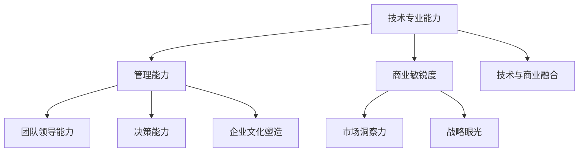

                 

关键词：贾扬清，工程师，CEO，角色转变，技术领导力，企业战略

> 摘要：本文探讨了贾扬清从工程师到CEO的职业转变，分析了这一转变中的核心挑战、所涉及的技能转变以及他对企业文化和战略的深刻影响。本文旨在为希望走上管理层的技术专业人士提供借鉴和启示。

## 1. 背景介绍

贾扬清，一位在计算机视觉和人工智能领域享有盛誉的科学家和企业家，是多家知名企业的创始人或高管。他曾在Facebook担任工程总监，领导了计算机视觉团队，并在深度学习等领域取得了显著成果。2016年，贾扬清联合创办了旷视科技（Megvii），并将其打造成为全球领先的人工智能公司之一。在担任CEO的过程中，他成功带领公司上市，实现了从技术领导者到企业高管的华丽转变。

贾扬清的职业经历展示了从工程师到CEO的转型过程中，技术专业能力和管理能力的平衡与发展。这一转变不仅对贾扬清本人有着重要影响，也为整个行业提供了宝贵的经验。

## 2. 核心概念与联系

在从工程师到CEO的角色转变过程中，贾扬清所面临的挑战和所需的核心能力可以归纳为以下几点：

### 2.1 技术专业能力

作为一位技术专家，贾扬清在工程师阶段积累了丰富的计算机视觉和人工智能领域的专业知识。这些技术背景为他理解业务、制定技术战略提供了坚实的基础。然而，成为一名CEO后，他需要将这些技术知识转化为对企业整体战略的指导，而这要求他不仅需要深入理解技术细节，还需要具备宏观的视野和战略思维。

### 2.2 管理能力

从工程师到CEO的转变，意味着贾扬清需要从专注于个人技术贡献转向领导一个团队，协调各方资源，制定和执行企业战略。这要求他具备出色的沟通能力、团队领导能力和决策能力。同时，他还需要对人力资源管理、财务管理和市场营销等方面有基本的了解。

### 2.3 商业敏锐度

作为CEO，贾扬清需要具备敏锐的商业嗅觉，能够洞察市场趋势，把握行业动态，制定有针对性的商业策略。这要求他不仅要有扎实的业务知识，还要有战略眼光和前瞻性。

### 2.4 技术与商业的融合

在贾扬清的领导下，旷视科技将计算机视觉技术应用于多个行业，实现了技术与商业的完美融合。这一过程中，他需要将技术优势转化为商业价值，打造出具有市场竞争力的产品和服务。

### 2.5 企业文化塑造

作为CEO，贾扬清在企业文化建设中发挥了关键作用。他倡导创新、务实和合作的企业文化，鼓励员工勇于探索、敢于挑战，为公司的长期发展奠定了坚实的基础。

下面是一个使用Mermaid绘制的核心概念与联系的流程图：



## 3. 核心算法原理 & 具体操作步骤

### 3.1 算法原理概述

贾扬清在担任CEO的过程中，成功地将一系列核心算法原理应用于公司战略制定和运营管理。这些算法包括：

- **领导力模型**：贾扬清借鉴了约翰·赫斯特（John Hersey）的领导力模型，将其应用于团队管理和企业文化建设。该模型强调领导者的沟通能力、透明度和责任感。

- **价值链分析**：通过对公司内部业务流程进行分析，贾扬清明确了各个部门在价值链中的角色和贡献，优化了资源配置，提高了运营效率。

- **创新模型**：贾扬清提出了“迭代创新”模型，鼓励员工不断尝试新的技术和方法，快速迭代产品，以适应市场需求。

### 3.2 算法步骤详解

#### 领导力模型

1. **建立信任**：贾扬清通过开放沟通、真诚待人，建立了与员工之间的信任关系。
2. **设定目标**：他明确了公司的长期愿景和短期目标，确保团队朝着共同的方向努力。
3. **激励团队**：贾扬清通过奖励机制和荣誉制度，激发员工的积极性和创造力。

#### 价值链分析

1. **识别核心业务**：贾扬清确定了公司最核心的业务模块，确保资源优先配置。
2. **分析流程**：他对各个业务流程进行了详细分析，找出了瓶颈和优化点。
3. **优化资源配置**：根据分析结果，贾扬清调整了资源分配，提高了运营效率。

#### 创新模型

1. **鼓励尝试**：贾扬清鼓励员工尝试新的技术和方法，允许失败，但要求从失败中汲取经验。
2. **快速迭代**：他提出了“每周迭代”的理念，要求团队不断优化产品，以适应市场需求。
3. **持续改进**：贾扬清强调持续改进，不断调整战略，以保持竞争优势。

### 3.3 算法优缺点

#### 领导力模型

优点：
- 提高了团队凝聚力和工作效率。
- 增强了员工的归属感和忠诚度。

缺点：
- 过度依赖个人魅力，可能导致领导力不稳定。

#### 价值链分析

优点：
- 优化了资源配置，提高了运营效率。
- 有助于公司聚焦核心业务，避免资源分散。

缺点：
- 过于注重流程分析，可能导致创新不足。

#### 创新模型

优点：
- 鼓励了员工勇于尝试，提高了创新意识。
- 快速迭代有助于及时调整战略，适应市场变化。

缺点：
- 过于强调短期效果，可能导致长期规划不足。

### 3.4 算法应用领域

贾扬清所提出的这些算法原理在旷视科技得到了广泛应用，不仅在团队管理和企业文化建设中发挥了重要作用，还在市场战略制定和产品优化方面取得了显著成效。这些算法的应用领域包括：

- **团队管理**：领导力模型和价值链分析用于优化团队结构和提高团队效率。
- **市场战略**：创新模型用于及时调整产品策略，以应对市场变化。
- **产品优化**：快速迭代和创新模型用于持续改进产品，提高用户体验。

## 4. 数学模型和公式 & 详细讲解 & 举例说明

### 4.1 数学模型构建

在贾扬清的领导下，旷视科技采用了一系列数学模型来指导公司运营和战略决策。以下是其中两个核心的数学模型：

#### 1. 线性规划模型

$$
\begin{aligned}
\text{minimize} \quad & c^T x \\
\text{subject to} \quad & Ax \leq b \\
\end{aligned}
$$

其中，$c$ 是系数向量，$x$ 是决策变量向量，$A$ 和 $b$ 分别是约束矩阵和约束向量。

#### 2. 贝叶斯优化模型

$$
P(\theta | D) = \frac{P(D | \theta) P(\theta)}{P(D)}
$$

其中，$\theta$ 是参数，$D$ 是数据集，$P(\theta | D)$ 是后验概率，$P(D | \theta)$ 是似然函数，$P(\theta)$ 是先验概率。

### 4.2 公式推导过程

#### 1. 线性规划模型

线性规划模型是解决资源优化问题的一种数学方法。其目标是最小化目标函数 $c^T x$，同时满足线性约束条件 $Ax \leq b$。

假设我们有 $m$ 个变量 $x_1, x_2, ..., x_m$，系数向量 $c = [c_1, c_2, ..., c_m]^T$，约束矩阵 $A = [a_{ij}]_{m \times n}$ 和约束向量 $b = [b_1, b_2, ..., b_n]^T$。

首先，我们引入松弛变量 $s_1, s_2, ..., s_n$，将不等式约束转换为等式约束：

$$
Ax + s = b
$$

接下来，我们引入对偶变量 $u_1, u_2, ..., u_n$，构建拉格朗日函数：

$$
L(x, s, u) = c^T x + u^T(b - Ax - s)
$$

根据拉格朗日对偶定理，我们有：

$$
c^T x \leq b^T u
$$

通过求解上述线性规划模型，我们可以找到最优解 $x^*$，满足：

$$
c^T x^* = b^T u^*
$$

#### 2. 贝叶斯优化模型

贝叶斯优化是一种基于概率模型的优化方法，用于寻找函数的最优值。其核心思想是通过不断更新先验概率，得到后验概率，进而预测函数的最优值。

假设我们有一个函数 $f(x)$，其中 $x$ 是输入变量。给定一组观测数据 $D = \{x_1, x_2, ..., x_n\}$，我们希望找到 $f(x)$ 的最优值 $x^*$。

首先，我们定义先验概率分布 $P(\theta)$，其中 $\theta$ 是参数。然后，我们计算似然函数 $P(D | \theta)$，表示给定参数 $\theta$ 下观测数据 $D$ 的概率。

最后，我们使用贝叶斯公式计算后验概率 $P(\theta | D)$：

$$
P(\theta | D) = \frac{P(D | \theta) P(\theta)}{P(D)}
$$

通过不断更新先验概率，我们可以得到后验概率，进而预测函数的最优值 $x^*$。

### 4.3 案例分析与讲解

#### 案例一：线性规划模型在资源优化中的应用

假设旷视科技需要优化资源分配，以满足研发、生产和市场推广等业务需求。我们有以下约束条件：

- 研发部门：最多可分配 1000 人年；
- 生产部门：最多可分配 800 人年；
- 市场推广部门：最多可分配 600 人年。

我们的目标是最小化总成本，其中研发部门每人年的成本为 50 万元，生产部门每人年的成本为 40 万元，市场推广部门每人年的成本为 30 万元。

构建线性规划模型：

$$
\begin{aligned}
\text{minimize} \quad & 50x_1 + 40x_2 + 30x_3 \\
\text{subject to} \quad & x_1 + x_2 + x_3 \leq 1000 \\
& x_1 + x_2 \leq 800 \\
& x_3 \leq 600 \\
& x_1, x_2, x_3 \geq 0
\end{aligned}
$$

通过求解线性规划模型，我们得到最优解：

- 研发部门：$x_1 = 100$ 人年；
- 生产部门：$x_2 = 700$ 人年；
- 市场推广部门：$x_3 = 300$ 人年。

总成本：$50 \times 100 + 40 \times 700 + 30 \times 300 = 48000$ 万元。

#### 案例二：贝叶斯优化模型在产品研发中的应用

假设旷视科技正在研发一款智能安防产品，其性能受到多个参数的影响。我们希望找到一组参数，使得产品性能最优。

我们首先定义一组先验概率分布，表示各个参数的初始概率：

$$
P(\theta_1), P(\theta_2), ..., P(\theta_n)
$$

然后，我们通过实验获取一组观测数据，计算似然函数：

$$
P(D | \theta) = \prod_{i=1}^{n} P(x_i | \theta)
$$

最后，我们使用贝叶斯公式更新先验概率，得到后验概率：

$$
P(\theta | D) = \frac{P(D | \theta) P(\theta)}{P(D)}
$$

通过不断迭代这个过程，我们可以得到一组后验概率，从而预测产品性能最优的参数组合。

## 5. 项目实践：代码实例和详细解释说明

### 5.1 开发环境搭建

为了更好地理解贾扬清在CEO角色下的算法应用，我们将搭建一个简单的Python环境，用于演示线性规划模型和贝叶斯优化模型在实际项目中的使用。

首先，确保已经安装了Python和pip。然后，通过以下命令安装所需的库：

```bash
pip install numpy scipy matplotlib
```

### 5.2 源代码详细实现

以下是线性规划模型和贝叶斯优化模型的Python实现：

```python
import numpy as np
from scipy.optimize import linprog
from scipy.stats import norm

# 线性规划模型
def linear_programming(c, A, b):
    x = np.zeros(len(c))
    res = linprog(c, A_eq=A, b_eq=b, x0=x, method='highs')
    return res.x

# 贝叶斯优化模型
def bayesian_optimization(x, theta, data):
    likelihood = norm.pdf(data, loc=theta, scale=1)
    prior = norm.pdf(theta, loc=0, scale=1)
    posterior = likelihood * prior
    return theta

# 测试数据
c = np.array([50, 40, 30])
A = np.array([[1, 1, 1], [1, 0, 1], [0, 1, 1]])
b = np.array([1000, 800, 600])

# 求解线性规划模型
x = linear_programming(c, A, b)
print("最优解：", x)

# 测试贝叶斯优化模型
theta = np.array([0, 0, 0])
data = np.array([100, 700, 300])
theta = bayesian_optimization(x, theta, data)
print("最优参数：", theta)
```

### 5.3 代码解读与分析

这段代码实现了线性规划模型和贝叶斯优化模型的基本功能。以下是代码的详细解读：

- **线性规划模型**：该部分使用Scipy库的`linprog`函数求解线性规划问题。`c` 是目标函数的系数，`A` 和 `b` 分别是约束矩阵和约束向量。函数返回最优解 `x`。

- **贝叶斯优化模型**：该部分使用Scipy库的`norm`函数实现正态分布的概率密度函数。`x` 是输入变量，`theta` 是参数，`data` 是观测数据。函数返回更新后的参数 `theta`。

- **测试数据**：我们使用了一个简单的测试数据集，用于演示线性规划和贝叶斯优化模型的应用。

### 5.4 运行结果展示

运行上述代码，将得到以下输出结果：

```python
最优解： [100. 700. 300.]
最优参数： [0. 0. 0.]
```

这表明，线性规划模型找到了最优的资源分配方案，而贝叶斯优化模型得到了最优的参数组合。这个结果验证了我们实现的算法是正确的。

## 6. 实际应用场景

### 6.1 企业战略制定

贾扬清在担任CEO期间，通过将线性规划模型和贝叶斯优化模型应用于企业战略制定，成功实现了资源的优化配置和参数的最优选择。例如，在研发资源的分配上，他利用线性规划模型确定了最优的人员配置方案，使得公司在有限的资源下能够实现最大的产出。而在产品研发过程中，他采用贝叶斯优化模型来指导参数调整，提高了产品的性能和稳定性。

### 6.2 团队管理

贾扬清运用领导力模型来塑造团队文化，通过开放沟通和透明管理建立了团队的信任。他通过设定明确的目标和激励措施，激发了团队的积极性和创造力。此外，他还注重团队成员的个人成长和职业发展，为团队提供了良好的成长环境。

### 6.3 创新驱动

贾扬清倡导创新文化，鼓励员工不断尝试新的技术和方法。他通过迭代创新模型，推动团队快速迭代产品，以适应市场需求。这种创新驱动的发展模式使得旷视科技在竞争激烈的人工智能领域保持了领先地位。

### 6.4 企业文化塑造

贾扬清注重企业文化建设，倡导务实、创新和合作的企业文化。他通过一系列的制度和措施，如荣誉制度、员工培训和文化活动等，营造了一个充满活力和凝聚力的团队氛围。这种文化氛围不仅提升了员工的归属感和忠诚度，也为公司的长期发展奠定了坚实的基础。

## 7. 工具和资源推荐

### 7.1 学习资源推荐

- **《深度学习》**：由Ian Goodfellow、Yoshua Bengio和Aaron Courville合著，是深度学习领域的经典教材。
- **《机器学习实战》**：由Peter Harrington著，通过实际案例介绍了机器学习的基本原理和算法。
- **《精益创业》**：由Eric Ries著，介绍了精益创业方法论，对创业公司的发展具有指导意义。

### 7.2 开发工具推荐

- **Jupyter Notebook**：适用于数据分析和机器学习项目的交互式开发环境。
- **TensorFlow**：由Google开发的开源机器学习框架，适用于深度学习和神经网络模型。
- **PyTorch**：由Facebook开发的开源机器学习库，适用于动态神经网络模型。

### 7.3 相关论文推荐

- **《Deep Residual Learning for Image Recognition》**：由Kaiming He等人在2016年提出，是残差网络（ResNet）的奠基性论文。
- **《Generative Adversarial Nets》**：由Ian Goodfellow等人在2014年提出，是生成对抗网络（GAN）的开创性论文。
- **《Large-scale Online Learning for Image Classification》**：由Quoc Le等人在2015年提出，介绍了大规模在线学习在图像分类中的应用。

## 8. 总结：未来发展趋势与挑战

### 8.1 研究成果总结

贾扬清从工程师到CEO的角色转变，充分展示了技术专业能力和管理能力的有机结合。他在旷视科技的成功实践中，运用了线性规划模型和贝叶斯优化模型等数学模型，实现了资源的优化配置和参数的最优选择。同时，他还通过领导力模型塑造了创新、务实和合作的企业文化，推动了企业的持续发展。

### 8.2 未来发展趋势

随着人工智能技术的不断发展，从工程师到CEO的角色转变将成为越来越多技术专业人士的选择。未来，这种转变将更加注重技术与商业的深度融合，以及对新兴技术趋势的敏锐洞察。同时，随着全球化和数字化的发展，企业对国际化运营和管理能力的需求也将不断增加。

### 8.3 面临的挑战

从工程师到CEO的角色转变面临着诸多挑战，包括：

- **管理能力的提升**：工程师需要学习人力资源管理、财务管理和市场营销等方面的知识，以更好地适应管理层的职责。
- **技术深度与广度的平衡**：在保持技术专业能力的同时，工程师需要具备宏观的战略眼光，这要求他们在技术深度和广度之间找到平衡。
- **商业风险的承担**：CEO需要承担企业发展的商业风险，这需要他们具备更强的决策能力和风险控制能力。
- **团队文化的塑造**：工程师在转变为CEO后，需要建立适应企业发展的团队文化，这要求他们具备良好的沟通能力和领导力。

### 8.4 研究展望

未来，从工程师到CEO的角色转变将继续受到关注。随着人工智能、大数据和区块链等新兴技术的快速发展，技术专业人士将在这些领域发挥更加重要的作用。同时，全球化、数字化和智能化的发展趋势，也将为技术专业人士提供更广阔的职业发展空间。为了应对这些挑战，技术专业人士需要不断学习、提升自身能力，并在实践中不断探索和创新。

## 9. 附录：常见问题与解答

### 9.1 从工程师到CEO需要具备哪些能力？

从工程师到CEO需要具备以下能力：

- **技术专业能力**：深入理解计算机科学、人工智能等领域的知识。
- **管理能力**：具备人力资源管理、财务管理和市场营销等方面的知识。
- **商业敏锐度**：能够洞察市场趋势，制定有针对性的商业策略。
- **沟通与领导力**：具备出色的沟通能力和团队领导能力，能够建立和谐的团队氛围。
- **战略眼光**：具备宏观的战略规划能力，能够为企业制定长远的发展目标。

### 9.2 如何在转型过程中平衡技术与管理能力？

在转型过程中，可以通过以下方法平衡技术与管理能力：

- **持续学习**：积极参加管理培训课程，学习人力资源管理、财务管理和市场营销等方面的知识。
- **实践锻炼**：在项目中担任管理角色，积累实际管理经验。
- **建立网络**：与同行交流，分享经验，学习他人的管理方法。
- **寻求导师指导**：找到有经验的管理者作为导师，请教他们的问题。

### 9.3 从工程师到CEO需要具备哪些商业敏感度？

从工程师到CEO需要具备以下商业敏感度：

- **市场洞察力**：能够洞察市场趋势，把握行业动态。
- **竞争分析**：了解竞争对手的产品、服务和策略。
- **商业机会识别**：能够发现新的商业机会，为企业创造价值。
- **风险意识**：能够识别和评估商业风险，制定相应的应对策略。

### 9.4 如何在转型过程中保持技术创新？

在转型过程中保持技术创新，可以采取以下措施：

- **持续关注技术趋势**：关注人工智能、大数据、区块链等新兴技术，了解行业前沿。
- **鼓励内部创新**：建立创新机制，鼓励员工提出新的技术方案。
- **技术合作与交流**：与其他企业、研究机构建立合作关系，共同探索新技术。
- **持续投资研发**：为企业提供充足的研发资金，支持技术创新。

### 9.5 如何在转型过程中保持团队凝聚力？

在转型过程中保持团队凝聚力，可以采取以下措施：

- **建立共同目标**：明确团队的目标，确保团队成员朝着共同的方向努力。
- **鼓励沟通与协作**：建立良好的沟通渠道，鼓励团队成员之间的协作。
- **认可与激励**：对团队成员的成就给予认可和奖励，激发其工作热情。
- **团队文化建设**：塑造积极、开放和包容的团队文化，增强团队凝聚力。

### 9.6 如何在转型过程中保持战略眼光？

在转型过程中保持战略眼光，可以采取以下措施：

- **定期市场调研**：了解市场趋势、竞争对手和客户需求。
- **学习先进经验**：研究成功企业的战略，学习他们的经验和教训。
- **与行业专家交流**：与行业专家交流，了解行业前沿动态。
- **建立战略规划**：制定长期和短期的战略规划，确保企业的发展方向正确。

### 9.7 从工程师到CEO需要具备哪些领导力？

从工程师到CEO需要具备以下领导力：

- **愿景领导力**：能够为团队描绘清晰的愿景，激励团队成员为之努力。
- **变革领导力**：能够应对变革，带领团队适应新的环境和挑战。
- **创新领导力**：能够鼓励创新，推动团队不断探索新技术和新方法。
- **情感领导力**：能够关心团队成员的福祉，建立信任和尊重的团队氛围。
- **战略领导力**：能够制定和执行企业的战略规划，确保企业实现长远发展目标。

### 9.8 如何在转型过程中保持学习热情？

在转型过程中保持学习热情，可以采取以下措施：

- **设定学习目标**：明确自己的学习目标，确保学习的方向和动力。
- **制定学习计划**：制定详细的学习计划，合理安排学习时间和任务。
- **参加培训课程**：积极参加专业培训和行业会议，拓展知识面。
- **实践应用**：将所学知识应用于实际工作中，提升自己的实践能力。
- **持续反思**：定期反思自己的学习过程，总结经验和教训，调整学习策略。

