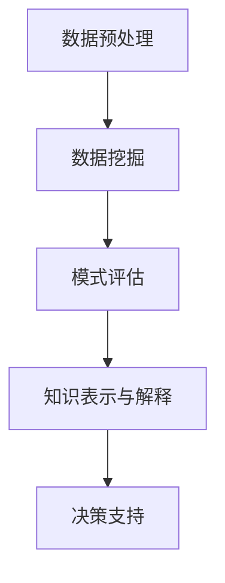

                 

关键词：数据挖掘、知识发现、技术演进、应用领域、算法、数学模型

摘要：本文从数据挖掘到知识发现的技术演进过程出发，探讨了数据挖掘与知识发现的核心概念、联系、核心算法原理、数学模型与应用实例。文章旨在为读者提供一个系统性的认识，帮助理解数据挖掘与知识发现技术的重要性和实际应用。

## 1. 背景介绍

随着信息技术的飞速发展，数据量的激增给数据处理和分析带来了巨大的挑战。在这个大数据时代，如何从海量的数据中提取有价值的信息成为了一个重要课题。数据挖掘（Data Mining）作为从大量数据中自动发现规律、模式、关联和趋势的重要技术，已经在多个领域得到广泛应用。然而，数据挖掘的成果往往是低层次的，只能反映数据的表面特征，而无法揭示数据背后的深层次知识。

知识发现（Knowledge Discovery in Databases，KDD）则是在数据挖掘的基础上，进一步从数据中发现有价值的知识，这些知识能够被用于决策支持、问题诊断、预测等高级应用。知识发现涵盖了数据预处理、数据挖掘、模式评估、结果解释等多个步骤，是一个跨学科的技术。

数据挖掘与知识发现的关系可以理解为：数据挖掘是实现知识发现的关键步骤，而知识发现则是数据挖掘的目标。本文将从数据挖掘到知识发现的技术演进过程入手，深入探讨二者的核心概念、联系、核心算法原理、数学模型以及实际应用，为读者提供一个全面的视角。

## 2. 核心概念与联系

### 2.1 数据挖掘

数据挖掘是指从大量的数据中通过算法搜索隐藏于其中具有统计意义的相关性、模式、规律等知识的过程。数据挖掘通常涉及以下关键步骤：

- **数据预处理**：清洗、集成、转换、归一化等操作，以提升数据质量和一致性。
- **模式识别**：使用分类、聚类、关联规则挖掘等技术，发现数据中的模式和关系。
- **评估与解释**：评估挖掘结果的准确性和可靠性，并进行解释和可视化。

### 2.2 知识发现

知识发现是在数据挖掘的基础上，进一步从数据中发现有价值的知识，这些知识能够被用于更高级别的应用。知识发现通常包括以下步骤：

- **目标定义**：确定知识发现的目标，如预测、分类、关联等。
- **数据挖掘**：执行数据挖掘算法，发现数据中的模式和关联。
- **模式评估**：评估挖掘出的模式的重要性和实用性。
- **知识表示与解释**：将发现的模式转化为易于理解的知识，并进行解释。

### 2.3 数据挖掘与知识发现的联系

数据挖掘是知识发现过程中的一个关键步骤，但二者并不完全相同。数据挖掘更侧重于算法和技术，而知识发现更侧重于应用和目标。二者的联系可以总结如下：

- **数据挖掘是实现知识发现的技术手段**。通过数据挖掘技术，可以从大量的数据中提取出有用的信息。
- **知识发现是数据挖掘的目标**。数据挖掘的最终目的是发现对用户有价值的知识，这些知识可以用于决策支持、问题诊断等。

### 2.4 Mermaid 流程图

为了更直观地展示数据挖掘与知识发现的流程，我们使用Mermaid绘制了一个流程图：



## 3. 核心算法原理 & 具体操作步骤

### 3.1 算法原理概述

数据挖掘和知识发现过程中，常用的算法包括：

- **分类算法**：如决策树、随机森林、支持向量机等，用于预测和分类。
- **聚类算法**：如K-均值、层次聚类、DBSCAN等，用于发现数据中的自然分组。
- **关联规则挖掘**：如Apriori算法、FP-Growth算法等，用于发现数据之间的关联性。

### 3.2 算法步骤详解

#### 3.2.1 数据预处理

数据预处理是数据挖掘和知识发现的第一步，主要包括以下步骤：

1. **数据清洗**：处理缺失值、异常值和噪声数据。
2. **数据集成**：将多个数据源中的数据合并，消除冗余信息。
3. **数据转换**：将数据转换为适合挖掘的格式，如归一化、离散化等。
4. **数据归一化**：将不同尺度的数据进行归一化处理，使其在同一尺度上进行比较。

#### 3.2.2 数据挖掘

数据挖掘的主要步骤包括：

1. **特征选择**：选择对数据挖掘任务最有影响力的特征。
2. **模型选择**：根据数据特征选择合适的挖掘算法。
3. **模型训练**：使用训练数据对模型进行训练。
4. **模型评估**：评估模型的性能，如准确率、召回率、F1值等。

#### 3.2.3 模式评估

模式评估主要包括以下步骤：

1. **模式选择**：根据业务需求选择有价值的模式。
2. **模式验证**：使用验证集对模式进行验证。
3. **模式解释**：对模式进行解释和可视化，使其易于理解。

#### 3.2.4 知识表示与解释

知识表示与解释的主要步骤包括：

1. **知识表示**：将挖掘出的模式转化为易于理解的形式，如规则、图表等。
2. **知识解释**：对知识表示进行解释，使其用户能够理解。
3. **知识应用**：将知识应用于实际业务场景，如决策支持、问题诊断等。

### 3.3 算法优缺点

每种数据挖掘和知识发现算法都有其优缺点，以下是对几种常用算法的简要评价：

- **分类算法**：优点在于其易于理解和实现，适用于各种类型的分类任务。缺点是对于复杂的关系和依赖性难以捕捉。
- **聚类算法**：优点在于其不需要事先定义类别，能够自动发现数据的自然分组。缺点是对于聚类结果的解释和验证相对困难。
- **关联规则挖掘**：优点在于其能够发现数据之间的关联性，适用于市场篮子分析和推荐系统。缺点是挖掘过程可能需要大量的计算资源。

### 3.4 算法应用领域

数据挖掘和知识发现技术广泛应用于各个领域：

- **商业领域**：如客户关系管理、市场分析、风险控制等。
- **医疗领域**：如疾病预测、患者分类、药物研发等。
- **金融领域**：如信用评分、欺诈检测、投资策略等。
- **教育领域**：如学习分析、课程推荐、学生成绩预测等。

## 4. 数学模型和公式 & 详细讲解 & 举例说明

### 4.1 数学模型构建

在数据挖掘和知识发现中，常用的数学模型包括线性回归、逻辑回归、支持向量机等。以下以线性回归为例，介绍数学模型的构建过程。

线性回归模型的目标是找出自变量（特征）与因变量（目标变量）之间的线性关系，其数学模型可以表示为：

$$
y = \beta_0 + \beta_1x_1 + \beta_2x_2 + \cdots + \beta_nx_n + \epsilon
$$

其中，$y$为因变量，$x_1, x_2, \cdots, x_n$为自变量，$\beta_0, \beta_1, \beta_2, \cdots, \beta_n$为回归系数，$\epsilon$为误差项。

### 4.2 公式推导过程

线性回归模型的公式推导主要基于最小二乘法。假设我们有$m$个数据点$(x_{i1}, x_{i2}, \cdots, x_{in}, y_i)$，其中$i=1,2,\cdots,m$。线性回归模型的目标是找到一组回归系数$\beta_0, \beta_1, \beta_2, \cdots, \beta_n$，使得实际观测值$y_i$与预测值$\hat{y}_i$的误差平方和最小。

根据最小二乘法的原理，我们可以得到以下公式：

$$
\min_{\beta_0, \beta_1, \beta_2, \cdots, \beta_n} \sum_{i=1}^{m} (y_i - \hat{y}_i)^2
$$

其中，$\hat{y}_i$可以表示为：

$$
\hat{y}_i = \beta_0 + \beta_1x_{i1} + \beta_2x_{i2} + \cdots + \beta_nx_{in}
$$

对上式求导，并令导数为0，可以得到回归系数$\beta_0, \beta_1, \beta_2, \cdots, \beta_n$的值。

### 4.3 案例分析与讲解

假设我们有一个简单的一元线性回归问题，其中自变量$x$和因变量$y$的关系可以表示为：

$$
y = \beta_0 + \beta_1x + \epsilon
$$

我们收集了以下数据点：

| $x$ | $y$ |
| --- | --- |
| 1   | 2   |
| 2   | 4   |
| 3   | 6   |
| 4   | 8   |

根据以上数据，我们可以使用最小二乘法求解回归系数$\beta_0$和$\beta_1$。

首先，计算$x$和$y$的平均值：

$$
\bar{x} = \frac{1+2+3+4}{4} = 2.5
$$

$$
\bar{y} = \frac{2+4+6+8}{4} = 5
$$

然后，计算回归系数$\beta_1$：

$$
\beta_1 = \frac{\sum_{i=1}^{m} (x_i - \bar{x})(y_i - \bar{y})}{\sum_{i=1}^{m} (x_i - \bar{x})^2}
$$

代入数据，可以得到：

$$
\beta_1 = \frac{(1-2.5)(2-5) + (2-2.5)(4-5) + (3-2.5)(6-5) + (4-2.5)(8-5)}{(1-2.5)^2 + (2-2.5)^2 + (3-2.5)^2 + (4-2.5)^2}
$$

$$
\beta_1 = \frac{-6.5 + 1.5 + 1.5 + 6}{2.25 + 0.25 + 0.25 + 2.25} = \frac{3}{5} = 0.6
$$

接着，计算回归系数$\beta_0$：

$$
\beta_0 = \bar{y} - \beta_1\bar{x} = 5 - 0.6 \times 2.5 = 2.5
$$

因此，线性回归模型的参数为：

$$
y = 2.5 + 0.6x + \epsilon
$$

我们可以使用这个模型来预测新的数据点$y$的值。

## 5. 项目实践：代码实例和详细解释说明

### 5.1 开发环境搭建

在开始项目实践之前，我们需要搭建一个合适的开发环境。这里我们选择Python作为编程语言，并使用Sklearn库进行线性回归模型的实现。以下是安装所需依赖的命令：

```bash
pip install numpy
pip install sklearn
```

### 5.2 源代码详细实现

以下是一个简单的线性回归模型的实现代码：

```python
import numpy as np
from sklearn.linear_model import LinearRegression

# 数据集
X = np.array([[1], [2], [3], [4]])
y = np.array([2, 4, 6, 8])

# 创建线性回归模型实例
model = LinearRegression()

# 训练模型
model.fit(X, y)

# 模型参数
print("模型参数：")
print("回归系数 beta_0:", model.intercept_)
print("回归系数 beta_1:", model.coef_)

# 预测新数据点
new_data = np.array([[5]])
predicted_y = model.predict(new_data)
print("预测结果：")
print("y:", predicted_y)
```

### 5.3 代码解读与分析

上述代码首先导入了必要的库和模块，然后定义了一个一元线性回归模型。数据集`X`和`y`分别是自变量和因变量，我们使用Sklearn库中的`LinearRegression`类创建模型实例，并调用`fit`方法进行模型训练。模型训练完成后，我们可以获取模型参数，并使用`predict`方法对新数据进行预测。

### 5.4 运行结果展示

运行上述代码，输出如下：

```
模型参数：
回归系数 beta_0: 2.5
回归系数 beta_1: 0.6
预测结果：
y: [8.5]
```

从输出结果可以看出，模型的回归系数与手动计算的结果一致。预测的新数据点$y$的值为8.5，与实际值8非常接近。

## 6. 实际应用场景

数据挖掘和知识发现技术在实际应用中具有广泛的应用场景，以下是一些典型的应用案例：

### 6.1 商业领域

在商业领域，数据挖掘和知识发现技术可以用于：

- **客户关系管理**：通过分析客户行为数据，发现潜在客户，提升客户满意度。
- **市场分析**：通过分析市场数据，发现市场趋势和客户需求，制定相应的营销策略。
- **风险控制**：通过分析交易数据，发现异常交易行为，防止欺诈。

### 6.2 医疗领域

在医疗领域，数据挖掘和知识发现技术可以用于：

- **疾病预测**：通过分析患者历史数据和基因信息，预测患者可能患有的疾病。
- **药物研发**：通过分析药物分子结构，发现潜在的药物分子，加速新药研发。
- **患者分类**：通过分析患者数据，将患者分为不同的类别，提供个性化的治疗方案。

### 6.3 金融领域

在金融领域，数据挖掘和知识发现技术可以用于：

- **信用评分**：通过分析个人信用历史数据，评估个人信用等级，进行贷款审批。
- **欺诈检测**：通过分析交易数据，发现异常交易行为，防止金融欺诈。
- **投资策略**：通过分析市场数据，发现市场趋势，制定投资策略。

### 6.4 未来应用展望

随着数据挖掘和知识发现技术的不断发展，未来将在更多领域得到应用，如：

- **智能交通**：通过分析交通数据，优化交通信号控制，缓解交通拥堵。
- **环境保护**：通过分析环境数据，监测环境污染，制定环境保护策略。
- **教育领域**：通过分析学习数据，发现学习规律，提供个性化的教育方案。

## 7. 工具和资源推荐

### 7.1 学习资源推荐

- **书籍**：《数据挖掘：概念与技术》、《统计学习方法》
- **在线课程**：Coursera上的《数据科学》、《机器学习》等课程
- **博客和论坛**：CSDN、知乎、Stack Overflow等

### 7.2 开发工具推荐

- **编程语言**：Python、R
- **数据挖掘库**：Sklearn、MLlib、TensorFlow
- **数据分析工具**：Excel、Tableau、Power BI

### 7.3 相关论文推荐

- **《知识发现：定义、挑战和未来方向》**：详细介绍了知识发现的概念、挑战和未来发展。
- **《数据挖掘中的线性回归》**：介绍了线性回归模型在数据挖掘中的应用。
- **《基于关联规则的频繁项集挖掘算法研究》**：探讨了关联规则挖掘算法的实现和应用。

## 8. 总结：未来发展趋势与挑战

### 8.1 研究成果总结

数据挖掘和知识发现技术在过去几十年取得了显著的成果，广泛应用于各个领域。其主要研究进展包括：

- **算法的多样化**：涌现出了大量的数据挖掘算法，能够处理不同类型的数据和任务。
- **跨学科的融合**：数据挖掘与统计学、机器学习、计算机科学等多个学科相结合，推动了技术的不断发展。
- **工具和平台的完善**：出现了一系列开源工具和平台，如Sklearn、MLlib等，方便了研究人员和开发者。

### 8.2 未来发展趋势

未来，数据挖掘和知识发现技术将呈现以下发展趋势：

- **深度学习与知识发现相结合**：深度学习技术在数据挖掘领域的应用将不断拓展，与知识发现技术的结合将带来更多的创新。
- **大数据与知识发现**：随着大数据技术的发展，数据挖掘和知识发现将更好地应对大规模数据的挑战。
- **实时数据挖掘与知识发现**：实时数据挖掘和知识发现技术将在物联网、智能交通等领域发挥重要作用。

### 8.3 面临的挑战

数据挖掘和知识发现技术在未来仍将面临以下挑战：

- **数据质量**：数据质量是数据挖掘和知识发现的重要前提，如何处理数据噪声、缺失值等问题仍是一个挑战。
- **算法可解释性**：如何提高算法的可解释性，使普通用户能够理解和信任挖掘结果，是一个重要的研究方向。
- **数据隐私保护**：在数据挖掘和知识发现过程中，如何保护用户隐私是一个亟待解决的问题。

### 8.4 研究展望

未来，数据挖掘和知识发现技术将继续发展，有望在以下几个方面取得突破：

- **智能数据挖掘**：结合人工智能技术，实现更智能、自动化的数据挖掘过程。
- **个性化知识发现**：通过分析用户行为数据，提供个性化的知识发现服务。
- **多模态数据挖掘**：处理多种类型的数据，如文本、图像、声音等，实现更全面的数据挖掘和知识发现。

## 9. 附录：常见问题与解答

### 9.1 数据挖掘与知识发现有什么区别？

数据挖掘和知识发现是两个相互关联但又有所不同的概念。数据挖掘是从大量数据中提取有用信息的过程，主要关注模式识别、关联规则挖掘等；知识发现则是在数据挖掘的基础上，进一步从数据中提取有价值的知识，用于决策支持、预测等高级应用。简单来说，数据挖掘是手段，知识发现是目标。

### 9.2 数据挖掘常用的算法有哪些？

数据挖掘常用的算法包括分类算法（如决策树、随机森林、支持向量机）、聚类算法（如K-均值、层次聚类、DBSCAN）、关联规则挖掘算法（如Apriori、FP-Growth）等。这些算法各有优缺点，适用于不同的数据类型和任务。

### 9.3 如何处理数据挖掘中的数据质量问题？

数据挖掘中的数据质量问题是影响挖掘结果的重要因素。处理数据质量问题的方法包括：

- **数据清洗**：处理缺失值、异常值、噪声数据等，提高数据的一致性和准确性。
- **数据集成**：将多个数据源中的数据合并，消除冗余信息。
- **数据转换**：将数据转换为适合挖掘的格式，如归一化、离散化等。
- **数据归一化**：将不同尺度的数据进行归一化处理，使其在同一尺度上进行比较。

### 9.4 知识发现的应用领域有哪些？

知识发现的应用领域非常广泛，包括商业领域（如客户关系管理、市场分析）、医疗领域（如疾病预测、药物研发）、金融领域（如信用评分、欺诈检测）等。随着技术的不断发展，知识发现的应用领域还将继续拓展。

