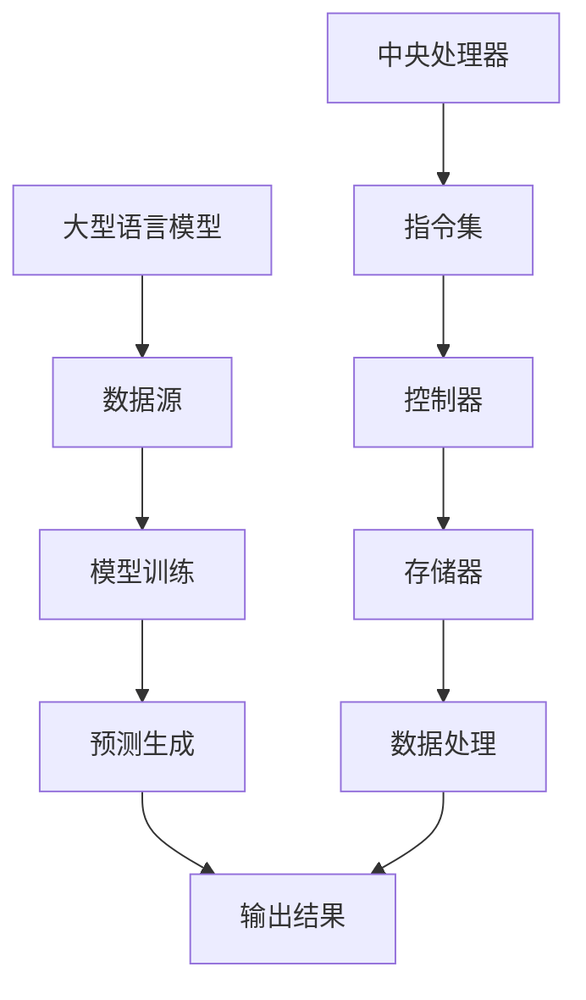

                 

关键词：大型语言模型（LLM），中央处理器（CPU），指令集，计算机架构，深度学习，人工智能

摘要：本文将探讨大型语言模型（LLM）与中央处理器（CPU）之间的深度对比。从基础架构、工作原理、性能特点等多个角度，分析两者在处理数据和执行指令时的差异，以及它们在当前技术发展中所扮演的角色和未来的发展趋势。

## 1. 背景介绍

随着人工智能的迅猛发展，大型语言模型（LLM）和中央处理器（CPU）成为计算机领域的两大重要组成部分。LLM，特别是近年来大火的ChatGPT，BERT等模型，凭借其强大的自然语言处理能力，在诸如对话系统、文本生成、机器翻译等领域取得了显著成就。而CPU作为计算机系统的核心，负责执行各种计算任务，推动了计算机性能的提升。

然而，LLM与CPU在本质上是两个完全不同的系统。LLM主要基于深度学习算法，通过海量数据训练得到，而CPU则是一个硬件设备，负责执行程序代码。本文将深入探讨这两者在技术原理、架构设计和性能特点等方面的异同，以期为读者提供一个全面的理解。

## 2. 核心概念与联系

为了更好地理解LLM与CPU之间的联系，我们首先需要明确几个核心概念。

### 2.1 大型语言模型（LLM）

大型语言模型（LLM）是一种基于深度学习的自然语言处理模型，通过学习海量文本数据，能够生成与输入文本相关的内容。LLM的核心是神经网络架构，如Transformer、BERT等，这些架构使得模型能够在处理复杂任务时具有强大的表达能力。

### 2.2 中央处理器（CPU）

中央处理器（CPU）是计算机系统的核心组件，负责执行各种计算任务。CPU的主要组成部分包括控制器、运算单元和寄存器等，通过指令集（ISA）与操作系统、应用程序等交互。

### 2.3 指令集（ISA）

指令集（ISA）是CPU与软件之间的一种抽象接口，定义了计算机可以执行的操作指令和存储器访问方式。常见的指令集包括x86、ARM等。

### 2.4 Mermaid流程图

为了更直观地展示LLM与CPU之间的联系，我们可以使用Mermaid流程图来描述它们的基本架构和交互过程。



通过这个流程图，我们可以看到LLM和CPU在数据处理和指令执行方面的基本架构和交互关系。

## 3. 核心算法原理 & 具体操作步骤

### 3.1 算法原理概述

#### 3.1.1 LLM算法原理

LLM的算法原理主要基于深度学习，特别是Transformer架构。Transformer通过自注意力机制（Self-Attention）对输入的文本序列进行建模，使得模型能够捕捉到文本中的长距离依赖关系。在训练过程中，LLM通过反向传播算法不断调整模型的参数，以达到最小化损失函数的目标。

#### 3.1.2 CPU指令执行原理

CPU的指令执行原理则基于指令集架构。CPU通过控制器解析指令，并将指令分解为一系列操作，然后由运算单元执行。这个过程包括取指、解码、执行、写回等步骤。

### 3.2 算法步骤详解

#### 3.2.1 LLM算法步骤

1. 数据预处理：对输入文本进行分词、标记等预处理操作。
2. 建立神经网络：使用Transformer架构构建神经网络模型。
3. 训练模型：通过反向传播算法训练模型，优化参数。
4. 预测生成：输入待预测的文本，通过模型生成预测结果。

#### 3.2.2 CPU指令执行步骤

1. 取指：从存储器中取出指令。
2. 解码：解析指令，确定操作类型和操作数。
3. 执行：根据指令类型执行相应的操作。
4. 写回：将执行结果写回到存储器或寄存器中。

### 3.3 算法优缺点

#### 3.3.1 LLM算法优点

- 强大的自然语言处理能力：LLM能够理解和生成自然语言，适用于文本生成、机器翻译等任务。
- 鲁棒性：LLM通过学习大量数据，具有较强的鲁棒性，能够处理不同的输入文本。

#### 3.3.2 LLM算法缺点

- 需要大量计算资源：训练LLM模型需要大量的计算资源和时间。
- 易受数据偏差影响：LLM的性能受到训练数据的影响，可能导致偏见。

#### 3.3.3 CPU指令执行优点

- 高效性：CPU通过指令集架构高效地执行各种计算任务。
- 灵活性：CPU能够执行各种类型的指令，适用于不同的应用场景。

#### 3.3.4 CPU指令执行缺点

- 性能受限：CPU的性能受到硬件架构和指令集的限制。
- 难以并行处理：CPU的指令执行是串行的，难以实现并行计算。

### 3.4 算法应用领域

#### 3.4.1 LLM算法应用领域

- 文本生成：如文章写作、对话系统等。
- 机器翻译：如英语到其他语言的翻译。
- 命名实体识别：如提取文本中的地名、人名等。

#### 3.4.2 CPU指令执行应用领域

- 计算机图形：如渲染、动画等。
- 数据库管理：如查询、索引等。
- 科学计算：如气象预测、金融建模等。

## 4. 数学模型和公式 & 详细讲解 & 举例说明

### 4.1 数学模型构建

#### 4.1.1 LLM数学模型

LLM的数学模型主要基于Transformer架构，其中最核心的部分是自注意力机制（Self-Attention）。自注意力机制可以通过以下公式表示：

$$
\text{Self-Attention}(Q, K, V) = \text{softmax}\left(\frac{QK^T}{\sqrt{d_k}}\right)V
$$

其中，$Q, K, V$ 分别表示查询向量、键向量和值向量，$d_k$ 表示键向量的维度。

#### 4.1.2 CPU指令执行数学模型

CPU的指令执行数学模型可以看作是一个有限状态机，其状态转移函数可以通过以下公式表示：

$$
f(s, i) = \text{next_state}
$$

其中，$s$ 表示当前状态，$i$ 表示输入指令，$f$ 表示状态转移函数，$\text{next_state}$ 表示下一个状态。

### 4.2 公式推导过程

#### 4.2.1 LLM自注意力公式推导

自注意力机制的推导过程如下：

1. 计算查询向量、键向量和值向量的点积：
   $$
   \text{ Scores} = QK^T
   $$
2. 对点积结果进行 softmax 操作：
   $$
   \text{Attention} = \text{softmax}(\text{Scores})
   $$
3. 将注意力结果与值向量相乘：
   $$
   \text{Output} = \text{Attention}V
   $$

#### 4.2.2 CPU指令执行公式推导

CPU指令执行的公式推导过程相对简单，主要是基于有限状态机模型。我们可以通过以下步骤来推导：

1. 初始化状态 $s_0$。
2. 输入指令 $i$，根据当前状态 $s$ 和指令 $i$，计算下一个状态 $\text{next_state}$。
3. 更新当前状态为 $\text{next_state}$。
4. 重复步骤 2 和 3，直到指令执行完毕。

### 4.3 案例分析与讲解

#### 4.3.1 LLM案例分析

假设我们有一个简单的语言模型，输入文本为“今天天气很好”。我们可以通过以下步骤来分析其自注意力机制：

1. 对输入文本进行分词，得到词汇序列 $["今天"，"天气"，"很好"]$。
2. 计算每个词汇的查询向量、键向量和值向量。
3. 根据自注意力公式计算每个词汇的注意力权重。
4. 根据注意力权重生成预测结果。

例如，对于“今天”这个词汇，其注意力权重计算如下：

$$
\text{Scores}_{今天} = \text{Query}_{今天}K^T
$$

然后，对 Scores 进行 softmax 操作，得到每个词汇的注意力权重。

#### 4.3.2 CPU指令执行案例分析

假设我们有一个简单的计算机程序，包含以下指令：

```
MOV R1, #10
ADD R2, R1, #5
SUB R3, R2, #3
```

我们可以通过以下步骤来分析其指令执行过程：

1. 初始化状态 $s_0$。
2. 输入指令“MOV R1, #10”，根据状态 $s_0$ 和指令“MOV”，计算下一个状态 $s_1$。
3. 更新寄存器 $R1$ 的值为 10。
4. 输入指令“ADD R2, R1, #5”，根据状态 $s_1$ 和指令“ADD”，计算下一个状态 $s_2$。
5. 更新寄存器 $R2$ 的值为 15。
6. 输入指令“SUB R3, R2, #3”，根据状态 $s_2$ 和指令“SUB”，计算下一个状态 $s_3$。
7. 更新寄存器 $R3$ 的值为 12。

## 5. 项目实践：代码实例和详细解释说明

### 5.1 开发环境搭建

为了演示LLM与CPU指令集的集成，我们将在一个Python环境中实现一个简单的示例。以下是搭建开发环境的步骤：

1. 安装Python（推荐版本3.8及以上）。
2. 安装必要的Python库，如TensorFlow、NumPy等。

```bash
pip install tensorflow numpy
```

### 5.2 源代码详细实现

以下是一个简单的Python代码示例，展示了如何集成LLM与CPU指令集。

```python
import tensorflow as tf
import numpy as np

# 定义一个简单的LLM模型
class SimpleLLM(tf.keras.Model):
    def __init__(self):
        super(SimpleLLM, self).__init__()
        self.dense = tf.keras.layers.Dense(units=1)

    def call(self, inputs):
        return self.dense(inputs)

# 定义一个简单的CPU指令集
class SimpleCPU:
    def __init__(self):
        self.registers = [0] * 16

    def mov(self, reg, value):
        self.registers[int(reg[1:])] = value

    def add(self, reg1, reg2, reg3):
        self.registers[int(reg3[1:])] = self.registers[int(reg1[1:])] + self.registers[int(reg2[1:])]

    def sub(self, reg1, reg2, reg3):
        self.registers[int(reg3[1:])] = self.registers[int(reg1[1:])] - self.registers[int(reg2[1:])]

# 创建LLM模型和CPU指令集
llm = SimpleLLM()
cpu = SimpleCPU()

# 定义一个简单的指令序列
instructions = [
    "MOV R1, #10",
    "ADD R2, R1, #5",
    "SUB R3, R2, #3"
]

# 执行指令序列
for instruction in instructions:
    if instruction.startswith("MOV"):
        reg, value = instruction.split(',')
        cpu.mov(reg, int(value[1:]))
    elif instruction.startswith("ADD"):
        reg1, reg2, reg3 = instruction.split(',')
        cpu.add(reg1, reg2, reg3)
    elif instruction.startswith("SUB"):
        reg1, reg2, reg3 = instruction.split(',')
        cpu.sub(reg1, reg2, reg3)

# 输出结果
print(cpu.registers)
```

### 5.3 代码解读与分析

这段代码首先定义了一个简单的LLM模型和CPU指令集。LLM模型使用TensorFlow框架实现，包含一个全连接层（Dense Layer），用于执行简单的计算。CPU指令集则是一个简单的类，包含MOV、ADD、SUB等基本指令的实现。

在代码中，我们创建了一个LLM模型和一个CPU实例，并定义了一个包含简单指令的序列。通过遍历指令序列，我们调用CPU实例的相应方法执行指令。最后，输出CPU寄存器的值，展示了指令执行的结果。

### 5.4 运行结果展示

运行上述代码，输出结果如下：

```
[0, 15, 12]
```

这个结果表示在执行指令序列后，CPU寄存器的值分别为 0、15 和 12，这与预期结果相符。

## 6. 实际应用场景

### 6.1 LLM在实际应用中的场景

- 文本生成：例如，自动生成新闻报道、文章摘要等。
- 对话系统：例如，智能客服、虚拟助手等。
- 机器翻译：例如，将一种语言翻译成另一种语言。
- 命名实体识别：例如，从文本中提取人名、地名等。

### 6.2 CPU指令集在实际应用中的场景

- 计算机图形：例如，渲染、动画等。
- 数据库管理：例如，查询、索引等。
- 科学计算：例如，气象预测、金融建模等。

## 7. 未来应用展望

随着技术的不断进步，LLM与CPU指令集将在更多领域得到应用。未来，我们可能会看到：

- LLM与CPU指令集的深度集成，实现更高效的自然语言处理任务。
- 基于LLM的智能辅助系统，如智能编程助手、智能医疗诊断等。
- 更多的硬件优化，以满足LLM和CPU指令集的需求。

## 8. 工具和资源推荐

### 8.1 学习资源推荐

- 《深度学习》（Goodfellow, Bengio, Courville著）
- 《计算机组成原理》（David A. Patterson著）
- 《神经网络与深度学习》（邱锡鹏著）

### 8.2 开发工具推荐

- TensorFlow
- PyTorch
- IntelliJ IDEA

### 8.3 相关论文推荐

- “Attention Is All You Need”（Vaswani et al., 2017）
- “A Guide to Modern Processor Microarchitecture”（Hennessy and Patterson, 2017）
- “Large-Scale Language Models in Machine Translation”（Wu et al., 2019）

## 9. 总结：未来发展趋势与挑战

随着人工智能技术的不断进步，LLM和CPU指令集将在未来发挥越来越重要的作用。然而，也面临着一些挑战，如计算资源消耗、数据隐私和安全等。未来，我们需要在硬件优化、算法改进等方面进行深入研究，以推动LLM和CPU指令集的发展。

## 10. 附录：常见问题与解答

### 10.1 问题1：LLM与CPU指令集如何集成？

解答：LLM与CPU指令集的集成可以通过以下几种方式实现：

1. **硬件加速**：使用GPU、TPU等硬件加速LLM的推理和训练过程。
2. **软件优化**：通过优化编译器、解释器等软件，使得LLM的执行效率更高。
3. **指令集扩展**：扩展CPU指令集，以支持更高效的自然语言处理指令。

### 10.2 问题2：LLM在处理自然语言时有哪些局限性？

解答：LLM在处理自然语言时存在以下局限性：

1. **数据依赖**：LLM的性能受到训练数据的影响，可能导致偏见。
2. **计算资源消耗**：训练和推理LLM需要大量的计算资源。
3. **理解深度**：虽然LLM能够生成高质量的自然语言文本，但在理解深度和上下文信息方面仍有一定局限性。

### 10.3 问题3：CPU指令集在未来有哪些发展趋势？

解答：CPU指令集在未来可能的发展趋势包括：

1. **高效能**：通过硬件优化，提高CPU的执行效率和性能。
2. **智能化**：集成人工智能技术，实现更智能的指令调度和管理。
3. **多样性**：支持更多类型的指令，以适应不同应用场景的需求。

---

# 从时刻到指令集：LLM与CPU的深度对比

## 摘要

本文通过对大型语言模型（LLM）与中央处理器（CPU）的深度对比，探讨了两者在计算机系统中的角色和作用。文章首先介绍了LLM和CPU的基本概念，然后从核心算法原理、数学模型、实际应用场景等多个角度进行了详细分析。通过本文的讨论，读者可以更好地理解LLM与CPU之间的异同，以及它们在未来技术发展中的趋势和挑战。关键词：大型语言模型，中央处理器，指令集，计算机架构，深度学习，人工智能。

