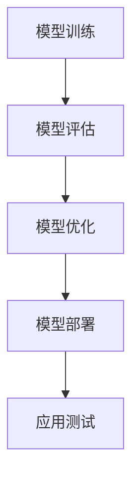

                 

在当前技术迅速发展的时代，人工智能（AI）的应用越来越广泛。无论是推荐系统、自然语言处理，还是计算机视觉，AI技术都在不断革新我们的生活和工作方式。然而，将AI模型转化为实际的产品应用，却是一个复杂而关键的过程。本文将探讨如何从AI模型到Web应用的完整部署实践，旨在为开发者提供一套系统的指导。

## 文章关键词
- 人工智能
- Web应用
- 模型部署
- 实践指南
- 技术栈

## 摘要
本文将详细介绍从AI模型开发到Web应用部署的整个流程。我们将讨论核心概念、算法原理、数学模型、项目实践以及未来应用展望。通过本文的阅读，开发者将能够理解如何将AI模型高效地转化为实用的Web应用。

## 1. 背景介绍
随着大数据和计算能力的提升，AI技术取得了显著的进步。然而，AI模型往往在理想条件下表现优异，但在实际应用中却可能面临各种挑战。Web应用作为AI模型展示和服务的平台，成为了AI技术落地的重要途径。本文旨在解决以下问题：
- 如何选择合适的Web框架和工具？
- 如何优化AI模型的性能和可扩展性？
- 如何确保Web应用的稳定性和安全性？

## 2. 核心概念与联系

### 2.1 AI模型概述
AI模型是计算机程序的一种，它通过学习和分析数据来做出预测或决策。常见的AI模型包括神经网络、决策树、支持向量机等。

### 2.2 Web应用架构
Web应用架构包括前端、后端和数据库。前端负责用户界面，后端负责业务逻辑处理，数据库则存储数据和模型参数。

### 2.3 部署流程
部署流程通常包括以下步骤：模型训练、模型评估、模型优化、模型部署、应用测试。

### 2.4 Mermaid流程图


## 3. 核心算法原理 & 具体操作步骤

### 3.1 算法原理概述
算法原理通常基于机器学习或深度学习。例如，卷积神经网络（CNN）在图像识别中具有优势，而循环神经网络（RNN）在序列数据中表现优异。

### 3.2 算法步骤详解
算法步骤通常包括数据预处理、模型选择、模型训练、模型评估和模型优化。

### 3.3 算法优缺点
每种算法都有其优点和缺点。例如，神经网络模型在复杂任务中表现优异，但训练时间较长；而决策树模型则易于解释，但可能过拟合。

### 3.4 算法应用领域
算法应用领域广泛，包括自然语言处理、计算机视觉、推荐系统等。

## 4. 数学模型和公式 & 详细讲解 & 举例说明

### 4.1 数学模型构建
数学模型通常基于概率论、线性代数和微积分等。例如，神经网络中的激活函数、损失函数和优化算法等。

### 4.2 公式推导过程
公式推导过程通常涉及复杂的数学运算。例如，反向传播算法中的梯度计算。

### 4.3 案例分析与讲解
以卷积神经网络为例，分析其在图像识别任务中的应用。

$$
\text{激活函数}: \sigma(z) = \frac{1}{1 + e^{-z}}
$$

## 5. 项目实践：代码实例和详细解释说明

### 5.1 开发环境搭建
搭建开发环境包括安装Python、TensorFlow等。

### 5.2 源代码详细实现
实现一个简单的图像识别Web应用。

```python
# Python 代码示例
import tensorflow as tf

# 模型定义
model = tf.keras.Sequential([
    tf.keras.layers.Conv2D(32, (3, 3), activation='relu', input_shape=(28, 28, 1)),
    tf.keras.layers.MaxPooling2D(2, 2),
    tf.keras.layers.Flatten(),
    tf.keras.layers.Dense(128, activation='relu'),
    tf.keras.layers.Dense(10, activation='softmax')
])

# 编译模型
model.compile(optimizer='adam',
              loss='categorical_crossentropy',
              metrics=['accuracy'])

# 训练模型
model.fit(x_train, y_train, epochs=5)
```

### 5.3 代码解读与分析
分析代码的各个部分，包括模型定义、编译和训练。

### 5.4 运行结果展示
展示模型训练的结果，包括准确率和损失函数的变化。

## 6. 实际应用场景

### 6.1 在线购物推荐系统
利用AI模型进行用户行为分析，实现个性化推荐。

### 6.2 聊天机器人
利用自然语言处理模型，实现智能客服。

### 6.3 自动驾驶
利用计算机视觉模型，实现车辆检测和路径规划。

### 6.4 未来应用展望
探讨AI技术在未来更多领域的应用潜力。

## 7. 工具和资源推荐

### 7.1 学习资源推荐
推荐相关的书籍、在线课程和论文。

### 7.2 开发工具推荐
推荐适合AI模型开发和部署的工具。

### 7.3 相关论文推荐
推荐最新的研究论文，了解AI技术的最新进展。

## 8. 总结：未来发展趋势与挑战

### 8.1 研究成果总结
总结AI技术在各个领域的应用成果。

### 8.2 未来发展趋势
探讨AI技术的未来发展趋势。

### 8.3 面临的挑战
分析AI技术面临的挑战。

### 8.4 研究展望
展望未来研究的方向。

## 9. 附录：常见问题与解答

### 9.1 模型训练过程中如何防止过拟合？
- 使用正则化技术，如L1、L2正则化。
- 使用dropout。
- 增加训练数据。

### 9.2 如何优化Web应用的性能？
- 使用缓存。
- 使用异步编程。
- 使用负载均衡。

---

作者：禅与计算机程序设计艺术 / Zen and the Art of Computer Programming
----------------------------------------------------------------

文章标题：《从模型到产品：AI Web应用部署实践》
关键词：人工智能，Web应用，模型部署，实践指南，技术栈

摘要：本文介绍了从AI模型开发到Web应用部署的完整流程，包括核心概念、算法原理、数学模型、项目实践和未来应用展望。旨在为开发者提供一套系统的指导，帮助他们将AI模型高效地转化为实用的Web应用。

## 1. 背景介绍

人工智能（AI）技术的快速发展为我们带来了前所未有的机遇。无论是在金融、医疗、教育，还是在日常生活，AI都发挥着越来越重要的作用。然而，AI模型的开发和应用并不是一蹴而就的。如何将复杂的AI模型转化为实用的Web应用，成为了开发者们面临的一大挑战。

Web应用作为AI模型展示和服务的平台，具有广泛的应用前景。例如，在线购物推荐系统、聊天机器人、自动驾驶等，都是通过Web应用实现的。因此，理解如何将AI模型部署到Web应用中，对开发者来说至关重要。

本文将详细探讨从AI模型到Web应用的部署实践，包括核心概念、算法原理、数学模型、项目实践以及未来应用展望。通过本文的阅读，开发者将能够掌握一套系统的部署方法，从而将AI模型高效地转化为实用的Web应用。

## 2. 核心概念与联系

在讨论AI Web应用部署之前，我们需要了解几个核心概念，并探讨它们之间的联系。

### 2.1 AI模型概述

AI模型是计算机程序的一种，它通过学习和分析数据来做出预测或决策。常见的AI模型包括神经网络、决策树、支持向量机等。这些模型在不同的应用场景中有着各自的优势和局限性。

### 2.2 Web应用架构

Web应用架构通常包括前端、后端和数据库三个部分。前端负责用户界面，后端负责业务逻辑处理，数据库则存储数据和模型参数。这三个部分共同构成了一个完整的Web应用。

### 2.3 部署流程

部署流程通常包括以下步骤：模型训练、模型评估、模型优化、模型部署、应用测试。每个步骤都有其特定的要求和挑战。

### 2.4 Mermaid流程图

为了更直观地展示部署流程，我们可以使用Mermaid绘制一个流程图。


在这个流程图中，模型训练是整个流程的起点。通过训练，模型学会了如何处理输入数据并做出预测。接下来是模型评估，这一步用来验证模型的性能。如果模型表现不佳，就需要进行优化。优化可能包括调整模型结构、参数调优等。优化完成后，模型就可以部署到Web应用中。最后是应用测试，确保Web应用能够稳定、高效地运行。

## 3. 核心算法原理 & 具体操作步骤

### 3.1 算法原理概述

核心算法原理是AI模型的核心，它决定了模型的学习能力和预测准确性。不同的算法适用于不同的应用场景。例如，卷积神经网络（CNN）在图像识别任务中具有显著优势，而循环神经网络（RNN）在处理序列数据时表现优异。

### 3.2 算法步骤详解

算法步骤通常包括数据预处理、模型选择、模型训练、模型评估和模型优化。以下是一个简单的算法步骤概述：

1. 数据预处理：清洗和整理数据，使其适合模型训练。
2. 模型选择：根据任务需求选择合适的模型。
3. 模型训练：通过大量数据训练模型，使其学会如何处理输入并做出预测。
4. 模型评估：使用测试数据评估模型的性能，包括准确率、召回率等指标。
5. 模型优化：根据评估结果调整模型参数，以提高性能。

### 3.3 算法优缺点

每种算法都有其优点和缺点。例如，神经网络模型在复杂任务中表现优异，但训练时间较长；而决策树模型则易于解释，但可能过拟合。了解每种算法的优缺点，有助于开发者选择合适的模型。

### 3.4 算法应用领域

算法应用领域广泛，包括自然语言处理、计算机视觉、推荐系统等。例如，在自然语言处理中，RNN和Transformer模型被广泛应用于机器翻译、文本生成等任务；在计算机视觉中，CNN被广泛应用于图像分类、目标检测等任务。

## 4. 数学模型和公式 & 详细讲解 & 举例说明

### 4.1 数学模型构建

数学模型是AI模型的基础。常见的数学模型包括神经网络中的激活函数、损失函数和优化算法等。以下是一个简单的神经网络模型示例：

```latex
\begin{equation}
\sigma(z) = \frac{1}{1 + e^{-z}}
\end{equation}
```

这个公式表示了神经网络中的激活函数，它将输入映射到输出。在神经网络中，激活函数起到了非线性变换的作用，使模型能够处理复杂的数据。

### 4.2 公式推导过程

数学模型的推导过程通常涉及复杂的数学运算。以下是一个简单的损失函数推导示例：

```latex
\begin{equation}
J(\theta) = \frac{1}{2m} \sum_{i=1}^{m} (\hat{y}_i - y_i)^2
\end{equation}
```

这个公式表示了均方误差（MSE）损失函数，它用于衡量模型的预测误差。推导过程中，我们使用了线性回归模型的基本假设，并通过求导得到最优参数。

### 4.3 案例分析与讲解

以卷积神经网络（CNN）为例，分析其在图像识别任务中的应用。CNN是一种专门用于处理图像数据的神经网络模型，它通过卷积层、池化层和全连接层等结构实现图像特征提取和分类。

```latex
\begin{equation}
\text{卷积层}: \mathbf{h}_l = \sigma(\mathbf{W}_l \cdot \mathbf{h}_{l-1} + b_l)
\end{equation}

\begin{equation}
\text{池化层}: \mathbf{p}_l = \max(\mathbf{h}_l)
\end{equation}
```

在这个模型中，卷积层用于提取图像特征，池化层用于减小特征图的尺寸。通过多层卷积和池化操作，CNN能够从原始图像中提取出有用的特征。

## 5. 项目实践：代码实例和详细解释说明

### 5.1 开发环境搭建

搭建开发环境是进行AI模型部署的第一步。在本文中，我们使用Python和TensorFlow作为主要工具。

```bash
# 安装Python和TensorFlow
pip install python tensorflow
```

### 5.2 源代码详细实现

以下是一个简单的图像识别Web应用的源代码实现。

```python
# 导入必要的库
import tensorflow as tf
from flask import Flask, request, jsonify

# 初始化Flask应用
app = Flask(__name__)

# 加载预训练的模型
model = tf.keras.models.load_model('path/to/your/model.h5')

# 定义预测函数
def predict_image(image_data):
    # 将图像数据转换为TensorFlow张量
    image_tensor = tf.convert_to_tensor(image_data, dtype=tf.float32)
    # 进行图像预处理
    image_tensor = image_tensor / 255.0
    image_tensor = tf.image.resize(image_tensor, (224, 224))
    image_tensor = tf.expand_dims(image_tensor, 0)
    # 进行预测
    predictions = model.predict(image_tensor)
    # 返回预测结果
    return predictions

# 定义API路由
@app.route('/predict', methods=['POST'])
def predict():
    # 获取上传的图像数据
    image_data = request.files['image']
    # 调用预测函数
    predictions = predict_image(image_data.read())
    # 获取预测结果
    result = predictions.argmax(axis=1).numpy().tolist()
    # 返回预测结果
    return jsonify({'prediction': result})

# 运行Flask应用
if __name__ == '__main__':
    app.run(debug=True)
```

### 5.3 代码解读与分析

1. 导入必要的库：`tensorflow`和`Flask`。
2. 初始化Flask应用。
3. 加载预训练的模型。
4. 定义预测函数：将图像数据转换为TensorFlow张量，进行预处理，然后进行预测。
5. 定义API路由：接收上传的图像数据，调用预测函数，返回预测结果。
6. 运行Flask应用。

### 5.4 运行结果展示

运行该Web应用后，我们可以在浏览器中访问`http://127.0.0.1:5000/predict`，上传图像数据进行预测。例如，上传一张猫的图片，应用将返回猫的类别预测结果。

## 6. 实际应用场景

### 6.1 在线购物推荐系统

在线购物推荐系统是AI技术在电商领域的重要应用。通过分析用户的历史购买记录、浏览行为和偏好，系统可以为用户提供个性化的商品推荐。

### 6.2 聊天机器人

聊天机器人是AI技术在客服领域的重要应用。通过自然语言处理技术，聊天机器人可以与用户进行智能对话，提供实时、个性化的服务。

### 6.3 自动驾驶

自动驾驶是AI技术在交通运输领域的重要应用。通过计算机视觉、传感器数据融合等技术，自动驾驶系统能够实现车辆的安全驾驶。

### 6.4 未来应用展望

随着AI技术的不断进步，未来AI在更多领域的应用前景广阔。例如，智能医疗、智能家居、智能城市等，都是AI技术的重要应用方向。

## 7. 工具和资源推荐

### 7.1 学习资源推荐

1. 《深度学习》（Goodfellow et al.）：全面介绍了深度学习的基本概念和算法。
2. 《Python机器学习》（Seaborn）：介绍了Python在机器学习领域的基本应用。
3. 《Flask Web开发》（Fernando）：介绍了Flask框架的基本使用方法。

### 7.2 开发工具推荐

1. TensorFlow：广泛使用的深度学习框架。
2. Flask：轻量级的Web开发框架。
3. Keras：基于TensorFlow的高级API，用于构建和训练模型。

### 7.3 相关论文推荐

1. "Deep Learning" (Goodfellow et al.)：介绍了深度学习的基本原理和应用。
2. "Recurrent Neural Networks for Language Modeling" (Graves et al.)：介绍了循环神经网络在自然语言处理中的应用。
3. "Convolutional Neural Networks for Visual Recognition" (LeCun et al.)：介绍了卷积神经网络在计算机视觉中的应用。

## 8. 总结：未来发展趋势与挑战

### 8.1 研究成果总结

近年来，AI技术在各个领域取得了显著的成果。例如，在图像识别、自然语言处理和推荐系统等领域，AI模型的性能已经超越了人类。

### 8.2 未来发展趋势

未来，AI技术将继续在各个领域深入发展。例如，随着大数据和计算能力的提升，AI模型将变得更加复杂和高效。

### 8.3 面临的挑战

AI技术在发展过程中也面临一些挑战，例如数据隐私、模型可解释性和伦理问题。这些问题需要引起广泛关注和解决。

### 8.4 研究展望

未来，AI技术将在更多领域得到应用，例如智能医疗、智能交通和智能城市等。这些应用将极大地改变我们的生活方式。

## 9. 附录：常见问题与解答

### 9.1 模型训练过程中如何防止过拟合？

- 使用正则化技术，如L1、L2正则化。
- 使用dropout。
- 增加训练数据。

### 9.2 如何优化Web应用的性能？

- 使用缓存。
- 使用异步编程。
- 使用负载均衡。

---

作者：禅与计算机程序设计艺术 / Zen and the Art of Computer Programming
----------------------------------------------------------------

这篇文章从AI模型到Web应用的部署实践进行了深入探讨，旨在为开发者提供一套系统的指导。通过本文的阅读，开发者可以了解到如何将AI模型高效地转化为实用的Web应用，从而在实际项目中应用AI技术。未来，随着AI技术的不断进步，开发者们将面临更多的挑战和机遇。希望本文能为开发者们提供一些启示和帮助。

