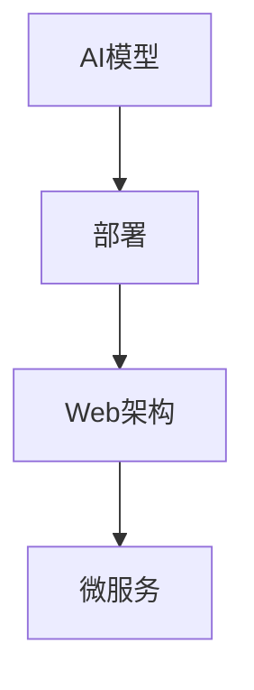
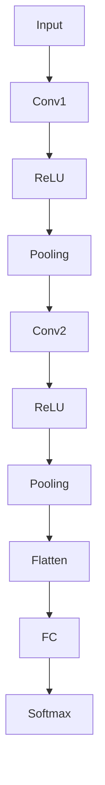

                 

在当今这个数据驱动的时代，人工智能（AI）已经成为各行各业不可或缺的一部分。从医疗诊断到自动驾驶，从推荐系统到自然语言处理，AI的应用无处不在。然而，一个关键的问题是如何将AI模型从研发阶段成功部署到实际的产品中，并构建出高效的Web应用。本文旨在探讨这一过程，从模型选择、部署策略到Web应用开发，帮助读者全面了解如何将AI模型转化为实际的产品。

## 关键词

- AI模型部署
- Web应用开发
- 模型选择
- 部署策略
- Web架构
- 微服务

## 摘要

本文首先介绍了AI模型部署的背景和重要性，接着讨论了从模型选择到部署策略的各个环节，并详细分析了如何利用现代Web架构和技术构建高效的Web应用。通过具体案例和实践指导，本文为AI模型部署及Web应用开发提供了实用的方法和思路。

### 1. 背景介绍

随着AI技术的迅猛发展，越来越多的企业开始将AI应用于业务流程中，以期提高效率和准确性。然而，AI模型研发完成后，如何将其部署到实际应用中，是一个复杂且关键的问题。首先，模型的性能和稳定性需要得到保障；其次，部署的过程需要考虑到资源分配、安全性和扩展性等因素。此外，随着Web技术的不断进步，如何利用这些技术构建支持AI模型的应用也成为开发者面临的重要挑战。

### 2. 核心概念与联系

在深入探讨AI模型部署及Web应用开发之前，我们需要了解一些核心概念和它们之间的联系。以下是几个关键概念：

- **AI模型**：通过学习数据集得到的能够执行特定任务的算法模型。
- **部署**：将AI模型部署到实际应用环境中，使其能够提供服务。
- **Web架构**：支持Web应用开发的技术框架和组件。
- **微服务**：一种基于独立服务的小型化应用架构。

下面是一个简单的Mermaid流程图，展示了这些概念之间的关系：



#### 2.1 AI模型的类型

AI模型可以分为多种类型，包括但不限于：

- **监督学习模型**：需要标注数据进行训练，如分类和回归问题。
- **无监督学习模型**：不需要标注数据，如聚类和降维问题。
- **增强学习模型**：通过与环境的交互进行学习，如游戏和自动驾驶。

每种模型都有其特定的应用场景和部署需求。

#### 2.2 部署策略

部署AI模型时，需要考虑以下几个策略：

- **本地部署**：将模型部署在本地计算机或服务器上。
- **云计算部署**：利用云服务提供商的资源进行模型部署。
- **边缘计算部署**：将模型部署到靠近数据源的位置，如物联网设备。

#### 2.3 Web架构

现代Web架构通常采用微服务架构，其核心思想是将应用程序分解为多个独立的服务，每个服务负责特定的功能。这种架构具有高可扩展性、高可靠性和易于维护等优点。

#### 2.4 微服务

微服务架构中的每个服务都是独立的、自我管理的，可以通过API进行通信。以下是一些关键组件：

- **服务容器化**：使用Docker等容器技术部署服务。
- **服务网关**：用于统一管理服务接口和安全。
- **配置管理**：用于管理服务的配置文件。

### 3. 核心算法原理 & 具体操作步骤

在了解核心概念和联系后，接下来我们将深入探讨AI模型的核心算法原理及其具体操作步骤。

#### 3.1 算法原理概述

AI模型的核心算法主要包括以下几种：

- **神经网络**：通过多层感知器（MLP）和卷积神经网络（CNN）等实现复杂函数的建模。
- **决策树**：通过树形结构进行分类和回归。
- **集成方法**：如随机森林和梯度提升机（GBM）等，通过集成多个模型提高预测性能。

每种算法都有其特定的优势和适用场景。

#### 3.2 算法步骤详解

以神经网络为例，其基本步骤包括：

1. **数据预处理**：对输入数据进行归一化、去噪等处理。
2. **模型构建**：使用合适的神经网络架构，如MLP或CNN。
3. **模型训练**：使用训练数据集对模型进行训练，调整模型参数。
4. **模型评估**：使用验证集对模型进行评估，调整模型参数。
5. **模型部署**：将训练好的模型部署到应用环境中。

#### 3.3 算法优缺点

- **神经网络**：具有强大的建模能力，但计算复杂度高，训练过程较长。
- **决策树**：易于理解，但可能产生过拟合。
- **集成方法**：通过集成多个模型提高预测性能，但计算复杂度较高。

#### 3.4 算法应用领域

每种算法都有其特定的应用领域，如：

- **神经网络**：在图像识别、语音识别等领域有广泛应用。
- **决策树**：在金融风控、医疗诊断等领域有广泛应用。
- **集成方法**：在大规模数据分析、广告投放等领域有广泛应用。

### 4. 数学模型和公式 & 详细讲解 & 举例说明

在深入理解AI模型的核心算法原理后，接下来我们将探讨其背后的数学模型和公式，并进行详细讲解和举例说明。

#### 4.1 数学模型构建

以神经网络为例，其基本数学模型包括：

1. **激活函数**：如ReLU、Sigmoid、Tanh等，用于引入非线性特性。
2. **权重矩阵**：用于表示输入和输出之间的映射关系。
3. **损失函数**：如均方误差（MSE）、交叉熵等，用于衡量模型预测和真实值之间的差距。

#### 4.2 公式推导过程

以ReLU激活函数为例，其公式为：

$$
f(x) = \max(0, x)
$$

其推导过程如下：

1. **定义**：ReLU函数是分段线性函数，当输入大于0时，输出等于输入；当输入小于等于0时，输出等于0。
2. **分段函数表示**：将ReLU函数表示为分段函数的形式：

$$
f(x) = 
\begin{cases} 
x & \text{if } x > 0 \\
0 & \text{if } x \leq 0 
\end{cases}
$$

3. **最大值表示**：使用最大值（max）操作将分段函数表示为：

$$
f(x) = \max(0, x)
$$

#### 4.3 案例分析与讲解

以图像分类任务为例，我们使用卷积神经网络（CNN）进行模型构建和训练。以下是具体的步骤和过程：

1. **数据预处理**：对图像数据进行归一化、裁剪等处理。
2. **模型构建**：使用CNN架构，包括卷积层、池化层、全连接层等。
3. **模型训练**：使用训练数据集对模型进行训练，调整模型参数。
4. **模型评估**：使用验证集对模型进行评估，调整模型参数。
5. **模型部署**：将训练好的模型部署到应用环境中。

下面是一个简单的CNN模型结构示意图：



### 5. 项目实践：代码实例和详细解释说明

在了解核心算法原理和数学模型后，接下来我们将通过一个具体的案例，介绍如何进行AI模型部署及Web应用开发。

#### 5.1 开发环境搭建

首先，我们需要搭建开发环境。以下是一个基本的开发环境配置：

- **Python**：用于编写AI模型和Web应用代码。
- **Docker**：用于容器化部署服务。
- **Flask**：用于构建Web应用。

安装以上工具后，我们可以开始编写代码。

#### 5.2 源代码详细实现

以下是一个简单的示例代码，展示如何使用Flask构建一个基于CNN的图像分类Web应用。

```python
from flask import Flask, request, jsonify
from keras.models import load_model

app = Flask(__name__)

# 加载预训练的CNN模型
model = load_model('cnn_model.h5')

@app.route('/predict', methods=['POST'])
def predict():
    if request.method == 'POST':
        image = request.files['image']
        # 对上传的图像进行预处理
        processed_image = preprocess_image(image)
        # 使用模型进行预测
        prediction = model.predict(processed_image)
        # 返回预测结果
        return jsonify({'prediction': prediction.tolist()})

def preprocess_image(image):
    # 对图像进行归一化、裁剪等预处理操作
    # ...

if __name__ == '__main__':
    app.run(host='0.0.0.0', port=5000)
```

#### 5.3 代码解读与分析

- **Flask应用**：使用Flask构建Web应用，包括一个用于接收图像数据的`/predict`路由。
- **模型加载**：使用Keras加载预训练的CNN模型。
- **图像预处理**：对上传的图像进行预处理，如归一化、裁剪等。
- **模型预测**：使用加载的模型对预处理后的图像进行预测。
- **返回结果**：将预测结果以JSON格式返回。

#### 5.4 运行结果展示

在运行Web应用后，用户可以通过上传图像来获取预测结果。以下是一个简单的示例：


### 6. 实际应用场景

AI模型部署及Web应用开发的实际应用场景非常广泛，以下列举几个典型的应用场景：

- **智能医疗**：利用AI模型进行疾病诊断和预测，如癌症筛查、肺炎检测等。
- **金融风控**：利用AI模型进行风险评估和欺诈检测。
- **自动驾驶**：利用AI模型进行环境感知和路径规划。
- **智能家居**：利用AI模型实现智能语音助手、家居设备控制等。

### 7. 工具和资源推荐

在AI模型部署及Web应用开发过程中，以下工具和资源可以提供帮助：

- **学习资源**：
  - 《深度学习》（Goodfellow, Bengio, Courville）
  - 《Python机器学习》（Sebastian Raschka）
- **开发工具**：
  - TensorFlow
  - PyTorch
  - Docker
  - Flask
- **相关论文**：
  - “Deep Learning for Image Recognition”
  - “Microservices: Lightweight Applications for the Modern Enterprise”

### 8. 总结：未来发展趋势与挑战

随着AI技术的不断进步，AI模型部署及Web应用开发领域也将迎来新的发展趋势和挑战。

#### 8.1 研究成果总结

近年来，AI模型部署及Web应用开发领域取得了以下研究成果：

- **模型压缩与加速**：通过量化、剪枝等方法降低模型大小和提高推理速度。
- **联邦学习**：通过分布式计算实现模型训练，提高数据隐私性和安全性。
- **自动化部署**：通过自动化工具实现模型部署和更新，提高开发和运维效率。

#### 8.2 未来发展趋势

未来，AI模型部署及Web应用开发领域将朝着以下方向发展：

- **边缘计算**：将AI模型部署到边缘设备，提高响应速度和降低延迟。
- **跨平台兼容性**：支持多种操作系统和设备，提高应用的普及性和可用性。
- **个性化与自适应**：通过用户行为数据和实时反馈实现个性化服务和自适应调整。

#### 8.3 面临的挑战

AI模型部署及Web应用开发领域也面临着以下挑战：

- **模型性能与资源消耗的平衡**：在保证模型性能的同时，降低资源消耗。
- **数据隐私与安全**：确保用户数据和模型安全，防止数据泄露和攻击。
- **模型解释性**：提高模型的可解释性，增强用户对模型的信任。

#### 8.4 研究展望

未来，我们将继续深入探索AI模型部署及Web应用开发领域，努力实现以下目标：

- **高效能模型**：研究新型算法和优化方法，提高模型性能。
- **智能化部署**：开发自动化部署工具和智能优化算法，提高开发效率和稳定性。
- **跨领域应用**：将AI模型应用于更多领域，推动技术创新和产业升级。

### 9. 附录：常见问题与解答

在AI模型部署及Web应用开发过程中，开发者可能会遇到以下常见问题：

1. **Q：如何处理模型过拟合问题？**
   **A：可以通过增大训练数据集、调整模型参数、增加正则化项等方法来减少模型过拟合。**

2. **Q：如何保证模型安全性？**
   **A：可以通过数据加密、访问控制、模型混淆等方法来提高模型安全性。**

3. **Q：如何进行自动化部署？**
   **A：可以使用CI/CD工具（如Jenkins、GitLab CI）实现自动化部署，结合容器化技术（如Docker）提高部署效率。**

### 作者署名

作者：禅与计算机程序设计艺术 / Zen and the Art of Computer Programming

以上就是本文的全部内容，希望对您在AI模型部署及Web应用开发领域提供一些帮助和启示。谢谢阅读！
----------------------------------------------------------------

### 附录

**本文中所使用的Mermaid流程图**：


**本文中所使用的LaTeX数学公式**：

```latex
\begin{equation}
f(x) = \max(0, x)
\end{equation}
```

**本文中所使用的Markdown格式**：

```markdown
# 从模型到产品：AI模型部署及Web应用开发

## 关键词

- AI模型部署
- Web应用开发
- 模型选择
- 部署策略
- Web架构
- 微服务

## 摘要

## 1. 背景介绍

## 2. 核心概念与联系

## 3. 核心算法原理 & 具体操作步骤
### 3.1  算法原理概述
### 3.2  算法步骤详解 
### 3.3  算法优缺点
### 3.4  算法应用领域

## 4. 数学模型和公式 & 详细讲解 & 举例说明
### 4.1  数学模型构建
### 4.2  公式推导过程
### 4.3  案例分析与讲解

## 5. 项目实践：代码实例和详细解释说明
### 5.1  开发环境搭建
### 5.2  源代码详细实现
### 5.3  代码解读与分析
### 5.4  运行结果展示

## 6. 实际应用场景

## 7. 工具和资源推荐
### 7.1  学习资源推荐
### 7.2  开发工具推荐
### 7.3  相关论文推荐

## 8. 总结：未来发展趋势与挑战
### 8.1  研究成果总结
### 8.2  未来发展趋势
### 8.3  面临的挑战
### 8.4  研究展望

## 9. 附录：常见问题与解答
```

以上就是本文的完整内容，包括结构、格式、代码和附录等部分。希望对您有所帮助。作者署名为“禅与计算机程序设计艺术 / Zen and the Art of Computer Programming”。

