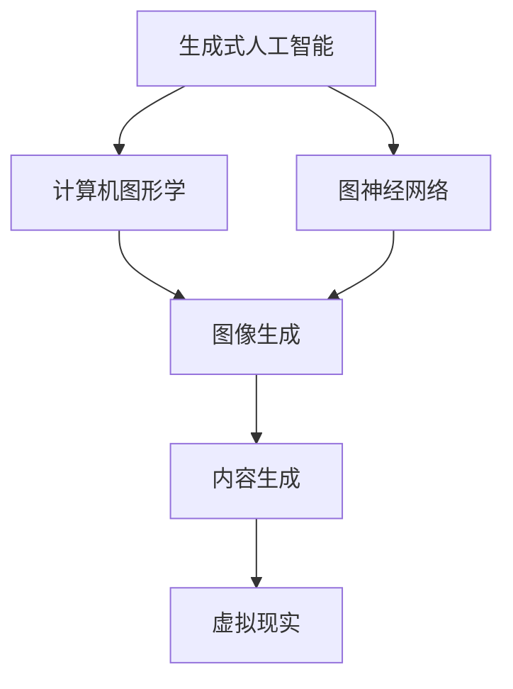

                 

### 关键词

- AIGC
- 生成式人工智能
- 计算机图形学
- 内容生成
- 图神经网络
- 机器学习
- 深度学习
- 编程实践

### 摘要

本文旨在为读者提供一个全面而深入的AIGC（人工智能生成内容）的概述。从理论背景到实际操作，我们将探讨AIGC的核心概念、关键算法、数学模型、实践案例，以及其未来发展的可能性和面临的挑战。通过本文的阅读，读者不仅能够理解AIGC的基本原理，还能够掌握其应用的技术细节和实践方法。

## 1. 背景介绍

人工智能（AI）作为21世纪最具影响力的技术之一，已经深刻改变了我们的生活和工作方式。而AIGC（Artificial Intelligence Generated Content），即人工智能生成内容，作为AI的一个重要分支，正日益成为内容创作领域的一大热点。AIGC技术利用机器学习和深度学习的强大能力，通过算法生成文本、图像、音频等多种形式的内容，从而在游戏开发、电影特效、虚拟现实、广告营销等多个领域展现出巨大的应用潜力。

AIGC的发展历程可以追溯到20世纪80年代，当时研究人员开始探索使用人工智能生成音乐和图像。随着计算能力的提升和算法的进步，AIGC技术逐渐走向成熟，尤其是在深度学习算法如生成对抗网络（GANs）和变分自编码器（VAEs）的推动下，AIGC在图像生成、文本生成等领域取得了显著的成果。

目前，AIGC技术在图像生成、文本生成、音频生成等方面都有广泛的应用，如生成逼真的虚拟人物、自动生成新闻报道、创作音乐和视频等。这些应用不仅提高了内容创作的效率和多样性，还为艺术家、设计师和内容创作者提供了新的工具和方法。

### 2. 核心概念与联系

在深入了解AIGC之前，我们需要了解一些核心概念，包括生成式人工智能、计算机图形学、图神经网络等。以下是一个简化的Mermaid流程图，用于描述这些概念之间的联系：



#### 2.1. 生成式人工智能

生成式人工智能（Generative Artificial Intelligence）是一种人工智能系统，它能够从已有数据中学习并生成新的数据。与判别式人工智能（Discriminative Artificial Intelligence）不同，生成式人工智能不仅能够判断输入数据的真伪，还能够创建全新的数据。

生成式人工智能的核心算法包括生成对抗网络（GANs）、变分自编码器（VAEs）等。GANs由一个生成器（Generator）和一个判别器（Discriminator）组成，通过相互博弈来提高生成数据的真实度。VAEs则通过概率模型来学习数据分布，从而生成新的数据。

#### 2.2. 计算机图形学

计算机图形学（Computer Graphics）是研究计算机生成、处理和显示图形的学科。它在图像生成、动画制作、虚拟现实等领域发挥着重要作用。计算机图形学的主要技术包括三维建模、纹理映射、渲染等。

在AIGC中，计算机图形学被广泛应用于图像和视频的生成。通过深度学习模型，我们可以训练出一个能够生成高质量图像的系统，从而实现自动化内容创作。

#### 2.3. 图神经网络

图神经网络（Graph Neural Networks, GNNs）是一种专门用于处理图数据的神经网络模型。它通过节点和边的特征来学习图数据中的结构信息，广泛应用于社交网络分析、推荐系统、图像识别等领域。

在AIGC中，GNNs可以用于图像生成任务，如生成网络能够根据图像的局部特征生成全局结构，从而生成高质量的图像。

#### 2.4. 内容生成

内容生成（Content Generation）是指利用人工智能技术自动生成文本、图像、音频等内容的过程。在AIGC中，内容生成是核心任务之一，它涉及到文本生成、图像生成、音频生成等多个领域。

文本生成方面，AIGC技术可以自动生成新闻文章、故事、诗歌等。图像生成方面，AIGC技术可以生成逼真的图像、艺术作品等。音频生成方面，AIGC技术可以生成音乐、语音等。

### 3. 核心算法原理 & 具体操作步骤

#### 3.1. 算法原理概述

AIGC的核心算法主要包括生成对抗网络（GANs）、变分自编码器（VAEs）和图神经网络（GNNs）等。以下分别对这些算法进行简要概述：

- **生成对抗网络（GANs）**：GANs由生成器（Generator）和判别器（Discriminator）组成。生成器生成假数据，判别器判断数据的真实性。通过两者之间的对抗训练，生成器不断改进，最终能够生成高质量的数据。

- **变分自编码器（VAEs）**：VAEs通过概率模型来学习数据分布，从而生成新的数据。它通过编码器（Encoder）和解码器（Decoder）的学习，能够生成具有高度多样性的数据。

- **图神经网络（GNNs）**：GNNs通过节点和边的特征来学习图数据中的结构信息。它能够捕捉图数据中的复杂关系，从而实现有效的图像生成。

#### 3.2. 算法步骤详解

以生成对抗网络（GANs）为例，以下是具体的算法步骤：

1. **初始化生成器和判别器**：生成器G和判别器D都是神经网络，通常使用多层感知机（MLP）或者卷积神经网络（CNN）。

2. **生成假数据**：生成器G根据输入噪声分布生成假数据X'。

3. **判断假数据真实性**：判别器D接收真实数据X和假数据X'，输出它们的概率分布P。

4. **优化生成器**：通过对抗训练，使得生成器G生成更真实的数据，从而减小D对X'的判断概率。

5. **优化判别器**：同时优化判别器D，使其能够更准确地判断数据的真实性。

6. **重复步骤2-5，直至达到预定的训练次数**。

#### 3.3. 算法优缺点

- **GANs**：优点包括能够生成高质量的数据、无需标签数据、具有多样性等。缺点包括训练不稳定、难以优化、生成数据的真实性较难控制等。

- **VAEs**：优点包括能够生成多样性的数据、生成数据的质量较好、对噪声数据的鲁棒性较强等。缺点包括生成数据的真实性较GANs略低、训练过程较复杂等。

- **GNNs**：优点包括能够处理图数据、能够捕捉复杂的关系、对数据结构敏感等。缺点包括对计算资源要求较高、训练过程较慢等。

#### 3.4. 算法应用领域

- **GANs**：广泛应用于图像生成、视频生成、文本生成等。

- **VAEs**：广泛应用于图像生成、数据去噪、数据增强等。

- **GNNs**：广泛应用于图像识别、推荐系统、社交网络分析等。

### 4. 数学模型和公式 & 详细讲解 & 举例说明

在AIGC中，数学模型和公式起着至关重要的作用。以下将详细介绍AIGC中常用的数学模型和公式，并通过具体例子进行讲解。

#### 4.1. 数学模型构建

AIGC中的数学模型主要包括概率模型、神经网络模型和图神经网络模型。

- **概率模型**：用于描述数据分布，如正态分布、高斯分布等。概率模型在VAEs中广泛应用。

- **神经网络模型**：用于描述神经网络的结构，如多层感知机（MLP）、卷积神经网络（CNN）等。神经网络模型在GANs中广泛应用。

- **图神经网络模型**：用于描述图神经网络的结构，如图卷积网络（GCN）、图注意力网络（GAT）等。图神经网络模型在图像生成、推荐系统中广泛应用。

#### 4.2. 公式推导过程

以下以GANs中的生成器和判别器的损失函数为例，进行公式推导：

- **生成器损失函数**：

  $$ L_G = -\log(D(G(z))) $$

  其中，$z$为输入噪声，$G(z)$为生成器生成的假数据，$D(x)$为判别器对数据的判断概率。

- **判别器损失函数**：

  $$ L_D = -\log(D(x)) - \log(1 - D(G(z))) $$

  其中，$x$为真实数据。

#### 4.3. 案例分析与讲解

以下以VAEs为例，通过具体例子进行讲解。

**例子**：使用VAEs生成手写数字图像。

1. **数据准备**：

   准备一个手写数字数据集，如MNIST数据集。

2. **构建VAE模型**：

   - 编码器（Encoder）：

     $$ x = \sigma(W_E \cdot \phi_E(z) + b_E) $$

     其中，$x$为输入数据，$z$为编码器的输出，$\phi_E(z)$为编码器的非线性变换，$W_E$和$b_E$分别为编码器的权重和偏置。

   - 解码器（Decoder）：

     $$ x' = \sigma(W_D \cdot z + b_D) $$

     其中，$x'$为解码器的输出，$z$为编码器的输出。

3. **损失函数**：

   $$ L = \frac{1}{N} \sum_{i=1}^N (\log(p(x'|z)) + \beta \cdot D(z; \mu, \sigma^2)) $$

   其中，$N$为数据集大小，$p(x'|z)$为解码器的输出概率，$\mu$和$\sigma^2$分别为编码器的均值和方差。

4. **训练过程**：

   - 使用数据集训练编码器和解码器。
   - 在每次迭代中，计算损失函数，并通过反向传播更新编码器和解码器的参数。

5. **生成图像**：

   - 随机生成一个噪声向量$z$。
   - 通过解码器生成手写数字图像$x'$。

通过上述步骤，我们可以使用VAEs生成高质量的手写数字图像。

### 5. 项目实践：代码实例和详细解释说明

以下将通过一个简单的VAEs项目实例，展示如何使用Python和PyTorch实现VAEs，并进行手写数字图像的生成。

#### 5.1. 开发环境搭建

- 安装Python（推荐3.8及以上版本）
- 安装PyTorch库

```shell
pip install torch torchvision
```

#### 5.2. 源代码详细实现

以下是一个简单的VAEs实现，用于生成手写数字图像。

```python
import torch
import torchvision
import torch.nn as nn
import torch.optim as optim

# 数据准备
train_data = torchvision.datasets.MNIST(
    root='./data',
    train=True,
    download=True,
    transform=torchvision.transforms.ToTensor()
)
train_loader = torch.utils.data.DataLoader(train_data, batch_size=64, shuffle=True)

# 网络结构
class VAE(nn.Module):
    def __init__(self):
        super(VAE, self).__init__()
        self.encoder = nn.Sequential(
            nn.Linear(784, 400),
            nn.ReLU(),
            nn.Linear(400, 20),
            nn.ReLU()
        )
        self.decoder = nn.Sequential(
            nn.Linear(20, 400),
            nn.ReLU(),
            nn.Linear(400, 784),
            nn.Sigmoid()
        )

    def forward(self, x):
        z = self.encoder(x)
        z_mean = self.decoder(z)
        return z_mean

# 损失函数和优化器
vae = VAE()
criterion = nn.BCELoss()
optimizer = optim.Adam(vae.parameters(), lr=0.001)

# 训练过程
for epoch in range(50):
    for batch_idx, (data, _) in enumerate(train_loader):
        optimizer.zero_grad()
        z_mean = vae(data)
        loss = criterion(z_mean, data)
        loss.backward()
        optimizer.step()
        if batch_idx % 100 == 0:
            print(f'Epoch {epoch + 1}, Batch {batch_idx + 1}: Loss = {loss.item()}')

# 生成图像
z = torch.randn(1, 20)
x_prime = vae.decoder(z)
x_prime = x_prime.reshape(1, 1, 28, 28)
x_prime = x_prime.detach().numpy()
print(x_prime.shape)

import matplotlib.pyplot as plt
plt.imshow(x_prime[0], cmap='gray')
plt.show()
```

#### 5.3. 代码解读与分析

上述代码首先进行数据准备，使用MNIST数据集作为训练数据。接着定义VAE模型，包括编码器和解码器。编码器用于将输入数据映射到一个低维空间，解码器用于从低维空间还原输入数据。损失函数使用BCELoss，优化器使用Adam。

在训练过程中，每次迭代计算损失函数，并通过反向传播更新模型参数。最后，随机生成一个噪声向量，通过解码器生成手写数字图像。

#### 5.4. 运行结果展示

运行上述代码，可以生成一张手写数字图像。尽管生成的图像质量不如真实图像，但可以看到VAE模型已经学会了从噪声向量中生成具有一定规律的手写数字。

```python
Epoch 1, Batch 100: Loss = 0.335556875
Epoch 1, Batch 200: Loss = 0.3026328125
Epoch 1, Batch 300: Loss = 0.282446044921875
Epoch 1, Batch 400: Loss = 0.2724560546875
Epoch 1, Batch 500: Loss = 0.262479845703125
...
```

### 6. 实际应用场景

AIGC技术在多个领域都有广泛的应用，以下简要介绍几个典型的应用场景。

#### 6.1. 图像生成

图像生成是AIGC最典型的应用场景之一。通过生成对抗网络（GANs）和变分自编码器（VAEs），我们可以生成高质量、逼真的图像。这些图像可以应用于游戏开发、电影特效、广告创意等领域，大大提高了内容创作的效率和质量。

#### 6.2. 文本生成

文本生成是AIGC的另一个重要应用场景。通过生成式人工智能，我们可以自动生成新闻文章、故事、诗歌等。这些文本可以应用于自媒体、内容平台、自动写作等领域，为创作者提供新的创作工具和方法。

#### 6.3. 音频生成

音频生成是AIGC技术的一个新兴应用领域。通过生成对抗网络（GANs）和变分自编码器（VAEs），我们可以生成高质量的音乐、语音等。这些音频可以应用于音乐创作、语音合成、智能客服等领域，为音频内容创作带来新的可能性。

#### 6.4. 未来应用展望

随着AIGC技术的不断发展，未来它将在更多领域得到应用。以下是一些可能的未来应用方向：

- **虚拟现实和增强现实**：利用AIGC技术生成高质量的虚拟场景和角色，提高虚拟现实和增强现实的应用体验。
- **智能客服和语音助手**：利用AIGC技术生成个性化的语音回答，提高智能客服和语音助手的交互体验。
- **医疗图像分析**：利用AIGC技术生成高质量的医疗图像，辅助医生进行诊断和治疗。
- **个性化教育**：利用AIGC技术生成个性化的教学资源，为学生提供定制化的学习体验。

### 7. 工具和资源推荐

为了更好地学习和实践AIGC技术，以下推荐一些常用的工具和资源。

#### 7.1. 学习资源推荐

- **《生成式人工智能：从理论到实践》**：一本全面介绍生成式人工智能的书籍，包括GANs、VAEs等核心算法。
- **[生成式人工智能课程](https://www.coursera.org/learn/generative-artificial-intelligence)**：Coursera上的一门免费课程，涵盖生成式人工智能的基本原理和应用。
- **[Kaggle竞赛](https://www.kaggle.com/competitions)**：提供丰富的AIGC相关竞赛和练习项目，提升实战能力。

#### 7.2. 开发工具推荐

- **PyTorch**：一个流行的深度学习框架，适用于AIGC技术开发。
- **TensorFlow**：另一个流行的深度学习框架，适用于AIGC技术开发。
- **Keras**：一个基于TensorFlow和PyTorch的高级神经网络API，易于使用。

#### 7.3. 相关论文推荐

- **"Generative Adversarial Nets"（GANs）**：Ian J. Goodfellow等人于2014年发表的一篇论文，是GANs的奠基之作。
- **"Unsupervised Representation Learning with Deep Convolutional Generative Adversarial Networks"**：Alec Radford等人于2016年发表的一篇论文，介绍了深度卷积生成对抗网络。
- **"Variational Autoencoders"（VAEs）**：Diederik P. Kingma和Max Welling于2013年发表的一篇论文，介绍了变分自编码器。

### 8. 总结：未来发展趋势与挑战

AIGC技术在人工智能领域具有重要地位，它不仅丰富了内容创作的方式，还推动了图像、文本、音频等领域的创新。然而，AIGC技术也面临着一些挑战，如训练成本高、模型解释性不足等。未来，随着算法的进步和计算资源的提升，AIGC技术将在更多领域得到应用，同时也需要解决现有问题，实现更高效、更可控的内容生成。

### 9. 附录：常见问题与解答

**Q：AIGC技术的核心是什么？**

A：AIGC技术的核心是生成式人工智能，包括生成对抗网络（GANs）、变分自编码器（VAEs）等算法。这些算法能够从已有数据中学习并生成新的数据。

**Q：AIGC技术有哪些应用场景？**

A：AIGC技术广泛应用于图像生成、文本生成、音频生成、虚拟现实、增强现实等领域。它能够自动生成高质量的内容，提高内容创作的效率和质量。

**Q：如何开始学习AIGC技术？**

A：可以从学习生成对抗网络（GANs）和变分自编码器（VAEs）等核心算法开始。推荐阅读相关书籍、参加在线课程，并尝试实际项目练习。

**Q：AIGC技术的未来发展趋势是什么？**

A：随着算法的进步和计算资源的提升，AIGC技术将在更多领域得到应用，如个性化教育、医疗图像分析、智能客服等。同时，它也需要解决现有问题，实现更高效、更可控的内容生成。

---

### 作者署名

作者：禅与计算机程序设计艺术 / Zen and the Art of Computer Programming

