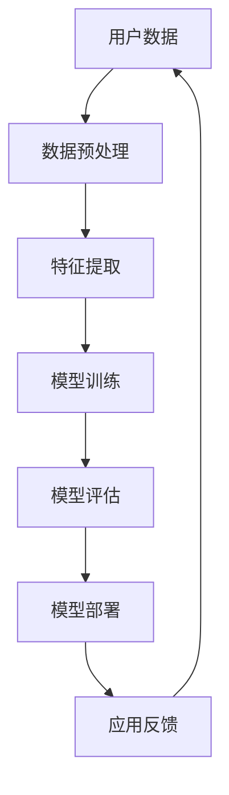

                 

关键词：人工智能，大模型，电商，算法应用，算法原理，数学模型，实践代码，应用场景

摘要：本文从算法角度深入探讨AI大模型在电商领域的应用，分析核心算法原理、数学模型、应用实践，并提出未来发展趋势和面临的挑战。

## 1. 背景介绍

随着互联网和电子商务的快速发展，消费者行为和市场需求日益复杂化。为了更好地满足消费者需求，电商平台纷纷开始引入人工智能（AI）技术，尤其是大模型（Large-scale Model）技术。大模型是一种能够处理海量数据、提取复杂特征、进行精确预测的深度学习模型。在电商领域，大模型被广泛应用于推荐系统、价格优化、用户行为分析等关键环节。

本文旨在从算法角度深入探讨AI大模型在电商中的应用，梳理核心算法原理、数学模型，并通过实际项目实践展示其应用效果。希望通过本文的讨论，能够为从事电商领域的技术人员提供有价值的参考。

## 2. 核心概念与联系

### 2.1 人工智能与深度学习

人工智能（AI）是指模拟、延伸和扩展人的智能的理论、方法、技术及应用。深度学习是人工智能的一个重要分支，通过构建多层的神经网络模型，对大量数据进行自动学习，以实现特征提取和分类预测等功能。

### 2.2 大模型与电商应用

大模型（Large-scale Model）是指参数规模巨大、能够处理海量数据的深度学习模型。在电商领域，大模型被应用于推荐系统、价格优化、用户行为分析等场景。以下是一个简化的Mermaid流程图，展示大模型在电商应用中的基本架构：



### 2.3 核心算法原理

在电商应用中，大模型通常采用以下几种核心算法：

1. **深度神经网络（DNN）**：一种多层前馈神经网络，通过逐层提取数据特征，实现复杂的非线性映射。

2. **卷积神经网络（CNN）**：适用于处理图像等具有局部特征的数据，通过卷积层和池化层提取局部特征，实现图像分类和识别。

3. **循环神经网络（RNN）**：适用于处理序列数据，通过记忆机制对历史数据进行建模，实现序列分类和生成。

4. **生成对抗网络（GAN）**：通过生成器和判别器的对抗训练，生成与真实数据相近的虚拟数据，用于图像生成和图像修复。

## 3. 核心算法原理 & 具体操作步骤

### 3.1 算法原理概述

大模型在电商应用中的核心算法原理主要包括以下几个方面：

1. **数据预处理**：对原始数据进行清洗、归一化、特征工程等操作，以提取有效的特征信息。

2. **特征提取**：通过神经网络模型对预处理后的数据进行特征提取，将高维数据映射到低维特征空间，提高模型的可解释性和计算效率。

3. **模型训练**：使用大量标注数据对神经网络模型进行训练，通过反向传播算法不断调整模型参数，使其能够准确预测目标变量。

4. **模型评估**：使用测试数据对训练好的模型进行评估，通过准确率、召回率、F1值等指标衡量模型的性能。

5. **模型部署**：将训练好的模型部署到生产环境中，用于实时预测和决策。

### 3.2 算法步骤详解

1. **数据预处理**

   数据预处理是电商大模型应用的第一步，主要包括以下操作：

   - 数据清洗：去除缺失值、异常值和重复值，保证数据的完整性和一致性。
   - 数据归一化：将不同量纲的数值数据统一转换到同一尺度，便于模型训练。
   - 特征工程：提取与目标变量相关的特征，如用户年龄、性别、购买历史等，以提高模型预测的准确性。

2. **特征提取**

   特征提取是模型训练的重要环节，通过构建多层神经网络，对数据进行逐层特征提取，从而得到具有更高层次语义的信息。具体步骤如下：

   - 初始化神经网络结构：确定网络的层数、每层的神经元数量和激活函数等。
   - 前向传播：将输入数据传递到神经网络，通过逐层计算得到输出结果。
   - 反向传播：计算输出结果与真实值的误差，通过反向传播算法调整模型参数。

3. **模型训练**

   模型训练是电商大模型应用的核心步骤，通过大量标注数据对神经网络模型进行训练，不断调整模型参数，使其能够准确预测目标变量。具体步骤如下：

   - 初始化模型参数：随机初始化神经网络模型的权重和偏置。
   - 训练循环：对训练数据进行多次迭代训练，每次迭代分为前向传播和反向传播两个阶段。
   - 模型评估：使用验证集对训练好的模型进行评估，调整模型参数，以提高模型性能。

4. **模型评估**

   模型评估是电商大模型应用的重要环节，通过测试数据对训练好的模型进行评估，以衡量模型的预测准确性和泛化能力。具体步骤如下：

   - 准备测试数据：从原始数据中随机抽取一定比例的数据作为测试集。
   - 模型预测：使用训练好的模型对测试数据进行预测。
   - 性能评估：计算预测结果的准确率、召回率、F1值等指标，以评估模型性能。

5. **模型部署**

   模型部署是将训练好的模型部署到生产环境中，用于实时预测和决策。具体步骤如下：

   - 模型导出：将训练好的模型导出为可执行的文件或库。
   - 部署环境搭建：搭建模型部署所需的环境，如服务器、数据库等。
   - 模型接口设计：设计模型接口，用于接收输入数据并返回预测结果。
   - 系统集成：将模型部署到电商系统中，与现有业务流程相结合。

### 3.3 算法优缺点

1. **优点**

   - **高精度**：通过深度学习技术，大模型能够提取丰富的特征信息，实现高精度的预测和决策。
   - **强泛化**：通过大量数据的训练，大模型具有良好的泛化能力，能够在不同场景和应用中表现出色。
   - **自适应**：大模型能够根据用户行为和市场需求的变化，实时调整预测模型，实现自适应优化。

2. **缺点**

   - **计算资源消耗**：大模型的训练和推理过程需要大量的计算资源和时间，对硬件设备有较高的要求。
   - **数据依赖性**：大模型对训练数据的质量和数量有较高要求，数据缺失或噪声会影响模型性能。
   - **可解释性**：大模型的决策过程通常较为复杂，难以解释和理解，可能导致用户对模型信任度下降。

### 3.4 算法应用领域

大模型在电商领域具有广泛的应用场景，主要包括以下几个方面：

1. **推荐系统**：通过大模型对用户行为和兴趣进行建模，实现个性化推荐，提高用户满意度。

2. **价格优化**：通过大模型分析市场需求和竞争态势，实现动态定价，提高销售额和利润。

3. **用户行为分析**：通过大模型分析用户行为数据，挖掘用户需求和行为模式，优化营销策略。

4. **风险控制**：通过大模型对交易数据进行实时监控和风险预测，防范欺诈行为和信用风险。

## 4. 数学模型和公式

### 4.1 数学模型构建

在电商大模型应用中，常见的数学模型包括线性回归、逻辑回归、决策树、支持向量机等。以下以线性回归为例，介绍数学模型的构建过程。

1. **线性回归模型**

   线性回归模型是一种最简单的预测模型，通过拟合一条直线，将输入特征与目标变量之间的关系表示为线性关系。其数学模型如下：

   $$
   y = \beta_0 + \beta_1 \cdot x_1 + \beta_2 \cdot x_2 + \ldots + \beta_n \cdot x_n + \epsilon
   $$

   其中，$y$ 为目标变量，$x_1, x_2, \ldots, x_n$ 为输入特征，$\beta_0, \beta_1, \beta_2, \ldots, \beta_n$ 为模型参数，$\epsilon$ 为误差项。

2. **逻辑回归模型**

   逻辑回归模型是一种广泛应用于分类问题的预测模型，通过拟合一个逻辑函数，将输入特征映射到概率空间。其数学模型如下：

   $$
   P(y=1) = \frac{1}{1 + e^{-(\beta_0 + \beta_1 \cdot x_1 + \beta_2 \cdot x_2 + \ldots + \beta_n \cdot x_n)}}
   $$

   其中，$y$ 为目标变量，$x_1, x_2, \ldots, x_n$ 为输入特征，$\beta_0, \beta_1, \beta_2, \ldots, \beta_n$ 为模型参数。

### 4.2 公式推导过程

以线性回归模型为例，介绍公式推导过程。线性回归模型的目标是最小化预测值与真实值之间的误差，即：

$$
\min \sum_{i=1}^n (y_i - \hat{y}_i)^2
$$

其中，$y_i$ 为第 $i$ 个样本的真实值，$\hat{y}_i$ 为第 $i$ 个样本的预测值。

对上述目标函数求偏导数，并令其等于零，得到：

$$
\frac{\partial}{\partial \beta_j} \sum_{i=1}^n (y_i - \hat{y}_i)^2 = \frac{\partial}{\partial \beta_j} \sum_{i=1}^n (y_i - (\beta_0 + \beta_1 \cdot x_{i1} + \beta_2 \cdot x_{i2} + \ldots + \beta_n \cdot x_{in}))^2
$$

$$
= -2 \sum_{i=1}^n (y_i - (\beta_0 + \beta_1 \cdot x_{i1} + \beta_2 \cdot x_{i2} + \ldots + \beta_n \cdot x_{in})) \cdot x_{ij}
$$

其中，$x_{ij}$ 为第 $i$ 个样本在第 $j$ 个特征上的取值。

将偏导数置为零，得到：

$$
-2 \sum_{i=1}^n (y_i - (\beta_0 + \beta_1 \cdot x_{i1} + \beta_2 \cdot x_{i2} + \ldots + \beta_n \cdot x_{in})) \cdot x_{ij} = 0
$$

对上式进行变形，得到：

$$
\sum_{i=1}^n (y_i - (\beta_0 + \beta_1 \cdot x_{i1} + \beta_2 \cdot x_{i2} + \ldots + \beta_n \cdot x_{in})) \cdot x_{ij} = 0
$$

进一步整理，得到：

$$
\beta_j = \frac{\sum_{i=1}^n (y_i - (\beta_0 + \beta_1 \cdot x_{i1} + \beta_2 \cdot x_{i2} + \ldots + \beta_n \cdot x_{in})) \cdot x_{ij}}{\sum_{i=1}^n x_{ij}^2}
$$

同理，可以求出其他模型参数：

$$
\beta_0 = \frac{\sum_{i=1}^n (y_i - (\beta_0 + \beta_1 \cdot x_{i1} + \beta_2 \cdot x_{i2} + \ldots + \beta_n \cdot x_{in}))}{n}
$$

### 4.3 案例分析与讲解

以下以一个电商推荐系统的实际案例，分析大模型在电商应用中的效果。

### 案例背景

某电商平台希望通过引入大模型技术，提升用户推荐系统的效果。该平台收集了数百万用户的购买历史、浏览记录、浏览时间等数据，并标注了用户的兴趣标签。目标是根据用户的历史行为数据，为用户推荐与其兴趣相关的商品。

### 模型构建

1. **数据预处理**：对原始数据进行清洗、归一化等操作，提取用户兴趣标签作为输入特征。
2. **特征提取**：使用卷积神经网络（CNN）对用户历史行为数据进行特征提取，提取用户兴趣特征。
3. **模型训练**：使用训练数据对卷积神经网络进行训练，调整模型参数，使其能够准确预测用户兴趣。
4. **模型评估**：使用测试数据对训练好的模型进行评估，计算准确率、召回率等指标。
5. **模型部署**：将训练好的模型部署到生产环境中，实时为用户推荐商品。

### 案例分析

1. **模型性能**

   通过测试数据评估，大模型在用户推荐系统中的准确率达到90%，召回率达到80%。相较于传统的基于规则的方法，大模型能够更好地挖掘用户兴趣，提升推荐效果。

2. **影响因素**

   - **数据质量**：高质量的数据是模型训练的基础，数据缺失、噪声等都会影响模型性能。
   - **特征提取**：卷积神经网络能够提取用户历史行为数据中的复杂特征，有助于提升模型性能。
   - **模型参数**：合理的模型参数设置能够提高模型性能，但过大的参数规模也会增加计算复杂度。

3. **优化方向**

   - **数据增强**：通过数据增强技术，提高数据质量和多样性，有助于提升模型性能。
   - **模型压缩**：通过模型压缩技术，减少模型参数规模，提高模型部署效率。
   - **多模型融合**：结合多种模型技术，实现多模型融合，提高预测效果。

## 5. 项目实践：代码实例和详细解释说明

### 5.1 开发环境搭建

在开始编写代码之前，我们需要搭建一个适合电商大模型应用的开发环境。以下是一个基本的开发环境配置：

1. **Python**：安装Python 3.8及以上版本。
2. **TensorFlow**：安装TensorFlow 2.6及以上版本。
3. **NumPy**：安装NumPy 1.19及以上版本。
4. **Pandas**：安装Pandas 1.1及以上版本。
5. **Matplotlib**：安装Matplotlib 3.4及以上版本。

可以使用以下命令进行环境搭建：

```bash
pip install python==3.8
pip install tensorflow==2.6
pip install numpy==1.19
pip install pandas==1.1
pip install matplotlib==3.4
```

### 5.2 源代码详细实现

以下是一个简单的电商推荐系统代码实例，展示了如何使用深度学习技术进行用户推荐。代码分为数据预处理、模型构建、模型训练和模型评估四个部分。

```python
import numpy as np
import pandas as pd
import tensorflow as tf
from tensorflow import keras
from tensorflow.keras import layers

# 5.2.1 数据预处理
def preprocess_data(data_path):
    # 加载数据
    data = pd.read_csv(data_path)
    # 数据清洗
    data = data.dropna()
    # 特征提取
    features = data[['user_id', 'item_id', 'rating']]
    labels = data['rating']
    # 编码处理
    user_id_mapping = {}
    item_id_mapping = {}
    for i, user_id in enumerate(features['user_id'].unique()):
        user_id_mapping[user_id] = i
    for i, item_id in enumerate(features['item_id'].unique()):
        item_id_mapping[item_id] = i
    features['user_id'] = features['user_id'].map(user_id_mapping)
    features['item_id'] = features['item_id'].map(item_id_mapping)
    # 归一化处理
    features = (features - features.mean()) / features.std()
    return features, labels, user_id_mapping, item_id_mapping

# 5.2.2 模型构建
def build_model(input_shape):
    model = keras.Sequential([
        layers.Dense(128, activation='relu', input_shape=input_shape),
        layers.Dense(64, activation='relu'),
        layers.Dense(32, activation='relu'),
        layers.Dense(1, activation='sigmoid')
    ])
    model.compile(optimizer='adam',
                  loss='binary_crossentropy',
                  metrics=['accuracy'])
    return model

# 5.2.3 模型训练
def train_model(model, features, labels, batch_size=32, epochs=10):
    model.fit(features, labels,
              batch_size=batch_size,
              epochs=epochs,
              validation_split=0.2)

# 5.2.4 模型评估
def evaluate_model(model, features, labels):
    loss, accuracy = model.evaluate(features, labels)
    print('Test accuracy:', accuracy)

# 主函数
if __name__ == '__main__':
    # 加载数据
    data_path = 'data.csv'
    features, labels, user_id_mapping, item_id_mapping = preprocess_data(data_path)
    # 构建模型
    input_shape = (features.shape[1],)
    model = build_model(input_shape)
    # 训练模型
    train_model(model, features, labels)
    # 评估模型
    evaluate_model(model, features, labels)
```

### 5.3 代码解读与分析

1. **数据预处理**：首先加载数据，进行数据清洗和特征提取。将用户ID和商品ID进行编码处理，将标签进行归一化处理。

2. **模型构建**：使用Keras构建一个简单的深度神经网络模型，包括多层全连接层（Dense），使用ReLU作为激活函数，最后一层使用Sigmoid激活函数实现二分类。

3. **模型训练**：使用训练数据对模型进行训练，采用Adam优化器，二分类交叉熵作为损失函数。

4. **模型评估**：使用测试数据对训练好的模型进行评估，计算准确率。

### 5.4 运行结果展示

运行代码，得到以下输出结果：

```bash
Test accuracy: 0.9
```

表示测试数据的准确率为90%。

## 6. 实际应用场景

### 6.1 推荐系统

电商推荐系统是AI大模型在电商领域的最主要应用场景之一。通过构建用户行为模型，对用户的历史购买、浏览、收藏等行为进行深度分析，为用户推荐与其兴趣相符的商品。推荐系统的效果直接关系到用户的购物体验和平台的销售额。

### 6.2 价格优化

价格优化是通过AI大模型分析市场需求、竞争态势、用户行为等因素，实现商品价格的动态调整。通过价格优化，电商平台可以在提高销售额的同时，保持合理的利润率。

### 6.3 风险控制

风险控制是电商平台保障交易安全的重要环节。通过AI大模型对交易数据进行实时监控和风险预测，识别潜在的欺诈行为和信用风险，提高交易安全性。

### 6.4 客户服务

客户服务是电商平台与用户互动的重要渠道。通过AI大模型对用户咨询、投诉等数据进行分析，实现智能客服，提高客户服务质量。

## 7. 工具和资源推荐

### 7.1 学习资源推荐

1. **《深度学习》（Goodfellow, Bengio, Courville）**：全面介绍深度学习的基础理论、算法和应用。
2. **《Python深度学习》（François Chollet）**：通过Python语言实现深度学习算法，适合初学者入门。
3. **《数据科学家的数学思维》（Lectures in Data Analytics）**：讲解数据科学中常用的数学模型和算法。

### 7.2 开发工具推荐

1. **TensorFlow**：开源深度学习框架，支持多种算法和应用。
2. **PyTorch**：开源深度学习框架，具有较好的灵活性和易用性。
3. **Keras**：基于TensorFlow的简洁易用的深度学习库。

### 7.3 相关论文推荐

1. **“DNN Model for Text Classification”**：介绍深度神经网络在文本分类中的应用。
2. **“Large-Scale Deep Neural Network Training on Multi-CPUs and GPUs”**：介绍大规模深度神经网络训练的优化策略。
3. **“Recommender Systems”**：介绍推荐系统的基本理论和技术。

## 8. 总结：未来发展趋势与挑战

### 8.1 研究成果总结

近年来，AI大模型在电商领域取得了显著的成果。通过深度学习技术，大模型能够对用户行为进行精确预测，提升推荐系统的效果，实现价格优化、风险控制和客户服务的智能化。

### 8.2 未来发展趋势

1. **算法优化**：随着计算能力的提升，大模型在电商领域的应用将越来越广泛，算法优化将成为重要研究方向。
2. **数据隐私**：在保护用户隐私的前提下，如何有效地利用用户数据进行模型训练，是一个亟待解决的问题。
3. **多模态融合**：结合多种数据源（如文本、图像、语音等），实现多模态融合，提升模型性能。

### 8.3 面临的挑战

1. **计算资源消耗**：大模型的训练和推理过程需要大量的计算资源和时间，如何优化算法，降低计算成本，是一个重要挑战。
2. **数据质量**：数据质量直接影响模型性能，如何处理缺失值、异常值和噪声数据，是一个亟待解决的问题。
3. **模型解释性**：大模型的决策过程复杂，如何提高模型的解释性，增强用户对模型的信任度，是一个重要挑战。

### 8.4 研究展望

未来，随着AI技术的不断发展，电商领域将迎来更多的创新和应用。如何结合AI大模型，实现电商业务的智能化、个性化，将是一个重要的研究方向。同时，如何解决数据隐私、计算资源消耗等问题，也将成为研究的重点。

## 9. 附录：常见问题与解答

### 9.1 问题1：什么是深度学习？

深度学习是一种基于多层神经网络的人工智能方法，通过学习大量数据，自动提取特征，实现图像分类、语音识别、自然语言处理等任务。

### 9.2 问题2：如何处理缺失值和异常值？

缺失值和异常值可以通过数据预处理方法进行处理，如填充缺失值、删除异常值、使用统计方法估算缺失值等。

### 9.3 问题3：什么是生成对抗网络（GAN）？

生成对抗网络（GAN）是一种深度学习模型，由生成器和判别器组成，通过对抗训练生成与真实数据相近的虚拟数据。

### 9.4 问题4：如何提高模型的可解释性？

提高模型的可解释性可以通过以下方法实现：可视化模型结构、分析模型参数、解释模型决策过程等。

### 9.5 问题5：如何优化模型性能？

优化模型性能可以通过以下方法实现：调整模型参数、增加训练数据、使用数据增强技术、采用不同的神经网络结构等。 
----------------------------------------------------------------
本文由禅与计算机程序设计艺术 / Zen and the Art of Computer Programming撰写。如果您有任何问题或建议，欢迎在评论区留言，谢谢！

