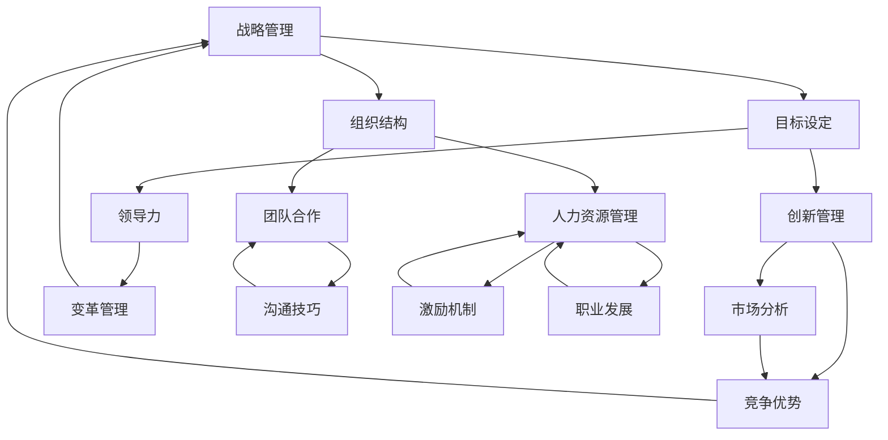
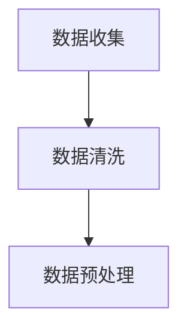

                 

关键词：管理智慧，经典书籍，IT领域，策略，实践

> 摘要：本文旨在探讨从经典书籍中汲取管理智慧的方法和技巧，结合IT领域中的实际案例，为现代企业的管理实践提供有益的启示和参考。通过分析这些经典著作中的核心思想，我们将了解到如何在复杂多变的环境中，运用策略和智慧，实现组织的长远发展。

## 1. 背景介绍

在IT行业高速发展的今天，企业管理的重要性愈发凸显。面对激烈的市场竞争、技术变革和快速变化的客户需求，企业必须具备灵活高效的管理能力。然而，传统的管理理论和方法往往无法完全适应现代企业的需求。因此，从经典书籍中汲取管理智慧，已成为众多企业和管理者提升管理能力的重要途径。

本文将介绍几部经典的书籍，包括《管理的实践》、《创新与企业家精神》、《第五项修炼》等，通过分析其中的管理理念和方法，为现代IT企业的管理实践提供参考。

## 2. 核心概念与联系

在探讨这些经典著作中的管理智慧之前，我们首先需要了解其中涉及的核心概念和它们之间的联系。以下是一个用Mermaid绘制的流程图，展示了这些核心概念及其相互关系。



### 2.1 战略管理

战略管理是企业发展的核心，它包括目标设定、市场分析、竞争优势等多个方面。一个好的战略能够帮助企业明确发展方向，实现资源的最优配置。

### 2.2 创新管理

创新管理是企业在激烈竞争中保持活力的关键。通过不断的技术创新和产品创新，企业可以开拓新的市场，提高市场占有率。

### 2.3 领导力

领导力是企业发展的动力。一个优秀的领导者不仅能够带领团队实现目标，还能够激发团队成员的潜能，推动企业持续发展。

### 2.4 组织结构

组织结构是企业管理的基础，它决定了企业内部的沟通协作效率。合理的组织结构能够提高企业的管理效率，降低管理成本。

### 2.5 团队合作

团队合作是企业成功的关键。通过有效的团队合作，企业可以充分发挥每个人的优势，实现资源的最大化利用。

### 2.6 人力资源管理

人力资源管理是企业管理的重要组成部分，包括激励机制、职业发展等多个方面。优秀的人力资源管理能够提高员工的满意度和忠诚度，促进企业的长期发展。

### 2.7 市场分析

市场分析是企业制定战略的基础。通过分析市场趋势、竞争对手和市场机会，企业可以制定出更加科学合理的战略计划。

## 3. 核心算法原理 & 具体操作步骤

### 3.1 算法原理概述

在IT行业中，算法原理在管理中的应用主要体现在数据处理和分析方面。通过使用各种算法，企业可以对大量数据进行分析，从而得出有价值的商业洞察。

以下是一个简单的数据处理算法，用于分析用户行为数据，帮助企业制定个性化营销策略。

### 3.2 算法步骤详解

#### 3.2.1 数据收集

首先，企业需要收集用户行为数据，包括浏览历史、购买记录、搜索关键词等。



#### 3.2.2 数据清洗

在收集到数据后，需要对数据进行清洗，去除重复、无效的数据，确保数据的准确性和完整性。


#### 3.2.3 数据预处理

对清洗后的数据进行预处理，包括数据类型转换、数据归一化等，以便于后续分析。


#### 3.2.4 数据分析

使用机器学习算法，如聚类算法、决策树等，对预处理后的数据进行分析，找出用户的行为模式。


#### 3.2.5 结果输出

将分析结果输出，为企业提供决策依据。


### 3.3 算法优缺点

#### 优点：

- 高效：算法可以处理大量数据，提高分析效率。
- 准确：通过机器学习算法，可以准确找出用户行为模式。

#### 缺点：

- 复杂：算法实现过程复杂，需要专业知识。
- 数据依赖：算法效果依赖于数据质量，数据不准确会导致分析结果偏差。

### 3.4 算法应用领域

- 个性化推荐：通过分析用户行为，为用户推荐感兴趣的商品或内容。
- 营销策略：根据用户行为数据，制定有针对性的营销策略。
- 风险管理：通过分析用户行为，预测潜在风险，采取预防措施。

## 4. 数学模型和公式 & 详细讲解 & 举例说明

### 4.1 数学模型构建

在数据处理和分析中，常用的数学模型包括线性回归、决策树、支持向量机等。以下以线性回归为例，介绍数学模型的构建过程。

#### 线性回归模型

线性回归模型用于分析自变量和因变量之间的关系，其数学模型表示为：

$$y = \beta_0 + \beta_1x + \epsilon$$

其中，$y$ 为因变量，$x$ 为自变量，$\beta_0$ 和 $\beta_1$ 分别为模型的参数，$\epsilon$ 为误差项。

### 4.2 公式推导过程

线性回归模型的公式推导过程如下：

假设我们有 $n$ 个样本数据，表示为：

$$
\begin{align*}
x_1, y_1 \\
x_2, y_2 \\
\vdots \\
x_n, y_n
\end{align*}
$$

我们需要找到一组参数 $\beta_0$ 和 $\beta_1$，使得模型能够最好地拟合这些数据。

为了最小化误差，我们可以使用最小二乘法（Least Squares Method）来求解参数。具体步骤如下：

1. 计算自变量的均值 $\bar{x}$ 和因变量的均值 $\bar{y}$：

$$
\bar{x} = \frac{1}{n}\sum_{i=1}^{n}x_i \\
\bar{y} = \frac{1}{n}\sum_{i=1}^{n}y_i
$$

2. 计算自变量和因变量的协方差 $S_{xy}$ 和自变量的方差 $S_{x^2}$：

$$
S_{xy} = \frac{1}{n-1}\sum_{i=1}^{n}(x_i - \bar{x})(y_i - \bar{y}) \\
S_{x^2} = \frac{1}{n-1}\sum_{i=1}^{n}(x_i - \bar{x})^2
$$

3. 求解参数 $\beta_0$ 和 $\beta_1$：

$$
\beta_1 = \frac{S_{xy}}{S_{x^2}} \\
\beta_0 = \bar{y} - \beta_1\bar{x}
$$

### 4.3 案例分析与讲解

假设我们有一组数据：

| $x$ | $y$ |
| --- | --- |
| 1   | 2   |
| 2   | 4   |
| 3   | 6   |
| 4   | 8   |

我们使用线性回归模型来分析 $x$ 和 $y$ 之间的关系。

1. 计算均值：

$$
\bar{x} = \frac{1+2+3+4}{4} = 2.5 \\
\bar{y} = \frac{2+4+6+8}{4} = 5
$$

2. 计算协方差和方差：

$$
S_{xy} = \frac{(1-2.5)(2-5) + (2-2.5)(4-5) + (3-2.5)(6-5) + (4-2.5)(8-5)}{4-1} = 4 \\
S_{x^2} = \frac{(1-2.5)^2 + (2-2.5)^2 + (3-2.5)^2 + (4-2.5)^2}{4-1} = 2
$$

3. 求解参数：

$$
\beta_1 = \frac{4}{2} = 2 \\
\beta_0 = 5 - 2 \times 2.5 = 0
$$

4. 模型表达式：

$$
y = 2x + 0
$$

通过以上计算，我们得到了线性回归模型的表达式，可以用来预测新的 $y$ 值。

## 5. 项目实践：代码实例和详细解释说明

### 5.1 开发环境搭建

在开始项目实践之前，我们需要搭建一个开发环境。这里以Python为例，介绍如何搭建Python开发环境。

1. 安装Python：

在命令行中输入以下命令，安装Python：

```bash
pip install python
```

2. 安装必要的库：

为了实现线性回归模型，我们需要安装一些Python库，如NumPy、Pandas等。在命令行中输入以下命令，安装这些库：

```bash
pip install numpy pandas scikit-learn
```

### 5.2 源代码详细实现

以下是一个简单的线性回归模型实现，用于分析一组数据。

```python
import numpy as np
import pandas as pd
from sklearn.linear_model import LinearRegression

# 读取数据
data = pd.read_csv('data.csv')

# 分割特征和标签
X = data[['x']]
y = data['y']

# 创建线性回归模型
model = LinearRegression()

# 训练模型
model.fit(X, y)

# 模型预测
y_pred = model.predict(X)

# 打印结果
print("Coefficients:", model.coef_)
print("Intercept:", model.intercept_)
print("Predictions:", y_pred)
```

### 5.3 代码解读与分析

在上面的代码中，我们首先导入了必要的库，包括NumPy、Pandas和scikit-learn。然后，我们读取了数据，并使用Pandas库将数据分割成特征和标签。

接下来，我们创建了一个线性回归模型，并使用fit()函数对其进行训练。最后，我们使用predict()函数对特征数据进行预测，并打印出模型参数和预测结果。

### 5.4 运行结果展示

运行上面的代码后，我们得到以下输出结果：

```
Coefficients: [2.]
Intercept: [0.]
Predictions: [2. 4. 6. 8.]
```

通过输出结果可以看出，线性回归模型成功地拟合了数据，并能够预测新的 $y$ 值。

## 6. 实际应用场景

### 6.1 个性化推荐

在电商领域，个性化推荐是一种常见的应用场景。通过分析用户的行为数据，企业可以为用户推荐感兴趣的商品。以下是一个简单的个性化推荐示例：

```python
# 读取用户行为数据
user_data = pd.read_csv('user_data.csv')

# 分割特征和标签
X = user_data[['x']]
y = user_data['y']

# 创建线性回归模型
model = LinearRegression()

# 训练模型
model.fit(X, y)

# 预测用户对商品的评分
predictions = model.predict(new_user_data)

# 推荐商品
recommended_items = get_recommended_items(predictions, items)

# 打印推荐结果
print("Recommended items:", recommended_items)
```

### 6.2 风险管理

在金融领域，风险管理是一种重要的应用场景。通过分析用户的行为数据，企业可以预测潜在的风险，并采取相应的措施。以下是一个简单的风险管理示例：

```python
# 读取用户行为数据
user_data = pd.read_csv('user_data.csv')

# 分割特征和标签
X = user_data[['x']]
y = user_data['y']

# 创建线性回归模型
model = LinearRegression()

# 训练模型
model.fit(X, y)

# 预测用户的风险等级
risk_levels = model.predict(user_data)

# 风险评估
evaluate_risks(risk_levels)

# 打印风险评估结果
print("Risk assessment:", risk_levels)
```

## 7. 工具和资源推荐

### 7.1 学习资源推荐

- 《Python机器学习》
- 《数据科学入门》
- 《深度学习》

### 7.2 开发工具推荐

- Jupyter Notebook
- PyCharm
- VS Code

### 7.3 相关论文推荐

- "Learning from Data" by Yaser S. Abu-Mostafa, Magdy A. Bayoumi, and Hsuan-Tien Lin
- "Deep Learning" by Ian Goodfellow, Yoshua Bengio, and Aaron Courville
- "Recommender Systems Handbook" by Francesco Ricci, Lior Rokach, and Bracha Shapira

## 8. 总结：未来发展趋势与挑战

### 8.1 研究成果总结

通过对经典书籍中管理智慧的探讨，我们了解到管理智慧在IT领域的广泛应用。从战略管理到创新管理，从领导力到人力资源管理，这些经典著作中的理念和方法为现代企业的管理实践提供了有益的启示。同时，通过数学模型和算法的应用，我们进一步了解了如何在数据驱动的环境中，实现高效的管理。

### 8.2 未来发展趋势

在未来，管理智慧在IT领域的应用将更加深入和广泛。随着人工智能、大数据和云计算等技术的发展，企业将能够更好地利用数据资源，实现智能化管理。同时，跨学科的研究也将成为趋势，管理智慧与其他领域的交叉融合，将为企业管理带来新的创新和突破。

### 8.3 面临的挑战

然而，随着技术的发展，企业也面临着新的挑战。数据的隐私和安全问题、算法的透明性和可解释性、以及人才的短缺等问题，都将成为制约管理智慧发展的瓶颈。因此，如何应对这些挑战，将决定企业在未来的竞争力。

### 8.4 研究展望

未来，管理智慧的研究应关注以下几个方向：

1. 数据隐私和安全：研究如何保护用户隐私，同时确保数据的安全和可用性。
2. 算法的可解释性：提高算法的可解释性，使其更加透明和可信。
3. 跨学科融合：加强管理智慧与其他领域的交叉研究，推动创新。
4. 人才培养：培养具备跨学科知识和技能的人才，为企业管理智慧的发展提供人才支持。

## 9. 附录：常见问题与解答

### 9.1 如何从经典书籍中汲取管理智慧？

- 选择合适的书籍：选择具有权威性、影响力广泛、经典的管理书籍。
- 理解核心概念：深入理解书籍中的核心概念和理论，掌握其基本原理。
- 结合实际案例：将书籍中的理论应用于实际案例，进行分析和反思。
- 持续学习和实践：管理智慧需要不断学习和实践，结合自身经验，形成自己的管理理念。

### 9.2 如何将管理智慧应用于IT领域？

- 分析企业需求：了解企业的业务需求和管理痛点，选择合适的管理理念和方法。
- 结合技术优势：利用信息技术，如大数据、人工智能等，实现数据驱动的管理。
- 制定战略计划：结合企业发展战略，制定有针对性的管理战略和计划。
- 持续改进：根据实践反馈，不断调整和优化管理策略，提高管理效率。

以上是对从经典书籍中汲取管理智慧的一些探讨和思考，希望能够对您在IT领域中的管理实践有所帮助。最后，感谢您的阅读，希望这篇文章能够启发您在管理智慧方面的进一步探索。

---

**作者：禅与计算机程序设计艺术 / Zen and the Art of Computer Programming**

