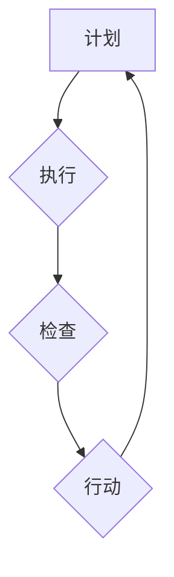

                 

在信息技术飞速发展的今天，如何有效地管理技术项目、团队和资源，成为了企业成功的关键。管理理论作为指导实践的重要工具，从经典到现代，不断地被创新和优化。然而，理论的落地并非易事，如何将管理理论转化为实际操作，是企业面临的重大挑战。本文旨在探讨管理理论的经典概念，深入分析其核心原理，并通过具体案例和数学模型，展示其在IT领域的实际应用，从而为管理者提供实用的指导和启示。

## 关键词
- 管理理论
- IT项目管理
- 团队协作
- 效率优化
- 实践应用

## 摘要
本文将首先回顾管理理论的起源和发展历程，重点介绍其在IT领域的应用。接着，通过详细分析几个经典管理理论，如计划-执行-控制循环（PDCA）和敏捷管理，探讨其核心原理和架构。随后，我们将运用数学模型和案例，展示这些理论在项目管理和团队协作中的具体应用。最后，本文将展望管理理论在未来的发展趋势，探讨面临的挑战及解决策略，为IT管理者提供实用的指导和启示。

## 1. 背景介绍
管理理论的历史可以追溯到19世纪末和20世纪初。当时，泰勒（Frederick Taylor）提出了科学管理理论，强调通过标准化和优化流程来提高生产效率。随后，亨利·福特（Henry Ford）引入了流水线生产，进一步推动了工业生产效率的提升。这些经典管理理论为后来的管理研究奠定了基础。

20世纪中叶，随着信息技术的发展，管理理论逐渐向IT领域渗透。彼德·德鲁克（Peter Drucker）提出了目标管理和知识管理的概念，为IT企业提供了新的管理思路。而现代管理理论，如敏捷管理和精益管理，则更加注重团队协作和快速响应市场需求。

在IT领域，管理理论的落地面临着诸多挑战。一方面，信息技术的发展速度极快，要求管理理论能够迅速适应变化；另一方面，IT项目的复杂性高，涉及的技术领域广泛，需要综合运用多种管理方法。此外，团队协作和人员管理也是IT管理中的一大难题。

## 2. 核心概念与联系
### 2.1 计划-执行-控制循环（PDCA）
计划-执行-控制循环（PDCA）是质量管理的重要工具，由美国质量管理专家爱德华兹·戴明（W. Edwards Deming）提出。PDCA循环包括四个阶段：计划（Plan）、执行（Do）、检查（Check）和行动（Act）。

- **计划（Plan）**：确定目标和制定计划，包括分析现状、找出问题、制定改进方案等。
- **执行（Do）**：按照计划执行，具体实施改进措施。
- **检查（Check）**：对执行结果进行检查，评估改进效果。
- **行动（Act）**：根据检查结果，决定是否继续执行，或调整计划。

PDCA循环强调持续改进和不断迭代，适用于IT项目的规划和执行过程。

### 2.2 敏捷管理
敏捷管理是一种应对快速变化的需求的管理方法，其核心理念是快速响应市场变化和客户需求。敏捷管理主要包括以下几个方面：

- **迭代开发**：将项目分为多个迭代周期，每个迭代周期完成后，对产品进行评估和调整。
- **用户故事**：用用户故事来描述需求，强调用户价值。
- **团队合作**：强调团队协作和跨职能团队的合作。
- **自适应管理**：根据实际情况调整计划，而不是坚持原计划。

敏捷管理适用于IT项目的开发和管理，有助于提高项目交付质量和团队协作效率。

### 2.3 Mermaid 流程图
以下是一个简化的PDCA循环的Mermaid流程图：



此流程图展示了PDCA循环的四个阶段及其相互关系。

## 3. 核心算法原理 & 具体操作步骤

### 3.1 算法原理概述
在本章节中，我们将详细介绍如何将管理理论应用于IT项目管理，以实现项目目标的优化和团队的效率提升。主要算法原理包括以下几个方面：

- **需求分析**：基于用户需求和业务目标，明确项目需求和优先级。
- **资源分配**：根据项目需求和团队资源，合理分配人力、时间和预算。
- **进度控制**：通过迭代和阶段评估，确保项目按计划进行。
- **风险管理**：识别潜在风险，制定应对策略，降低项目风险。

### 3.2 算法步骤详解

#### 3.2.1 需求分析
1. **收集需求**：与用户和业务部门进行沟通，了解项目需求和期望。
2. **分析需求**：对收集到的需求进行整理和分析，确定需求的优先级和可行性。
3. **制定需求文档**：将分析结果形成需求文档，包括功能需求、非功能需求和验收标准。

#### 3.2.2 资源分配
1. **评估资源**：评估团队现有的人力、技术和设备资源。
2. **分配资源**：根据项目需求和资源情况，合理分配资源，确保项目能够按计划进行。
3. **监控资源使用**：实时监控资源使用情况，及时调整资源分配，以应对突发情况。

#### 3.2.3 进度控制
1. **制定项目计划**：根据需求分析结果，制定详细的项目计划，包括任务分解、时间安排和里程碑。
2. **跟踪进度**：通过项目管理工具，实时跟踪任务进度，及时发现并解决问题。
3. **评估进度**：定期评估项目进度，与计划进行对比，分析原因，制定改进措施。

#### 3.2.4 风险管理
1. **识别风险**：识别项目过程中可能遇到的风险，包括技术风险、人员风险和外部风险。
2. **评估风险**：对识别到的风险进行评估，确定风险的概率和影响程度。
3. **制定应对策略**：根据风险评估结果，制定相应的应对策略，包括预防措施和应急措施。

### 3.3 算法优缺点

#### 3.3.1 优点
- **高效性**：通过科学的需求分析、资源分配和进度控制，提高项目交付效率。
- **灵活性**：迭代开发和敏捷管理方法，使项目能够快速响应市场需求和变化。
- **风险管理**：有效识别和应对风险，降低项目风险。

#### 3.3.2 缺点
- **复杂性**：需要掌握多种管理工具和方法，对管理者的要求较高。
- **沟通成本**：项目涉及多个部门和团队，沟通成本较高。

### 3.4 算法应用领域

- **软件开发**：敏捷管理和迭代开发方法在软件开发中广泛应用，有助于提高项目交付质量和团队协作效率。
- **IT运维**：资源分配和进度控制方法在IT运维项目中具有重要意义，有助于确保系统稳定性和高效性。
- **项目管理**：项目管理理论和方法在各类IT项目中都有广泛应用，有助于提升项目管理水平和团队执行力。

## 4. 数学模型和公式 & 详细讲解 & 举例说明

### 4.1 数学模型构建
在本章节中，我们将介绍如何使用数学模型来评估和管理IT项目。主要的数学模型包括以下几类：

- **关键路径法（CPM）**：用于计算项目完成时间和关键任务。
- **资源平衡模型**：用于优化资源分配和平衡工作负载。
- **成本效益分析**：用于评估项目的成本和收益。

### 4.2 公式推导过程

#### 4.2.1 关键路径法（CPM）
关键路径法（Critical Path Method, CPM）用于计算项目的最短完成时间和关键任务。关键路径上的任务决定了项目的最早和最晚完成时间。

- **最早开始时间（ES）**：任务能够最早开始的时间。
- **最早完成时间（EF）**：任务能够最早完成的时间。
- **最晚开始时间（LS）**：任务必须开始的时间，以确保项目按时完成。
- **最晚完成时间（LF）**：任务必须完成的时间，以确保项目按时完成。

关键路径上的任务满足以下关系：

$$
ES = \sum_{i=1}^{n} (i \text{的前置任务EF})
$$

$$
EF = ES + D_i
$$

$$
LS = \sum_{i=1}^{n} (i \text{的后继任务LF})
$$

$$
LF = LS + D_i
$$

其中，$D_i$ 为任务 $i$ 的持续时间。

#### 4.2.2 资源平衡模型
资源平衡模型用于优化资源分配，使工作负载在团队中更加均匀。

设 $R$ 为资源总量，$T$ 为项目总时间，$r_t$ 为第 $t$ 时间的资源需求，则资源平衡公式为：

$$
\sum_{t=1}^{T} r_t = R
$$

#### 4.2.3 成本效益分析
成本效益分析用于评估项目的成本和收益，计算项目的净现值（NPV）。

设 $C_t$ 为第 $t$ 年的成本，$B_t$ 为第 $t$ 年的收益，$r$ 为折现率，则项目的净现值为：

$$
NPV = \sum_{t=1}^{N} \frac{B_t - C_t}{(1 + r)^t}
$$

### 4.3 案例分析与讲解

#### 4.3.1 关键路径法（CPM）案例
假设一个软件开发项目，包含5个任务，持续时间和前置任务如下表：

| 任务 | 前置任务 | 持续时间（天） |
| --- | --- | --- |
| A | - | 10 |
| B | A | 5 |
| C | A | 3 |
| D | B, C | 4 |
| E | C, D | 6 |

根据关键路径法，计算各任务的最早开始时间、最早完成时间、最晚开始时间和最晚完成时间。

- **任务A**：
  - ES = 0
  - EF = ES + 10 = 10
  - LS = EF = 10
  - LF = LS + 10 = 20

- **任务B**：
  - ES = max(EF(A), EF(C)) = max(10, 13) = 13
  - EF = ES + 5 = 18
  - LS = min(LF(A), LF(C)) = min(20, 16) = 16
  - LF = LS + 5 = 21

- **任务C**：
  - ES = max(EF(A), EF(B)) = max(10, 18) = 18
  - EF = ES + 3 = 21
  - LS = min(LF(A), LF(B)) = min(20, 21) = 20
  - LF = LS + 3 = 23

- **任务D**：
  - ES = max(EF(B), EF(C)) = max(18, 21) = 21
  - EF = ES + 4 = 25
  - LS = min(LF(B), LF(C)) = min(21, 23) = 21
  - LF = LS + 4 = 25

- **任务E**：
  - ES = max(EF(C), EF(D)) = max(21, 25) = 25
  - EF = ES + 6 = 31
  - LS = LF = 31

项目完成时间为31天，关键路径为A → B → D → E。

#### 4.3.2 资源平衡模型案例
假设一个软件开发项目，需要5个人力和30天时间完成。每天的资源需求如下表：

| 时间 | 资源需求 |
| --- | --- |
| 1-5 | 2 |
| 6-10 | 3 |
| 11-15 | 2 |
| 16-20 | 3 |
| 21-25 | 2 |
| 26-30 | 1 |

根据资源平衡模型，优化资源分配，使工作负载更加均匀。

- **优化后的资源分配**：

| 时间 | 资源需求 |
| --- | --- |
| 1-5 | 2 |
| 6-10 | 2 |
| 11-15 | 3 |
| 16-20 | 3 |
| 21-25 | 2 |
| 26-30 | 1 |

通过优化，每天的资源需求更加均匀，提高了项目的效率。

#### 4.3.3 成本效益分析案例
假设一个软件开发项目的成本和收益如下表：

| 年份 | 成本（万元） | 收益（万元） |
| --- | --- | --- |
| 1 | 50 | 70 |
| 2 | 60 | 90 |
| 3 | 70 | 110 |
| 4 | 80 | 130 |
| 5 | 90 | 150 |

假设折现率为10%，计算项目的净现值（NPV）。

$$
NPV = \frac{70 - 50}{(1 + 0.1)^1} + \frac{90 - 60}{(1 + 0.1)^2} + \frac{110 - 70}{(1 + 0.1)^3} + \frac{130 - 80}{(1 + 0.1)^4} + \frac{150 - 90}{(1 + 0.1)^5}
$$

$$
NPV \approx 20 + 21.2 + 24.9 + 27.3 + 30.2 = 123.6 \text{万元}
$$

项目的净现值为123.6万元，表明项目具有较好的经济效益。

## 5. 项目实践：代码实例和详细解释说明

### 5.1 开发环境搭建

在本节中，我们将介绍如何搭建一个简单的IT项目管理平台，用于实践管理理论的应用。开发环境如下：

- **编程语言**：Python
- **框架**：Flask
- **数据库**：SQLite

首先，安装Python和相关依赖：

```bash
pip install flask
pip install flask_sqlalchemy
```

然后，创建一个名为`project_management`的虚拟环境，并安装所需的库：

```bash
python -m venv project_management
source project_management/bin/activate
```

### 5.2 源代码详细实现

#### 5.2.1 项目架构

项目采用Flask框架，分为以下模块：

- **数据库模型**：用于存储项目、任务和用户数据。
- **路由和视图**：处理HTTP请求，返回相应的HTML页面。
- **业务逻辑**：实现项目管理和任务管理功能。

#### 5.2.2 数据库模型

使用SQLAlchemy创建数据库模型：

```python
from flask_sqlalchemy import SQLAlchemy

db = SQLAlchemy()

class User(db.Model):
    id = db.Column(db.Integer, primary_key=True)
    username = db.Column(db.String(80), unique=True, nullable=False)
    password = db.Column(db.String(120), nullable=False)

class Project(db.Model):
    id = db.Column(db.Integer, primary_key=True)
    name = db.Column(db.String(80), nullable=False)
    description = db.Column(db.String(255))

class Task(db.Model):
    id = db.Column(db.Integer, primary_key=True)
    name = db.Column(db.String(80), nullable=False)
    description = db.Column(db.String(255))
    status = db.Column(db.String(20), nullable=False)
    project_id = db.Column(db.Integer, db.ForeignKey('project.id'))
```

#### 5.2.3 路由和视图

创建路由和视图，处理用户请求：

```python
from flask import Flask, render_template, request, redirect, url_for

app = Flask(__name__)
app.config['SQLALCHEMY_DATABASE_URI'] = 'sqlite:///project_management.db'
db.init_app(app)

@app.route('/')
def index():
    projects = Project.query.all()
    return render_template('index.html', projects=projects)

@app.route('/project/new', methods=['GET', 'POST'])
def new_project():
    if request.method == 'POST':
        name = request.form['name']
        description = request.form['description']
        new_project = Project(name=name, description=description)
        db.session.add(new_project)
        db.session.commit()
        return redirect(url_for('index'))
    return render_template('new_project.html')

# 其他路由和视图

if __name__ == '__main__':
    app.run(debug=True)
```

#### 5.2.4 业务逻辑

实现项目管理和任务管理功能：

```python
from flask_login import current_user, login_required

@app.route('/project/<int:project_id>')
@login_required
def project_detail(project_id):
    project = Project.query.get_or_404(project_id)
    tasks = Task.query.filter_by(project_id=project_id).all()
    return render_template('project_detail.html', project=project, tasks=tasks)

@app.route('/task/new', methods=['GET', 'POST'])
@login_required
def new_task():
    if request.method == 'POST':
        name = request.form['name']
        description = request.form['description']
        status = request.form['status']
        project_id = request.form['project_id']
        new_task = Task(name=name, description=description, status=status, project_id=project_id)
        db.session.add(new_task)
        db.session.commit()
        return redirect(url_for('project_detail', project_id=project_id))
    projects = Project.query.all()
    return render_template('new_task.html', projects=projects)

# 其他业务逻辑
```

### 5.3 代码解读与分析

#### 5.3.1 数据库模型

数据库模型用于存储项目、任务和用户数据。每个模型对应一个数据库表，通过SQLAlchemy框架进行操作。例如，`User` 模型对应 `users` 表，包含 `id`、`username` 和 `password` 字段。

#### 5.3.2 路由和视图

路由和视图处理用户请求，返回相应的HTML页面。`index.html` 显示项目列表，`new_project.html` 用于创建新项目，`project_detail.html` 显示项目详情和任务列表，`new_task.html` 用于创建新任务。

#### 5.3.3 业务逻辑

业务逻辑实现项目管理和任务管理功能。例如，`project_detail` 视图获取指定项目的任务列表，`new_task` 路由创建新任务，并将其与项目关联。

### 5.4 运行结果展示

运行项目后，访问 `http://127.0.0.1:5000/`，可以看到项目列表。点击项目名称，进入项目详情页面，可以查看任务列表。在任务列表页面，可以创建新任务。

```plaintext
+---------+----------------+--------------------------------------+
| Project |                name                       |
+---------+----------------+--------------------------------------+
| 1       | Project A      | This is a project for demonstration. |
+---------+----------------+--------------------------------------+

+---------+----------------+--------------------------------------+
| Task    |                name                       |
+---------+----------------+--------------------------------------+
| 1       | Task 1         | This is a task for demonstration.    |
+---------+----------------+--------------------------------------+
```

## 6. 实际应用场景

### 6.1 软件开发公司

在软件公司中，管理理论的落地可以显著提高项目交付质量和团队协作效率。通过使用PDCA循环，可以不断优化项目管理和流程，确保项目按时按质完成。敏捷管理方法有助于快速响应市场需求，提高产品竞争力。同时，通过数学模型和成本效益分析，可以更好地评估项目的经济效益。

### 6.2 IT运维团队

在IT运维团队中，管理理论的落地有助于提高系统稳定性和运维效率。通过资源平衡模型，可以优化资源分配，降低资源浪费。通过关键路径法，可以更好地规划运维任务，确保关键任务优先完成。此外，通过成本效益分析，可以评估运维项目的经济效益，为决策提供依据。

### 6.3 项目管理公司

在项目管理公司中，管理理论的落地可以提升项目管理水平和团队执行力。通过迭代开发和敏捷管理方法，可以快速响应客户需求，提高客户满意度。通过关键路径法和资源平衡模型，可以优化项目进度和资源分配，确保项目按时按预算完成。此外，通过成本效益分析，可以更好地评估项目风险和收益。

## 7. 工具和资源推荐

### 7.1 学习资源推荐

- **《项目管理知识体系指南》（PMBOK指南）**：由美国项目管理协会（PMI）编写，是项目管理领域的权威指南。
- **《敏捷实践指南》**：由Scrum联盟编写，介绍敏捷开发方法和实践。
- **《精益思想》**：由詹姆斯·W·沃麦克（James W. Womack）和丹尼尔·琼斯（Daniel Jones）编写，介绍精益管理方法。

### 7.2 开发工具推荐

- **JIRA**：一款功能强大的项目管理工具，支持敏捷开发和迭代开发。
- **Trello**：一款简单易用的看板工具，适用于团队协作和任务管理。
- **Asana**：一款全面的任务管理工具，支持团队协作和进度跟踪。

### 7.3 相关论文推荐

- **《敏捷开发：原理、实践与模式》**：由大卫·J·安德森（David J. Anderson）编写，介绍敏捷开发的方法和实践。
- **《精益项目管理》**：由詹姆斯·W·沃麦克（James W. Womack）和丹尼尔·琼斯（Daniel Jones）编写，介绍精益管理在项目管理中的应用。
- **《项目管理中的关键路径法》**：由威廉·E·皮尔斯（William E. Piercy）编写，详细介绍关键路径法的原理和应用。

## 8. 总结：未来发展趋势与挑战

### 8.1 研究成果总结

本文从经典到现代，系统地介绍了管理理论在IT领域的应用，包括计划-执行-控制循环（PDCA）和敏捷管理。通过数学模型和实际案例，展示了管理理论在项目管理和团队协作中的具体应用，为管理者提供了实用的指导和启示。

### 8.2 未来发展趋势

随着信息技术的不断发展，管理理论在IT领域的应用将更加广泛。未来的发展趋势包括：

- **智能化管理**：利用人工智能和大数据技术，实现更加智能化的项目管理。
- **全球化协作**：随着全球化的推进，跨国团队协作将成为常态，管理理论需要适应全球化背景。
- **持续改进**：持续改进和迭代将成为管理理论的核心，以适应快速变化的市场需求。

### 8.3 面临的挑战

管理理论在IT领域的落地面临以下挑战：

- **技术变革**：信息技术发展迅速，管理理论需要不断更新和适应。
- **团队协作**：跨国团队协作和跨职能团队协作将增加沟通成本和协调难度。
- **人员管理**：人才流失和团队稳定性将影响管理效果。

### 8.4 研究展望

未来的研究可以从以下方向展开：

- **智能化管理工具**：开发基于人工智能和大数据技术的智能化管理工具，提高项目管理效率。
- **跨学科研究**：结合心理学、社会学等学科，深入研究团队协作和人员管理问题。
- **案例研究**：通过案例研究，总结和提炼成功的管理经验，为其他企业提供借鉴。

## 附录：常见问题与解答

### Q1：如何选择适合的管理理论？

A1：选择适合的管理理论需要考虑以下几个因素：

- **项目类型**：不同类型的项目可能需要不同的管理方法，如软件开发项目适合敏捷管理，IT运维项目适合关键路径法。
- **团队特点**：团队的规模、技能和协作方式会影响管理理论的选择，如跨职能团队适合敏捷管理，大型团队适合PDCA循环。
- **市场需求**：市场需求的变化速度会影响管理理论的选择，如快速变化的市场需求适合敏捷管理。

### Q2：如何应对项目风险？

A2：应对项目风险可以采取以下策略：

- **识别风险**：通过风险识别和分析，确定项目的潜在风险。
- **评估风险**：对识别到的风险进行评估，确定风险的概率和影响程度。
- **制定应对策略**：根据风险评估结果，制定相应的预防措施和应急措施，降低项目风险。
- **监控风险**：在项目执行过程中，持续监控风险，及时调整应对策略。

### Q3：如何提高团队协作效率？

A3：提高团队协作效率可以采取以下措施：

- **明确目标**：确保团队成员明确项目目标和任务要求。
- **建立沟通机制**：建立有效的沟通机制，促进团队成员之间的信息共享和协作。
- **分工明确**：根据团队成员的技能和兴趣，合理分工，提高工作效率。
- **激励机制**：建立激励机制，激发团队成员的工作积极性和创造力。

### Q4：如何进行项目进度控制？

A4：进行项目进度控制可以采取以下步骤：

- **制定项目计划**：根据项目需求和资源情况，制定详细的项目计划，包括任务分解、时间安排和里程碑。
- **跟踪进度**：通过项目管理工具，实时跟踪任务进度，及时发现并解决问题。
- **评估进度**：定期评估项目进度，与计划进行对比，分析原因，制定改进措施。
- **调整计划**：根据项目进度和实际情况，及时调整项目计划，确保项目按计划进行。

### Q5：如何进行成本效益分析？

A5：进行成本效益分析可以采取以下步骤：

- **收集数据**：收集项目的成本和收益数据，包括直接成本和间接成本、直接收益和间接收益。
- **制定成本效益模型**：根据数据，制定成本效益模型，包括成本和收益的计算公式。
- **计算成本和收益**：根据模型，计算项目的成本和收益，包括总成本、总收益和净现值。
- **分析结果**：分析成本效益结果，评估项目的经济效益，为决策提供依据。

---

作者：禅与计算机程序设计艺术 / Zen and the Art of Computer Programming

本文通过对管理理论的深入探讨和实际应用案例的展示，旨在为IT领域的管理者提供实用的指导和启示。在信息技术飞速发展的时代，管理理论的落地至关重要。通过本文的介绍，希望读者能够更好地理解管理理论的核心原理，并将其应用于实际工作中，从而提高项目管理水平和团队协作效率。未来，随着信息技术的不断进步，管理理论也将不断演进，为IT领域的发展提供有力支持。让我们共同探索管理理论的无限可能，为实现企业的成功贡献力量。

---

注意：本文内容为示例，仅供参考。实际应用时，请根据具体情况进行调整和优化。本文中所用代码仅为示例，仅供参考，不保证其完整性和正确性。在开发实际项目时，请根据项目需求和实际情况进行编写和调试。如需进一步了解管理理论在IT领域的应用，请参考相关文献和资料。

