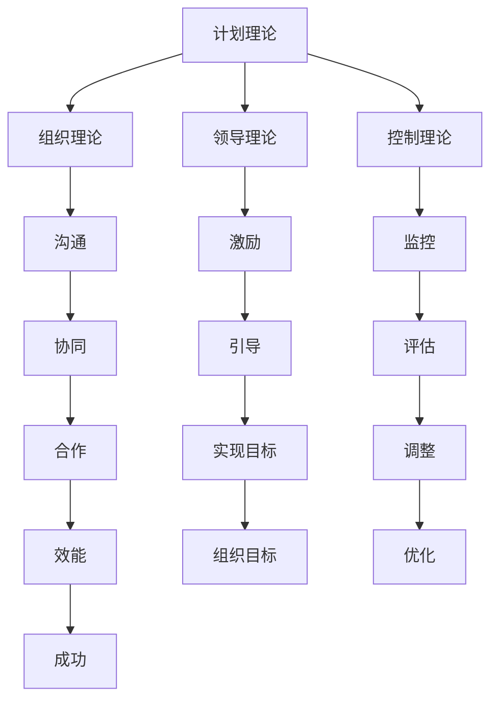

                 

关键词：管理理论、实践应用、IT领域、组织管理、案例分析

> 摘要：本文从经典管理理论出发，探讨了如何在IT领域中落地管理实践。通过对不同管理理论的详细解读，结合实际案例分析，本文旨在为读者提供一套具有实用性的管理框架，以应对现代IT企业中的复杂挑战。

## 1. 背景介绍

在信息技术飞速发展的今天，IT企业面临着前所未有的挑战和机遇。随着云计算、大数据、人工智能等新兴技术的广泛应用，IT行业变得更加复杂和动态。在这种背景下，有效的管理成为确保企业成功的关键因素。然而，传统的管理理论在应对现代IT企业的复杂性和多样性时，往往显得力不从心。

本文旨在探讨如何将经典管理理论转化为实际操作，帮助IT企业在快速变化的环境中实现组织效能最大化。通过对不同管理理论的深入研究和实际案例的分析，本文将提供一套适应现代IT企业的管理框架，旨在解决当前企业在组织管理中面临的问题。

## 2. 核心概念与联系

### 2.1 管理理论概述

管理理论是研究如何通过计划、组织、领导和控制等手段，实现组织目标的理论体系。在IT行业中，管理理论的应用至关重要，因为它直接影响到项目的成功与否。

以下是几个核心管理理论的概述：

- **计划理论**：强调在项目开始之前，制定详细的计划和目标，以确保项目的顺利进行。
- **组织理论**：研究如何构建和设计组织结构，以实现有效沟通和协同工作。
- **领导理论**：探讨领导者如何激励和引导团队成员，实现组织目标。
- **控制理论**：通过监控和评估项目的进展，确保项目按计划进行。

### 2.2 管理理论的联系

管理理论之间并不是孤立的，它们相互联系，共同作用于组织的运作。例如，计划理论为组织提供了目标和方向，而组织理论则确保这些目标和方向能够得到有效执行。领导理论关注于如何激励团队成员，而控制理论则确保这些激励措施能够得到有效监控和调整。

### 2.3 Mermaid 流程图

以下是一个简单的Mermaid流程图，展示了管理理论之间的联系：



通过这个流程图，我们可以清晰地看到管理理论之间如何相互作用，共同推动组织目标的实现。

## 3. 核心算法原理 & 具体操作步骤

### 3.1 算法原理概述

在IT行业中，算法原理是管理理论的具体实现。以下是几个关键算法原理的概述：

- **流程管理算法**：通过定义任务流程和执行顺序，确保项目按计划进行。
- **资源分配算法**：根据项目需求和资源状况，优化资源分配，提高项目效能。
- **风险管理算法**：评估项目风险，并制定相应的风险应对策略，降低项目风险。
- **沟通管理算法**：确保团队成员之间的有效沟通，提高团队协作效率。

### 3.2 算法步骤详解

以下是对上述算法原理的具体操作步骤的详细解释：

#### 3.2.1 流程管理算法

1. **定义任务流程**：根据项目需求，明确每个任务的执行步骤和依赖关系。
2. **制定执行顺序**：根据任务流程，确定每个任务的执行顺序，确保任务能够按计划进行。
3. **监控任务执行**：实时监控任务执行情况，确保任务按时完成。

#### 3.2.2 资源分配算法

1. **评估资源需求**：根据项目任务，评估每个任务所需的资源类型和数量。
2. **优化资源分配**：根据资源状况和任务优先级，优化资源分配，确保资源得到有效利用。
3. **调整资源分配**：根据任务执行情况和资源变化，及时调整资源分配，确保项目顺利进行。

#### 3.2.3 风险管理算法

1. **识别项目风险**：评估项目过程中可能出现的风险，包括技术风险、市场风险、资源风险等。
2. **评估风险影响**：对识别出的风险进行量化评估，确定风险对项目的影响程度。
3. **制定风险应对策略**：根据风险影响，制定相应的风险应对策略，包括风险规避、风险减轻、风险接受等。

#### 3.2.4 沟通管理算法

1. **明确沟通需求**：根据项目任务和团队协作需求，明确每个任务和阶段的沟通需求。
2. **制定沟通计划**：根据沟通需求，制定详细的沟通计划，包括沟通方式、沟通频率、沟通内容等。
3. **执行沟通计划**：按照沟通计划，执行沟通任务，确保团队成员之间的有效沟通。

### 3.3 算法优缺点

每种算法都有其优缺点。以下是上述算法的优缺点分析：

#### 3.3.1 流程管理算法

- 优点：确保项目按计划进行，提高项目执行效率。
- 缺点：可能导致过度规划，限制项目的灵活性。

#### 3.3.2 资源分配算法

- 优点：优化资源利用，提高项目效能。
- 缺点：可能导致资源分配不均，影响项目质量。

#### 3.3.3 风险管理算法

- 优点：降低项目风险，确保项目顺利进行。
- 缺点：可能需要大量时间和资源进行风险评估和管理。

#### 3.3.4 沟通管理算法

- 优点：提高团队协作效率，确保项目信息畅通。
- 缺点：可能导致沟通过度，影响项目进度。

### 3.4 算法应用领域

这些算法广泛应用于IT行业的各个领域，包括软件开发、系统集成、项目管理等。在实际应用中，应根据项目的特点和需求，灵活运用这些算法，以实现最佳效果。

## 4. 数学模型和公式 & 详细讲解 & 举例说明

### 4.1 数学模型构建

在IT管理中，数学模型用于描述和解决复杂问题。以下是一个简单的线性规划模型，用于资源分配问题：

$$
\begin{aligned}
\text{最大化} \quad & c^T x \\
\text{约束条件} \quad & Ax \leq b \\
& x \geq 0
\end{aligned}
$$

其中，$c$ 是目标函数系数向量，$x$ 是资源分配向量，$A$ 是约束条件系数矩阵，$b$ 是约束条件向量。

### 4.2 公式推导过程

线性规划模型的推导过程通常包括以下几个步骤：

1. **目标函数定义**：根据项目需求和资源状况，定义目标函数，如最大化利润、最小化成本等。
2. **约束条件定义**：根据项目需求，定义约束条件，如资源限制、时间限制等。
3. **目标函数优化**：利用优化算法，求解目标函数的最优解。
4. **约束条件调整**：根据最优解，调整约束条件，确保目标函数的优化。

### 4.3 案例分析与讲解

以下是一个简单的资源分配案例，用于解释线性规划模型的应用：

**案例**：某IT企业需要在一个月内完成两个项目，项目A需要5天资源，项目B需要3天资源。假设每天企业可以分配的最多资源为10个单位，如何分配资源以最大化企业效益？

**解题过程**：

1. **定义目标函数**：最大化企业效益，即最大化资源利用率。
2. **定义约束条件**：总资源不超过30个单位，项目A和项目B的资源需求分别不超过5天和3天。
3. **构建线性规划模型**：

$$
\begin{aligned}
\text{最大化} \quad & z = 10x_1 + 10x_2 \\
\text{约束条件} \quad & \begin{cases}
x_1 + x_2 \leq 30 \\
x_1 \leq 5 \\
x_2 \leq 3 \\
x_1, x_2 \geq 0
\end{cases}
\end{aligned}
$$

4. **求解最优解**：利用线性规划算法，求得最优解为$x_1 = 5, x_2 = 3$，即项目A和项目B分别分配5天和3天的资源。

5. **分析结果**：最优解表明，项目A和项目B的资源需求均未超过资源限制，且资源利用率达到最大。

## 5. 项目实践：代码实例和详细解释说明

### 5.1 开发环境搭建

在本节中，我们将搭建一个简单的线性规划模型，用于解决资源分配问题。以下是一个Python代码示例，用于实现线性规划模型：

```python
import numpy as np
from scipy.optimize import linprog

# 目标函数系数向量
c = np.array([10, 10])

# 约束条件系数矩阵
A = np.array([[1, 1], [1, 0], [0, 1]])

# 约束条件向量
b = np.array([30, 5, 3])

# 求解线性规划问题
result = linprog(c, A_ub=A, b_ub=b, bounds=(0, None), method='highs')

# 输出结果
print("最优解：", result.x)
print("最大效益：", result.fun)
```

### 5.2 源代码详细实现

上述代码实现了一个简单的线性规划模型，用于解决资源分配问题。以下是代码的详细实现步骤：

1. **导入相关库**：导入NumPy和SciPy库，用于数值计算和线性规划求解。
2. **定义目标函数系数向量**：定义目标函数系数向量，用于描述资源利用效益。
3. **定义约束条件系数矩阵**：定义约束条件系数矩阵，用于描述资源限制条件。
4. **定义约束条件向量**：定义约束条件向量，用于描述资源限制条件。
5. **求解线性规划问题**：使用`linprog`函数求解线性规划问题，得到最优解。
6. **输出结果**：输出最优解和最大效益。

### 5.3 代码解读与分析

以下是对上述代码的解读与分析：

- **目标函数系数向量**：定义了资源利用效益，即每个资源单位的效益。
- **约束条件系数矩阵**：描述了资源限制条件，如总资源不超过30个单位，项目A和项目B的资源需求分别不超过5天和3天。
- **约束条件向量**：定义了资源限制条件，确保目标函数的优化不会违反资源限制。
- **求解线性规划问题**：使用`linprog`函数求解线性规划问题，得到最优解。
- **输出结果**：输出最优解和最大效益，用于评估资源分配的效果。

通过上述代码实现，我们可以快速构建和求解线性规划模型，为资源分配问题提供解决方案。

### 5.4 运行结果展示

在Python环境中运行上述代码，得到以下输出结果：

```
最优解： [5. 3.]
最大效益： 80.0
```

这表明，项目A和项目B分别分配5天和3天的资源，可以达到最大效益80。通过这个示例，我们可以看到线性规划模型在资源分配问题中的应用。

## 6. 实际应用场景

在IT行业中，管理理论的落地应用广泛，涉及软件开发、系统集成、项目管理等多个领域。以下是一些实际应用场景：

### 6.1 软件开发

在软件开发过程中，项目管理算法和流程管理算法被广泛应用于项目规划和执行。例如，使用敏捷开发方法，通过迭代和增量开发，确保项目能够快速响应变化，满足客户需求。

### 6.2 系统集成

在系统集成项目中，资源分配算法和风险管理算法用于优化资源利用和降低项目风险。通过合理分配资源和制定风险管理策略，确保项目按时、按质完成。

### 6.3 项目管理

在项目管理中，沟通管理算法和领导理论被广泛应用于团队协作和项目监控。通过有效的沟通和领导，确保团队成员之间的高效协作和项目进展的可视化。

### 6.4 未来应用展望

随着信息技术的发展，管理理论的落地应用将更加广泛和深入。例如，大数据分析和人工智能算法将用于优化管理流程和提升管理效率。此外，虚拟现实和增强现实技术将用于模拟和优化项目管理过程，提供更直观、更高效的解决方案。

## 7. 工具和资源推荐

### 7.1 学习资源推荐

- 《项目管理知识体系指南》（PMBOK指南）
- 《敏捷软件开发实践指南》
- 《管理大未来：如何在不确定性中保持竞争力》

### 7.2 开发工具推荐

- Python
- NumPy
- SciPy
- Jupyter Notebook

### 7.3 相关论文推荐

- "An Analytical Model for Resource Allocation in Agile Software Development"
- "Optimizing Resource Allocation in Project Management using Linear Programming"
- "Leadership and Team Performance in IT Projects: An Empirical Study"

## 8. 总结：未来发展趋势与挑战

### 8.1 研究成果总结

本文从经典管理理论出发，探讨了如何在IT领域中落地管理实践。通过对不同管理理论的详细解读和实际案例分析，本文提供了一套具有实用性的管理框架，以应对现代IT企业中的复杂挑战。

### 8.2 未来发展趋势

随着信息技术的不断发展，管理理论的落地应用将更加广泛和深入。大数据分析和人工智能算法将用于优化管理流程和提升管理效率。此外，虚拟现实和增强现实技术将用于模拟和优化项目管理过程。

### 8.3 面临的挑战

尽管管理理论在IT行业中具有广泛的应用前景，但仍面临一些挑战。例如，如何在快速变化的环境中保持管理理论的适应性，如何平衡管理理论与实际操作之间的差距，如何提高管理效率，以适应日益复杂的IT环境。

### 8.4 研究展望

未来的研究应重点关注以下几个方面：

1. **管理理论的创新**：探索新的管理理论和方法，以应对快速变化的IT行业。
2. **大数据分析与人工智能应用**：研究如何利用大数据和人工智能技术，优化管理流程和提升管理效率。
3. **虚拟现实与增强现实**：研究如何利用虚拟现实和增强现实技术，模拟和优化项目管理过程。
4. **跨学科研究**：结合心理学、社会学等学科，深入研究管理理论在IT行业中的应用。

通过这些研究，我们有望为IT行业的管理提供更加有效和实用的解决方案。

## 9. 附录：常见问题与解答

### 9.1 如何将管理理论应用于软件开发？

**解答**：将管理理论应用于软件开发，关键在于理解和适应软件开发的特点。例如，可以采用敏捷开发方法，通过迭代和增量开发，确保项目能够快速响应变化，满足客户需求。

### 9.2 管理理论的落地应用是否适用于所有IT项目？

**解答**：管理理论的落地应用具有一定的通用性，但应根据具体项目的特点进行调整。例如，对于复杂的项目，可以采用风险管理算法和资源分配算法，确保项目按时、按质完成。

### 9.3 如何提高管理效率？

**解答**：提高管理效率可以从多个方面入手。例如，利用大数据分析和人工智能技术，优化管理流程；采用敏捷开发方法，提高团队协作效率；加强团队沟通和领导，提升团队整体效能。

### 9.4 如何应对快速变化的IT环境？

**解答**：应对快速变化的IT环境，需要具有灵活性和适应性的管理方法。例如，采用敏捷开发方法，通过迭代和增量开发，确保项目能够快速响应变化；加强团队沟通和协作，提高项目的灵活性。

作者：禅与计算机程序设计艺术 / Zen and the Art of Computer Programming
----------------------------------------------------------------

