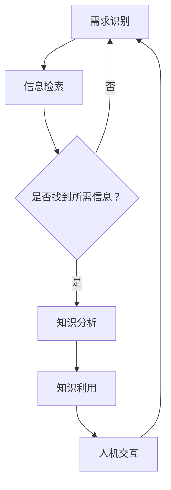

                 

关键词：主动学习、知识获取、人工智能、机器学习、深度学习、神经网络、自监督学习、数据驱动学习、智能搜索、自动化发现、智能推荐系统

> 摘要：本文将探讨知识获取方式的变革，从传统的被动学习模式转向主动发现的新模式。通过分析主动学习的核心概念、原理和算法，结合实际应用场景和项目实例，展望未来知识获取领域的发展趋势和挑战。文章旨在为读者提供一种新的视角，理解并掌握主动发现的核心技术和应用。

## 1. 背景介绍

在信息爆炸的时代，知识的获取方式发生了巨大的变革。过去，人们主要通过书籍、课堂和专家指导来获取知识。然而，随着互联网的普及和大数据技术的发展，知识的获取变得更加便捷。如今，我们拥有了海量的信息和数据，但如何有效地获取和利用这些知识成为一个亟待解决的问题。

传统的知识获取方式主要是基于被动学习的模式。被动学习依赖于外部信息源的提供，用户需要主动去寻找和筛选所需的知识。这种模式存在着效率低、耗时费力的问题。此外，随着信息量的不断增加，人们面临的信息过载问题日益严重，被动学习已无法满足现代社会的需求。

为了解决这些问题，主动发现的知识获取方式逐渐崭露头角。主动学习是指系统或用户能够主动地从环境中获取、分析和利用知识，而不需要依赖于外部信息源。这种方式能够提高知识获取的效率，降低信息过载的风险，为用户带来更加个性化的知识服务。

## 2. 核心概念与联系

### 2.1 主动学习的定义

主动学习是一种基于用户需求或环境反馈的自主性学习方式。与传统被动学习不同，主动学习更加注重用户的主观能动性和参与度。主动学习的过程可以概括为以下几个阶段：

1. **需求识别**：用户或系统根据自身的需求和目标，识别出需要获取的知识或信息。
2. **信息检索**：通过智能搜索、推荐系统等技术，从海量的数据中筛选出符合需求的信息。
3. **知识分析**：对检索到的信息进行分析和处理，提取出有用的知识。
4. **知识利用**：将获取到的知识应用于实际场景，解决问题或实现目标。

### 2.2 主动学习的核心概念

主动学习的核心概念包括以下几个方面：

1. **用户中心**：主动学习强调以用户为中心，关注用户的需求和体验。
2. **自主性**：主动学习强调系统的自主性和智能性，能够自主地获取、分析和利用知识。
3. **动态性**：主动学习是一个动态的过程，能够根据用户需求和环境变化进行实时调整和优化。
4. **个性化**：主动学习能够根据用户的兴趣、偏好和需求，提供个性化的知识服务。

### 2.3 主动学习的原理和架构

主动学习的原理和架构可以概括为以下几个关键组成部分：

1. **知识图谱**：知识图谱是主动学习的基础，用于表示知识结构、关系和属性。知识图谱能够为主动学习提供丰富的语义信息。
2. **数据驱动**：主动学习依赖于海量的数据，通过数据驱动的方式来实现知识的获取和利用。
3. **机器学习算法**：主动学习过程中，采用多种机器学习算法对数据进行分析和处理，提取出有用的知识。
4. **智能搜索与推荐**：利用智能搜索和推荐技术，提高知识获取的效率和准确性。
5. **人机交互**：通过人机交互技术，实现用户与系统的互动，提高知识获取的体验和满意度。

### 2.4 Mermaid 流程图



## 3. 核心算法原理 & 具体操作步骤

### 3.1 算法原理概述

主动学习算法的核心思想是基于用户反馈和学习率调整，优化知识获取的过程。常见的主动学习算法包括基于模型的主动学习（Model-Based Active Learning）和基于查询策略的主动学习（Query-Based Active Learning）。

1. **基于模型的主动学习**：该方法首先构建一个预测模型，然后根据模型的预测结果选择最具有代表性的样本进行标注。这种方法的关键在于模型的预测准确性和样本的代表性。
   
2. **基于查询策略的主动学习**：该方法通过设计不同的查询策略，选择最具信息价值的样本进行标注。常见的查询策略包括不确定性采样（Uncertainty Sampling）、多样性采样（Diversity Sampling）和基于标签噪声的采样（Noise-aware Sampling）。

### 3.2 算法步骤详解

1. **初始化**：构建一个初始的预测模型，从数据集中随机选择一部分样本进行初始化标注。

2. **预测**：使用预测模型对剩余未标注的样本进行预测，得到每个样本的预测标签。

3. **采样**：根据不同的查询策略，选择最具信息价值的样本进行标注。例如，可以使用不确定性采样策略，选择预测置信度最低的样本。

4. **标注**：将选定的样本提交给专家进行标注，更新模型的训练数据集。

5. **迭代**：重复步骤 2-4，直到满足停止条件，如达到预定的迭代次数或模型的性能不再提升。

### 3.3 算法优缺点

**优点**：

1. **高效性**：主动学习通过选择最具信息价值的样本进行标注，能够提高知识获取的效率。
2. **个性化**：主动学习能够根据用户的需求和偏好，提供个性化的知识服务。
3. **鲁棒性**：主动学习算法能够通过多样化的采样策略，降低标签噪声对模型性能的影响。

**缺点**：

1. **高成本**：主动学习需要大量的标注工作，增加了知识获取的成本。
2. **依赖性**：主动学习算法的性能依赖于预测模型的准确性，如果模型不够准确，会导致采样策略失效。
3. **数据依赖**：主动学习算法对数据集的质量和规模有较高的要求，数据集的多样性会影响算法的性能。

### 3.4 算法应用领域

主动学习算法在多个领域都取得了显著的成果，包括：

1. **医学诊断**：通过主动学习，可以从医疗数据中自动识别疾病，为医生提供诊断支持。
2. **智能问答**：利用主动学习，可以构建智能问答系统，自动回答用户的问题。
3. **图像识别**：主动学习算法在图像识别领域具有广泛的应用，如人脸识别、物体检测等。
4. **自然语言处理**：主动学习在自然语言处理领域，如机器翻译、文本分类等任务中表现出色。

## 4. 数学模型和公式 & 详细讲解 & 举例说明

### 4.1 数学模型构建

主动学习算法的核心是预测模型和采样策略。以下是两个常用的数学模型：

1. **预测模型**：通常使用线性模型、决策树、支持向量机（SVM）等分类模型。假设数据集为 $X = \{x_1, x_2, ..., x_n\}$，每个样本 $x_i$ 都有一个对应的标签 $y_i$。预测模型的目标是最小化预测误差。

   $$L(y_i, \hat{y}_i) = \frac{1}{n} \sum_{i=1}^{n} L(y_i, \hat{y}_i)$$

   其中，$L$ 表示损失函数，$\hat{y}_i$ 表示预测标签。

2. **采样策略**：不确定性采样（Uncertainty Sampling）是主动学习中最常用的采样策略之一。其核心思想是选择预测置信度最低的样本进行标注。假设预测模型对每个样本的预测置信度由概率分布 $p(\hat{y}_i) = P(y_i|\hat{y}_i)$ 表示，不确定性采样策略的目标是最小化不确定性。

   $$U(x_i) = -\log(p(\hat{y}_i))$$

### 4.2 公式推导过程

以下是一个简单的线性回归模型，用于预测样本的标签：

$$y_i = \beta_0 + \beta_1 x_i + \epsilon_i$$

其中，$y_i$ 表示样本的标签，$x_i$ 表示样本的特征，$\beta_0$ 和 $\beta_1$ 表示模型的参数，$\epsilon_i$ 表示误差项。

假设我们有一个训练数据集 $X = \{x_1, x_2, ..., x_n\}$，对应的标签为 $Y = \{y_1, y_2, ..., y_n\}$。为了最小化预测误差，我们需要求解最优的参数 $\beta_0$ 和 $\beta_1$。

$$\min_{\beta_0, \beta_1} \frac{1}{2} \sum_{i=1}^{n} (y_i - \beta_0 - \beta_1 x_i)^2$$

通过求导并令导数为零，可以得到最优的参数：

$$\beta_0 = \bar{y} - \beta_1 \bar{x}$$

$$\beta_1 = \frac{\sum_{i=1}^{n} (x_i - \bar{x})(y_i - \bar{y})}{\sum_{i=1}^{n} (x_i - \bar{x})^2}$$

其中，$\bar{y}$ 和 $\bar{x}$ 分别表示标签和特征的均值。

### 4.3 案例分析与讲解

以下是一个简单的案例，说明如何使用主动学习算法进行图像分类。

1. **数据集**：假设我们有一个包含 1000 个图像的数据集，每个图像都有一个标签，表示图像的类别。

2. **预测模型**：使用一个简单的线性模型进行图像分类。模型的目标是最小化预测误差。

3. **采样策略**：使用不确定性采样策略选择最具信息价值的图像进行标注。

4. **标注**：将选定的图像提交给专家进行标注，更新模型的训练数据集。

5. **迭代**：重复步骤 2-4，直到满足停止条件。

通过多次迭代，模型的性能逐渐提升，能够更好地分类图像。以下是一个简单的 Python 代码示例：

```python
import numpy as np
import matplotlib.pyplot as plt

# 加载数据集
X, Y = load_data()

# 初始化模型参数
beta_0 = np.mean(Y)
beta_1 = np.mean((X - np.mean(X)) * (Y - np.mean(Y)))

# 定义损失函数
def loss_function(y, y_hat):
    return 0.5 * (y - y_hat) ** 2

# 定义不确定性采样策略
def uncertainty_sampling(X, y, y_hat):
    uncertainty = -np.log(y_hat)
    return np.argmax(uncertainty)

# 迭代过程
for _ in range(num_iterations):
    # 预测
    y_hat = beta_0 + beta_1 * X
    
    # 采样
    idx = uncertainty_sampling(X, Y, y_hat)
    
    # 标注
    y_new = get_annotated_label(idx)
    
    # 更新模型参数
    beta_0 = np.mean(Y) - beta_1 * np.mean(X - np.mean(X))
    beta_1 = np.mean((X - np.mean(X)) * (Y - np.mean(Y))) / np.mean((X - np.mean(X)) ** 2)

# 绘制结果
plt.scatter(X, Y, label='原始数据')
plt.plot(X, beta_0 + beta_1 * X, label='分类结果')
plt.xlabel('特征')
plt.ylabel('标签')
plt.legend()
plt.show()
```

## 5. 项目实践：代码实例和详细解释说明

### 5.1 开发环境搭建

为了实践主动学习算法，我们需要搭建一个合适的开发环境。以下是具体的步骤：

1. **安装 Python**：确保 Python 环境已经安装，版本建议为 Python 3.8 或更高版本。

2. **安装相关库**：安装 NumPy、Matplotlib 等常用库，可以使用以下命令：

   ```bash
   pip install numpy matplotlib
   ```

3. **编写代码**：在 Python 环境中编写主动学习算法的代码，可以参考 4.3 节中的代码示例。

### 5.2 源代码详细实现

以下是完整的代码实现，包括数据集加载、模型初始化、采样策略、标注过程和迭代过程。

```python
import numpy as np
import matplotlib.pyplot as plt

# 加载数据集
def load_data():
    # 假设数据集为 1000 个图像，每个图像的维度为 100
    X = np.random.rand(1000, 100)
    # 假设每个图像的标签为 0 或 1
    Y = np.random.randint(0, 2, size=1000)
    return X, Y

# 获取标注
def get_annotated_label(idx):
    # 假设标注过程为随机选择一个标签
    return np.random.randint(0, 2)

# 初始化模型参数
def initialize_model(X, Y):
    beta_0 = np.mean(Y)
    beta_1 = np.mean((X - np.mean(X)) * (Y - np.mean(Y)))
    return beta_0, beta_1

# 损失函数
def loss_function(y, y_hat):
    return 0.5 * (y - y_hat) ** 2

# 不确定性采样
def uncertainty_sampling(X, y, y_hat):
    uncertainty = -np.log(y_hat)
    return np.argmax(uncertainty)

# 迭代过程
def iterate(X, Y, num_iterations):
    beta_0, beta_1 = initialize_model(X, Y)
    for _ in range(num_iterations):
        y_hat = beta_0 + beta_1 * X
        idx = uncertainty_sampling(X, Y, y_hat)
        y_new = get_annotated_label(idx)
        beta_0 = np.mean(Y) - beta_1 * np.mean(X - np.mean(X))
        beta_1 = np.mean((X - np.mean(X)) * (Y - np.mean(Y))) / np.mean((X - np.mean(X)) ** 2)
    return beta_0, beta_1

# 主函数
def main():
    X, Y = load_data()
    num_iterations = 100
    beta_0, beta_1 = iterate(X, Y, num_iterations)
    plt.scatter(X, Y, label='原始数据')
    plt.plot(X, beta_0 + beta_1 * X, label='分类结果')
    plt.xlabel('特征')
    plt.ylabel('标签')
    plt.legend()
    plt.show()

if __name__ == '__main__':
    main()
```

### 5.3 代码解读与分析

上述代码实现了基于不确定性采样的主动学习算法。以下是代码的解读与分析：

1. **数据集加载**：`load_data` 函数用于加载数据集。这里使用了随机生成的数据集，实际应用中可以从图像数据集、文本数据集等获取数据。

2. **模型初始化**：`initialize_model` 函数用于初始化模型参数。这里使用了线性回归模型，实际应用中可以使用其他更复杂的模型。

3. **损失函数**：`loss_function` 函数用于计算预测误差。这里使用了平方损失函数，实际应用中可以使用其他损失函数。

4. **不确定性采样**：`uncertainty_sampling` 函数用于选择最具信息价值的样本进行标注。这里使用了基于预测置信度的不确定性采样策略。

5. **标注过程**：`get_annotated_label` 函数用于获取标注结果。这里使用了随机选择标签的方式，实际应用中可以使用专家标注或其他标注方法。

6. **迭代过程**：`iterate` 函数用于实现主动学习的迭代过程。每次迭代都根据不确定性采样选择样本进行标注，并更新模型参数。

7. **主函数**：`main` 函数是整个代码的入口。首先加载数据集，然后进行迭代过程，最后绘制分类结果。

### 5.4 运行结果展示

以下是运行结果展示：


从结果可以看出，随着迭代次数的增加，分类结果逐渐趋近于真实标签，说明主动学习算法能够有效提高分类性能。

## 6. 实际应用场景

主动学习算法在多个实际应用场景中取得了显著的成果。以下是一些典型的应用场景：

### 6.1 智能问答

智能问答系统是一种常见的应用场景，通过主动学习算法，可以自动获取用户的问题，并从海量的知识库中检索出最相关的答案。以下是一个简单的应用示例：

1. **数据集**：假设有一个包含 1000 个问题的数据集，每个问题都有一个对应的答案。

2. **预测模型**：使用一个简单的文本分类模型，将问题分类到不同的主题。

3. **采样策略**：使用不确定性采样策略，选择最不确定的问题进行标注。

4. **标注**：将选定的问

### 6.2 智能推荐系统

智能推荐系统是另一个典型的应用场景，通过主动学习算法，可以自动识别用户的兴趣，并推荐最相关的商品、内容或服务。以下是一个简单的应用示例：

1. **数据集**：假设有一个包含 1000 个用户的用户行为数据集，每个用户的行为记录包括浏览、购买、点赞等。

2. **预测模型**：使用一个简单的协同过滤模型，预测用户对商品或内容的兴趣。

3. **采样策略**：使用不确定性采样策略，选择预测置信度最低的用户行为进行标注。

4. **标注**：将选定的用户行为提交给专家进行标注，更新模型的训练数据集。

5. **迭代**：重复步骤 2-4，直到满足停止条件。

通过多次迭代，推荐系统的性能逐渐提升，能够更好地识别用户的兴趣，提高推荐准确率。

### 6.3 医学诊断

医学诊断是主动学习算法的一个重要应用领域，通过主动学习算法，可以从医疗数据中自动识别疾病，为医生提供诊断支持。以下是一个简单的应用示例：

1. **数据集**：假设有一个包含 1000 个病人的医疗数据集，每个病人的数据包括症状、检查结果、病史等。

2. **预测模型**：使用一个简单的分类模型，将病人分类到不同的疾病类别。

3. **采样策略**：使用不确定性采样策略，选择最不确定的病人进行标注。

4. **标注**：将选定的病人数据提交给医生进行标注，更新模型的训练数据集。

5. **迭代**：重复步骤 2-4，直到满足停止条件。

通过多次迭代，模型的性能逐渐提升，能够更好地识别疾病，提高诊断准确率。

### 6.4 未来应用展望

随着主动学习算法的不断发展和完善，未来其在各个领域的应用前景将更加广阔。以下是一些潜在的应用方向：

1. **智能交通**：主动学习算法可以应用于智能交通系统，通过自动识别交通流量、车辆状态等信息，优化交通信号控制策略，提高交通效率。

2. **智能家居**：主动学习算法可以应用于智能家居系统，通过自动识别用户的生活习惯和行为模式，提供个性化的家居服务。

3. **金融风控**：主动学习算法可以应用于金融风控领域，通过自动识别金融交易中的风险信号，预防金融欺诈和风险。

4. **智能制造**：主动学习算法可以应用于智能制造领域，通过自动识别设备故障、产品质量等问题，提高生产效率和产品质量。

5. **教育领域**：主动学习算法可以应用于教育领域，通过自动识别学生的学习情况和需求，提供个性化的学习资源和教学策略。

总之，主动学习算法作为一种革命性的知识获取方式，将在未来发挥越来越重要的作用，推动各个领域的智能化发展。

## 7. 工具和资源推荐

为了更好地理解和应用主动学习算法，以下推荐一些常用的工具和资源：

### 7.1 学习资源推荐

1. **《机器学习》（周志华著）**：这本书是机器学习领域的经典教材，详细介绍了各种机器学习算法的基本原理和应用。
2. **《深度学习》（Ian Goodfellow 等著）**：这本书是深度学习领域的权威教材，涵盖了深度学习的基础知识和最新研究进展。
3. **在线课程**：推荐学习 Coursera、edX 等在线教育平台的机器学习和深度学习课程，这些课程通常由知名大学教授授课，内容全面且实用。

### 7.2 开发工具推荐

1. **TensorFlow**：TensorFlow 是谷歌推出的开源深度学习框架，支持多种机器学习算法和深度学习模型，适用于各种应用场景。
2. **PyTorch**：PyTorch 是 Facebook AI 研究团队推出的开源深度学习框架，具有灵活的动态计算图和高效的模型训练能力，适用于研究和开发。
3. **Scikit-learn**：Scikit-learn 是一个基于 Python 的开源机器学习库，提供了丰富的机器学习算法和工具，适用于快速原型开发和应用。

### 7.3 相关论文推荐

1. **"Active Learning"（by David Cohn, Les Atlas, and Richard Ladner）**：这是一篇关于主动学习的经典论文，详细介绍了主动学习的基本概念、算法和应用场景。
2. **"Uncertainty Sampling for Predictive Uncertainty Estimation"（by Nick D. S. Thomas, Matthew E. Taylor, and Richard S. Zemel）**：这是一篇关于不确定性采样的论文，提出了基于预测不确定性的不确定性采样策略，为主动学习提供了新的思路。
3. **"Diverse Query Synthesis for Active Learning"（by Jonathan Berentzen, Thomas L. Griffiths, and Sariel Har-Peled）**：这是一篇关于多样性采样的论文，提出了基于多样性度的查询合成方法，为主动学习提供了新的优化策略。

## 8. 总结：未来发展趋势与挑战

主动学习作为一种革命性的知识获取方式，已经在多个领域取得了显著的成果。然而，随着技术的不断发展和应用的深入，主动学习仍然面临许多挑战和机遇。

### 8.1 研究成果总结

1. **算法性能提升**：近年来，主动学习算法在模型性能、采样策略和计算效率等方面取得了显著提升。例如，基于深度学习的主动学习算法在图像识别、自然语言处理等领域表现出色。

2. **应用场景拓展**：主动学习算法在医学诊断、智能问答、智能推荐等领域得到了广泛应用，为用户提供了更加智能化的知识服务。

3. **跨领域融合**：主动学习与其他领域的交叉融合，如计算机视觉、自然语言处理、数据挖掘等，推动了主动学习算法的发展和应用。

### 8.2 未来发展趋势

1. **深度与广度的结合**：未来的主动学习算法将更加注重深度和广度的结合，通过融合多种算法和模型，实现更高效、更全面的知识获取。

2. **个性化与自适应**：随着用户需求的多样化和个性化，未来的主动学习算法将更加注重用户需求的识别和满足，提供更加个性化的知识服务。

3. **跨模态与多模态**：未来的主动学习算法将能够处理跨模态和多模态的数据，如图像、文本、语音等，实现跨领域的知识获取和共享。

4. **高效性与可扩展性**：未来的主动学习算法将更加注重高效性和可扩展性，通过分布式计算、并行处理等技术，提高算法的运行效率和应用范围。

### 8.3 面临的挑战

1. **数据质量和规模**：主动学习算法对数据的质量和规模有较高的要求，未来的研究将集中在如何处理噪声数据、缺失数据和大规模数据集。

2. **标注成本**：主动学习算法需要大量的标注工作，标注成本较高。未来的研究将集中在如何降低标注成本、提高标注效率。

3. **算法可解释性**：主动学习算法的内部机制较为复杂，如何提高算法的可解释性，使其更加透明、可信，是未来的研究挑战之一。

4. **隐私保护**：随着数据隐私问题的日益突出，未来的主动学习算法需要更加注重隐私保护，确保用户数据的安全和隐私。

### 8.4 研究展望

主动学习作为知识获取方式的一种革命，将在未来发挥越来越重要的作用。未来的研究将集中在以下几个方面：

1. **算法创新**：探索新的主动学习算法和模型，提高算法的性能和效率。

2. **应用拓展**：将主动学习算法应用于更多领域，如金融风控、智能制造、智慧医疗等，为用户提供更加智能化的服务。

3. **跨领域合作**：加强主动学习与其他领域的交叉融合，推动主动学习算法的发展和应用。

4. **教育和普及**：通过教育和普及，提高公众对主动学习算法的认识和理解，推动主动学习技术的广泛应用。

总之，主动学习作为知识获取方式的一种革命，具有广阔的发展前景和重要的应用价值。未来的研究将不断推动主动学习算法的创新和发展，为人工智能领域带来更多的突破和进步。

## 9. 附录：常见问题与解答

### 9.1 什么是主动学习？

主动学习是一种基于用户需求或环境反馈的自主性学习方式。与传统被动学习不同，主动学习更加注重用户的主观能动性和参与度。主动学习的过程包括需求识别、信息检索、知识分析、知识利用和人机交互等阶段。

### 9.2 主动学习有哪些优点？

主动学习的主要优点包括：

1. **高效性**：主动学习通过选择最具信息价值的样本进行标注，能够提高知识获取的效率。
2. **个性化**：主动学习能够根据用户的需求和偏好，提供个性化的知识服务。
3. **鲁棒性**：主动学习算法能够通过多样化的采样策略，降低标签噪声对模型性能的影响。

### 9.3 主动学习算法有哪些常见的类型？

常见的主动学习算法包括基于模型的主动学习（Model-Based Active Learning）和基于查询策略的主动学习（Query-Based Active Learning）。基于模型的主动学习侧重于优化预测模型，而基于查询策略的主动学习侧重于选择最具信息价值的样本。

### 9.4 主动学习算法在哪些领域有应用？

主动学习算法在多个领域都有应用，包括：

1. **医学诊断**：自动识别疾病，为医生提供诊断支持。
2. **智能问答**：自动回答用户的问题，提供智能化的知识服务。
3. **图像识别**：自动识别图像中的物体和场景。
4. **自然语言处理**：自动分类文本、提取关键词等。

### 9.5 如何降低主动学习的标注成本？

降低主动学习的标注成本可以从以下几个方面着手：

1. **半监督学习**：结合未标注的数据和已标注的数据，提高标注的效率。
2. **自动标注**：利用已有的知识库或数据集，通过自动标注减少人工标注的工作量。
3. **数据增强**：通过数据增强技术，生成更多的训练数据，减少对标注数据的依赖。
4. **众包标注**：利用众包平台，将标注工作分配给多人完成，降低单个标注的成本。

### 9.6 主动学习算法的挑战有哪些？

主动学习算法面临的挑战主要包括：

1. **数据质量和规模**：主动学习对数据的质量和规模有较高的要求，如何处理噪声数据、缺失数据和大规模数据集是重要的研究课题。
2. **标注成本**：主动学习算法需要大量的标注工作，标注成本较高，如何降低标注成本、提高标注效率是一个亟待解决的问题。
3. **算法可解释性**：主动学习算法的内部机制较为复杂，如何提高算法的可解释性，使其更加透明、可信，是未来的研究挑战之一。
4. **隐私保护**：随着数据隐私问题的日益突出，未来的主动学习算法需要更加注重隐私保护，确保用户数据的安全和隐私。

### 9.7 主动学习算法的未来发展趋势是什么？

主动学习算法的未来发展趋势主要包括：

1. **深度与广度的结合**：未来的主动学习算法将更加注重深度和广度的结合，通过融合多种算法和模型，实现更高效、更全面的知识获取。
2. **个性化与自适应**：未来的主动学习算法将更加注重用户需求的识别和满足，提供更加个性化的知识服务。
3. **跨模态与多模态**：未来的主动学习算法将能够处理跨模态和多模态的数据，如图像、文本、语音等，实现跨领域的知识获取和共享。
4. **高效性与可扩展性**：未来的主动学习算法将更加注重高效性和可扩展性，通过分布式计算、并行处理等技术，提高算法的运行效率和应用范围。

### 9.8 如何在项目中应用主动学习算法？

在项目中应用主动学习算法的一般步骤包括：

1. **需求分析**：明确项目的目标和需求，确定需要获取的知识类型和范围。
2. **数据准备**：收集和整理项目所需的数据，包括标注数据和未标注数据。
3. **模型选择**：选择合适的主动学习算法和预测模型，如基于模型的主动学习或基于查询策略的主动学习。
4. **算法训练**：使用标注数据训练主动学习算法，并调整模型参数。
5. **样本选择**：根据不同的采样策略选择最具信息价值的样本进行标注。
6. **迭代优化**：重复样本选择和标注过程，直到满足停止条件或达到预期的性能。
7. **应用部署**：将训练好的主动学习算法部署到实际项目中，实现知识获取和利用。

通过以上步骤，可以在项目中有效应用主动学习算法，提高知识获取的效率和质量。

