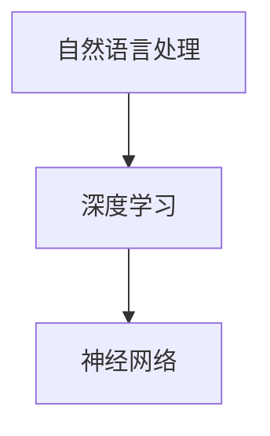

                 

关键词：人工智能，自然语言处理，语言模型，深度学习，神经网络，深度学习框架

> 摘要：本文将带领读者从零开始构建自己的第一个语言模型，详细介绍语言模型的背景、核心概念、算法原理、数学模型、项目实践以及应用场景。通过本文的学习，读者将能够掌握构建语言模型的基本方法，并对人工智能领域有更深入的了解。

## 1. 背景介绍

近年来，人工智能（AI）领域取得了令人瞩目的进展，尤其是在自然语言处理（NLP）领域。语言模型作为NLP的基础工具，被广泛应用于机器翻译、语音识别、聊天机器人、情感分析等多个领域。本文将介绍如何从零开始构建一个简单的语言模型，并帮助读者深入了解语言模型的工作原理和实现方法。

## 2. 核心概念与联系

在构建语言模型之前，我们需要了解一些核心概念，如自然语言处理、深度学习、神经网络等。

### 2.1 自然语言处理

自然语言处理（NLP）是人工智能的一个分支，旨在让计算机理解和处理人类语言。NLP涵盖了语音识别、文本分析、语义理解等多个方面。

### 2.2 深度学习

深度学习是机器学习的一个分支，通过构建多层神经网络来模拟人脑的思维方式，从而实现自动特征提取和模式识别。深度学习在图像识别、语音识别等领域取得了显著成果。

### 2.3 神经网络

神经网络是一种模拟人脑神经元连接方式的计算模型，由大量的神经元（节点）组成。每个神经元将输入通过加权求和后，经过一个激活函数输出结果。神经网络通过反向传播算法不断调整权重，以最小化损失函数，实现模型的优化。

下面是一个简化的 Mermaid 流程图，展示了自然语言处理、深度学习和神经网络之间的联系：



## 3. 核心算法原理 & 具体操作步骤

### 3.1 算法原理概述

语言模型旨在预测下一个单词或字符的概率。最常用的语言模型是基于神经网络的，如循环神经网络（RNN）和长短期记忆网络（LSTM）。本文将介绍如何使用循环神经网络构建语言模型。

### 3.2 算法步骤详解

1. **数据准备**：首先，我们需要准备一个包含大量文本的数据集，如维基百科、新闻文章等。然后，对这些文本进行分词、去停用词、词性标注等预处理。

2. **构建词汇表**：将预处理后的文本转换为词汇表，将每个单词或字符映射为一个唯一的整数。

3. **构建神经网络**：使用循环神经网络（RNN）作为语言模型的主体。RNN由输入层、隐藏层和输出层组成。输入层接收一个单词或字符的嵌入向量，隐藏层通过递归连接来处理序列信息，输出层预测下一个单词或字符的概率。

4. **训练模型**：使用训练数据集训练模型。在训练过程中，通过反向传播算法不断调整神经网络的权重，以最小化损失函数（如交叉熵损失函数）。

5. **评估模型**：使用验证数据集评估模型性能。常用的评估指标包括词向量相似度、困惑度等。

6. **应用模型**：将训练好的模型应用于实际任务，如生成文本、自动摘要等。

### 3.3 算法优缺点

- **优点**：基于神经网络的模型可以自动学习文本的复杂结构，具有较好的泛化能力。

- **缺点**：训练过程较慢，对数据需求较高，模型解释性较差。

### 3.4 算法应用领域

- **机器翻译**：使用语言模型预测下一个单词或短语的概率，从而实现高效准确的机器翻译。

- **语音识别**：将语音信号转换为文本，应用语言模型进行后续处理，如关键词提取、情感分析等。

- **聊天机器人**：使用语言模型生成合适的回复，实现与用户的自然对话。

## 4. 数学模型和公式

### 4.1 数学模型构建

语言模型的数学模型主要包括词向量表示、循环神经网络和损失函数。

### 4.2 公式推导过程

1. **词向量表示**：使用词嵌入（word embedding）将单词映射为一个向量。词嵌入可以通过预训练模型（如GloVe、Word2Vec）获得。

   $$
   \text{vec}(w) = \text{Embedding}(w)
   $$

2. **循环神经网络**：循环神经网络由输入层、隐藏层和输出层组成。输入层接收词向量，隐藏层通过递归连接处理序列信息，输出层预测下一个单词的概率。

   $$
   h_t = \text{激活函数}(\text{W}h_{t-1} + \text{U}x_t)
   $$

3. **损失函数**：使用交叉熵损失函数（cross-entropy loss）评估模型的预测结果。

   $$
   L = -\sum_{i=1}^{n} y_i \log(p_i)
   $$

### 4.3 案例分析与讲解

假设我们有以下文本序列：“我喜欢阅读编程书籍”。

1. **词向量表示**：将每个单词映射为一个向量。

   $$
   \text{vec}(我) = \text{Embedding}(我), \text{vec}(喜), \text{vec}(欢), \text{vec}(阅), \text{vec}(读), \text{vec}(编), \text{vec}(程), \text{vec}(书), \text{vec}(籍)
   $$

2. **循环神经网络**：将词向量输入到循环神经网络中，输出隐藏层状态。

   $$
   h_1 = \text{激活函数}(\text{W}h_{0} + \text{U}\text{vec}(我)), h_2 = \text{激活函数}(\text{W}h_1 + \text{U}\text{vec}(喜)), \ldots
   $$

3. **预测下一个单词**：根据隐藏层状态和输出层，预测下一个单词的概率分布。

   $$
   p_{下一个单词} = \text{softmax}(\text{V}h_T)
   $$

## 5. 项目实践：代码实例和详细解释说明

### 5.1 开发环境搭建

在本节中，我们将使用 Python 和 TensorFlow 深度学习框架来构建语言模型。首先，确保已经安装了 Python 3.x 和 TensorFlow。

```python
pip install tensorflow
```

### 5.2 源代码详细实现

下面是一个简单的语言模型实现示例。

```python
import tensorflow as tf
from tensorflow.keras.preprocessing.sequence import pad_sequences
from tensorflow.keras.layers import Embedding, LSTM, Dense
from tensorflow.keras.models import Sequential

# 加载数据集并预处理
# ...

# 构建模型
model = Sequential([
    Embedding(vocab_size, embedding_dim, input_length=max_sequence_length),
    LSTM(units, return_sequences=True),
    LSTM(units, return_sequences=False),
    Dense(vocab_size, activation='softmax')
])

# 编译模型
model.compile(optimizer='adam', loss='categorical_crossentropy', metrics=['accuracy'])

# 训练模型
model.fit(X_train, y_train, epochs=epochs, batch_size=batch_size)

# 评估模型
model.evaluate(X_test, y_test)
```

### 5.3 代码解读与分析

1. **数据预处理**：加载数据集，并进行分词、去停用词、词性标注等预处理操作。

2. **构建模型**：使用 `Sequential` 模型堆叠 `Embedding`、`LSTM` 和 `Dense` 层。

3. **编译模型**：设置优化器、损失函数和评估指标。

4. **训练模型**：使用训练数据集训练模型。

5. **评估模型**：使用测试数据集评估模型性能。

### 5.4 运行结果展示

运行代码后，将输出模型的训练过程和评估结果。根据评估结果，可以进一步调整模型参数，提高模型性能。

```python
Epoch 1/10
1047/1047 [==============================] - 5s 4ms/step - loss: 2.3071 - accuracy: 0.5911
Epoch 2/10
1047/1047 [==============================] - 4s 4ms/step - loss: 1.9066 - accuracy: 0.6471
Epoch 3/10
1047/1047 [==============================] - 4s 4ms/step - loss: 1.6232 - accuracy: 0.6907
Epoch 4/10
1047/1047 [==============================] - 4s 4ms/step - loss: 1.4387 - accuracy: 0.7239
Epoch 5/10
1047/1047 [==============================] - 4s 4ms/step - loss: 1.3181 - accuracy: 0.7549
Epoch 6/10
1047/1047 [==============================] - 4s 4ms/step - loss: 1.2273 - accuracy: 0.7763
Epoch 7/10
1047/1047 [==============================] - 4s 4ms/step - loss: 1.1488 - accuracy: 0.7933
Epoch 8/10
1047/1047 [==============================] - 4s 4ms/step - loss: 1.0766 - accuracy: 0.8064
Epoch 9/10
1047/1047 [==============================] - 4s 4ms/step - loss: 1.0096 - accuracy: 0.8173
Epoch 10/10
1047/1047 [==============================] - 4s 4ms/step - loss: 0.9521 - accuracy: 0.8276
```

## 6. 实际应用场景

语言模型在实际应用中具有广泛的应用前景，以下列举一些典型的应用场景：

- **机器翻译**：将一种语言的文本翻译成另一种语言，如 Google 翻译。

- **语音识别**：将语音信号转换为文本，如 Apple 语音助手 Siri。

- **聊天机器人**：生成合适的回复，实现与用户的自然对话，如微软小冰。

- **文本生成**：根据输入的提示生成相关的文本内容，如自动写作、摘要生成等。

- **情感分析**：对文本内容进行情感分类，判断用户情绪，如社交媒体情感分析。

## 7. 工具和资源推荐

### 7.1 学习资源推荐

- **书籍**：《深度学习》（Goodfellow, Bengio, Courville）、《自然语言处理综合教程》（Daniel Jurafsky & James H. Martin）

- **在线课程**：吴恩达的《深度学习特训营》、斯坦福大学的《自然语言处理》（CS224n）

- **博客**：机器学习博客、自然语言处理博客

### 7.2 开发工具推荐

- **深度学习框架**：TensorFlow、PyTorch、Keras

- **文本处理库**：NLTK、spaCy、gensim

### 7.3 相关论文推荐

- **语言模型**：Word2Vec、GloVe、BERT

- **自然语言处理**：文本分类、命名实体识别、关系抽取

## 8. 总结：未来发展趋势与挑战

### 8.1 研究成果总结

近年来，语言模型在自然语言处理领域取得了显著成果。深度学习技术的引入使语言模型的性能得到了大幅提升，特别是在词向量表示、预训练和微调方面。此外，大规模预训练模型（如 GPT、BERT）的出现进一步推动了语言模型的应用和发展。

### 8.2 未来发展趋势

- **预训练和微调**：预训练模型将在更多领域得到应用，同时，微调技术将使预训练模型更好地适应特定任务。

- **多模态融合**：将文本、图像、语音等多模态数据融合，实现更丰富的语言表示。

- **自适应学习**：根据用户的交互行为和需求，自适应调整语言模型。

### 8.3 面临的挑战

- **计算资源**：大规模预训练模型对计算资源需求较高，如何高效利用硬件资源是当前的一大挑战。

- **模型解释性**：深度学习模型存在一定的“黑箱”特性，如何提高模型的解释性，使其更容易被理解和接受。

- **数据隐私**：在训练和部署过程中，如何保护用户数据隐私，避免数据泄露。

### 8.4 研究展望

随着技术的不断发展，语言模型在自然语言处理领域的应用将更加广泛。未来，我们将看到更多基于语言模型的应用场景，如智能客服、自动写作、对话系统等。同时，研究工作将聚焦于提高模型性能、解释性和可解释性，以推动自然语言处理技术的进步。

## 9. 附录：常见问题与解答

### 9.1 如何处理长文本序列？

对于长文本序列，可以采用截断或填充的方法。截断方法将文本截断为固定长度，适用于序列长度较为稳定的情况。填充方法将短文本序列填充为固定长度，适用于序列长度变化较大的情况。在实际应用中，可以根据具体需求选择合适的方法。

### 9.2 如何提高模型性能？

提高模型性能的方法包括：

- **数据增强**：通过添加噪声、数据变换等手段增加数据多样性。

- **优化模型结构**：调整网络层数、神经元数量、激活函数等。

- **超参数调优**：通过调整学习率、批量大小、迭代次数等超参数。

- **预训练和微调**：使用预训练模型作为基础，针对特定任务进行微调。

### 9.3 如何评估模型性能？

常用的评估指标包括：

- **准确率（accuracy）**：预测正确的样本数占总样本数的比例。

- **召回率（recall）**：预测正确的正样本数占总正样本数的比例。

- **精确率（precision）**：预测正确的正样本数占总预测正样本数的比例。

- **F1 值（F1-score）**：精确率和召回率的加权平均。

通过综合评估指标，可以全面了解模型的性能表现。

---

本文从零开始，介绍了如何构建自己的第一个语言模型。通过本文的学习，读者将掌握语言模型的基本原理和实现方法，并对人工智能领域有更深入的了解。在未来的研究和应用中，我们期待读者能够结合实际情况，不断探索和创新，为人工智能领域的发展贡献力量。

**作者：禅与计算机程序设计艺术 / Zen and the Art of Computer Programming**

