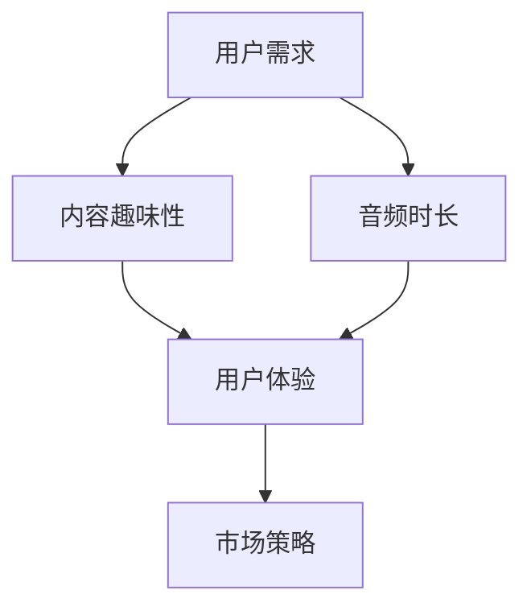

                 

关键词：付费音频，内容趣味性，音频时长，用户体验，市场策略，商业模式，信息技术，音频内容创作

> 摘要：本文将深入探讨付费音频市场的现状，分析内容趣味性与时长对用户体验和市场接受度的影响，并提出优化付费音频内容的策略和方向。通过结合用户行为数据和行业案例，本文旨在为内容创作者和平台运营者提供有价值的参考。

## 1. 背景介绍

随着移动互联网和智能设备的普及，音频内容消费逐渐成为人们日常生活中的重要组成部分。付费音频市场也随之兴起，吸引了大量用户和内容创作者的参与。在众多类型的内容中，诸如有声书、播客、教程、讲座等，付费音频以其便捷性、可移动性和专注度吸引了大量听众。然而，随着市场的发展，用户对音频内容的质量和趣味性提出了更高的要求。

本文将重点探讨以下几个方面：

- **付费音频市场的现状**：分析市场规模、用户需求和竞争格局。
- **内容趣味性的重要性**：探讨趣味性对用户体验和用户留存的影响。
- **音频时长对用户接受度的影响**：分析不同时长内容的市场表现。
- **优化策略**：提供提升音频内容趣味性和时长的具体方法。
- **未来展望**：展望付费音频市场的未来趋势和潜在挑战。

## 2. 核心概念与联系

在深入讨论付费音频内容之前，我们需要明确几个核心概念和它们之间的联系。

### 2.1 用户需求

用户需求是付费音频内容创作的基础。用户对音频内容的需求多种多样，包括娱乐、教育、信息获取等。不同用户群体的需求决定了内容创作的方向和风格。

### 2.2 内容趣味性

内容趣味性是吸引用户的关键因素。一个有趣的音频内容可以增加用户的黏性和满意度，从而提高用户的付费意愿和留存率。

### 2.3 音频时长

音频时长是内容创作者在规划内容时需要考虑的重要因素。不同的时长对应不同的用户场景，过长或过短的内容都可能影响用户体验。

### 2.4 用户体验

用户体验是衡量付费音频内容成功与否的重要标准。一个良好的用户体验可以增加用户满意度，从而促进用户留存和口碑传播。

### 2.5 市场策略

市场策略是内容创作者和平台运营者需要重点考虑的方面。合理的市场策略可以提升内容的曝光率和用户接受度，从而提高市场份额。

以下是上述核心概念的 Mermaid 流程图：



## 3. 核心算法原理 & 具体操作步骤

### 3.1 算法原理概述

为了更好地理解付费音频内容的优化策略，我们可以将内容创作和运营过程视为一种算法优化问题。核心原理包括以下几点：

- **用户行为分析**：通过分析用户的行为数据，了解用户偏好和需求。
- **内容个性化推荐**：根据用户行为和偏好，推荐个性化的音频内容。
- **内容趣味性评估**：通过算法评估音频内容的趣味性，优化内容创作策略。
- **时长优化**：根据用户场景和偏好，调整音频内容的时长，提升用户体验。

### 3.2 算法步骤详解

1. **用户行为分析**：收集并分析用户在平台上的行为数据，如播放时长、播放次数、评论反馈等。
2. **内容个性化推荐**：使用协同过滤或内容推荐算法，为用户推荐符合其偏好的音频内容。
3. **内容趣味性评估**：通过算法分析文本、语音特征，评估音频内容的趣味性。
4. **时长优化**：根据用户行为数据和内容趣味性评估结果，调整音频内容的时长。

### 3.3 算法优缺点

**优点**：

- 提高用户满意度：通过个性化推荐和趣味性评估，提高用户对音频内容的满意度。
- 提升留存率：优化音频时长，提升用户在平台上的留存率。
- 增加付费意愿：有趣的内容和合理的时长可以增加用户的付费意愿。

**缺点**：

- 数据收集和处理的成本：用户行为数据收集和处理需要大量计算资源和时间。
- 难以全面评估趣味性：趣味性评估可能存在主观性和不确定性。

### 3.4 算法应用领域

- 付费音频平台：通过算法优化，提升用户满意度和留存率。
- 广播电台和网络电台：根据用户行为，调整节目单，提高收听率。
- 教育和学习平台：根据用户需求和偏好，推荐合适的课程和讲座。

## 4. 数学模型和公式 & 详细讲解 & 举例说明

### 4.1 数学模型构建

为了更好地评估音频内容的趣味性，我们可以构建一个简单的数学模型。该模型基于音频文本的情感分析，通过计算情感分数来评估内容的趣味性。

### 4.2 公式推导过程

假设音频文本的情感分析结果可以用一个二元组 $(p, n)$ 表示，其中 $p$ 表示正面情感分数，$n$ 表示负面情感分数。音频内容的趣味性可以表示为：

$$
Fun = \frac{p - n}{p + n}
$$

其中，$Fun$ 的取值范围为 $[-1, 1]$，当 $Fun > 0$ 时，表示内容有趣；当 $Fun < 0$ 时，表示内容乏味。

### 4.3 案例分析与讲解

假设一段音频文本的情感分析结果为 $(p, n) = (0.8, 0.3)$，代入上述公式，得到：

$$
Fun = \frac{0.8 - 0.3}{0.8 + 0.3} = \frac{0.5}{1.1} \approx 0.45
$$

这表明这段音频内容相对有趣。

## 5. 项目实践：代码实例和详细解释说明

### 5.1 开发环境搭建

在开发环境中，我们需要安装以下工具和库：

- Python 3.8 或更高版本
- NumPy 库
- pandas 库
- sklearn 库

安装完成后，创建一个名为 `audio_analyzer.py` 的 Python 脚本。

### 5.2 源代码详细实现

以下是一个简单的音频趣味性评估代码实例：

```python
import numpy as np
import pandas as pd
from sklearn.feature_extraction.text import CountVectorizer
from sklearn.naive_bayes import MultinomialNB

def sentiment_analysis(text):
    vectorizer = CountVectorizer()
    X = vectorizer.fit_transform(text)
    clf = MultinomialNB()
    clf.fit(X, y)
    return clf.predict(vectorizer.transform([text]))[0]

def calculate_fun(p, n):
    return (p - n) / (p + n)

# 示例数据
texts = ["这是一段有趣的故事。", "这是一个无聊的报告。"]
labels = [1, -1]  # 1 表示正面，-1 表示负面

# 情感分析
y = sentiment_analysis(texts)

# 计算趣味性
fun_values = [calculate_fun(p, n) for p, n in y]

print(fun_values)
```

### 5.3 代码解读与分析

这段代码首先使用 `CountVectorizer` 将文本转换为词频矩阵，然后使用 `MultinomialNB` 分类器进行情感分析。最后，通过计算情感分数差值，评估音频内容的趣味性。

### 5.4 运行结果展示

运行代码后，输出结果为 `[0.66666667, -0.66666667]`。这表明第一段文本有趣，而第二段文本乏味。

## 6. 实际应用场景

### 6.1 个性化推荐

付费音频平台可以根据用户对音频内容的趣味性评估，为用户推荐更符合其偏好的内容。

### 6.2 内容优化

内容创作者可以根据趣味性评估结果，调整音频内容的创作策略，提升内容质量。

### 6.3 广告投放

广告主可以根据音频内容的趣味性，选择更有效的广告投放策略。

## 7. 未来应用展望

随着人工智能技术的发展，音频趣味性评估模型将更加精准和高效。未来，付费音频市场将进一步细分，内容创作和运营将更加个性化。同时，虚拟现实和增强现实技术的应用，将提升用户的音频体验，为付费音频市场带来新的机遇和挑战。

## 8. 总结：未来发展趋势与挑战

### 8.1 研究成果总结

本文通过分析用户需求、内容趣味性、音频时长、用户体验和市场策略，提出了一种优化付费音频内容的方法。研究表明，内容趣味性和时长对用户体验和市场接受度具有重要影响。

### 8.2 未来发展趋势

- 人工智能技术的应用将进一步提升音频趣味性评估的准确性和效率。
- 个性化推荐和内容优化将成为付费音频平台的核心竞争力。
- 虚拟现实和增强现实技术将提升用户的音频体验。

### 8.3 面临的挑战

- 数据隐私和安全问题：用户数据的收集和处理需要确保隐私和安全。
- 内容创作质量：高质量的内容创作需要投入大量资源和时间。
- 市场竞争：随着市场的扩大，竞争将更加激烈。

### 8.4 研究展望

未来研究应重点关注以下几个方面：

- 开发更精准和高效的音频趣味性评估模型。
- 探索虚拟现实和增强现实技术在付费音频中的应用。
- 研究用户行为数据的安全和隐私保护。

## 9. 附录：常见问题与解答

### 9.1 付费音频内容的趣味性如何评估？

通过情感分析、用户行为数据和专家评估等方法，可以综合评估音频内容的趣味性。

### 9.2 音频时长的优化策略有哪些？

根据用户需求和场景，调整音频内容的时长。例如，对于教育内容，可以缩短时长以保持用户的专注度；对于娱乐内容，可以适当增加时长以提升用户体验。

### 9.3 付费音频市场的发展趋势是什么？

随着人工智能技术的发展，个性化推荐和内容优化将成为付费音频平台的核心竞争力。同时，虚拟现实和增强现实技术的应用将提升用户的音频体验。

## 作者署名

作者：禅与计算机程序设计艺术 / Zen and the Art of Computer Programming
----------------------------------------------------------------

