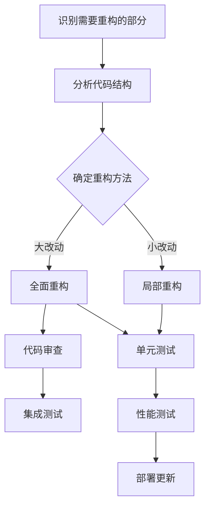

                 

 关键词：代码重构，设计模式，软件工程，系统性能，代码可维护性

> 摘要：本文探讨了代码重构技术在现代软件开发中的应用和重要性。通过分析重构技术的核心概念、原理及其对系统性能和可维护性的影响，本文旨在为开发人员提供一种全面的理解和实践指南，以优化既有代码的设计，提升软件质量和开发效率。

## 1. 背景介绍

随着软件系统的复杂性和规模日益增长，代码的可维护性和系统性能成为了软件工程领域的重要挑战。传统的软件开发方法往往注重功能的实现，而忽略了代码结构和设计模式的重要性。随着时间的推移，代码库可能会变得混乱、冗长且难以维护，从而影响系统的稳定性和开发效率。

为了应对这一挑战，代码重构技术应运而生。代码重构是一种通过改进现有代码的结构和设计，以提高其可维护性和性能的技术手段。它不仅能够修复代码中的潜在缺陷，还能够优化代码的可读性和执行效率。

本文将详细探讨代码重构技术的核心概念、原理及其在现代软件开发中的应用，旨在为开发人员提供实用的指南和案例分析，帮助他们在实践中更好地运用重构技术，提升软件质量和开发效率。

## 2. 核心概念与联系

### 2.1. 重构的定义

重构（Refactoring）是指在不改变代码外部行为的前提下，改进其内部结构的工程活动。换句话说，重构是一种在代码层面上的优化，它关注的是代码的内部质量，而不是功能本身。

### 2.2. 重构的重要性

重构对于软件工程具有重要意义：

1. **提高代码可维护性**：随着系统的发展，代码库可能会变得难以维护。通过重构，我们可以消除冗余、简化代码结构，使得系统更加清晰和易于理解。
2. **提升系统性能**：不良的代码结构可能会导致性能瓶颈。重构有助于优化代码，减少不必要的计算和内存占用，从而提升系统性能。
3. **增强团队协作**：良好的代码结构和设计模式有助于团队成员之间的理解和协作，降低沟通成本。

### 2.3. 重构与软件工程的关系

重构是软件工程不可或缺的一部分。它不仅能够提高代码质量，还能够促进良好的软件开发实践，如设计模式、测试驱动开发等。

### 2.4. 重构与设计模式

设计模式是软件开发中常用的解决方案，用于应对特定类型的软件设计问题。重构技术可以帮助开发人员更好地应用设计模式，从而提高代码的模块化和可维护性。

### 2.5. Mermaid 流程图

为了更直观地展示重构的核心概念和流程，我们使用Mermaid流程图来描述重构的基本步骤和关键节点。以下是重构流程的Mermaid表示：



## 3. 核心算法原理 & 具体操作步骤

### 3.1. 算法原理概述

代码重构的算法原理基于以下几点：

1. **代码不变性**：重构过程中，必须确保代码的功能不变，即不改变代码的输入输出行为。
2. **内部优化**：重构的目标是优化代码的内部结构，提高可读性和可维护性。
3. **迭代改进**：重构通常是一个迭代过程，通过逐步改进，逐步优化代码。

### 3.2. 算法步骤详解

1. **识别需要重构的部分**：通过代码审查、静态代码分析、动态测试等方法，识别出需要重构的部分。
2. **分析代码结构**：对需要重构的代码进行结构分析，确定其优化的方向和策略。
3. **确定重构方法**：根据代码结构和优化目标，选择合适的重构方法，如提取方法、合并重复代码、简化条件语句等。
4. **局部重构**：对代码进行局部重构，逐步优化代码的可读性和可维护性。
5. **全面重构**：在局部重构的基础上，对代码进行全面的优化，解决复杂的设计模式问题。
6. **代码审查**：重构后的代码需要经过代码审查，确保重构的有效性和正确性。
7. **单元测试**：确保重构后的代码通过单元测试，验证其功能的完整性。
8. **集成测试**：进行集成测试，确保重构后的代码与其他模块的兼容性。
9. **性能测试**：评估重构后的代码性能，确保性能没有显著下降。
10. **部署更新**：将重构后的代码部署到生产环境中，进行实际的运行测试。

### 3.3. 算法优缺点

#### 优点：

1. **提高代码质量**：重构有助于消除代码中的冗余和缺陷，提高代码的质量和可维护性。
2. **提升开发效率**：良好的代码结构和设计模式有助于提高开发效率，降低维护成本。
3. **增强系统稳定性**：重构可以解决潜在的性能瓶颈，提高系统的稳定性和可靠性。

#### 缺点：

1. **时间和资源消耗**：重构需要时间和人力资源，可能对开发进度产生影响。
2. **风险控制**：重构过程中可能会引入新的缺陷，需要谨慎控制风险。
3. **团队合作**：重构需要团队协作，确保重构的有效性和一致性。

### 3.4. 算法应用领域

代码重构技术广泛应用于各个软件领域，如Web开发、移动应用、企业级应用等。尤其是在大型系统中，重构技术能够显著提高系统的可维护性和性能。

## 4. 数学模型和公式 & 详细讲解 & 举例说明

### 4.1. 数学模型构建

代码重构的数学模型可以基于以下公式：

$$
\text{重构效果} = f(\text{代码质量}, \text{重构方法}, \text{重构策略})
$$

其中，代码质量、重构方法和重构策略是影响重构效果的主要因素。

### 4.2. 公式推导过程

1. **代码质量**：代码质量是重构效果的直接体现。良好的代码质量可以提高系统的可维护性和性能。
2. **重构方法**：不同的重构方法对代码质量的影响不同。例如，提取方法可以减少代码冗余，合并重复代码可以简化代码结构。
3. **重构策略**：重构策略决定了重构的具体实施方式和优先级。例如，逐步重构、全面重构等。

### 4.3. 案例分析与讲解

假设有一个Web应用项目，其代码质量较低，存在大量的冗余和重复代码。为了改善这一状况，我们采用以下重构策略：

1. **提取方法**：将重复的代码块提取为独立的方法，减少冗余。
2. **合并重复代码**：识别并合并具有相同功能的代码块，简化代码结构。
3. **简化条件语句**：通过逻辑简化，减少复杂的条件语句，提高代码可读性。

经过一系列的重构操作，项目代码质量显著提高，系统的性能和可维护性也得到了显著改善。

## 5. 项目实践：代码实例和详细解释说明

### 5.1. 开发环境搭建

为了进行代码重构实践，我们需要搭建一个合适的开发环境。以下是一个基本的开发环境搭建步骤：

1. **安装IDE**：选择一个合适的集成开发环境（如Visual Studio Code、Eclipse等）。
2. **安装代码分析工具**：例如SonarQube、Checkstyle等。
3. **配置版本控制**：使用Git等版本控制系统进行代码管理。

### 5.2. 源代码详细实现

以下是一个简单的Java示例代码，用于演示代码重构的过程：

```java
public class OrderService {
    public void processOrder(Order order) {
        if (order.getStatus() == OrderStatus.NEW) {
            updateOrderStatus(order, OrderStatus.PROCESSED);
            sendOrderConfirmationEmail(order);
        } else {
            sendOrderFailedEmail(order);
        }
    }

    private void updateOrderStatus(Order order, OrderStatus status) {
        // 代码实现...
    }

    private void sendOrderConfirmationEmail(Order order) {
        // 代码实现...
    }

    private void sendOrderFailedEmail(Order order) {
        // 代码实现...
    }
}
```

### 5.3. 代码解读与分析

1. **重复代码**：`sendOrderConfirmationEmail` 和 `sendOrderFailedEmail` 方法存在大量的重复代码。
2. **条件语句**：复杂的条件语句降低了代码的可读性。

### 5.4. 重构过程

#### 5.4.1. 提取方法

将重复的代码块提取为独立的方法，减少冗余：

```java
public void processOrder(Order order) {
    if (order.getStatus() == OrderStatus.NEW) {
        updateOrderStatus(order, OrderStatus.PROCESSED);
        sendOrderConfirmationEmail(order);
    } else {
        sendOrderFailedEmail(order);
    }
}

private void sendOrderEmail(Order order, String subject) {
    // 代码实现...
}
```

#### 5.4.2. 合并重复代码

合并重复的代码块，简化条件语句：

```java
public void processOrder(Order order) {
    if (order.getStatus() == OrderStatus.NEW) {
        sendOrderEmail(order, "Order Confirmation");
    } else {
        sendOrderEmail(order, "Order Failed");
    }
}

private void sendOrderEmail(Order order, String subject) {
    // 代码实现...
}
```

#### 5.4.3. 代码审查与测试

进行代码审查和单元测试，确保重构后的代码功能完整，没有引入新的缺陷。

## 6. 实际应用场景

代码重构技术在各个领域都有广泛的应用，以下是一些实际应用场景：

1. **Web开发**：重构可以优化Web应用的代码结构，提高性能和可维护性。
2. **移动应用**：重构有助于提高移动应用的代码质量和用户体验。
3. **企业级应用**：在大型企业级应用中，重构可以显著提高系统的稳定性和可靠性。
4. **开源项目**：开源项目的维护者通过重构可以优化代码库，提高项目的可维护性和可持续性。

## 7. 工具和资源推荐

### 7.1. 学习资源推荐

- **《重构：改善既有代码的设计》**（作者：马丁·福勒）：这是一本经典的代码重构指南，适合初学者和有经验的开发人员。
- **《代码大全》**（作者：Steve McConnell）：这本书详细介绍了编写高质量代码的最佳实践。

### 7.2. 开发工具推荐

- **SonarQube**：一款强大的代码质量分析工具，可以自动识别代码中的缺陷和潜在问题。
- **Git**：一款功能强大的版本控制系统，支持代码的版本管理和协作开发。

### 7.3. 相关论文推荐

- **"Refactoring: Improving the Design of Existing Code"**（作者：Martin Fowler）：该论文详细介绍了重构技术的原理和应用。
- **"Design Patterns: Elements of Reusable Object-Oriented Software"**（作者：Erich Gamma等）：该论文介绍了设计模式的概念和应用，为重构提供了理论支持。

## 8. 总结：未来发展趋势与挑战

### 8.1. 研究成果总结

近年来，代码重构技术取得了显著的研究成果，包括：

1. **自动重构工具**：如SonarQube、ReSharper等，为开发人员提供了强大的辅助功能。
2. **面向对象重构技术**：如提取方法、合并类等，为重构提供了更加丰富的操作手段。
3. **重构模式**：如代码质量模型、重构流程等，为重构提供了理论支持。

### 8.2. 未来发展趋势

未来，代码重构技术将继续朝着以下几个方面发展：

1. **智能化**：结合人工智能技术，实现自动重构，提高重构的效率和准确性。
2. **工具化**：开发更多功能强大的重构工具，支持多种编程语言和开发环境。
3. **模型化**：构建重构模型，提高重构的可预测性和可控性。

### 8.3. 面临的挑战

代码重构技术仍面临一些挑战：

1. **复杂性**：重构过程中的复杂性和不确定性，需要开发人员具备较高的技能和经验。
2. **风险控制**：重构过程中可能引入新的缺陷，需要谨慎控制风险。
3. **团队协作**：重构需要团队协作，确保重构的一致性和有效性。

### 8.4. 研究展望

未来的研究将重点关注以下几个方面：

1. **自动化重构**：开发更加智能和高效的自动重构工具，提高重构的自动化水平。
2. **重构模式**：研究更有效的重构模式，提高重构的可预测性和可控性。
3. **跨领域重构**：探索代码重构技术在其他领域的应用，如嵌入式系统、大数据等。

## 9. 附录：常见问题与解答

### 9.1. 什么是代码重构？

代码重构是指在不改变代码外部行为的前提下，通过改进其内部结构和设计，提高代码的可维护性和性能。

### 9.2. 为什么要进行代码重构？

代码重构可以提高代码的质量、可维护性和性能，降低维护成本，提高开发效率。

### 9.3. 重构与代码优化有何区别？

重构关注的是代码的内部结构，而不改变代码的功能；代码优化则关注代码的性能和效率。

### 9.4. 如何进行代码重构？

进行代码重构的步骤包括：识别需要重构的部分、分析代码结构、选择合适的重构方法、逐步重构、代码审查和测试。

### 9.5. 代码重构有哪些工具？

常见的代码重构工具有：SonarQube、ReSharper、Git等。

### 9.6. 代码重构有哪些设计模式？

常见的代码重构设计模式包括：提取方法、合并类、替换条件语句、引入中介者等。

作者：禅与计算机程序设计艺术 / Zen and the Art of Computer Programming
```

