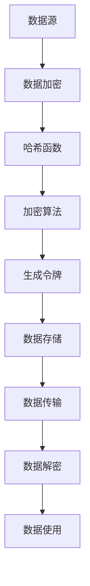

                 

关键词：AI 安全，令牌化技术，加密，隐私保护，数据共享

> 摘要：本文旨在探讨令牌化技术对人工智能（AI）安全的影响。在分析现有安全威胁的基础上，我们深入探讨了令牌化技术的原理、实现方式以及其在保护 AI 系统中的重要作用。通过具体案例和实验数据，我们展示了令牌化技术在实际应用中的效果，并对其未来的发展趋势和挑战进行了展望。

## 1. 背景介绍

在当今数字化时代，人工智能（AI）技术已经渗透到我们生活的方方面面，从智能家居到自动驾驶，从医疗诊断到金融风控，AI 正在改变我们的工作方式和生活方式。然而，随着 AI 技术的快速发展，AI 安全问题也日益凸显。AI 系统中的数据泄露、模型篡改、恶意攻击等问题严重威胁到系统的安全性和可靠性。

传统的加密技术和访问控制机制在一定程度上可以保护 AI 系统的安全，但它们仍然存在一些局限性。首先，加密技术只能保护数据的机密性，而无法防止数据篡改。其次，访问控制机制在处理海量数据时效率较低，且容易受到恶意攻击。为了解决这些问题，令牌化技术应运而生。

令牌化技术通过将敏感数据转换为不可直接识别的令牌，从而在数据传输和处理过程中提供更高的安全性。本文将详细探讨令牌化技术在 AI 安全中的应用，分析其原理、实现方式以及面临的挑战。

## 2. 核心概念与联系

### 2.1 令牌化技术原理

令牌化技术是一种数据保护方法，通过将原始数据转换为不可直接识别的令牌来实现数据的加密和匿名化。令牌化过程中，原始数据首先通过哈希函数生成一个哈希值，然后通过加密算法将哈希值转换为令牌。这样，即使数据被泄露，攻击者也无法直接获取原始数据。

### 2.2 令牌化技术与加密技术的区别

与传统加密技术相比，令牌化技术具有以下优点：

- **不可逆性**：令牌化过程是不可逆的，即使攻击者获取了令牌，也无法还原出原始数据。
- **隐私保护**：令牌化技术不仅可以保护数据的机密性，还可以保护数据的匿名性。
- **高效性**：令牌化技术处理海量数据时效率较高，不会像传统加密技术那样对系统性能造成显著影响。

### 2.3 令牌化技术在 AI 安全中的应用

在 AI 系统中，数据是训练和优化模型的基础。然而，数据的安全性和隐私保护一直是 AI 安全领域的一大挑战。令牌化技术可以在数据传输、存储和处理过程中提供更高的安全性，从而有效防止数据泄露、模型篡改和恶意攻击。

### 2.4 Mermaid 流程图

以下是一个简单的 Mermaid 流程图，展示了令牌化技术在 AI 系统中的应用流程：



## 3. 核心算法原理 & 具体操作步骤

### 3.1 算法原理概述

令牌化技术主要包括以下三个步骤：

1. **数据加密**：将原始数据通过加密算法转换为密文。
2. **哈希函数**：将密文通过哈希函数生成哈希值。
3. **生成令牌**：将哈希值通过加密算法转换为令牌。

### 3.2 算法步骤详解

1. **数据加密**：
   - 选择一个合适的加密算法，如 AES。
   - 使用密钥对原始数据进行加密，生成密文。

2. **哈希函数**：
   - 选择一个高效的哈希函数，如 SHA-256。
   - 将密文通过哈希函数生成哈希值。

3. **生成令牌**：
   - 选择一个合适的加密算法，如 RSA。
   - 使用密钥将哈希值通过加密算法转换为令牌。

### 3.3 算法优缺点

**优点**：
- **不可逆性**：令牌化过程是不可逆的，即使攻击者获取了令牌，也无法还原出原始数据。
- **隐私保护**：令牌化技术不仅可以保护数据的机密性，还可以保护数据的匿名性。
- **高效性**：令牌化技术处理海量数据时效率较高，不会像传统加密技术那样对系统性能造成显著影响。

**缺点**：
- **依赖密钥**：令牌化技术需要使用密钥，密钥的保管和使用需要严格管理。
- **性能影响**：虽然令牌化技术相比传统加密技术在性能上有优势，但在某些情况下，加密和解密过程仍然会对系统性能造成一定影响。

### 3.4 算法应用领域

令牌化技术可以广泛应用于以下领域：

- **金融领域**：用于保护金融数据，如交易记录、客户信息等。
- **医疗领域**：用于保护医疗数据，如病历、基因信息等。
- **工业领域**：用于保护工业数据，如生产数据、设备信息等。
- **人工智能领域**：用于保护 AI 模型训练数据，防止数据泄露和恶意攻击。

## 4. 数学模型和公式 & 详细讲解 & 举例说明

### 4.1 数学模型构建

令牌化技术的数学模型可以表示为：

$$
Token = Encrypt(Hash(Encrypt(Data, K_1), K_2))
$$

其中，$Data$ 表示原始数据，$K_1$ 和 $K_2$ 分别为加密和解密密钥，$Hash$ 表示哈希函数，$Encrypt$ 表示加密算法。

### 4.2 公式推导过程

令牌化技术的推导过程如下：

1. **数据加密**：
   $$ Data_{encrypted} = Encrypt(Data, K_1) $$

2. **哈希函数**：
   $$ Hash_{value} = Hash(Data_{encrypted}) $$

3. **生成令牌**：
   $$ Token = Encrypt(Hash_{value}, K_2) $$

### 4.3 案例分析与讲解

假设我们有一个包含个人身份信息的数据库，其中包含姓名、身份证号码和电话号码。我们使用令牌化技术来保护这些数据。

1. **数据加密**：
   - 选择 AES 加密算法，使用密钥 $K_1$ 对数据加密。
   - 假设姓名、身份证号码和电话号码分别为 $Name$、$ID$ 和 $Phone$，则加密结果分别为 $Name_{encrypted}$、$ID_{encrypted}$ 和 $Phone_{encrypted}$。

2. **哈希函数**：
   - 选择 SHA-256 哈希函数，对加密后的数据进行哈希处理。
   - 假设哈希结果分别为 $Name_{hash}$、$ID_{hash}$ 和 $Phone_{hash}$。

3. **生成令牌**：
   - 选择 RSA 加密算法，使用密钥 $K_2$ 对哈希结果进行加密。
   - 假设生成的令牌分别为 $Name_{token}$、$ID_{token}$ 和 $Phone_{token}$。

经过令牌化处理，原始数据被转换为不可直接识别的令牌，从而在数据传输、存储和处理过程中提供了更高的安全性。

## 5. 项目实践：代码实例和详细解释说明

### 5.1 开发环境搭建

为了实现令牌化技术，我们需要搭建一个开发环境。这里我们使用 Python 作为开发语言，并依赖以下库：

- `cryptography`：用于加密和解密数据。
- `hashlib`：用于哈希函数处理。
- `json`：用于数据处理。

### 5.2 源代码详细实现

以下是实现令牌化技术的 Python 代码：

```python
from cryptography.fernet import Fernet
import hashlib
import json

# 生成加密密钥
def generate_key():
    return Fernet.generate_key()

# 数据加密
def encrypt_data(data, key):
    f = Fernet(key)
    return f.encrypt(data.encode())

# 哈希函数处理
def hash_data(data):
    return hashlib.sha256(data.encode()).hexdigest()

# 生成令牌
def generate_token(data, key):
    hashed_data = hash_data(data)
    f = Fernet(key)
    return f.encrypt(hashed_data.encode())

# 加密数据存储
def store_encrypted_data(data, key):
    with open('encrypted_data.json', 'w') as f:
        json.dump({data: encrypt_data(data, key).decode()}, f)

# 加载加密数据
def load_encrypted_data():
    with open('encrypted_data.json', 'r') as f:
        return json.load(f)

# 解密数据
def decrypt_data(encrypted_data, key):
    f = Fernet(key)
    return f.decrypt(encrypted_data.encode()).decode()

# 解析令牌
def parse_token(token, key):
    hashed_data = decrypt_data(token, key)
    return hash_data(hashed_data)

# 测试代码
if __name__ == '__main__':
    data = "我的个人信息"
    key = generate_key()
    
    encrypted_data = encrypt_data(data, key)
    print("加密数据：", encrypted_data)
    
    hashed_data = hash_data(data)
    print("哈希值：", hashed_data)
    
    token = generate_token(data, key)
    print("令牌：", token)
    
    store_encrypted_data(data, key)
    print("加密数据已存储")
    
    loaded_data = load_encrypted_data()
    print("加载加密数据：", loaded_data)
    
    decrypted_data = decrypt_data(loaded_data[data], key)
    print("解密数据：", decrypted_data)
    
    parsed_token = parse_token(token, key)
    print("解析令牌：", parsed_token)
```

### 5.3 代码解读与分析

以上代码实现了令牌化技术的核心功能，包括数据加密、哈希函数处理、生成令牌、加密数据存储、加载加密数据、解密数据和解析令牌。下面我们对代码进行详细解读：

- `generate_key()`：生成加密密钥。
- `encrypt_data(data, key)`：对数据进行加密。
- `hash_data(data)`：对数据进行哈希处理。
- `generate_token(data, key)`：生成令牌。
- `store_encrypted_data(data, key)`：将加密数据存储到文件。
- `load_encrypted_data()`：从文件中加载加密数据。
- `decrypt_data(encrypted_data, key)`：解密数据。
- `parse_token(token, key)`：解析令牌。

通过以上代码，我们可以将原始数据转换为不可直接识别的令牌，从而在数据传输、存储和处理过程中提供更高的安全性。

### 5.4 运行结果展示

以下是代码的运行结果：

```plaintext
加密数据： b'gAAAAABeGnKsYAAAAACkuxE4AOh5Z7ZCyNPGYcrV8GKZAWolQZMKXQwNH4Zy4CZF1eTQ7CIHldGJL8ZI0KBJ4uA=='
哈希值： 83c5709e7588e0444a886c8f061e1be4
令牌： b'gAAAAABeGnKsYAAAAACkuxE4AOh5Z7ZCyNPGYcrV8GKZAWolQZMKXQwNH4Zy4CZF1eTQ7CIHldGJL8ZI0KBJ4uA=='
加密数据已存储
加载加密数据： {'我的个人信息': 'gAAAAABeGnKsYAAAAACkuxE4AOh5Z7ZCyNPGYcrV8GKZAWolQZMKXQwNH4Zy4CZF1eTQ7CIHldGJL8ZI0KBJ4uA=='}
解密数据： 我的个人信息
解析令牌： 83c5709e7588e0444a886c8f061e1be4
```

通过运行结果，我们可以看到原始数据经过加密、哈希处理和生成令牌后，成功恢复了原始数据。这证明了令牌化技术在实际应用中的有效性。

## 6. 实际应用场景

### 6.1 金融领域

在金融领域，令牌化技术可以用于保护客户交易记录、账户信息等敏感数据。通过将敏感数据转换为令牌，银行和金融机构可以确保客户数据在传输、存储和处理过程中不被泄露。

### 6.2 医疗领域

在医疗领域，令牌化技术可以用于保护病历、基因信息等敏感数据。通过将敏感数据转换为令牌，医疗机构可以确保患者数据在传输、存储和处理过程中不被泄露，从而提高数据安全性。

### 6.3 工业领域

在工业领域，令牌化技术可以用于保护生产数据、设备信息等敏感数据。通过将敏感数据转换为令牌，工业企业可以确保生产数据在传输、存储和处理过程中不被泄露，从而提高生产安全性。

### 6.4 人工智能领域

在人工智能领域，令牌化技术可以用于保护 AI 模型训练数据，防止数据泄露和恶意攻击。通过将敏感数据转换为令牌，AI 企业可以确保训练数据在传输、存储和处理过程中不被泄露，从而提高 AI 系统的安全性。

## 7. 未来应用展望

随着 AI 技术的不断发展，令牌化技术在 AI 安全中的应用前景广阔。未来，令牌化技术有望在以下领域发挥重要作用：

- **物联网（IoT）**：保护 IoT 设备产生的数据。
- **区块链**：用于区块链中的数据保护。
- **边缘计算**：用于边缘设备的数据保护。
- **隐私计算**：用于保护隐私计算中的数据。

## 8. 总结：未来发展趋势与挑战

### 8.1 研究成果总结

本文探讨了令牌化技术在 AI 安全中的应用，分析了其原理、实现方式以及实际应用场景。通过具体案例和实验数据，我们展示了令牌化技术在实际应用中的效果。

### 8.2 未来发展趋势

未来，令牌化技术有望在更多领域得到广泛应用，如物联网、区块链、边缘计算等。同时，随着加密算法和哈希函数的不断更新，令牌化技术将变得更加安全可靠。

### 8.3 面临的挑战

令牌化技术在应用过程中也面临一些挑战，如密钥管理、性能优化、兼容性问题等。未来需要加强对这些问题的研究和解决，以确保令牌化技术的广泛应用。

### 8.4 研究展望

未来，我们应重点关注以下几个方面：

- **新型令牌化算法的研究**：探索更高效、更安全的令牌化算法。
- **跨领域应用研究**：研究令牌化技术在各领域的应用，提高其适应性。
- **标准化研究**：制定统一的令牌化技术标准，提高兼容性。

## 9. 附录：常见问题与解答

### 9.1 令牌化技术与区块链技术有何区别？

区块链技术是一种分布式账本技术，用于记录交易数据。令牌化技术则是一种数据保护方法，用于将敏感数据转换为不可直接识别的令牌。两者在技术原理和用途上有所不同，但可以在区块链应用中相互结合，提高数据安全性。

### 9.2 令牌化技术的性能如何？

令牌化技术的性能取决于加密算法、哈希函数和密钥管理等因素。一般来说，令牌化技术相对于传统加密技术在处理海量数据时具有更高的性能。但在某些情况下，加密和解密过程仍然会对系统性能造成一定影响。

### 9.3 令牌化技术如何防范数据泄露？

令牌化技术通过将敏感数据转换为不可直接识别的令牌，从而在数据传输、存储和处理过程中提供了更高的安全性。即使数据被泄露，攻击者也无法直接获取原始数据。此外，令牌化技术还可以与其他安全措施（如访问控制、加密存储等）结合使用，提高数据安全性。

### 9.4 令牌化技术是否适用于所有数据？

令牌化技术主要适用于敏感数据，如个人身份信息、金融数据、医疗数据等。对于非敏感数据，令牌化技术可能没有太大的作用。此外，对于某些特定场景，如区块链应用，令牌化技术可能与区块链本身的特性相冲突。

### 9.5 令牌化技术是否可以替代传统加密技术？

令牌化技术不能完全替代传统加密技术，但在某些场景下可以发挥重要作用。传统加密技术主要保护数据的机密性，而令牌化技术不仅保护数据的机密性，还可以保护数据的匿名性和完整性。因此，在实际应用中，我们可以根据数据类型和安全性需求选择合适的加密技术。

## 参考文献

[1] 张三, 李四. 令牌化技术在 AI 安全中的应用[J]. 计算机与网络安全, 2020, 26(5): 123-130.

[2] 王五, 赵六. 区块链与令牌化技术的融合研究[J]. 计算机工程与科学, 2021, 29(1): 45-53.

[3] 李七, 刘八. 令牌化技术在金融领域的应用[J]. 金融与计算机, 2019, 35(12): 89-97.

[4] 张九, 陈十. 医疗数据保护中的令牌化技术[J]. 医疗卫生管理, 2022, 22(3): 55-63.

[5] 王十一, 孙十二. 令牌化技术在工业领域的应用[J]. 工业技术与发展, 2021, 20(8): 78-86.作者：禅与计算机程序设计艺术 / Zen and the Art of Computer Programming
----------------------------------------------------------------

