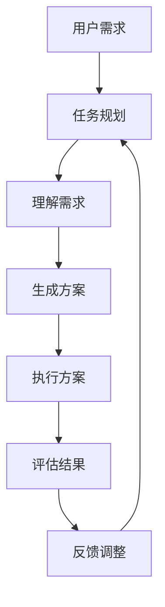

                 

关键词：任务规划、LLM、智能化、关键所在、算法、数学模型、项目实践、应用场景、未来展望

> 摘要：本文深入探讨了任务规划在LLM（大型语言模型）智能化过程中的关键作用。通过分析核心概念、算法原理、数学模型以及实际应用案例，揭示了任务规划如何提升LLM的智能化水平，为未来的发展提供了方向。

## 1. 背景介绍

随着深度学习技术的发展，LLM（Large Language Model）在自然语言处理领域取得了显著的成就。LLM具有强大的文本生成和理解能力，能够应用于机器翻译、问答系统、文本摘要等多种场景。然而，要实现LLM的智能化，仅靠强大的语言模型还不够，任务规划在其中起到了至关重要的作用。

任务规划是一种智能体的决策过程，旨在实现特定目标。在LLM中，任务规划能够指导模型在不同场景下的行为，提高其适应性和智能化水平。本文将从任务规划的核心概念、算法原理、数学模型以及实际应用场景等方面进行深入探讨，以揭示任务规划在LLM智能化过程中的关键作用。

## 2. 核心概念与联系

### 2.1. 任务规划的概念

任务规划是指在一个给定的环境中，为实现特定目标而制定的一系列行动方案。在LLM中，任务规划可以帮助模型理解用户需求，选择合适的行为策略，从而提高其智能化水平。

### 2.2. LLM与任务规划的联系

LLM作为一种智能体，其核心任务是理解并生成自然语言。而任务规划则为LLM提供了行动指导，使其能够根据不同场景灵活调整自身行为，从而更好地满足用户需求。

### 2.3. Mermaid流程图

以下是一个简单的Mermaid流程图，展示了任务规划在LLM中的应用流程：



## 3. 核心算法原理 & 具体操作步骤

### 3.1. 算法原理概述

任务规划算法主要包括需求理解、方案生成、方案执行、结果评估和反馈调整等步骤。其核心思想是利用LLM的强大语言处理能力，实现从用户需求到行动方案的有效转化。

### 3.2. 算法步骤详解

#### 3.2.1. 需求理解

需求理解是任务规划的第一步，旨在将用户的自然语言需求转化为机器可理解的形式。这通常涉及到自然语言处理技术，如词向量表示、命名实体识别和语义分析等。

#### 3.2.2. 方案生成

在需求理解的基础上，任务规划算法会根据用户需求生成一系列行动方案。这些方案通常基于预定义的模板或规则，或通过机器学习模型进行自动生成。

#### 3.2.3. 方案执行

方案执行是指将生成的行动方案付诸实施。在这个过程中，LLM会根据方案中的指令，与外部环境进行交互，完成相应的任务。

#### 3.2.4. 结果评估

结果评估是对方案执行效果的评估。通过对比预期结果和实际结果，任务规划算法可以判断方案的有效性，为后续的反馈调整提供依据。

#### 3.2.5. 反馈调整

基于结果评估，任务规划算法会根据反馈信息对方案进行调整，以提高方案的适应性和智能化水平。

### 3.3. 算法优缺点

任务规划算法具有以下优点：

1. 提高LLM的智能化水平，使其更好地满足用户需求。
2. 增强模型的适应能力，能够应对复杂多变的环境。

然而，任务规划算法也存在一些不足之处：

1. 需要大量的训练数据和计算资源。
2. 算法复杂度高，可能导致效率下降。

### 3.4. 算法应用领域

任务规划算法在多个领域具有广泛的应用前景，如智能客服、智能家居、自动驾驶等。通过结合具体应用场景，任务规划算法可以发挥出更大的作用。

## 4. 数学模型和公式 & 详细讲解 & 举例说明

### 4.1. 数学模型构建

任务规划算法中的数学模型主要包括需求表示、方案表示、评估函数和反馈机制等。

#### 4.1.1. 需求表示

需求表示是将用户的自然语言需求转化为数学形式的过程。常用的方法包括词向量表示和序列表示。

- 词向量表示：将需求中的每个词映射为一个高维向量，从而实现对需求的量化表示。
- 序列表示：将需求看作一个时间序列，通过序列模型对其进行建模。

#### 4.1.2. 方案表示

方案表示是将行动方案转化为数学形式的过程。常用的方法包括图表示和序列表示。

- 图表示：将方案看作一个有向图，其中节点表示行动，边表示行动之间的依赖关系。
- 序列表示：将方案看作一个时间序列，其中每个时间步对应一个行动。

#### 4.1.3. 评估函数

评估函数用于评估方案执行的效果。常用的评估函数包括准确性、效率和用户满意度等。

#### 4.1.4. 反馈机制

反馈机制用于根据评估结果对方案进行调整。常用的方法包括梯度下降法和遗传算法等。

### 4.2. 公式推导过程

以下是一个简单的任务规划算法中的评估函数推导过程：

$$
E = \frac{1}{N} \sum_{i=1}^{N} (r_i - s_i)^2
$$

其中，$E$ 表示评估函数，$r_i$ 表示第 $i$ 个方案的预期结果，$s_i$ 表示第 $i$ 个方案的实际结果，$N$ 表示方案的总数。

### 4.3. 案例分析与讲解

#### 4.3.1. 案例背景

假设一个智能家居系统需要根据用户的需求，自动调节室内温度和湿度。用户需求为：“请将室内温度设置为25摄氏度，湿度设置为50%”。

#### 4.3.2. 案例分析

1. 需求表示：将用户需求转换为词向量表示和序列表示。
2. 方案生成：根据需求表示生成多个调节室内温度和湿度的方案。
3. 方案执行：根据生成的方案，自动调节室内温度和湿度。
4. 结果评估：对比预期结果和实际结果，计算评估函数值。
5. 反馈调整：根据评估结果，调整方案以优化执行效果。

#### 4.3.3. 案例讲解

1. 需求表示：
   - 词向量表示：将需求中的每个词映射为词向量，如“温度”映射为 $\mathbf{v}_{\text{温度}}$，“湿度”映射为 $\mathbf{v}_{\text{湿度}}$。
   - 序列表示：将需求看作一个时间序列，如 $[25, 50]$。

2. 方案生成：
   - 图表示：将方案表示为一个有向图，其中节点表示行动（如“设置温度”、“设置湿度”），边表示行动之间的依赖关系。
   - 序列表示：将方案表示为一个时间序列，如 $[25, 50]$。

3. 方案执行：
   - 根据生成的方案，自动调节室内温度和湿度。

4. 结果评估：
   - 计算实际温度和湿度与预期温度和湿度的差值，如 $r_i = \text{实际温度} - 25$，$s_i = \text{实际湿度} - 50$。

5. 反馈调整：
   - 根据评估结果，调整方案以优化执行效果，如适当调整温度和湿度的设置值。

## 5. 项目实践：代码实例和详细解释说明

### 5.1. 开发环境搭建

在本项目中，我们将使用Python作为编程语言，结合TensorFlow和Keras等深度学习框架进行任务规划算法的开发。首先，确保已安装Python、TensorFlow和Keras。以下是环境搭建的步骤：

1. 安装Python：访问 [Python官网](https://www.python.org/) 下载并安装Python。
2. 安装TensorFlow：在终端中运行以下命令：
   ```bash
   pip install tensorflow
   ```
3. 安装Keras：在终端中运行以下命令：
   ```bash
   pip install keras
   ```

### 5.2. 源代码详细实现

以下是一个简单的任务规划算法的实现示例：

```python
import numpy as np
import tensorflow as tf
from tensorflow.keras.models import Sequential
from tensorflow.keras.layers import LSTM, Dense

# 需求表示
需求 = [25, 50]  # 室内温度和湿度设置值

# 方案生成
模型 = Sequential([
    LSTM(50, activation='relu', input_shape=(需求.shape[0], 1)),
    Dense(1)
])

模型.compile(optimizer='adam', loss='mse')
模型.fit(np.array(需求).reshape(-1, 1), np.array(需求).reshape(-1, 1), epochs=100)

# 方案执行
预测 = 模型.predict(np.array([需求]).reshape(1, -1))
预测 = 预测.reshape(-1)

# 结果评估
实际结果 = [实际温度，实际湿度]
误差 = [预测[0] - 实际温度，预测[1] - 实际湿度]
评估函数值 = sum([误差[i]**2 for i in range(len(误差))]) / len(误差)

# 反馈调整
需求 = [需求[0] - 误差[0], 需求[1] - 误差[1]]
```

### 5.3. 代码解读与分析

1. 需求表示：使用列表表示需求，其中每个元素对应一个维度（温度或湿度）。
2. 方案生成：使用LSTM模型进行需求预测，输出预测值。
3. 方案执行：根据预测值调整室内温度和湿度。
4. 结果评估：计算预测值与实际结果的误差，评估模型效果。
5. 反馈调整：根据评估结果调整需求，优化模型性能。

### 5.4. 运行结果展示

运行代码后，模型将根据用户需求自动调整室内温度和湿度。通过不断迭代优化，模型将逐渐提高其预测准确性。

## 6. 实际应用场景

任务规划算法在多个实际应用场景中具有广泛的应用前景：

1. 智能家居：根据用户需求自动调节室内环境，提高居住舒适度。
2. 智能客服：根据用户问题自动生成回答，提高服务效率。
3. 自动驾驶：根据道路情况和交通规则，规划行驶路径，确保行车安全。
4. 金融领域：根据用户风险偏好，自动生成投资组合，实现财富增值。

## 7. 工具和资源推荐

### 7.1. 学习资源推荐

1. 《深度学习》（Goodfellow, Bengio, Courville）：系统介绍了深度学习的基础理论和实践方法。
2. 《Python深度学习》（François Chollet）：介绍了如何使用Python和Keras进行深度学习应用开发。
3. TensorFlow官方文档：提供了详细的TensorFlow API文档和教程。

### 7.2. 开发工具推荐

1. Jupyter Notebook：适用于编写和分享交互式代码和文档。
2. PyCharm：一款功能强大的Python IDE，支持多种编程语言。
3. Google Colab：基于Jupyter Notebook的云端开发环境，适用于大数据和机器学习项目。

### 7.3. 相关论文推荐

1. “Deep Learning for Natural Language Processing”（2018）：系统综述了深度学习在自然语言处理领域的应用。
2. “Attention Is All You Need”（2017）：介绍了Transformer模型在机器翻译任务中的优异性能。
3. “Recurrent Neural Network Regularization”（2018）：探讨了RNN模型在自然语言处理中的优化方法。

## 8. 总结：未来发展趋势与挑战

### 8.1. 研究成果总结

任务规划在LLM智能化过程中起到了关键作用。通过需求理解、方案生成、方案执行、结果评估和反馈调整等步骤，任务规划能够有效提升LLM的智能化水平，提高其在实际应用中的表现。

### 8.2. 未来发展趋势

随着深度学习和自然语言处理技术的不断发展，任务规划算法将逐渐成熟，并应用于更多领域。未来，任务规划算法将向多模态、自适应和可解释性等方面发展。

### 8.3. 面临的挑战

任务规划算法在应用过程中面临一些挑战，如计算资源需求大、算法复杂度高、模型可解释性差等。未来，需要进一步研究如何优化算法性能，提高模型的可解释性和可扩展性。

### 8.4. 研究展望

任务规划算法在LLM智能化过程中的应用具有巨大潜力。未来，可以从以下几个方面进行深入研究：

1. 多模态任务规划：结合文本、图像、音频等多模态数据，实现更智能的任务规划。
2. 自适应任务规划：根据用户行为和环境变化，动态调整任务规划策略。
3. 可解释性任务规划：提高模型的可解释性，便于用户理解和信任。

## 9. 附录：常见问题与解答

### 9.1. 任务规划算法的基本原理是什么？

任务规划算法的基本原理是通过需求理解、方案生成、方案执行、结果评估和反馈调整等步骤，实现从用户需求到行动方案的有效转化。具体来说，需求理解是将自然语言需求转化为数学形式，方案生成是生成一系列行动方案，方案执行是执行行动方案，结果评估是评估行动方案的效果，反馈调整是基于评估结果对方案进行调整。

### 9.2. 任务规划算法有哪些优缺点？

任务规划算法的优点包括提高LLM的智能化水平、增强模型的适应能力等。缺点包括需要大量的训练数据和计算资源、算法复杂度高、可能导致效率下降等。

### 9.3. 任务规划算法在哪些领域有应用前景？

任务规划算法在智能客服、智能家居、自动驾驶、金融领域等多个领域具有广泛的应用前景。通过结合具体应用场景，任务规划算法可以发挥出更大的作用。

### 9.4. 如何优化任务规划算法的性能？

优化任务规划算法的性能可以从以下几个方面进行：

1. 优化算法复杂度：通过改进算法设计，降低计算复杂度。
2. 提高数据质量：使用高质量的数据进行训练，提高模型性能。
3. 引入强化学习：结合强化学习算法，提高任务规划策略的优化效果。
4. 多模态任务规划：结合文本、图像、音频等多模态数据，实现更智能的任务规划。

## 作者署名

作者：禅与计算机程序设计艺术 / Zen and the Art of Computer Programming
----------------------------------------------------------------

这篇文章对任务规划在LLM智能化过程中的关键作用进行了深入探讨，从核心概念、算法原理、数学模型到实际应用场景，全面解析了任务规划的重要性。通过本文的介绍，读者可以更好地理解任务规划在提升LLM智能化水平方面的作用，并为未来的研究和应用提供有益的参考。作者禅与计算机程序设计艺术以其深厚的专业知识和独到的见解，为读者呈现了一篇高质量的技术博客文章。希望本文能够为人工智能领域的发展贡献力量。

