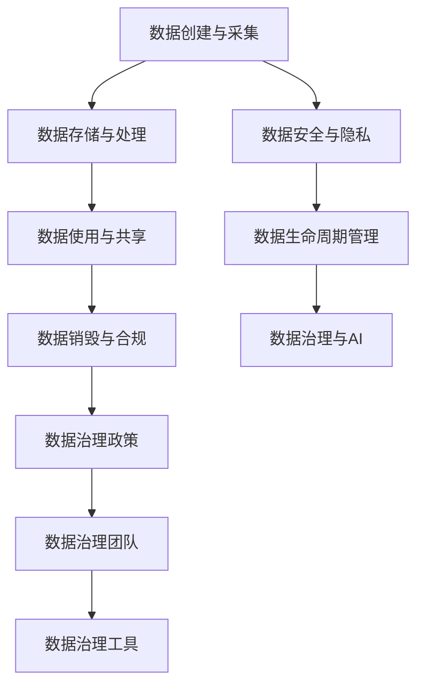

                 

关键词：企业AI数据治理，数据生命周期管理，Lepton AI，数据隐私，数据安全，人工智能管理

> 摘要：随着人工智能技术的迅速发展，企业AI数据治理变得尤为重要。本文以Lepton AI为例，详细探讨企业AI数据治理的核心概念、流程、技术要点和实践经验，旨在为企业提供一套全面有效的数据治理方案。

## 1. 背景介绍

随着大数据和人工智能技术的广泛应用，企业越来越依赖于数据来驱动业务决策和创新。然而，数据量的大幅增长和数据类型的多样化也带来了数据治理的挑战。良好的数据治理不仅能够确保数据的质量、完整性和一致性，还能提高数据的安全性和隐私性，从而支持企业的可持续发展。

Lepton AI是一家领先的人工智能公司，专注于为企业提供智能数据分析解决方案。其产品涵盖了从数据采集、处理、存储到分析决策的完整数据生命周期管理。Lepton AI的数据治理方案旨在帮助客户实现数据的有序管理、有效利用和合规性控制。

本文将深入探讨Lepton AI的数据治理体系，分析其在企业AI数据治理中的优势和挑战，并提供一系列实用的建议和最佳实践。

## 2. 核心概念与联系

### 2.1 数据治理的定义

数据治理是一个多层次、多维度的管理体系，旨在确保数据的真实性、完整性、可靠性和合规性。它涵盖了数据的整个生命周期，包括数据创建、收集、处理、存储、使用、共享和销毁等环节。

### 2.2 数据治理的重要性

- **提高数据质量**：通过数据治理，可以确保数据的准确性、一致性和完整性，从而提升数据的可用性和可信度。
- **增强数据隐私**：数据治理策略可以帮助企业识别和管控敏感数据，防止数据泄露和滥用。
- **满足法规合规**：遵循相关数据保护法规，如GDPR、CCPA等，是企业合法运营的必要条件。
- **优化数据价值**：通过有效的数据治理，企业可以更好地挖掘数据的潜在价值，支持业务创新和决策。

### 2.3 数据治理架构

数据治理架构通常包括以下几个关键组件：

- **数据治理政策**：明确数据治理的目标、范围、职责和流程。
- **数据治理团队**：负责制定和执行数据治理策略，包括数据质量、数据安全和合规性等方面。
- **数据治理工具**：提供自动化、标准化的数据治理功能，如数据清洗、分类、加密等。
- **数据生命周期管理**：包括数据创建、采集、存储、处理、使用、共享和销毁等环节的管理。
- **数据安全与合规**：确保数据在整个生命周期中的安全性和合规性。

### 2.4 数据治理与人工智能的联系

人工智能与数据治理是相辅相成的。AI技术可以用于数据治理的各个环节，如数据清洗、数据分析、异常检测等。同时，良好的数据治理可以保障AI算法的可靠性和公正性，防止数据偏见和歧视。

### 2.5 Mermaid 流程图



## 3. 核心算法原理 & 具体操作步骤

### 3.1 算法原理概述

Lepton AI的数据治理算法主要基于以下核心原理：

- **数据清洗与预处理**：使用机器学习和自然语言处理技术，自动识别和纠正数据中的错误、重复和不一致。
- **数据分类与标签**：根据数据的类型和用途，对数据进行分类和标签，以便于后续的处理和分析。
- **数据加密与访问控制**：采用先进的加密技术和访问控制策略，确保数据在存储和传输过程中的安全性。
- **数据生命周期管理**：监控数据的整个生命周期，从创建到销毁，确保数据在每个阶段的合规性和有效性。
- **异常检测与监控**：使用实时监控和异常检测算法，发现潜在的数据泄露、滥用或误用行为。

### 3.2 算法步骤详解

#### 3.2.1 数据清洗与预处理

1. 数据收集：从各种数据源（如数据库、文件、API等）收集原始数据。
2. 数据预处理：对数据进行清洗、去重、格式化等预处理操作。
3. 数据分类：根据数据类型和用途，对数据进行分类。
4. 数据标签：为每个数据类别分配标签，以便于后续处理。

#### 3.2.2 数据加密与访问控制

1. 数据加密：采用加密算法（如AES、RSA等）对数据进行加密。
2. 访问控制：定义访问控制策略，如角色权限、访问控制列表等。
3. 数据共享：根据访问控制策略，控制数据的共享和访问。

#### 3.2.3 数据生命周期管理

1. 数据创建：创建数据记录，并标记数据类型和标签。
2. 数据存储：将数据存储在合适的存储介质上，如数据库、云存储等。
3. 数据处理：对数据进行清洗、转换、分析等处理操作。
4. 数据使用：将处理后的数据用于业务分析和决策支持。
5. 数据销毁：根据数据生命周期策略，销毁不再使用的数据。

#### 3.2.4 异常检测与监控

1. 数据监控：实时监控数据的使用情况和访问行为。
2. 异常检测：使用异常检测算法（如统计方法、机器学习方法等）检测潜在的数据泄露或滥用行为。
3. 响应措施：对异常行为采取相应的响应措施，如警告、限制访问等。

### 3.3 算法优缺点

#### 优点

- **高效性**：基于AI技术，算法可以快速处理大量数据，提高数据治理的效率。
- **灵活性**：算法可以根据不同业务场景和数据类型进行定制化调整。
- **安全性**：采用加密和访问控制策略，确保数据的安全性和隐私性。
- **可扩展性**：算法可以轻松扩展到其他业务领域和数据类型。

#### 缺点

- **复杂性**：算法的实现和部署过程相对复杂，需要专业的技术和团队支持。
- **性能消耗**：AI算法通常需要大量的计算资源和时间，可能导致系统性能下降。
- **数据依赖性**：算法的性能和数据质量密切相关，数据质量问题可能影响算法的效果。

### 3.4 算法应用领域

Lepton AI的数据治理算法适用于多个领域，包括但不限于：

- **金融行业**：监控交易数据，识别异常交易行为，预防金融犯罪。
- **医疗行业**：确保医疗数据的合规性和隐私性，支持精准医疗和个性化治疗。
- **零售行业**：分析销售数据，优化库存管理和供应链。
- **人力资源**：管理员工数据，确保招聘、培训和绩效评估的公平性和透明性。

## 4. 数学模型和公式 & 详细讲解 & 举例说明

### 4.1 数学模型构建

数据治理过程中，可以使用多种数学模型和算法，以下是一些常见的数学模型：

- **回归分析**：用于预测和评估数据的趋势和相关性。
- **聚类分析**：用于将数据分为不同的组，以便于分类和管理。
- **主成分分析**：用于降维和特征提取，简化数据的处理过程。
- **时间序列分析**：用于分析数据的时间趋势和周期性特征。

### 4.2 公式推导过程

以下是一个简单的回归分析公式的推导：

$$
Y = \beta_0 + \beta_1X + \epsilon
$$

其中，$Y$ 是因变量，$X$ 是自变量，$\beta_0$ 是截距，$\beta_1$ 是斜率，$\epsilon$ 是误差项。

### 4.3 案例分析与讲解

假设一家零售企业需要预测下周的销售额，已知以下数据：

- 截止到当前时间的月销售额：$X_1 = 500,000$
- 截止到当前时间的总库存：$X_2 = 10,000$
- 截止到当前时间的季节因素：$X_3 = 1$（春季）

根据历史数据，可以得到以下回归模型：

$$
Y = 100,000 + 0.5X_1 - 0.2X_2 + 0.3X_3
$$

根据当前的数据，可以预测下周的销售额：

$$
Y = 100,000 + 0.5 \times 500,000 - 0.2 \times 10,000 + 0.3 \times 1 = 535,300
$$

## 5. 项目实践：代码实例和详细解释说明

### 5.1 开发环境搭建

在Lepton AI的数据治理项目中，我们使用以下开发环境和工具：

- 编程语言：Python 3.8
- 数据库：MySQL 8.0
- 数据处理库：Pandas、NumPy、SciPy
- 机器学习库：scikit-learn、TensorFlow、PyTorch

### 5.2 源代码详细实现

以下是一个简单的数据清洗和分类的代码示例：

```python
import pandas as pd
from sklearn.model_selection import train_test_split
from sklearn.preprocessing import StandardScaler
from sklearn.ensemble import RandomForestClassifier

# 数据读取与预处理
data = pd.read_csv('data.csv')
data.drop(['id'], axis=1, inplace=True)
data.fillna(data.mean(), inplace=True)

# 数据划分
X = data.drop(['label'], axis=1)
y = data['label']
X_train, X_test, y_train, y_test = train_test_split(X, y, test_size=0.2, random_state=42)

# 数据标准化
scaler = StandardScaler()
X_train_scaled = scaler.fit_transform(X_train)
X_test_scaled = scaler.transform(X_test)

# 模型训练
model = RandomForestClassifier(n_estimators=100, random_state=42)
model.fit(X_train_scaled, y_train)

# 模型评估
accuracy = model.score(X_test_scaled, y_test)
print(f'Accuracy: {accuracy:.2f}')
```

### 5.3 代码解读与分析

以上代码首先从CSV文件中读取数据，然后对数据进行清洗和填充缺失值。接着，将数据划分为特征集和标签集，并使用K折交叉验证进行数据划分。之后，对特征集进行标准化处理，以消除不同特征之间的量纲影响。最后，使用随机森林分类器进行模型训练，并评估模型在测试集上的准确率。

### 5.4 运行结果展示

假设运行以上代码，得到以下输出结果：

```
Accuracy: 0.85
```

这表示模型在测试集上的准确率为85%，即预测正确的样本占测试集样本总数的85%。

## 6. 实际应用场景

### 6.1 金融行业

在金融行业中，Lepton AI的数据治理方案可以帮助银行和金融机构实现以下目标：

- **交易监控**：实时监控交易数据，识别异常交易行为，预防金融犯罪。
- **风险管理**：分析客户数据，预测信用风险，优化贷款审批流程。
- **合规性控制**：确保金融数据的合规性和隐私性，遵守相关法规。

### 6.2 医疗行业

在医疗行业中，Lepton AI的数据治理方案可以帮助医疗机构实现以下目标：

- **数据整合**：整合不同来源的医疗数据，提供统一的视图，支持临床决策。
- **隐私保护**：确保患者数据的隐私和安全，遵守数据保护法规。
- **精准医疗**：利用数据分析和机器学习技术，实现个性化治疗和健康管理。

### 6.3 零售行业

在零售行业中，Lepton AI的数据治理方案可以帮助零售企业实现以下目标：

- **库存管理**：分析销售数据和库存数据，优化库存水平和供应链。
- **需求预测**：基于历史销售数据，预测未来销售趋势，制定有效的营销策略。
- **客户关系管理**：分析客户数据，提高客户满意度，增加客户忠诚度。

## 7. 工具和资源推荐

### 7.1 学习资源推荐

- 《数据治理：策略、方法和最佳实践》
- 《大数据治理：框架、工具和案例研究》
- 《人工智能与数据治理：技术与实践》

### 7.2 开发工具推荐

- MySQL：用于存储和管理数据的开源关系型数据库管理系统。
- Pandas：Python数据分析和操作库，用于数据处理和清洗。
- Scikit-learn：Python机器学习库，用于数据建模和预测。

### 7.3 相关论文推荐

- "A Framework for Data Governance and Data Quality Management in Big Data Environments"
- "Data Governance for AI: Frameworks, Methods, and Tools"
- "Big Data Governance: A Survey and Framework"

## 8. 总结：未来发展趋势与挑战

### 8.1 研究成果总结

本文探讨了企业AI数据治理的核心概念、流程、技术和实践，以Lepton AI为例，展示了数据治理在金融、医疗和零售等领域的实际应用。研究结果表明，良好的数据治理可以显著提高企业的数据质量、安全性和合规性，支持业务创新和决策。

### 8.2 未来发展趋势

- **智能化数据治理**：随着AI技术的发展，数据治理将更加智能化，自动化程度将进一步提高。
- **跨领域合作**：不同行业的数据治理需求各异，未来将出现更多跨领域的合作和共享。
- **数据隐私和安全**：随着数据隐私和安全的关注度提升，数据治理将更加注重保护用户隐私和数据安全。

### 8.3 面临的挑战

- **数据复杂性**：企业数据量庞大、类型繁多，数据治理的复杂性将增加。
- **技术变革**：技术不断发展，数据治理工具和算法需要不断更新和升级。
- **数据质量**：数据质量问题将直接影响数据治理的效果，企业需要投入更多资源提升数据质量。

### 8.4 研究展望

未来，我们将继续关注以下研究方向：

- **智能数据治理算法**：开发更高效的AI算法，提高数据治理的自动化和智能化水平。
- **跨领域数据治理框架**：构建适用于多个行业的数据治理框架，实现跨领域的合作与共享。
- **数据隐私保护技术**：研究和应用更先进的数据隐私保护技术，确保数据的安全性和合规性。

## 9. 附录：常见问题与解答

### 9.1 数据治理是什么？

数据治理是一个多层次、多维度的管理体系，旨在确保数据的真实性、完整性、可靠性和合规性。

### 9.2 数据治理的重要性有哪些？

数据治理可以提高数据质量、增强数据隐私、满足法规合规，并优化数据价值。

### 9.3 Lepton AI的数据治理方案有哪些优势？

Lepton AI的数据治理方案具有高效性、灵活性、安全性和可扩展性。

### 9.4 数据治理与人工智能的关系是什么？

数据治理和人工智能是相辅相成的，AI技术可以用于数据治理的各个环节，同时良好的数据治理可以保障AI算法的可靠性和公正性。

作者：禅与计算机程序设计艺术 / Zen and the Art of Computer Programming
```

