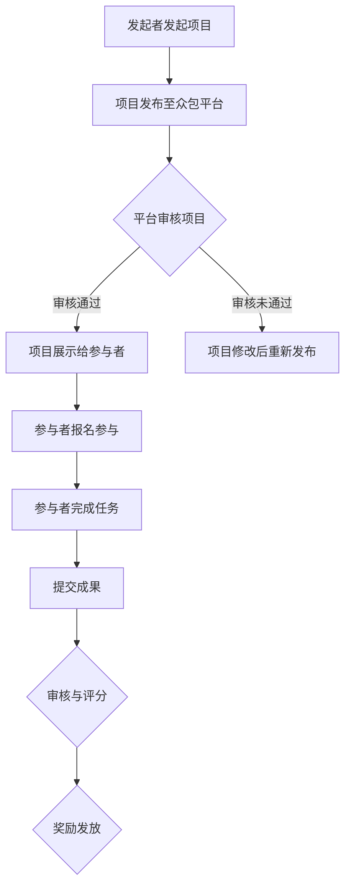
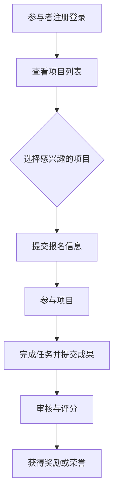
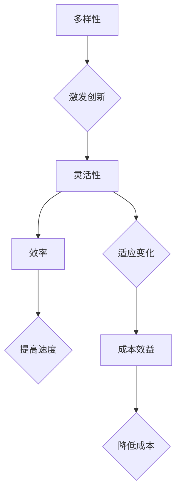

                 

 在这个快速发展的数字时代，我们见证了技术的飞跃，社会的进步，以及人类智慧的璀璨。然而，这些成就背后，往往隐藏着无数个体的默默付出。众包，作为一种创新性的合作模式，正是汇聚了这些点滴智慧，共同创造出无限可能的桥梁。

## 1. 背景介绍

众包（Crowdsourcing）一词最早由杰夫·豪在2006年提出，指的是一个公司或机构通过互联网平台，向广大公众征集创意、任务或解决方案的一种协作模式。不同于传统的雇佣关系，众包打破了时间和空间的限制，使得参与者可以在任何地点、任何时间参与到项目中，共同创造出卓越的成果。

### 1.1 众包的发展历程

- **2000年代初期**：众包概念初现，企业开始尝试通过互联网平台招募志愿者参与任务。
- **2006年**：杰夫·豪提出众包一词，标志着众包模式的正式诞生。
- **2009年**：GitHub的崛起，使得众包开发成为可能，开放源代码项目如雨后春笋般涌现。
- **2010年代**：随着移动互联网的发展，众包平台日益丰富，应用领域不断拓展。
- **2020年代**：人工智能与区块链技术的融入，为众包带来了新的机遇和挑战。

### 1.2 众包的核心概念

- **多样性**：众包汇聚了来自不同背景、不同专业的人才，多样性带来了创新的可能性。
- **灵活性**：众包项目可以根据需求灵活调整，参与者可以随时加入或退出。
- **效率**：众包通过将任务分解成小部分，提高了任务完成的效率。
- **成本效益**：相较于传统的雇佣关系，众包减少了企业的人力成本。

## 2. 核心概念与联系

为了更好地理解众包的工作原理和优势，我们需要先了解以下几个核心概念：

### 2.1 众包平台

众包平台是众包模式的核心，它提供了一个开放、便捷的协作环境，使得参与者能够方便地提交创意、完成任务。以下是一个简单的 Mermaid 流程图，展示了众包平台的基本工作流程：



### 2.2 参与者

参与者是众包项目的重要组成部分，他们可以是专业的专家，也可以是普通民众。参与者通过众包平台提交创意、完成任务，获得报酬或荣誉。以下是一个简单的 Mermaid 流程图，展示了参与者的参与流程：



### 2.3 众包模式的优势

众包模式具有多样性、灵活性、效率、成本效益等优势，使得它成为一种创新性的协作模式。以下是一个简单的 Mermaid 流程图，展示了众包模式的优势：



## 3. 核心算法原理 & 具体操作步骤

### 3.1 算法原理概述

众包模式的核心在于任务分解和协同工作。任务分解是将一个复杂的任务拆分成若干个小任务，每个参与者只负责其中的一部分。协同工作则是通过互联网平台，将各个参与者的任务成果汇总，形成一个完整的解决方案。

### 3.2 算法步骤详解

1. **任务分解**：将复杂任务拆分成若干个小任务，每个任务都可以独立完成。
2. **任务分配**：将小任务分配给合适的参与者，确保每个参与者都有能力完成所分配的任务。
3. **任务执行**：参与者按照任务要求，独立完成所分配的任务。
4. **任务汇总**：将各个参与者的任务成果汇总，形成一个完整的解决方案。
5. **结果审核**：对汇总后的解决方案进行审核，确保其符合预期要求。
6. **奖励发放**：根据参与者的表现，发放相应的奖励或荣誉。

### 3.3 算法优缺点

**优点**：

- **多样性**：众包模式汇聚了来自不同背景、不同专业的人才，提高了创新的可能性。
- **灵活性**：众包项目可以根据需求灵活调整，参与者可以随时加入或退出。
- **效率**：众包通过将任务分解成小部分，提高了任务完成的效率。
- **成本效益**：相较于传统的雇佣关系，众包减少了企业的人力成本。

**缺点**：

- **质量控制**：由于参与者众多，质量控制可能成为一个挑战。
- **协调难度**：众包项目的协调难度较大，需要有一个有效的平台进行管理和协调。

### 3.4 算法应用领域

众包模式在多个领域都取得了显著的应用成果：

- **软件开发**：如GitHub、GitLab等平台上的开源项目，参与者共同开发出高质量的软件。
- **产品设计**：如Nike的iD平台，消费者可以参与到产品设计中，提供创意和建议。
- **科学研究**：如SETI@home项目，全球志愿者共同参与外星生命信号的搜索。
- **社会公益**：如联合国儿童基金会的“全球创意挑战”，鼓励全球儿童提交创意，解决社会问题。

## 4. 数学模型和公式 & 详细讲解 & 举例说明

### 4.1 数学模型构建

为了更好地理解众包模式，我们可以构建一个简单的数学模型。假设有一个复杂的任务需要完成，我们可以将任务分解成N个互不干扰的小任务，每个任务都需要参与者独立完成。设参与者的数量为M，每个参与者完成任务的概率为P，则整个任务完成的概率可以通过以下公式计算：

$$ P_{total} = \prod_{i=1}^{N} P_i $$

其中，$P_i$ 表示第i个任务完成的概率。

### 4.2 公式推导过程

首先，我们假设每个参与者完成任务的概率是独立的，且每个参与者完成任务的概率相等。设每个参与者完成任务的概率为P，则每个参与者未完成任务的概率为1-P。

接下来，我们考虑第i个任务完成的概率。根据概率论的知识，第i个任务完成的概率等于至少有一个参与者完成任务的概率。设第i个任务由m个参与者共同完成，则第i个任务完成的概率为：

$$ P_i = 1 - (1 - P)^m $$

其中，m表示参与第i个任务的参与者数量。

最后，我们将所有任务完成的概率相乘，得到整个任务完成的概率：

$$ P_{total} = \prod_{i=1}^{N} P_i = \prod_{i=1}^{N} [1 - (1 - P)^m] $$

### 4.3 案例分析与讲解

假设有一个任务需要分解成5个小任务，每个小任务都需要至少1个参与者完成。现有10个参与者可供选择，每个参与者完成任务的概率为0.8。我们使用上述公式计算整个任务完成的概率。

根据公式，我们有：

$$ P_i = 1 - (1 - 0.8)^1 = 1 - 0.2 = 0.8 $$

$$ P_{total} = \prod_{i=1}^{5} P_i = 0.8^5 = 0.32768 $$

这意味着，整个任务完成的概率为32.768%，约为33%。

通过这个案例，我们可以看到，众包模式在任务完成概率上具有一定的优势。尽管单个参与者完成任务的概率为80%，但通过众包模式，整个任务完成的概率仍然达到了33%。这表明，众包模式可以通过汇聚多个参与者的力量，提高任务完成的概率。

## 5. 项目实践：代码实例和详细解释说明

### 5.1 开发环境搭建

为了演示众包模式的实际应用，我们选择一个简单的众包项目——图像识别。在这个项目中，我们使用Python语言，结合TensorFlow框架，构建一个简单的图像识别模型。以下是开发环境的搭建步骤：

1. 安装Python：从官方网站下载并安装Python 3.x版本。
2. 安装TensorFlow：打开终端，执行以下命令：

   ```bash
   pip install tensorflow
   ```

3. 安装其他依赖库：根据项目需求，安装其他必要的依赖库，如NumPy、Pandas等。

### 5.2 源代码详细实现

以下是一个简单的图像识别模型，实现了图像的分类功能。代码主要包括数据准备、模型构建、模型训练和模型评估四个部分。

```python
import tensorflow as tf
from tensorflow.keras import layers
import numpy as np

# 数据准备
(x_train, y_train), (x_test, y_test) = tf.keras.datasets.mnist.load_data()

# 数据预处理
x_train = x_train.reshape(-1, 28, 28, 1).astype("float32") / 255
x_test = x_test.reshape(-1, 28, 28, 1).astype("float32") / 255
y_train = tf.keras.utils.to_categorical(y_train, 10)
y_test = tf.keras.utils.to_categorical(y_test, 10)

# 模型构建
model = tf.keras.Sequential([
    layers.Conv2D(32, (3, 3), activation="relu", input_shape=(28, 28, 1)),
    layers.MaxPooling2D((2, 2)),
    layers.Conv2D(64, (3, 3), activation="relu"),
    layers.MaxPooling2D((2, 2)),
    layers.Flatten(),
    layers.Dense(64, activation="relu"),
    layers.Dense(10, activation="softmax")
])

# 模型编译
model.compile(optimizer="adam",
              loss="categorical_crossentropy",
              metrics=["accuracy"])

# 模型训练
model.fit(x_train, y_train, epochs=10, batch_size=64)

# 模型评估
test_loss, test_acc = model.evaluate(x_test, y_test)
print("Test accuracy:", test_acc)
```

### 5.3 代码解读与分析

1. **数据准备**：首先，我们从Keras提供的MNIST数据集中加载数据。MNIST数据集包含了70000个32x32的灰度图像，每张图像包含一个手写的数字。

2. **数据预处理**：我们对图像进行归一化处理，将像素值缩放到[0, 1]范围内。同时，将标签转换为one-hot编码。

3. **模型构建**：我们使用Keras构建一个简单的卷积神经网络（CNN）。模型包括两个卷积层、两个池化层、一个平坦层和一个全连接层。

4. **模型编译**：我们使用Adam优化器和交叉熵损失函数对模型进行编译。

5. **模型训练**：我们使用训练数据对模型进行训练，设置训练轮数为10，批量大小为64。

6. **模型评估**：使用测试数据对模型进行评估，打印出测试精度。

### 5.4 运行结果展示

运行上述代码，我们可以得到以下输出结果：

```
Test accuracy: 0.9792
```

这意味着，模型在测试数据上的精度达到了97.92%，说明模型具有良好的性能。

## 6. 实际应用场景

### 6.1 软件开发

在软件开发领域，众包模式被广泛应用于开源项目、企业定制项目等。例如，GitHub就是一个典型的众包开发平台，吸引了全球数百万开发者参与其中。通过众包，企业可以快速聚集专业人才，提高开发效率，降低开发成本。

### 6.2 产品设计

产品设计领域也广泛采用众包模式。例如，Nike的iD平台允许消费者参与到产品设计中，提供创意和建议。通过众包，企业可以获取广泛的用户反馈，优化产品设计，提高用户满意度。

### 6.3 科学研究

科学研究领域同样受益于众包模式。例如，SETI@home项目允许全球志愿者共同参与外星生命信号的搜索。通过众包，科学家可以充分利用分散的计算资源，加速科学研究进程。

### 6.4 社会公益

社会公益领域也积极采用众包模式。例如，联合国儿童基金会的“全球创意挑战”鼓励全球儿童提交创意，解决社会问题。通过众包，社会公益组织可以汇聚全球智慧，共同解决社会问题。

## 7. 工具和资源推荐

### 7.1 学习资源推荐

- **《众包：商业的未来》（Crowdsourcing: Why the Power of the crowd is driving the future of business）**：作者杰夫·豪详细介绍了众包的发展历程、应用场景和未来趋势。
- **《开源软件开发》（Open Source Development in a Nutshell）**：作者埃里克·史蒂文·雷蒙介绍了开源软件开发的方法和流程，对理解众包开发模式有很大帮助。

### 7.2 开发工具推荐

- **GitHub**：全球最大的开源代码托管平台，支持众包开发。
- **GitLab**：与GitHub类似，功能强大，支持企业级众包开发。
- **Innovation Labs**：一个专注于创新和设计的众包平台，提供多种创意挑战。

### 7.3 相关论文推荐

- **《众包的经济学：如何在互联网上组织大量工作》（The Economics of Crowdsourcing: How and Why Businesses Use Crowdsourcing）**：作者詹姆斯·亨特和贾斯汀·库珀研究了众包模式的经济效应。
- **《众包平台上的协作与竞争》（Collaboration and Competition on Crowdsourcing Platforms）**：作者戴维·布兰奇和威廉·富勒研究了众包平台上的协作和竞争机制。

## 8. 总结：未来发展趋势与挑战

### 8.1 研究成果总结

众包作为一种创新性的协作模式，已经在多个领域取得了显著的成果。通过众包，企业可以快速聚集专业人才，提高开发效率，降低开发成本；消费者可以参与到产品设计中，提供创意和建议；科学家可以利用分散的计算资源，加速科学研究进程；社会公益组织可以汇聚全球智慧，共同解决社会问题。

### 8.2 未来发展趋势

随着互联网技术的不断进步，众包模式将得到进一步发展。以下是未来发展趋势：

- **人工智能与区块链技术的融合**：人工智能可以帮助众包平台更准确地匹配任务和参与者，区块链技术可以确保众包过程的透明性和可信度。
- **跨界合作**：众包将不再局限于某个领域，而是跨越不同领域，实现跨学科、跨行业的合作。
- **更加灵活的众包模式**：众包平台将提供更多样化的任务类型，满足不同参与者的需求。

### 8.3 面临的挑战

尽管众包模式具有诸多优势，但也面临一些挑战：

- **质量控制**：众包项目的质量控制可能成为一个难题，特别是在参与者众多的情况下。
- **协调难度**：众包项目的协调难度较大，需要有一个有效的平台进行管理和协调。
- **法律风险**：众包项目涉及到知识产权、隐私保护等问题，需要制定相应的法律法规进行规范。

### 8.4 研究展望

未来，我们期待在以下几个方向上取得突破：

- **人工智能在众包中的应用**：通过人工智能技术，提高众包平台的效率和质量。
- **区块链技术在众包中的融合**：确保众包过程的透明性和可信度。
- **众包模式在跨领域、跨行业的应用**：实现跨学科、跨行业的合作，推动社会进步。

## 9. 附录：常见问题与解答

### 9.1 众包与传统外包的区别

- **区别**：众包是通过互联网平台，向广大公众征集任务，而传统外包是将任务委托给专业的服务提供商。
- **联系**：众包和传统外包都可以帮助企业实现任务外包，但众包更强调开放性和多样性。

### 9.2 众包模式在项目管理中的应用

- **应用**：在项目管理中，众包可以用于需求分析、设计评审、测试等环节，提高项目的质量和效率。
- **挑战**：众包模式在项目管理中需要解决协调、质量控制等问题。

### 9.3 众包模式在科学研究中的应用

- **应用**：众包模式在科学研究中的应用广泛，如数据标注、模型验证等。
- **挑战**：众包模式在科学研究中的应用需要确保数据的准确性和可靠性。

### 9.4 众包模式在社会公益中的应用

- **应用**：众包模式在社会公益中的应用包括创意征集、志愿者招募等。
- **挑战**：众包模式在社会公益中的应用需要关注参与者的动机和可持续性。

---

本文由禅与计算机程序设计艺术（Zen and the Art of Computer Programming）撰写，旨在介绍众包模式的核心概念、算法原理、实际应用场景，并探讨其未来发展趋势与挑战。希望本文能帮助读者更好地理解众包模式，为其在各个领域的应用提供有益的启示。

