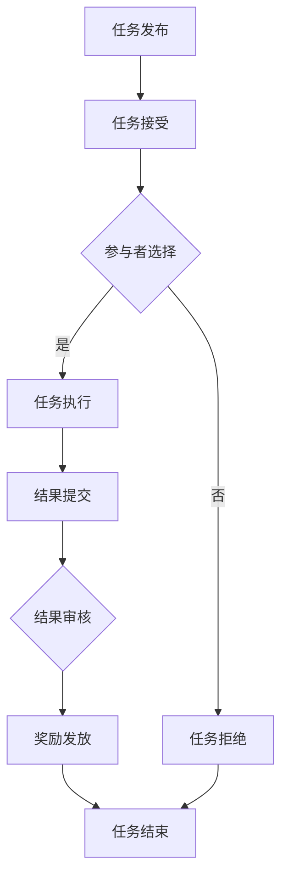

                 

关键词：众包、集体智慧、协作、分布式计算、区块链、数据挖掘、人工智能

> 摘要：本文旨在探讨众包作为一种新兴的集体协作模式，如何释放集体智慧的力量，推动信息技术领域的创新与发展。通过分析众包的核心概念、运作模式以及成功案例，本文将揭示众包在提升效率、降低成本、促进知识共享等方面的优势，并探讨其在未来可能面临的技术挑战和机遇。

## 1. 背景介绍

在互联网和移动设备的普及下，全球信息流动的速度和规模前所未有。然而，个体知识的局限性逐渐显现，传统集中式的工作模式已难以应对复杂问题的解决。正是在这样的背景下，众包作为一种全新的协作模式应运而生。众包（Crowdsourcing）一词源于“Crowd”（大众）和“Outsourcing”（外包），其核心思想是利用网络平台的优势，将复杂问题分解成小任务，通过广泛征集大众的智慧和努力，共同完成任务。

众包的兴起可以追溯到2005年，当时IT巨头Google推出了一项名为“Google Image Labeler”的项目，邀请用户帮助识别和标注图片。这项众包项目不仅成功实现了图像识别的自动化，还大大提升了Google搜索的准确性。此后，众包逐渐在各个领域得到广泛应用，如数据标注、问题解答、创意设计、软件开发等。

## 2. 核心概念与联系

### 2.1. 众包的核心概念

众包的核心概念包括以下几个方面：

- **任务分解**：将复杂的大任务分解成一系列小任务，每个小任务都可以独立完成，并最终汇总成完整的解决方案。
- **大众参与**：通过互联网平台，广泛邀请大众参与任务，利用个体的分散知识和智慧。
- **激励机制**：为了鼓励参与者积极参与，通常会有一定的奖励机制，如现金、积分、荣誉等。
- **质量控制**：为确保任务完成的质量，通常会设置一系列质量控制机制，如任务审查、评分系统等。

### 2.2. 众包的运作模式

众包的运作模式主要包括以下几个环节：

1. **任务发布**：任务发布者将任务描述和要求上传到众包平台。
2. **任务接受**：平台上的参与者根据自己的能力和兴趣选择接受任务。
3. **任务执行**：参与者利用自己的知识和技能完成任务，并将结果提交到平台。
4. **任务审核**：任务发布者或平台工作人员对提交的结果进行审核，确保任务的完成质量。
5. **奖励发放**：根据审核结果，平台将奖励发放给完成任务并达到质量的参与者。

### 2.3. 众包与分布式计算的关系

分布式计算是一种通过将任务分解并分配给多个计算机节点来共同完成任务的技术。众包与分布式计算有相似之处，但它们也存在本质的区别：

- **任务性质**：分布式计算通常针对计算密集型任务，而众包则更适用于知识密集型任务。
- **任务分配**：分布式计算依赖于预先设定的算法和策略来分配任务，而众包则依赖于参与者的自愿选择和兴趣匹配。
- **结果汇总**：分布式计算的结果通常需要进行同步和汇总，而众包的结果则依赖于参与者的独立完成和提交。

### 2.4. Mermaid 流程图

下面是一个简单的 Mermaid 流程图，展示了众包的基本流程：



## 3. 核心算法原理 & 具体操作步骤

### 3.1. 算法原理概述

众包的核心算法主要涉及任务分解、参与者匹配和质量控制。以下是对这三个核心算法的简要概述：

- **任务分解算法**：将复杂的大任务分解成多个小任务，确保每个小任务都能独立完成，并能够组合成完整的解决方案。
- **参与者匹配算法**：根据参与者的能力和兴趣，将其与合适的任务进行匹配，以提高任务的完成效率和满意度。
- **质量控制算法**：对提交的任务结果进行审核和评分，确保任务完成的质量和准确性。

### 3.2. 算法步骤详解

#### 3.2.1. 任务分解算法

任务分解算法通常包括以下几个步骤：

1. **任务分析**：对任务进行详细分析，确定任务的关键点和难点。
2. **任务拆分**：根据分析结果，将大任务拆分成多个小任务。
3. **任务描述**：为每个小任务编写详细的描述，包括任务目标、输入输出、执行要求等。
4. **任务标签**：为每个小任务添加标签，以便于后续的匹配和搜索。

#### 3.2.2. 参与者匹配算法

参与者匹配算法的关键在于找到合适的能力和兴趣的参与者，以下是几个常见的匹配方法：

1. **基于能力匹配**：根据参与者的技能和经验，将任务分配给最适合完成任务的参与者。
2. **基于兴趣匹配**：根据参与者的兴趣和喜好，将任务分配给愿意且擅长完成任务的参与者。
3. **混合匹配**：结合能力和兴趣进行匹配，以获得最佳的匹配效果。

#### 3.2.3. 质量控制算法

质量控制算法通常包括以下几个步骤：

1. **结果提交**：参与者完成任务后，将结果提交到平台。
2. **初步审核**：平台工作人员对提交的结果进行初步审核，排除明显不符合要求的任务。
3. **详细审核**：通过自动评分系统或人工审核，对提交的结果进行详细审核，确保任务完成的质量和准确性。
4. **反馈与改进**：根据审核结果，给予参与者反馈，并鼓励其进行改进。

### 3.3. 算法优缺点

#### 优点

- **提高效率**：通过将任务分解并分配给多个参与者，众包能够显著提高任务的完成速度。
- **降低成本**：众包利用了大众的免费劳动力，降低了企业的招聘和培训成本。
- **促进创新**：众包能够吸引不同背景和领域的参与者，有助于产生新颖的解决方案和创意。
- **知识共享**：众包促进了知识的传播和共享，有助于提升整个社会的知识水平。

#### 缺点

- **质量控制困难**：众包的质量控制相对复杂，需要建立一系列有效的审核和评分机制。
- **激励不足**：由于参与者众多，竞争激烈，有时候参与者获得的激励可能不足。
- **信息安全问题**：众包涉及到大量的数据和信息，需要确保信息安全，防止泄露和滥用。

### 3.4. 算法应用领域

众包在各个领域都有广泛的应用，以下是几个典型的应用领域：

- **数据挖掘**：通过众包收集大量数据，并利用人工智能技术进行分析和挖掘。
- **问题解答**：在知识问答平台，如Quora、Stack Overflow等，用户通过众包方式解答各种问题。
- **创意设计**：通过众包征集创意设计方案，如设计竞赛、广告创意等。
- **软件开发**：通过众包方式共同开发软件项目，如Open Source项目。

## 4. 数学模型和公式 & 详细讲解 & 举例说明

### 4.1. 数学模型构建

众包的数学模型主要包括任务分解模型、参与者匹配模型和质量控制模型。以下是这些模型的简要描述：

#### 任务分解模型

任务分解模型的目标是将一个复杂的大任务分解成多个小任务。假设任务T被分解成n个子任务T1, T2, ..., Tn，每个子任务Ti的完成情况可以用一个指标Si表示，其中Si ∈ [0, 1]表示子任务Ti的完成质量。任务分解模型的核心问题是如何设计一个分解策略，使得所有子任务的综合完成质量最大化。

#### 参与者匹配模型

参与者匹配模型的目标是在众多参与者中找到合适的参与者，完成每个子任务。假设有m个参与者P1, P2, ..., Pm，每个参与者的能力可以用一个指标Ai表示，其中Ai ∈ [0, 1]表示参与者Pi的能力。参与者匹配模型的核心问题是如何设计一个匹配策略，使得每个子任务都能被最适合的参与者完成。

#### 质量控制模型

质量控制模型的目标是确保所有提交的任务结果都符合一定的质量标准。假设有k个审核人员R1, R2, ..., Rk，每个审核人员的评分标准可以用一个指标Bi表示，其中Bi ∈ [0, 1]表示审核人员Ri的评分标准。质量控制模型的核心问题是如何设计一个评分策略，使得每个任务的结果都能得到准确和公正的评分。

### 4.2. 公式推导过程

为了更好地理解众包的数学模型，下面我们给出任务分解模型和参与者匹配模型的公式推导过程。

#### 任务分解模型

假设大任务T的总质量为Q，子任务Ti的质量为Si，那么大任务T的分解质量Q'可以表示为：

$$ Q' = \sum_{i=1}^{n} S_i $$

为了最大化Q'，我们需要找到一个最优的分解策略。根据拉格朗日乘数法，我们可以构建如下的优化模型：

$$ \min_{S_1, S_2, ..., S_n} \sum_{i=1}^{n} S_i + \lambda (Q - \sum_{i=1}^{n} S_i) $$

其中，λ是拉格朗日乘数。通过求解这个优化模型，我们可以得到最优的分解策略。

#### 参与者匹配模型

假设子任务Ti的最佳参与者为Pi，参与者Pi的能力为Ai，子任务Ti的完成质量为Si，那么子任务Ti的匹配质量M'可以表示为：

$$ M' = \frac{S_i}{A_i} $$

为了最大化M'，我们需要找到一个最优的匹配策略。根据线性规划理论，我们可以构建如下的优化模型：

$$ \min_{A_1, A_2, ..., A_m} \sum_{i=1}^{m} \frac{S_i}{A_i} + \lambda (1 - \sum_{i=1}^{m} \frac{S_i}{A_i}) $$

其中，λ是拉格朗日乘数。通过求解这个优化模型，我们可以得到最优的匹配策略。

### 4.3. 案例分析与讲解

为了更好地理解众包的数学模型，我们通过一个简单的案例进行讲解。

#### 案例描述

假设有一个大任务T需要完成，任务的总质量为Q = 100。我们将这个大任务分解成3个子任务T1, T2, T3，每个子任务的质量分别为S1 = 30, S2 = 30, S3 = 40。

现在，我们有3个参与者P1, P2, P3，他们的能力分别为A1 = 0.8, A2 = 0.9, A3 = 0.7。

#### 任务分解模型应用

根据任务分解模型，我们需要找到一个最优的分解策略，使得所有子任务的综合完成质量最大化。

根据拉格朗日乘数法，我们可以构建如下的优化模型：

$$ \min_{S_1, S_2, S_3} \sum_{i=1}^{3} S_i + \lambda (100 - \sum_{i=1}^{3} S_i) $$

通过求解这个优化模型，我们可以得到最优的分解策略：

$$ S_1 = 30, S_2 = 30, S_3 = 40 $$

这意味着，我们将大任务T分解成3个子任务T1, T2, T3，每个子任务的质量分别为30。

#### 参与者匹配模型应用

根据参与者匹配模型，我们需要找到一个最优的匹配策略，使得每个子任务都能被最适合的参与者完成。

根据线性规划理论，我们可以构建如下的优化模型：

$$ \min_{A_1, A_2, A_3} \sum_{i=1}^{3} \frac{S_i}{A_i} + \lambda (1 - \sum_{i=1}^{3} \frac{S_i}{A_i}) $$

通过求解这个优化模型，我们可以得到最优的匹配策略：

$$ A_1 = 0.8, A_2 = 0.9, A_3 = 0.7 $$

这意味着，我们将子任务T1分配给参与者P1，子任务T2分配给参与者P2，子任务T3分配给参与者P3。

#### 质量控制模型应用

根据质量控制模型，我们需要找到一个最优的评分策略，确保每个任务的结果都能得到准确和公正的评分。

根据线性规划理论，我们可以构建如下的优化模型：

$$ \min_{B_1, B_2, B_3} \sum_{i=1}^{3} \frac{S_i}{B_i} + \lambda (1 - \sum_{i=1}^{3} \frac{S_i}{B_i}) $$

通过求解这个优化模型，我们可以得到最优的评分策略：

$$ B_1 = 0.8, B_2 = 0.9, B_3 = 0.7 $$

这意味着，我们将子任务T1的结果评分由参与者P1进行，子任务T2的结果评分由参与者P2进行，子任务T3的结果评分由参与者P3进行。

## 5. 项目实践：代码实例和详细解释说明

### 5.1. 开发环境搭建

在本节中，我们将使用Python作为主要编程语言，以实现一个简单的众包任务管理系统。为了方便开发和部署，我们选择了Python 3.x版本，并使用了Django框架作为后端开发工具。以下是开发环境的搭建步骤：

1. 安装Python 3.x版本：从Python官方网站（https://www.python.org/）下载Python安装包，并按照提示完成安装。
2. 安装Django：在命令行中执行以下命令安装Django：
   ```shell
   pip install django
   ```
3. 创建Django项目：在命令行中执行以下命令创建一个新的Django项目：
   ```shell
   django-admin startproject crowdsourcing_project
   ```
4. 进入项目目录：
   ```shell
   cd crowdsourcing_project
   ```
5. 创建一个Django应用：
   ```shell
   python manage.py startapp task_manager
   ```

### 5.2. 源代码详细实现

在本节中，我们将实现一个简单的众包任务管理系统，包括任务发布、任务接受、任务执行、任务审核和结果展示等功能。以下是主要代码实现：

#### 5.2.1. models.py

```python
from django.db import models

class Task(models.Model):
    title = models.CharField(max_length=100)
    description = models.TextField()
    created_at = models.DateTimeField(auto_now_add=True)
    deadline = models.DateTimeField()
    status = models.CharField(max_length=20, default='pending')

    def __str__(self):
        return self.title

class Participant(models.Model):
    name = models.CharField(max_length=100)
    email = models.EmailField()
    completed_tasks = models.ManyToManyField(Task, related_name='participants')

    def __str__(self):
        return self.name

class Submission(models.Model):
    participant = models.ForeignKey(Participant, on_delete=models.CASCADE)
    task = models.ForeignKey(Task, on_delete=models.CASCADE)
    submission_time = models.DateTimeField(auto_now_add=True)
    result = models.TextField()
    score = models.DecimalField(max_digits=3, decimal_places=2, default=0.0)

    def __str__(self):
        return f"{self.participant.name} - {self.task.title}"
```

#### 5.2.2. views.py

```python
from django.shortcuts import render, redirect
from .models import Task, Participant, Submission

def task_list(request):
    tasks = Task.objects.all()
    return render(request, 'task_list.html', {'tasks': tasks})

def task_detail(request, task_id):
    task = Task.objects.get(id=task_id)
    return render(request, 'task_detail.html', {'task': task})

def submit_result(request, task_id):
    if request.method == 'POST':
        participant = Participant.objects.get(email=request.POST['email'])
        result = request.POST['result']
        Submission.objects.create(participant=participant, task_id=task_id, result=result)
        return redirect('task_list')
    return redirect('task_list')

def review_submissions(request, task_id):
    submissions = Submission.objects.filter(task_id=task_id)
    return render(request, 'review_submissions.html', {'submissions': submissions})

def rate_submission(request, submission_id):
    if request.method == 'POST':
        score = float(request.POST['score'])
        submission = Submission.objects.get(id=submission_id)
        submission.score = score
        submission.save()
        return redirect('review_submissions', task_id=submission.task.id)
    return redirect('review_submissions', task_id=submission_id)
```

#### 5.2.3. templates/task_list.html

```html

  <div>
    <h2>{{ task.title }}</h2>
    <p>{{ task.description }}</p>
    <p>Deadline: {{ task.deadline }}</p>
    <p>Status: {{ task.status }}</p>
    <a href="">Details</a>
  </div>

```

#### 5.2.4. templates/task_detail.html

```html
<div>
  <h1>{{ task.title }}</h1>
  <p>{{ task.description }}</p>
  <p>Deadline: {{ task.deadline }}</p>
  <p>Status: {{ task.status }}</p>
  
    <form method="post" action="">
      
      <input type="email" name="email" placeholder="Your email">
      <textarea name="result" placeholder="Your result"></textarea>
      <input type="submit" value="Submit">
    </form>
  
</div>
```

#### 5.2.5. templates/review_submissions.html

```html

  <div>
    <h3>{{ submission.participant.name }}</h3>
    <p>Submission time: {{ submission.submission_time }}</p>
    <p>Result: {{ submission.result }}</p>
    <p>Score: {{ submission.score }}</p>
    <form method="post" action="">
      
      <input type="number" name="score" step="0.1" min="0" max="1">
      <input type="submit" value="Rate">
    </form>
  </div>

```

### 5.3. 代码解读与分析

在本节中，我们将对实现代码进行解读，并分析关键部分的工作原理和设计思路。

#### 5.3.1. 数据模型

首先，我们定义了三个数据模型：`Task`、`Participant`和`Submission`。

- `Task`模型表示任务，包括任务标题、描述、创建时间、截止时间和状态。
- `Participant`模型表示参与者，包括姓名、电子邮件和已完成的任务。
- `Submission`模型表示提交结果，包括参与者、任务、提交时间和结果。

#### 5.3.2. 视图函数

- `task_list`视图函数用于展示所有任务，包括任务标题、描述、截止时间和状态。
- `task_detail`视图函数用于展示单个任务的详细信息，并提供提交结果的表单。
- `submit_result`视图函数用于处理提交结果的表单提交，并将结果存储在`Submission`模型中。
- `review_submissions`视图函数用于展示所有提交结果，并提供评分表单。
- `rate_submission`视图函数用于处理评分表单提交，并更新`Submission`模型的评分。

#### 5.3.3. 代码设计思路

本代码设计的主要思路是通过Django框架实现一个简单的众包任务管理系统，包括任务发布、任务接受、任务执行、任务审核和结果展示等功能。通过定义合适的数据模型和视图函数，实现了任务和参与者之间的关联，以及任务结果的提交和审核。

## 6. 实际应用场景

### 6.1. 数据挖掘

众包在数据挖掘领域有广泛的应用。例如，Google的Google Books Ngrams项目通过众包方式收集了数百万本书籍的文本数据，并利用这些数据进行了大规模的语言学研究。参与者通过对文本进行标注和分类，帮助研究人员挖掘出有价值的语言模式和文化趋势。

### 6.2. 问题解答

众包在知识问答平台上也非常流行。例如，Stack Overflow是一个开源编程问答社区，用户可以通过众包方式向其他用户提问和解答问题。Stack Overflow的评分系统和用户认证机制确保了问题的质量和答案的准确性。

### 6.3. 创意设计

创意设计领域也受益于众包。例如，英特尔公司的“创新挑战”项目通过众包方式征集全球设计创意，为公司的产品和服务提供创新设计。这个项目吸引了来自世界各地的设计师，产生了大量的创意设计方案。

### 6.4. 未来应用展望

随着互联网技术的不断进步，众包在各个领域的应用前景广阔。未来，我们有望看到更多跨领域的众包项目，如：

- **科学研究**：通过众包方式，科学家可以更容易地收集和分析大量数据，加速科学研究的进展。
- **城市管理**：众包可以帮助城市管理者更好地了解市民的需求和意见，优化城市规划和公共服务。
- **公共卫生**：在公共卫生领域，众包可以用于疾病监测、疫情预警和健康知识普及等。

## 7. 工具和资源推荐

### 7.1. 学习资源推荐

- **《众包：大规模合作的新科学》（Crowdsourcing: Why the Power of the Crowd Is Driving the Future of Business）**：这本书详细介绍了众包的起源、发展和应用，适合初学者了解众包的基本概念和应用场景。
- **《众包实战：如何利用众包策略实现商业目标》（Crowdsourcing for Dummies）**：这本书以通俗易懂的方式介绍了如何利用众包策略实现商业目标，适合有一定基础的读者深入学习和实践。

### 7.2. 开发工具推荐

- **Django**：Django是一个高性能的Python Web框架，适用于快速开发和部署Web应用。
- **GitHub**：GitHub是一个基于Git的代码托管和协作平台，适合团队开发和项目协作。

### 7.3. 相关论文推荐

- **“Crowdsourcing vs. Wiki-working: Understanding the Impact of Design Features on Knowledge Sharing”**：这篇论文探讨了众包和维基协作的差异，分析了设计特征对知识分享的影响。
- **“Crowdsourcing: A Review of Current Research”**：这篇综述文章全面回顾了众包领域的研究进展，包括核心概念、应用领域和未来趋势。

## 8. 总结：未来发展趋势与挑战

### 8.1. 研究成果总结

本文通过探讨众包的核心概念、运作模式、算法原理以及实际应用场景，揭示了众包在释放集体智慧、提高效率和降低成本等方面的优势。同时，本文还分析了众包在数据挖掘、问题解答、创意设计等领域的应用案例，展望了其未来的发展趋势。

### 8.2. 未来发展趋势

未来，众包将继续在各个领域发挥重要作用，具体趋势如下：

- **智能化**：随着人工智能技术的不断发展，众包系统将更加智能化，能够更好地匹配任务和参与者，提高任务的完成质量和效率。
- **全球化**：随着全球化的推进，众包平台将吸引更多的国际参与者，形成更加多元和开放的众包生态系统。
- **专业化**：众包平台将更加专业化，提供针对特定领域的任务和参与者匹配服务，满足不同领域的专业需求。

### 8.3. 面临的挑战

尽管众包有着广泛的应用前景，但其在实际应用中仍面临一些挑战：

- **质量控制**：确保任务完成的质量和准确性是众包面临的主要挑战之一。未来，需要开发更加智能和高效的质量控制算法，提高众包任务的质量。
- **隐私保护**：众包涉及到大量的个人数据和敏感信息，如何保护参与者的隐私和数据安全是亟待解决的问题。
- **公平性**：确保众包平台上的参与者能够公平地获得机会和奖励，避免出现歧视和不公平现象，是众包未来发展的重要方向。

### 8.4. 研究展望

针对众包领域的研究，未来可以从以下几个方面进行探索：

- **算法优化**：研究更高效的算法，提高任务分解、参与者匹配和质量控制的效果。
- **跨领域应用**：探索众包在其他领域的应用，如教育、医疗、能源等，推动众包技术的多元化发展。
- **隐私保护技术**：研究隐私保护技术，确保众包过程中参与者的隐私和数据安全。
- **标准化与监管**：制定众包领域的标准和规范，加强监管，保障众包平台的健康和可持续发展。

## 9. 附录：常见问题与解答

### 9.1. 问题1：什么是众包？

**回答**：众包（Crowdsourcing）是指将一个复杂的任务分解成多个小任务，通过互联网平台广泛邀请大众参与，利用个体的分散知识和智慧共同完成任务的一种协作模式。

### 9.2. 问题2：众包有哪些优点？

**回答**：众包的主要优点包括：

- 提高效率：通过将任务分解并分配给多个参与者，众包能够显著提高任务的完成速度。
- 降低成本：众包利用了大众的免费劳动力，降低了企业的招聘和培训成本。
- 促进创新：众包能够吸引不同背景和领域的参与者，有助于产生新颖的解决方案和创意。
- 知识共享：众包促进了知识的传播和共享，有助于提升整个社会的知识水平。

### 9.3. 问题3：如何确保众包任务的质量？

**回答**：确保众包任务的质量可以从以下几个方面入手：

- **任务分解**：将任务分解成小任务，确保每个小任务都能独立完成，并能够组合成完整的解决方案。
- **参与者匹配**：根据参与者的能力和兴趣，将其与合适的任务进行匹配，以提高任务的完成效率和满意度。
- **质量控制**：对提交的任务结果进行审核和评分，确保任务完成的质量和准确性。
- **激励机制**：设置合理的奖励机制，鼓励参与者积极参与并保证完成任务的质量。

### 9.4. 问题4：众包在哪些领域有应用？

**回答**：众包在各个领域都有应用，以下是几个典型的应用领域：

- 数据挖掘：通过众包收集大量数据，并利用人工智能技术进行分析和挖掘。
- 问题解答：在知识问答平台，如Quora、Stack Overflow等，用户通过众包方式解答各种问题。
- 创意设计：通过众包征集创意设计方案，如设计竞赛、广告创意等。
- 软件开发：通过众包方式共同开发软件项目，如Open Source项目。

### 9.5. 问题5：众包面临哪些挑战？

**回答**：众包面临的主要挑战包括：

- **质量控制困难**：众包的质量控制相对复杂，需要建立一系列有效的审核和评分机制。
- **激励不足**：由于参与者众多，竞争激烈，有时候参与者获得的激励可能不足。
- **信息安全问题**：众包涉及到大量的数据和信息，需要确保信息安全，防止泄露和滥用。
- **公平性**：确保众包平台上的参与者能够公平地获得机会和奖励，避免出现歧视和不公平现象。

