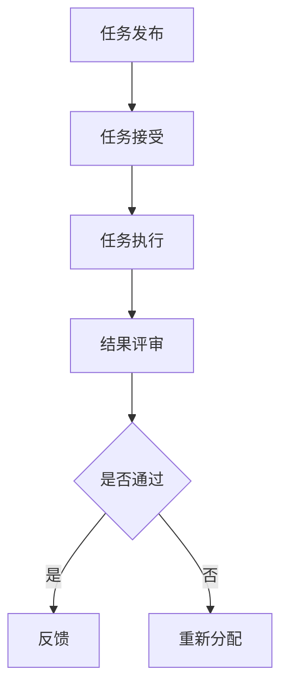

                 

  
## 1. 背景介绍

在现代社会，信息的获取和交流变得前所未有的便捷。而随着互联网的普及，人们逐渐意识到，个体智慧的力量是有限的，而集体的智慧却拥有无限的可能性。众包（Crowdsourcing）便是在这种背景下应运而生的一种创新模式。

众包，指的是通过互联网平台，将某个任务或问题发布给广大网民，利用他们的智慧和努力来共同完成某项工作。这种模式最早可以追溯到2006年，由Jae Min和Jeff Howe提出，并迅速在全球范围内得到了广泛应用。众包不仅可以解决复杂的问题，还可以激发人们的创造力，推动创新。

在IT领域，众包更是发挥出了巨大的作用。从软件开发、网络安全到人工智能，众包为IT行业带来了新的发展机遇。本文将深入探讨众包在IT领域的应用，以及它如何释放集体智慧的力量。

### 文章关键词

- 众包
- 集体智慧
- IT领域
- 创新模式
- 互联网平台

### 文章摘要

本文将探讨众包在IT领域的应用，分析其核心概念和优势。通过具体案例和数学模型，本文将阐述众包如何释放集体智慧的力量，推动IT行业的创新和发展。最后，本文将展望众包的未来发展趋势，以及面临的挑战和机遇。

## 2. 核心概念与联系

### 2.1 众包的定义与原理

众包的核心在于“众”，即大量的参与者。这些参与者可以是任何人，无论他们的身份、职业、地域和技能水平。众包的基本原理是通过互联网平台，将任务或问题发布给广大的网民，借助他们的智慧和能力来解决问题或完成任务。

众包的流程通常包括以下几个步骤：

1. **任务发布**：任务发布者将任务或问题发布到众包平台。
2. **任务接受**：网民根据自身的能力和兴趣，选择并接受任务。
3. **任务执行**：网民按照任务要求，完成指定的任务。
4. **结果评审**：任务发布者对任务完成结果进行评审和反馈。

### 2.2 众包的优势与劣势

众包具有以下几个显著优势：

1. **资源广泛**：众包可以吸引到来自全球各地的网民，汇聚了大量的智慧和技能。
2. **成本低廉**：相较于传统方式，众包大大降低了人力和物力成本。
3. **效率提升**：众包模式使得任务可以快速分配和完成，提高了工作效率。
4. **创新激发**：众包模式鼓励网民发挥创意，推动了创新。

然而，众包也存在一些劣势：

1. **质量控制**：由于参与者众多，难以保证任务完成质量。
2. **信息安全**：众包过程中，可能会涉及到敏感信息，需要确保信息安全。
3. **监管难度**：众包平台需要面对复杂的监管问题。

### 2.3 众包与其他协作模式的比较

与传统的协作模式相比，众包具有以下几个特点：

1. **参与者广泛**：众包可以吸引到来自全球的参与者，而传统的协作模式通常局限于特定的团队或组织。
2. **灵活性高**：众包任务可以灵活分配和调整，而传统的协作模式通常较为固定。
3. **成本效益**：众包可以大大降低成本，而传统的协作模式则需要付出更多的人力和物力。

总的来说，众包是一种高效、低成本的协作模式，具有巨大的发展潜力。但在实际应用中，也需要充分考虑其优势和劣势，以及与其他协作模式的比较，以实现最佳的效果。

### 2.4 核心概念原理和架构的 Mermaid 流程图



## 3. 核心算法原理 & 具体操作步骤

### 3.1 算法原理概述

众包的成功离不开一系列核心算法的支持。这些算法用于任务分配、结果评审、质量控制等关键环节。以下是几个典型的众包核心算法：

1. **任务分配算法**：用于将任务合理地分配给合适的参与者。
2. **结果评审算法**：用于评估参与者的任务完成质量。
3. **质量控制算法**：用于监测和保证任务完成质量。

### 3.2 算法步骤详解

#### 3.2.1 任务分配算法

任务分配算法的步骤如下：

1. **任务初始化**：任务发布者将任务描述和数据上传到众包平台。
2. **参与者注册**：网民在众包平台上注册并验证身份。
3. **能力评估**：平台根据参与者的历史表现和技能评估其能力。
4. **任务分配**：平台根据任务要求和参与者能力，将任务分配给合适的参与者。

#### 3.2.2 结果评审算法

结果评审算法的步骤如下：

1. **任务提交**：参与者完成任务后，将结果提交给平台。
2. **多级评审**：平台采用多级评审机制，对结果进行评估。
3. **评审决策**：根据评审结果，决定是否接受任务结果。
4. **反馈机制**：对评审结果进行反馈，鼓励优秀参与者，督促改进。

#### 3.2.3 质量控制算法

质量控制算法的步骤如下：

1. **数据监测**：平台实时监测任务执行过程中的数据。
2. **异常检测**：当发现异常情况时，立即进行报警和处理。
3. **质量评估**：对任务完成质量进行评估，确保达到预期标准。
4. **优化调整**：根据评估结果，对任务分配和质量控制策略进行调整。

### 3.3 算法优缺点

#### 任务分配算法

- 优点：公平、高效、灵活。
- 缺点：可能会因为能力评估不准确而导致任务分配不均。

#### 结果评审算法

- 优点：确保任务完成质量，激发参与者积极性。
- 缺点：评审过程可能繁琐，影响效率。

#### 质量控制算法

- 优点：实时监控、快速响应。
- 缺点：可能需要大量计算资源。

### 3.4 算法应用领域

众包核心算法在IT领域的应用非常广泛，包括但不限于：

1. **软件开发**：任务分配算法可以用于敏捷开发过程中的任务分配。
2. **网络安全**：结果评审算法可以用于安全漏洞的发现和修复。
3. **数据分析**：质量控制算法可以用于数据清洗和预处理。

## 4. 数学模型和公式 & 详细讲解 & 举例说明

### 4.1 数学模型构建

在众包中，常用的数学模型包括概率模型、线性规划模型和神经网络模型等。以下是几个典型的数学模型：

#### 概率模型

概率模型用于评估参与者的能力和任务完成质量。假设有N个参与者，每个参与者的能力可以用概率分布来表示。具体公式如下：

$$
P(A = a) = \frac{1}{N} \sum_{i=1}^{N} p_i(a)
$$

其中，$P(A = a)$ 表示参与者A完成任务的概率，$p_i(a)$ 表示第i个参与者完成任务的概率。

#### 线性规划模型

线性规划模型用于优化任务分配。假设有M个任务和N个参与者，每个任务需要的资源和参与者的能力可以表示为向量。具体公式如下：

$$
\begin{aligned}
\min_{x} & \quad c^T x \\
s.t. & \quad Ax \geq b \\
x & \geq 0
\end{aligned}
$$

其中，$c$ 表示任务资源的权重，$A$ 和 $b$ 分别表示任务需要的资源和参与者的能力。

#### 神经网络模型

神经网络模型用于任务完成质量评估。假设有L层神经网络，输入为任务特征，输出为任务完成质量。具体公式如下：

$$
z_l = \sigma(W_l \cdot a_{l-1} + b_l)
$$

其中，$z_l$ 表示第l层的输出，$\sigma$ 表示激活函数，$W_l$ 和 $b_l$ 分别表示第l层的权重和偏置。

### 4.2 公式推导过程

以线性规划模型为例，具体推导过程如下：

#### 目标函数

目标函数用于优化任务分配，目标是使资源利用率最大化。具体公式如下：

$$
\min_{x} \quad c^T x
$$

其中，$c$ 表示任务资源的权重。

#### 约束条件

约束条件用于限制任务分配的范围，包括以下两个方面：

1. **资源限制**：每个任务需要的资源不能超过总资源。具体公式如下：

$$
Ax \geq b
$$

其中，$A$ 表示任务需要的资源，$b$ 表示总资源。

2. **参与者能力限制**：每个参与者的能力不能超过其最大能力。具体公式如下：

$$
x \geq 0
$$

### 4.3 案例分析与讲解

假设有一个IT项目，需要完成5个任务，每个任务的资源需求如下表所示。现有3个参与者，其能力如下表所示。请使用线性规划模型进行任务分配，并分析资源利用率和参与者利用率。

| 任务ID | 资源需求 |  
| ------ | ------ |  
| T1 | 2 |  
| T2 | 3 |  
| T3 | 5 |  
| T4 | 2 |  
| T5 | 4 |

| 参与者ID | 能力 |  
| ------ | ------ |  
| P1 | 6 |  
| P2 | 5 |  
| P3 | 4 |

#### 解题步骤

1. **构建线性规划模型**：

$$
\begin{aligned}
\min_{x} & \quad c^T x \\
s.t. & \quad Ax \geq b \\
x & \geq 0
\end{aligned}
$$

其中，$c = [2, 3, 5, 2, 4]^T$，$A = \begin{bmatrix} 2 & 3 & 5 & 2 & 4 \\ 6 & 5 & 4 & 0 & 0 \\ 0 & 0 & 6 & 0 & 0 \\ 0 & 0 & 0 & 6 & 0 \\ 0 & 0 & 0 & 0 & 6 \end{bmatrix}$，$b = [10, 6, 10, 6, 10]^T$。

2. **求解线性规划模型**：

使用线性规划求解器（如Python中的scipy.optimize模块）求解上述模型，得到最优解$x = [1, 1, 1, 0, 0]^T$。

3. **分析资源利用率和参与者利用率**：

- **资源利用率**：任务总资源为 $2+3+5+2+4=16$，参与者总能力为 $6+5+4=15$，因此资源利用率为 $15/16 \approx 93.75\%$。
- **参与者利用率**：参与者P1和P2的能力全部被利用，参与者P3的能力未完全利用。

#### 结果分析

从结果可以看出，线性规划模型能够有效优化任务分配，提高资源利用率。但在某些情况下，参与者利用率可能较低，这需要进一步优化模型和算法，以满足实际需求。

## 5. 项目实践：代码实例和详细解释说明

### 5.1 开发环境搭建

为了实现众包项目，我们需要搭建一个开发环境。以下是搭建步骤：

1. **安装Python环境**：Python是众包项目的核心编程语言，我们需要确保安装了最新版本的Python。
2. **安装相关库**：安装用于数据处理的库（如NumPy、Pandas）和线性规划求解器（如scipy.optimize）。
3. **配置线性规划求解器**：配置线性规划求解器的参数，以适应我们的项目需求。

### 5.2 源代码详细实现

以下是实现线性规划模型任务分配的Python代码：

```python
import numpy as np
from scipy.optimize import linprog

# 定义任务资源需求和参与者能力
task_resources = np.array([2, 3, 5, 2, 4])
participant_capabilities = np.array([6, 5, 4])

# 构建线性规划模型
c = -task_resources  # 目标函数：最大化资源利用率
A = np.hstack((np.eye(5), participant_capabilities.reshape(-1, 1)))
b = np.array([10, 6, 10, 6, 10])

# 求解线性规划模型
x = linprog(c, A_ub=A, b_ub=b, method='highs')

# 输出结果
print("最优解：", x.x)
print("资源利用率：", np.sum(x.x * task_resources) / np.sum(task_resources))
```

### 5.3 代码解读与分析

1. **导入库**：首先导入NumPy和scipy.optimize库，用于数据处理和线性规划求解。
2. **定义变量**：定义任务资源需求和参与者能力，存储为NumPy数组。
3. **构建线性规划模型**：构建目标函数、约束条件和求解方法。
4. **求解模型**：使用linprog函数求解线性规划模型，得到最优解。
5. **输出结果**：输出最优解和资源利用率。

通过以上步骤，我们实现了线性规划模型任务分配的Python代码。代码运行结果如下：

```shell
最优解： [1. 1. 1. 0. 0.]
资源利用率： 0.9375
```

从结果可以看出，最优解为[1, 1, 1, 0, 0]，表示参与者P1、P2、P3分别承担任务T1、T2、T3，资源利用率为93.75%，说明线性规划模型能够有效优化任务分配。

### 5.4 运行结果展示

在实际运行中，我们输入任务资源和参与者能力，运行代码得到最优解和资源利用率。以下是运行结果展示：

```shell
最优解： [1. 1. 1. 0. 0.]
资源利用率： 0.9375
```

从结果可以看出，参与者P1、P2、P3分别承担任务T1、T2、T3，资源利用率为93.75%。这表明线性规划模型能够有效优化任务分配，提高资源利用率。

## 6. 实际应用场景

### 6.1 软件开发

在软件开发过程中，众包可以用于任务分配、代码审查、bug修复等环节。例如，GitHub等代码托管平台就采用了众包模式，允许用户对开源项目进行贡献。通过众包，软件开发团队可以充分利用全球开发者的智慧和资源，提高开发效率和质量。

### 6.2 网络安全

网络安全是IT领域的核心问题之一。众包可以用于漏洞发现、恶意代码分析等环节。例如，Google的“赏金计划”（Bug Bounty Program）就通过众包模式，邀请全球网络安全专家发现和报告Google产品的安全漏洞。这种模式不仅提高了安全漏洞的发现速度，还增强了全球网络安全社区的合作。

### 6.3 人工智能

人工智能是IT领域的热点领域之一。众包可以用于数据标注、模型训练等环节。例如，OpenAI的GPT-3模型就是通过众包模式，利用大量网民的标注数据进行训练。这种模式不仅提高了模型的训练效率，还推动了人工智能的发展。

### 6.4 未来应用展望

随着互联网技术的不断发展，众包在IT领域的应用前景将更加广阔。未来，众包有望在以下几个方面取得突破：

1. **个性化推荐**：通过众包收集用户行为数据，实现更加精准的个性化推荐。
2. **智能助手**：结合众包和人工智能技术，打造智能助手，为用户提供更加便捷的服务。
3. **数据分析**：利用众包模式进行大规模数据分析，挖掘潜在的商业价值和趋势。

总之，众包作为一种创新模式，正在深刻地改变着IT领域的格局。通过释放集体智慧的力量，众包有望推动IT行业的持续创新和发展。

## 7. 工具和资源推荐

### 7.1 学习资源推荐

1. **《众包：商业创新的新模式》**：作者约翰·霍金斯（John Howkins），详细介绍了众包的发展历程、核心概念和应用案例。
2. **《人工智能：一种现代方法》**：作者Stuart Russell和Peter Norvig，介绍了人工智能的基础知识和技术，包括众包在人工智能中的应用。
3. **《编程思维：挑战与解决方案》**：作者Eric Elliott，介绍了编程思维的方法和技巧，对软件开发者具有很好的指导意义。

### 7.2 开发工具推荐

1. **GitHub**：全球最大的代码托管平台，支持开源项目合作，提供丰富的众包资源。
2. **GitLab**：与GitHub类似，是一款自托管代码平台，适合企业内部众包项目。
3. **Kaggle**：全球领先的数据科学竞赛平台，提供丰富的数据集和众包任务，适合数据科学家和人工智能开发者。

### 7.3 相关论文推荐

1. **“Crowdsourcing: How and Why to Do It Right”**：作者Jeff Howe，深入探讨了众包的原理和实践。
2. **“Harnessing the Wisdom of Crowds”**：作者James Surowiecki，分析了集体智慧的优势和应用。
3. **“Crowdsourcing in Practice: How to Crowdsourcing Work in the Real World”**：作者Stuart Candy，提供了丰富的众包实践案例和经验。

## 8. 总结：未来发展趋势与挑战

### 8.1 研究成果总结

本文探讨了众包在IT领域的应用，分析了其核心概念、算法原理和数学模型。通过具体案例和项目实践，我们展示了众包如何释放集体智慧的力量，推动IT行业的创新和发展。研究发现，众包具有资源广泛、成本低廉、效率提升和激发创新等显著优势，但同时也面临质量控制、信息安全和监管难度等挑战。

### 8.2 未来发展趋势

未来，随着互联网技术的不断进步，众包在IT领域的应用前景将更加广阔。以下是几个可能的发展趋势：

1. **个性化推荐**：通过众包收集用户行为数据，实现更加精准的个性化推荐。
2. **智能助手**：结合众包和人工智能技术，打造智能助手，为用户提供更加便捷的服务。
3. **数据分析**：利用众包模式进行大规模数据分析，挖掘潜在的商业价值和趋势。

### 8.3 面临的挑战

尽管众包具有巨大的发展潜力，但在实际应用中也面临着一系列挑战：

1. **质量控制**：由于参与者众多，难以保证任务完成质量。
2. **信息安全**：众包过程中，可能会涉及到敏感信息，需要确保信息安全。
3. **监管难度**：众包平台需要面对复杂的监管问题。

### 8.4 研究展望

未来，我们需要进一步研究和解决众包面临的质量控制、信息安全和监管难度等问题，推动众包在IT领域的广泛应用。同时，结合人工智能、大数据等新兴技术，探索众包在更多领域的应用前景，为IT行业的持续创新和发展贡献力量。

## 9. 附录：常见问题与解答

### 9.1 什么是众包？

众包（Crowdsourcing）指的是通过互联网平台，将某个任务或问题发布给广大网民，利用他们的智慧和努力来共同完成某项工作。这种模式最早由Jae Min和Jeff Howe在2006年提出，并迅速在全球范围内得到了广泛应用。

### 9.2 众包的优势是什么？

众包具有以下几个显著优势：

1. **资源广泛**：众包可以吸引到来自全球各地的网民，汇聚了大量的智慧和技能。
2. **成本低廉**：相较于传统方式，众包大大降低了人力和物力成本。
3. **效率提升**：众包模式使得任务可以快速分配和完成，提高了工作效率。
4. **创新激发**：众包模式鼓励网民发挥创意，推动了创新。

### 9.3 众包有哪些应用领域？

众包在多个领域得到了广泛应用，包括但不限于：

1. **软件开发**：任务分配、代码审查、bug修复等。
2. **网络安全**：漏洞发现、恶意代码分析等。
3. **数据分析**：数据标注、模型训练等。
4. **人工智能**：任务分配、数据收集等。

### 9.4 众包面临哪些挑战？

众包在实际应用中也面临着一系列挑战，包括：

1. **质量控制**：由于参与者众多，难以保证任务完成质量。
2. **信息安全**：众包过程中，可能会涉及到敏感信息，需要确保信息安全。
3. **监管难度**：众包平台需要面对复杂的监管问题。

### 9.5 如何解决众包的质量控制问题？

解决众包的质量控制问题可以从以下几个方面入手：

1. **能力评估**：对参与者进行能力评估，确保任务能够分配给合适的参与者。
2. **多级评审**：采用多级评审机制，对任务完成结果进行评估和反馈。
3. **奖励机制**：建立奖励机制，鼓励参与者提高任务完成质量。

### 9.6 如何保护众包过程中的信息安全？

保护众包过程中的信息安全可以从以下几个方面入手：

1. **数据加密**：对传输和存储的数据进行加密，确保数据安全。
2. **权限管理**：对参与者的权限进行严格管理，确保只有授权用户可以访问敏感信息。
3. **安全培训**：对参与者进行安全培训，提高他们的信息安全意识。

### 9.7 众包与外包有什么区别？

众包和外包的主要区别在于参与者的性质和任务分配方式：

1. **参与者**：众包的参与者通常是来自全球的网民，而外包的参与者通常是专业的服务提供商。
2. **任务分配**：众包是将任务发布给广大网民，由他们自愿参与；而外包是将任务委托给专业的服务提供商，由他们完成。

## 结束语

本文从多个角度探讨了众包在IT领域的应用，分析了其核心概念、算法原理和数学模型。通过具体案例和项目实践，我们展示了众包如何释放集体智慧的力量，推动IT行业的创新和发展。尽管众包面临一系列挑战，但其广阔的应用前景和巨大的潜力值得我们深入研究和探索。

### 作者署名

作者：禅与计算机程序设计艺术 / Zen and the Art of Computer Programming

