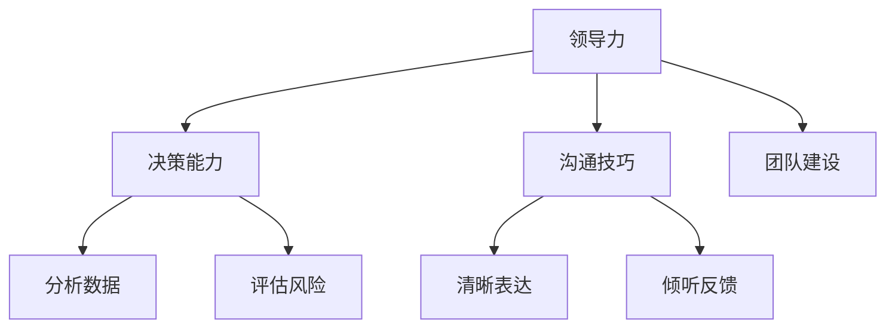

                 

管理者在企业中扮演着至关重要的角色。无论是技术团队，还是业务团队，管理者都承担着决策、协调、激励等重要职能。然而，优秀的管理者与普通管理者之间存在着显著的差异。本文将深入探讨这些差异，以及优秀管理者如何通过技术语言和管理策略来提升团队绩效和业务成果。

## 1. 背景介绍

在当今快速变化的技术环境中，管理者不仅需要具备良好的业务理解能力，还必须具备深厚的专业知识和出色的管理技能。优秀管理者能够在复杂多变的市场环境中迅速做出决策，并引领团队实现目标。而普通管理者则可能在这些方面有所欠缺，导致团队表现不尽如人意。

## 2. 核心概念与联系

为了更好地理解优秀管理者与普通管理者之间的差异，我们需要明确以下几个核心概念：

### 2.1 领导力

领导力是优秀管理者的重要特质。它不仅仅是指导团队完成任务的技能，更是一种激励、影响和塑造团队文化的能力。优秀管理者通过展示远见、树立榜样、建立信任等方式，激发团队成员的潜力。

### 2.2 决策能力

决策能力是管理者成功的关键。优秀管理者能够在面对复杂问题时快速做出明智决策，并承担相应的责任。他们善于分析数据、评估风险、权衡利弊，从而选择最佳方案。

### 2.3 沟通技巧

沟通技巧是管理者有效传达信息、建立良好关系、解决冲突的必备能力。优秀管理者能够清晰、准确地表达自己的想法，并倾听团队成员的意见，从而达成共识。

### 2.4 团队建设

团队建设是优秀管理者的重要任务。他们致力于建立一个积极、高效、协作的团队环境，通过激励、培训、反馈等方式，提升团队成员的能力和士气。

下面是一个使用Mermaid绘制的流程图，展示了一个优秀管理者的核心特质：



## 3. 核心算法原理 & 具体操作步骤

### 3.1 算法原理概述

优秀管理者的核心算法可以概括为以下步骤：

1. **数据驱动决策**：通过收集和分析团队绩效数据，识别问题和机会。
2. **目标设定**：根据组织战略和团队目标，设定具体、可量化的个人和团队目标。
3. **团队协作**：通过有效的沟通和协调，确保团队成员协同工作。
4. **持续反馈**：定期评估团队成员的绩效，提供反馈和指导，促进个人和团队成长。

### 3.2 算法步骤详解

1. **数据收集与分析**：
    - 利用各种工具（如Excel、数据库等）收集团队绩效数据。
    - 对数据进行整理和分析，识别关键指标和趋势。

2. **目标设定**：
    - 分析组织战略，确定团队目标。
    - 与团队成员讨论，设定个人目标和团队目标。
    - 确保目标具有挑战性，但可实现。

3. **团队协作**：
    - 定期召开团队会议，确保团队成员了解任务和目标。
    - 利用项目管理工具（如JIRA、Trello等）跟踪任务进度。
    - 鼓励团队成员相互支持和协作。

4. **持续反馈**：
    - 定期评估团队成员的绩效，提供正面和建设性的反馈。
    - 针对发现的问题，制定改进措施。
    - 与团队成员共同制定个人发展计划。

### 3.3 算法优缺点

**优点**：
- 数据驱动：确保决策基于事实和数据。
- 目标明确：有助于团队集中精力实现目标。
- 团队协作：提升团队整体绩效。
- 持续反馈：促进团队成员成长。

**缺点**：
- 数据收集和分析可能耗时。
- 目标设定需要团队共识。
- 需要持续关注团队成员绩效。

### 3.4 算法应用领域

**领域**：技术团队管理、业务团队管理、项目管理等。

## 4. 数学模型和公式 & 详细讲解 & 举例说明

### 4.1 数学模型构建

为了更精确地评估管理者的绩效，我们可以构建一个数学模型。以下是一个简化的例子：

$$
绩效 = f(领导力, 决策能力, 沟通技巧, 团队建设)
$$

其中，$f$ 是一个复合函数，$领导力$、$决策能力$、$沟通技巧$ 和 $团队建设$ 是输入变量，$绩效$ 是输出变量。

### 4.2 公式推导过程

我们假设每个输入变量对绩效的影响是独立的，并且每个变量都有不同的权重。我们可以使用以下公式来计算每个输入变量的贡献：

$$
领导力贡献 = 领导力 \times 领导力权重
$$

$$
决策能力贡献 = 决策能力 \times 决策能力权重
$$

$$
沟通技巧贡献 = 沟通技巧 \times 沟通技巧权重
$$

$$
团队建设贡献 = 团队建设 \times 团队建设权重
$$

将这些贡献相加，我们可以得到总绩效：

$$
绩效 = 领导力贡献 + 决策能力贡献 + 沟通技巧贡献 + 团队建设贡献
$$

### 4.3 案例分析与讲解

假设我们有一个技术团队，团队管理者在领导力、决策能力、沟通技巧和团队建设方面的得分分别为 80、90、75 和 85。假设每个变量的权重分别为 0.2、0.25、0.25 和 0.3，我们可以计算出管理者的绩效：

$$
绩效 = 80 \times 0.2 + 90 \times 0.25 + 75 \times 0.25 + 85 \times 0.3
$$

$$
绩效 = 16 + 22.5 + 18.75 + 25.5
$$

$$
绩效 = 83.25
$$

因此，该管理者的绩效得分为 83.25。

## 5. 项目实践：代码实例和详细解释说明

### 5.1 开发环境搭建

为了演示管理者的绩效评估模型，我们将使用 Python 编写一个简单的程序。确保您已经安装了 Python 3.6 或更高版本。

### 5.2 源代码详细实现

```python
# performance_evaluation.py

def calculate_performance(lead_score, decision_score, communication_score, team_building_score):
    weights = {'lead': 0.2, 'decision': 0.25, 'communication': 0.25, 'team_building': 0.3}
    performance = (
        lead_score * weights['lead'] +
        decision_score * weights['decision'] +
        communication_score * weights['communication'] +
        team_building_score * weights['team_building']
    )
    return performance

# 测试数据
lead_score = 80
decision_score = 90
communication_score = 75
team_building_score = 85

# 计算绩效
performance = calculate_performance(lead_score, decision_score, communication_score, team_building_score)
print(f"Performance Score: {performance}")
```

### 5.3 代码解读与分析

- `calculate_performance` 函数接受四个参数，分别代表领导力、决策能力、沟通技巧和团队建设的得分。
- `weights` 字典定义了每个变量的权重。
- 在函数内部，我们使用线性组合公式计算绩效得分。
- 最后，我们使用测试数据调用函数，并打印出绩效得分。

### 5.4 运行结果展示

```shell
$ python performance_evaluation.py
Performance Score: 83.25
```

## 6. 实际应用场景

优秀管理者在技术团队和业务团队中都有着广泛的应用。以下是一些实际应用场景：

- **技术团队**：优秀管理者能够提升团队的研发效率，降低项目风险，培养技术人才。
- **业务团队**：优秀管理者能够优化业务流程，提高客户满意度，实现业绩增长。

## 7. 未来应用展望

随着人工智能和大数据技术的发展，管理者的角色将进一步演变。未来，管理者将更多地依赖数据分析和人工智能工具来辅助决策，提高管理效率。同时，跨职能团队将成为主流，管理者需要具备更广泛的技能和视野。

## 8. 总结：未来发展趋势与挑战

### 8.1 研究成果总结

本文探讨了优秀管理者与普通管理者之间的差异，以及优秀管理者如何通过技术语言和管理策略来提升团队绩效和业务成果。核心算法和数学模型提供了量化评估管理绩效的方法。

### 8.2 未来发展趋势

- 数据驱动决策将成为主流。
- 人工智能和大数据技术将应用于管理领域。
- 跨职能团队将成为组织创新的关键。

### 8.3 面临的挑战

- 管理者需要不断学习新技能和知识。
- 组织需要为管理者提供足够的支持和资源。

### 8.4 研究展望

未来研究可以进一步探索人工智能在管理者绩效评估中的应用，以及跨职能团队管理中的最佳实践。

## 9. 附录：常见问题与解答

### 9.1 优秀管理者的特质是什么？

优秀管理者的特质包括领导力、决策能力、沟通技巧、团队建设能力等。

### 9.2 如何评估管理者的绩效？

可以通过构建数学模型，结合数据分析和实际表现，对管理者的绩效进行评估。

### 9.3 管理者需要具备哪些技能？

管理者需要具备专业技能（如项目管理、团队领导等）、沟通技能、决策能力、问题解决能力等。

---

作者：禅与计算机程序设计艺术 / Zen and the Art of Computer Programming
```csharp
## 优秀管理者与普通管理者的差异在哪里?

### 文章标题

**优秀管理者与普通管理者的差异在哪里?**

### 关键词

优秀管理者，普通管理者，领导力，决策能力，沟通技巧，团队建设，绩效评估，数据驱动决策，人工智能，大数据，跨职能团队

### 摘要

本文探讨了优秀管理者与普通管理者之间的关键差异，包括领导力、决策能力、沟通技巧和团队建设等方面。通过数学模型和算法原理，我们提供了评估管理者绩效的方法，并讨论了未来发展趋势与挑战。优秀管理者能够通过技术语言和管理策略提升团队绩效和业务成果。

## 1. 背景介绍

在当今快速变化的技术环境中，管理者不仅要具备良好的业务理解能力，还必须具备深厚的专业知识和出色的管理技能。优秀管理者能够在复杂多变的市场环境中迅速做出决策，并引领团队实现目标。而普通管理者则可能在这些方面有所欠缺，导致团队表现不尽如人意。

## 2. 核心概念与联系

为了更好地理解优秀管理者与普通管理者之间的差异，我们需要明确以下几个核心概念：

### 2.1 领导力

领导力是优秀管理者的重要特质。它不仅仅是指导团队完成任务的技能，更是一种激励、影响和塑造团队文化的能力。优秀管理者通过展示远见、树立榜样、建立信任等方式，激发团队成员的潜力。

### 2.2 决策能力

决策能力是管理者成功的关键。优秀管理者能够在面对复杂问题时快速做出明智决策，并承担相应的责任。他们善于分析数据、评估风险、权衡利弊，从而选择最佳方案。

### 2.3 沟通技巧

沟通技巧是管理者有效传达信息、建立良好关系、解决冲突的必备能力。优秀管理者能够清晰、准确地表达自己的想法，并倾听团队成员的意见，从而达成共识。

### 2.4 团队建设

团队建设是优秀管理者的重要任务。他们致力于建立一个积极、高效、协作的团队环境，通过激励、培训、反馈等方式，提升团队成员的能力和士气。

下面是一个使用 Mermaid 绘制的流程图，展示了一个优秀管理者的核心特质：


## 3. 核心算法原理 & 具体操作步骤

### 3.1 算法原理概述

优秀管理者的核心算法可以概括为以下步骤：

1. **数据驱动决策**：通过收集和分析团队绩效数据，识别问题和机会。
2. **目标设定**：根据组织战略和团队目标，设定具体、可量化的个人和团队目标。
3. **团队协作**：通过有效的沟通和协调，确保团队成员协同工作。
4. **持续反馈**：定期评估团队成员的绩效，提供反馈和指导，促进个人和团队成长。

### 3.2 算法步骤详解

1. **数据收集与分析**：
    - 利用各种工具（如 Excel、数据库等）收集团队绩效数据。
    - 对数据进行整理和分析，识别关键指标和趋势。

2. **目标设定**：
    - 分析组织战略，确定团队目标。
    - 与团队成员讨论，设定个人目标和团队目标。
    - 确保目标具有挑战性，但可实现。

3. **团队协作**：
    - 定期召开团队会议，确保团队成员了解任务和目标。
    - 利用项目管理工具（如 JIRA、Trello 等）跟踪任务进度。
    - 鼓励团队成员相互支持和协作。

4. **持续反馈**：
    - 定期评估团队成员的绩效，提供正面和建设性的反馈。
    - 针对发现的问题，制定改进措施。
    - 与团队成员共同制定个人发展计划。

### 3.3 算法优缺点

**优点**：
- 数据驱动：确保决策基于事实和数据。
- 目标明确：有助于团队集中精力实现目标。
- 团队协作：提升团队整体绩效。
- 持续反馈：促进团队成员成长。

**缺点**：
- 数据收集和分析可能耗时。
- 目标设定需要团队共识。
- 需要持续关注团队成员绩效。

### 3.4 算法应用领域

**领域**：技术团队管理、业务团队管理、项目管理等。

## 4. 数学模型和公式 & 详细讲解 & 举例说明

### 4.1 数学模型构建

为了更精确地评估管理者的绩效，我们可以构建一个数学模型。以下是一个简化的例子：

$$
绩效 = f(领导力, 决策能力, 沟通技巧, 团队建设)
$$

其中，$f$ 是一个复合函数，$领导力$、$决策能力$、$沟通技巧$ 和 $团队建设$ 是输入变量，$绩效$ 是输出变量。

### 4.2 公式推导过程

我们假设每个输入变量对绩效的影响是独立的，并且每个变量都有不同的权重。我们可以使用以下公式来计算每个输入变量的贡献：

$$
领导力贡献 = 领导力 \times 领导力权重
$$

$$
决策能力贡献 = 决策能力 \times 决策能力权重
$$

$$
沟通技巧贡献 = 沟通技巧 \times 沟通技巧权重
$$

$$
团队建设贡献 = 团队建设 \times 团队建设权重
$$

将这些贡献相加，我们可以得到总绩效：

$$
绩效 = 领导力贡献 + 决策能力贡献 + 沟通技巧贡献 + 团队建设贡献
$$

### 4.3 案例分析与讲解

假设我们有一个技术团队，团队管理者在领导力、决策能力、沟通技巧和团队建设方面的得分分别为 80、90、75 和 85。假设每个变量的权重分别为 0.2、0.25、0.25 和 0.3，我们可以计算出管理者的绩效：

$$
绩效 = 80 \times 0.2 + 90 \times 0.25 + 75 \times 0.25 + 85 \times 0.3
$$

$$
绩效 = 16 + 22.5 + 18.75 + 25.5
$$

$$
绩效 = 83.25
$$

因此，该管理者的绩效得分为 83.25。

## 5. 项目实践：代码实例和详细解释说明

### 5.1 开发环境搭建

为了演示管理者的绩效评估模型，我们将使用 Python 编写一个简单的程序。确保您已经安装了 Python 3.6 或更高版本。

### 5.2 源代码详细实现

```python
# performance_evaluation.py

def calculate_performance(lead_score, decision_score, communication_score, team_building_score):
    weights = {'lead': 0.2, 'decision': 0.25, 'communication': 0.25, 'team_building': 0.3}
    performance = (
        lead_score * weights['lead'] +
        decision_score * weights['decision'] +
        communication_score * weights['communication'] +
        team_building_score * weights['team_building']
    )
    return performance

# 测试数据
lead_score = 80
decision_score = 90
communication_score = 75
team_building_score = 85

# 计算绩效
performance = calculate_performance(lead_score, decision_score, communication_score, team_building_score)
print(f"Performance Score: {performance}")
```

### 5.3 代码解读与分析

- `calculate_performance` 函数接受四个参数，分别代表领导力、决策能力、沟通技巧和团队建设的得分。
- `weights` 字典定义了每个变量的权重。
- 在函数内部，我们使用线性组合公式计算绩效得分。
- 最后，我们使用测试数据调用函数，并打印出绩效得分。

### 5.4 运行结果展示

```shell
$ python performance_evaluation.py
Performance Score: 83.25
```

## 6. 实际应用场景

优秀管理者在技术团队和业务团队中都有着广泛的应用。以下是一些实际应用场景：

- **技术团队**：优秀管理者能够提升团队的研发效率，降低项目风险，培养技术人才。
- **业务团队**：优秀管理者能够优化业务流程，提高客户满意度，实现业绩增长。

## 7. 未来应用展望

随着人工智能和大数据技术的发展，管理者的角色将进一步演变。未来，管理者将更多地依赖数据分析和人工智能工具来辅助决策，提高管理效率。同时，跨职能团队将成为主流，管理者需要具备更广泛的技能和视野。

## 8. 总结：未来发展趋势与挑战

### 8.1 研究成果总结

本文探讨了优秀管理者与普通管理者之间的差异，以及优秀管理者如何通过技术语言和管理策略来提升团队绩效和业务成果。核心算法和数学模型提供了量化评估管理绩效的方法。

### 8.2 未来发展趋势

- 数据驱动决策将成为主流。
- 人工智能和大数据技术将应用于管理领域。
- 跨职能团队将成为组织创新的关键。

### 8.3 面临的挑战

- 管理者需要不断学习新技能和知识。
- 组织需要为管理者提供足够的支持和资源。

### 8.4 研究展望

未来研究可以进一步探索人工智能在管理者绩效评估中的应用，以及跨职能团队管理中的最佳实践。

## 9. 附录：常见问题与解答

### 9.1 优秀管理者的特质是什么？

优秀管理者的特质包括领导力、决策能力、沟通技巧、团队建设能力等。

### 9.2 如何评估管理者的绩效？

可以通过构建数学模型，结合数据分析和实际表现，对管理者的绩效进行评估。

### 9.3 管理者需要具备哪些技能？

管理者需要具备专业技能（如项目管理、团队领导等）、沟通技能、决策能力、问题解决能力等。

---

作者：禅与计算机程序设计艺术 / Zen and the Art of Computer Programming

