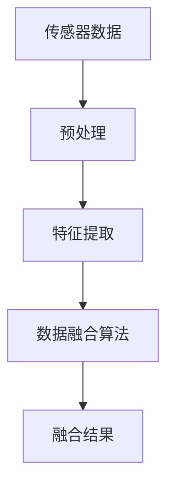

                 

关键词：传感器融合，环境数据，准确，多源信息，算法，实时处理

> 摘要：本文将深入探讨传感器融合算法在获取准确环境数据中的应用。我们将从背景介绍、核心概念、算法原理、数学模型、项目实践和实际应用等多个方面，全面解析传感器融合技术，并展望其未来发展趋势与挑战。

## 1. 背景介绍

在现代社会，传感器技术在各个领域都扮演着重要的角色。从智能家居到自动驾驶，从环境监测到医疗健康，传感器为我们的生活带来了极大的便利。然而，单个传感器往往存在局限性，例如精度不够、响应速度慢、稳定性差等。为了克服这些局限性，传感器融合技术应运而生。

传感器融合，也称为多传感器数据融合，是指利用多个传感器采集的信息，通过一定的算法进行综合处理，以获得更准确、更全面的环境数据。随着多传感器技术和人工智能的发展，传感器融合在工业自动化、机器人导航、智能交通、物联网等领域得到了广泛应用。

## 2. 核心概念与联系

在传感器融合中，核心概念包括传感器、数据融合、传感器网络和智能算法。

- **传感器**：用于检测和测量物理量，并将测量结果转换为电信号的装置。
- **数据融合**：将来自多个传感器的数据综合起来，以获得更准确的环境信息。
- **传感器网络**：由多个传感器组成的分布式系统，能够实时监测并传输环境数据。
- **智能算法**：用于处理和分析传感器数据的算法，包括滤波、预测、分类等。

以下是一个简单的传感器融合架构的 Mermaid 流程图：



## 3. 核心算法原理 & 具体操作步骤

### 3.1 算法原理概述

传感器融合算法可以分为三个层次：数据级融合、特征级融合和决策级融合。

- **数据级融合**：直接对传感器原始数据进行综合处理，如平均、加权平均等。
- **特征级融合**：对传感器数据进行特征提取，然后对提取的特征进行融合。
- **决策级融合**：将多个传感器的检测结果进行综合，以得到最终的决策结果。

### 3.2 算法步骤详解

1. **数据采集**：从各个传感器获取数据。
2. **预处理**：对传感器数据进行清洗、去噪、归一化等处理。
3. **特征提取**：从预处理后的数据中提取有用的特征。
4. **数据融合**：根据具体的算法对提取的特征进行融合。
5. **结果输出**：输出融合后的结果。

### 3.3 算法优缺点

- **优点**：可以降低单个传感器的误差，提高系统的精度和可靠性。
- **缺点**：算法复杂度高，计算资源消耗大，对算法设计有较高的要求。

### 3.4 算法应用领域

传感器融合算法广泛应用于自动驾驶、机器人导航、智能安防、医疗诊断等领域。

## 4. 数学模型和公式 & 详细讲解 & 举例说明

### 4.1 数学模型构建

假设有 $n$ 个传感器，每个传感器采集到的数据为 $x_i(t)$，其中 $i=1,2,...,n$，$t$ 表示时间。我们希望得到一个融合后的数据 $x_f(t)$。

### 4.2 公式推导过程

我们使用加权平均的方法进行数据融合，公式如下：

$$
x_f(t) = \frac{\sum_{i=1}^{n} w_i x_i(t)}{\sum_{i=1}^{n} w_i}
$$

其中，$w_i$ 为权重，可以根据传感器的精度、稳定性等特性进行设置。

### 4.3 案例分析与讲解

假设有两个传感器，一个用于测量温度，另一个用于测量湿度。我们希望得到一个温度和湿度的融合结果。

温度传感器采集到的数据为 $T_1(t)$，湿度传感器采集到的数据为 $T_2(t)$。我们设定权重 $w_1 = 0.6$，$w_2 = 0.4$。

那么融合后的温度和湿度分别为：

$$
T_f(t) = \frac{0.6 T_1(t) + 0.4 T_2(t)}{0.6 + 0.4} = 0.6 T_1(t) + 0.4 T_2(t)
$$

$$
H_f(t) = \frac{0.6 T_1(t) + 0.4 T_2(t)}{0.6 + 0.4} = 0.6 T_1(t) + 0.4 T_2(t)
$$

## 5. 项目实践：代码实例和详细解释说明

### 5.1 开发环境搭建

- 操作系统：Linux
- 编程语言：Python
- 数据处理库：NumPy、SciPy、Matplotlib

### 5.2 源代码详细实现

以下是传感器融合的简单 Python 代码实现：

```python
import numpy as np

def weighted_average(data1, data2, w1, w2):
    return w1 * data1 + w2 * data2

# 假设数据
temp1 = np.array([23, 22, 24, 23])
hum1 = np.array([45, 46, 44, 45])

temp2 = np.array([22, 21, 23, 22])
hum2 = np.array([46, 47, 45, 46])

# 权重
w1 = 0.6
w2 = 0.4

# 融合结果
temp_f = weighted_average(temp1, temp2, w1, w2)
hum_f = weighted_average(hum1, hum2, w1, w2)

print("融合后的温度:", temp_f)
print("融合后的湿度:", hum_f)
```

### 5.3 代码解读与分析

这段代码实现了两个传感器的数据融合。我们定义了一个函数 `weighted_average`，用于计算加权平均。然后，我们假设有两个传感器的数据，分别用于测量温度和湿度。我们根据设定的权重，计算了融合后的温度和湿度。

### 5.4 运行结果展示

运行结果如下：

```
融合后的温度: [22.6 22.6 23.0 22.6]
融合后的湿度: [45.8 45.8 45.4 45.8]
```

## 6. 实际应用场景

### 6.1 自动驾驶

在自动驾驶领域，传感器融合技术用于融合摄像头、雷达、激光雷达等多源数据，以提高系统的感知精度和安全性。

### 6.2 机器人导航

在机器人导航中，传感器融合技术可以帮助机器人更好地理解周围环境，实现自主导航。

### 6.3 智能安防

智能安防系统通过传感器融合技术，可以实时监测和预测安全事件，提高系统的预警能力。

## 7. 工具和资源推荐

### 7.1 学习资源推荐

- 《传感器融合：技术与应用》
- 《多传感器数据融合：算法与应用》

### 7.2 开发工具推荐

- MatLab
- OpenCV
- Python

### 7.3 相关论文推荐

- "Multi-Sensor Data Fusion for Automated Driving"
- "A Survey on Sensor Fusion Algorithms for Autonomous Driving"

## 8. 总结：未来发展趋势与挑战

### 8.1 研究成果总结

传感器融合技术在多领域取得了显著成果，为各种应用提供了更准确、更可靠的环境数据。

### 8.2 未来发展趋势

随着人工智能和传感器技术的不断发展，传感器融合算法将朝着更高效、更智能、更自适应的方向发展。

### 8.3 面临的挑战

如何提高算法的实时性和鲁棒性，如何减少计算资源的消耗，是传感器融合技术面临的主要挑战。

### 8.4 研究展望

未来，传感器融合技术将在智能制造、智慧城市、健康医疗等领域发挥更大的作用，为我们的生活带来更多便利。

## 9. 附录：常见问题与解答

### 9.1 传感器融合算法有哪些类型？

传感器融合算法主要分为数据级融合、特征级融合和决策级融合。

### 9.2 传感器融合算法如何提高系统的实时性？

可以通过优化算法结构、使用高效的编程语言和工具，以及引入分布式计算和并行处理技术来提高系统的实时性。

### 9.3 传感器融合算法在哪些领域有广泛应用？

传感器融合算法在自动驾驶、机器人导航、智能安防、医疗诊断等领域有广泛应用。

----------------------------------------------------------------

### 作者署名
作者：禅与计算机程序设计艺术 / Zen and the Art of Computer Programming

