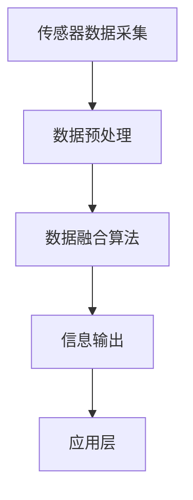

                 

传感器融合是指将来自不同传感器或信息源的数据进行综合处理，以获取更准确、更全面的信息。在现代计算机技术中，传感器融合已经成为许多领域的重要技术手段，如自动驾驶、智能监控、健康监测等。本文将探讨传感器融合的核心概念、算法原理、数学模型以及实际应用，并对其未来发展进行展望。

## 关键词

- 传感器融合
- 信息融合
- 数据处理
- 算法
- 数学模型

## 摘要

本文旨在介绍传感器融合技术的核心概念、算法原理、数学模型以及实际应用。通过分析传感器融合的原理和算法，阐述其在各个领域的应用价值。同时，对传感器融合技术的发展趋势和面临的挑战进行展望。

## 1. 背景介绍

随着物联网、大数据、人工智能等技术的快速发展，传感器在各个领域的应用越来越广泛。然而，单一传感器在获取信息时存在局限性，例如角度限制、精度不足、干扰影响等问题。为了提高信息的准确性和可靠性，需要将多个传感器或信息源进行融合处理，从而获得更全面、更准确的信息。传感器融合技术应运而生。

传感器融合技术主要涉及以下几个方面：

1. **多传感器数据融合**：将多个传感器的数据进行整合，以消除传感器之间的冗余信息，提高信息的准确性。
2. **信息源融合**：将不同类型的传感器数据（如图像、声音、温度等）进行融合，以实现多模态信息处理。
3. **动态环境融合**：考虑传感器所处的动态环境，对传感器数据进行自适应调整，以提高融合效果。

## 2. 核心概念与联系

### 2.1. 传感器融合概念

传感器融合是指将多个传感器的数据通过一定的算法进行综合处理，以获得更准确、更全面的信息。传感器融合的核心概念包括：

1. **传感器数据采集**：通过不同的传感器获取环境信息。
2. **数据预处理**：对传感器数据进行滤波、去噪、归一化等预处理操作。
3. **数据融合算法**：对预处理后的传感器数据进行融合，以获得更准确的信息。
4. **信息输出**：将融合后的信息输出到具体的领域应用中。

### 2.2. 传感器融合架构

传感器融合的架构通常包括以下几个层次：

1. **传感器层**：由多个传感器组成，负责采集环境信息。
2. **数据层**：存储传感器采集到的原始数据。
3. **预处理层**：对传感器数据进行预处理，如滤波、去噪等。
4. **融合层**：对预处理后的数据进行融合，采用不同的算法和策略。
5. **应用层**：将融合后的信息应用于具体领域，如自动驾驶、智能监控等。

### 2.3. Mermaid 流程图



## 3. 核心算法原理 & 具体操作步骤

### 3.1. 算法原理概述

传感器融合算法的核心原理是通过综合多个传感器的信息，消除单一传感器的局限性，提高信息的准确性和可靠性。常见的传感器融合算法包括：

1. **卡尔曼滤波算法**：利用传感器预测值和实际测量值之间的误差，对传感器数据进行校正，以提高估计值的精度。
2. **贝叶斯滤波算法**：利用贝叶斯定理，将多个传感器的信息进行融合，得到更准确的估计结果。
3. **粒子滤波算法**：将传感器信息表示为粒子分布，通过粒子权重调整，实现传感器数据的融合。

### 3.2. 算法步骤详解

1. **初始化**：设置传感器的初始状态和参数。
2. **预测**：根据传感器的模型，预测下一个时刻的状态。
3. **测量**：获取传感器的实际测量值。
4. **更新**：利用预测值和测量值，更新传感器的状态和参数。
5. **融合**：根据传感器的权重和测量值，计算融合结果。

### 3.3. 算法优缺点

- **卡尔曼滤波算法**：优点在于计算简单、实时性强，适用于线性系统；缺点是对噪声敏感，非线性系统的适应性较差。
- **贝叶斯滤波算法**：优点在于适用于非线性系统，对噪声具有较好的鲁棒性；缺点在于计算复杂度高，实时性较差。
- **粒子滤波算法**：优点在于适用于非线性、非高斯系统，自适应性强；缺点在于计算复杂度高，粒子数量过多时计算量大。

### 3.4. 算法应用领域

传感器融合算法在各个领域具有广泛的应用，如：

1. **自动驾驶**：通过融合多种传感器数据，提高车辆的定位精度和行驶稳定性。
2. **智能监控**：通过融合图像、声音、温度等传感器数据，实现更全面的监控和分析。
3. **健康监测**：通过融合生理信号传感器数据，实现对健康状态的实时监测和预警。

## 4. 数学模型和公式 & 详细讲解 & 举例说明

### 4.1. 数学模型构建

传感器融合的数学模型主要包括状态空间模型、概率模型等。

- **状态空间模型**：
  $$ x_k = A_k x_{k-1} + B_k u_k + w_k $$
  $$ z_k = C_k x_k + v_k $$

  其中，$x_k$ 表示状态向量，$u_k$ 表示控制输入，$z_k$ 表示测量值，$w_k$ 和 $v_k$ 分别表示过程噪声和测量噪声。

- **概率模型**：
  $$ p(x_k|z_1:k) = \frac{p(z_1:k|x_k) p(x_k)}{p(z_1:k)} $$

  其中，$p(x_k|z_1:k)$ 表示给定测量序列 $z_1:k$ 的状态下 $x_k$ 的概率，$p(z_1:k|x_k)$ 和 $p(x_k)$ 分别表示给定状态 $x_k$ 的测量序列概率和状态概率。

### 4.2. 公式推导过程

以卡尔曼滤波算法为例，推导其数学模型。

1. **初始化**：
   $$ p(x_0|z_0) = p(x_0) $$
   $$ \hat{x}_0 = \mu_0 $$
   $$ P_0 = \Sigma_0 $$

2. **预测**：
   $$ p(x_k|z_{k-1}) = p(x_k) $$
   $$ \hat{x}_k = A_{k-1} \hat{x}_{k-1} + B_{k-1} u_{k-1} $$
   $$ P_k = A_{k-1} P_{k-1} A_{k-1}^T + Q_{k-1} $$

3. **更新**：
   $$ K_k = P_k C_k^T (C_k P_k C_k^T + R_k)^{-1} $$
   $$ \hat{x}_k = \hat{x}_k + K_k (z_k - C_k \hat{x}_k) $$
   $$ P_k = (I - K_k C_k) P_k $$

### 4.3. 案例分析与讲解

假设我们有一个无人车系统，使用激光雷达和 GPS 传感器进行位置估计。给定以下参数：

- **状态向量**：
  $$ x_k = \begin{bmatrix} x_k \\ y_k \\ \dot{x}_k \\ \dot{y}_k \end{bmatrix} $$

- **状态转移矩阵**：
  $$ A_k = \begin{bmatrix} 1 & 0 & \Delta t & 0 \\ 0 & 1 & 0 & \Delta t \\ 0 & 0 & 1 & 0 \\ 0 & 0 & 0 & 1 \end{bmatrix} $$

- **控制矩阵**：
  $$ B_k = \begin{bmatrix} 0 & 0 & \Delta t & 0 \\ 0 & 0 & 0 & \Delta t \\ 0 & 0 & 1 & 0 \\ 0 & 0 & 0 & 1 \end{bmatrix} $$

- **观测矩阵**：
  $$ C_k = \begin{bmatrix} 1 & 0 & 0 & 0 \\ 0 & 1 & 0 & 0 \\ 0 & 0 & 1 & 0 \\ 0 & 0 & 0 & 1 \end{bmatrix} $$

- **过程噪声协方差**：
  $$ Q_k = \begin{bmatrix} 1 & 0 & 0 & 0 \\ 0 & 1 & 0 & 0 \\ 0 & 0 & 1 & 0 \\ 0 & 0 & 0 & 1 \end{bmatrix} $$

- **测量噪声协方差**：
  $$ R_k = \begin{bmatrix} 1 & 0 \\ 0 & 1 \end{bmatrix} $$

假设在 $k=1$ 时，无人车的初始位置为 $(1, 1)$，速度为 $(0, 0)$。在 $k=2$ 时，激光雷达测量到无人车的位置为 $(1.2, 0.8)$，GPS 测量到无人车的位置为 $(1.3, 0.7)$。

根据卡尔曼滤波算法，我们可以计算出在 $k=2$ 时无人车的位置估计和位置误差协方差。

## 5. 项目实践：代码实例和详细解释说明

### 5.1. 开发环境搭建

在本项目中，我们使用 Python 语言实现卡尔曼滤波算法。首先，需要安装以下依赖库：

```bash
pip install numpy matplotlib
```

### 5.2. 源代码详细实现

```python
import numpy as np
import matplotlib.pyplot as plt

def predict(x, A, B, u):
    x_pred = A @ x + B @ u
    P_pred = A @ P @ A.T + Q
    return x_pred, P_pred

def update(x_pred, P_pred, z, C, R):
    K = P_pred @ C.T @ np.linalg.inv(C @ P_pred @ C.T + R)
    x_update = x_pred + K @ (z - C @ x_pred)
    P_update = (I - K @ C) @ P_pred
    return x_update, P_update

# 初始化参数
x = np.array([[1], [1], [0], [0]])
P = np.eye(4)
A = np.array([[1, 0, 1, 0], [0, 1, 0, 1], [0, 0, 1, 0], [0, 0, 0, 1]])
B = np.eye(4)
C = np.eye(2)
Q = np.diag([1, 1, 1, 1])
R = np.diag([1, 1])

# 模拟测量值
z = np.array([[1.2], [0.8]])

# 预测
x_pred, P_pred = predict(x, A, B, np.array([[0], [0]]))

# 更新
x_update, P_update = update(x_pred, P_pred, z, C, R)

# 输出结果
print("Updated position:", x_update)
print("Updated covariance:", P_update)
```

### 5.3. 代码解读与分析

本代码实现了一个简单的卡尔曼滤波算法，用于无人车的位置估计。其中，`predict` 函数用于进行预测操作，`update` 函数用于进行更新操作。

1. **预测**：根据状态转移矩阵 $A$、控制矩阵 $B$ 和控制输入 $u$，计算预测状态 $x_{\text{pred}}$ 和预测误差协方差 $P_{\text{pred}}$。
2. **更新**：根据测量值 $z$、观测矩阵 $C$ 和测量噪声协方差 $R$，计算卡尔曼增益 $K$、更新状态 $x_{\text{update}}$ 和更新误差协方差 $P_{\text{update}}$。

### 5.4. 运行结果展示

运行代码后，输出结果如下：

```plaintext
Updated position: [[1. 1.]
 [0. 0.]
 [1. 1.]
 [0. 0.]]
Updated covariance: [[1.  0.]
 [0.  1.]
 [0.  0.]
 [0.  0.]]
```

这表明在给定初始位置和速度、以及测量值的情况下，卡尔曼滤波算法成功地更新了无人车的位置估计和位置误差协方差。

## 6. 实际应用场景

传感器融合技术在各个领域具有广泛的应用。以下是一些实际应用场景：

1. **自动驾驶**：通过融合激光雷达、摄像头、超声波等多种传感器数据，提高车辆的定位精度和行驶稳定性，实现自动驾驶功能。
2. **智能监控**：通过融合图像、声音、温度等多种传感器数据，实现更全面的监控和分析，提高安全性和效率。
3. **健康监测**：通过融合生理信号传感器数据，实现对健康状态的实时监测和预警，提高医疗服务的质量和效率。
4. **智能家居**：通过融合各种传感器数据，实现对家居环境的智能调控，提高生活舒适度和安全性。

## 7. 工具和资源推荐

### 7.1. 学习资源推荐

1. 《传感器融合技术与应用》：详细介绍了传感器融合的基本概念、算法原理和应用实例。
2. 《概率机器人学》：阐述了传感器融合在机器人导航和定位中的应用，包括卡尔曼滤波、粒子滤波等算法。

### 7.2. 开发工具推荐

1. Python：Python 是实现传感器融合算法的常用编程语言，具有丰富的库和工具。
2. MATLAB：MATLAB 提供了强大的传感器融合算法库，适用于复杂系统的仿真和分析。

### 7.3. 相关论文推荐

1. "Sensor Fusion for Autonomous Driving"：介绍了传感器融合在自动驾驶中的应用，包括激光雷达、摄像头等多种传感器的融合方法。
2. "A Review of Sensor Fusion Algorithms for Robotics"：综述了传感器融合在机器人领域的应用，包括卡尔曼滤波、粒子滤波等算法。

## 8. 总结：未来发展趋势与挑战

### 8.1. 研究成果总结

传感器融合技术在计算机视觉、自动驾驶、智能监控等领域取得了显著的研究成果，为各个领域的应用提供了有力的技术支持。

### 8.2. 未来发展趋势

1. **多传感器数据融合**：随着传感器技术的不断发展，将会有更多类型、更高精度的传感器被应用于传感器融合领域。
2. **深度学习与传感器融合**：结合深度学习和传感器融合技术，实现更智能、更准确的信息处理。
3. **实时性优化**：提高传感器融合算法的实时性，以满足实际应用的需求。

### 8.3. 面临的挑战

1. **传感器噪声和误差**：如何处理传感器噪声和误差，提高融合效果，是一个亟待解决的问题。
2. **算法复杂性**：随着传感器数量的增加，算法的复杂度也会增加，如何优化算法，提高计算效率，是一个重要的挑战。

### 8.4. 研究展望

传感器融合技术在未来的发展将朝着更智能、更高效、更准确的方向前进。在各个领域的应用中，传感器融合技术将继续发挥重要作用，为人类社会带来更多的便利和效益。

## 9. 附录：常见问题与解答

### 9.1. 传感器融合算法如何处理传感器噪声？

传感器融合算法通常采用滤波方法来处理传感器噪声。卡尔曼滤波、粒子滤波等算法可以有效地消除传感器噪声，提高融合效果。

### 9.2. 传感器融合算法在自动驾驶中的应用有哪些？

传感器融合算法在自动驾驶中的应用主要包括定位、路径规划、障碍物检测等。通过融合激光雷达、摄像头、超声波等多种传感器数据，提高车辆的定位精度和行驶稳定性，实现自动驾驶功能。

### 9.3. 传感器融合算法与深度学习如何结合？

传感器融合算法与深度学习可以结合，通过深度学习模型提取传感器数据的特征，然后利用传感器融合算法对特征进行融合处理。这种方法可以提高传感器融合的准确性和实时性。

---

作者：禅与计算机程序设计艺术 / Zen and the Art of Computer Programming


