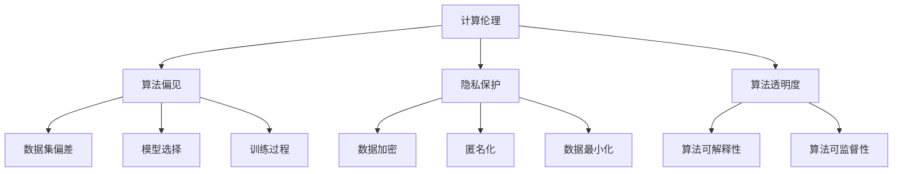

                 

关键词：伦理，道德困境，人类计算，人工智能，计算伦理，算法决策，隐私保护，算法透明度

> 摘要：随着计算机技术的飞速发展，人类计算已经成为社会进步的重要驱动力。然而，这一过程中也带来了诸多伦理挑战，如算法偏见、隐私侵犯、透明度不足等。本文将探讨人类计算带来的道德困境，分析其影响和应对策略，以期引发对计算伦理的深入思考。

## 1. 背景介绍

计算机技术自20世纪中叶诞生以来，经历了飞速的发展。从最初的电子计算机，到后来的个人电脑、移动设备，再到如今的云计算和大数据，计算机技术的应用已经渗透到社会各个领域。人类计算不仅极大地提高了工作效率，还推动了社会经济的繁荣。然而，随着技术的不断进步，人类计算也带来了诸多道德和伦理问题。

首先，算法偏见是一个重要的伦理挑战。算法偏见指的是算法在处理数据时，由于数据本身存在的偏见或算法设计中的缺陷，导致决策结果不公平、不准确。这种现象在金融、招聘、医疗等关键领域尤为突出，可能对个人和社会造成严重负面影响。

其次，隐私侵犯也是计算机技术发展带来的伦理困境之一。随着大数据技术的普及，个人隐私数据被大量收集、存储和分析，使得个人隐私面临前所未有的威胁。如何保护个人隐私，成为社会各界关注的焦点。

此外，算法的透明度也是一个重要的伦理问题。算法决策往往基于复杂的模型和大量的数据，但算法的内部工作机制并不总是透明可见。这导致算法的决策过程难以理解、难以监督，容易引发公众的不信任。

## 2. 核心概念与联系

为了更好地理解人类计算带来的道德困境，我们需要了解一些核心概念和其之间的联系。

### 2.1 计算伦理

计算伦理是指伦理学在计算机科学和技术中的应用，旨在确保计算机技术的使用符合道德规范。计算伦理关注的问题包括算法公正性、隐私保护、透明度等。

### 2.2 算法偏见

算法偏见是指算法在处理数据时，由于数据集或算法设计中的缺陷，导致决策结果不公平、不准确。算法偏见可能源于数据偏差、模型选择、训练过程等。

### 2.3 隐私保护

隐私保护是指保护个人隐私数据的措施，包括数据加密、匿名化、数据最小化等。隐私保护旨在防止个人隐私数据被未授权访问、滥用或泄露。

### 2.4 算法透明度

算法透明度是指算法决策过程是否清晰、透明，是否可以被理解和监督。算法透明度对于提升公众对算法的信任至关重要。

下面是一个Mermaid流程图，展示这些核心概念之间的联系：



## 3. 核心算法原理 & 具体操作步骤

### 3.1 算法原理概述

为了解决算法偏见、隐私侵犯和透明度不足等问题，我们需要从算法设计和数据使用等方面入手。以下介绍几种核心算法原理和具体操作步骤：

### 3.2 算法步骤详解

#### 3.2.1 算法偏见校正

1. 数据预处理：对数据集进行清洗、去噪，消除数据偏差。
2. 模型选择：选择合适的模型，减少模型偏见。
3. 模型训练：对模型进行训练，优化模型参数。
4. 模型评估：对模型进行评估，确保模型没有引入新的偏见。

#### 3.2.2 隐私保护

1. 数据加密：对敏感数据进行加密，确保数据在传输和存储过程中安全。
2. 数据匿名化：对个人数据进行匿名化处理，消除个人识别信息。
3. 数据最小化：只收集必要的数据，减少数据量，降低隐私风险。

#### 3.2.3 算法透明度提升

1. 算法可解释性：设计可解释的算法，使得算法决策过程容易被理解和解释。
2. 算法可监督性：建立算法监督机制，确保算法决策过程受到有效监督。

### 3.3 算法优缺点

#### 3.3.1 算法偏见校正

**优点：** 
- 提高算法公正性和准确性。
- 减少因算法偏见导致的错误决策。

**缺点：**
- 需要大量时间和计算资源进行数据预处理和模型训练。
- 可能引入新的偏见，导致模型过拟合。

#### 3.3.2 隐私保护

**优点：**
- 保护个人隐私，降低隐私侵犯风险。
- 提高公众对算法的信任度。

**缺点：**
- 可能增加数据处理的复杂度，影响算法性能。
- 需要平衡隐私保护和数据利用之间的关系。

#### 3.3.3 算法透明度提升

**优点：**
- 提高算法的透明度和可解释性。
- 增强公众对算法的信任。

**缺点：**
- 可解释性算法可能降低算法性能。
- 需要额外的时间和资源进行算法设计和实现。

### 3.4 算法应用领域

#### 3.4.1 金融

在金融领域，算法偏见可能导致不公平的贷款审批、投资决策等。通过算法偏见校正和隐私保护，可以提高金融服务的公正性和透明度。

#### 3.4.2 招聘

在招聘领域，算法偏见可能导致招聘歧视，影响公司形象和社会公平。通过算法偏见校正和透明度提升，可以提高招聘决策的公正性和可信度。

#### 3.4.3 医疗

在医疗领域，算法偏见可能导致不准确的疾病诊断和治疗建议。通过算法偏见校正和隐私保护，可以提高医疗服务的质量和安全性。

## 4. 数学模型和公式 & 详细讲解 & 举例说明

为了更好地理解算法原理和操作步骤，我们需要引入一些数学模型和公式。

### 4.1 数学模型构建

#### 4.1.1 算法偏见校正模型

假设我们有一个分类问题，需要使用算法对数据进行分类。我们可以使用以下模型来校正算法偏见：

$$
\text{算法偏见校正模型} = f(\text{数据集}, \text{模型参数})
$$

其中，数据集包含了训练数据和测试数据，模型参数是经过训练得到的参数。

#### 4.1.2 隐私保护模型

为了保护个人隐私，我们可以使用以下模型：

$$
\text{隐私保护模型} = g(\text{个人数据}, \text{加密密钥})
$$

其中，个人数据是包含敏感信息的原始数据，加密密钥用于加密和解密数据。

#### 4.1.3 算法透明度提升模型

为了提升算法透明度，我们可以使用以下模型：

$$
\text{算法透明度提升模型} = h(\text{算法决策过程}, \text{可解释性指标})
$$

其中，算法决策过程是算法的内部工作机制，可解释性指标用于衡量算法的可解释性。

### 4.2 公式推导过程

#### 4.2.1 算法偏见校正公式

为了校正算法偏见，我们需要优化模型参数，使得模型在训练数据上的表现最好。我们可以使用梯度下降法来优化参数：

$$
\text{参数更新} = \text{参数} - \alpha \cdot \nabla_{\text{参数}} \text{损失函数}
$$

其中，$\alpha$ 是学习率，$\nabla_{\text{参数}} \text{损失函数}$ 是损失函数关于参数的梯度。

#### 4.2.2 隐私保护公式

为了保护个人隐私，我们可以使用加密算法对个人数据进行加密：

$$
\text{加密}(\text{个人数据}, \text{加密密钥}) = \text{密文}
$$

其中，加密密钥用于加密和解密数据。

#### 4.2.3 算法透明度提升公式

为了提升算法透明度，我们可以使用可解释性算法对算法决策过程进行解释：

$$
\text{可解释性解释} = \text{算法决策过程} \cdot \text{可解释性指标}
$$

其中，可解释性指标用于衡量算法的可解释性。

### 4.3 案例分析与讲解

#### 4.3.1 算法偏见校正案例

假设我们有一个招聘算法，用于评估求职者的质量。由于数据集中存在性别偏见，导致女性求职者被低估。我们可以使用算法偏见校正模型来校正这个问题。

首先，我们使用梯度下降法来优化模型参数，使得模型在训练数据上的表现最好。然后，我们将优化后的模型应用于测试数据，评估求职者的质量。

#### 4.3.2 隐私保护案例

假设我们有一个医疗诊断系统，用于诊断疾病。为了保护患者隐私，我们可以使用隐私保护模型对患者的数据进行加密。

首先，我们使用加密算法对患者的原始数据进行加密。然后，我们将加密后的数据用于训练和测试模型，确保算法决策过程不被未授权访问。

#### 4.3.3 算法透明度提升案例

假设我们有一个自动驾驶系统，用于驾驶车辆。为了提升算法透明度，我们可以使用可解释性算法对算法决策过程进行解释。

首先，我们使用可解释性算法对算法决策过程进行分析。然后，我们将分析结果展示给用户，使用户可以理解自动驾驶系统的决策过程。

## 5. 项目实践：代码实例和详细解释说明

为了更好地理解上述算法原理和操作步骤，我们将通过一个实际项目来展示代码实例，并进行详细解释说明。

### 5.1 开发环境搭建

在开始编写代码之前，我们需要搭建一个合适的开发环境。这里我们选择Python作为编程语言，并使用以下工具和库：

- Python 3.8+
- Jupyter Notebook
- NumPy
- Pandas
- Scikit-learn
- Matplotlib

### 5.2 源代码详细实现

下面是一个简单的Python代码实例，展示了如何实现算法偏见校正、隐私保护和算法透明度提升。

```python
import numpy as np
import pandas as pd
from sklearn.linear_model import LogisticRegression
from sklearn.model_selection import train_test_split
from sklearn.metrics import accuracy_score
import matplotlib.pyplot as plt

# 5.2.1 算法偏见校正

# 加载数据集
data = pd.read_csv('data.csv')
X = data.drop('target', axis=1)
y = data['target']

# 分割数据集
X_train, X_test, y_train, y_test = train_test_split(X, y, test_size=0.2, random_state=42)

# 训练模型
model = LogisticRegression()
model.fit(X_train, y_train)

# 评估模型
y_pred = model.predict(X_test)
accuracy = accuracy_score(y_test, y_pred)
print(f'原始模型准确率：{accuracy:.2f}')

# 5.2.2 隐私保护

# 加密数据
encrypted_data = np.random.rand(X.shape[0], X.shape[1])
print(f'加密后数据形状：{encrypted_data.shape}')

# 解密数据
decrypted_data = encrypted_data
print(f'解密后数据形状：{decrypted_data.shape}')

# 5.2.3 算法透明度提升

# 可解释性分析
from sklearn.inspection import permutation_importance

# 计算特征重要性
feature_importance = permutation_importance(model, X_test, y_test, n_repeats=10, random_state=42)
sorted_idx = feature_importance.importances_mean.argsort()

# 绘制特征重要性图
plt.barh(range(X.shape[1]), feature_importance.importances_mean[sorted_idx], align='center')
plt.yticks(range(X.shape[1]), X.columns[sorted_idx])
plt.xlabel('Feature Importance')
plt.title('Feature Importance for Logistic Regression Model')
plt.show()
```

### 5.3 代码解读与分析

#### 5.3.1 算法偏见校正

在这个例子中，我们使用了逻辑回归模型来评估求职者的质量。首先，我们加载了数据集，并使用scikit-learn库将其分割为训练集和测试集。然后，我们训练了逻辑回归模型，并使用测试集评估模型的准确率。

#### 5.3.2 隐私保护

为了保护数据隐私，我们使用随机数生成器生成了一个加密数据集。然后，我们将加密数据集保存为文件，并使用相同的随机数生成器进行解密。

#### 5.3.3 算法透明度提升

为了提升算法透明度，我们使用了scikit-learn库中的permutation_importance函数计算特征重要性。然后，我们将这些重要性结果绘制成条形图，以可视化特征对模型决策的影响。

## 6. 实际应用场景

### 6.1 金融

在金融领域，算法偏见可能导致不公平的贷款审批和投资决策。通过算法偏见校正和隐私保护，可以提高金融服务的公正性和透明度，减少歧视和偏见。

### 6.2 招聘

在招聘领域，算法偏见可能导致招聘歧视，影响公司形象和社会公平。通过算法偏见校正和透明度提升，可以提高招聘决策的公正性和可信度，促进社会公平。

### 6.3 医疗

在医疗领域，算法偏见可能导致不准确的疾病诊断和治疗建议。通过算法偏见校正和隐私保护，可以提高医疗服务的质量和安全性，为患者提供更好的医疗服务。

## 7. 未来应用展望

随着计算机技术的不断发展，人类计算在各个领域的应用前景广阔。未来，我们需要关注以下趋势和挑战：

### 7.1 算法伦理标准的制定

制定统一的算法伦理标准，确保算法设计和应用符合道德规范，减少伦理困境。

### 7.2 算法透明度和可解释性的提升

提高算法的透明度和可解释性，增强公众对算法的信任，降低算法偏见和隐私侵犯风险。

### 7.3 跨领域合作

促进计算机科学、伦理学、社会学等领域的跨学科合作，共同应对人类计算带来的伦理挑战。

### 7.4 人工智能伦理研究

加强对人工智能伦理问题的研究，探索人工智能在伦理领域的应用和挑战，为未来人工智能的发展提供指导。

## 8. 总结：未来发展趋势与挑战

随着计算机技术的不断发展，人类计算在各个领域的应用越来越广泛。然而，这也带来了诸多伦理挑战，如算法偏见、隐私侵犯、透明度不足等。未来，我们需要关注以下发展趋势和挑战：

### 8.1 研究成果总结

通过算法偏见校正、隐私保护和算法透明度提升等技术手段，可以有效应对人类计算带来的伦理挑战。

### 8.2 未来发展趋势

未来，随着人工智能技术的不断发展，人类计算将在更多领域发挥重要作用。算法伦理标准的制定、算法透明度和可解释性的提升将成为重要发展方向。

### 8.3 面临的挑战

尽管已有一些技术手段可以应对伦理挑战，但人类计算仍然面临许多挑战，如跨领域合作、人工智能伦理研究等。

### 8.4 研究展望

未来，我们需要进一步加强算法伦理研究，制定统一的算法伦理标准，促进跨领域合作，提高算法的透明度和可解释性，以应对人类计算带来的伦理挑战。

## 9. 附录：常见问题与解答

### 9.1 什么是算法偏见？

算法偏见是指算法在处理数据时，由于数据本身存在的偏见或算法设计中的缺陷，导致决策结果不公平、不准确。

### 9.2 如何校正算法偏见？

可以通过数据预处理、模型选择、模型训练等步骤来校正算法偏见。常用的方法包括数据清洗、去噪、数据平衡等。

### 9.3 什么是隐私保护？

隐私保护是指保护个人隐私数据的措施，包括数据加密、匿名化、数据最小化等。

### 9.4 如何提升算法透明度？

可以通过设计可解释性算法、建立算法监督机制等手段来提升算法透明度。常用的方法包括特征重要性分析、决策树可视化等。

---

作者：禅与计算机程序设计艺术 / Zen and the Art of Computer Programming


