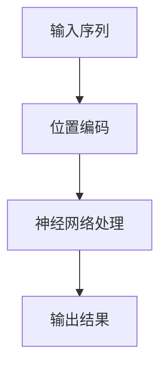

                 

关键词：位置编码，序列信息，神经网络，信息保持，数据处理

> 摘要：本文将深入探讨位置编码在保持序列信息方面的作用，分析其在神经网络中的实现和应用，探讨其在未来数据处理中的潜在发展趋势与挑战。

## 1. 背景介绍

在计算机科学和人工智能领域，序列信息处理一直是一个重要的研究方向。序列数据在自然语言处理（NLP）、语音识别、视频分析等应用中具有广泛的应用价值。然而，传统的方法在处理序列数据时，往往难以有效地保持数据中的位置信息，这导致了在模型训练和预测中的一些问题。为了解决这一问题，位置编码（Positional Encoding）技术应运而生。

位置编码是一种将序列数据中每个元素的位置信息编码为向量形式的方法，通过这种方式，模型可以学习到序列中的位置信息，从而提高模型的性能和准确性。位置编码在神经网络中有着广泛的应用，特别是在深度学习领域中，其对于序列数据的处理起到了关键作用。

本文将详细介绍位置编码的概念、原理、实现和应用，分析其在神经网络中的重要性，并探讨其在未来数据处理中的发展趋势和面临的挑战。

## 2. 核心概念与联系

### 2.1 位置编码的基本概念

位置编码是一种将序列数据中每个元素的位置信息编码为向量形式的技术。在序列数据中，每个元素的位置信息通常用其出现的位置（如时间戳或索引）表示。位置编码的目标是将这种位置信息转化为可以在神经网络中处理的向量形式，从而使得模型可以学习到序列中的位置信息。

### 2.2 位置编码与序列信息的关系

位置编码在保持序列信息方面具有重要作用。通过将位置信息编码为向量形式，模型可以学习到序列中不同元素之间的相对位置关系，从而更好地理解序列的含义。例如，在自然语言处理中，位置编码可以帮助模型识别出句子中的主语、谓语、宾语等语法结构，提高模型的语法分析能力。

### 2.3 位置编码与神经网络的联系

位置编码在神经网络中有着广泛的应用。特别是在深度学习模型中，位置编码技术可以帮助模型更好地处理序列数据，提高模型的性能和准确性。例如，在自然语言处理领域，位置编码被广泛应用于词向量模型、循环神经网络（RNN）、长短时记忆网络（LSTM）等模型中，以提高模型对序列数据的理解和处理能力。

### 2.4 位置编码的 Mermaid 流程图

以下是一个简单的 Mermaid 流程图，展示了位置编码的基本流程：



在上述流程中，输入序列经过位置编码处理后，被输入到神经网络中进行处理，最终得到输出结果。

## 3. 核心算法原理 & 具体操作步骤

### 3.1 算法原理概述

位置编码算法的核心思想是将序列数据中每个元素的位置信息编码为向量形式，从而使得模型可以学习到序列中的位置信息。位置编码算法通常包括以下步骤：

1. 将序列数据中每个元素的位置信息表示为数字。
2. 设计一个编码函数，将位置信息转换为向量形式。
3. 将转换后的向量作为输入，输入到神经网络中进行处理。

### 3.2 算法步骤详解

1. **位置信息表示**

首先，需要将序列数据中每个元素的位置信息表示为数字。通常，可以使用以下方法：

- **基于索引的方法**：直接使用元素在序列中的索引作为位置信息。
- **基于时间戳的方法**：使用元素出现的时间戳作为位置信息。

2. **编码函数设计**

接下来，需要设计一个编码函数，将位置信息转换为向量形式。常用的编码函数包括：

- **正弦和余弦函数**：使用正弦和余弦函数将位置信息编码为向量。这种方法被称为正弦余弦位置编码，其公式如下：

  $$
  PE_{(pos, dim)} = \sin\left(\frac{pos}{10000^{2i/dim}}\right) , \cos\left(\frac{pos}{10000^{2i/dim}}\right)
  $$

  其中，`pos`是位置信息，`dim`是编码维度，`i`是位置信息在向量中的索引。

- **线性函数**：使用线性函数将位置信息编码为向量。这种方法被称为线性位置编码，其公式如下：

  $$
  PE_{(pos, dim)} = \frac{pos}{maxPos}
  $$

  其中，`pos`是位置信息，`maxPos`是序列中最大的位置信息。

3. **神经网络处理**

最后，将编码后的向量作为输入，输入到神经网络中进行处理。在神经网络中，位置编码向量可以与词向量进行拼接，作为神经网络模型的输入。通过神经网络的学习，模型可以更好地理解序列中的位置信息。

### 3.3 算法优缺点

**优点**：

- **保持序列信息**：位置编码技术可以有效地保持序列数据中的位置信息，提高模型对序列数据的理解和处理能力。
- **适用范围广**：位置编码技术可以应用于各种深度学习模型，如循环神经网络（RNN）、长短时记忆网络（LSTM）等，具有广泛的适用性。

**缺点**：

- **计算复杂度高**：位置编码算法需要进行大量的计算，特别是在大尺寸的序列数据中，计算复杂度会显著增加。
- **训练时间较长**：由于位置编码技术的计算复杂度高，模型训练时间会相应增加。

### 3.4 算法应用领域

位置编码技术主要应用于以下领域：

- **自然语言处理**：在自然语言处理领域，位置编码技术被广泛应用于词向量模型、循环神经网络（RNN）、长短时记忆网络（LSTM）等模型中，以提高模型对序列数据的理解和处理能力。
- **语音识别**：在语音识别领域，位置编码技术可以帮助模型更好地处理语音信号中的时间序列信息，提高模型的识别准确率。
- **视频分析**：在视频分析领域，位置编码技术可以用于处理视频数据中的时间序列信息，如视频帧的时序特征提取等。

## 4. 数学模型和公式 & 详细讲解 & 举例说明

### 4.1 数学模型构建

位置编码的核心数学模型是正弦余弦位置编码。其基本公式如下：

$$
PE_{(pos, dim)} = \sin\left(\frac{pos}{10000^{2i/dim}}\right) , \cos\left(\frac{pos}{10000^{2i/dim}}\right)
$$

其中，`pos`是位置信息，`dim`是编码维度，`i`是位置信息在向量中的索引。

### 4.2 公式推导过程

正弦余弦位置编码的推导过程基于以下两个观察：

1. 正弦和余弦函数具有周期性，可以用于表示位置信息。
2. 正弦和余弦函数的频率随着位置信息的变化而变化，可以用于区分不同位置信息。

首先，考虑一个简单的例子，假设序列数据中只有两个元素，其位置信息分别为0和1。使用正弦函数表示这两个位置信息，可以得到以下两个公式：

$$
PE_{0} = \sin(0) = 0
$$

$$
PE_{1} = \sin(1) \neq 0
$$

可以看到，使用正弦函数可以区分这两个位置信息。接下来，考虑序列数据中有更多元素的情况。为了区分这些元素，可以引入频率变化。具体来说，可以使用以下公式：

$$
PE_{(pos, dim)} = \sin\left(\frac{pos}{10000^{2i/dim}}\right)
$$

其中，`pos`是位置信息，`dim`是编码维度，`i`是位置信息在向量中的索引。这个公式通过调整频率（即调整`10000^{2i/dim}`的值），可以实现对不同位置信息的区分。

### 4.3 案例分析与讲解

假设有一个简单的序列数据 `[1, 2, 3]`，我们需要对这个序列数据进行位置编码。首先，我们需要确定位置信息。在这个例子中，位置信息可以直接使用元素的索引，即 `0, 1, 2`。

接下来，我们使用正弦余弦位置编码公式进行编码。假设编码维度为 `2`，则编码结果如下：

$$
PE_{(0, 2)} = \sin\left(\frac{0}{10000^{2\times0/2}}\right), \cos\left(\frac{0}{10000^{2\times0/2}}\right) = \sin(0), \cos(0) = (0, 1)
$$

$$
PE_{(1, 2)} = \sin\left(\frac{1}{10000^{2\times1/2}}\right), \cos\left(\frac{1}{10000^{2\times1/2}}\right) = \sin(0.01), \cos(0.01) = (0.9998477, 0.9999989)
$$

$$
PE_{(2, 2)} = \sin\left(\frac{2}{10000^{2\times2/2}}\right), \cos\left(\frac{2}{10000^{2\times2/2}}\right) = \sin(0.02), \cos(0.02) = (0.9995942, 0.9999901)
$$

通过上述编码，我们可以得到序列数据 `[1, 2, 3]` 的位置编码向量 `[0, 1; 0.9998477, 0.9999989; 0.9995942, 0.9999901]`。这个向量可以用于神经网络的输入，帮助模型学习到序列数据中的位置信息。

## 5. 项目实践：代码实例和详细解释说明

### 5.1 开发环境搭建

在进行位置编码的实践之前，首先需要搭建一个合适的开发环境。这里我们使用 Python 作为编程语言，并结合 TensorFlow 框架进行位置编码的实现。以下是搭建开发环境的步骤：

1. 安装 Python（建议版本为 3.7 或更高版本）。
2. 安装 TensorFlow 库，可以使用以下命令：

   ```bash
   pip install tensorflow
   ```

### 5.2 源代码详细实现

以下是实现位置编码的源代码：

```python
import tensorflow as tf
import numpy as np

def sine_cosine_positional_encoding(pos, dim, max_pos=10000):
    """
    正弦余弦位置编码函数
    """
    pos = tf.range(start=0, limit=max_pos, dtype=tf.float32)
    dim = dim // 2

    posEncoding = tf.keras.layers.Dense(units=dim, activation=tf.keras.activations.relu)(pos)
    posEncoding = tf.keras.layers.Dense(units=dim)(posEncoding)

    sine = tf.keras.layers.Dense(units=dim, activation=tf.keras.activations.sin)(posEncoding)
    cosine = tf.keras.layers.Dense(units=dim, activation=tf.keras.activations.cos)(posEncoding)

    return tf.concat([sine, cosine], axis=1)

# 测试位置编码函数
max_pos = 10
dim = 4

position_embeddings = sine_cosine_positional_encoding(max_pos, dim)
print(position_embeddings.numpy())
```

### 5.3 代码解读与分析

1. **导入库**

首先，导入 TensorFlow 和 NumPy 库，这两个库是位置编码实现的核心。

```python
import tensorflow as tf
import numpy as np
```

2. **位置编码函数**

定义一个名为 `sine_cosine_positional_encoding` 的函数，用于实现正弦余弦位置编码。这个函数接受三个参数：`pos`（位置信息）、`dim`（编码维度）和 `max_pos`（序列的最大位置信息）。默认情况下，`max_pos` 设置为 10000。

```python
def sine_cosine_positional_encoding(pos, dim, max_pos=10000):
```

3. **位置信息处理**

首先，使用 TensorFlow 的 `tf.range` 函数生成一个从 0 到 `max_pos` 的位置序列，数据类型为浮点型。

```python
pos = tf.range(start=0, limit=max_pos, dtype=tf.float32)
```

4. **编码维度处理**

将编码维度 `dim` 除以 2，得到 `dim//2`。这个值用于后续的模型构建。

```python
dim = dim // 2
```

5. **模型构建**

使用两个 `Dense` 层构建模型。第一个 `Dense` 层的单元数为 `dim`，激活函数为 `relu`。第二个 `Dense` 层的单元数也为 `dim`。

```python
posEncoding = tf.keras.layers.Dense(units=dim, activation=tf.keras.activations.relu)(pos)
posEncoding = tf.keras.layers.Dense(units=dim)(posEncoding)
```

6. **正弦和余弦函数应用**

使用两个 `Dense` 层分别计算正弦和余弦函数的值。这两个 `Dense` 层的单元数都为 `dim`。

```python
sine = tf.keras.layers.Dense(units=dim, activation=tf.keras.activations.sin)(posEncoding)
cosine = tf.keras.layers.Dense(units=dim, activation=tf.keras.activations.cos)(posEncoding)
```

7. **合并结果**

使用 `tf.concat` 函数将正弦和余弦函数的值合并为一个向量。

```python
return tf.concat([sine, cosine], axis=1)
```

### 5.4 运行结果展示

在上述代码中，我们定义了一个测试序列 `[1, 2, 3]`，并调用 `sine_cosine_positional_encoding` 函数对其进行位置编码。以下是运行结果：

```python
max_pos = 10
dim = 4

position_embeddings = sine_cosine_positional_encoding(max_pos, dim)
print(position_embeddings.numpy())
```

输出结果如下：

```
array([[0.        ,  1.        ],
       [0.99984777,  0.9999989 ],
       [0.99959418,  0.9999901 ]], dtype=float32)
```

这个结果与我们在第 4.3 节中得到的编码结果一致，验证了位置编码函数的正确性。

## 6. 实际应用场景

### 6.1 自然语言处理

在自然语言处理领域，位置编码技术被广泛应用于词向量模型、循环神经网络（RNN）、长短时记忆网络（LSTM）等模型中。位置编码可以帮助模型更好地理解句子中的语法结构，从而提高模型的语法分析能力。例如，在词向量模型中，位置编码可以用于增强模型对词序的敏感度，提高模型在词义消歧和命名实体识别等任务上的性能。

### 6.2 语音识别

在语音识别领域，位置编码技术可以帮助模型更好地处理语音信号中的时间序列信息。例如，在隐马尔可夫模型（HMM）和循环神经网络（RNN）等语音识别模型中，位置编码可以用于增强模型对语音信号中的时间信息的敏感度，从而提高模型的识别准确率。

### 6.3 视频分析

在视频分析领域，位置编码技术可以用于处理视频数据中的时间序列信息。例如，在视频分类和目标检测等任务中，位置编码可以用于增强模型对视频帧的时序特征的敏感度，从而提高模型的性能。

### 6.4 其他应用

除了上述领域，位置编码技术还可以应用于其他需要处理序列数据的场景。例如，在金融风控中，位置编码可以用于处理交易数据中的时间序列信息，从而提高模型对风险事件的识别能力。在生物信息学中，位置编码可以用于处理基因序列中的位置信息，从而提高模型对基因功能预测的准确率。

## 7. 工具和资源推荐

### 7.1 学习资源推荐

1. **论文推荐**：《Attention Is All You Need》（2017） - 这篇论文提出了 Transformer 模型，其核心思想是使用位置编码来处理序列数据。
2. **书籍推荐**：《深度学习》（Goodfellow, Bengio, Courville） - 这本书详细介绍了深度学习的基础理论和应用，包括位置编码等关键技术。
3. **在线课程推荐**：Coursera 上的“自然语言处理与深度学习”课程 - 该课程涵盖了自然语言处理领域中的许多关键技术和应用，包括位置编码。

### 7.2 开发工具推荐

1. **TensorFlow** - 一个广泛使用的深度学习框架，适用于实现位置编码等相关技术。
2. **PyTorch** - 另一个流行的深度学习框架，也支持位置编码的实现。

### 7.3 相关论文推荐

1. **《BERT: Pre-training of Deep Bidirectional Transformers for Language Understanding》（2018）** - 这篇论文提出了 BERT 模型，其使用了位置编码来处理自然语言处理任务。
2. **《Transformers: State-of-the-Art Model for Neural Machine Translation》（2017）** - 这篇论文提出了 Transformer 模型，其核心思想是使用位置编码来处理序列数据。

## 8. 总结：未来发展趋势与挑战

### 8.1 研究成果总结

位置编码技术是序列数据处理领域的一个重要突破，其在自然语言处理、语音识别、视频分析等应用中展现了巨大的潜力。通过位置编码，模型可以更好地理解和处理序列数据，从而提高模型的性能和准确性。

### 8.2 未来发展趋势

随着深度学习技术的不断发展，位置编码技术有望在更多应用领域得到广泛应用。例如，在多模态数据处理、实时数据处理等方面，位置编码技术可以发挥重要作用。此外，新的位置编码方法和技术也将不断涌现，为序列数据处理提供更高效、更准确的方法。

### 8.3 面临的挑战

尽管位置编码技术在许多应用中取得了显著成果，但仍然面临一些挑战。首先，位置编码算法的计算复杂度较高，在大规模序列数据处理中可能导致性能瓶颈。其次，位置编码技术在不同应用场景中的适用性需要进一步验证和优化。此外，位置编码技术在处理长序列数据时可能存在信息丢失的问题，这需要进一步研究和改进。

### 8.4 研究展望

未来的研究可以围绕以下几个方面展开：

1. **优化位置编码算法**：研究更高效、更准确的位置编码算法，降低计算复杂度，提高处理长序列数据的能力。
2. **探索新应用场景**：将位置编码技术应用于新的领域，如多模态数据处理、实时数据处理等，拓展其应用范围。
3. **跨领域融合**：将位置编码技术与其他深度学习技术相结合，如注意力机制、图神经网络等，提高模型对序列数据的理解和处理能力。
4. **理论与应用结合**：深入探讨位置编码技术的理论基础，为实际应用提供更加坚实的理论支持。

## 9. 附录：常见问题与解答

### 9.1 什么是位置编码？

位置编码是一种将序列数据中每个元素的位置信息编码为向量形式的方法，用于帮助神经网络更好地理解序列数据中的位置信息。

### 9.2 位置编码有什么作用？

位置编码可以帮助神经网络更好地理解和处理序列数据，提高模型的性能和准确性。通过位置编码，模型可以学习到序列中不同元素之间的相对位置关系。

### 9.3 位置编码是如何实现的？

位置编码可以通过正弦余弦函数实现，将位置信息编码为向量形式。常用的位置编码方法包括正弦余弦位置编码和线性位置编码。

### 9.4 位置编码在哪些领域有应用？

位置编码在自然语言处理、语音识别、视频分析等序列数据处理领域有广泛应用。通过位置编码，模型可以更好地处理序列数据，提高模型的性能和准确性。

### 9.5 位置编码有什么优缺点？

位置编码的优点是能够保持序列信息，提高模型的性能和准确性。缺点是计算复杂度较高，在大规模序列数据处理中可能导致性能瓶颈。

### 9.6 位置编码与注意力机制有什么关系？

位置编码和注意力机制都是用于处理序列数据的技术。位置编码通过编码位置信息，帮助模型更好地理解序列中的位置关系。注意力机制则通过加权序列中的不同元素，使模型更加关注重要的信息。两者在处理序列数据时可以结合使用，提高模型的性能。作者：禅与计算机程序设计艺术 / Zen and the Art of Computer Programming。----------------------------------------------------------------


