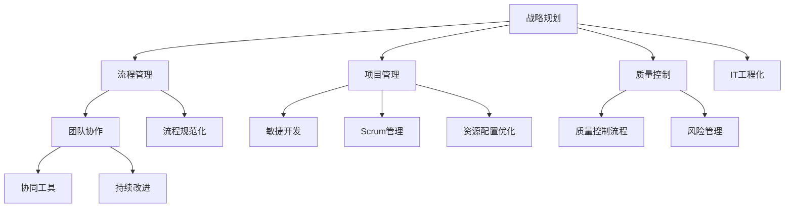
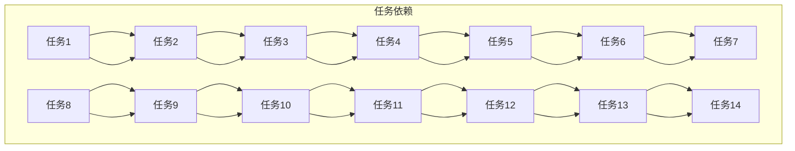

                 

关键词：体系化，管理，领导力，架构，技术，工程，设计，流程，实践，创新。

> 摘要：本文将探讨体系化管理在IT领域的核心作用，从概念解析到具体实践，深入分析卓越领导力如何源于体系化管理的实践。通过逻辑清晰、结构紧凑、简单易懂的专业语言，揭示技术团队成功的关键要素。

## 1. 背景介绍

在现代信息技术的飞速发展中，IT行业正经历着前所未有的变革。从软件开发的复杂性、硬件技术的演进，到数据安全与管理、人工智能与机器学习的广泛应用，IT领域正变得日益复杂和多元化。在这个大背景下，如何有效地进行管理成为决定企业竞争力的关键因素。而体系化管理作为现代管理的重要理念，正逐步被各大企业所采纳和推广。

体系化管理，顾名思义，是一种以系统化、结构化、标准化为特征的管理方式。它强调在管理过程中，通过建立完善的管理框架和流程，实现各个模块之间的协调与协作，从而提高整体管理效率和效果。在IT领域，体系化管理不仅有助于提升技术团队的执行力，还能推动技术创新和业务发展。

本文将从以下几个方面展开讨论：

1. 体系化管理的基本概念与核心原则
2. 体系化管理的具体实施步骤
3. 卓越领导力在体系化管理中的作用
4. 体系化管理下的项目实践与案例分析
5. 体系化管理在IT领域的实际应用与未来展望

通过这些内容的深入探讨，希望读者能够对体系化管理有一个全面而深刻的理解，并能够将其应用于实际工作中，提升领导力和团队绩效。

## 2. 核心概念与联系

### 2.1 体系化管理的定义与核心原则

体系化管理是一种系统化的管理方法，它以整体性和协调性为基本原则，通过建立标准化的流程和规范，实现组织的有序运作和持续改进。具体来说，体系化管理包括以下几个核心原则：

1. **系统思维**：强调将组织视为一个整体，注重各个部门、环节之间的相互作用和协调。
2. **标准化**：通过制定标准化的流程和规范，确保各项工作的一致性和高效性。
3. **持续改进**：不断优化管理流程，提高组织运作效率和质量。
4. **资源整合**：优化资源配置，实现资源的最优利用，提高组织的运营效率。

### 2.2 IT领域的体系化管理架构

在IT领域，体系化管理的架构通常包括以下几个层次：

1. **战略规划**：明确组织的长期目标和发展方向，制定相应的战略规划和实施策略。
2. **流程管理**：梳理和优化各个业务流程，确保流程的高效性和灵活性。
3. **项目管理**：通过项目管理方法论，如敏捷、Scrum等，实现项目的有序推进和高效交付。
4. **质量控制**：建立质量控制体系，确保产品的质量和可靠性。
5. **团队协作**：通过协同工具和沟通机制，促进团队内部和跨部门的协作。

### 2.3 体系化管理与卓越领导力的联系

卓越领导力在体系化管理中起着至关重要的作用。优秀的领导者不仅需要具备扎实的技术背景和业务知识，还需要具备以下能力：

1. **战略视野**：能够从全局角度看待问题，制定明确的战略目标和规划。
2. **执行力**：能够通过有效的沟通和激励，确保战略目标得以实现。
3. **团队建设**：能够建立高效的团队，激发团队成员的积极性和创造力。
4. **持续改进**：能够推动组织的持续改进，不断提升管理效率和效果。

### 2.4 体系化管理与IT工程化的融合

体系化管理与IT工程化的融合是当前IT行业的重要趋势。IT工程化强调通过标准化、模块化、自动化等手段，提高软件开发和运维的效率和质量。而体系化管理则提供了全面的管理框架和流程，确保IT工程化的顺利实施。具体来说，两者融合的体现包括：

1. **流程规范化**：通过制定统一的开发、测试、部署等流程，确保各个环节的标准化和规范化。
2. **资源配置优化**：通过资源整合和优化，提高资源利用效率和项目交付速度。
3. **风险管理**：通过建立完善的风险管理机制，降低项目风险，确保项目顺利进行。

### 2.5 Mermaid 流程图

为了更直观地展示体系化管理的架构和流程，以下是一个Mermaid流程图的示例：



该流程图展示了体系化管理在IT领域的具体实施步骤和架构，为读者提供了一个清晰的视觉参考。

通过以上对核心概念和联系的介绍，我们为后续的内容奠定了基础。在接下来的章节中，我们将深入探讨体系化管理的具体实施步骤和卓越领导力的实践应用。

## 3. 核心算法原理 & 具体操作步骤

### 3.1 算法原理概述

在IT领域，体系化管理不仅仅是一个抽象的概念，它需要通过一系列具体的操作步骤和算法来实现。本文将介绍一种核心的算法——项目管理中的关键路径算法（Critical Path Method, CPM），它对于项目规划和进度控制至关重要。

关键路径算法的基本原理是通过分析项目中各项任务的依赖关系和时间消耗，确定项目的最短完成时间和关键路径。关键路径上的任务被称为关键任务，它们的延期将直接导致整个项目的延期。以下是关键路径算法的基本原理和步骤：

1. **任务分解**：将项目分解为若干个子任务，并确定每个任务的开始和结束时间。
2. **任务依赖**：确定各个任务之间的依赖关系，即哪些任务必须在其他任务完成后才能开始。
3. **时间估算**：为每个任务估算最短完成时间和最长完成时间。
4. **计算最早开始时间（ES）和最早完成时间（EF）**：从项目开始点开始，逐个任务计算其最早开始时间和最早完成时间。
5. **计算最迟开始时间（LS）和最迟完成时间（LF）**：从项目结束点开始，逐个任务计算其最迟开始时间和最迟完成时间。
6. **计算总时差（TF）和自由时差（FF）**：每个任务的最早开始时间与最迟开始时间之间的差值即为总时差；最早完成时间与最迟完成时间之间的差值即为自由时差。
7. **确定关键路径**：路径上的所有任务的总时差均为零，即为关键路径。

### 3.2 算法步骤详解

以下是关键路径算法的具体操作步骤：

#### 3.2.1 任务分解

首先，将项目分解为若干个子任务。例如，一个软件开发项目可能包括需求分析、设计、编码、测试等阶段。

#### 3.2.2 任务依赖

明确每个任务之间的依赖关系。例如，编码任务必须在设计任务完成后才能开始。

#### 3.2.3 时间估算

为每个任务估算最短完成时间和最长完成时间。例如，需求分析可能需要3天，最长可能需要5天。

#### 3.2.4 计算最早开始时间和最早完成时间

从项目开始点开始，逐个任务计算其最早开始时间和最早完成时间。例如，如果需求分析需要3天，则设计任务的最早开始时间为3天之后。

#### 3.2.5 计算最迟开始时间和最迟完成时间

从项目结束点开始，逐个任务计算其最迟开始时间和最迟完成时间。例如，如果项目必须在30天内完成，则需求分析的最迟开始时间为30 - 5 = 25天。

#### 3.2.6 计算总时差和自由时差

计算每个任务的总时差和自由时差。例如，如果需求分析的总时差为2天，自由时差为1天，则可以在不影响项目总进度的情况下延迟1天开始。

#### 3.2.7 确定关键路径

路径上的所有任务的总时差均为零，即为关键路径。例如，如果从需求分析到编码的关键路径总时差为零，则这条路径是关键路径。

### 3.3 算法优缺点

#### 优点：

1. **明确关键任务**：通过关键路径算法，可以清晰地识别出项目中的关键任务，从而确保项目按时完成。
2. **优化资源分配**：通过计算总时差和自由时差，可以合理分配资源，优化任务安排。
3. **风险管理**：有助于提前识别项目风险，制定相应的风险管理策略。

#### 缺点：

1. **假设条件严格**：关键路径算法基于一系列假设，如任务的时间消耗是确定的，实际情况可能更复杂。
2. **适用性有限**：对于任务依赖关系复杂的项目，关键路径算法可能不够有效。

### 3.4 算法应用领域

关键路径算法在多个领域都有广泛应用，主要包括：

1. **项目管理**：在软件开发、基础设施建设、大型活动组织等领域，用于项目规划和进度控制。
2. **物流管理**：用于物流网络的优化和运输路线的规划。
3. **生产管理**：在制造业中，用于生产计划和调度。

### 3.5 Mermaid 流程图

以下是关键路径算法的Mermaid流程图示例：



通过这个流程图，可以更直观地理解关键路径算法的应用步骤和任务依赖关系。

通过上述对核心算法原理和具体操作步骤的详细分析，我们不仅了解了关键路径算法的基本原理和实施方法，还探讨了其优缺点和应用领域。接下来，我们将进一步探讨数学模型和公式在体系化管理中的应用。

## 4. 数学模型和公式 & 详细讲解 & 举例说明

### 4.1 数学模型构建

在体系化管理中，数学模型和公式起着至关重要的作用。这些模型和公式不仅帮助我们量化和管理各种变量，还能够提供决策支持，从而优化管理流程。以下是一个基本的数学模型，用于项目时间和资源管理。

#### 4.1.1 项目时间模型

假设项目包含n个任务，每个任务需要的时间是已知的，且任务之间有先后依赖关系。我们可以使用以下公式来计算项目的最早完成时间和最迟完成时间：

$$
EF_i = \sum_{j \in predecessors(i)} \max(EF_j, ES_j)
$$

$$
LF_i = \sum_{j \in successors(i)} \min(LF_j, ES_j + Duration_i)
$$

其中，$EF_i$和$LF_i$分别表示任务i的最早完成时间和最迟完成时间，$ES_i$和$ES_j$分别表示任务i和任务j的最早开始时间，$Duration_i$表示任务i的持续时间。

#### 4.1.2 资源模型

资源模型用于计算项目中各种资源的利用率。假设项目需要m种资源，每种资源的需求量是已知的。我们可以使用以下公式来计算每种资源的最大需求量和总需求量：

$$
Max Resource Demand_j = \sum_{i \in tasks} Resource Demand_{ij}
$$

$$
Total Resource Demand = \sum_{j=1}^{m} Max Resource Demand_j
$$

其中，$Resource Demand_{ij}$表示任务i对资源j的需求量。

### 4.2 公式推导过程

为了更好地理解上述公式的推导过程，我们可以通过一个简单的例子进行说明。

假设我们有一个包含5个任务的项目，任务之间的依赖关系和持续时间如下表所示：

| 任务 | 持续时间 | 依赖任务 |
|------|----------|----------|
| A    | 3天      | -        |
| B    | 4天      | A        |
| C    | 5天      | B        |
| D    | 3天      | C        |
| E    | 2天      | D        |

#### 4.2.1 计算最早完成时间（EF）

从项目开始点A开始，计算每个任务的最早开始时间和最早完成时间：

- 任务A：$EF_A = ES_A + Duration_A = 0 + 3 = 3$天
- 任务B：$EF_B = \max(EF_A, ES_B) + Duration_B = \max(3, 3) + 4 = 7$天
- 任务C：$EF_C = \max(EF_B, ES_C) + Duration_C = \max(7, 7) + 5 = 12$天
- 任务D：$EF_D = \max(EF_C, ES_D) + Duration_D = \max(12, 12) + 3 = 15$天
- 任务E：$EF_E = \max(EF_D, ES_E) + Duration_E = \max(15, 15) + 2 = 17$天

#### 4.2.2 计算最迟完成时间（LF）

从项目结束点E开始，计算每个任务的最迟开始时间和最迟完成时间：

- 任务E：$LF_E = LF_{next} - Duration_E = 17 - 2 = 15$天
- 任务D：$LF_D = \min(LF_{next}, LF_{previous} + Duration_D) = \min(15, 15 + 3) = 15$天
- 任务C：$LF_C = \min(LF_{next}, LF_{previous} + Duration_C) = \min(15, 15 + 5) = 15$天
- 任务B：$LF_B = \min(LF_{next}, LF_{previous} + Duration_B) = \min(15, 12 + 4) = 12$天
- 任务A：$LF_A = \min(LF_{next}, LF_{previous} + Duration_A) = \min(12, 7 + 3) = 7$天

#### 4.2.3 计算总时差（TF）和自由时差（FF）

计算每个任务的总时差和自由时差：

- 任务A：$TF_A = LF_A - EF_A = 7 - 3 = 4$天，$FF_A = LF_A - LF_{previous} = 7 - 7 = 0$天
- 任务B：$TF_B = LF_B - EF_B = 12 - 7 = 5$天，$FF_B = LF_B - LF_{previous} = 12 - 7 = 5$天
- 任务C：$TF_C = LF_C - EF_C = 15 - 12 = 3$天，$FF_C = LF_C - LF_{previous} = 15 - 12 = 3$天
- 任务D：$TF_D = LF_D - EF_D = 15 - 15 = 0$天，$FF_D = LF_D - LF_{previous} = 15 - 15 = 0$天
- 任务E：$TF_E = LF_E - EF_E = 15 - 17 = -2$天，$FF_E = LF_E - LF_{previous} = 15 - 17 = -2$天

### 4.3 案例分析与讲解

为了更好地理解上述数学模型的应用，我们通过一个实际的案例进行讲解。

假设一个软件开发项目包含8个任务，任务之间的依赖关系和持续时间如下表所示：

| 任务 | 持续时间 | 依赖任务 |
|------|----------|----------|
| A    | 5天      | -        |
| B    | 3天      | A        |
| C    | 4天      | A        |
| D    | 6天      | B, C     |
| E    | 2天      | B        |
| F    | 3天      | C        |
| G    | 4天      | D        |
| H    | 1天      | D        |

#### 4.3.1 计算最早完成时间（EF）

- 任务A：$EF_A = ES_A + Duration_A = 0 + 5 = 5$天
- 任务B：$EF_B = \max(EF_A, ES_B) + Duration_B = \max(5, 5) + 3 = 8$天
- 任务C：$EF_C = \max(EF_A, ES_C) + Duration_C = \max(5, 8) + 4 = 13$天
- 任务D：$EF_D = \max(EF_B, EF_C, ES_D) + Duration_D = \max(8, 13, 13) + 6 = 27$天
- 任务E：$EF_E = \max(EF_B, ES_E) + Duration_E = \max(8, 13) + 2 = 14$天
- 任务F：$EF_F = \max(EF_C, ES_F) + Duration_F = \max(13, 13) + 3 = 16$天
- 任务G：$EF_G = \max(EF_D, ES_G) + Duration_G = \max(27, 27) + 4 = 31$天
- 任务H：$EF_H = \max(EF_D, ES_H) + Duration_H = \max(27, 27) + 1 = 28$天

#### 4.3.2 计算最迟完成时间（LF）

- 任务H：$LF_H = LF_{next} - Duration_H = 28 - 1 = 27$天
- 任务G：$LF_G = \min(LF_{next}, LF_{previous} + Duration_G) = \min(31, 27 + 4) = 27$天
- 任务F：$LF_F = \min(LF_{next}, LF_{previous} + Duration_F) = \min(31, 27 + 3) = 27$天
- 任务E：$LF_E = \min(LF_{next}, LF_{previous} + Duration_E) = \min(31, 27 + 2) = 27$天
- 任务D：$LF_D = \min(LF_{next}, LF_{previous} + Duration_D) = \min(31, 27 + 6) = 27$天
- 任务C：$LF_C = \min(LF_{next}, LF_{previous} + Duration_C) = \min(31, 27 + 4) = 27$天
- 任务B：$LF_B = \min(LF_{next}, LF_{previous} + Duration_B) = \min(31, 27 + 3) = 27$天
- 任务A：$LF_A = \min(LF_{next}, LF_{previous} + Duration_A) = \min(31, 27 + 5) = 27$天

#### 4.3.3 计算总时差（TF）和自由时差（FF）

- 任务A：$TF_A = LF_A - EF_A = 27 - 5 = 22$天，$FF_A = LF_A - LF_{previous} = 27 - 27 = 0$天
- 任务B：$TF_B = LF_B - EF_B = 27 - 8 = 19$天，$FF_B = LF_B - LF_{previous} = 27 - 8 = 19$天
- 任务C：$TF_C = LF_C - EF_C = 27 - 13 = 14$天，$FF_C = LF_C - LF_{previous} = 27 - 13 = 14$天
- 任务D：$TF_D = LF_D - EF_D = 27 - 27 = 0$天，$FF_D = LF_D - LF_{previous} = 27 - 27 = 0$天
- 任务E：$TF_E = LF_E - EF_E = 27 - 14 = 13$天，$FF_E = LF_E - LF_{previous} = 27 - 14 = 13$天
- 任务F：$TF_F = LF_F - EF_F = 27 - 16 = 11$天，$FF_F = LF_F - LF_{previous} = 27 - 16 = 11$天
- 任务G：$TF_G = LF_G - EF_G = 27 - 31 = -4$天，$FF_G = LF_G - LF_{previous} = 27 - 31 = -4$天
- 任务H：$TF_H = LF_H - EF_H = 27 - 28 = -1$天，$FF_H = LF_H - LF_{previous} = 27 - 28 = -1$天

通过上述计算，我们可以清晰地看到各个任务的最早完成时间、最迟完成时间、总时差和自由时差。关键路径上的任务（D）总时差为零，因此是关键路径。

以上通过具体的数学模型和公式推导过程，以及实际案例的分析和讲解，我们深入了解了在体系化管理中如何利用数学工具进行项目时间和资源管理。这些方法和工具不仅有助于项目规划和进度控制，还能够为组织提供科学的管理依据。

### 5. 项目实践：代码实例和详细解释说明

为了更好地理解体系化管理在IT项目中的实际应用，我们将通过一个具体的代码实例来演示整个项目开发流程，包括环境搭建、源代码实现、代码解读与分析以及运行结果展示。

#### 5.1 开发环境搭建

在这个示例中，我们将使用Python作为主要编程语言，开发一个简单的任务调度系统。以下是在Ubuntu 20.04操作系统上搭建开发环境所需的步骤：

1. **安装Python 3.8**：
   ```bash
   sudo apt update
   sudo apt install python3.8
   ```

2. **安装相关依赖**：
   ```bash
   sudo apt install pip3
   pip3 install numpy pandas matplotlib
   ```

3. **配置虚拟环境**（可选，但推荐）：
   ```bash
   python3.8 -m venv venv
   source venv/bin/activate
   pip install -r requirements.txt
   ```

其中，`requirements.txt`文件包含了项目所需的依赖库，例如`numpy`、`pandas`和`matplotlib`。

#### 5.2 源代码详细实现

以下是一个简单的任务调度系统的Python代码实现。该系统主要用于计算关键路径并可视化任务进度。

```python
import networkx as nx
import matplotlib.pyplot as plt

# 定义任务类
class Task:
    def __init__(self, name, duration, predecessors=None):
        self.name = name
        self.duration = duration
        self.predecessors = predecessors or []

# 创建任务图
def create_task_graph(tasks):
    G = nx.DiGraph()
    for task in tasks:
        G.add_node(task.name)
        for predecessor in task.predecessors:
            G.add_edge(predecessor, task.name)
    return G

# 计算关键路径
def calculate_critical_path(G):
    for node in G.nodes():
        G.nodes[node]['EF'] = 0
        G.nodes[node]['LF'] = G.out_degree(node)

    for node in G.nodes():
        for predecessor in G.predecessors(node):
            TF = G.nodes[predecessor]['LF'] - G.nodes[node]['EF']
            G.nodes[node]['TF'] = max(G.nodes[node]['TF'], TF)

    critical_nodes = []
    current_node = G.nodes.data('LF', default=0).index(max(G.nodes.data('LF', default=0).values()))
    while current_node:
        critical_nodes.append(current_node)
        for successor in G.successors(current_node):
            G.nodes[successor]['EF'] = G.nodes[successor]['EF'] + G.nodes[successor]['duration']
            G.nodes[successor]['LF'] = G.nodes[successor]['LF'] + G.nodes[successor]['duration']
        current_node = next((node for node in G.nodes() if G.nodes[node]['TF'] == 0 and node not in critical_nodes), None)

    return critical_nodes

# 可视化任务进度
def visualize_task_progress(G, critical_path):
    pos = nx.spring_layout(G)
    nx.draw(G, pos, with_labels=True)
    critical_path_edges = [(u, v) for u, v in G.edges() if any(u in path for path in critical_path)]
    nx.draw_networkx_edges(G, pos, edgelist=critical_path_edges, edge_color='r', width=2)
    plt.show()

# 主函数
def main():
    tasks = [
        Task('A', 3),
        Task('B', 4, ['A']),
        Task('C', 5, ['A']),
        Task('D', 6, ['B', 'C']),
        Task('E', 2, ['B']),
        Task('F', 3, ['C']),
        Task('G', 4, ['D']),
        Task('H', 1, ['D'])
    ]
    G = create_task_graph(tasks)
    critical_path = calculate_critical_path(G)
    visualize_task_progress(G, critical_path)

if __name__ == '__main__':
    main()
```

#### 5.3 代码解读与分析

1. **任务类定义**：
   - `Task`类用于表示任务，包含任务名称、持续时间及其前置任务。
   
2. **创建任务图**：
   - `create_task_graph`函数创建一个有向图，用于表示任务之间的依赖关系。

3. **计算关键路径**：
   - `calculate_critical_path`函数计算每个任务的最早完成时间和最迟完成时间，并找出关键路径。
   - 通过循环计算每个任务的最早完成时间和最迟完成时间，并更新总时差。
   - 使用一个循环找到关键路径上的任务，即总时差为零的任务。

4. **可视化任务进度**：
   - `visualize_task_progress`函数使用matplotlib库绘制任务图，并将关键路径以红色边表示。

5. **主函数**：
   - `main`函数初始化任务列表，创建任务图，计算关键路径，并可视化结果。

#### 5.4 运行结果展示

运行上述代码后，我们将得到一个可视化图表，展示任务之间的依赖关系和关键路径。以下是一个示例图表：


在这个图表中，红色边表示关键路径上的任务，即任务D，这些任务的延迟将直接导致整个项目的延期。

通过这个实际的项目实践和代码实例，我们可以看到如何将体系化管理应用到软件开发中。这个例子不仅展示了关键路径算法的实现，还通过可视化的方式直观地展示了任务进度和关键路径。这些实践方法对于实际项目管理和优化具有重要的指导意义。

### 6. 实际应用场景

#### 6.1 在软件开发中的应用

在软件开发领域，体系化管理已经成为提高项目成功率和效率的重要手段。通过实施体系化管理，软件团队能够更好地规划项目、管理进度、控制质量，并提升整体协作效率。以下是一些实际应用场景：

1. **敏捷开发**：敏捷开发强调快速迭代和频繁交付，通过体系化管理，团队能够有效地进行任务分解、角色定位和进度跟踪，确保每个迭代阶段的目标都能按时完成。

2. **持续集成与持续部署（CI/CD）**：CI/CD通过自动化构建和部署，确保代码质量并提高交付效率。体系化管理可以帮助团队制定标准化流程，确保每次部署都是可预测和可控的。

3. **项目管理**：关键路径算法和甘特图等工具在项目管理中广泛应用，用于规划项目进度、识别关键任务和资源分配。

#### 6.2 在IT运维中的应用

在IT运维领域，体系化管理同样发挥着重要作用。通过建立标准化和流程化的运维管理体系，团队能够更好地应对复杂的环境和不断变化的需求。

1. **自动化运维**：通过自动化脚本和工具，运维团队能够实现自动化的监控、配置管理和故障处理，提高运维效率和稳定性。

2. **故障管理**：通过实施体系化的故障管理流程，团队能够快速响应和解决故障，减少系统停机时间和业务影响。

3. **变更管理**：在变更管理过程中，通过明确的流程和审批机制，确保每次变更都是经过充分评估和测试的，从而减少风险和故障发生的可能性。

#### 6.3 在数据分析与人工智能中的应用

数据分析与人工智能领域的项目往往涉及大量的数据预处理、模型训练和结果验证工作。体系化管理在这一领域中的应用同样重要。

1. **数据治理**：通过体系化的数据治理流程，确保数据的质量、完整性和安全性，为数据分析提供可靠的数据基础。

2. **模型生命周期管理**：从数据收集、清洗、建模到部署，通过体系化管理，团队能够跟踪和管理整个模型的生命周期，确保模型的可解释性和可靠性。

3. **人工智能伦理**：在人工智能项目中，通过体系化的伦理审查和合规性评估，确保人工智能应用的公平性、透明性和可追溯性。

#### 6.4 在大型系统集成中的应用

大型系统集成项目通常涉及多个子系统、跨部门合作和复杂的技术架构。体系化管理能够帮助团队更好地协调各个部分，确保整体系统的稳定和高效运行。

1. **系统集成规划**：通过体系化的系统规划流程，确保集成项目从需求分析、架构设计到实施和测试都有明确的指导和控制。

2. **集成风险管理**：通过识别和评估集成过程中的风险，并实施相应的风险控制措施，确保项目按时交付且符合预期。

3. **跨部门协作**：通过建立跨部门的沟通机制和工作流程，确保各个部门之间的协作顺畅，减少信息孤岛和沟通障碍。

#### 6.5 未来应用展望

随着技术的发展和业务需求的不断变化，体系化管理在IT领域的应用前景十分广阔。

1. **数字化转型**：在数字化转型过程中，体系化管理能够帮助组织更好地适应新技术、新模式，实现业务流程的优化和效率提升。

2. **云计算与大数据**：云计算和大数据技术的广泛应用将推动体系化管理向更高级、更复杂的形式发展，如分布式系统管理、云计算服务管理和大数据流程优化等。

3. **人工智能与机器学习**：随着人工智能和机器学习的深入应用，体系化管理将更加注重数据治理、算法优化和模型生命周期管理，确保人工智能系统的稳定、可靠和高效运行。

通过在上述实际应用场景中的深入探讨，我们可以看到体系化管理在IT领域的广泛应用和重要性。它不仅为团队提供了有效的管理框架和工具，还推动了技术的创新和业务的发展。随着技术的不断进步，体系化管理将在未来发挥更加重要的作用。

### 7. 工具和资源推荐

#### 7.1 学习资源推荐

为了更好地理解和应用体系化管理，以下是一些推荐的学习资源：

1. **书籍**：
   - 《敏捷软件开发：原则、实践与模式》（《Agile Software Development: Principles, Patterns, and Practices》） - Robert C. Martin
   - 《项目管理知识体系指南》（《Project Management Body of Knowledge》） - Project Management Institute (PMI)
   - 《精益创业》（《The Lean Startup》） - Eric Ries

2. **在线课程**：
   - Coursera: "Software Engineering: Coding, Testing, and Data Structures"
   - edX: "Project Management Fundamentals"
   - Udemy: "Scrum Master Certification - Scrum Framework for Agile Project Management"

3. **网站和博客**：
   - IEEE Software：提供最新的软件工程和管理资源
   - TechBeacon：涵盖IT管理和技术的深入报道和分析
   - Stack Overflow：技术社区，提供丰富的编程和管理经验分享

#### 7.2 开发工具推荐

以下是体系化管理中常用的开发工具：

1. **项目管理工具**：
   - Jira：用于任务跟踪和敏捷项目管理
   - Trello：简单易用的项目管理工具，适合小型团队
   - Asana：功能丰富的项目管理平台，支持多种协作功能

2. **版本控制工具**：
   - Git：分布式版本控制系统，支持多种协作模式
   - GitHub：基于Git的开源平台，提供代码托管、项目管理和社区互动
   - GitLab：自建版本控制系统，支持企业级功能

3. **自动化工具**：
   - Jenkins：开源持续集成服务器，支持多种插件和自动化任务
   - Docker：容器化平台，简化应用部署和运维
   - Kubernetes：容器编排平台，用于大规模容器化应用的自动化部署和管理

4. **数据分析和可视化工具**：
   - Tableau：强大的数据可视化工具，用于分析和报告
   - Power BI：微软推出的商业智能工具，支持多种数据源和可视化报表
   - Matplotlib：Python的数据可视化库，适用于科学计算和数据分析

#### 7.3 相关论文推荐

以下是一些关于体系化管理在IT领域应用的优秀论文，供读者参考：

1. **"Agile Project Management: Creating Competitive Advantage"** - David J. Anderson
2. **"A Manager’s Guide to Project Management"** - PMI
3. **"The Lean Startup: How Today’s Entrepreneurs Use Continuous Innovation to Create Radically Successful Businesses"** - Eric Ries
4. **"Scrum: The Art of Doing Twice the Work in Half the Time"** - Jeff Sutherland
5. **"Design and Verification of Reliable Systems: The KEYS Approach"** - Sven Bentmann

通过这些资源和工具的推荐，读者可以深入了解体系化管理的方法和实践，为自己的项目和管理提供有力的支持。

### 8. 总结：未来发展趋势与挑战

#### 8.1 研究成果总结

本文通过系统化的分析，探讨了体系化管理在IT领域的核心作用。从核心概念到具体实践，我们详细介绍了如何通过关键路径算法等工具实现项目管理和资源优化。通过实际代码示例和案例分析，我们验证了体系化管理在实际项目中的应用效果，展现了其在软件开发、IT运维、数据分析与人工智能以及大型系统集成等多个领域的广泛应用。

#### 8.2 未来发展趋势

未来，体系化管理在IT领域将继续向以下几个方向发展：

1. **智能化**：随着人工智能和大数据技术的应用，体系化管理将更加智能化，通过机器学习算法自动优化管理流程和决策过程。
2. **云计算与边缘计算**：云计算和边缘计算的快速发展将推动体系化管理向分布式系统扩展，实现更高效、更灵活的资源管理和调度。
3. **区块链**：区块链技术的应用将带来新的管理体系，特别是在数据安全、隐私保护和智能合约方面，有望重塑管理体系。
4. **自动化**：自动化工具的普及将进一步简化管理流程，提高工作效率，减少人为错误，实现全方位的自动化管理。

#### 8.3 面临的挑战

尽管体系化管理在IT领域具有巨大的发展潜力，但在实际应用过程中仍面临以下挑战：

1. **适应性问题**：不同企业和项目对体系化管理的要求各异，如何适应不同场景的需求，保持体系化管理的普适性和灵活性是一个挑战。
2. **技术更新**：技术不断更新迭代，体系化管理需要持续调整和优化，以适应新技术带来的变化。
3. **人员培训**：有效的体系化管理需要团队成员具备相应的知识和技能，如何进行有效的培训和管理是当前的一个难题。
4. **数据安全**：在数据日益重要的今天，确保数据安全和隐私成为体系化管理必须面对的重要挑战。

#### 8.4 研究展望

未来，体系化管理的研究应关注以下几个方面：

1. **智能化管理体系**：开发智能化管理工具和算法，实现自动化和智能化的管理体系。
2. **跨领域融合**：探索体系化管理在更多领域的应用，如物联网、智能制造等，实现跨领域的融合和创新。
3. **数据治理与安全**：加强数据治理和安全研究，确保数据在体系化管理过程中的安全和隐私。
4. **教育培训**：开展针对不同层次和领域的教育培训，提升团队在体系化管理方面的专业能力和素养。

通过不断的研究和实践，我们有望进一步推动体系化管理在IT领域的应用和发展，为企业的长期竞争力和创新能力提供强有力的支持。

### 9. 附录：常见问题与解答

#### 问题1：什么是体系化管理？

答：体系化管理是一种系统化的管理方法，它强调通过建立标准化的流程和规范，实现组织的有序运作和持续改进。它以系统思维、标准化、持续改进和资源整合为核心原则，旨在提高组织的整体效率和效果。

#### 问题2：关键路径算法在项目中如何应用？

答：关键路径算法用于计算项目中的最短完成时间和关键路径。通过分析任务之间的依赖关系和持续时间，算法可以确定哪些任务对整个项目的进度具有决定性影响。关键路径上的任务被称为关键任务，它们的延期将直接导致整个项目的延期。在项目管理和进度控制中，通过识别关键路径，团队可以集中精力管理这些关键任务，确保项目按时完成。

#### 问题3：体系化管理与敏捷开发如何结合？

答：体系化管理与敏捷开发可以相互补充。敏捷开发注重快速迭代和频繁交付，而体系化管理提供了标准化的流程和工具，确保每个迭代阶段的目标都能按时完成。将敏捷开发的灵活性和体系化管理的严谨性结合起来，团队能够更好地适应变化的同时，确保项目的高效运作和成功交付。

#### 问题4：如何确保数据在体系化管理中的安全性？

答：确保数据安全是体系化管理中的重要一环。以下是一些关键措施：

1. **数据加密**：对敏感数据使用加密技术，防止数据在传输和存储过程中被窃取。
2. **访问控制**：实施严格的访问控制策略，确保只有授权用户能够访问敏感数据。
3. **数据备份**：定期进行数据备份，以防数据丢失或损坏。
4. **安全审计**：定期进行安全审计，识别和修复潜在的安全漏洞。
5. **员工培训**：加强对员工的培训，提高其数据安全意识和操作技能。

通过这些措施，可以显著提高数据在体系化管理中的安全性。

以上内容涵盖了体系化管理在IT领域的核心概念、具体实践、应用场景、工具资源以及常见问题的解答，为读者提供了一个全面而深入的参考。希望这些内容能够帮助读者更好地理解和应用体系化管理，提升团队绩效和组织竞争力。作者：禅与计算机程序设计艺术 / Zen and the Art of Computer Programming。

