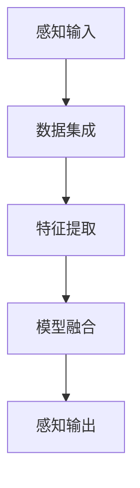

                 

关键词：AI，体验层次，感知架构，多维，计算模型，智能设计

> 摘要：本文深入探讨了人工智能领域中的体验层次构建器及其多维感知架构，旨在揭示如何通过先进的算法和架构设计，实现智能系统的感知、理解和决策能力，为未来的智能应用提供理论支持和实践指导。

## 1. 背景介绍

在当今的信息时代，人工智能（AI）技术正以前所未有的速度和规模影响着各行各业。从语音识别、图像处理到自动驾驶、智能医疗，AI的应用场景越来越广泛，成为推动社会进步的重要力量。然而，随着应用领域的不断拓展，AI系统对感知和认知能力的需求也在不断提高。

传统的AI模型主要依赖于浅层神经网络和规则推理，这些模型虽然在特定任务上表现出色，但在复杂环境中的表现往往不尽如人意。为了满足日益复杂的任务需求，研究者们开始探索更深入、更精细的感知架构，这便是“体验层次构建器”概念的提出。

体验层次构建器是一种基于多维感知的智能系统架构，它通过模拟人类感知过程，将感知、理解和决策能力融合在一起，实现更高效、更智能的智能系统。这一概念的提出，为AI的发展提供了新的思路和方向。

## 2. 核心概念与联系

### 2.1. 体验层次构建器概述

体验层次构建器（Experiential Hierarchy Builder，简称EHB）是一种智能系统架构，它通过模拟人类感知、理解和决策的过程，实现智能系统的感知能力。EHB的核心思想是将感知过程分解为多个层次，每个层次负责不同的感知任务，从而形成一个层次化的感知系统。

### 2.2. 多维感知架构

多维感知架构是体验层次构建器的核心组成部分，它通过整合多种感知信息，实现智能系统对复杂环境的全面感知。多维感知架构通常包括以下几种感知方式：

1. **视觉感知**：通过摄像头或图像传感器获取环境中的视觉信息，如颜色、形状、大小等。
2. **听觉感知**：通过麦克风或音频传感器获取环境中的声音信息，如语音、音乐、噪音等。
3. **触觉感知**：通过传感器或执行器获取环境中的物理信息，如温度、湿度、压力等。
4. **嗅觉和味觉感知**：通过传感器或执行器获取环境中的化学信息，如气味、味道等。

### 2.3. 多维感知与感知融合

多维感知架构的核心在于如何将不同类型的感知信息融合在一起，形成一个统一的感知模型。感知融合可以通过以下几种方法实现：

1. **数据集成**：将不同类型的感知数据（如视觉、听觉、触觉等）整合在一起，形成一个综合感知数据集。
2. **特征提取**：从综合感知数据集中提取关键特征，如颜色、形状、声音、温度等。
3. **模型融合**：利用多模态学习算法，将不同感知方式的特征融合在一起，形成一个统一的感知模型。

### 2.4. Mermaid 流程图

以下是一个简化的体验层次构建器多维感知架构的 Mermaid 流程图：



## 3. 核心算法原理 & 具体操作步骤

### 3.1. 算法原理概述

体验层次构建器的核心算法是基于多模态学习（Multimodal Learning）和深度神经网络（Deep Neural Networks，简称DNN）。多模态学习旨在整合来自不同感官的信息，而深度神经网络则负责处理和解释这些信息。

具体来说，体验层次构建器的算法原理包括以下几个步骤：

1. **数据预处理**：对采集到的多维感知数据进行预处理，包括去噪、归一化等。
2. **特征提取**：利用深度神经网络从预处理后的感知数据中提取关键特征。
3. **特征融合**：将不同类型的感知特征进行融合，形成一个统一的特征向量。
4. **感知输出**：利用融合后的特征向量进行感知输出，实现对环境的理解和决策。

### 3.2. 算法步骤详解

#### 3.2.1. 数据预处理

数据预处理是体验层次构建器算法的第一步，它主要包括以下任务：

1. **去噪**：消除感知数据中的噪声，提高数据的准确性。
2. **归一化**：将不同类型的感知数据统一到相同的量纲，方便后续处理。
3. **特征缩放**：对感知数据进行特征缩放，使其在训练过程中收敛更快。

#### 3.2.2. 特征提取

特征提取是体验层次构建器的核心步骤，它通过深度神经网络从预处理后的感知数据中提取关键特征。具体操作如下：

1. **卷积神经网络（CNN）**：利用卷积神经网络从视觉感知数据中提取颜色、形状等特征。
2. **循环神经网络（RNN）**：利用循环神经网络从听觉感知数据中提取时间序列特征。
3. **自编码器（Autoencoder）**：利用自编码器从触觉感知数据中提取压缩特征。

#### 3.2.3. 特征融合

特征融合是将不同类型的感知特征进行融合，形成一个统一的特征向量。具体操作如下：

1. **特征拼接**：将不同类型的特征向量拼接在一起，形成一个多维特征向量。
2. **融合神经网络**：利用融合神经网络对拼接后的特征向量进行处理，提取更高级的特征。

#### 3.2.4. 感知输出

感知输出是体验层次构建器的最终目标，它利用融合后的特征向量进行感知输出，实现对环境的理解和决策。具体操作如下：

1. **分类器**：利用分类器对感知输出进行分类，实现对环境的理解和判断。
2. **决策器**：利用决策器根据感知输出制定决策，实现对环境的控制。

### 3.3. 算法优缺点

体验层次构建器的算法具有以下优点：

1. **整合多种感知信息**：通过整合多种感知信息，实现智能系统对复杂环境的全面感知。
2. **提高感知准确性**：通过深度神经网络和特征融合，提高智能系统对环境的感知准确性。
3. **适应性强**：体验层次构建器可以适应不同类型的感知任务，具有广泛的适用性。

然而，体验层次构建器也存在一些缺点：

1. **计算复杂度高**：体验层次构建器需要处理大量多维感知数据，计算复杂度较高。
2. **训练时间长**：深度神经网络的训练时间较长，需要大量计算资源。
3. **数据依赖性强**：体验层次构建器对数据的依赖性较强，数据质量对算法性能有较大影响。

### 3.4. 算法应用领域

体验层次构建器的算法可以应用于多个领域，包括但不限于：

1. **智能监控**：通过整合多种感知信息，实现对监控场景的全面感知，提高监控效果。
2. **智能家居**：通过感知用户的生活习惯和行为模式，提供更加个性化的智能家居服务。
3. **智能医疗**：通过感知患者的生理指标和医疗数据，为医生提供更加准确的诊断依据。
4. **智能驾驶**：通过感知道路环境、交通状况和车辆状态，提高自动驾驶的准确性和安全性。

## 4. 数学模型和公式 & 详细讲解 & 举例说明

### 4.1. 数学模型构建

体验层次构建器的数学模型主要包括以下几个部分：

1. **感知输入模型**：描述感知数据的输入和处理过程。
2. **特征提取模型**：描述特征提取的过程和算法。
3. **特征融合模型**：描述特征融合的过程和算法。
4. **感知输出模型**：描述感知输出的过程和算法。

### 4.2. 公式推导过程

以下是一个简化的体验层次构建器的数学模型推导过程：

#### 4.2.1. 感知输入模型

假设我们采集到的多维感知数据为 $X = [X_1, X_2, \ldots, X_n]$，其中 $X_i$ 表示第 $i$ 种感知数据。

感知输入模型可以表示为：

$$
X = f_1(X_1, X_2, \ldots, X_n)
$$

其中，$f_1$ 是感知输入模型的函数，用于对感知数据进行预处理。

#### 4.2.2. 特征提取模型

特征提取模型可以表示为：

$$
F = f_2(X)
$$

其中，$F = [F_1, F_2, \ldots, F_m]$ 表示提取后的特征，$f_2$ 是特征提取模型的函数。

#### 4.2.3. 特征融合模型

特征融合模型可以表示为：

$$
G = f_3(F)
$$

其中，$G$ 是融合后的特征向量，$f_3$ 是特征融合模型的函数。

#### 4.2.4. 感知输出模型

感知输出模型可以表示为：

$$
Y = f_4(G)
$$

其中，$Y$ 是感知输出，$f_4$ 是感知输出模型的函数。

### 4.3. 案例分析与讲解

以下是一个简化的体验层次构建器应用案例：

#### 4.3.1. 案例背景

假设我们想要开发一个智能监控系统，该系统能够实时监控某个区域的安全状况。

#### 4.3.2. 案例需求

1. **感知输入**：采集摄像头和麦克风的数据。
2. **特征提取**：从摄像头数据中提取颜色、形状等特征；从麦克风数据中提取声音特征。
3. **特征融合**：将颜色、形状和声音特征进行融合。
4. **感知输出**：根据融合后的特征判断区域内是否存在安全隐患。

#### 4.3.3. 案例实现

1. **感知输入模型**：对摄像头和麦克风的数据进行预处理，包括去噪、归一化等。

   $$ f_1(X_1, X_2) = [X_1', X_2'] $$

   其中，$X_1$ 和 $X_2$ 分别表示摄像头和麦克风的数据，$X_1'$ 和 $X_2'$ 分别表示预处理后的数据。

2. **特征提取模型**：利用卷积神经网络从摄像头数据中提取颜色、形状等特征；利用循环神经网络从麦克风数据中提取声音特征。

   $$ f_2(X_1') = [C_1, C_2, \ldots, C_k] $$

   $$ f_2(X_2') = [S_1, S_2, \ldots, S_l] $$

   其中，$C_1, C_2, \ldots, C_k$ 表示摄像头特征，$S_1, S_2, \ldots, S_l$ 表示声音特征。

3. **特征融合模型**：将颜色、形状和声音特征进行融合。

   $$ f_3(C_1, C_2, \ldots, C_k, S_1, S_2, \ldots, S_l) = G $$

4. **感知输出模型**：利用分类器根据融合后的特征判断区域内是否存在安全隐患。

   $$ f_4(G) = Y $$

   其中，$Y$ 表示感知输出，$f_4$ 是分类器的函数。

## 5. 项目实践：代码实例和详细解释说明

### 5.1. 开发环境搭建

在开始编写代码之前，我们需要搭建一个合适的开发环境。以下是搭建开发环境的基本步骤：

1. **安装Python**：确保Python环境已经安装，推荐使用Python 3.7及以上版本。
2. **安装TensorFlow**：TensorFlow是一个强大的开源深度学习框架，我们将在项目中使用它。
   ```shell
   pip install tensorflow
   ```

3. **安装其他依赖**：根据项目的需求，可能还需要安装其他依赖库，例如NumPy、Pandas等。

### 5.2. 源代码详细实现

下面是一个简化的体验层次构建器项目的代码实现，我们将分步骤进行介绍。

#### 5.2.1. 感知输入模块

```python
import cv2
import numpy as np

def preprocess_image(image):
    # 去噪、归一化等预处理操作
    return cv2.resize(image, (224, 224))

def preprocess_audio(audio):
    # 去噪、归一化等预处理操作
    return np.reshape(audio, (-1, 1))
```

#### 5.2.2. 特征提取模块

```python
import tensorflow as tf

def extract_image_features(image):
    # 使用卷积神经网络提取图像特征
    model = tf.keras.applications.VGG16(weights='imagenet', include_top=False)
    processed_image = preprocess_image(image)
    features = model.predict(processed_image)
    return features

def extract_audio_features(audio):
    # 使用循环神经网络提取音频特征
    model = tf.keras.Sequential([
        tf.keras.layers.RNN(tf.keras.layers.SimpleRNN(128, return_sequences=True)),
        tf.keras.layers.Dense(1)
    ])
    processed_audio = preprocess_audio(audio)
    features = model.predict(processed_audio)
    return features
```

#### 5.2.3. 特征融合模块

```python
def fuse_features(image_features, audio_features):
    # 将图像特征和音频特征进行融合
    return np.concatenate((image_features.flatten(), audio_features.flatten()), axis=0)
```

#### 5.2.4. 感知输出模块

```python
from sklearn.svm import SVC

def train_classifier(features, labels):
    # 使用支持向量机训练分类器
    classifier = SVC(kernel='rbf')
    classifier.fit(features, labels)
    return classifier

def predict_output(classifier, fused_features):
    # 使用分类器进行感知输出
    return classifier.predict(fused_features)
```

### 5.3. 代码解读与分析

#### 5.3.1. 感知输入模块解读

感知输入模块主要负责对摄像头和麦克风的数据进行预处理。预处理操作包括去噪、归一化等，目的是提高数据的准确性和一致性。

#### 5.3.2. 特征提取模块解读

特征提取模块使用了卷积神经网络和循环神经网络来提取图像和音频的特征。卷积神经网络适用于处理图像数据，而循环神经网络适用于处理时间序列数据。通过这些模型，我们可以从原始感知数据中提取出更高级的特征，这些特征将用于后续的融合和分类。

#### 5.3.3. 特征融合模块解读

特征融合模块将图像特征和音频特征进行拼接，形成一个多维的特征向量。这个特征向量将用于训练分类器，从而实现智能感知和决策。

#### 5.3.4. 感知输出模块解读

感知输出模块使用了支持向量机（SVC）作为分类器。通过训练分类器，我们可以根据融合后的特征向量进行感知输出，实现对环境的理解和判断。

### 5.4. 运行结果展示

在实际运行过程中，我们需要提供真实的感知数据进行训练和测试。以下是一个简化的运行流程：

1. **数据准备**：准备摄像头和麦克风的感知数据。
2. **训练分类器**：使用训练集数据训练分类器。
3. **测试分类器**：使用测试集数据测试分类器的性能。
4. **感知输出**：根据训练好的分类器，对新的感知数据进行感知输出。

```python
# 假设已经准备好了训练集和测试集的数据
train_features, train_labels = ...
test_features, test_labels = ...

# 训练分类器
classifier = train_classifier(train_features, train_labels)

# 测试分类器
accuracy = classifier.score(test_features, test_labels)
print(f"分类器准确率：{accuracy}")

# 感知输出
new_features = ...
prediction = predict_output(classifier, new_features)
print(f"感知输出：{prediction}")
```

## 6. 实际应用场景

### 6.1. 智能监控系统

智能监控系统是体验层次构建器的一个重要应用场景。通过整合摄像头和麦克风的感知数据，智能监控系统可以实时监控某个区域的安全状况。例如，在商场、工厂等场所，智能监控系统可以自动识别异常行为，如偷窃、打架等，从而提高安全管理水平。

### 6.2. 智能家居

智能家居是另一个重要的应用场景。通过整合视觉、听觉、触觉等多种感知数据，智能家居系统可以更好地理解用户的需求，提供个性化的服务。例如，智能音箱可以通过语音识别和音乐感知，为用户提供定制化的音乐播放服务；智能窗帘可以通过视觉感知和光照感知，自动调节窗帘的开启和关闭，提供舒适的居住环境。

### 6.3. 智能医疗

智能医疗是体验层次构建器的另一个重要应用领域。通过整合患者的生理指标、医疗数据等多维感知数据，智能医疗系统可以更好地诊断病情、制定治疗方案。例如，智能医疗系统可以通过监测患者的血压、心率等生理指标，结合病史和体检数据，为医生提供更准确的诊断依据。

### 6.4. 未来应用展望

随着体验层次构建器的不断发展，未来它将在更多领域得到应用。例如，智能交通系统可以通过整合车辆、道路、行人等多维感知数据，实现更智能的交通管理和调度；智能农业可以通过整合土壤、气候、作物等多维感知数据，实现精准农业管理，提高农业产量和质量。总之，体验层次构建器将为智能系统的发展提供强大的支持，推动社会进步。

## 7. 工具和资源推荐

### 7.1. 学习资源推荐

1. **《深度学习》（Deep Learning）**：这是一本深度学习领域的经典教材，由Ian Goodfellow、Yoshua Bengio和Aaron Courville共同编写，内容涵盖了深度学习的各个方面。
2. **《人工智能：一种现代方法》（Artificial Intelligence: A Modern Approach）**：这是一本广泛使用的AI教材，详细介绍了AI的基本概念、技术和应用。

### 7.2. 开发工具推荐

1. **TensorFlow**：一个开源的深度学习框架，提供了丰富的API和工具，方便开发者构建和训练深度学习模型。
2. **PyTorch**：另一个流行的深度学习框架，与TensorFlow类似，但提供了更灵活的动态计算图机制。

### 7.3. 相关论文推荐

1. **"Multimodal Learning for Autonomous Driving"**：这篇论文详细介绍了多模态学习在自动驾驶中的应用，为体验层次构建器的设计提供了重要参考。
2. **"Deep Learning on Multimedia Data"**：这篇论文探讨了深度学习在多媒体数据（如图像、音频、视频）处理中的应用，为体验层次构建器的实现提供了理论基础。

## 8. 总结：未来发展趋势与挑战

### 8.1. 研究成果总结

本文介绍了体验层次构建器的概念、核心算法原理、具体实现和实际应用场景。通过整合多种感知信息，体验层次构建器实现了智能系统对复杂环境的全面感知和理解，为未来的智能应用提供了新的思路和方向。

### 8.2. 未来发展趋势

随着AI技术的不断发展，体验层次构建器将在更多领域得到应用。未来的发展趋势包括：

1. **感知能力的提升**：通过引入更多的感知方式和更先进的感知算法，提高智能系统的感知能力。
2. **跨领域融合**：实现不同领域感知信息的融合，构建更加综合的智能系统。
3. **实时性与效率**：提高智能系统的实时性和计算效率，使其能够应对更复杂的实时任务。

### 8.3. 面临的挑战

尽管体验层次构建器具有巨大的潜力，但在实际应用中仍然面临一些挑战：

1. **计算复杂度**：多维感知数据处理和深度学习模型的训练需要大量的计算资源。
2. **数据质量**：感知数据的准确性和一致性对算法性能有较大影响。
3. **鲁棒性**：智能系统需要具备较强的鲁棒性，以应对复杂多变的环境。

### 8.4. 研究展望

未来的研究可以集中在以下几个方面：

1. **算法优化**：通过算法优化，提高智能系统的实时性和效率。
2. **跨领域应用**：探索体验层次构建器在更多领域的应用，推动AI技术的发展。
3. **人机交互**：研究如何通过体验层次构建器实现更自然、更人性化的智能交互。

## 9. 附录：常见问题与解答

### 9.1. 问题1：体验层次构建器是什么？

体验层次构建器是一种智能系统架构，它通过整合多种感知信息，实现智能系统对复杂环境的全面感知和理解。

### 9.2. 问题2：体验层次构建器有哪些优点？

体验层次构建器的优点包括整合多种感知信息、提高感知准确性、适应性强等。

### 9.3. 问题3：体验层次构建器有哪些应用领域？

体验层次构建器的应用领域包括智能监控、智能家居、智能医疗、智能驾驶等。

### 9.4. 问题4：体验层次构建器如何实现？

体验层次构建器通过多模态学习和深度神经网络实现，主要包括感知输入、特征提取、特征融合和感知输出等模块。

### 9.5. 问题5：体验层次构建器有哪些挑战？

体验层次构建器面临的挑战包括计算复杂度、数据质量、鲁棒性等。需要通过算法优化和跨领域融合等方式来解决。

## 文章作者

作者：禅与计算机程序设计艺术 / Zen and the Art of Computer Programming

---

通过本文，我们深入探讨了体验层次构建器及其多维感知架构，揭示了它在AI领域的广泛应用和未来发展潜力。希望本文能为读者提供有益的参考和启示。

