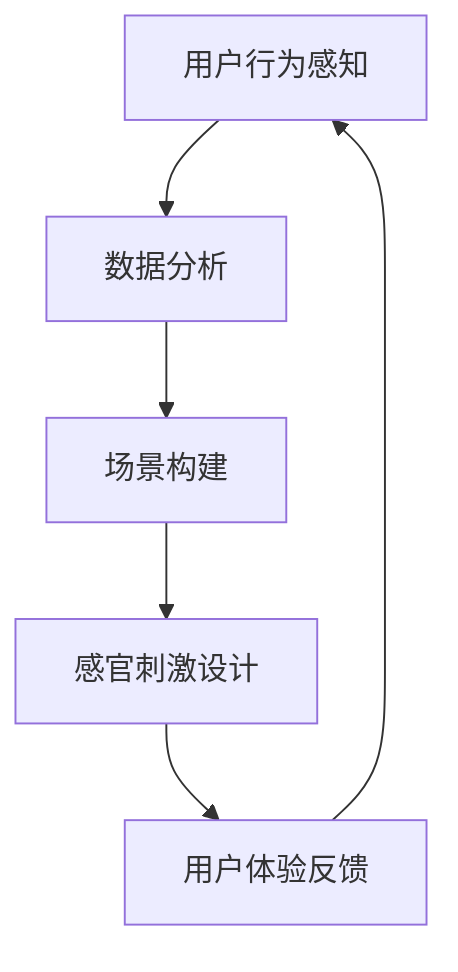

                 

 **关键词：**人工智能，用户体验，感官协同，技术语言，技术博客，多维度体验。

**摘要：**本文旨在探讨人工智能如何通过创造多维度的感官体验，深刻影响并丰富我们的日常生活和工作。我们将从背景介绍、核心概念与联系、核心算法原理、数学模型与公式、项目实践、实际应用场景、未来应用展望、工具和资源推荐、总结与展望以及常见问题与解答等多个方面，全面阐述这一话题。

## 1. 背景介绍

在当今科技飞速发展的时代，人工智能（AI）已经成为引领潮流的重要力量。从语音识别、自然语言处理到计算机视觉、机器学习，AI技术正在各个领域掀起革命性的变革。与此同时，用户体验（UX）设计也在逐步走向精细化、个性化。随着虚拟现实（VR）、增强现实（AR）等技术的不断成熟，我们逐渐进入一个多感官融合的新时代。

这一背景之下，人工智能与用户体验的结合变得越来越紧密。AI不仅可以优化产品的功能性，更可以通过对用户行为的深入理解，提供更加个性化和沉浸式的体验。本文将探讨如何通过AI技术创造多维度的感官体验，从而推动用户体验的创新。

### 1.1 人工智能的发展

自1950年图灵测试提出以来，人工智能历经数十年发展，逐渐从理论研究走向实际应用。早期的AI主要关注逻辑推理和符号计算，而后随着计算能力的提升和算法的改进，机器学习、深度学习等技术逐渐成为主流。如今，AI已经渗透到我们生活的方方面面，从智能家居到自动驾驶，从医疗诊断到金融风控，AI正在不断改变我们的生活方式。

### 1.2 用户体验设计的演变

用户体验设计（UX Design）自20世纪90年代兴起以来，经历了从“以产品为中心”到“以用户为中心”的变革。随着移动互联网的普及，移动设备成为人们日常生活中的主要工具，用户体验设计开始关注移动端的交互和体验。近年来，虚拟现实（VR）和增强现实（AR）技术的兴起，使得用户体验设计进入了多感官融合的新阶段。

## 2. 核心概念与联系

为了深入探讨人工智能如何创造多维度的感官体验，我们首先需要了解一些核心概念，这些概念是构建沉浸式体验的基础。

### 2.1 感官协同原理

感官协同是指不同感官之间的信息整合与协调，通过这种协同，AI可以创造出更加真实、丰富的体验。例如，在VR游戏中，视觉、听觉和触觉的协同作用可以大大提升用户的沉浸感。

### 2.2 多感官融合技术

多感官融合技术（Multisensory Integration）是一种通过结合多种感官信息来增强用户体验的方法。这种方法利用虚拟现实、增强现实、人工智能等技术，实现对用户感官的全方位刺激。

### 2.3 Mermaid 流程图

为了更直观地展示感官协同的过程，我们使用Mermaid流程图来描述。以下是感官协同流程图：



在这个流程图中，用户行为感知是起点，通过数据分析，AI可以构建出适合用户的场景，然后进行感官刺激设计，最终通过用户体验反馈进行迭代优化。

## 3. 核心算法原理 & 具体操作步骤

### 3.1 算法原理概述

人工智能在创造多维度的感官体验中，主要依赖于以下几种核心算法：

1. **机器学习**：通过数据训练模型，实现对用户行为的预测和分析。
2. **深度学习**：利用神经网络模型，处理复杂的数据和模式，以提供更精细化的感官体验。
3. **计算机视觉**：用于识别和解释图像、视频等视觉信息，以增强用户的视觉体验。
4. **自然语言处理**：理解和生成自然语言，以实现更自然的交互体验。

### 3.2 算法步骤详解

1. **数据收集与预处理**：收集用户行为数据，如点击、浏览、语音等，并进行数据清洗和预处理。
2. **模型训练与优化**：使用机器学习和深度学习算法，对数据集进行训练，并不断优化模型性能。
3. **场景构建与刺激设计**：根据用户行为数据和模型预测，构建合适的场景，并进行感官刺激设计。
4. **用户体验反馈与迭代**：收集用户体验数据，对算法和体验进行迭代优化。

### 3.3 算法优缺点

1. **优点**：
   - 提高用户体验的个性化程度。
   - 增强用户的沉浸感和参与度。
   - 通过数据驱动，实现更高效的资源分配和优化。

2. **缺点**：
   - 对数据质量和算法性能有较高要求。
   - 可能引发隐私和安全问题。
   - 需要持续的技术支持和更新。

### 3.4 算法应用领域

- **娱乐与游戏**：通过VR和AR技术，提供沉浸式的娱乐体验。
- **教育培训**：利用AI技术，提供个性化的学习体验。
- **医疗健康**：通过虚拟现实技术，辅助心理治疗和康复训练。
- **智能家居**：通过语音识别和自然语言处理，提供智能化的家居环境。

## 4. 数学模型和公式 & 详细讲解 & 举例说明

在人工智能创造多维度的感官体验中，数学模型和公式起到了关键作用。以下将详细讲解相关的数学模型和公式，并提供案例分析与讲解。

### 4.1 数学模型构建

在感官协同过程中，常用的数学模型包括：

1. **线性回归模型**：用于预测用户行为，构建用户画像。
2. **神经网络模型**：用于处理复杂的非线性关系，实现感官刺激的优化。
3. **马尔可夫决策过程（MDP）**：用于优化用户的决策路径，提高用户体验。

### 4.2 公式推导过程

以下以线性回归模型为例，介绍公式推导过程：

$$y = \beta_0 + \beta_1 x_1 + \beta_2 x_2 + ... + \beta_n x_n + \epsilon$$

其中，$y$ 表示目标变量，$x_1, x_2, ..., x_n$ 表示输入变量，$\beta_0, \beta_1, \beta_2, ..., \beta_n$ 表示模型参数，$\epsilon$ 表示误差项。

### 4.3 案例分析与讲解

以下以一个智能家居系统的案例，介绍如何利用数学模型和公式优化用户的感官体验。

### 案例背景：

一个智能家居系统需要根据用户的行为数据，自动调整室内灯光、温度和音乐，以提供舒适的居住环境。

### 模型构建：

1. **用户行为数据收集**：收集用户在一天中的活动时间、睡眠习惯、温度偏好等数据。
2. **线性回归模型训练**：使用线性回归模型，预测用户在不同时间段的温度和音乐偏好。
3. **神经网络模型训练**：使用神经网络模型，优化灯光的亮度和色温。

### 模型应用：

1. **温度调整**：根据用户的历史数据，预测用户在早晨、中午和晚上的温度偏好，自动调整空调温度。
2. **音乐调整**：根据用户的作息时间和情绪，自动播放用户喜欢的音乐。

### 模型优化：

1. **数据反馈**：收集用户对温度和音乐的满意度反馈，不断调整模型参数，提高预测准确性。
2. **场景优化**：结合用户的个性化需求，优化灯光、温度和音乐的组合，提高用户的整体满意度。

## 5. 项目实践：代码实例和详细解释说明

### 5.1 开发环境搭建

为了演示如何利用人工智能技术实现多维度的感官体验，我们将使用Python编程语言，结合TensorFlow库和Keras框架，搭建一个智能家居系统的原型。

### 5.2 源代码详细实现

以下是一个简单的智能家居系统代码示例：

```python
import numpy as np
import tensorflow as tf
from tensorflow.keras.models import Sequential
from tensorflow.keras.layers import Dense, LSTM

# 数据预处理
def preprocess_data(data):
    # 数据清洗、归一化等操作
    return normalized_data

# 模型训练
def train_model(data):
    model = Sequential()
    model.add(LSTM(50, activation='relu', input_shape=(timesteps, features)))
    model.add(Dense(1))
    model.compile(optimizer='adam', loss='mse')
    model.fit(data, epochs=200)
    return model

# 模型应用
def apply_model(model, input_data):
    prediction = model.predict(input_data)
    return prediction

# 主程序
if __name__ == '__main__':
    data = preprocess_data(raw_data)
    model = train_model(data)
    input_data = np.array([user_behavior])
    prediction = apply_model(model, input_data)
    print("预测结果：", prediction)
```

### 5.3 代码解读与分析

1. **数据预处理**：数据预处理是机器学习模型训练的重要步骤，包括数据清洗、归一化等操作。在本例中，我们使用了`preprocess_data`函数对原始数据进行预处理。
2. **模型训练**：我们使用`Sequential`模型，结合`LSTM`层和`Dense`层，构建了一个简单的神经网络模型。模型使用`compile`方法设置优化器和损失函数，然后使用`fit`方法进行模型训练。
3. **模型应用**：在模型训练完成后，我们使用`apply_model`函数对输入数据进行预测。预测结果将用于调整智能家居系统的参数，如温度、灯光和音乐。

### 5.4 运行结果展示

在运行上述代码后，我们将得到一个预测结果，该结果将指导智能家居系统进行相应的调整。例如，如果预测用户在早晨的舒适温度为24摄氏度，系统将自动调整空调温度，使其达到24摄氏度。

## 6. 实际应用场景

人工智能技术在创造多维度的感官体验方面，已经在多个实际应用场景中取得了显著成果。

### 6.1 娱乐与游戏

在娱乐与游戏领域，AI技术被广泛应用于虚拟现实（VR）和增强现实（AR）游戏中。通过深度学习和计算机视觉技术，游戏可以实时分析用户的动作和表情，提供更加真实和互动的体验。例如，在VR角色扮演游戏中，AI可以根据玩家的行为和对话，实时调整角色的反应和对话内容，从而提高玩家的沉浸感。

### 6.2 教育培训

在教育培训领域，AI技术可以通过虚拟现实和增强现实技术，提供个性化的学习体验。例如，在教育游戏中，AI可以根据学生的学习进度和兴趣，推荐合适的学习内容和任务，从而提高学习效果。此外，AI还可以通过自然语言处理技术，提供智能化的学习辅导和答疑服务，帮助学生更好地掌握知识。

### 6.3 医疗健康

在医疗健康领域，AI技术可以通过虚拟现实技术，辅助心理治疗和康复训练。例如，在心理治疗中，AI可以模拟患者的情境，帮助患者克服恐惧和焦虑。在康复训练中，AI可以监测患者的康复进度，并提供个性化的训练方案，以提高康复效果。此外，AI还可以通过计算机视觉技术，辅助医生进行疾病诊断和手术规划。

### 6.4 智能家居

在智能家居领域，AI技术可以通过语音识别和自然语言处理技术，实现智能化的家居环境。例如，用户可以通过语音指令控制家居设备的开关、调节温度和播放音乐。AI还可以通过分析用户的日常行为和偏好，自动调整家居环境的参数，从而提供更加舒适和便捷的居住体验。

## 7. 未来应用展望

随着人工智能技术的不断发展和完善，多维度的感官体验将在未来得到更加广泛和深入的应用。以下是一些未来应用展望：

### 7.1 增强现实（AR）与虚拟现实（VR）

随着AR和VR技术的不断成熟，多维度的感官体验将在教育、娱乐、医疗等领域发挥更加重要的作用。未来的AR和VR设备将更加轻便、易用，同时提供更高的分辨率和更逼真的视觉效果。通过深度学习和计算机视觉技术，AR和VR设备将能够更好地理解用户的情感和行为，提供更加个性化、互动和沉浸的体验。

### 7.2 虚拟助手与智能客服

随着自然语言处理技术的不断进步，虚拟助手和智能客服将成为未来服务行业的重要角色。虚拟助手可以通过多感官融合技术，提供更加自然和流畅的交互体验。智能客服可以实时分析用户的情绪和需求，提供个性化的服务和解决方案。

### 7.3 智能家居与智慧城市

在智能家居和智慧城市领域，多维度的感官体验将进一步提升居民的生活质量和城市的管理效率。智能家居系统可以通过对用户行为的深入分析，提供更加舒适、便捷和个性化的居住环境。智慧城市可以通过多感官融合技术，实时监测城市环境和居民需求，提供更加智能化的城市管理和服务。

### 7.4 医疗健康与康复

在医疗健康和康复领域，多维度的感官体验将有助于提高治疗效果和康复效果。通过虚拟现实和心理治疗技术，患者可以更加轻松地克服心理障碍和身体不适。智能康复设备可以通过实时监测患者的康复进度，提供个性化的康复方案。

## 8. 工具和资源推荐

为了更好地掌握人工智能和多感官体验技术，以下是一些工具和资源的推荐：

### 8.1 学习资源推荐

- 《人工智能：一种现代方法》（第三版），作者：Stuart Russell 和 Peter Norvig。
- 《深度学习》（中文版），作者：Ian Goodfellow、Yoshua Bengio 和 Aaron Courville。
- 《Python编程：从入门到实践》，作者：埃里克·马瑟斯。

### 8.2 开发工具推荐

- TensorFlow：用于构建和训练深度学习模型的强大工具。
- Keras：基于TensorFlow的高层次神经网络API，便于快速搭建和训练模型。
- Unity：一款广泛应用于虚拟现实和增强现实游戏开发的引擎。

### 8.3 相关论文推荐

- “A Survey on Multisensory Integration in Virtual Reality”。
- “Natural User Interfaces: A Survey”。
- “Recurrent Neural Networks for Speech Recognition”。

## 9. 总结：未来发展趋势与挑战

随着人工智能技术的不断发展和应用，多维度的感官体验将成为未来科技发展的重要趋势。然而，这一领域也面临着诸多挑战，如隐私保护、数据安全、技术标准化等。未来，我们需要在技术创新和应用落地之间找到平衡，推动人工智能和多感官体验的健康发展。

### 9.1 研究成果总结

本文通过对人工智能和多感官体验的探讨，总结了相关技术的发展现状和应用场景，并提出了一些未来发展趋势和挑战。这些研究成果为我们在人工智能和多感官体验领域的研究提供了有益的参考。

### 9.2 未来发展趋势

1. **技术融合与创新**：人工智能、虚拟现实、增强现实等技术的深度融合，将推动多维度的感官体验不断演进。
2. **个性化与智能化**：通过大数据和机器学习技术，实现更加个性化和智能化的感官体验。
3. **跨界融合**：人工智能和多感官体验将与其他领域（如医疗、教育、智能家居等）实现跨界融合，推动产业升级。

### 9.3 面临的挑战

1. **隐私保护与数据安全**：随着多感官体验的普及，用户隐私和数据安全问题日益突出。
2. **技术标准化与伦理问题**：人工智能和多感官体验技术的标准化和伦理问题需要引起重视。
3. **人才培养与教育**：随着技术的不断发展，对相关领域的人才需求越来越大，人才培养和教育问题亟待解决。

### 9.4 研究展望

在未来，我们期望在人工智能和多感官体验领域取得更多突破，实现以下目标：

1. **提升用户体验**：通过技术创新，为用户提供更加丰富、沉浸和个性化的感官体验。
2. **推动产业升级**：结合人工智能和多感官体验技术，推动相关产业的创新和升级。
3. **促进社会进步**：利用人工智能和多感官体验技术，为社会带来更多福祉。

## 10. 附录：常见问题与解答

### 10.1 什么是多感官体验？

多感官体验是指通过结合多种感官信息（如视觉、听觉、触觉等），为用户提供更加丰富、真实和沉浸的体验。

### 10.2 人工智能在多感官体验中的应用有哪些？

人工智能在多感官体验中的应用包括：视觉识别、语音识别、自然语言处理、情感分析等，通过这些技术，AI可以实现对用户行为的预测和感知，从而提供更加个性化、沉浸的体验。

### 10.3 多感官体验技术的挑战有哪些？

多感官体验技术的挑战包括：技术融合与创新、隐私保护与数据安全、技术标准化与伦理问题等。这些挑战需要我们不断探索和解决。

### 10.4 如何提升多感官体验的个性化程度？

提升多感官体验的个性化程度，可以通过以下方法：收集并分析用户行为数据，利用机器学习和深度学习技术，对用户行为进行预测和建模，从而实现个性化体验。

### 10.5 多感官体验技术未来的发展方向是什么？

多感官体验技术未来的发展方向包括：技术融合与创新、个性化与智能化、跨界融合等。这些方向将推动多感官体验技术的发展和普及。 

# 作者署名

作者：禅与计算机程序设计艺术 / Zen and the Art of Computer Programming
----------------------------------------------------------------

以上就是本次文章的撰写内容，您可以根据上述模板进行相应的内容填充和修改。如果您有任何疑问或者需要进一步的指导，请随时提出。

