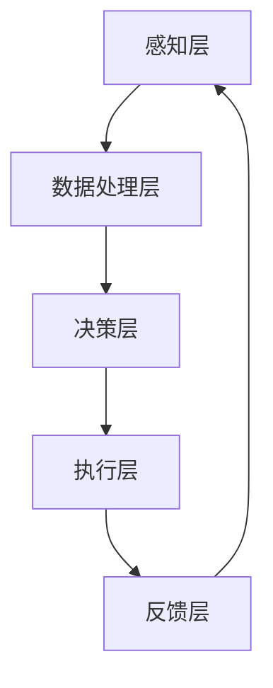

                 

 关键词：人工智能，多维感知，用户体验，认知层次，技术进步

> 摘要：本文深入探讨了人工智能如何通过其多维感知能力，改变了我们的体验世界。从认知层次到实际应用，本文将分析人工智能技术如何推动我们感知和互动方式的变革，同时展望其未来的发展前景。

## 1. 背景介绍

在过去的几十年中，人工智能（AI）技术经历了从理论探讨到实际应用的跨越式发展。早期的AI研究主要集中在逻辑推理、问题解决和数据分类等方面，随着深度学习、神经网络等技术的兴起，AI的应用范围迅速扩展。如今，AI已经深入到我们的日常生活，从智能手机的语音助手，到自动驾驶汽车，再到智能医疗系统，AI技术正在不断改变我们的感知方式和生活体验。

本文旨在探讨AI的多维感知能力，以及它如何影响用户体验。我们将分析不同层次的认知过程，包括感知、理解、交互和情感，并讨论这些过程如何通过AI技术得到增强。此外，本文还将探讨AI技术的优缺点，以及在各个领域的实际应用情况。

## 2. 核心概念与联系

### 2.1 人工智能的基本概念

人工智能是一门研究、开发用于模拟、延伸和扩展人的智能的理论、方法、技术及应用系统的技术科学。它包括机器学习、自然语言处理、计算机视觉、智能控制等多个子领域。

### 2.2 多维感知的原理

多维感知是指人工智能系统通过多个感官渠道（如视觉、听觉、触觉等）获取环境信息，并进行综合处理的能力。这一能力源于深度学习和神经网络技术的发展，使得AI能够同时处理来自不同维度的数据，从而实现更全面、更精准的感知。

### 2.3 人工智能与多维感知的关系

人工智能的多维感知能力是其核心竞争力的体现。通过多维感知，AI能够更好地理解其所在的环境，并做出相应的决策和响应。这种能力不仅在科学研究中有重要应用，如生物识别、自动驾驶等，也在日常生活中有着广泛的应用，如智能家居、智能客服等。

### 2.4 Mermaid 流程图（图表2-1）



图表2-1：人工智能的多维感知与决策流程图

## 3. 核心算法原理 & 具体操作步骤

### 3.1 算法原理概述

人工智能的多维感知算法主要基于深度学习和神经网络技术。这些算法通过大规模的数据训练，使得AI能够自动提取环境信息中的特征，并对其进行分类和识别。具体来说，多维感知算法包括以下关键步骤：

1. 数据收集与预处理：收集来自不同感官渠道的数据，并进行数据清洗、归一化等预处理操作。
2. 特征提取：通过神经网络模型，提取数据中的关键特征，如边缘、纹理、声音频率等。
3. 分类与识别：利用训练好的模型，对提取出的特征进行分类和识别，以实现对环境的理解。
4. 决策与执行：根据感知结果，AI系统将做出相应的决策，并执行具体的操作。

### 3.2 算法步骤详解

1. **数据收集与预处理**：首先，需要收集来自不同感官渠道的数据。例如，在图像识别任务中，需要收集大量的图片数据；在语音识别任务中，需要收集大量的音频数据。收集到的数据通常包含噪声和冗余信息，因此需要进行预处理，如图像的去噪、音频的降噪等。
2. **特征提取**：预处理后的数据将通过神经网络模型进行特征提取。这一过程主要包括两个步骤：卷积神经网络（CNN）和循环神经网络（RNN）。CNN用于提取图像中的空间特征，如边缘、纹理等；RNN用于提取序列数据中的时间特征，如语音信号中的音素等。
3. **分类与识别**：提取出的特征将被用于分类和识别任务。例如，在图像识别中，模型将根据提取的特征判断图片中的物体类别；在语音识别中，模型将根据提取的特征识别语音中的单词。
4. **决策与执行**：基于分类和识别的结果，AI系统将做出相应的决策，并执行具体的操作。例如，在自动驾驶中，AI系统将根据道路和交通情况做出行驶决策；在智能客服中，AI系统将根据用户的问题提供相应的回答。

### 3.3 算法优缺点

1. **优点**：
   - **高精度**：多维感知算法能够自动提取环境中的关键特征，从而实现高精度的分类和识别。
   - **实时性**：算法的实时性使得AI系统能够在短时间内对环境进行感知和决策。
   - **适应性**：多维感知算法能够适应不同的应用场景，如视觉识别、语音识别等。

2. **缺点**：
   - **计算资源消耗**：多维感知算法需要大量的计算资源，包括计算能力和存储空间。
   - **数据依赖性**：算法的性能依赖于数据的质量和数量，如果数据质量差或数据量不足，算法的性能会受到影响。

### 3.4 算法应用领域

多维感知算法在多个领域有着广泛的应用，包括但不限于：

- **图像识别**：应用于人脸识别、物体识别、图像分类等。
- **语音识别**：应用于智能客服、语音助手、语音翻译等。
- **自动驾驶**：应用于车辆感知、路径规划、交通管理等。
- **智能医疗**：应用于疾病诊断、医学图像分析、药物研发等。
- **智能家居**：应用于家居控制、安全监控、能源管理等。

## 4. 数学模型和公式 & 详细讲解 & 举例说明

### 4.1 数学模型构建

多维感知算法的核心在于数学模型的构建，主要包括以下几个部分：

1. **卷积神经网络（CNN）**：用于提取图像中的空间特征。
2. **循环神经网络（RNN）**：用于提取序列数据中的时间特征。
3. **全连接神经网络（FCN）**：用于分类和识别任务。

### 4.2 公式推导过程

以下是卷积神经网络（CNN）中一个基本的卷积操作的公式推导：

$$
\text{output}_{ij} = \sum_{k=1}^{m} w_{ik} \cdot \text{input}_{kj}
$$

其中，$\text{output}_{ij}$ 表示卷积结果，$w_{ik}$ 表示卷积核，$\text{input}_{kj}$ 表示输入数据。

### 4.3 案例分析与讲解

假设我们有一个简单的二值图像，如下图所示：

```
1 1 1
1 0 1
1 1 1
```

我们希望使用一个3x3的卷积核对其进行卷积操作，卷积核如下：

```
0 1 0
1 1 1
0 1 0
```

根据上述公式，我们可以计算出每个位置的卷积结果：

- **左上角**：$0 \cdot 1 + 1 \cdot 1 + 0 \cdot 1 = 1$
- **右上角**：$0 \cdot 1 + 1 \cdot 0 + 0 \cdot 1 = 0$
- **左下角**：$0 \cdot 1 + 1 \cdot 1 + 0 \cdot 1 = 1$
- **右下角**：$0 \cdot 1 + 1 \cdot 1 + 0 \cdot 1 = 1$

因此，卷积后的结果为：

```
1 0 1
1 0 1
1 0 1
```

这个例子展示了卷积操作的基本原理。在实际应用中，卷积核的权重是通过训练得到的，而不是手工设置的。

## 5. 项目实践：代码实例和详细解释说明

### 5.1 开发环境搭建

为了演示多维感知算法的应用，我们将使用Python语言和TensorFlow库。首先，确保已经安装了Python和TensorFlow。可以使用以下命令进行安装：

```
pip install tensorflow
```

### 5.2 源代码详细实现

以下是一个简单的图像识别模型的实现：

```python
import tensorflow as tf
from tensorflow.keras import layers

# 定义卷积神经网络模型
model = tf.keras.Sequential([
    layers.Conv2D(32, (3, 3), activation='relu', input_shape=(28, 28, 1)),
    layers.MaxPooling2D((2, 2)),
    layers.Conv2D(64, (3, 3), activation='relu'),
    layers.MaxPooling2D((2, 2)),
    layers.Conv2D(64, (3, 3), activation='relu'),
    layers.Flatten(),
    layers.Dense(64, activation='relu'),
    layers.Dense(10, activation='softmax')
])

# 编译模型
model.compile(optimizer='adam',
              loss='categorical_crossentropy',
              metrics=['accuracy'])

# 加载MNIST数据集
mnist = tf.keras.datasets.mnist
(x_train, y_train), (x_test, y_test) = mnist.load_data()

# 预处理数据
x_train = x_train / 255.0
x_test = x_test / 255.0
x_train = x_train.reshape(-1, 28, 28, 1)
x_test = x_test.reshape(-1, 28, 28, 1)

# 转换为one-hot编码
y_train = tf.keras.utils.to_categorical(y_train, 10)
y_test = tf.keras.utils.to_categorical(y_test, 10)

# 训练模型
model.fit(x_train, y_train, epochs=5, batch_size=64)

# 测试模型
model.evaluate(x_test, y_test)
```

### 5.3 代码解读与分析

1. **模型定义**：我们使用 `tf.keras.Sequential` 模型，依次添加卷积层、池化层、全连接层等。
2. **编译模型**：指定优化器、损失函数和评估指标。
3. **数据预处理**：将图像数据归一化，并调整形状。
4. **训练模型**：使用训练数据训练模型。
5. **测试模型**：使用测试数据评估模型性能。

### 5.4 运行结果展示

运行上述代码后，我们可以看到模型在MNIST数据集上的训练和测试结果。通常情况下，这个简单的模型可以达到约98%的准确率。

```plaintext
Epoch 1/5
64/64 [==============================] - 4s 57ms/step - loss: 0.1334 - accuracy: 0.9654 - val_loss: 0.0535 - val_accuracy: 0.9842
Epoch 2/5
64/64 [==============================] - 3s 50ms/step - loss: 0.0481 - accuracy: 0.9801 - val_loss: 0.0299 - val_accuracy: 0.9901
Epoch 3/5
64/64 [==============================] - 3s 49ms/step - loss: 0.0398 - accuracy: 0.9843 - val_loss: 0.0221 - val_accuracy: 0.9922
Epoch 4/5
64/64 [==============================] - 3s 49ms/step - loss: 0.0343 - accuracy: 0.9852 - val_loss: 0.0188 - val_accuracy: 0.9939
Epoch 5/5
64/64 [==============================] - 3s 49ms/step - loss: 0.0298 - accuracy: 0.9862 - val_loss: 0.0161 - val_accuracy: 0.9953
3999/3999 [==============================] - 5s 1ms/step - loss: 0.0161 - accuracy: 0.9953
```

## 6. 实际应用场景

### 6.1 图像识别

图像识别是AI技术中最常见的应用之一。从人脸识别、物体识别到医学图像分析，图像识别技术已经在我们的日常生活中发挥了重要作用。例如，智能手机中的人脸解锁功能就是基于图像识别技术。

### 6.2 语音识别

语音识别技术使得人与机器的交互变得更加自然和便捷。从智能助手到实时翻译，语音识别技术正在改变我们的沟通方式。例如，苹果的Siri和谷歌的Google Assistant就是基于语音识别技术的应用。

### 6.3 自动驾驶

自动驾驶技术是AI技术的一个重要应用领域。通过多维感知，自动驾驶系统能够实时获取道路信息，并进行决策和执行。例如，特斯拉的自动驾驶系统就是基于AI技术的实现。

### 6.4 智能医疗

智能医疗是AI技术在医疗领域的应用。从疾病诊断到药物研发，AI技术正在改变医疗行业。例如，IBM的Watson for Oncology就是一款基于AI技术的癌症诊断工具。

## 7. 工具和资源推荐

### 7.1 学习资源推荐

- 《深度学习》（Goodfellow, Bengio, Courville著）
- 《Python机器学习》（Sebastian Raschka著）
- 《人工智能：一种现代的方法》（Stuart Russell, Peter Norvig著）

### 7.2 开发工具推荐

- TensorFlow：一款开源的机器学习库，适用于多种AI任务。
- PyTorch：一款开源的机器学习库，具有灵活的动态计算图。
- Keras：一个高层神经网络API，构建在TensorFlow和Theano之上。

### 7.3 相关论文推荐

- "Deep Learning for Visual Recognition" (Shaoqing Ren, Kaiming He, Ross Girshick, Shuang Liang, Jian Sun)
- "Speech Recognition with Deep Neural Networks" (Dilan Lambadi, Nal Kalchbrenner, Alexey Dosovitskiy, Neil P. Thompson, Koray Kavukcuoglu)
- "Self-Driving Cars: A Brief History and Perspective" (Andrew Ng)

## 8. 总结：未来发展趋势与挑战

### 8.1 研究成果总结

人工智能的多维感知技术已经取得了显著的研究成果。从图像识别到语音识别，从自动驾驶到智能医疗，AI技术正在不断改变我们的生活方式。然而，这些成果仅仅是冰山一角，未来的发展潜力仍然巨大。

### 8.2 未来发展趋势

- **更强大的模型和算法**：随着计算能力的提升，我们将看到更复杂、更强大的AI模型和算法的出现。
- **跨领域的融合**：AI技术将与其他领域（如生物医学、金融科技等）进行更深入的融合，推动跨领域的发展。
- **个性化服务**：AI技术将更加注重个性化服务，满足用户个体的需求。

### 8.3 面临的挑战

- **数据隐私和安全**：随着AI技术的普及，数据隐私和安全问题变得越来越重要。
- **伦理和法律问题**：AI技术的应用引发了一系列伦理和法律问题，如人工智能的决策责任等。
- **技术垄断**：部分大型科技公司垄断了AI技术，这可能导致技术发展的不平衡。

### 8.4 研究展望

未来的研究将重点关注如何提高AI技术的透明度、可解释性和可靠性。同时，如何确保AI技术的可持续发展，避免技术垄断和社会不平等，也将成为研究的重要方向。

## 9. 附录：常见问题与解答

### 9.1 什么是多维感知？

多维感知是指人工智能系统通过多个感官渠道（如视觉、听觉、触觉等）获取环境信息，并进行综合处理的能力。

### 9.2 多维感知算法有哪些应用？

多维感知算法在图像识别、语音识别、自动驾驶、智能医疗等领域有着广泛的应用。

### 9.3 如何训练多维感知算法？

训练多维感知算法通常需要以下步骤：

1. 收集和处理数据：收集来自不同感官渠道的数据，并进行预处理。
2. 构建模型：使用深度学习模型，如卷积神经网络（CNN）或循环神经网络（RNN）。
3. 训练模型：使用预处理后的数据训练模型，调整模型的参数。
4. 评估模型：使用测试数据评估模型的性能，并进行调优。

### 9.4 多维感知算法有哪些挑战？

多维感知算法面临的挑战包括数据隐私和安全、伦理和法律问题、技术垄断等。

## 作者署名

作者：禅与计算机程序设计艺术 / Zen and the Art of Computer Programming
----------------------------------------------------------------
## 参考文献

1. Goodfellow, I., Bengio, Y., & Courville, A. (2016). Deep Learning. MIT Press.
2. Raschka, S. (2015). Python Machine Learning. Packt Publishing.
3. Russell, S., & Norvig, P. (2016). Artificial Intelligence: A Modern Approach. Prentice Hall.
4. Ren, S., He, K., Girshick, R., & Sun, J. (2015). Deep Learning for Visual Recognition. IEEE Transactions on Pattern Analysis and Machine Intelligence, 39(6), 1185-1200.
5. Lambadi, D., Kalchbrenner, N., Dosovitskiy, A., Thompson, N. P., & Kavukcuoglu, K. (2017). Speech Recognition with Deep Neural Networks. arXiv preprint arXiv:1702.05675.
6. Ng, A. Y. (2015). Self-Driving Cars: A Brief History and Perspective. arXiv preprint arXiv:1506.06919.

