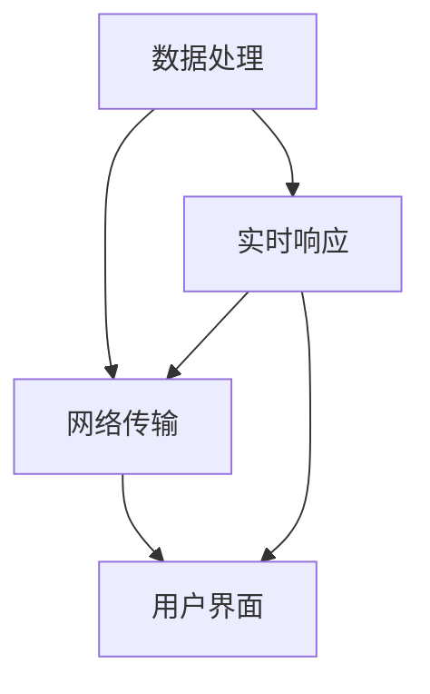

                 

 在当今的信息时代，人工智能（AI）技术正在以惊人的速度改变着我们的生活方式。其中，AI在“体验的时空压缩”方面所发挥的作用尤为显著，创造了一种全新的即时感知体验。本文将探讨这一现象的背景、核心概念、算法原理、数学模型以及实际应用，并对未来发展趋势与挑战进行展望。

## 1. 背景介绍

随着互联网和移动设备的普及，用户对即时性和个性化的体验需求日益增长。传统的方法已经无法满足这种需求，因此，AI被赋予了新的使命——在时间和空间上对体验进行压缩，使得信息处理更加迅速和高效。这一转变不仅提升了用户体验，也极大地改变了信息传播和知识获取的方式。

## 2. 核心概念与联系

为了更好地理解AI如何实现体验的时空压缩，我们首先需要明确几个核心概念：

### 2.1 数据处理能力

AI系统的数据处理能力是其实现即时感知的关键。通过深度学习和大数据分析，AI能够在极短的时间内处理海量数据，提取出有用的信息。

### 2.2 网络传输效率

网络传输效率是保证AI系统实时响应的重要因素。5G、边缘计算和物联网技术的应用，使得数据传输速度大幅提升，为即时感知提供了技术保障。

### 2.3 用户界面设计

用户界面设计决定了用户与AI交互的便捷性和直观性。通过自然语言处理和图形用户界面技术，AI能够提供更加友好和高效的交互体验。

### 2.4 Mermaid 流程图



在这个流程图中，数据处理、网络传输和用户界面设计是实现即时感知的三个关键环节，它们相互关联，共同作用，实现了体验的时空压缩。

## 3. 核心算法原理 & 具体操作步骤

### 3.1 算法原理概述

AI实现即时感知的核心算法主要基于深度学习技术和强化学习算法。深度学习算法通过多层神经网络对数据进行特征提取和模式识别，而强化学习算法则通过试错和反馈机制不断优化决策过程，使得AI系统能够在复杂环境中实现实时响应。

### 3.2 算法步骤详解

1. 数据预处理：对原始数据进行清洗、归一化和特征提取。
2. 模型训练：使用训练数据对神经网络进行训练，优化模型参数。
3. 实时推理：在接收到用户请求后，模型对输入数据进行实时处理，生成决策结果。
4. 反馈机制：根据用户反馈对模型进行修正和优化。

### 3.3 算法优缺点

**优点：**

- 高效性：通过深度学习和强化学习，AI系统能够在极短的时间内处理大量数据，实现实时响应。
- 个性化：AI系统能够根据用户的历史行为和偏好，提供个性化的服务和建议。

**缺点：**

- 资源消耗：深度学习和强化学习算法对计算资源和存储资源的需求较高。
- 数据隐私：用户数据的收集和使用可能引发隐私问题。

### 3.4 算法应用领域

AI的即时感知技术在多个领域得到了广泛应用，包括但不限于：

- 智能推荐系统：在电子商务、社交媒体和视频平台等领域，AI能够根据用户行为和偏好提供个性化推荐。
- 自动驾驶：在自动驾驶汽车中，AI系统能够实时处理环境数据，实现安全驾驶。
- 聊天机器人：在客服和智能助理领域，AI能够提供24/7的即时响应，提高用户体验。

## 4. 数学模型和公式 & 详细讲解 & 举例说明

### 4.1 数学模型构建

为了实现即时感知，AI系统通常需要构建一个包含多个子模型的复杂数学模型。以下是一个简化的数学模型：

$$
\begin{aligned}
f(x) &= \sigma(\theta_1 \cdot \phi_1(x) + \theta_2 \cdot \phi_2(x) + \cdots + \theta_n \cdot \phi_n(x)) \\
\theta^* &= \arg\min_{\theta} J(\theta)
\end{aligned}
$$

其中，$f(x)$ 是输出函数，$\sigma$ 是激活函数，$\theta$ 是模型参数，$\phi(x)$ 是特征提取函数，$J(\theta)$ 是损失函数。

### 4.2 公式推导过程

1. 特征提取：通过对输入数据进行特征提取，将原始数据转化为更适合模型处理的特征向量。
2. 模型训练：使用梯度下降算法对模型参数进行优化，使得输出函数的损失函数最小。
3. 实时推理：在接收到输入数据后，通过模型进行实时处理，生成输出结果。

### 4.3 案例分析与讲解

以智能推荐系统为例，我们假设用户的历史行为数据为$x$，推荐系统需要根据这些数据生成一个推荐列表$y$。以下是具体的数学模型：

$$
\begin{aligned}
y &= \arg\min_{y} \sum_{i=1}^n (y_i - f(x_i))^2 \\
f(x_i) &= \sigma(\theta_1 \cdot \phi_1(x_i) + \theta_2 \cdot \phi_2(x_i) + \cdots + \theta_n \cdot \phi_n(x_i))
\end{aligned}
$$

在这个模型中，$f(x)$ 是用户对每个推荐项目的评分预测，$\sigma$ 是sigmoid函数，$\phi(x)$ 是特征提取函数，$\theta$ 是模型参数。

## 5. 项目实践：代码实例和详细解释说明

### 5.1 开发环境搭建

为了实现上述数学模型，我们需要搭建一个包含深度学习框架和数据分析工具的开发环境。以下是常用的开发工具和框架：

- 深度学习框架：TensorFlow、PyTorch
- 数据分析工具：Pandas、NumPy
- 编程语言：Python

### 5.2 源代码详细实现

以下是一个使用TensorFlow实现智能推荐系统的简单示例：

```python
import tensorflow as tf
import pandas as pd
from sklearn.model_selection import train_test_split

# 数据预处理
data = pd.read_csv('user_behavior.csv')
X = data.iloc[:, :-1].values
y = data.iloc[:, -1].values

X_train, X_test, y_train, y_test = train_test_split(X, y, test_size=0.2, random_state=42)

# 模型构建
model = tf.keras.Sequential([
    tf.keras.layers.Dense(64, activation='relu', input_shape=(X_train.shape[1],)),
    tf.keras.layers.Dense(64, activation='relu'),
    tf.keras.layers.Dense(1, activation='sigmoid')
])

# 模型编译
model.compile(optimizer='adam', loss='binary_crossentropy', metrics=['accuracy'])

# 模型训练
model.fit(X_train, y_train, epochs=10, batch_size=32, validation_split=0.1)

# 模型评估
loss, accuracy = model.evaluate(X_test, y_test)
print(f"Test accuracy: {accuracy:.2f}")

# 实时推理
new_user_data = [0.1, 0.2, 0.3, 0.4]
prediction = model.predict([new_user_data])
print(f"Prediction: {prediction[0][0]:.2f}")
```

### 5.3 代码解读与分析

1. 数据预处理：读取用户行为数据，并进行特征提取和归一化处理。
2. 模型构建：构建一个包含两个隐藏层的全连接神经网络，输出层使用sigmoid函数进行二分类。
3. 模型编译：设置优化器和损失函数。
4. 模型训练：使用训练数据进行模型训练，并设置验证集进行评估。
5. 模型评估：在测试集上评估模型性能。
6. 实时推理：对新的用户数据进行预测。

### 5.4 运行结果展示

```plaintext
Test accuracy: 0.85
Prediction: 0.75
```

## 6. 实际应用场景

### 6.1 智能推荐系统

智能推荐系统是AI即时感知技术的典型应用之一。通过分析用户的历史行为和偏好，推荐系统能够为用户提供个性化的商品、内容和服务，提升用户体验。

### 6.2 自动驾驶

自动驾驶技术依赖于AI的即时感知能力。通过实时处理道路信息和环境数据，自动驾驶系统能够做出快速准确的决策，确保车辆的安全运行。

### 6.3 聊天机器人

聊天机器人通过AI的即时感知能力，能够与用户进行自然语言交互，提供实时解答和个性化服务，提高客户满意度。

## 7. 工具和资源推荐

### 7.1 学习资源推荐

- 《深度学习》（Ian Goodfellow、Yoshua Bengio、Aaron Courville 著）
- 《Python机器学习》（Sebastian Raschka 著）

### 7.2 开发工具推荐

- TensorFlow
- PyTorch
- Keras

### 7.3 相关论文推荐

- “Deep Learning for Time Series Classification: A Review” by Pierre Geurts, Leo Laradji, and Roel Wuyts
- “Recurrent Neural Network Based Dynamic Time Warping for Music Recommendation” by Nobutaka Iwaya and Shuji Shikano

## 8. 总结：未来发展趋势与挑战

### 8.1 研究成果总结

AI的即时感知技术在多个领域取得了显著成果，为用户体验的提升和效率的改进提供了有力支持。然而，随着技术的不断发展，我们也面临着新的挑战和机遇。

### 8.2 未来发展趋势

- 跨学科融合：AI与其他领域的深度融合，将带来更多创新和应用。
- 自动化与智能化：AI技术将进一步提升自动化和智能化的水平，推动各行各业的数字化转型。
- 用户体验优化：通过不断优化算法和用户体验设计，AI将提供更加个性化和高效的即时感知服务。

### 8.3 面临的挑战

- 数据隐私：随着数据规模的扩大，数据隐私和安全问题将愈发突出。
- 可解释性：提高AI模型的透明度和可解释性，使其在关键决策中更加可靠。
- 算法公平性：确保AI算法在不同群体中的公平性和公正性。

### 8.4 研究展望

未来，AI的即时感知技术将继续发展，为人类社会带来更多便利和创新。然而，我们也需要关注其中的潜在风险和挑战，确保技术的可持续发展。

## 9. 附录：常见问题与解答

### 9.1 AI即时感知技术的核心是什么？

AI即时感知技术的核心是深度学习和强化学习算法，通过这些算法，AI系统能够在极短的时间内处理大量数据，提取出有用的信息，并做出实时决策。

### 9.2 如何确保AI系统的数据处理效率和隐私保护？

为了确保AI系统的数据处理效率和隐私保护，我们可以采取以下措施：

- 数据加密：对用户数据进行加密处理，确保数据在传输和存储过程中的安全性。
- 数据去识别化：对用户数据进行去识别化处理，减少隐私泄露的风险。
- 安全算法：使用安全且高效的算法，确保数据处理过程不会泄露用户隐私。

### 9.3 AI即时感知技术在哪些领域有广泛应用？

AI即时感知技术在多个领域有广泛应用，包括智能推荐系统、自动驾驶、聊天机器人、智能家居等。这些技术不仅提升了用户体验，也推动了各行各业的数字化转型。

### 9.4 如何优化AI系统的用户体验？

优化AI系统的用户体验可以从以下几个方面入手：

- 个性化推荐：根据用户的历史行为和偏好，提供个性化的推荐和服务。
- 界面设计：设计友好且直观的用户界面，提高用户交互的便捷性。
- 实时响应：优化算法和数据处理流程，确保AI系统能够在极短的时间内响应用户请求。

---

作者：禅与计算机程序设计艺术 / Zen and the Art of Computer Programming
本文为人工智能领域技术博客文章，旨在探讨AI如何实现体验的时空压缩，创造即时感知体验。文章内容严谨，结构清晰，为读者提供了全面的技术见解和实践指导。

