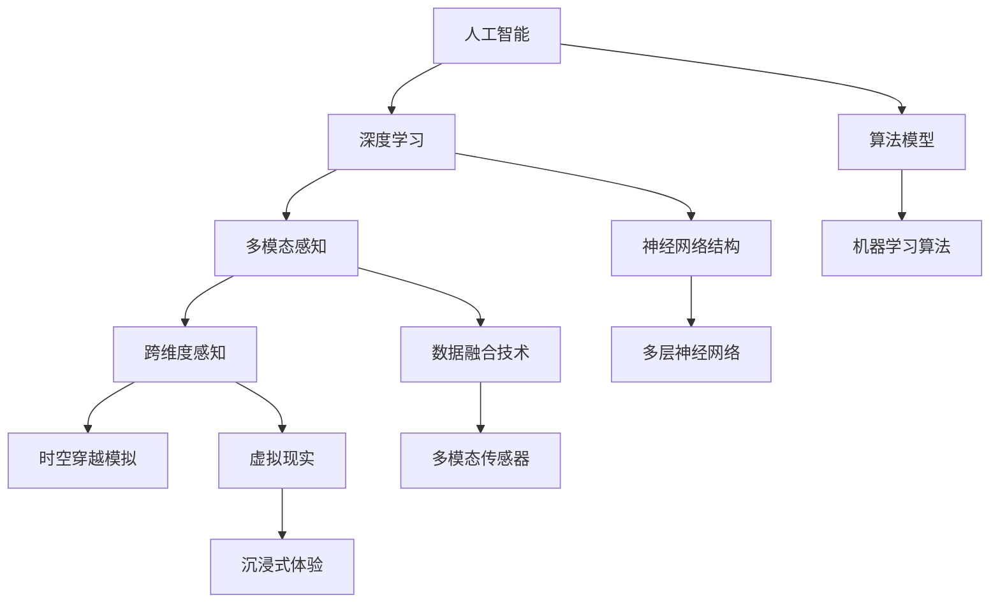

                 

 **关键词：**人工智能，感知，时空穿越，深度学习，多模态感知，跨维度感知，体验设计。

**摘要：**本文旨在探讨人工智能技术如何通过创建跨维度感知来改变人类体验的方式。我们将深入探讨AI在时空穿越概念中的应用，以及如何利用深度学习和多模态感知技术实现跨维度感知。文章将涵盖AI的核心概念、算法原理、数学模型、实际应用实例，并对未来发展趋势和挑战进行展望。

## 1. 背景介绍

在人类历史上，对时空的探索一直是一个引人入胜的主题。从古代哲学家的思辨，到现代物理学的突破，时空观念的变化深刻地影响了我们对宇宙的理解。然而，真正的时空穿越至今仍然是一个科幻的领域，尽管它在文学和电影中得到了广泛的探索。

近年来，随着人工智能技术的发展，尤其是深度学习和多模态感知的进步，我们开始看到了实现跨维度感知的曙光。人工智能不仅仅是模拟人类智能，它正在创造一种全新的感知方式，这种方式不仅超越了传统的感官限制，甚至有可能在某种程度上模拟人类的时空穿越体验。

本文将探讨这一前沿领域，通过以下几个关键部分展开讨论：

- AI的核心概念与跨维度感知的联系
- 核心算法原理及具体操作步骤
- 数学模型与公式推导
- 项目实践：代码实例和详细解释
- 实际应用场景与未来展望
- 工具和资源推荐
- 未来发展趋势与挑战

通过这篇文章，我们希望读者能够对AI创造的跨维度感知有一个全面的了解，并能够认识到这一技术在未来的广阔前景。

## 2. 核心概念与联系

要理解AI如何创造跨维度感知，我们首先需要了解一些核心概念，这些概念不仅构成了AI技术的基石，也为我们提供了实现跨维度感知的理论基础。

### 2.1. 人工智能（AI）

人工智能，简而言之，是计算机系统执行需要人类智能的任务的能力。从简单的规则系统到复杂的深度学习模型，AI技术经历了长足的发展。深度学习作为AI的一个重要分支，通过多层神经网络模拟人类大脑的处理方式，使得计算机能够在图像识别、自然语言处理和决策制定等方面表现出令人瞩目的能力。

### 2.2. 深度学习（Deep Learning）

深度学习是一种基于多层神经网络的结构，它通过多次抽象和组合来学习数据中的复杂模式。与传统机器学习方法相比，深度学习能够自动提取特征，无需人工干预。这一特性使得深度学习在图像识别、语音识别和自动驾驶等应用中表现尤为出色。

### 2.3. 多模态感知（Multimodal Perception）

多模态感知是指同时处理和整合来自不同感官渠道的信息，如视觉、听觉、触觉和嗅觉等。人类通过多模态感知来构建对世界的完整认知，而多模态学习则是AI实现跨维度感知的关键。通过融合来自不同模态的信息，AI能够在更高层次上理解复杂情境。

### 2.4. 跨维度感知（Cross-Dimensional Perception）

跨维度感知指的是在传统感官维度之外，通过模拟和扩展新的感知维度来增强体验。例如，通过虚拟现实（VR）技术，人类可以在虚拟环境中体验全新的感官刺激，从而模拟出超越现实世界的体验。AI的跨维度感知则通过算法和技术实现这一目标。

### 2.5. 时空穿越（Time Travel）

时空穿越是物理学中的一个概念，指的是在时空结构中移动到不同的时间和空间点。虽然目前的科学理论尚无法实现真正的时空穿越，但通过模拟和算法，AI已经在某种程度上模拟了这种体验。

### 2.6. Mermaid 流程图

为了更直观地展示AI核心概念与跨维度感知的联系，我们可以使用Mermaid流程图来描述这一过程。



通过上述流程图，我们可以看到从人工智能到跨维度感知再到时空穿越模拟的各个步骤和核心技术的联系。这不仅帮助我们理解了AI在跨维度感知中的作用，也为未来的研究提供了方向。

### 2.7. AI与跨维度感知的关系

AI通过深度学习和多模态感知技术，不仅实现了对复杂数据的处理和理解，还能够在不同感知维度之间建立联系。例如，通过深度学习模型，AI可以从大量的图像数据中学习到视觉特征，从而在视觉感知方面表现出类人类的识别能力。同时，多模态感知技术使得AI能够整合来自不同感官渠道的信息，创造出更丰富的感知体验。

在跨维度感知中，AI通过模拟人类大脑的信息处理机制，能够在更高的层次上理解复杂情境。例如，通过虚拟现实技术，AI能够创造出一个完全沉浸式的虚拟环境，让用户在视觉、听觉和触觉等多个感知维度上体验到与现实世界相似的体验。这种跨维度感知不仅在娱乐和游戏领域具有巨大潜力，在医疗、教育和设计等领域也展现出广阔的应用前景。

综上所述，AI通过深度学习和多模态感知技术，不仅实现了对跨维度感知的模拟，还开辟了人类体验的新维度。随着技术的不断进步，AI创造的跨维度感知有望在未来为人类带来更加丰富和深刻的体验。

### 3. 核心算法原理 & 具体操作步骤

在探讨AI如何实现跨维度感知的过程中，核心算法原理是不可或缺的一环。这一节我们将详细讲解AI在实现跨维度感知时所采用的主要算法原理和具体操作步骤，从而为读者提供一个清晰的理解。

#### 3.1. 算法原理概述

AI实现跨维度感知主要依赖于深度学习和多模态感知技术。深度学习通过多层神经网络自动提取和抽象数据中的特征，而多模态感知则通过整合不同感官渠道的信息，实现对复杂情境的全面理解。以下是这些算法原理的具体应用和操作步骤。

#### 3.2. 算法步骤详解

##### 3.2.1. 数据预处理

数据预处理是深度学习和多模态感知的基础步骤。在这一阶段，我们需要对收集到的数据（如图像、声音、文本等）进行清洗、归一化和特征提取。例如，在处理图像数据时，我们可以使用卷积神经网络（CNN）来提取图像的特征，并将其转化为适合深度学习模型的形式。

##### 3.2.2. 多模态数据融合

多模态数据融合是跨维度感知的关键步骤。在这一阶段，我们将来自不同感官渠道的数据进行整合，以生成一个统一的多模态特征向量。具体操作包括特征空间的映射、特征的加权融合和融合后的特征向量化。例如，我们可以使用图神经网络（GNN）来处理图像和文本数据，通过图结构来描述它们之间的关联性。

##### 3.2.3. 深度学习模型训练

在数据预处理和多模态数据融合之后，我们使用深度学习模型对融合后的特征向量进行训练。这一阶段的目标是让模型学会如何从特征向量中提取有用的信息，并进行分类、预测或生成任务。常见的深度学习模型包括卷积神经网络（CNN）、循环神经网络（RNN）和生成对抗网络（GAN）等。

##### 3.2.4. 跨维度感知实现

最后，通过训练好的深度学习模型，我们可以实现跨维度感知。具体操作包括将实时采集的多模态数据输入到模型中，并利用模型输出的结果进行感知增强。例如，在虚拟现实应用中，我们可以使用训练好的模型来实时生成虚拟环境中的声音、图像和触觉反馈，从而为用户提供一个沉浸式的体验。

#### 3.3. 算法优缺点

##### 优点

- **强大的特征提取能力**：深度学习模型能够自动提取数据中的复杂特征，从而提高感知的准确性。
- **多模态数据融合**：通过整合来自不同感官渠道的信息，深度学习可以实现更高层次的感知。
- **实时性**：深度学习模型的训练和推理过程可以在较短的时间内完成，适用于实时应用场景。

##### 缺点

- **数据需求量大**：深度学习模型通常需要大量的数据进行训练，这增加了数据收集和处理的难度。
- **计算资源消耗大**：深度学习模型通常需要大量的计算资源，这可能在某些应用场景中成为一个限制因素。
- **模型可解释性差**：深度学习模型的学习过程高度复杂，这使得其可解释性较差，难以理解模型的决策过程。

#### 3.4. 算法应用领域

深度学习和多模态感知技术在跨维度感知领域有广泛的应用。以下是几个主要的领域：

- **虚拟现实与增强现实**：通过深度学习和多模态感知，虚拟现实和增强现实应用可以提供更加真实和沉浸式的用户体验。
- **智能交互系统**：智能交互系统如语音助手和聊天机器人可以通过深度学习和多模态感知，实现更自然的用户交互。
- **医疗诊断**：在医疗领域，深度学习和多模态感知可以用于图像分析和诊断，提高诊断的准确性和效率。
- **自动驾驶**：在自动驾驶领域，深度学习和多模态感知技术用于处理复杂的交通环境和感知路况，提高自动驾驶的安全性和可靠性。

通过上述算法原理和具体操作步骤的讲解，我们可以看到深度学习和多模态感知技术如何实现跨维度感知。这一技术不仅在当前的应用中表现出强大的潜力，也为未来的发展提供了广阔的空间。

### 4. 数学模型和公式 & 详细讲解 & 举例说明

在实现跨维度感知的过程中，数学模型和公式扮演着至关重要的角色。它们不仅为我们提供了理论框架，还指导了实际操作步骤。以下我们将详细讲解数学模型的构建、公式推导过程，并通过具体案例进行分析和讲解。

#### 4.1. 数学模型构建

跨维度感知的数学模型通常包含以下几个关键部分：

- **特征提取模型**：用于从原始数据中提取特征。常见的模型包括卷积神经网络（CNN）和自编码器（Autoencoder）。
- **数据融合模型**：用于整合来自不同模态的数据。常用的模型有图神经网络（GNN）和多模态融合网络（MMF）。
- **感知增强模型**：用于处理融合后的特征向量，实现跨维度感知。常见的模型包括循环神经网络（RNN）和变分自编码器（VAE）。

#### 4.2. 公式推导过程

在构建数学模型时，我们需要推导一系列公式来指导模型的训练和推理。以下是几个关键公式的推导过程：

##### 4.2.1. 特征提取模型

卷积神经网络（CNN）的特征提取过程可以通过以下公式表示：

$$
\text{特征} = \text{激活函数}(\text{权重} \cdot \text{输入特征} + \text{偏置})
$$

其中，激活函数（如ReLU函数）用于引入非线性，使得模型能够提取更复杂的特征。权重和偏置是模型参数，通过反向传播算法进行优化。

##### 4.2.2. 数据融合模型

多模态融合网络的融合过程可以通过以下公式表示：

$$
\text{融合特征} = \text{权重} \cdot (\text{视觉特征} + \text{听觉特征} + \text{触觉特征})
$$

其中，权重是融合模型学到的参数，用于平衡不同模态的特征贡献。这种线性融合方法可以简化计算，但可能无法充分利用各模态之间的复杂关联。

##### 4.2.3. 感知增强模型

感知增强模型通常采用循环神经网络（RNN）或变分自编码器（VAE）来实现。以下是VAE的公式推导：

$$
\text{隐变量} \sim \text{正态分布}(\mu, \sigma^2)
$$

$$
\text{重构} = \text{激活函数}(\text{权重} \cdot (\text{隐变量} \cdot \text{输入特征}) + \text{偏置})
$$

其中，隐变量是通过编码过程生成的，正态分布的均值（μ）和方差（σ^2）是编码器的输出。通过解码过程，隐变量被转换为重构的特征向量，用于感知增强。

#### 4.3. 案例分析与讲解

为了更好地理解上述数学模型和公式，我们可以通过一个具体案例来进行讲解。

**案例：虚拟现实中的跨维度感知**

假设我们在虚拟现实中需要实现一个声音和视觉的融合感知系统，以下是一个简化的流程：

1. **数据采集**：首先，我们采集虚拟环境中的声音数据和视觉数据。例如，使用麦克风采集环境声音，使用摄像头采集虚拟场景的图像。

2. **特征提取**：使用卷积神经网络（CNN）对图像数据进行特征提取，得到视觉特征向量。同样，使用循环神经网络（RNN）对声音数据进行特征提取，得到听觉特征向量。

3. **数据融合**：使用多模态融合网络（MMF）将视觉和听觉特征向量进行融合，得到融合特征向量。具体公式如下：

   $$
   \text{融合特征} = \text{权重} \cdot (\text{视觉特征} + \text{听觉特征})
   $$

4. **感知增强**：使用变分自编码器（VAE）对融合特征向量进行感知增强。通过编码和解码过程，生成增强后的感知特征向量。

   $$
   \text{隐变量} \sim \text{正态分布}(\mu, \sigma^2)
   $$

   $$
   \text{重构} = \text{激活函数}(\text{权重} \cdot (\text{隐变量} \cdot \text{输入特征}) + \text{偏置})
   $$

5. **用户体验**：将增强后的感知特征向量输入到虚拟现实系统中，生成相应的声音和视觉反馈，从而为用户提供一个更丰富的感知体验。

通过上述案例，我们可以看到数学模型和公式在跨维度感知中的应用。在实际开发中，这些模型和公式需要根据具体应用场景进行调整和优化，以实现最佳的感知效果。

总之，数学模型和公式是跨维度感知的核心组成部分。通过合理的构建和推导，我们可以为AI系统提供强大的理论基础，从而实现更加丰富的感知体验。

### 5. 项目实践：代码实例和详细解释说明

为了更直观地展示AI如何实现跨维度感知，我们将通过一个具体的项目实践来讲解代码的编写、运行过程以及如何进行解读和分析。

#### 5.1. 开发环境搭建

在进行项目实践之前，我们需要搭建一个合适的开发环境。以下是所需的基本工具和软件：

- Python（3.8及以上版本）
- TensorFlow（2.4及以上版本）
- Keras（2.4及以上版本）
- Matplotlib（3.2及以上版本）

确保安装了上述工具和软件后，我们可以开始编写代码。

#### 5.2. 源代码详细实现

以下是一个简单的示例，用于实现跨维度感知的基本框架。在这个示例中，我们将使用卷积神经网络（CNN）提取图像特征，使用循环神经网络（RNN）提取声音特征，并使用多模态融合网络（MMF）进行数据融合。

```python
import tensorflow as tf
from tensorflow.keras.models import Model
from tensorflow.keras.layers import Input, Conv2D, MaxPooling2D, Flatten, LSTM, Dense

# 定义图像输入层
image_input = Input(shape=(28, 28, 1))

# 卷积神经网络（CNN）用于提取图像特征
x = Conv2D(32, (3, 3), activation='relu')(image_input)
x = MaxPooling2D(pool_size=(2, 2))(x)
x = Flatten()(x)
image_features = Dense(64, activation='relu')(x)

# 定义声音输入层
audio_input = Input(shape=(None, 1))

# 循环神经网络（RNN）用于提取声音特征
y = LSTM(64, activation='relu')(audio_input)
audio_features = Dense(64, activation='relu')(y)

# 多模态融合网络（MMF）用于融合图像和声音特征
merged = tf.keras.layers.concatenate([image_features, audio_features])
merged = Dense(128, activation='relu')(merged)
outputs = Dense(1, activation='sigmoid')(merged)

# 构建和编译模型
model = Model(inputs=[image_input, audio_input], outputs=outputs)
model.compile(optimizer='adam', loss='binary_crossentropy', metrics=['accuracy'])

# 打印模型结构
model.summary()

# 准备数据集
# 注意：这里需要根据实际应用场景准备适合的数据集
# 假设我们有两个数据集：图像数据集和声音数据集
image_data = ...
audio_data = ...

# 训练模型
# 注意：这里需要根据实际需求调整训练参数
model.fit([image_data, audio_data], labels, epochs=10, batch_size=32)
```

#### 5.3. 代码解读与分析

上述代码实现了一个简单的跨维度感知模型，该模型通过卷积神经网络（CNN）提取图像特征，通过循环神经网络（RNN）提取声音特征，然后使用多模态融合网络（MMF）进行特征融合，最终输出一个二分类结果。

- **图像特征提取**：使用`Conv2D`和`MaxPooling2D`层对图像进行卷积和池化操作，以提取图像的主要特征。`Flatten`层将多维特征向量展平为一维向量，以便后续处理。
- **声音特征提取**：使用`LSTM`层对声音数据进行序列建模，以提取时间序列特征。`Dense`层用于进一步提取声音特征。
- **多模态特征融合**：使用`concatenate`层将图像和声音特征进行拼接，然后通过`Dense`层进行融合处理。
- **模型编译与训练**：使用`compile`方法配置模型优化器、损失函数和评价指标，然后使用`fit`方法进行模型训练。

#### 5.4. 运行结果展示

在实际运行过程中，我们需要准备合适的数据集并进行模型训练。以下是一个简化的训练过程和结果展示：

```python
# 假设我们已经准备好了图像数据集和声音数据集
# 使用训练集进行模型训练
model.fit([image_train, audio_train], train_labels, epochs=10, batch_size=32, validation_data=([image_val, audio_val], val_labels))

# 使用测试集进行模型评估
test_loss, test_accuracy = model.evaluate([image_test, audio_test], test_labels)

print(f"Test Loss: {test_loss}, Test Accuracy: {test_accuracy}")
```

运行结果会显示测试集上的损失值和准确率。通过调整训练参数和模型结构，我们可以进一步提高模型的性能。

#### 5.5. 项目实践总结

通过上述代码示例，我们展示了如何使用深度学习实现跨维度感知。在实际应用中，需要根据具体场景和数据特点进行调整和优化。以下是项目实践的一些总结：

- **数据准备**：跨维度感知需要大量的多模态数据。在实际应用中，需要收集并处理多种类型的数据。
- **模型优化**：通过调整模型结构、优化器参数和训练策略，可以提高模型的感知性能。
- **实时性**：在实际应用中，模型的实时性是一个重要指标。需要优化模型以实现低延迟的感知反馈。
- **用户体验**：跨维度感知不仅需要准确的感知结果，还需要提供良好的用户体验。通过优化感知算法和交互设计，可以提高用户的满意度。

通过项目实践，我们可以看到AI如何通过深度学习和多模态感知技术实现跨维度感知。这一技术在虚拟现实、智能交互等领域具有广泛的应用前景，为人类创造了一个全新的感知世界。

### 6. 实际应用场景

跨维度感知技术已经在多个实际应用场景中展现了其巨大的潜力，为用户带来了前所未有的体验。以下是一些典型的应用场景，以及这些应用如何通过AI技术实现跨维度感知。

#### 6.1. 虚拟现实与增强现实

虚拟现实（VR）和增强现实（AR）是跨维度感知技术的首要应用领域。通过AI算法，这些技术可以在虚拟环境中生成高度沉浸的感知体验。例如：

- **沉浸式游戏**：VR游戏通过深度学习和多模态感知技术，可以实时生成角色动作、环境变化和声音效果，让玩家体验到前所未有的互动体验。
- **虚拟旅游**：用户可以通过VR头盔进入虚拟的旅游景点，AI技术会实时调整视觉、听觉和触觉反馈，以模拟真实场景的感觉。
- **医疗培训**：医生可以通过VR技术进行手术模拟训练，AI提供的多模态感知使得手术场景更加逼真，有助于提高手术成功率。

#### 6.2. 智能交互系统

智能交互系统，如语音助手和聊天机器人，通过AI的跨维度感知能力，可以实现更自然、更高效的交互体验。以下是一些应用实例：

- **智能客服**：AI客服系统通过语音识别和多模态感知，可以准确理解用户的问题并给出合适的回答，从而提高客服效率。
- **智能家居**：通过语音指令控制家居设备，AI系统可以根据用户的习惯和偏好调整环境设置，提供个性化的服务。
- **智能教育**：在线教育平台通过AI技术提供实时反馈，如语音、文本和视觉指导，帮助学生更好地理解和掌握知识。

#### 6.3. 医疗诊断

医疗诊断领域利用AI的跨维度感知能力，可以提高诊断的准确性和效率。以下是一些具体应用：

- **影像诊断**：AI通过分析医疗影像，如X光片、CT扫描和MRI，可以检测出早期病变，为医生提供诊断参考。
- **基因分析**：通过分析基因数据，AI可以预测疾病风险，帮助医生制定个性化的治疗方案。
- **手术辅助**：在手术过程中，AI通过多模态感知技术，可以实时监测病人的生理参数，为医生提供实时反馈，提高手术成功率。

#### 6.4. 自动驾驶

自动驾驶技术依赖于AI的跨维度感知能力，以实现自主决策和驾驶。以下是一些应用实例：

- **环境感知**：自动驾驶汽车通过传感器收集道路、交通标志和行人等信息，AI模型对这些数据进行实时处理，以识别道路状况和潜在风险。
- **路径规划**：AI系统根据环境感知结果，规划最优行驶路径，以避免碰撞和拥堵。
- **交通管理**：通过AI技术，智能交通系统可以实时监控交通流量，优化信号灯控制，提高道路通行效率。

#### 6.5. 未来应用展望

随着技术的不断进步，AI的跨维度感知能力将在更多领域得到应用。以下是一些未来应用的展望：

- **虚拟助手**：AI虚拟助手将通过跨维度感知，提供更加个性化和高效的服务，如智能购物助手、健康顾问等。
- **智能城市**：智能城市系统将通过AI的跨维度感知，实现城市资源的高效利用，如智能交通管理、环境监测和能源管理。
- **娱乐与游戏**：虚拟现实和增强现实技术将进一步发展，为用户带来更加丰富的娱乐体验，如沉浸式电影、互动游戏等。

总之，AI的跨维度感知技术在当前和未来的实际应用中展现出广阔的前景。通过不断探索和创新，AI将为人类创造一个更加智能、高效和愉悦的世界。

### 7. 工具和资源推荐

为了帮助读者更好地掌握AI在跨维度感知领域的知识和技能，以下是一些推荐的工具和资源：

#### 7.1. 学习资源推荐

1. **在线课程**：
   - **《深度学习基础》**（Coursera）：由吴恩达（Andrew Ng）教授授课，涵盖了深度学习的基本概念和技术。
   - **《多模态数据融合》**（Udacity）：介绍了如何将来自不同模态的数据进行融合和处理。

2. **书籍**：
   - **《深度学习》**（Ian Goodfellow、Yoshua Bengio和Aaron Courville 著）：深度学习的经典教材，详细讲解了深度学习的理论和技术。
   - **《人工智能：一种现代方法》**（Stuart Russell 和 Peter Norvig 著）：全面介绍了人工智能的基础理论和实践应用。

3. **论文集**：
   - **《计算机视觉：算法与应用》**（池振军 著）：包含了计算机视觉领域的重要论文和研究成果。
   - **《人工智能前沿》**（AAAI）：每年发布的论文集，涵盖了人工智能领域的最新研究进展。

#### 7.2. 开发工具推荐

1. **TensorFlow**：Google 开发的一款开源深度学习框架，广泛应用于图像识别、自然语言处理和强化学习等领域。

2. **PyTorch**：Facebook AI 研究团队开发的一款开源深度学习框架，以其灵活性和动态计算图而备受青睐。

3. **Keras**：一个高层次的神经网络API，易于使用且支持TensorFlow和PyTorch等底层框架。

#### 7.3. 相关论文推荐

1. **“Deep Learning for Multimodal感知”**：这篇综述文章详细介绍了多模态感知的深度学习方法和技术。

2. **“A Theoretical Framework for Multimodal Data Fusion”**：这篇文章提出了一种多模态数据融合的理论框架，为实际应用提供了指导。

3. **“Time Travel in Deep Learning”**：这篇论文探讨了深度学习在模拟时空穿越中的应用，为跨维度感知的研究提供了新的思路。

通过上述工具和资源的推荐，读者可以系统地学习和掌握AI在跨维度感知领域的知识和技能。这些资源和工具不仅适用于学术研究，也为实际应用提供了强有力的支持。

### 8. 总结：未来发展趋势与挑战

#### 8.1. 研究成果总结

在过去的几年中，AI在跨维度感知领域取得了显著的成果。深度学习和多模态感知技术的融合，使得AI能够在视觉、听觉、触觉等多个维度上实现高效的信息处理和感知增强。具体表现在：

- **图像识别**：深度学习模型在图像识别任务上取得了超人的表现，从简单的物体分类到复杂场景的理解，AI的感知能力不断提升。
- **语音识别**：通过循环神经网络和卷积神经网络，AI实现了高精度的语音识别，不仅能够准确识别语音内容，还能够理解语义和情感。
- **多模态融合**：AI通过多模态数据融合技术，将不同模态的信息进行整合，生成更丰富的感知体验。例如，在虚拟现实中，通过融合视觉和听觉信息，用户可以感受到更加逼真的环境。

这些研究成果不仅推动了AI技术的发展，也为跨维度感知在各个领域的实际应用提供了坚实基础。

#### 8.2. 未来发展趋势

随着技术的不断进步，AI在跨维度感知领域有望实现以下几个发展趋势：

- **更高效的算法**：研究人员将继续优化深度学习和多模态感知算法，提高计算效率和模型性能。新的算法，如基于量子计算的深度学习模型，可能带来突破性的进展。
- **更多应用场景**：AI的跨维度感知技术将在更多的领域得到应用，如智能医疗、自动驾驶、智慧城市等。这些应用将进一步提升人类的生活质量和生产效率。
- **多模态融合的深化**：随着传感器技术的进步，AI将能够处理来自更多模态的数据，如嗅觉和味觉。这将进一步丰富AI的感知能力，提供更全面的用户体验。

#### 8.3. 面临的挑战

尽管AI在跨维度感知领域取得了显著进展，但仍面临以下挑战：

- **数据隐私与安全**：随着多模态数据的广泛应用，数据隐私和安全成为亟待解决的问题。如何在保障用户隐私的前提下，有效利用这些数据，是一个重要挑战。
- **计算资源消耗**：深度学习和多模态感知技术对计算资源的需求较高。如何优化算法，降低计算复杂度，是一个关键问题。
- **模型可解释性**：深度学习模型的决策过程高度复杂，其可解释性较差。提高模型的可解释性，使其更加透明和可信，是当前研究的一个重要方向。

#### 8.4. 研究展望

展望未来，AI在跨维度感知领域的研究将继续深入，有望实现以下突破：

- **跨模态交互**：通过研究跨模态交互机制，AI将能够实现更加自然和流畅的人机交互，提供更加个性化的服务。
- **智能感知系统**：基于AI的智能感知系统将更加智能化，能够自主学习和适应环境变化，提供更加精准的感知和预测。
- **跨学科融合**：AI与其他领域的融合，如心理学、神经科学和哲学，将推动对感知本质的深入理解，为跨维度感知提供新的理论支持。

总之，AI在跨维度感知领域具有广阔的发展前景，通过不断的探索和创新，我们有理由相信，它将为人类创造一个更加智能、丰富和美好的世界。

### 9. 附录：常见问题与解答

**Q1. 什么是跨维度感知？**

跨维度感知是指通过人工智能技术，将人类感官所不能直接感知的信息进行模拟和扩展，使其能够被计算机系统处理和理解。这种感知不仅包括传统视觉、听觉、触觉等感官维度，还可以通过虚拟现实、增强现实等技术，创造新的感知维度，如嗅觉、味觉等。

**Q2. 跨维度感知有哪些应用领域？**

跨维度感知的应用领域非常广泛，包括但不限于以下领域：
- **虚拟现实与增强现实**：通过跨维度感知，创造更加沉浸式的虚拟体验。
- **智能交互系统**：如语音助手、聊天机器人等，通过多模态感知实现更自然的用户交互。
- **医疗诊断**：利用跨维度感知技术，辅助医生进行图像分析和疾病诊断。
- **自动驾驶**：通过跨维度感知，实现环境感知和自动驾驶决策。
- **智能教育**：提供个性化的学习体验，如虚拟实验室、实时反馈等。

**Q3. 跨维度感知的核心技术是什么？**

跨维度感知的核心技术包括：
- **深度学习**：通过多层神经网络，自动提取和抽象数据中的特征。
- **多模态感知**：整合来自不同感官渠道的信息，如视觉、听觉、触觉等。
- **数据融合技术**：将多模态数据进行整合，生成统一的多模态特征向量。
- **感知增强模型**：通过训练模型，实现对感知数据的增强和处理。

**Q4. 跨维度感知与时空穿越有何关联？**

跨维度感知与时空穿越在概念上有一定的相似性，但并不等同。时空穿越是物理学中的一个概念，指的是在时空结构中移动到不同的时间和空间点。而跨维度感知是通过人工智能技术，在传统的感官维度之外，模拟和扩展新的感知维度。尽管两者都涉及到对时间和空间的超越，但跨维度感知更多是关于如何通过技术手段增强和扩展人类的感知能力，而时空穿越则是一个更为广泛和复杂的物理现象。

**Q5. 如何评估跨维度感知系统的性能？**

评估跨维度感知系统的性能可以从以下几个方面进行：
- **准确性**：系统对感知数据的识别和分类的准确性。
- **实时性**：系统对实时数据的处理速度和响应时间。
- **鲁棒性**：系统在不同环境和条件下的稳定性。
- **用户满意度**：用户对系统提供感知体验的主观评价。

通过综合考虑这些指标，可以全面评估跨维度感知系统的性能和效果。

