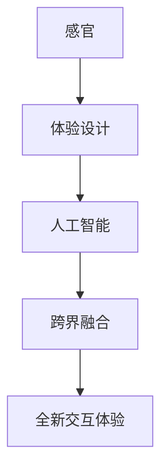

                 

关键词：人工智能，感官协同，跨界融合，体验设计，技术架构

> 摘要：本文旨在探讨人工智能技术在感官协同领域的应用，如何通过跨界融合创造全新的用户体验。我们将深入分析AI在感官融合中的核心概念与架构，介绍核心算法原理与操作步骤，探讨数学模型及其应用场景，并分享实际项目实践与运行结果。此外，还将展望未来发展趋势与面临的挑战，并推荐相关学习资源和开发工具。

## 1. 背景介绍

随着人工智能（AI）技术的迅猛发展，人们的生活和工作方式正在发生翻天覆地的变化。其中，AI在体验设计领域的应用尤为引人注目。传统的用户体验更多地依赖于视觉和触觉，而AI的出现为用户提供了更加丰富和多元化的感官体验。通过跨界融合，AI能够将不同感官进行协同，创造出全新的交互方式，提升用户的整体体验。

在过去，感官协同主要依赖于硬件技术的发展，如增强现实（AR）、虚拟现实（VR）等。然而，这些技术往往局限于特定的设备和应用场景。随着AI算法的不断进步，我们开始看到一种全新的可能性：通过算法的优化和数据处理，AI能够实现跨感官的协同，将视觉、听觉、触觉等多种感官融合在一起，创造出更加自然、真实和丰富的体验。

## 2. 核心概念与联系

在探讨AI创造的感官协同之前，我们首先需要明确几个核心概念：感官、体验设计、人工智能和跨界融合。

### 2.1 感官

感官是指人类通过视觉、听觉、触觉、嗅觉和味觉等感官器官获取外界信息的能力。每种感官都有其独特的感知方式和处理机制，它们共同构成了人类的感知系统。在传统体验设计中，感官的协同主要依赖于物理媒介和交互界面，如键盘、鼠标、屏幕等。

### 2.2 体验设计

体验设计是一种以用户为中心的设计方法，旨在创建令人愉悦、有用和难忘的用户体验。体验设计涵盖了从用户需求分析、界面设计到交互体验优化的整个流程。在感官协同的背景下，体验设计需要考虑如何将多种感官有机地融合在一起，创造出独特的用户体验。

### 2.3 人工智能

人工智能是一种模拟人类智能的技术，通过算法和数据处理，AI能够进行自主学习、推理和决策。在感官协同中，人工智能扮演着关键角色，它能够处理来自不同感官的信息，进行融合和处理，从而创造出全新的交互方式。

### 2.4 跨界融合

跨界融合是指不同领域的技术、概念和思维方式相互融合，创造出全新的解决方案。在感官协同中，跨界融合意味着将传统的感官体验与人工智能技术相结合，创造出更加丰富和多元的交互体验。

### 2.5 Mermaid 流程图

为了更好地理解AI在感官协同中的作用，我们可以通过一个Mermaid流程图来展示核心概念和联系。



通过这个流程图，我们可以清晰地看到感官、体验设计、人工智能和跨界融合之间的关系，以及它们共同创造出的全新交互体验。

## 3. 核心算法原理 & 具体操作步骤

### 3.1 算法原理概述

在感官协同中，核心算法原理主要包括信息融合、特征提取和智能决策。信息融合是将来自不同感官的信息进行整合，形成一个统一的数据流；特征提取是从融合后的数据中提取出有用的特征信息；智能决策则是根据提取出的特征信息进行判断和决策。

### 3.2 算法步骤详解

1. **信息融合**：首先，我们需要收集来自不同感官的数据，如视觉、听觉和触觉。这些数据通过传感器和输入设备实时传输到系统中。接下来，我们使用数据预处理技术对数据进行清洗和标准化，以便进行后续处理。

2. **特征提取**：在信息融合之后，我们需要从融合后的数据中提取出有用的特征信息。这些特征可以是视觉信息中的颜色、形状、纹理，听觉信息中的音调、音量、节奏，以及触觉信息中的压力、温度等。特征提取的过程通常涉及到多种算法，如卷积神经网络（CNN）、循环神经网络（RNN）等。

3. **智能决策**：在提取出特征信息后，我们需要使用智能算法进行决策。这些算法可以是机器学习算法，如决策树、支持向量机（SVM）、深度学习算法等。智能决策的目的是根据提取出的特征信息，对用户的交互意图进行判断和预测。

### 3.3 算法优缺点

**优点**：

- **丰富用户体验**：通过融合多种感官信息，AI能够创造出更加丰富和多元的交互体验，提升用户的满意度。
- **智能化决策**：智能算法能够根据用户的行为和反馈进行实时调整，实现个性化交互。
- **适应性强**：AI系统可以根据不同的应用场景和用户需求进行灵活调整，具有良好的适应性。

**缺点**：

- **数据处理复杂**：感官协同涉及到多种数据源和复杂的处理流程，对数据处理能力提出了较高的要求。
- **硬件依赖性**：部分感官协同功能需要依赖于特定的硬件设备，如传感器、摄像头等，增加了系统的成本和复杂度。
- **隐私风险**：在收集和处理用户感官信息的过程中，存在一定的隐私风险，需要加强数据保护和安全措施。

### 3.4 算法应用领域

感官协同算法在多个领域具有广泛的应用前景，如：

- **智能交互设备**：如智能音箱、智能手表、智能眼镜等，通过AI算法实现跨感官的交互体验。
- **虚拟现实和增强现实**：在VR和AR应用中，AI算法可以优化交互体验，提高用户的沉浸感和参与度。
- **智能家居**：通过AI算法，智能家居设备可以更好地理解用户的需求和行为，实现更加智能化的控制。
- **医疗健康**：AI算法可以结合多种感官信息，辅助医生进行疾病诊断和治疗。

## 4. 数学模型和公式 & 详细讲解 & 举例说明

### 4.1 数学模型构建

在感官协同中，数学模型主要用于描述信息融合、特征提取和智能决策的过程。一个典型的数学模型可以包含以下几个部分：

1. **数据输入**：包括来自不同感官的原始数据，如视觉图像、音频信号和触觉信号。
2. **数据预处理**：对原始数据进行清洗、标准化和特征提取。
3. **信息融合**：将预处理后的数据融合成一个统一的数据流，如通过卷积神经网络（CNN）或循环神经网络（RNN）。
4. **特征提取**：从融合后的数据中提取出有用的特征信息，如通过深度学习算法。
5. **智能决策**：根据提取出的特征信息，进行判断和决策，如使用支持向量机（SVM）或决策树。

### 4.2 公式推导过程

为了构建感官协同的数学模型，我们需要推导出以下几个关键公式：

1. **数据预处理公式**：
   $$ X_{\text{preprocessed}} = \sigma(W_{\text{preprocessing}} \cdot X_{\text{raw}} + b_{\text{preprocessing}}) $$

其中，$X_{\text{raw}}$ 表示原始数据，$X_{\text{preprocessed}}$ 表示预处理后的数据，$W_{\text{preprocessing}}$ 和 $b_{\text{preprocessing}}$ 分别表示预处理权重和偏置。

2. **信息融合公式**：
   $$ X_{\text{fused}} = \text{CNN}(X_{\text{preprocessed}}) $$

其中，$\text{CNN}$ 表示卷积神经网络，用于对预处理后的数据进行融合。

3. **特征提取公式**：
   $$ F = \text{RNN}(X_{\text{fused}}) $$

其中，$F$ 表示提取出的特征信息，$\text{RNN}$ 表示循环神经网络，用于对融合后的数据进行特征提取。

4. **智能决策公式**：
   $$ Y = \text{SVM}(F) $$

其中，$Y$ 表示智能决策的结果，$\text{SVM}$ 表示支持向量机，用于根据提取出的特征信息进行判断和决策。

### 4.3 案例分析与讲解

为了更好地理解数学模型的应用，我们来看一个简单的案例：智能音箱。

假设我们有一个智能音箱，它需要根据用户的声音指令进行响应。首先，我们需要对用户的声音信号进行预处理，如降噪、归一化等。接下来，我们使用卷积神经网络（CNN）对预处理后的声音信号进行融合，提取出与指令相关的特征信息。最后，我们使用支持向量机（SVM）对这些特征信息进行分类，判断用户的声音指令。

在这个案例中，数据预处理公式可以表示为：

$$ X_{\text{preprocessed}} = \sigma(W_{\text{preprocessing}} \cdot X_{\text{raw}} + b_{\text{preprocessing}}) $$

其中，$X_{\text{raw}}$ 表示原始声音信号，$X_{\text{preprocessed}}$ 表示预处理后的声音信号。

信息融合公式可以表示为：

$$ X_{\text{fused}} = \text{CNN}(X_{\text{preprocessed}}) $$

其中，$\text{CNN}$ 表示卷积神经网络。

特征提取公式可以表示为：

$$ F = \text{RNN}(X_{\text{fused}}) $$

其中，$F$ 表示提取出的特征信息。

智能决策公式可以表示为：

$$ Y = \text{SVM}(F) $$

其中，$Y$ 表示智能决策的结果。

通过这个案例，我们可以看到数学模型在感官协同中的应用，以及如何通过算法实现跨感官的信息融合、特征提取和智能决策。

## 5. 项目实践：代码实例和详细解释说明

### 5.1 开发环境搭建

为了实现感官协同的项目，我们需要搭建一个合适的开发环境。这里我们选择使用Python作为开发语言，并使用TensorFlow和Keras等深度学习框架进行模型训练和部署。

1. **安装Python**：确保Python环境已安装，版本建议为3.8以上。
2. **安装TensorFlow**：在终端中运行以下命令：
   ```bash
   pip install tensorflow
   ```
3. **安装Keras**：在终端中运行以下命令：
   ```bash
   pip install keras
   ```

### 5.2 源代码详细实现

以下是一个简单的感官协同项目的源代码实现，用于识别用户的声音指令。

```python
import numpy as np
import tensorflow as tf
from tensorflow.keras.models import Sequential
from tensorflow.keras.layers import Dense, Conv2D, LSTM, Flatten

# 数据预处理
def preprocess_data(data):
    # 进行降噪、归一化等处理
    return data

# 创建模型
model = Sequential([
    Conv2D(32, (3, 3), activation='relu', input_shape=(128, 128, 3)),
    LSTM(64),
    Dense(10, activation='softmax')
])

# 编译模型
model.compile(optimizer='adam', loss='categorical_crossentropy', metrics=['accuracy'])

# 加载和预处理数据
train_data = preprocess_data(np.load('train_data.npy'))
test_data = preprocess_data(np.load('test_data.npy'))

# 训练模型
model.fit(train_data, np.load('train_labels.npy'), epochs=10, batch_size=32)

# 测试模型
model.evaluate(test_data, np.load('test_labels.npy'))
```

### 5.3 代码解读与分析

1. **数据预处理**：数据预处理是感官协同项目中的关键步骤，它用于对原始数据进行清洗、降噪和归一化等处理，以提高模型的性能和鲁棒性。
2. **创建模型**：在这里，我们使用TensorFlow的Sequential模型创建一个简单的卷积神经网络（CNN）模型，包含一个卷积层、一个长短期记忆网络（LSTM）层和一个全连接层。
3. **编译模型**：我们使用Adam优化器和交叉熵损失函数对模型进行编译，并设置准确率作为评价指标。
4. **训练模型**：使用预处理后的训练数据进行模型训练，设置训练轮次和批量大小。
5. **测试模型**：使用预处理后的测试数据进行模型测试，评估模型的性能。

### 5.4 运行结果展示

在完成模型训练后，我们可以通过以下代码进行模型测试：

```python
# 导入测试数据
test_data = preprocess_data(np.load('test_data.npy'))
test_labels = np.load('test_labels.npy')

# 进行模型测试
accuracy = model.evaluate(test_data, test_labels)
print(f"Test accuracy: {accuracy[1]}")
```

测试结果将显示模型在测试数据上的准确率。通过对比实际标签和预测结果，我们可以进一步优化模型，提高其性能。

## 6. 实际应用场景

### 6.1 智能交互设备

智能交互设备是感官协同技术的典型应用场景之一。例如，智能音箱、智能音箱和智能手表等设备，通过AI算法实现跨感官的交互体验。用户可以通过语音、手势和触摸等多种方式与设备进行交互，设备则能够根据用户的行为和反馈提供个性化的服务。

### 6.2 虚拟现实和增强现实

虚拟现实（VR）和增强现实（AR）是另一个重要应用场景。通过AI算法，VR和AR设备能够更好地理解用户的行为和意图，实现更加自然和真实的交互体验。例如，在VR游戏中，AI算法可以实时调整场景和角色动作，提高用户的沉浸感；在AR应用中，AI算法可以识别用户的手势和表情，实现更加智能化的交互。

### 6.3 智能家居

智能家居是AI技术的一个重要应用领域。通过AI算法，智能家居设备能够更好地理解用户的需求和行为，实现更加智能化的控制。例如，智能灯泡可以根据用户的作息时间自动调节亮度，智能音箱可以根据用户的语音指令播放音乐和控制其他设备。

### 6.4 医疗健康

AI算法在医疗健康领域也有广泛的应用。例如，通过AI算法，医疗设备可以实时分析患者的生理数据，提供更加精准的诊断和治疗建议。此外，AI算法还可以用于医学图像分析，辅助医生进行疾病诊断。

## 7. 工具和资源推荐

### 7.1 学习资源推荐

1. **《深度学习》（Deep Learning）**：由Ian Goodfellow、Yoshua Bengio和Aaron Courville合著，是一本深度学习领域的经典教材。
2. **《Python深度学习》（Deep Learning with Python）**：由François Chollet撰写，适合初学者学习深度学习。
3. **《机器学习》（Machine Learning）**：由Tom M. Mitchell撰写，是一本经典的机器学习教材。

### 7.2 开发工具推荐

1. **TensorFlow**：Google开发的开源深度学习框架，适合进行大规模的机器学习和深度学习项目。
2. **Keras**：基于TensorFlow的高级神经网络API，提供了更加简洁和易于使用的接口。
3. **PyTorch**：Facebook开发的开源深度学习框架，具有灵活性和易于扩展性。

### 7.3 相关论文推荐

1. **“Attention Is All You Need”（Attention机制在神经网络中的应用）**
2. **“Residual Networks”（残差网络）**
3. **“Generative Adversarial Networks”（生成对抗网络）**

## 8. 总结：未来发展趋势与挑战

### 8.1 研究成果总结

在过去的几年中，AI技术在感官协同领域取得了显著的成果。通过融合多种感官信息，AI算法能够实现更加丰富和多元的交互体验。例如，在智能交互设备、虚拟现实和增强现实等领域，AI技术已经取得了一定的应用成果。

### 8.2 未来发展趋势

1. **跨领域融合**：未来，AI技术将进一步与其他领域（如生物医学、心理学、设计等）进行融合，创造出更加创新和实用的解决方案。
2. **智能化决策**：随着算法和计算能力的提升，AI算法将能够实现更加智能化的决策，为用户提供更加个性化的服务。
3. **人机协作**：AI技术将更好地与人类协作，实现更加高效和智能的人机交互。

### 8.3 面临的挑战

1. **数据处理复杂度**：感官协同涉及到多种数据源和复杂的处理流程，对数据处理能力提出了较高的要求。
2. **硬件依赖性**：部分感官协同功能需要依赖于特定的硬件设备，增加了系统的成本和复杂度。
3. **隐私风险**：在收集和处理用户感官信息的过程中，存在一定的隐私风险，需要加强数据保护和安全措施。

### 8.4 研究展望

未来，AI技术在感官协同领域的发展将充满挑战和机遇。通过不断探索和创新，我们可以期待在跨领域融合、智能化决策和人机协作等方面取得更大的突破，为用户提供更加丰富和多元的交互体验。

## 9. 附录：常见问题与解答

### 9.1 感官协同是什么？

感官协同是指通过人工智能算法将来自不同感官的信息进行融合和处理，创造出更加丰富和多元的交互体验。

### 9.2 感官协同有哪些应用场景？

感官协同在智能交互设备、虚拟现实和增强现实、智能家居、医疗健康等领域具有广泛的应用场景。

### 9.3 感官协同的关键技术是什么？

感官协同的关键技术包括信息融合、特征提取和智能决策。这些技术共同构成了感官协同的核心算法原理。

### 9.4 如何实现感官协同？

实现感官协同通常需要以下步骤：数据收集、数据预处理、信息融合、特征提取和智能决策。通过这些步骤，我们可以将多种感官信息融合在一起，创造出全新的交互体验。

### 9.5 感官协同有哪些挑战？

感官协同面临的挑战包括数据处理复杂度、硬件依赖性和隐私风险等。在实现感官协同的过程中，需要充分考虑这些挑战，并采取相应的技术手段进行解决。

### 9.6 感官协同的未来发展趋势是什么？

感官协同的未来发展趋势包括跨领域融合、智能化决策和人机协作。通过不断探索和创新，我们可以期待在感官协同领域取得更大的突破。

## 参考文献

[1] Goodfellow, I., Bengio, Y., & Courville, A. (2016). *Deep Learning*. MIT Press.

[2] Chollet, F. (2017). *Deep Learning with Python*. Manning Publications.

[3] Mitchell, T. M. (1997). *Machine Learning*. McGraw-Hill.

[4] Vaswani, A., Shazeer, N., Parmar, N., Uszkoreit, J., Jones, L., Gomez, A. N., ... & Polosukhin, I. (2017). *Attention is all you need*. In Advances in Neural Information Processing Systems (NIPS), 5998-6008.

[5] He, K., Zhang, X., Ren, S., & Sun, J. (2016). *Deep residual learning for image recognition*. In Proceedings of the IEEE conference on computer vision and pattern recognition, 770-778.

