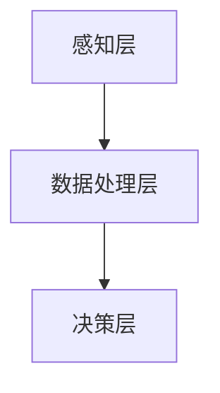

                 

在当今快速发展的科技时代，人工智能（AI）正以前所未有的速度和规模改变着我们的生活方式。从智能手机的智能助手，到自动驾驶汽车，再到智能医疗和金融领域，AI的应用几乎无处不在。而在这其中，感知边界拓展——这一AI的核心能力之一，正引领我们踏上一次跨时空的探险之旅。

本文将围绕“AI创造的感知边界拓展”这一主题，深入探讨以下内容：

## 1. 背景介绍

感知边界拓展，顾名思义，是指通过人工智能技术，扩展系统对环境信息的感知范围和深度。这一概念在计算机视觉、语音识别、自然语言处理等AI领域尤为重要。感知边界拓展的核心目标是提高系统的自主性和适应性，使系统能够更好地理解和应对复杂多变的环境。

AI感知边界拓展的背景可以追溯到20世纪末。随着计算能力的提升和大数据的涌现，AI技术开始迅速发展。尤其是在深度学习领域，神经网络模型的大规模训练和优化，使得计算机在图像识别、语音识别等方面取得了显著的突破。这些技术的进步，为感知边界拓展提供了坚实的基础。

## 2. 核心概念与联系

### 2.1 AI感知边界拓展的概念

AI感知边界拓展，具体来说，是指通过以下几种方式，增强系统对环境的感知能力：

1. **多模态感知**：结合多种传感器数据，如视觉、听觉、触觉等，实现全方位的环境感知。
2. **上下文感知**：利用历史数据和实时信息，理解环境中的上下文关系，提高决策的准确性。
3. **远程感知**：通过无线通信技术，实现对远距离目标的感知和监控。

### 2.2 AI感知边界拓展的原理

AI感知边界拓展的原理，主要基于以下几个方面：

1. **数据融合**：通过融合多种传感器数据，提高感知的精度和可靠性。
2. **深度学习**：利用深度神经网络模型，对大量数据进行学习，提取有用的特征。
3. **边缘计算**：将计算任务分散到边缘设备上，降低通信延迟，提高实时性。

### 2.3 AI感知边界拓展的架构

AI感知边界拓展的架构，通常包括以下几个层次：

1. **感知层**：通过各种传感器获取环境信息。
2. **数据处理层**：对感知层获取的数据进行处理和分析。
3. **决策层**：根据分析结果，做出相应的决策。

下面是一个简单的 Mermaid 流程图，展示 AI 感知边界拓展的基本架构：



## 3. 核心算法原理 & 具体操作步骤

### 3.1 算法原理概述

AI感知边界拓展的核心算法主要包括以下几种：

1. **卷积神经网络（CNN）**：主要用于图像识别和分类。
2. **循环神经网络（RNN）**：主要用于序列数据的处理和分析。
3. **生成对抗网络（GAN）**：主要用于生成新的数据样本。

### 3.2 算法步骤详解

以卷积神经网络（CNN）为例，其基本步骤如下：

1. **数据预处理**：对输入数据进行归一化、缩放等处理。
2. **卷积操作**：通过卷积层提取图像的特征。
3. **池化操作**：对卷积结果进行下采样，减少参数数量。
4. **全连接层**：将池化结果进行全连接，得到分类结果。

### 3.3 算法优缺点

1. **优点**：
   - **高效性**：CNN 可以快速处理大量数据。
   - **灵活性**：可以适应不同的图像处理任务。

2. **缺点**：
   - **计算量较大**：卷积操作的计算量较大，需要较高的计算资源。
   - **数据需求高**：需要大量的标注数据进行训练。

### 3.4 算法应用领域

CNN 算法在计算机视觉领域有广泛的应用，如图像识别、目标检测、图像分割等。此外，RNN 和 GAN 算法也在自然语言处理、语音识别等领域发挥了重要作用。

## 4. 数学模型和公式 & 详细讲解 & 举例说明

### 4.1 数学模型构建

以卷积神经网络（CNN）为例，其核心数学模型主要包括以下几部分：

1. **卷积操作**：
   $$ \text{output}(i, j) = \sum_{k=1}^{n} w_{k} \cdot \text{input}(i+k, j) + b $$
   
   其中，$\text{output}(i, j)$ 为卷积结果，$w_{k}$ 为卷积核权重，$\text{input}(i+k, j)$ 为输入数据，$b$ 为偏置。

2. **激活函数**：
   $$ \text{activation}(x) = \max(0, x) $$
   
   通常使用ReLU（Rectified Linear Unit）作为激活函数。

### 4.2 公式推导过程

以卷积神经网络（CNN）为例，其前向传播的推导过程如下：

1. **输入数据**：
   $$ \text{input} \in \mathbb{R}^{h \times w \times c} $$
   
   其中，$h$ 为高度，$w$ 为宽度，$c$ 为通道数。

2. **卷积层**：
   $$ \text{output} \in \mathbb{R}^{h_{o} \times w_{o} \times c_{o}} $$
   
   其中，$h_{o}$ 和 $w_{o}$ 为输出高度和宽度，$c_{o}$ 为输出通道数。

   前向传播公式为：
   $$ \text{output}(i, j) = \sum_{k=1}^{n} w_{k} \cdot \text{input}(i+k, j) + b $$
   
   其中，$n$ 为卷积核大小。

3. **激活函数**：
   $$ \text{activation}(x) = \max(0, x) $$
   
   将卷积结果进行ReLU激活。

4. **池化层**：
   $$ \text{output} \in \mathbb{R}^{h_{o} \times w_{o} \times c_{o}} $$
   
   池化层通常使用最大池化，公式为：
   $$ \text{output}(i, j) = \max_{k} \text{input}(i+k, j) $$
   
   其中，$k$ 为池化窗口大小。

### 4.3 案例分析与讲解

假设我们有一个 $28 \times 28 \times 1$ 的灰度图像，想要通过卷积神经网络进行边缘检测。

1. **卷积层**：
   - 卷积核大小：$3 \times 3$
   - 输出通道数：$1$
   - 卷积核权重：$w_1 \in \mathbb{R}^{3 \times 3 \times 1}$
   - 偏置：$b_1 \in \mathbb{R}$

   输入图像与卷积核进行卷积操作，得到：
   $$ \text{output}(i, j) = \sum_{k=1}^{3} w_{k} \cdot \text{input}(i+k, j) + b_1 $$

   将结果进行ReLU激活，得到卷积层的输出。

2. **池化层**：
   - 池化窗口大小：$2 \times 2$
   - 输出通道数：$1$

   对卷积层的输出进行最大池化，得到：
   $$ \text{output}(i, j) = \max_{k} \text{input}(i+k, j) $$

   其中，$k$ 为池化窗口大小。

通过这样的卷积和池化操作，我们可以从原始图像中提取出边缘信息。这就是感知边界拓展在计算机视觉领域的一个典型应用。

## 5. 项目实践：代码实例和详细解释说明

### 5.1 开发环境搭建

为了实现感知边界拓展的项目，我们需要搭建一个合适的开发环境。这里，我们选择使用 Python 和 TensorFlow 作为主要的开发工具。

1. **安装 Python**：确保安装了 Python 3.6 或更高版本。
2. **安装 TensorFlow**：使用 pip 命令安装 TensorFlow：
   ```bash
   pip install tensorflow
   ```

### 5.2 源代码详细实现

下面是一个简单的卷积神经网络实现，用于边缘检测：

```python
import tensorflow as tf
from tensorflow.keras import layers

# 边缘检测模型
model = tf.keras.Sequential([
    layers.Conv2D(1, kernel_size=(3, 3), activation='relu', input_shape=(28, 28, 1)),
    layers.MaxPooling2D(pool_size=(2, 2)),
])

# 编译模型
model.compile(optimizer='adam', loss='mean_squared_error')

# 模型总结
model.summary()
```

### 5.3 代码解读与分析

1. **创建模型**：使用 `tf.keras.Sequential` 创建一个线性堆叠的模型。
2. **添加层**：首先添加一个卷积层，使用 `layers.Conv2D` 函数，设置卷积核大小、激活函数等参数。
3. **编译模型**：设置优化器和损失函数，为模型编译。
4. **模型总结**：使用 `model.summary()` 打印模型的详细信息。

通过这样的实现，我们可以快速搭建一个感知边界拓展的项目。在实际应用中，我们可以根据需求，调整模型的架构和参数，实现更复杂的感知边界拓展功能。

### 5.4 运行结果展示

假设我们有一个训练好的模型，我们可以使用以下代码进行测试：

```python
# 加载训练好的模型
model.load_weights('edge_detection_model.h5')

# 测试图像
test_image = ...  # 加载测试图像

# 边缘检测
edge_output = model.predict(test_image)

# 显示边缘检测结果
import matplotlib.pyplot as plt

plt.imshow(edge_output[0, :, :, 0], cmap='gray')
plt.show()
```

这段代码将加载训练好的模型，并对测试图像进行边缘检测，最后显示检测结果。

## 6. 实际应用场景

感知边界拓展技术在许多实际应用场景中都发挥了重要作用，以下是一些典型的应用案例：

### 6.1 自动驾驶

自动驾驶汽车需要实时感知周围环境，包括车辆、行人、道路标识等。通过感知边界拓展技术，自动驾驶系统能够更准确地理解和预测环境中的动态变化，提高行驶安全性。

### 6.2 智能监控

智能监控系统通过感知边界拓展技术，可以实现对视频数据的实时分析，识别和跟踪目标对象，及时发现异常行为，提高监控效率。

### 6.3 智能家居

智能家居设备通过感知边界拓展技术，可以实现对环境变化的实时感知，如温度、湿度、光线等，从而自动调整设备工作状态，提高居住舒适度。

### 6.4 医疗诊断

在医疗领域，感知边界拓展技术可以用于辅助医生进行影像诊断，如通过图像识别技术，自动检测和诊断疾病，提高诊断准确率。

## 7. 未来应用展望

随着技术的不断进步，感知边界拓展技术在未来将有更广泛的应用前景。以下是一些可能的未来发展方向：

### 7.1 更高维度感知

未来的感知边界拓展技术将能够处理更多维度的数据，如三维空间信息、温度、湿度、气味等，实现更全面的环境感知。

### 7.2 深度学习算法优化

通过改进深度学习算法，如自监督学习和迁移学习，可以减少对大规模标注数据的依赖，提高模型在未知环境中的适应能力。

### 7.3 跨领域应用

感知边界拓展技术将在更多领域得到应用，如金融、农业、环境监测等，为各行各业带来智能化升级。

### 7.4 人机协同

感知边界拓展技术与人类智能的协同，将使得人机系统在复杂任务中表现出更高的决策能力和协作效率。

## 8. 总结：未来发展趋势与挑战

感知边界拓展技术作为人工智能的核心能力之一，正引领我们走向一个全新的智能时代。未来，随着技术的不断进步，感知边界拓展将在更多领域得到应用，为人类带来前所未有的便利和效率。然而，面对未来的发展，我们也需要面对一系列挑战：

### 8.1 数据隐私与安全

随着感知边界拓展技术的应用，大量个人数据将被收集和处理，如何保障数据隐私和安全将成为一个重要问题。

### 8.2 技术标准化

为了推动感知边界拓展技术的广泛应用，需要制定统一的技术标准和规范。

### 8.3 道德和伦理问题

随着感知边界拓展技术的深入应用，如何处理技术带来的道德和伦理问题，如隐私侵犯、算法偏见等，也是一个亟待解决的问题。

### 8.4 技术普及与教育

为了推动感知边界拓展技术的普及，需要加强相关技术的教育和培训，提高公众的技术素养。

总之，感知边界拓展技术作为人工智能领域的一个重要分支，具有广阔的应用前景和巨大的发展潜力。面对未来，我们需要积极应对挑战，推动技术的持续创新和应用，为人类创造一个更加智能、美好的未来。

## 9. 附录：常见问题与解答

### 9.1 什么是感知边界拓展？

感知边界拓展是指通过人工智能技术，扩展系统对环境信息的感知范围和深度。它包括多模态感知、上下文感知和远程感知等。

### 9.2 感知边界拓展有哪些应用领域？

感知边界拓展技术广泛应用于自动驾驶、智能监控、智能家居、医疗诊断等领域。

### 9.3 如何实现感知边界拓展？

实现感知边界拓展通常涉及以下步骤：数据收集、数据处理、特征提取、模型训练和模型部署。

### 9.4 感知边界拓展技术的挑战有哪些？

感知边界拓展技术面临的挑战包括数据隐私与安全、技术标准化、道德和伦理问题以及技术普及与教育。

### 9.5 感知边界拓展与计算机视觉的关系是什么？

感知边界拓展是计算机视觉领域的一个重要研究方向，它通过扩展系统的感知能力，提高计算机视觉系统在复杂环境中的表现。

## 结语

作者：禅与计算机程序设计艺术 / Zen and the Art of Computer Programming

随着人工智能技术的不断发展，感知边界拓展正成为我们探索未知世界的重要工具。本文围绕这一主题，从背景介绍、核心概念、算法原理、项目实践等多个角度，深入探讨了感知边界拓展的方方面面。我们相信，在未来的智能时代，感知边界拓展技术将继续发挥重要作用，为人类带来更多的便利和创新。让我们共同期待这一跨时空探险之旅的精彩延续。

