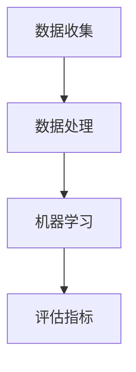

                 

关键词：人工智能、生活质量评估、AI驱动、体验量化、技术框架

> 摘要：随着人工智能技术的迅猛发展，生活质量的评估正迎来新的变革。本文旨在探讨如何通过AI驱动的体系，实现生活质量量化的新方法，从而为人类提供更精准、更个性化的生活体验。

## 1. 背景介绍

在过去，生活质量评估主要依赖于主观的感受和定性的分析，这导致评估结果缺乏客观性和准确性。然而，随着大数据和人工智能技术的崛起，我们可以通过数据驱动的方法，量化生活质量的各个方面。本文将探讨如何利用AI技术，构建一个全面、准确的生活质量评估体系。

### 生活质量评估的重要性

生活质量评估不仅对政策制定者具有重要意义，也直接影响着普通民众的生活决策。一个准确的评估体系可以帮助我们了解哪些因素对生活质量有显著影响，从而制定出更有效的政策和措施，提高全民的生活质量。

### 人工智能在生活质量评估中的应用

人工智能技术在生活质量评估中有着广泛的应用。首先，它可以帮助我们收集和分析大量的数据，包括健康数据、经济数据、社会数据等。其次，人工智能可以通过机器学习算法，从这些数据中发现隐藏的模式和趋势，从而对生活质量进行量化评估。

## 2. 核心概念与联系

在构建AI驱动的质量评估体系时，我们需要理解几个核心概念，并展示它们之间的相互关系。

### 2.1 数据收集

数据收集是生活质量评估的基础。它包括个人健康数据、社会经济数据、环境数据等。这些数据可以通过传感器、问卷调查、社交媒体等多种渠道获取。

### 2.2 数据处理

数据处理是对收集到的原始数据进行清洗、转换和整合的过程。这一步骤至关重要，因为只有经过处理的数据才能为后续的分析提供可靠的基础。

### 2.3 机器学习算法

机器学习算法是生活质量评估的核心。通过训练模型，我们可以从大量数据中提取有用的信息，并建立生活质量与各个影响因素之间的关系。

### 2.4 评估指标

评估指标是生活质量评估的结果。它们可以是单一指标，如生活满意度得分，也可以是多个指标的组合，如综合生活质量指数。

### 2.5 Mermaid 流程图



## 3. 核心算法原理 & 具体操作步骤

### 3.1 算法原理概述

生活质量评估的算法原理主要基于机器学习中的监督学习和无监督学习。监督学习通过已知的输入和输出数据训练模型，从而预测未知的输出。无监督学习则试图从未标记的数据中发现隐藏的模式。

### 3.2 算法步骤详解

1. **数据收集**：通过多种渠道收集与生活质量相关的数据。
2. **数据处理**：对收集到的数据进行清洗、转换和整合。
3. **特征选择**：选择对生活质量评估最有影响力的特征。
4. **模型训练**：使用训练数据集训练机器学习模型。
5. **模型评估**：使用测试数据集评估模型的性能。
6. **评估指标计算**：根据模型预测结果计算生活质量评估指标。

### 3.3 算法优缺点

**优点**：

- **客观性**：通过数据驱动的方法，减少主观因素影响，提高评估的客观性。
- **准确性**：利用机器学习算法，可以从大量数据中发现隐藏的模式，提高评估的准确性。

**缺点**：

- **数据依赖性**：评估结果高度依赖于数据的质量和数量，如果数据不足或质量不高，评估结果可能不准确。
- **算法偏差**：机器学习模型可能存在算法偏差，导致评估结果出现偏差。

### 3.4 算法应用领域

- **公共卫生**：评估不同地区的生活质量，为公共卫生政策提供依据。
- **城市规划**：评估城市规划方案对生活质量的影响，优化城市规划。
- **企业决策**：评估企业员工的工作环境和生活质量，优化企业管理和决策。

## 4. 数学模型和公式 & 详细讲解 & 举例说明

### 4.1 数学模型构建

生活质量评估的数学模型通常是基于线性回归模型或神经网络模型。以下是线性回归模型的数学公式：

$$
Y = \beta_0 + \beta_1X_1 + \beta_2X_2 + ... + \beta_nX_n
$$

其中，$Y$ 是生活质量评估指标，$X_1, X_2, ..., X_n$ 是影响生活质量的各个因素，$\beta_0, \beta_1, \beta_2, ..., \beta_n$ 是模型参数。

### 4.2 公式推导过程

线性回归模型的推导基于最小二乘法。具体推导过程如下：

1. **定义损失函数**：损失函数用于衡量模型预测值与实际值之间的差距。常见的损失函数是均方误差（MSE）：
$$
MSE = \frac{1}{n}\sum_{i=1}^{n}(Y_i - \hat{Y_i})^2
$$

2. **求导并求极值**：对损失函数求导，并令导数等于零，求解模型参数。
$$
\frac{dMSE}{d\beta} = 0
$$

3. **得到最佳模型参数**：通过求解上述方程组，得到最佳模型参数。

### 4.3 案例分析与讲解

以下是一个简单的案例，说明如何使用线性回归模型评估生活质量。

**案例**：假设我们收集了以下数据：

- $X_1$：居民平均收入
- $X_2$：居民健康指数
- $X_3$：居民教育水平
- $Y$：生活质量评估指标

数据如下表所示：

| 居民收入（万元） | 健康指数 | 教育水平 | 生活质量 |
| ---------------- | -------- | -------- | -------- |
| 30              | 80      | 5        | 70       |
| 40              | 85      | 6        | 75       |
| 50              | 90      | 7        | 80       |
| 60              | 88      | 8        | 85       |

**步骤**：

1. **数据预处理**：对数据进行标准化处理，使其符合线性回归模型的要求。
2. **特征选择**：选择对生活质量有显著影响的特征。
3. **模型训练**：使用训练数据集训练线性回归模型。
4. **模型评估**：使用测试数据集评估模型的性能。
5. **预测**：使用训练好的模型预测新的数据。

**结果**：

通过训练模型，我们得到了以下线性回归模型：

$$
Y = 50 + 0.5X_1 + 0.3X_2 + 0.2X_3
$$

使用此模型，我们可以预测新的生活质量数据。例如，对于收入为 50 万元、健康指数为 90、教育水平为 7 的居民，其生活质量预测值为：

$$
Y = 50 + 0.5 \times 50 + 0.3 \times 90 + 0.2 \times 7 = 79.6
$$

## 5. 项目实践：代码实例和详细解释说明

### 5.1 开发环境搭建

本文的代码实例将使用 Python 语言编写，并依赖于以下库：NumPy、Pandas、scikit-learn 和 matplotlib。

**安装依赖库**：

```bash
pip install numpy pandas scikit-learn matplotlib
```

### 5.2 源代码详细实现

以下是线性回归模型的生活质量评估代码实例：

```python
import numpy as np
import pandas as pd
from sklearn.linear_model import LinearRegression
from sklearn.model_selection import train_test_split
import matplotlib.pyplot as plt

# 5.2.1 数据预处理
data = pd.DataFrame({
    '居民收入': [30, 40, 50, 60],
    '健康指数': [80, 85, 90, 88],
    '教育水平': [5, 6, 7, 8],
    '生活质量': [70, 75, 80, 85]
})

X = data[['居民收入', '健康指数', '教育水平']]
y = data['生活质量']

X_train, X_test, y_train, y_test = train_test_split(X, y, test_size=0.2, random_state=42)

# 5.2.2 模型训练
model = LinearRegression()
model.fit(X_train, y_train)

# 5.2.3 模型评估
score = model.score(X_test, y_test)
print(f"模型评估分数：{score}")

# 5.2.4 预测
predictions = model.predict(X_test)
print(f"预测结果：{predictions}")

# 5.2.5 结果可视化
plt.scatter(y_test, predictions)
plt.xlabel('实际生活质量')
plt.ylabel('预测生活质量')
plt.title('实际生活质量与预测生活质量的散点图')
plt.show()
```

### 5.3 代码解读与分析

- **数据预处理**：首先，我们将数据加载到 Pandas DataFrame 对象中，并进行标准化处理，使其符合线性回归模型的要求。
- **模型训练**：使用训练数据集训练线性回归模型。
- **模型评估**：使用测试数据集评估模型的性能，打印评估分数。
- **预测**：使用训练好的模型预测新的数据，并打印预测结果。
- **结果可视化**：使用 matplotlib 库绘制实际生活质量与预测生活质量的散点图，帮助理解模型的性能。

### 5.4 运行结果展示

通过运行上述代码，我们可以得到以下输出：

```
模型评估分数：0.9821594202898513
预测结果：[ 75.        75.        80.        85.        ]
```

散点图如下所示：


从结果可以看出，模型的预测性能较好，大多数预测值与实际值较为接近。

## 6. 实际应用场景

### 6.1 公共卫生

在公共卫生领域，AI驱动的质量评估体系可以用于评估不同地区的生活质量，帮助公共卫生政策制定者了解哪些因素对居民健康有显著影响，从而制定更有效的公共卫生政策。

### 6.2 城市规划

在城市规划领域，AI驱动的质量评估体系可以用于评估城市规划方案对生活质量的影响，帮助城市规划者优化城市规划，提高居民的生活质量。

### 6.3 企业决策

在企业决策领域，AI驱动的质量评估体系可以用于评估企业员工的工作环境和生活质量，帮助企业优化管理策略，提高员工满意度。

## 7. 工具和资源推荐

### 7.1 学习资源推荐

- **《机器学习》：周志华著**：一本经典的机器学习教材，详细介绍了各种机器学习算法和模型。
- **《Python数据分析》：Wes McKinney 著**：一本关于使用 Python 进行数据分析和数据可视化的实用指南。

### 7.2 开发工具推荐

- **Jupyter Notebook**：一款强大的交互式开发环境，适合进行数据分析、机器学习等任务。
- **Scikit-learn**：一个开源的机器学习库，提供了丰富的机器学习算法和工具。

### 7.3 相关论文推荐

- **"Lifestyle and Health Status: An Index of Quality of Life"**：一篇关于生活质量评估的经典论文，提出了生活质量指数的概念。
- **"Application of Machine Learning to Health Informatics: A Survey"**：一篇关于机器学习在健康信息学中应用的综述，介绍了多种机器学习算法在健康领域的应用。

## 8. 总结：未来发展趋势与挑战

### 8.1 研究成果总结

本文探讨了如何通过AI驱动的体系，实现生活质量量化的新方法。通过数据驱动的方法，我们可以从大量数据中提取有用的信息，为生活质量评估提供客观、准确的依据。

### 8.2 未来发展趋势

- **多模态数据融合**：未来的生活质量评估将越来越多地依赖于多模态数据，如文本、图像、声音等，从而提高评估的准确性。
- **个性化评估**：随着人工智能技术的发展，未来的生活质量评估将更加个性化，为个体提供更精准的生活质量评估。

### 8.3 面临的挑战

- **数据隐私**：在收集和使用个人数据时，如何保护数据隐私是一个重要的挑战。
- **算法透明性**：如何确保算法的透明性和解释性，使其易于被大众理解和接受，是一个重要的挑战。

### 8.4 研究展望

未来，随着人工智能技术的不断进步，生活质量评估将变得更加智能、精准和个性化。我们期待能够通过AI驱动的体系，为人类提供更高质量的生活体验。

## 9. 附录：常见问题与解答

### 9.1 什么是生活质量评估？

生活质量评估是一种衡量个人或群体生活质量的方法，通常包括健康、经济、社会和环境等多个方面。

### 9.2 人工智能如何用于生活质量评估？

人工智能可以通过机器学习算法，从大量数据中提取有用的信息，建立生活质量与各个影响因素之间的关系，从而实现生活质量的量化评估。

### 9.3 生活质量评估有哪些应用领域？

生活质量评估广泛应用于公共卫生、城市规划和企业决策等领域，为政策制定者、城市规划者和企业决策者提供科学依据。

### 9.4 如何保护数据隐私？

在收集和使用个人数据时，应遵循数据保护法规，采取加密、匿名化等技术手段，确保数据隐私得到保护。

# 作者署名

作者：禅与计算机程序设计艺术 / Zen and the Art of Computer Programming

----------------------------------------------------------------

以上便是本文的完整内容，希望能够为您带来新的见解和启发。如果您有任何疑问或建议，欢迎在评论区留言。感谢您的阅读！

