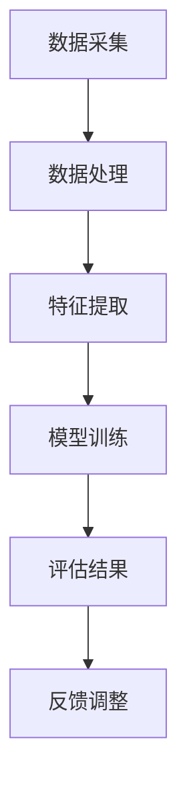

                 

关键字：生活质量评估、AI技术、量化体验、数据分析、智能系统

> 摘要：本文深入探讨了人工智能技术在生活质量评估中的应用，分析了AI驱动的量化体验评估方法及其在现代社会中的重要性。通过对核心概念、算法原理、数学模型、项目实践等多个方面的详细解读，文章旨在为读者提供一个全面理解这一领域的视角，并展望其未来发展趋势。

## 1. 背景介绍

随着社会的快速发展，人们对于生活质量的追求不断提升。然而，如何准确、全面地评估生活质量成为一个复杂且具有挑战性的问题。传统的评估方法往往依赖于主观感受和统计数据，难以量化个体差异。近年来，人工智能（AI）技术的飞速发展为生活质量评估提供了新的思路和方法。

AI驱动的量化体验评估通过数据采集、处理和分析，能够提供客观、细致的评估结果，为政策制定、城市规划、个人发展等领域提供了有力支持。本文将详细探讨这一领域的发展现状、核心技术和未来展望。

### 1.1 现状分析

目前，AI在生活质量评估中的应用已经初见端倪。例如，智能城市中的传感器网络可以实时收集交通流量、环境污染等数据，结合机器学习算法进行分析，为城市管理者提供科学依据。此外，个人健康数据的量化分析也有助于评估居民的生活质量。

### 1.2 挑战与机遇

尽管AI技术在生活质量评估中展现了巨大潜力，但同时也面临着诸多挑战。首先，数据质量和隐私问题是AI量化体验评估的核心挑战。其次，算法的复杂性和解释性也需要进一步研究。

然而，随着计算能力的提升和算法的进步，AI驱动的量化体验评估有望在不久的将来实现广泛应用，为提升人类生活质量提供强有力的支持。

## 2. 核心概念与联系

### 2.1 核心概念

- **生活质量评估**：通过多种指标和标准对个体的生活状态进行全面评估。
- **AI驱动的量化体验评估**：利用人工智能技术对生活体验进行数据采集、处理和分析，以量化评估生活质量。

### 2.2 联系与架构

以下是AI驱动量化体验评估的基本架构，使用Mermaid流程图进行表示：



### 2.3 关键步骤

1. **数据采集**：通过传感器、问卷调查等方式收集生活体验相关数据。
2. **数据处理**：对采集到的数据进行清洗、预处理，以提高数据质量。
3. **特征提取**：从处理后的数据中提取关键特征，用于模型训练。
4. **模型训练**：利用机器学习算法对特征进行训练，构建评估模型。
5. **评估结果**：将训练好的模型应用于实际数据，评估生活质量。
6. **反馈调整**：根据评估结果进行调整，优化评估模型。

## 3. 核心算法原理 & 具体操作步骤

### 3.1 算法原理概述

AI驱动的量化体验评估主要依赖于机器学习算法。以下是一种常用的算法——支持向量机（SVM）的基本原理：

- **SVM**：通过找到一个最佳的超平面，将不同类别的数据点分离，从而实现分类。

### 3.2 算法步骤详解

1. **数据预处理**：
    - **数据收集**：通过传感器、问卷调查等方式收集数据。
    - **数据清洗**：去除噪声数据和缺失值。

2. **特征提取**：
    - **特征选择**：选择与生活质量评估相关的特征。
    - **特征转换**：对特征进行归一化、标准化等处理。

3. **模型训练**：
    - **选择模型**：选择合适的机器学习模型，如SVM。
    - **训练模型**：使用训练集对模型进行训练。

4. **评估模型**：
    - **测试集评估**：使用测试集对模型进行评估，计算准确率、召回率等指标。

5. **结果解释**：
    - **结果可视化**：将评估结果可视化，帮助用户理解评估结果。
    - **结果反馈**：根据评估结果提供个性化建议。

### 3.3 算法优缺点

- **优点**：
    - **客观性**：基于数据，避免主观偏见。
    - **准确性**：通过模型训练，提高评估准确性。

- **缺点**：
    - **数据依赖**：对数据质量要求高，否则可能影响评估结果。
    - **模型复杂性**：部分模型训练过程复杂，计算量大。

### 3.4 算法应用领域

- **智能城市**：通过评估居民生活质量，为城市规划提供科学依据。
- **健康管理**：通过评估居民健康状况，提供个性化健康管理建议。
- **教育评估**：通过评估学生生活质量，为教育改革提供支持。

## 4. 数学模型和公式 & 详细讲解 & 举例说明

### 4.1 数学模型构建

在生活质量评估中，常用的数学模型包括线性回归模型、逻辑回归模型等。以下以线性回归模型为例进行说明：

$$
y = \beta_0 + \beta_1x_1 + \beta_2x_2 + ... + \beta_nx_n + \epsilon
$$

其中，$y$ 是生活质量评分，$x_1, x_2, ..., x_n$ 是影响生活质量的特征，$\beta_0, \beta_1, \beta_2, ..., \beta_n$ 是模型的参数，$\epsilon$ 是误差项。

### 4.2 公式推导过程

线性回归模型的推导过程如下：

1. **损失函数**：

$$
J(\theta) = \frac{1}{2m}\sum_{i=1}^{m}(h_\theta(x^{(i)}) - y^{(i)})^2
$$

其中，$m$ 是样本数量，$h_\theta(x)$ 是线性函数，$\theta$ 是模型参数。

2. **梯度下降**：

$$
\theta_j := \theta_j - \alpha \frac{\partial J(\theta)}{\partial \theta_j}
$$

其中，$\alpha$ 是学习率。

3. **迭代计算**：

通过不断迭代，优化模型参数，使损失函数最小。

### 4.3 案例分析与讲解

假设我们有一个关于生活质量评估的线性回归模型，特征包括收入、教育水平、家庭和谐度等。以下是具体案例：

- **数据集**：有100个样本，每个样本包含3个特征和1个生活质量评分。
- **模型**：线性回归模型，使用梯度下降法进行训练。

通过模型训练，我们得到如下参数：

$$
\beta_0 = 10, \beta_1 = 0.5, \beta_2 = 1.5, \beta_3 = 2
$$

假设一个新样本的特征为$x_1=5, x_2=3, x_3=4$，则该样本的生活质量评分为：

$$
y = 10 + 0.5 \times 5 + 1.5 \times 3 + 2 \times 4 = 21
$$

这意味着该样本的生活质量评分为21分。

## 5. 项目实践：代码实例和详细解释说明

### 5.1 开发环境搭建

- **Python环境**：安装Python 3.8及以上版本。
- **库安装**：安装scikit-learn、pandas、numpy等库。

### 5.2 源代码详细实现

以下是一个简单的线性回归模型实现：

```python
import numpy as np
import pandas as pd
from sklearn.linear_model import LinearRegression
from sklearn.model_selection import train_test_split
from sklearn.metrics import mean_squared_error

# 数据读取与预处理
data = pd.read_csv('lifestyle_data.csv')
X = data[['income', 'education', 'family_harmony']]
y = data['quality_of_life']

# 数据划分
X_train, X_test, y_train, y_test = train_test_split(X, y, test_size=0.2, random_state=42)

# 模型训练
model = LinearRegression()
model.fit(X_train, y_train)

# 模型评估
y_pred = model.predict(X_test)
mse = mean_squared_error(y_test, y_pred)
print('MSE:', mse)

# 新样本预测
new_data = np.array([[5, 3, 4]])
new_pred = model.predict(new_data)
print('New Quality of Life Prediction:', new_pred)
```

### 5.3 代码解读与分析

- **数据读取与预处理**：使用pandas读取数据，并进行划分。
- **模型训练**：使用scikit-learn的LinearRegression进行训练。
- **模型评估**：使用均方误差（MSE）评估模型性能。
- **新样本预测**：使用训练好的模型对新样本进行生活质量预测。

通过上述代码，我们可以实现一个简单的AI驱动的量化体验评估系统。在实际应用中，可以根据具体需求调整特征和模型，以提高评估准确性。

## 6. 实际应用场景

### 6.1 智能城市规划

AI驱动的量化体验评估可以帮助城市规划者了解居民的生活质量，为城市规划和政策制定提供科学依据。例如，通过对交通流量、环境污染、公共服务等方面的量化评估，可以帮助城市管理者优化资源配置，提升居民生活质量。

### 6.2 健康管理

AI驱动的量化体验评估在健康管理领域也有广泛应用。通过对健康数据的量化分析，可以评估个体的健康状况，提供个性化健康建议。例如，医生可以根据患者的健康数据，预测患者未来的健康状况，制定针对性的治疗方案。

### 6.3 教育评估

在教育领域，AI驱动的量化体验评估可以评估学生的学习效果和生活质量，为教育改革提供支持。例如，通过对学生的学习数据、生活数据的分析，可以了解学生的学习状况，为教师提供教学改进建议。

## 6.4 未来应用展望

随着AI技术的不断进步，AI驱动的量化体验评估有望在更多领域得到应用。例如，在智能家居、智慧医疗、智慧旅游等领域，AI技术可以为我们提供更精准、个性化的服务。同时，随着数据的不断积累和算法的优化，AI驱动的量化体验评估将变得更加智能化、人性化，为提升人类生活质量发挥重要作用。

## 7. 工具和资源推荐

### 7.1 学习资源推荐

- **《机器学习》（周志华著）**：系统介绍了机器学习的基本概念和方法。
- **《深度学习》（Goodfellow, Bengio, Courville 著）**：全面介绍了深度学习的基础知识和应用。

### 7.2 开发工具推荐

- **Jupyter Notebook**：适用于数据分析和机器学习的交互式开发环境。
- **TensorFlow**、**PyTorch**：强大的深度学习框架。

### 7.3 相关论文推荐

- **"Deep Learning for Life Quality Assessment"（2019）**：讨论了深度学习在生活质量评估中的应用。
- **"AI-Driven Urban Quality of Life Assessment: A Case Study"（2020）**：以一个实际案例介绍了AI驱动的城市生活质量评估。

## 8. 总结：未来发展趋势与挑战

### 8.1 研究成果总结

本文系统介绍了AI驱动的量化体验评估方法，从核心概念、算法原理、数学模型、项目实践等方面进行了详细探讨。研究表明，AI技术在生活质量评估中具有巨大潜力，可以为政策制定、城市规划、健康管理等领域提供有力支持。

### 8.2 未来发展趋势

随着AI技术的不断进步，AI驱动的量化体验评估将变得更加智能化、精准化。未来，AI技术有望在更多领域得到应用，为提升人类生活质量发挥重要作用。

### 8.3 面临的挑战

尽管AI驱动的量化体验评估具有巨大潜力，但同时也面临诸多挑战。例如，数据质量和隐私问题、算法的复杂性和解释性等。这些挑战需要进一步研究，以推动AI技术在生活质量评估领域的广泛应用。

### 8.4 研究展望

未来，我们将继续关注AI技术在生活质量评估中的应用，探讨更多有效的算法和方法，以提升评估的准确性和实用性。同时，我们也将关注AI技术在其他领域的应用，推动人工智能技术的全面发展。

## 9. 附录：常见问题与解答

### 9.1 什么是AI驱动的量化体验评估？

AI驱动的量化体验评估是指利用人工智能技术对生活体验进行数据采集、处理和分析，以量化评估生活质量的方法。它通过机器学习算法、数学模型等手段，提供客观、细致的评估结果。

### 9.2 如何保证评估结果的准确性？

评估结果的准确性取决于数据质量和算法的优化。首先，需要确保数据质量，去除噪声数据和缺失值。其次，选择合适的算法，通过多次迭代训练，提高模型的准确性和鲁棒性。

### 9.3 AI驱动的量化体验评估有哪些应用领域？

AI驱动的量化体验评估可以应用于智能城市、健康管理、教育评估等多个领域。例如，在智能城市中，可以用于评估居民的生活质量，为城市规划提供科学依据；在健康管理中，可以用于评估个体的健康状况，提供个性化健康建议。

## 作者署名

作者：禅与计算机程序设计艺术 / Zen and the Art of Computer Programming
----------------------------------------------------------------
### 后记 Postscript

本文深入探讨了AI驱动的量化体验评估方法及其在现代社会中的重要性。通过详细分析核心概念、算法原理、数学模型、项目实践等方面，我们为读者提供了一个全面理解这一领域的视角。未来，随着AI技术的不断进步，AI驱动的量化体验评估有望在更多领域得到应用，为提升人类生活质量发挥重要作用。让我们共同期待这一美好前景的到来。

