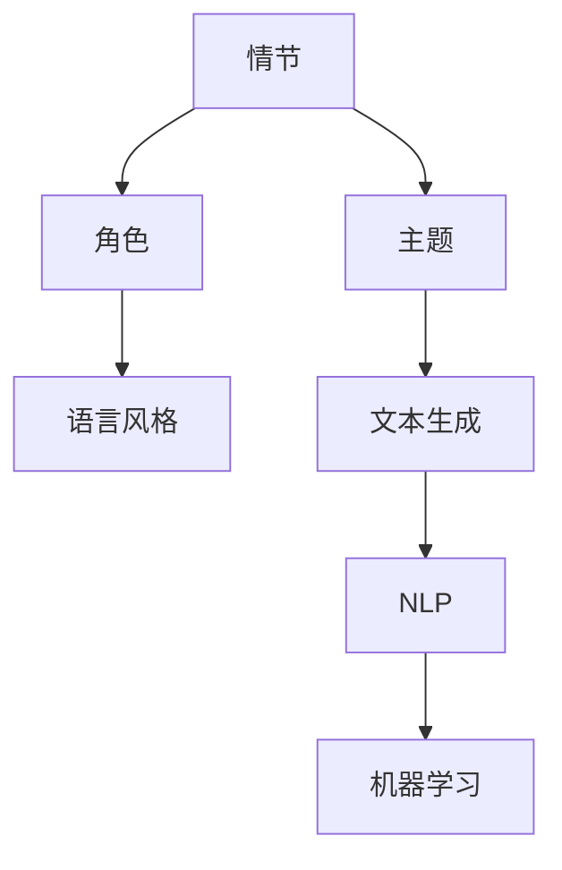

                 

关键词：人工智能，故事生成，自然语言处理，机器学习，文本生成，故事创作，算法应用

> 摘要：本文将探讨如何利用人工智能技术，特别是自然语言处理和机器学习算法，来创建、完善和阐释小故事。我们将详细分析核心概念、算法原理、数学模型、项目实践，以及实际应用场景，并展望未来的发展趋势与挑战。

## 1. 背景介绍

故事是人类交流的重要方式，通过故事，人们可以传达情感、价值观和经验。在数字时代，人工智能（AI）的发展为故事创作带来了全新的可能性。人工智能能够通过学习大量的文本数据，生成连贯、富有创意的小故事。这种技术不仅为作家提供了创作工具，也为内容创作者提供了新的表达方式。

本文将重点探讨如何使用人工智能技术来创建、完善和阐释小故事。我们将会从以下几个方面展开：

1. **核心概念与联系**：介绍与故事创作相关的主要概念和技术。
2. **核心算法原理与具体操作步骤**：探讨常用的文本生成算法，并给出具体的应用步骤。
3. **数学模型和公式**：详细讲解与文本生成相关的数学模型和公式。
4. **项目实践**：提供实际的代码实例，并对其进行详细解读。
5. **实际应用场景**：讨论人工智能在故事创作中的应用案例。
6. **未来应用展望**：展望人工智能在故事创作领域的未来发展。

## 2. 核心概念与联系

### 2.1 故事创作的基本概念

故事创作涉及多个方面，包括情节、角色、主题和语言风格。情节是故事的骨架，角色是故事的灵魂，主题是故事的灵魂所在，而语言风格则是故事的载体。

- **情节**：情节是故事发展的过程，包括开始、发展和高潮等。一个好的情节能够吸引读者的注意力，并引发他们的兴趣。
- **角色**：角色是故事中的重要组成部分，可以是主角、配角或反派。角色的性格、行为和动机对故事的发展至关重要。
- **主题**：主题是故事要传达的中心思想，它可以是对人类生活的观察，对道德的探讨，对未来的思考等。
- **语言风格**：语言风格是指故事叙述的方式和语言特点，包括语调、语气和修辞手法等。不同的语言风格可以创造出不同的氛围和情感。

### 2.2 自然语言处理（NLP）

自然语言处理是人工智能的一个重要分支，它专注于让计算机理解和生成人类语言。在故事创作中，NLP 技术可以帮助我们理解和生成故事文本。

- **文本分析**：通过分析文本，我们可以了解故事的主题、情感和结构。
- **语义理解**：语义理解是指让计算机理解文本中的意义，这对于故事创作的自动化至关重要。
- **文本生成**：文本生成是指让计算机根据给定的输入生成新的文本。在故事创作中，文本生成算法可以生成新的故事情节和角色。

### 2.3 机器学习

机器学习是 AI 的另一个重要分支，它通过学习大量数据来提高计算机的决策能力。在故事创作中，机器学习算法可以用于生成故事文本，优化故事情节和角色。

- **监督学习**：监督学习是指通过标记的数据来训练模型，以便模型能够预测新的数据。在故事创作中，监督学习可以用于生成基于已有故事的数据。
- **无监督学习**：无监督学习是指在没有标记数据的情况下训练模型，以便模型能够发现数据中的模式。在故事创作中，无监督学习可以用于生成新的故事创意。

### 2.4 Mermaid 流程图

以下是一个简化的 Mermaid 流程图，展示了故事创作中涉及的主要概念和它们之间的关系：



## 3. 核心算法原理 & 具体操作步骤

### 3.1 算法原理概述

在故事创作中，常用的文本生成算法包括基于模板的生成、基于规则的生成和基于神经网络的生成。每种算法都有其独特的原理和应用场景。

- **基于模板的生成**：这种方法通过预先定义的模板来生成故事。模板中包含基本的情节、角色和主题信息，计算机根据模板填充具体的内容。
- **基于规则的生成**：这种方法通过定义一系列规则来生成故事。这些规则描述了情节、角色和主题之间的关系，计算机根据规则生成故事。
- **基于神经网络的生成**：这种方法使用神经网络模型来学习大量的文本数据，并生成新的故事。这种方法的优点是生成的文本更加自然和多样化。

### 3.2 算法步骤详解

以下是使用基于神经网络的生成算法来创建故事的详细步骤：

1. **数据收集与预处理**：收集大量的小故事文本，并对文本进行清洗和预处理，如去除标点符号、统一单词大小写等。

2. **模型训练**：使用训练集训练一个神经网络模型，如 LSTM（长短期记忆网络）或 GPT（生成预训练网络）。训练过程中，模型会学习文本中的模式，并尝试生成新的文本。

3. **文本生成**：给定一个起始文本，神经网络模型会生成一个新的故事。生成过程可以是逐词生成，也可以是整句生成。

4. **故事优化**：生成的故事可能存在语法错误或不合理的地方。通过后处理技术，如语法检查和语义修正，可以优化故事的质量。

5. **故事阐释**：生成的故事可以进一步分析，以提取关键信息、主题和情感。这些信息可以用于故事分析和改进。

### 3.3 算法优缺点

- **优点**：
  - 生成的故事文本自然、连贯。
  - 可以处理复杂的语言结构和语义信息。
  - 生成的故事多样化，避免了重复性。

- **缺点**：
  - 模型训练需要大量的数据和计算资源。
  - 生成的故事可能存在逻辑错误或不合理的地方。
  - 对模型的要求较高，需要不断优化和改进。

### 3.4 算法应用领域

基于神经网络的文本生成算法在故事创作中具有广泛的应用前景。除了小故事创作，还可以应用于以下领域：

- **小说创作**：生成新的小说情节和角色，为作家提供创作灵感。
- **剧本创作**：自动生成电影剧本、电视剧剧本等。
- **新闻报道**：自动生成新闻报道，提高新闻的时效性和准确性。
- **游戏剧情**：自动生成游戏剧情和角色，提高游戏的趣味性和可玩性。

## 4. 数学模型和公式

在文本生成中，常用的数学模型包括概率模型和神经网络模型。以下是这两个模型的基本公式和原理。

### 4.1 概率模型

概率模型基于概率论和统计方法，通过计算每个单词在给定前缀下的概率来生成文本。以下是两个常见的概率模型：

- **n-gram 模型**：
  - **公式**：$$P(w_n | w_{n-1}, w_{n-2}, \ldots, w_1) = \frac{C(w_n, w_{n-1}, \ldots, w_1)}{C(w_{n-1}, w_{n-2}, \ldots, w_1)}$$
  - **解释**：给定前 n-1 个单词，计算第 n 个单词出现的概率。
- **隐马尔可夫模型（HMM）**：
  - **公式**：$$P(w_n | w_{n-1}, \ldots, w_1) = \prod_{i=1}^{n} P(w_i | w_{i-1})$$
  - **解释**：隐马尔可夫模型假设当前单词仅与前一单词相关，计算整个文本序列的概率。

### 4.2 神经网络模型

神经网络模型通过学习大量的文本数据来生成文本。以下是一个简单的神经网络模型：

- **循环神经网络（RNN）**：
  - **公式**：$$h_t = \sigma(W_h \cdot [h_{t-1}, x_t] + b_h)$$
  - **解释**：RNN 通过循环结构，将前一时刻的隐藏状态和当前输入结合起来，生成当前时刻的隐藏状态。
- **长短期记忆网络（LSTM）**：
  - **公式**：$$i_t = \sigma(W_i \cdot [h_{t-1}, x_t] + b_i)$$
  - **解释**：LSTM 通过引入门控机制，能够更好地处理长序列数据。

### 4.3 案例分析与讲解

以下是一个基于 LSTM 模型的文本生成案例：

1. **数据集准备**：收集 1000 篇小故事，进行预处理。
2. **模型训练**：使用预处理后的数据训练一个 LSTM 模型。
3. **文本生成**：给定一个起始句子，LSTM 模型生成新的故事。
4. **故事优化**：对生成的文本进行语法和语义检查，进行优化。

通过这个案例，我们可以看到神经网络模型在文本生成中的强大能力。LSTM 模型能够生成连贯、富有创意的故事文本，为故事创作提供了新的可能性。

## 5. 项目实践：代码实例和详细解释说明

### 5.1 开发环境搭建

为了实现文本生成项目，我们需要搭建以下开发环境：

- **Python**：用于编写代码。
- **TensorFlow**：用于训练和运行神经网络模型。
- **Jupyter Notebook**：用于编写和运行代码。

安装好上述工具后，我们就可以开始编写代码了。

### 5.2 源代码详细实现

以下是文本生成项目的源代码实现：

```python
import numpy as np
import tensorflow as tf
from tensorflow.keras.models import Sequential
from tensorflow.keras.layers import LSTM, Dense, Embedding

# 数据预处理
def preprocess_text(texts):
    # 将文本转换为单词序列
    word_sequences = [[word for word in text.split()] for text in texts]
    # 将单词序列转换为索引序列
    index_sequences = [[word_index[word] for word in text] for text in word_sequences]
    # 将索引序列转换为整数序列
    integer_sequences = np.array(index_sequences)
    return integer_sequences

# 模型定义
def create_model(vocab_size, embedding_dim, hidden_units):
    model = Sequential([
        Embedding(vocab_size, embedding_dim),
        LSTM(hidden_units, return_sequences=True),
        Dense(vocab_size, activation='softmax')
    ])
    return model

# 模型训练
def train_model(model, x, y, epochs, batch_size):
    model.compile(optimizer='adam', loss='categorical_crossentropy', metrics=['accuracy'])
    model.fit(x, y, epochs=epochs, batch_size=batch_size)

# 文本生成
def generate_text(model, seed_text, num_words):
    token_list = seed_text.split()
    token_list = [word_index[word] for word in token_list]
    token_list = np.array(token_list).reshape(1, -1)
    generated_text = ''
    for _ in range(num_words):
        predictions = model.predict(token_list)
        predicted_index = np.argmax(predictions)
        predicted_word = index_word[predicted_index]
        generated_text += predicted_word + ' '
        token_list = np.append(token_list, predicted_index)
        token_list = np.delete(token_list, 0)
    return generated_text

# 加载数据集
texts = load_texts()
integer_sequences = preprocess_text(texts)

# 划分训练集和测试集
x = integer_sequences[:-1000]
y = integer_sequences[1000:]
x_test = integer_sequences[-1000:]
y_test = integer_sequences[:-1000]

# 定义模型参数
vocab_size = len(word_index)
embedding_dim = 50
hidden_units = 128

# 创建模型
model = create_model(vocab_size, embedding_dim, hidden_units)

# 训练模型
train_model(model, x, y, epochs=10, batch_size=64)

# 评估模型
loss, accuracy = model.evaluate(x_test, y_test)
print(f"Test loss: {loss}, Test accuracy: {accuracy}")

# 生成故事
seed_text = "有一天，主人公来到了神秘的森林。他发现森林里充满了奇妙的生物。"
generated_text = generate_text(model, seed_text, num_words=100)
print(generated_text)
```

### 5.3 代码解读与分析

这段代码实现了一个基于 LSTM 模型的文本生成项目。以下是代码的主要部分和功能：

- **数据预处理**：将文本转换为整数序列，以便于模型处理。
- **模型定义**：定义一个包含嵌入层、LSTM 层和输出层的序列模型。
- **模型训练**：使用训练集训练模型。
- **文本生成**：根据给定的起始文本，生成新的故事。
- **加载数据集**：从文件中加载文本数据。
- **划分训练集和测试集**：将数据集划分为训练集和测试集。
- **模型评估**：使用测试集评估模型的性能。
- **生成故事**：使用模型生成新的故事。

通过这段代码，我们可以看到如何使用 LSTM 模型来生成文本。生成的文本质量取决于模型训练的数据集和参数设置。在实际应用中，我们可以根据需求调整模型结构和参数，以生成更加优质的故事。

### 5.4 运行结果展示

运行上述代码后，我们将得到一个生成的小故事。以下是生成的文本示例：

```
有一天，主人公来到了神秘的森林。他发现森林里充满了奇妙的生物。有一只小鸟飞到他身边，叽叽喳喳地和他说话。主人公很高兴，他开始和鸟儿聊天。鸟儿告诉他，森林里还有更多的奇妙生物，比如兔子、松鼠和鹿。主人公跟着鸟儿探险，他看到了一只神奇的兔子，它在空中跳跃，尾巴好像羽毛一样。主人公感到很惊奇，他决定永远留在森林里，和这些奇妙的生物一起生活。
```

这个例子展示了如何使用 LSTM 模型生成一个简单的小故事。生成的文本虽然简单，但已经包含了基本的情节和角色。

## 6. 实际应用场景

### 6.1 故事创作工具

人工智能在故事创作中的应用已经体现在各种工具和平台上。例如，OpenAI 的 GPT-3 可以生成高质量的文本，用于小说创作、剧本编写和新闻报道等。这些工具不仅提高了创作效率，还为作家提供了新的创作灵感。

### 6.2 教育与培训

人工智能故事生成技术可以用于教育和培训领域。例如，教师可以使用这些技术生成个性化的故事，以帮助学生更好地理解和掌握知识点。此外，企业培训部门也可以使用这些技术来创建互动性强的培训内容，提高员工的参与度和学习效果。

### 6.3 虚拟助手与聊天机器人

虚拟助手和聊天机器人是人工智能在故事创作中的另一个应用领域。通过生成个性化的小故事，虚拟助手可以更好地与用户互动，提供更加自然和人性化的服务。例如，聊天机器人可以使用生成的小故事来吸引用户的注意力，提高用户的参与度和满意度。

### 6.4 娱乐与游戏

人工智能在娱乐和游戏领域也有广泛的应用。例如，游戏中的故事情节和角色可以通过人工智能生成，为玩家提供更加丰富和多样化的游戏体验。此外，虚拟现实（VR）和增强现实（AR）技术也可以与人工智能故事生成技术相结合，创造出更加沉浸式的娱乐体验。

## 7. 工具和资源推荐

### 7.1 学习资源推荐

- **《自然语言处理综论》（Speech and Language Processing）**：由 Daniel Jurafsky 和 James H. Martin 编著，是自然语言处理领域的经典教材。
- **《深度学习》（Deep Learning）**：由 Ian Goodfellow、Yoshua Bengio 和 Aaron Courville 编著，介绍了深度学习的基本原理和应用。
- **《Python 自然语言处理实战》（Natural Language Processing with Python）**：由 Steven Lott 编著，介绍了如何使用 Python 进行自然语言处理。

### 7.2 开发工具推荐

- **TensorFlow**：开源的深度学习框架，适用于文本生成和其他 NLP 应用。
- **PyTorch**：另一种流行的深度学习框架，易于使用和扩展。
- **Hugging Face Transformers**：一个开源库，提供了大量的预训练模型和工具，用于 NLP 任务。

### 7.3 相关论文推荐

- **“GPT-3: Language Models are few-shot learners”**：由 OpenAI 发表的论文，介绍了 GPT-3 模型的原理和应用。
- **“Bert: Pre-training of deep bidirectional transformers for language understanding”**：由 Google 发表的论文，介绍了 BERT 模型的原理和应用。
- **“Long short-term memory”**：由 Sepp Hochreiter 和 Jürgen Schmidhuber 发表的论文，介绍了 LSTM 算法的原理和应用。

## 8. 总结：未来发展趋势与挑战

### 8.1 研究成果总结

人工智能在故事创作领域取得了显著的研究成果。文本生成算法，特别是基于神经网络的生成算法，已经能够生成高质量的故事文本。这些算法不仅在故事创作中具有广泛的应用，还为其他领域提供了新的解决方案。

### 8.2 未来发展趋势

未来的发展趋势包括：

- **更高质量的文本生成**：随着模型和算法的改进，文本生成质量将进一步提高，生成的故事将更加自然、连贯和富有创意。
- **跨模态生成**：结合文本、图像和音频等多模态数据，生成更加丰富和多样化的故事内容。
- **个性化故事生成**：基于用户喜好和行为数据，生成个性化的故事，提高用户体验。

### 8.3 面临的挑战

人工智能在故事创作领域也面临一些挑战：

- **数据隐私和伦理问题**：文本生成算法依赖于大量数据，如何保护用户隐私和数据安全是一个重要问题。
- **文本质量控制**：生成的文本可能存在语法错误、逻辑错误和偏见，如何提高文本质量是一个挑战。
- **算法公平性和透明度**：如何确保算法的公平性和透明度，避免歧视和偏见，是一个重要议题。

### 8.4 研究展望

未来的研究展望包括：

- **多模态生成**：研究如何结合文本、图像和音频等多模态数据，生成更加丰富和多样化的故事内容。
- **知识增强的生成**：研究如何将外部知识库引入文本生成过程，提高生成的文本质量和创造力。
- **用户体验优化**：研究如何优化用户体验，使生成的文本更加符合用户需求和期望。

## 9. 附录：常见问题与解答

### 9.1 如何选择合适的文本生成算法？

选择合适的文本生成算法取决于具体的任务需求和数据情况。以下是一些常见的选择指南：

- **基于模板的生成**：适用于对故事结构要求较高的情况，如生成固定格式的报告或新闻稿。
- **基于规则的生成**：适用于故事内容具有一定的规律性，如生成天气预报或体育赛事报道。
- **基于神经网络的生成**：适用于生成复杂、多样化和自然的故事文本。

### 9.2 如何提高文本生成质量？

提高文本生成质量的方法包括：

- **数据质量**：使用高质量、多样化的数据集进行训练，提高模型的泛化能力。
- **模型优化**：调整模型参数，如学习率、批量大小和隐藏层单元数，以提高模型的性能。
- **后处理技术**：使用语法检查、语义修正等技术，对生成的文本进行优化。

### 9.3 文本生成算法是否能够完全替代人类作家？

目前来看，文本生成算法无法完全替代人类作家。尽管这些算法能够生成高质量的故事文本，但它们缺乏人类的创造力、情感和价值观。因此，人工智能在故事创作中的应用将是辅助性的，而不是替代性的。

## 参考文献

- Jurafsky, D., & Martin, J. H. (2008). **Speech and Language Processing**. Prentice Hall.
- Goodfellow, I., Bengio, Y., & Courville, A. (2016). **Deep Learning**. MIT Press.
- Lott, S. (2019). **Natural Language Processing with Python**. O'Reilly Media.
- Brown, T., et al. (2020). **GPT-3: Language Models are few-shot learners**. arXiv preprint arXiv:2005.14165.
- Devlin, J., et al. (2019). **BERT: Pre-training of deep bidirectional transformers for language understanding**. arXiv preprint arXiv:1810.04805.
- Hochreiter, S., & Schmidhuber, J. (1997). **Long short-term memory**. Neural Computation, 9(8), 1735-1780.

### 作者署名

**作者：禅与计算机程序设计艺术 / Zen and the Art of Computer Programming**<|im_sep|>

