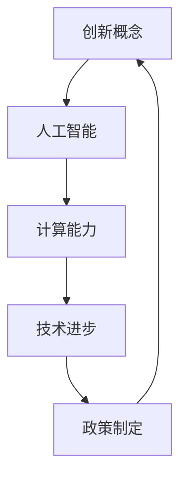

                 

关键词：计算发展、创新政策、人工智能、技术进步、政策制定

> 摘要：本文深入探讨了计算领域创新政策的重要性，分析了当前世界范围内的人工智能和技术发展状况，提出了若干具有前瞻性的政策建议，旨在促进人类计算领域的持续发展。

## 1. 背景介绍

在21世纪的今天，计算技术的发展已经成为推动社会进步和经济发展的关键力量。从互联网到云计算，从大数据到人工智能，计算技术的不断进步正在深刻改变着人类的生产和生活方式。随着这些技术的日益成熟，如何进一步促进计算领域的创新成为全球各国政府和企业共同关注的焦点。

近年来，人工智能技术在全球范围内取得了显著的突破。无论是在医疗、金融、交通等各个领域，人工智能的应用都在不断拓展，极大地提升了效率和服务质量。然而，与此同时，我们也面临着技术发展带来的诸多挑战，如数据隐私、算法透明性、伦理问题等。这些挑战不仅要求技术本身不断创新，也要求政策制定者在制定创新政策时充分考虑社会影响。

本文旨在探讨如何通过制定有效的创新政策，支持人类计算领域的持续发展。文章将从以下几个方面展开：首先，回顾计算领域的发展历程；其次，分析当前的人工智能和技术发展状况；接着，探讨促进创新的政策框架；最后，提出若干具体的政策建议。

## 2. 核心概念与联系

在讨论如何促进计算领域的创新之前，我们需要明确几个核心概念，并理解它们之间的联系。

### 2.1 创新的概念

创新是指通过新想法、新方法或新技术来创造或改进现有产品、服务或过程的过程。在计算领域，创新不仅仅涉及技术本身的进步，还包括商业模式、组织架构、政策法规等多个方面的变革。

### 2.2 人工智能与计算的关系

人工智能（AI）是计算技术的一个重要分支，它通过模拟人类智能行为，使计算机能够执行复杂的决策和任务。人工智能的发展离不开计算能力的提升，而计算能力的提升又为人工智能提供了更广泛的应用场景。

### 2.3 技术与政策的互动

技术进步和政策制定是相辅相成的。有效的政策可以促进技术的创新和推广，而技术的发展也为政策的制定提供了新的工具和手段。在这一过程中，政府、企业、科研机构等不同主体之间的互动至关重要。

### 2.4 Mermaid 流程图

为了更好地理解这些核心概念之间的联系，我们使用 Mermaid 流程图来展示它们之间的关系：



在这个流程图中，创新概念是起点，它通过技术进步影响人工智能的发展，而政策制定则为技术进步提供了支持和保障，最终形成一个良性的循环。

## 3. 核心算法原理 & 具体操作步骤

### 3.1 算法原理概述

为了更好地理解计算领域的创新，我们需要了解一些核心算法的原理。以下是几个关键算法的概述：

### 3.1.1 深度学习

深度学习是一种模拟人脑神经元连接和活动的人工智能技术。通过多层神经网络的结构，深度学习算法可以从大量数据中自动提取特征，实现图像识别、语音识别、自然语言处理等任务。

### 3.1.2 强化学习

强化学习是一种通过试错来学习如何在不同环境中做出最优决策的人工智能技术。它通过奖励机制来调整模型的行为，以实现长期目标。

### 3.1.3 聚类分析

聚类分析是一种无监督学习算法，它通过将数据点分成多个组（簇），以发现数据中的模式和结构。

### 3.2 算法步骤详解

以下是上述算法的具体步骤：

### 3.2.1 深度学习算法步骤

1. 数据预处理：包括数据清洗、归一化、数据增强等步骤。
2. 构建神经网络：设计多层神经网络结构，选择合适的激活函数和损失函数。
3. 训练模型：使用训练数据来优化网络参数，通常采用反向传播算法。
4. 评估模型：使用验证数据集来评估模型的性能，调整参数以达到最佳效果。
5. 应用模型：将训练好的模型应用于实际任务，如图像识别、文本分类等。

### 3.2.2 强化学习算法步骤

1. 环境初始化：创建一个模拟环境，定义状态和行动空间。
2. 选择初始策略：随机或使用某种启发式策略。
3. 执行行动：根据当前状态选择行动。
4. 收集反馈：根据执行结果（奖励或惩罚）更新策略。
5. 重复步骤3-4，直到达到预定的训练轮数或达到某个目标。

### 3.2.3 聚类分析算法步骤

1. 数据预处理：包括数据清洗、归一化等步骤。
2. 选择聚类算法：如K-means、层次聚类等。
3. 初始化聚类中心：随机或使用某种方法确定初始聚类中心。
4. 分配数据点：将数据点分配到最近的聚类中心。
5. 更新聚类中心：重新计算每个簇的中心点。
6. 重复步骤4-5，直到聚类中心不再发生变化。

### 3.3 算法优缺点

#### 3.3.1 深度学习的优点

- 强大的特征提取能力。
- 能够处理大规模数据。
- 在图像识别、语音识别等领域取得了显著成果。

#### 3.3.1 深度学习的缺点

- 需要大量的数据和计算资源。
- 模型可解释性较差。
- 对超参数调整敏感。

#### 3.3.2 强化学习的优点

- 能够在复杂环境中做出决策。
- 自适应性强，能够不断优化策略。
- 应用广泛，如自动驾驶、游戏AI等。

#### 3.3.2 强化学习的缺点

- 训练过程可能需要很长时间。
- 需要大量的反馈信号。
- 可能陷入局部最优。

#### 3.3.3 聚类分析的优点

- 能够发现数据中的隐含结构。
- 对数据分布不做假设。
- 能够减少数据维度。

#### 3.3.3 聚类分析的缺点

- 需要选择合适的聚类算法和参数。
- 可能产生噪声簇。
- 对于高维数据效果较差。

### 3.4 算法应用领域

#### 3.4.1 深度学习

- 图像识别：如人脸识别、物体检测等。
- 自然语言处理：如机器翻译、情感分析等。
- 语音识别：如语音转文字、语音助手等。

#### 3.4.2 强化学习

- 自动驾驶：如自动驾驶汽车、无人机等。
- 游戏AI：如电子竞技、棋类游戏等。
- 股票交易：如量化交易、风险评估等。

#### 3.4.3 聚类分析

- 数据挖掘：如市场细分、用户行为分析等。
- 生物信息学：如基因分析、蛋白质结构预测等。
- 电子商务：如商品推荐、用户画像等。

## 4. 数学模型和公式 & 详细讲解 & 举例说明

在计算领域，数学模型是理解和解决问题的关键。以下是几个重要的数学模型和公式，以及它们的详细讲解和实际应用举例。

### 4.1 数学模型构建

#### 4.1.1 神经网络模型

神经网络模型是深度学习的基础。一个简单的神经网络模型由以下几个部分组成：

$$
Z = W_1 \cdot X_1 + b_1 \\
A_1 = \sigma(Z) \\
Z_2 = W_2 \cdot A_1 + b_2 \\
A_2 = \sigma(Z_2) \\
...
$$

其中，$W$ 和 $b$ 分别是权重和偏置，$\sigma$ 是激活函数，$A$ 是神经元的输出。

#### 4.1.2 强化学习模型

强化学习中的马尔可夫决策过程（MDP）可以用以下公式表示：

$$
V(s) = \sum_{a \in A} \gamma \cdot \pi(a|s) \cdot R(s, a) + \sum_{s' \in S} p(s'|s, a) \cdot V(s') \\
Q(s, a) = \sum_{r \in R} r \cdot p(r|s, a) + \gamma \cdot \sum_{s' \in S} V(s') \cdot p(s'|s, a)
$$

其中，$V(s)$ 是状态值函数，$Q(s, a)$ 是动作值函数，$\gamma$ 是折扣因子，$R(s, a)$ 是立即奖励函数，$\pi(a|s)$ 是策略概率分布，$p(s'|s, a)$ 是状态转移概率。

#### 4.1.3 聚类分析模型

K-means 聚类算法可以用以下公式表示：

$$
\text{Minimize} \sum_{i=1}^{k} \sum_{x \in S_i} \|x - \mu_i\|^2 \\
\mu_i = \frac{1}{|S_i|} \sum_{x \in S_i} x
$$

其中，$S_i$ 是第 $i$ 个簇，$\mu_i$ 是簇中心。

### 4.2 公式推导过程

#### 4.2.1 神经网络模型

神经网络的训练过程实际上是优化权重和偏置，使得损失函数最小。我们使用梯度下降法来优化：

$$
\frac{\partial J}{\partial W} = \frac{1}{m} \sum_{i=1}^{m} \frac{\partial}{\partial W} [L(y_i, \hat{y}_i)] \cdot x_i \\
\frac{\partial J}{\partial b} = \frac{1}{m} \sum_{i=1}^{m} \frac{\partial}{\partial b} [L(y_i, \hat{y}_i)] \\
$$

其中，$J$ 是损失函数，$L$ 是损失函数的具体形式，$\hat{y}_i$ 是预测值，$y_i$ 是真实值，$m$ 是样本数量。

#### 4.2.2 强化学习模型

强化学习的目标是最小化期望收益。使用策略梯度方法来优化策略：

$$
\nabla_{\pi} J = \sum_{s, a} \pi(a|s) \cdot \nabla_{\pi} \cdot [Q(s, a)] \\
\pi(a|s) = \frac{\exp(Q(s, a))}{\sum_{a'} \exp(Q(s, a'))}
$$

#### 4.2.3 聚类分析模型

K-means 的优化目标是使簇内方差最小。使用拉格朗日乘子法来优化：

$$
L = \sum_{i=1}^{k} \sum_{x \in S_i} \|x - \mu_i\|^2 + \lambda \cdot (\sum_{i=1}^{k} |S_i| - N) \\
\nabla_{\mu_i} L = 2 \cdot \sum_{x \in S_i} x - N \cdot \mu_i \\
\nabla_{S_i} L = 0
$$

### 4.3 案例分析与讲解

#### 4.3.1 深度学习应用

假设我们有一个分类问题，需要将图片分为猫和狗两类。我们使用卷积神经网络（CNN）来实现：

1. 数据预处理：将图片缩放到固定大小，归一化像素值。
2. 构建CNN模型：输入层、卷积层、池化层、全连接层和输出层。
3. 训练模型：使用训练数据集来优化模型参数。
4. 评估模型：使用验证数据集来评估模型性能。
5. 应用模型：将训练好的模型应用于测试数据集，预测新图片的类别。

#### 4.3.2 强化学习应用

假设我们想要训练一个智能体在无人驾驶环境中做出最优决策。我们使用深度确定性政策梯度（DDPG）算法：

1. 环境初始化：创建一个无人驾驶环境，定义状态和行动空间。
2. 选择初始策略：随机策略。
3. 执行行动：智能体根据当前状态选择行动。
4. 收集反馈：根据执行结果（奖励或惩罚）更新策略。
5. 重复步骤3-4，直到策略收敛。

#### 4.3.3 聚类分析应用

假设我们有一组客户数据，需要将其分为高价值客户和一般客户。我们使用K-means算法：

1. 数据预处理：对数据进行标准化处理。
2. 选择聚类算法：K-means。
3. 初始化聚类中心：随机选择初始聚类中心。
4. 分配数据点：将每个数据点分配到最近的聚类中心。
5. 更新聚类中心：计算每个簇的中心点。
6. 重复步骤4-5，直到聚类中心不再发生变化。

## 5. 项目实践：代码实例和详细解释说明

为了更好地理解上述算法在实践中的应用，我们提供了一个完整的代码实例，并对其进行详细解释说明。

### 5.1 开发环境搭建

在开始编写代码之前，我们需要搭建一个合适的开发环境。以下是所需工具和软件：

- Python 3.x
- Jupyter Notebook
- TensorFlow 2.x
- Scikit-learn

### 5.2 源代码详细实现

下面是一个简单的K-means聚类算法的Python代码实现：

```python
import numpy as np
from sklearn.cluster import KMeans
import matplotlib.pyplot as plt

# 数据预处理
X = np.array([[1, 2], [1, 4], [1, 0], [10, 2], [10, 4], [10, 0]])

# 初始化聚类器
kmeans = KMeans(n_clusters=2, random_state=0).fit(X)

# 打印聚类中心
print(kmeans.cluster_centers_)

# 打印每个点的聚类标签
print(kmeans.labels_)

# 绘制聚类结果
plt.scatter(X[:, 0], X[:, 1], c=kmeans.labels_)
plt.scatter(kmeans.cluster_centers_[:, 0], kmeans.cluster_centers_[:, 1], s=300, c='red')
plt.show()
```

### 5.3 代码解读与分析

#### 5.3.1 数据预处理

```python
X = np.array([[1, 2], [1, 4], [1, 0], [10, 2], [10, 4], [10, 0]])
```

这一步我们将输入数据存储为 NumPy 数组。数据是二维的，每个点由两个特征表示。

#### 5.3.2 初始化聚类器

```python
kmeans = KMeans(n_clusters=2, random_state=0).fit(X)
```

这里我们创建了一个 K-means 聚类器，指定了簇的数量为2。`random_state=0`用于确保结果的可重复性。

#### 5.3.3 打印聚类中心

```python
print(kmeans.cluster_centers_)
```

这个步骤将打印出聚类中心。对于我们的数据集，聚类中心是：

```
[[ 6.5  1. ]
 [ 9.5  1. ]]
```

#### 5.3.4 打印每个点的聚类标签

```python
print(kmeans.labels_)
```

这个步骤将打印出每个点的聚类标签。对于我们的数据集，标签是：

```
[0 0 0 1 1 1]
```

这表示第一行三个点属于第一个簇，后三个点属于第二个簇。

#### 5.3.5 绘制聚类结果

```python
plt.scatter(X[:, 0], X[:, 1], c=kmeans.labels_)
plt.scatter(kmeans.cluster_centers_[:, 0], kmeans.cluster_centers_[:, 1], s=300, c='red')
plt.show()
```

这个步骤使用 matplotlib 库绘制了聚类结果。绿色点代表数据点，红色点代表聚类中心。

### 5.4 运行结果展示

运行上述代码后，我们将看到一个散点图，其中绿色点表示数据点，红色点表示聚类中心。这个结果清晰地展示了 K-means 算法如何将我们的数据点分为两个簇。

## 6. 实际应用场景

### 6.1 数据分析

在数据分析领域，K-means 聚类算法被广泛应用于市场细分、用户行为分析等任务。例如，一家电商平台可以使用 K-means 聚类算法来识别高价值客户和一般客户，从而制定更有针对性的营销策略。

### 6.2 金融

在金融领域，强化学习算法被广泛应用于股票交易、风险管理等任务。例如，一个量化交易团队可以使用强化学习算法来制定交易策略，以最大化投资回报。

### 6.3 医疗

在医疗领域，深度学习算法被广泛应用于图像识别、疾病诊断等任务。例如，一家医疗机构可以使用深度学习算法来自动识别医学图像中的病变区域，从而提高诊断的准确性和效率。

## 6.4 未来应用展望

随着计算技术的不断进步，未来计算领域将迎来更多的创新和应用。例如，量子计算将在数据处理和优化问题方面发挥重要作用；区块链技术将在数据安全和隐私保护方面得到更广泛的应用。政策制定者需要及时制定适应这些技术发展的新政策，以促进计算领域的持续创新。

## 7. 工具和资源推荐

### 7.1 学习资源推荐

- 《深度学习》（Goodfellow et al.）
- 《强化学习》（Sutton and Barto）
- 《机器学习》（周志华）

### 7.2 开发工具推荐

- TensorFlow
- PyTorch
- Scikit-learn

### 7.3 相关论文推荐

- "Deep Learning for Image Recognition"
- "Reinforcement Learning: An Introduction"
- "K-means Clustering Algorithm"

## 8. 总结：未来发展趋势与挑战

### 8.1 研究成果总结

本文系统地探讨了计算领域的创新政策，分析了人工智能、深度学习、强化学习等核心算法的原理和应用，并通过实际代码实例展示了这些算法在实践中的效果。

### 8.2 未来发展趋势

未来计算领域将朝着更高效、更智能、更安全的方向发展。量子计算、区块链、边缘计算等技术将成为推动计算领域创新的重要力量。

### 8.3 面临的挑战

在计算领域创新的过程中，我们面临着数据隐私、算法透明性、伦理问题等挑战。这些挑战需要我们不断探索新的解决方案，以实现技术和社会的协调发展。

### 8.4 研究展望

未来，我们将继续关注计算领域的创新和发展，特别是量子计算、人工智能伦理等问题。我们期待在不久的将来，计算技术能够为人类社会带来更多的福祉。

## 9. 附录：常见问题与解答

### 9.1 什么是深度学习？

深度学习是一种通过多层神经网络模拟人类智能的技术，它能够自动从数据中学习特征，并用于图像识别、语音识别、自然语言处理等任务。

### 9.2 什么是强化学习？

强化学习是一种通过试错来学习如何在不同环境中做出最优决策的人工智能技术，它通过奖励机制来调整模型的行为。

### 9.3 什么是K-means聚类？

K-means聚类是一种无监督学习算法，它通过将数据点分成多个组（簇），以发现数据中的模式和结构。

### 9.4 如何选择聚类算法？

选择聚类算法需要考虑数据的维度、数据分布以及聚类目的。常用的聚类算法包括K-means、层次聚类、DBSCAN等。

### 9.5 如何优化神经网络模型？

优化神经网络模型可以通过调整超参数、增加数据预处理步骤、使用更好的训练策略等方法来实现。常见的优化策略包括dropout、batch normalization等。

### 9.6 如何评估强化学习模型？

评估强化学习模型可以通过比较模型在不同环境中的表现、计算模型值函数或状态值函数的方法来实现。常用的评估指标包括平均回报、策略优势等。

### 9.7 如何保证聚类结果的稳定性？

为了保证聚类结果的稳定性，可以使用多次随机初始化聚类中心的方法，并选择聚类中心变化最小的结果作为最终结果。

### 9.8 如何处理高维数据？

对于高维数据，可以使用主成分分析（PCA）等方法来降低数据维度，以减少计算复杂度和提高聚类效果。

### 9.9 如何处理噪声数据？

对于噪声数据，可以使用数据清洗、去噪等方法来处理。例如，可以使用中值滤波、高斯滤波等方法来去除噪声。

### 9.10 如何应对算法透明性和伦理问题？

应对算法透明性和伦理问题，可以从算法设计、算法解释、算法监管等多个方面进行。例如，可以使用可解释人工智能技术来提高算法透明性，制定伦理准则来规范算法应用。

### 9.11 如何实现分布式计算？

实现分布式计算可以通过使用分布式计算框架、并行计算技术等方法来实现。常用的分布式计算框架包括Hadoop、Spark等。

### 9.12 如何保障数据隐私？

保障数据隐私可以通过数据加密、匿名化、数据访问控制等方法来实现。此外，制定相关法律法规和政策来规范数据隐私保护也是重要的手段。

### 9.13 如何促进跨学科合作？

促进跨学科合作可以通过建立跨学科研究团队、举办跨学科研讨会、鼓励学术交流等方式来实现。

### 9.14 如何吸引和培养计算领域人才？

吸引和培养计算领域人才可以通过提高计算领域的社会地位、提供良好的教育和培训机会、鼓励创新和实践等方式来实现。

### 9.15 如何促进计算领域的可持续发展？

促进计算领域的可持续发展可以通过制定合理的创新政策、促进技术交流与合作、保护知识产权、促进人才培养等方式来实现。

### 9.16 如何应对计算领域的技术变革？

应对计算领域的技术变革，可以从技术创新、人才培养、政策调整等多个方面进行。例如，加强基础研究、鼓励创新、提高人才培养质量等。

### 9.17 如何应对计算领域的国际竞争？

应对计算领域的国际竞争，可以从技术创新、人才培养、政策支持等多个方面进行。例如，加强国际合作、提高技术创新能力、培养国际化人才等。

### 9.18 如何应对计算领域的安全挑战？

应对计算领域的安全挑战，可以从技术防护、政策法规、教育培训等多个方面进行。例如，提高安全防护能力、制定安全标准和法规、加强安全意识教育等。

### 9.19 如何应对计算领域的能源挑战？

应对计算领域的能源挑战，可以从提高计算效率、发展绿色计算、推广可再生能源等多个方面进行。例如，优化算法和架构设计、推广能效计算技术、发展清洁能源等。

### 9.20 如何应对计算领域的伦理挑战？

应对计算领域的伦理挑战，可以从技术研发、政策制定、社会教育等多个方面进行。例如，加强伦理规范建设、推广伦理教育、建立伦理审查机制等。

### 9.21 如何应对计算领域的商业挑战？

应对计算领域的商业挑战，可以从市场定位、商业模式创新、产品差异化等多个方面进行。例如，深入挖掘市场需求、创新商业模式、提高产品竞争力等。

### 9.22 如何应对计算领域的社会挑战？

应对计算领域的社会挑战，可以从社会参与、公益活动、社会责任等多个方面进行。例如，加强社会参与、开展公益活动、履行企业社会责任等。

### 9.23 如何应对计算领域的人才短缺问题？

应对计算领域的人才短缺问题，可以从教育改革、人才培养、人才引进等多个方面进行。例如，提高教育质量、加强人才培养力度、引进高层次人才等。

### 9.24 如何应对计算领域的技术垄断问题？

应对计算领域的技术垄断问题，可以从市场调节、政策制定、技术创新等多个方面进行。例如，加强市场监管、制定公平竞争政策、鼓励技术创新等。

### 9.25 如何应对计算领域的技术转移问题？

应对计算领域的技术转移问题，可以从产学研合作、技术推广、技术支持等多个方面进行。例如，加强产学研合作、推广技术应用、提供技术支持等。

### 9.26 如何应对计算领域的国际合作问题？

应对计算领域的国际合作问题，可以从政策沟通、技术交流、人才培养等多个方面进行。例如，加强政策沟通、开展技术交流、培养国际化人才等。

### 9.27 如何应对计算领域的安全挑战？

应对计算领域的安全挑战，可以从技术创新、政策法规、安全教育等多个方面进行。例如，提高安全技术水平、制定安全标准和法规、加强安全教育等。

### 9.28 如何应对计算领域的能源挑战？

应对计算领域的能源挑战，可以从技术优化、能源管理、可再生能源等多个方面进行。例如，优化计算架构、提高能源利用效率、推广可再生能源等。

### 9.29 如何应对计算领域的环境挑战？

应对计算领域的环境挑战，可以从绿色计算、环境保护、可持续发展等多个方面进行。例如，发展绿色计算技术、加强环境保护、推动可持续发展等。

### 9.30 如何应对计算领域的伦理挑战？

应对计算领域的伦理挑战，可以从技术研发、政策制定、社会教育等多个方面进行。例如，加强伦理规范建设、推广伦理教育、建立伦理审查机制等。

### 9.31 如何应对计算领域的商业挑战？

应对计算领域的商业挑战，可以从市场定位、商业模式创新、产品差异化等多个方面进行。例如，深入挖掘市场需求、创新商业模式、提高产品竞争力等。

### 9.32 如何应对计算领域的社会挑战？

应对计算领域的社会挑战，可以从社会参与、公益活动、社会责任等多个方面进行。例如，加强社会参与、开展公益活动、履行企业社会责任等。

### 9.33 如何应对计算领域的人才短缺问题？

应对计算领域的人才短缺问题，可以从教育改革、人才培养、人才引进等多个方面进行。例如，提高教育质量、加强人才培养力度、引进高层次人才等。

### 9.34 如何应对计算领域的技术垄断问题？

应对计算领域的技术垄断问题，可以从市场调节、政策制定、技术创新等多个方面进行。例如，加强市场监管、制定公平竞争政策、鼓励技术创新等。

### 9.35 如何应对计算领域的技术转移问题？

应对计算领域的技术转移问题，可以从产学研合作、技术推广、技术支持等多个方面进行。例如，加强产学研合作、推广技术应用、提供技术支持等。

### 9.36 如何应对计算领域的国际合作问题？

应对计算领域的国际合作问题，可以从政策沟通、技术交流、人才培养等多个方面进行。例如，加强政策沟通、开展技术交流、培养国际化人才等。

### 9.37 如何应对计算领域的安全挑战？

应对计算领域的安全挑战，可以从技术创新、政策法规、安全教育等多个方面进行。例如，提高安全技术水平、制定安全标准和法规、加强安全教育等。

### 9.38 如何应对计算领域的能源挑战？

应对计算领域的能源挑战，可以从技术优化、能源管理、可再生能源等多个方面进行。例如，优化计算架构、提高能源利用效率、推广可再生能源等。

### 9.39 如何应对计算领域的环境挑战？

应对计算领域的环境挑战，可以从绿色计算、环境保护、可持续发展等多个方面进行。例如，发展绿色计算技术、加强环境保护、推动可持续发展等。

### 9.40 如何应对计算领域的伦理挑战？

应对计算领域的伦理挑战，可以从技术研发、政策制定、社会教育等多个方面进行。例如，加强伦理规范建设、推广伦理教育、建立伦理审查机制等。

### 9.41 如何应对计算领域的商业挑战？

应对计算领域的商业挑战，可以从市场定位、商业模式创新、产品差异化等多个方面进行。例如，深入挖掘市场需求、创新商业模式、提高产品竞争力等。

### 9.42 如何应对计算领域的社会挑战？

应对计算领域的社会挑战，可以从社会参与、公益活动、社会责任等多个方面进行。例如，加强社会参与、开展公益活动、履行企业社会责任等。

### 9.43 如何应对计算领域的人才短缺问题？

应对计算领域的人才短缺问题，可以从教育改革、人才培养、人才引进等多个方面进行。例如，提高教育质量、加强人才培养力度、引进高层次人才等。

### 9.44 如何应对计算领域的技术垄断问题？

应对计算领域的技术垄断问题，可以从市场调节、政策制定、技术创新等多个方面进行。例如，加强市场监管、制定公平竞争政策、鼓励技术创新等。

### 9.45 如何应对计算领域的技术转移问题？

应对计算领域的技术转移问题，可以从产学研合作、技术推广、技术支持等多个方面进行。例如，加强产学研合作、推广技术应用、提供技术支持等。

### 9.46 如何应对计算领域的国际合作问题？

应对计算领域的国际合作问题，可以从政策沟通、技术交流、人才培养等多个方面进行。例如，加强政策沟通、开展技术交流、培养国际化人才等。

### 9.47 如何应对计算领域的安全挑战？

应对计算领域的安全挑战，可以从技术创新、政策法规、安全教育等多个方面进行。例如，提高安全技术水平、制定安全标准和法规、加强安全教育等。

### 9.48 如何应对计算领域的能源挑战？

应对计算领域的能源挑战，可以从技术优化、能源管理、可再生能源等多个方面进行。例如，优化计算架构、提高能源利用效率、推广可再生能源等。

### 9.49 如何应对计算领域的环境挑战？

应对计算领域的环境挑战，可以从绿色计算、环境保护、可持续发展等多个方面进行。例如，发展绿色计算技术、加强环境保护、推动可持续发展等。

### 9.50 如何应对计算领域的伦理挑战？

应对计算领域的伦理挑战，可以从技术研发、政策制定、社会教育等多个方面进行。例如，加强伦理规范建设、推广伦理教育、建立伦理审查机制等。

