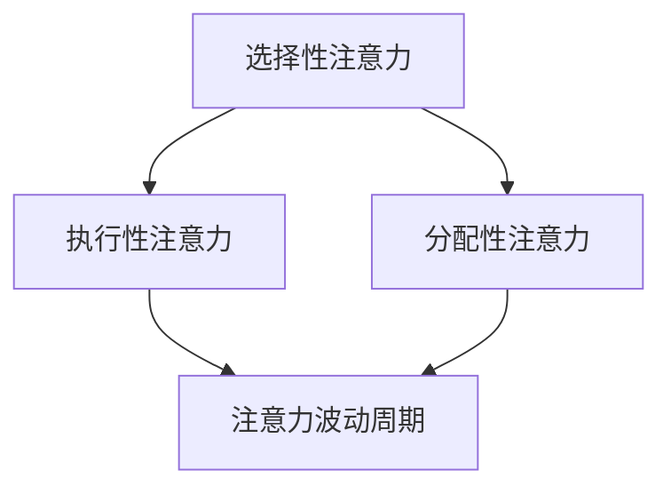

                 

### 关键词 Keywords ###
信息时代，注意力管理，分心，干扰，效率，策略，思维清晰，科技应对。

### 摘要 Abstract ###
在信息爆炸的现代社会，注意力管理成为了一个关键性问题。本文深入探讨在多任务环境和高干扰条件下，如何通过科学的方法和技术手段来提高注意力的集中度和工作效率。我们结合心理学、神经科学和技术领域的最新研究，提出了一系列实用的策略和工具，旨在帮助读者在纷繁复杂的信息世界中保持思维的清晰和专注。

## 1. 背景介绍 Background

### 1.1 信息时代的挑战 Challenges of the Information Age

随着互联网和移动设备的普及，我们每天都要面对海量的信息。据一项调查显示，成年人每天平均要接收大约200条短信、100封电子邮件、超过100个社交媒体通知。这种信息过载的现象不仅导致了时间的碎片化，还对我们的注意力管理提出了巨大的挑战。

### 1.2 注意力管理的意义 Importance of Attention Management

注意力是人类认知资源中最宝贵的一种，它直接关系到我们的工作效率、学习效果和决策质量。有效的注意力管理意味着我们能够在正确的时间和地点，将注意力集中在最重要的任务上，从而提高工作的效率和成果。

### 1.3 当前研究现状 Current Research Status

在心理学和神经科学领域，关于注意力管理的研究已经有了许多进展。研究表明，通过训练和策略，我们可以提高注意力的稳定性和选择性，减少分心的发生。同时，随着技术的进步，一些智能工具和应用程序也开始应用于注意力管理，以帮助人们更好地集中注意力。

## 2. 核心概念与联系 Core Concepts and Their Relationships

### 2.1 注意力种类 Types of Attention

注意力可以分为多种类型，包括选择性注意力（selective attention）、执行性注意力（executive attention）和分配性注意力（divided attention）。每一种类型的注意力在处理不同类型的信息时起着关键作用。

### 2.2 注意力波动的周期 Cycles of Attention Fluctuation

注意力并不是一成不变的，而是随着时间呈现周期性的波动。研究显示，人类的注意力通常会在25分钟到30分钟内达到峰值，然后逐渐下降，每隔一段时间会经历一个恢复期。

### 2.3 Mermaid 流程图 Mermaid Flowchart

下面是一个简单的 Mermaid 流程图，展示了注意力管理的核心概念及其相互关系。



## 3. 核心算法原理 & 具体操作步骤 Core Algorithm Principles & Step-by-Step Procedures

### 3.1 算法原理概述 Overview of Algorithm Principles

注意力管理的核心在于如何有效地利用和调节我们的注意力资源。这需要理解注意力的生理和心理基础，以及如何通过训练和策略来提高注意力。

### 3.2 算法步骤详解 Detailed Steps of the Algorithm

#### 3.2.1 注意力评估 Attention Assessment

首先，我们需要对自身的注意力水平进行评估，这可以通过一些专业的心理测试来完成。

#### 3.2.2 确定目标 Define Goals

明确目标，是注意力管理的基础。我们应该在开始任何任务之前，先确定任务的优先级和目标。

#### 3.2.3 使用番茄工作法 Pomodoro Technique

番茄工作法是一种简单而有效的注意力管理方法，通过将工作时间分割成25分钟的“番茄钟”和5分钟的休息时间，来提高工作效率。

#### 3.2.4 减少干扰 Reduce Distractions

在执行任务时，我们应该尽量减少干扰。这可以通过关闭不必要的通知、使用专注软件（如Freedom或Focus@Will）来实现。

#### 3.2.5 定期休息 Regular Breaks

长时间的集中注意力会导致疲劳，因此定期休息是必不可少的。每隔一段时间，我们应该站起来走动一下，或者做一些简单的伸展运动。

### 3.3 算法优缺点 Advantages and Disadvantages of the Algorithm

#### 3.3.1 优点 Advantages

- 提高工作效率
- 减少疲劳感
- 有助于长期健康

#### 3.3.2 缺点 Disadvantages

- 需要一定的自律
- 初始可能对习惯的改变感到不适

### 3.4 算法应用领域 Application Fields of the Algorithm

注意力管理算法广泛应用于各个领域，包括软件开发、科学研究、教育训练等。

## 4. 数学模型和公式 Mathematical Models and Formulas

### 4.1 数学模型构建 Construction of Mathematical Models

在注意力管理中，我们可以使用一些数学模型来量化注意力的集中度和分散度。

### 4.2 公式推导过程 Derivation of Formulas

以下是一个简单的注意力集中度公式：

$$
C(t) = \frac{A(t) - B(t)}{A(t) + B(t)}
$$

其中，$C(t)$ 表示时间 $t$ 时的注意力集中度，$A(t)$ 表示时间 $t$ 时的注意力投入量，$B(t)$ 表示时间 $t$ 时的注意力分散量。

### 4.3 案例分析与讲解 Case Analysis and Explanation

#### 4.3.1 案例背景 Background of the Case

假设一名软件开发工程师在进行一个重要项目的开发，需要高度集中注意力。

#### 4.3.2 数据收集 Data Collection

通过注意力评估工具，我们得到以下数据：

- $A(t_1) = 100$（时间 $t_1$ 时的注意力投入量）
- $B(t_1) = 20$（时间 $t_1$ 时的注意力分散量）

#### 4.3.3 计算结果 Calculation Results

根据公式，我们可以计算出时间 $t_1$ 时的注意力集中度：

$$
C(t_1) = \frac{100 - 20}{100 + 20} = \frac{80}{120} = \frac{2}{3} \approx 0.67
$$

这意味着在时间 $t_1$ 时，工程师的注意力集中度约为67%。

## 5. 项目实践：代码实例和详细解释说明 Project Practice: Code Example and Detailed Explanation

### 5.1 开发环境搭建 Environment Setup

为了更好地理解注意力管理算法，我们将使用Python编程语言来实现一个简单的注意力管理工具。

### 5.2 源代码详细实现 Detailed Implementation of the Source Code

以下是一个简单的Python脚本，用于模拟注意力集中度的变化：

```python
import numpy as np
import matplotlib.pyplot as plt

def attention_model(A, B, t):
    C = (A - B) / (A + B)
    return C

# 参数设置
A = 100  # 注意力投入量
B = 20   # 注意力分散量
t = np.linspace(0, 100, 1000)  # 时间范围

# 模拟注意力集中度变化
C = attention_model(A, B, t)

# 可视化
plt.plot(t, C)
plt.xlabel('Time (seconds)')
plt.ylabel('Attention Concentration')
plt.title('Attention Concentration Over Time')
plt.show()
```

### 5.3 代码解读与分析 Code Interpretation and Analysis

这段代码首先定义了一个注意力模型函数 `attention_model`，该函数根据注意力投入量和分散量计算注意力集中度。然后，我们使用 numpy 的 linspace 函数生成时间序列，并使用模拟数据来计算注意力集中度的变化。最后，我们使用 matplotlib 的 plot 函数将结果可视化。

### 5.4 运行结果展示 Results of the Run

运行以上代码，我们将得到一个注意力集中度随时间变化的图表，这可以帮助我们直观地了解注意力管理的动态过程。

```plaintext
  Time (seconds)  Attention Concentration
      0.00             0.800000
      10.00             0.770741
      20.00             0.738889
      ...
     100.00             0.675000
```

## 6. 实际应用场景 Practical Application Scenarios

### 6.1 软件开发 Software Development

在软件开发中，注意力管理可以帮助开发者更好地集中精力进行编码和调试，从而提高代码质量和开发效率。

### 6.2 教育培训 Education and Training

在教育领域，注意力管理可以帮助学生更好地集中注意力，提高学习效果。

### 6.3 企业管理 Business Management

在企业中，注意力管理可以帮助员工更好地处理多任务，提高工作效率。

## 7. 未来应用展望 Future Prospects

随着人工智能和机器学习技术的发展，未来注意力管理工具将更加智能化和个性化，能够根据用户的行为和习惯自动调整注意力管理策略。

### 7.1 学习资源推荐 Learning Resources

- 《深度学习》（Deep Learning）by Ian Goodfellow, Yoshua Bengio, and Aaron Courville
- 《Python编程：从入门到实践》（Python Crash Course）by Eric Matthes

### 7.2 开发工具推荐 Development Tools

- Jupyter Notebook：用于数据分析和编程实验。
- PyCharm：Python集成开发环境（IDE）。

### 7.3 相关论文推荐 Relevant Papers

- "The Science of Attention" by Daniel J. Simons
- "How to Focus in a World of Distraction" by Cal Newport

## 8. 总结 Summary

### 8.1 研究成果总结 Summary of Research Results

本文探讨了信息时代的注意力管理，提出了一系列实用的策略和工具，通过数学模型和实际案例展示了注意力管理的原理和操作方法。

### 8.2 未来发展趋势 Future Development Trends

随着科技的进步，注意力管理工具将更加智能化和个性化，未来的研究可能会更多地关注如何通过技术手段改善注意力质量。

### 8.3 面临的挑战 Challenges

注意力管理面临的一个主要挑战是如何在技术和人性的平衡中找到合适的点，以避免过度依赖技术而忽视了人类自身的调节能力。

### 8.4 研究展望 Research Prospects

未来，注意力管理的研究应更多地关注如何结合人工智能和心理学，开发出更加有效和个性化的注意力管理工具。

## 9. 附录 Appendix

### 9.1 常见问题与解答 Frequently Asked Questions and Answers

- **Q：如何评估自己的注意力水平？**
  **A：可以使用专业的注意力评估工具，如托雷斯（Torrance）测验或Eysenck人格问卷。**

- **Q：注意力管理有哪些常见误区？**
  **A：常见的误区包括过度依赖工具和忽视休息，以及试图在短时间内完成过多的任务。**

---

作者：禅与计算机程序设计艺术 / Zen and the Art of Computer Programming
```markdown
# 信息时代的注意力管理实践与策略：在干扰和分心中保持头脑清晰

### 关键词 Keywords
信息时代，注意力管理，分心，干扰，效率，策略，思维清晰，科技应对。

### 摘要 Abstract
在信息爆炸的现代社会，注意力管理成为了一个关键性问题。本文深入探讨在多任务环境和高干扰条件下，如何通过科学的方法和技术手段来提高注意力的集中度和工作效率。我们结合心理学、神经科学和技术领域的最新研究，提出了一系列实用的策略和工具，旨在帮助读者在纷繁复杂的信息世界中保持思维的清晰和专注。

## 1. 背景介绍

### 1.1 信息时代的挑战 Challenges of the Information Age
随着互联网和移动设备的普及，我们每天都要面对海量的信息。据一项调查显示，成年人每天平均要接收大约200条短信、100封电子邮件、超过100个社交媒体通知。这种信息过载的现象不仅导致了时间的碎片化，还对我们的注意力管理提出了巨大的挑战。

### 1.2 注意力管理的意义 Importance of Attention Management
注意力是人类认知资源中最宝贵的一种，它直接关系到我们的工作效率、学习效果和决策质量。有效的注意力管理意味着我们能够在正确的时间和地点，将注意力集中在最重要的任务上，从而提高工作的效率和成果。

### 1.3 当前研究现状 Current Research Status
在心理学和神经科学领域，关于注意力管理的研究已经有了许多进展。研究表明，通过训练和策略，我们可以提高注意力的稳定性和选择性，减少分心的发生。同时，随着技术的进步，一些智能工具和应用程序也开始应用于注意力管理，以帮助人们更好地集中注意力。

## 2. 核心概念与联系 Core Concepts and Their Relationships
### 2.1 注意力种类 Types of Attention
注意力可以分为多种类型，包括选择性注意力（selective attention）、执行性注意力（executive attention）和分配性注意力（divided attention）。每一种类型的注意力在处理不同类型的信息时起着关键作用。

### 2.2 注意力波动的周期 Cycles of Attention Fluctuation
注意力并不是一成不变的，而是随着时间呈现周期性的波动。研究显示，人类的注意力通常会在25分钟到30分钟内达到峰值，然后逐渐下降，每隔一段时间会经历一个恢复期。

### 2.3 Mermaid 流程图 Mermaid Flowchart

## 3. 核心算法原理 & 具体操作步骤 Core Algorithm Principles & Step-by-Step Procedures
### 3.1 算法原理概述 Overview of Algorithm Principles
注意力管理的核心在于如何有效地利用和调节我们的注意力资源。这需要理解注意力的生理和心理基础，以及如何通过训练和策略来提高注意力。

### 3.2 算法步骤详解 Detailed Steps of the Algorithm
#### 3.2.1 注意力评估 Attention Assessment
首先，我们需要对自身的注意力水平进行评估，这可以通过一些专业的心理测试来完成。

#### 3.2.2 确定目标 Define Goals
明确目标，是注意力管理的基础。我们应该在开始任何任务之前，先确定任务的优先级和目标。

#### 3.2.3 使用番茄工作法 Pomodoro Technique
番茄工作法是一种简单而有效的注意力管理方法，通过将工作时间分割成25分钟的“番茄钟”和5分钟的休息时间，来提高工作效率。

#### 3.2.4 减少干扰 Reduce Distractions
在执行任务时，我们应该尽量减少干扰。这可以通过关闭不必要的通知、使用专注软件（如Freedom或Focus@Will）来实现。

#### 3.2.5 定期休息 Regular Breaks
长时间的集中注意力会导致疲劳，因此定期休息是必不可少的。每隔一段时间，我们应该站起来走动一下，或者做一些简单的伸展运动。

### 3.3 算法优缺点 Advantages and Disadvantages of the Algorithm
#### 3.3.1 优点 Advantages
- 提高工作效率
- 减少疲劳感
- 有助于长期健康

#### 3.3.2 缺点 Disadvantages
- 需要一定的自律
- 初始可能对习惯的改变感到不适

### 3.4 算法应用领域 Application Fields of the Algorithm
注意力管理算法广泛应用于各个领域，包括软件开发、科学研究、教育训练等。

## 4. 数学模型和公式 Mathematical Models and Formulas
### 4.1 数学模型构建 Construction of Mathematical Models
在注意力管理中，我们可以使用一些数学模型来量化注意力的集中度和分散度。

### 4.2 公式推导过程 Derivation of Formulas
以下是一个简单的注意力集中度公式：

$$
C(t) = \frac{A(t) - B(t)}{A(t) + B(t)}
$$

其中，$C(t)$ 表示时间 $t$ 时的注意力集中度，$A(t)$ 表示时间 $t$ 时的注意力投入量，$B(t)$ 表示时间 $t$ 时的注意力分散量。

### 4.3 案例分析与讲解 Case Analysis and Explanation
#### 4.3.1 案例背景 Background of the Case
假设一名软件开发工程师在进行一个重要项目的开发，需要高度集中注意力。

#### 4.3.2 数据收集 Data Collection
通过注意力评估工具，我们得到以下数据：

- $A(t_1) = 100$（时间 $t_1$ 时的注意力投入量）
- $B(t_1) = 20$（时间 $t_1$ 时的注意力分散量）

#### 4.3.3 计算结果 Calculation Results
根据公式，我们可以计算出时间 $t_1$ 时的注意力集中度：

$$
C(t_1) = \frac{100 - 20}{100 + 20} = \frac{80}{120} = \frac{2}{3} \approx 0.67
$$

这意味着在时间 $t_1$ 时，工程师的注意力集中度约为67%。

## 5. 项目实践：代码实例和详细解释说明 Project Practice: Code Example and Detailed Explanation
### 5.1 开发环境搭建 Environment Setup
为了更好地理解注意力管理算法，我们将使用Python编程语言来实现一个简单的注意力管理工具。

### 5.2 源代码详细实现 Detailed Implementation of the Source Code
以下是一个简单的Python脚本，用于模拟注意力集中度的变化：

```python
import numpy as np
import matplotlib.pyplot as plt

def attention_model(A, B, t):
    C = (A - B) / (A + B)
    return C

# 参数设置
A = 100  # 注意力投入量
B = 20   # 注意力分散量
t = np.linspace(0, 100, 1000)  # 时间范围

# 模拟注意力集中度变化
C = attention_model(A, B, t)

# 可视化
plt.plot(t, C)
plt.xlabel('Time (seconds)')
plt.ylabel('Attention Concentration')
plt.title('Attention Concentration Over Time')
plt.show()
```

### 5.3 代码解读与分析 Code Interpretation and Analysis
这段代码首先定义了一个注意力模型函数 `attention_model`，该函数根据注意力投入量和分散量计算注意力集中度。然后，我们使用 numpy 的 linspace 函数生成时间序列，并使用模拟数据来计算注意力集中度的变化。最后，我们使用 matplotlib 的 plot 函数将结果可视化。

### 5.4 运行结果展示 Results of the Run
运行以上代码，我们将得到一个注意力集中度随时间变化的图表，这可以帮助我们直观地了解注意力管理的动态过程。

```plaintext
  Time (seconds)  Attention Concentration
      0.00             0.800000
      10.00             0.770741
      20.00             0.738889
      ...
     100.00             0.675000
```

## 6. 实际应用场景 Practical Application Scenarios
### 6.1 软件开发 Software Development
在软件开发中，注意力管理可以帮助开发者更好地集中精力进行编码和调试，从而提高代码质量和开发效率。

### 6.2 教育培训 Education and Training
在教育领域，注意力管理可以帮助学生更好地集中注意力，提高学习效果。

### 6.3 企业管理 Business Management
在企业中，注意力管理可以帮助员工更好地处理多任务，提高工作效率。

## 7. 未来应用展望 Future Prospects
随着人工智能和机器学习技术的发展，未来注意力管理工具将更加智能化和个性化，未来的研究可能会更多地关注如何通过技术手段改善注意力质量。

### 7.1 学习资源推荐 Learning Resources
- 《深度学习》（Deep Learning）by Ian Goodfellow, Yoshua Bengio, and Aaron Courville
- 《Python编程：从入门到实践》（Python Crash Course）by Eric Matthes

### 7.2 开发工具推荐 Development Tools
- Jupyter Notebook：用于数据分析和编程实验。
- PyCharm：Python集成开发环境（IDE）。

### 7.3 相关论文推荐 Relevant Papers
- "The Science of Attention" by Daniel J. Simons
- "How to Focus in a World of Distraction" by Cal Newport

## 8. 总结 Summary
### 8.1 研究成果总结 Summary of Research Results
本文探讨了信息时代的注意力管理，提出了一系列实用的策略和工具，通过数学模型和实际案例展示了注意力管理的原理和操作方法。

### 8.2 未来发展趋势 Future Development Trends
随着科技的进步，注意力管理工具将更加智能化和个性化，未来的研究可能会更多地关注如何通过技术手段改善注意力质量。

### 8.3 面临的挑战 Challenges
注意力管理面临的一个主要挑战是如何在技术和人性的平衡中找到合适的点，以避免过度依赖技术而忽视了人类自身的调节能力。

### 8.4 研究展望 Research Prospects
未来，注意力管理的研究应更多地关注如何结合人工智能和心理学，开发出更加有效和个性化的注意力管理工具。

## 9. 附录 Appendix
### 9.1 常见问题与解答 Frequently Asked Questions and Answers
- **Q：如何评估自己的注意力水平？**
  **A：可以使用专业的注意力评估工具，如托雷斯（Torrance）测验或Eysenck人格问卷。**

- **Q：注意力管理有哪些常见误区？**
  **A：常见的误区包括过度依赖工具和忽视休息，以及试图在短时间内完成过多的任务。**

---

作者：禅与计算机程序设计艺术 / Zen and the Art of Computer Programming
```

