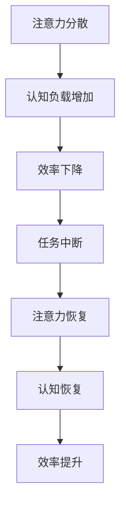

                 

关键词：注意力管理、干扰、分心、效率、认知心理学、技术实践、策略

> 摘要：随着信息技术的迅猛发展，我们进入了一个高度互联和动态变化的数字时代。在这个时代中，干扰和分心现象变得愈发普遍，严重影响了人们的注意力质量和工作效率。本文将深入探讨注意力管理的核心概念、原理及其应用，并结合实际技术和策略，帮助读者在复杂的信息环境中保持头脑清晰，提升个人和团队的生产力。

## 1. 背景介绍

### 信息爆炸时代的影响

在互联网和移动通信技术飞速发展的今天，信息量呈爆炸式增长。社交媒体、电子邮件、即时通讯工具等使得人们面临前所未有的信息涌入。这种信息过载不仅增加了人们接收和处理信息的工作量，还导致了持续的精神紧张和疲劳。心理学家米哈里·契克森米哈伊（Mihaly Csikszentmihalyi）提出的“心流”（Flow）理论指出，当人们专注于某项任务时，能够进入一种全神贯注、忘记时间的“心流”状态，从而提高工作效率和创造力。然而，信息干扰和分心现象的普遍存在，使得许多人难以达到这种理想的状态。

### 注意力管理的重要性

注意力管理不仅关乎个人效率，还影响到团队协作和企业的整体表现。高效的注意力管理能够帮助个体在复杂的工作环境中集中精力，提高任务完成质量和速度。对于团队来说，良好的注意力管理能够提升协作效率，减少沟通成本，促进创新。在企业层面，注意力管理有助于提升员工满意度和忠诚度，从而提高企业的竞争力和市场地位。

## 2. 核心概念与联系

### 核心概念

注意力管理涉及到多个核心概念，包括注意力分散、注意力恢复、认知负载等。

- **注意力分散（Attentional Diversion）**：指在执行任务时，由于外部或内部干扰，注意力从当前任务转移到其他无关事物上。
- **注意力恢复（Attentional Recovery）**：指通过休息和放松，恢复注意力和精力，以便更好地继续工作。
- **认知负载（Cognitive Load）**：指在信息处理过程中，大脑需要处理的认知信息的数量和复杂度。

### Mermaid 流程图

下面是注意力管理中关键概念和过程的 Mermaid 流程图：



## 3. 核心算法原理 & 具体操作步骤

### 3.1 算法原理概述

注意力管理的核心算法主要基于认知心理学原理，包括以下方面：

- **分散式注意力策略**：通过将注意力分散到多个任务上，减少单一任务对注意力的消耗。
- **注意力恢复策略**：通过短暂的休息和放松，恢复注意力和精力。
- **任务优先级管理**：根据任务的紧急程度和重要性，合理安排任务顺序，避免注意力被不重要或紧急的任务分散。

### 3.2 算法步骤详解

1. **评估任务重要性**：对当前待完成的任务进行优先级排序，明确哪些任务最为重要和紧急。
2. **设定注意力时间段**：根据工作习惯和身体状态，设定一个合适的工作时间段，如25分钟专注工作，5分钟休息。
3. **分散注意力**：在任务执行过程中，适当将注意力分散到其他相关任务上，避免长时间集中在一个任务上导致疲劳。
4. **注意力恢复**：在完成一定时间的工作后，进行短暂的休息和放松，如散步、深呼吸或简短的冥想。
5. **任务优先级调整**：在休息结束后，重新评估任务优先级，并根据新的优先级顺序继续工作。

### 3.3 算法优缺点

**优点**：

- 提高工作效率：通过合理的任务分配和注意力管理，能够显著提升工作完成质量和速度。
- 减少疲劳：通过分散注意力和注意力恢复策略，减少长时间工作导致的疲劳和焦虑。
- 提升创新能力：在心流状态下，能够更好地发挥创造力和创新能力。

**缺点**：

- 需要较高的自我管理能力：注意力管理需要个体具备较强的自我管理能力，如时间管理、情绪管理等。
- 难以应对突发事件：在突发事件发生时，原有的注意力管理策略可能需要临时调整，增加管理难度。

### 3.4 算法应用领域

注意力管理算法广泛应用于个人生活和工作中，如：

- **个人时间管理**：通过设定工作时间段和休息时间，合理安排个人时间，提高工作效率。
- **项目管理**：在项目管理中，通过设定任务优先级和分配注意力，确保项目顺利进行。
- **企业培训**：通过培训员工注意力管理技能，提升员工工作质量和团队协作能力。

## 4. 数学模型和公式 & 详细讲解 & 举例说明

### 4.1 数学模型构建

注意力管理的数学模型可以基于认知负荷理论（Cognitive Load Theory），其核心公式如下：

$$
CL = IL + EI
$$

其中，$CL$ 代表认知负荷（Cognitive Load），$IL$ 代表内在负荷（Intrinsic Load），$EI$ 代表外在负荷（Extrinsic Load）。

- **内在负荷（IL）**：指任务本身固有的复杂度和难度，如数学问题的解决。
- **外在负荷（EI）**：指外部因素对注意力的干扰，如电子邮件通知、电话打扰等。

### 4.2 公式推导过程

认知负荷理论认为，当认知负荷过高时，个体的注意力和工作效率会下降。基于此，我们可以推导出以下关系：

1. **内在负荷（IL）**：任务复杂度越高，内在负荷越大。例如，学习一项新技能需要更高的内在负荷。
2. **外在负荷（EI）**：外部干扰越多，外在负荷越大。例如，在嘈杂的环境中工作，外在负荷会显著增加。
3. **认知负荷（CL）**：当内在负荷和外在负荷同时增加时，认知负荷会呈指数级上升。

### 4.3 案例分析与讲解

假设小明是一名软件工程师，他需要在规定的时间内完成一个重要的项目。根据认知负荷理论，我们可以分析小明的工作情况：

1. **内在负荷（IL）**：编程任务本身具有较高的复杂度，需要解决各种技术难题。
2. **外在负荷（EI）**：小明的工作环境中存在频繁的电子邮件通知、电话打扰等外部干扰。

为了降低认知负荷，小明可以采取以下策略：

- **分散注意力**：将编程任务分解为多个小任务，分阶段完成，避免长时间集中在一个任务上。
- **注意力恢复**：在编程过程中，适当休息，如每工作25分钟后休息5分钟，进行深呼吸或简短的冥想。
- **任务优先级管理**：优先处理重要且紧急的任务，避免低优先级任务的干扰。

通过这些策略，小明可以有效降低认知负荷，提高工作效率，确保项目按时完成。

## 5. 项目实践：代码实例和详细解释说明

### 5.1 开发环境搭建

为了更好地展示注意力管理的实际应用，我们将使用Python编写一个简单的注意力管理工具。以下是开发环境搭建的步骤：

1. 安装Python（建议使用Python 3.8或更高版本）。
2. 安装必需的Python库，如`schedule`、`time`、`sys`等。

### 5.2 源代码详细实现

下面是一个简单的注意力管理工具的源代码实现：

```python
import schedule
import time
from datetime import datetime

def work():
    print(f"{datetime.now()}: 开始工作。")
    # 在这里执行具体的工作任务
    time.sleep(25)  # 假设工作时间为25分钟
    print(f"{datetime.now()}: 工作完成。")

def rest():
    print(f"{datetime.now()}: 开始休息。")
    # 在这里执行休息任务
    time.sleep(5)  # 假设休息时间为5分钟
    print(f"{datetime.now()}: 休息结束。")

def main():
    # 设置工作时间段和休息时间段
    schedule.every(25).minutes.do(work)
    schedule.every(5).minutes.do(rest)

    print(f"{datetime.now()}: 开始执行注意力管理策略。")

    while True:
        schedule.run_pending()
        time.sleep(1)

if __name__ == "__main__":
    main()
```

### 5.3 代码解读与分析

- **`work()` 函数**：定义了工作任务的执行，通过`time.sleep(25)`模拟了25分钟的工作时间。
- **`rest()` 函数**：定义了休息任务的执行，通过`time.sleep(5)`模拟了5分钟的休息时间。
- **`main()` 函数**：设置了工作时间段和休息时间段，使用`schedule`库的`every()`方法安排定时任务。

### 5.4 运行结果展示

运行上述代码后，程序会每隔25分钟执行一次`work()`函数，每隔5分钟执行一次`rest()`函数。以下是一个简化的运行结果：

```
2023-10-01 10:00:00: 开始执行注意力管理策略。
2023-10-01 10:00:00: 开始工作。
2023-10-01 10:00:25: 工作完成。
2023-10-01 10:00:30: 开始休息。
2023-10-01 10:00:35: 休息结束。
2023-10-01 10:01:00: 开始工作。
...
```

通过这个简单的实例，我们可以看到注意力管理策略在实际应用中的效果。通过定期的工作和休息，可以有效提高工作效率，减少疲劳和分心现象。

## 6. 实际应用场景

### 个人时间管理

在个人时间管理中，注意力管理可以帮助我们更好地安排日常生活和工作。例如，可以通过设定每天的工作时间段和休息时间段，确保有足够的专注时间用于重要任务，同时保证足够的休息时间以避免疲劳。

### 团队协作

在团队协作中，注意力管理同样重要。团队成员可以通过共享注意力管理策略，如设定共同的工作和休息时间，提高团队的整体工作效率。此外，通过明确的任务分配和优先级管理，可以减少团队成员之间的干扰，提高协作效果。

### 企业运营

在企业运营中，注意力管理有助于提高员工的工作效率和创新能力。企业可以定期组织注意力管理培训，帮助员工掌握有效的注意力管理技巧。同时，企业可以通过优化工作流程和减少外部干扰，营造一个有利于注意力集中的工作环境。

## 7. 工具和资源推荐

### 学习资源推荐

1. **《深度工作》（Deep Work）**：作者Cal Newport详细阐述了如何通过注意力管理提高工作效率和创造力。
2. **《认知盈余》（Cognitive Surplus）**：作者Clay Shirky探讨了注意力管理如何促进个人和社会的创新。

### 开发工具推荐

1. **番茄工作法（Pomodoro Technique）**：一个简单有效的时间管理方法，通过设定专注时间和休息时间，提高工作效率。
2. ** distractions.io**：一个在线工具，可以帮助用户屏蔽干扰网站，提高专注度。

### 相关论文推荐

1. **“Attention and Effort”**：作者David Meyer和Daniel Kieras详细探讨了注意力管理和认知负荷的关系。
2. **“The Costs of Interrupted Work”**：作者Julie Drake和John Gruenert分析了中断对工作效率的影响。

## 8. 总结：未来发展趋势与挑战

### 8.1 研究成果总结

通过本文的探讨，我们了解到注意力管理在信息爆炸时代的重要性。结合认知心理学原理和技术实践，注意力管理策略能够显著提高个人和团队的工作效率，减少疲劳和分心现象。此外，注意力管理在个人时间管理、团队协作和企业运营中具有广泛的应用前景。

### 8.2 未来发展趋势

未来，注意力管理领域有望进一步融合人工智能和大数据分析技术，实现更加个性化和智能化的注意力管理方案。例如，通过分析用户的注意力行为数据，系统可以自动调整工作节奏和休息时间，以最佳状态应对各种任务。此外，虚拟现实和增强现实技术的发展，将为注意力管理提供全新的应用场景和可能性。

### 8.3 面临的挑战

尽管注意力管理具有重要的应用价值，但在实际操作中仍面临诸多挑战。首先，个体需要具备较高的自我管理能力，才能有效实施注意力管理策略。其次，外部干扰和突发事件难以预测和避免，可能导致注意力管理策略的失效。最后，随着信息量的不断增加，如何应对持续的信息过载和干扰，仍是一个亟待解决的问题。

### 8.4 研究展望

未来，注意力管理领域的研究应重点关注以下几个方面：

1. **个性化注意力管理**：通过大数据分析和人工智能技术，为用户提供个性化的注意力管理方案。
2. **动态调整策略**：研究如何根据任务的紧急程度和复杂度，动态调整注意力管理策略。
3. **集成式注意力管理**：将注意力管理融入到各种应用场景中，如教育、医疗、企业管理等，实现跨领域应用。

通过持续的研究和实践，注意力管理有望在未来的信息社会中发挥更大的作用，帮助人们更好地应对干扰和分心，提升个人和社会的效率与创造力。

## 9. 附录：常见问题与解答

### 问题1：如何确定合适的工作时间段和休息时间？

解答：合适的工作时间段和休息时间因人而异，可以根据个人的生物钟、工作习惯和精力状况进行调整。一般来说，建议工作时间段为25-45分钟，休息时间为5-10分钟。刚开始实施注意力管理时，可以从较短的时间段开始，逐渐增加工作时长和休息时长，找到最适合自己的节奏。

### 问题2：在注意力管理中，如何应对突发事件和紧急任务？

解答：在注意力管理中，突发事件和紧急任务难以避免。当遇到这些情况时，可以采取以下策略：

1. **优先处理**：立即处理最为紧急的任务，确保不会影响重要工作的完成。
2. **暂时中断**：如果任务无法立即处理，可以暂时中断当前的工作，进行快速处理，然后再回到原任务。
3. **调整计划**：根据突发事件的影响，重新安排工作计划，确保重要任务的完成。

### 问题3：如何提高自我管理能力，更好地实施注意力管理策略？

解答：提高自我管理能力是实施注意力管理策略的关键。以下是一些建议：

1. **设定明确目标**：明确自己的工作目标和计划，有助于更好地集中注意力。
2. **建立自律机制**：通过制定奖惩机制，如完成任务后给予自己小奖励，提高自律性。
3. **培养时间意识**：时刻关注自己的时间使用情况，合理规划每天的时间，避免时间浪费。
4. **寻求支持**：与他人分享注意力管理经验，寻求支持和鼓励，共同提高自我管理能力。

通过以上措施，可以有效提高自我管理能力，更好地实施注意力管理策略，提高工作和生活质量。----------------------------------------------------------------

### 作者署名
作者：禅与计算机程序设计艺术 / Zen and the Art of Computer Programming

