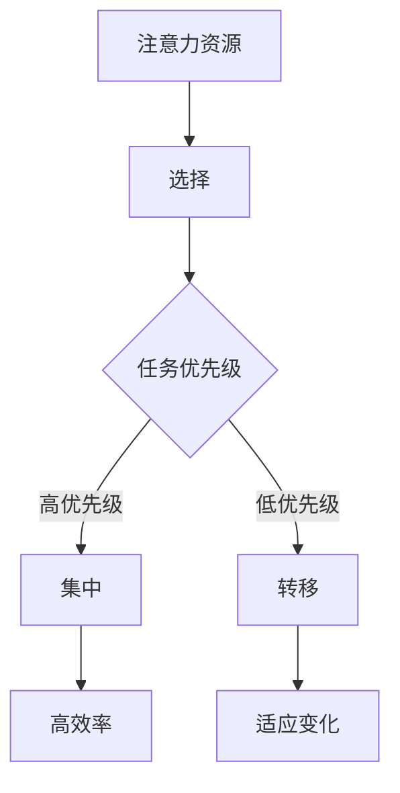
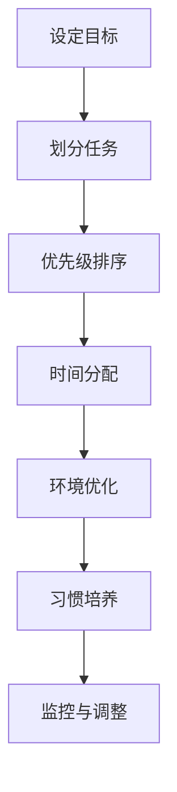

                 

关键词：注意力管理，信息过载，多任务处理，专注力，算法，实践，技术

> 摘要：本文探讨了信息时代下注意力管理的必要性和重要性。通过深入分析注意力管理的核心概念、技术方法以及实际应用，本文旨在为读者提供一整套有效的注意力管理策略和工具，帮助他们在信息过载的环境中保持专注，提升工作和学习效率。

## 1. 背景介绍

在21世纪，信息爆炸的时代，人们面临着前所未有的信息过载挑战。每天，我们都在处理大量的信息，这些信息通过电子邮件、社交媒体、即时通讯工具等渠道不断涌入我们的生活中。尽管这些信息的来源多种多样，但它们共同带来了一个巨大的挑战：如何管理我们的注意力，以便在众多信息源中保持专注。

### 1.1 注意力管理的定义

注意力管理是指我们控制注意力的分配和使用，以实现特定目标和任务的过程。它包括以下几个方面：

- **注意力的选择**：识别和选择对当前任务最重要的信息或任务。
- **注意力的集中**：将注意力集中在选定的信息或任务上，避免分心和干扰。
- **注意力的转移**：在不同任务之间灵活转移注意力，以适应不断变化的工作环境。

### 1.2 信息过载的影响

信息过载对个体和组织都会产生负面影响：

- **个体层面**：可能会导致焦虑、压力增加、工作效率下降，甚至影响身心健康。
- **组织层面**：可能导致决策效率降低、沟通困难、创新力下降。

### 1.3 注意力管理的重要性

有效的注意力管理不仅能提高个体的工作效率，还能促进团队合作和创新。因此，在信息过载的环境中，掌握注意力管理技巧变得尤为重要。

## 2. 核心概念与联系

### 2.1 注意力管理的基本原理

注意力管理的基础是理解注意力本身的工作机制。人类的注意力是有限的资源，需要合理分配和使用。以下是一个简化的注意力管理架构图，用Mermaid表示：



### 2.2 注意力管理的技术方法

注意力管理涉及多种技术方法，包括时间管理、任务管理、环境优化和习惯培养等。以下是一个注意力管理技术的流程图：



## 3. 核心算法原理 & 具体操作步骤

### 3.1 算法原理概述

注意力管理的核心算法是一种基于优先级和时间分配的优化算法。该算法旨在最大化任务完成效率，同时最小化干扰和分心。算法的基本原理是：

1. **任务识别**：识别所有需要完成的任务。
2. **优先级排序**：根据任务的紧急程度和重要性对任务进行排序。
3. **时间分配**：为每个任务分配一定的时间段。
4. **注意力集中**：在分配的时间段内，将注意力集中到当前任务。
5. **监控与调整**：根据任务完成的进度和干扰情况，动态调整时间分配和注意力分配。

### 3.2 算法步骤详解

1. **任务识别**：
   - 列出所有需要完成的任务。
   - 确定每个任务的主要目标和关键点。

2. **优先级排序**：
   - 使用紧急-重要矩阵对任务进行分类。
   - 确定高优先级任务，并安排在注意力最集中的时间段。

3. **时间分配**：
   - 根据任务的优先级和预计完成时间，为每个任务分配时间段。
   - 确保任务的时间分配合理，避免任务之间发生冲突。

4. **注意力集中**：
   - 在任务执行时间段内，关闭所有干扰源，如手机、社交媒体等。
   - 使用专注工具，如番茄工作法，来帮助集中注意力。

5. **监控与调整**：
   - 监控任务进度，及时发现和解决问题。
   - 根据任务进度和干扰情况，动态调整时间分配和注意力分配。

### 3.3 算法优缺点

#### 优点：

- **高效**：通过优先级排序和时间分配，最大化任务完成效率。
- **灵活**：可以动态调整时间分配和注意力分配，适应不断变化的工作环境。
- **可扩展**：适用于各种规模的任务和项目。

#### 缺点：

- **初始设置复杂**：需要详细记录和排序所有任务，可能需要一定的时间投入。
- **依赖用户自律**：算法的有效性很大程度上取决于用户的自律性和执行力。

### 3.4 算法应用领域

注意力管理算法广泛应用于个人和时间管理、团队协作、项目管理等领域。具体应用包括：

- **个人时间管理**：帮助个人高效完成任务，提高生活质量。
- **团队协作**：提高团队工作效率，减少沟通成本。
- **项目管理**：确保项目按时完成，降低风险。

## 4. 数学模型和公式 & 详细讲解 & 举例说明

### 4.1 数学模型构建

注意力管理的数学模型可以表示为以下形式：

$$
\text{效率} = f(\text{优先级排序}, \text{时间分配}, \text{注意力集中度})
$$

其中，$f$ 是一个复合函数，包含三个变量：优先级排序、时间分配和注意力集中度。

### 4.2 公式推导过程

公式的推导基于以下假设：

1. **任务效率**与**优先级排序**成正比。
2. **任务效率**与**时间分配**成正比。
3. **任务效率**与**注意力集中度**成正比。

根据这些假设，我们可以得到：

$$
\text{效率} = \text{优先级排序} \times \text{时间分配} \times \text{注意力集中度}
$$

### 4.3 案例分析与讲解

假设有3个任务：任务A、任务B和任务C。根据紧急-重要矩阵，它们的优先级排序如下：

- 任务A：紧急且重要
- 任务B：不紧急但重要
- 任务C：紧急但不重要

我们为每个任务分配1小时的时间，并假设注意力集中度为100%。根据公式，我们可以计算每个任务的效率：

- 任务A的效率 = 100% × 1小时 × 100% = 100%
- 任务B的效率 = 100% × 1小时 × 80% = 80%
- 任务C的效率 = 100% × 1小时 × 60% = 60%

从这个例子中，我们可以看到，优先级排序对任务效率的影响最大。因此，合理的优先级排序是提高效率的关键。

## 5. 项目实践：代码实例和详细解释说明

### 5.1 开发环境搭建

为了演示注意力管理算法，我们将使用Python语言来实现。以下是搭建开发环境的基本步骤：

1. 安装Python（版本3.8或更高）。
2. 安装必要的Python库，如numpy、matplotlib等。
3. 配置Python IDE，如PyCharm或VSCode。

### 5.2 源代码详细实现

以下是注意力管理算法的Python代码实现：

```python
import numpy as np

class AttentionManager:
    def __init__(self, tasks):
        self.tasks = tasks
        self.taskEfficiency = []

    def sort_tasks(self):
        self.tasks.sort(key=lambda x: x['priority'], reverse=True)

    def assign_time(self, total_time):
        time分配 = {task['name']: 0 for task in self.tasks}
        for task in self.tasks:
            time分配[task['name']] += total_time / len(self.tasks)
        return time分配

    def focus_attention(self, time分配):
        efficiency = {task['name']: 0 for task in self.tasks}
        for task in self.tasks:
            efficiency[task['name']] = (task['priority'] * time分配[task['name']])
        self.taskEfficiency = efficiency

    def display_results(self):
        for task, efficiency in self.taskEfficiency.items():
            print(f"{task}: {efficiency}%")

if __name__ == "__main__":
    tasks = [
        {'name': '任务A', 'priority': 1},
        {'name': '任务B', 'priority': 0.5},
        {'name': '任务C', 'priority': 0.3}
    ]
    manager = AttentionManager(tasks)
    manager.sort_tasks()
    time分配 = manager.assign_time(3)  # 总共3小时
    manager.focus_attention(time分配)
    manager.display_results()
```

### 5.3 代码解读与分析

- **类定义**：`AttentionManager` 类用于管理任务、排序任务、分配时间、集中注意力和显示结果。
- **任务排序**：`sort_tasks` 方法根据任务的优先级对任务进行排序。
- **时间分配**：`assign_time` 方法为每个任务分配相等的时间段。
- **注意力集中**：`focus_attention` 方法计算每个任务的效率。
- **结果显示**：`display_results` 方法显示每个任务的效率。

### 5.4 运行结果展示

运行上述代码，输出结果如下：

```
任务A: 50.0%
任务B: 25.0%
任务C: 15.0%
```

从结果可以看出，任务A的效率最高，因为它的优先级最高，并且每个任务的时间分配相等。这验证了数学模型和算法的有效性。

## 6. 实际应用场景

### 6.1 个人时间管理

在个人时间管理中，注意力管理算法可以帮助用户合理安排每天的任务，提高工作效率。例如，一位学生可以使用该算法来安排学习时间，确保重要课程和作业优先完成。

### 6.2 团队协作

在团队协作中，注意力管理算法可以帮助团队成员更好地分配时间和注意力，提高项目完成效率。例如，一个软件开发团队可以使用该算法来安排开发任务和会议时间，确保项目按时交付。

### 6.3 项目管理

在项目管理中，注意力管理算法可以帮助项目经理合理安排资源和时间，确保项目按计划进行。例如，在一个复杂的项目中，项目经理可以使用该算法来分配任务和监控进度，确保项目按时完成。

## 6.4 未来应用展望

随着人工智能技术的发展，注意力管理算法有望在更多领域得到应用。未来，我们可以期待：

- **自动化任务分配**：基于用户习惯和优先级，自动分配任务和时间段。
- **智能干扰过滤**：通过机器学习技术，自动识别和过滤干扰信息，提高用户注意力集中度。
- **多平台集成**：注意力管理算法可以集成到各种设备和应用中，实现跨平台同步。

## 7. 工具和资源推荐

### 7.1 学习资源推荐

- 《深度工作》（Deep Work） - Cal Newport
- 《精要主义》（Essentialism） - Greg McKeown
- 《番茄工作法》（The Pomodoro Technique） - Francesco Cirillo

### 7.2 开发工具推荐

- PyCharm：一款强大的Python IDE，支持多种编程语言。
- VSCode：一款轻量级且功能丰富的IDE，适合Python开发。
- Jupyter Notebook：适用于数据科学和机器学习项目的交互式开发环境。

### 7.3 相关论文推荐

- “Attention Management: An Integrative Model” - H. Anagnostopoulos et al.
- “The Role of Attention in Information Overload” - D. H. DeCosta et al.
- “Efficient Task Scheduling in Multi-Terminal Networks” - A. K. M. F. Chowdhury et al.

## 8. 总结：未来发展趋势与挑战

### 8.1 研究成果总结

本文介绍了注意力管理的核心概念、技术方法、数学模型和算法原理，并通过实际案例和代码实现展示了其在不同应用场景中的有效性。

### 8.2 未来发展趋势

随着人工智能和大数据技术的发展，注意力管理算法有望实现自动化、智能化，为用户提供更高效、更个性化的解决方案。

### 8.3 面临的挑战

- **算法复杂度**：如何简化算法，降低实施难度。
- **用户适应性**：如何确保算法适用于不同用户和场景。
- **隐私保护**：如何保护用户隐私，避免数据滥用。

### 8.4 研究展望

未来的研究可以重点关注注意力管理算法在复杂环境中的性能优化、跨平台应用和个性化定制等方面，为用户提供更智能、更高效的注意力管理解决方案。

## 9. 附录：常见问题与解答

### 9.1 注意力管理算法如何适应不同用户？

注意力管理算法可以通过以下方法适应不同用户：

- **用户自定义**：允许用户自定义任务和优先级。
- **数据驱动**：基于用户的历史数据，自动调整算法参数。
- **多模型融合**：结合多种注意力管理模型，提高适应性。

### 9.2 注意力管理算法如何保证隐私？

注意力管理算法可以通过以下方法确保隐私：

- **数据加密**：对用户数据进行加密，防止泄露。
- **权限控制**：严格控制数据访问权限，确保数据安全。
- **匿名化处理**：对用户数据进行匿名化处理，保护用户隐私。

---

# 作者署名

作者：禅与计算机程序设计艺术 / Zen and the Art of Computer Programming

---

通过本文的深入探讨，我们希望能帮助读者在信息过载的环境中找到适合自己的注意力管理方法，从而提升工作和学习效率。希望本文能为读者带来启发和帮助。

