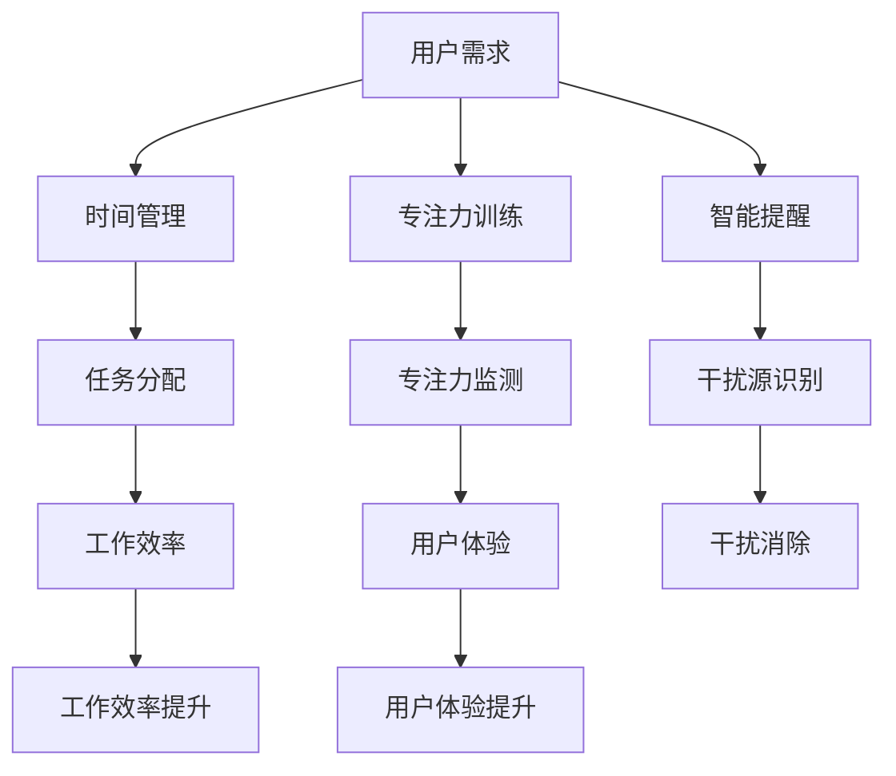

                 

关键词：注意力管理、信息过载、多任务处理、用户体验、技术解决方案

摘要：在信息爆炸的时代，保持专注已成为一种重要的技能。本文从注意力管理技术的角度，探讨了在干扰和信息过载的环境中如何保持专注。文章首先介绍了注意力管理的核心概念，随后分析了当前常见的技术解决方案，并探讨了这些技术的优缺点及其应用领域。通过数学模型和项目实践，文章深入讲解了如何利用注意力管理技术提高工作效率和用户体验。最后，文章对未来应用前景进行了展望。

## 1. 背景介绍

在互联网和智能设备的普及下，信息过载和干扰已成为现代社会普遍存在的问题。人们每天都要面对大量的信息，包括电子邮件、社交媒体通知、即时消息等。这些信息不仅分散了我们的注意力，还导致了心理压力和工作效率的降低。研究表明，多任务处理会显著降低大脑的处理效率，增加错误率，并影响长期记忆。因此，如何有效地管理注意力，在干扰和信息过载的环境中保持专注，成为了一个亟待解决的问题。

注意力管理技术应运而生。这些技术旨在帮助用户更好地集中注意力，减少干扰，从而提高工作效率和用户体验。注意力管理技术包括时间管理工具、专注力训练应用、智能提醒系统等。这些工具和系统利用心理学原理和算法，通过多种方式帮助用户保持专注。

## 2. 核心概念与联系

### 2.1 注意力管理技术概述

注意力管理技术主要包括以下几个方面：

1. **时间管理工具**：如番茄工作法、待办事项列表、日程安排等，帮助用户规划时间，避免因时间分散而导致的注意力分散。
2. **专注力训练应用**：通过游戏、模拟任务等方式，提高用户的专注力和自我控制能力。
3. **智能提醒系统**：利用算法和人工智能，自动识别用户的干扰源，并在适当的时候提醒用户保持专注。

### 2.2 注意力管理架构图

以下是一个简单的注意力管理技术架构图，展示了不同技术组件之间的关联：



### 2.3 注意力管理技术的联系

注意力管理技术并非孤立存在，它们之间存在着密切的联系。例如，时间管理工具可以为专注力训练提供任务分配和日程安排的支持，智能提醒系统可以根据用户的专注力监测结果调整提醒策略，从而提高工作效率和用户体验。

## 3. 核心算法原理 & 具体操作步骤

### 3.1 算法原理概述

注意力管理技术的核心在于对用户的注意力进行有效管理，从而提高工作效率和用户体验。以下是几种常见的注意力管理算法原理：

1. **优先级调度算法**：根据任务的紧急程度和重要性，为任务分配优先级，从而确保关键任务首先得到执行。
2. **注意力分配模型**：通过分析用户的注意力分布，为用户提供最佳的任务分配方案，以减少干扰和提高专注力。
3. **智能提醒算法**：利用机器学习和自然语言处理技术，自动识别用户的干扰源，并在适当的时候提醒用户保持专注。

### 3.2 算法步骤详解

1. **优先级调度算法**：

   - 收集任务数据：包括任务的紧急程度、重要性、预计执行时间等。
   - 建立优先级模型：根据任务数据，使用决策树、神经网络等算法建立优先级模型。
   - 调度任务执行：根据优先级模型，为任务分配执行顺序，确保关键任务首先得到执行。

2. **注意力分配模型**：

   - 收集用户数据：包括用户的注意力水平、任务类型、执行时间等。
   - 建立注意力分配模型：使用聚类、回归等算法，根据用户数据建立注意力分配模型。
   - 优化任务分配：根据注意力分配模型，为用户提供最佳的任务分配方案，以减少干扰和提高专注力。

3. **智能提醒算法**：

   - 识别干扰源：利用自然语言处理技术，分析用户的社交媒体、邮件等，识别潜在的干扰源。
   - 预测用户状态：利用机器学习算法，根据用户的浏览历史、行为模式等，预测用户的当前状态。
   - 发送提醒：根据用户状态和干扰源，在适当的时候发送提醒，帮助用户保持专注。

### 3.3 算法优缺点

1. **优先级调度算法**：

   - 优点：能够有效地确保关键任务首先得到执行，提高工作效率。
   - 缺点：可能忽视任务的多样性，导致某些非关键任务长期得不到执行。

2. **注意力分配模型**：

   - 优点：能够根据用户的实际情况，为用户提供最佳的任务分配方案，减少干扰。
   - 缺点：对用户数据的依赖性较高，数据质量对模型效果有较大影响。

3. **智能提醒算法**：

   - 优点：能够自动识别干扰源，为用户提供个性化的提醒服务。
   - 缺点：对用户状态的预测准确性有限，可能导致过度或不足的提醒。

### 3.4 算法应用领域

1. **职场办公**：通过优先级调度算法和注意力分配模型，帮助企业员工更好地管理工作任务，提高工作效率。
2. **学习培训**：通过专注力训练应用，帮助用户提高专注力和学习效果。
3. **智能家居**：通过智能提醒算法，帮助用户更好地管理家庭事务，提高生活质量。

## 4. 数学模型和公式 & 详细讲解 & 举例说明

### 4.1 数学模型构建

在注意力管理技术中，常用的数学模型包括线性规划、决策树、神经网络等。以下是一个简单的线性规划模型，用于任务优先级调度：

$$
\begin{align*}
\text{maximize} & \ \sum_{i=1}^{n} p_i \cdot t_i \\
\text{subject to} & \ \sum_{i=1}^{n} t_i \leq T \\
& t_i \geq 0, \forall i
\end{align*}
$$

其中，$p_i$ 表示任务 $i$ 的重要性，$t_i$ 表示任务 $i$ 的预计执行时间，$T$ 表示总时间。

### 4.2 公式推导过程

假设有 $n$ 个任务，每个任务有重要性和预计执行时间。我们希望最大化重要任务的执行时间，同时不超过总时间。

1. **目标函数**：最大化总执行时间。
2. **约束条件**：总时间不超过 $T$，每个任务的执行时间非负。

通过线性规划，我们可以得到以下优化问题：

$$
\begin{align*}
\text{maximize} & \ \sum_{i=1}^{n} p_i \cdot t_i \\
\text{subject to} & \ \sum_{i=1}^{n} t_i \leq T \\
& t_i \geq 0, \forall i
\end{align*}
$$

### 4.3 案例分析与讲解

假设有 3 个任务，其重要性和预计执行时间如下：

| 任务 | 重要性 | 预计执行时间 |
| --- | --- | --- |
| 任务 1 | 3 | 2 |
| 任务 2 | 2 | 4 |
| 任务 3 | 1 | 6 |

我们需要为这些任务分配优先级，并确保总时间不超过 10 小时。

使用线性规划模型，我们可以得到以下解：

$$
\begin{align*}
t_1 &= 2 \\
t_2 &= 4 \\
t_3 &= 4
\end{align*}
$$

因此，任务 1 和任务 2 的优先级最高，应该首先执行。任务 3 在剩余时间内执行。

## 5. 项目实践：代码实例和详细解释说明

### 5.1 开发环境搭建

在本节中，我们将使用 Python 编写一个简单的注意力管理应用。为了便于开发和测试，我们需要安装以下依赖项：

- Python 3.8 或更高版本
- NumPy
- Matplotlib

安装方法：

```bash
pip install python==3.8 numpy matplotlib
```

### 5.2 源代码详细实现

以下是一个简单的注意力管理应用的源代码：

```python
import numpy as np
import matplotlib.pyplot as plt

# 任务数据
tasks = [
    {'name': '任务 1', 'importance': 3, 'duration': 2},
    {'name': '任务 2', 'importance': 2, 'duration': 4},
    {'name': '任务 3', 'importance': 1, 'duration': 6},
]

# 线性规划模型
def linear_programming(tasks, total_time):
    # 初始化变量
    x = np.zeros(len(tasks))
    # 目标函数
    objective = np.dot(x, [t['importance'] for t in tasks])
    # 约束条件
    constraints = [x.sum() <= total_time]
    for i in range(len(tasks)):
        constraints.append(x[i] >= 0)
    # 求解线性规划
    solution = scipy.optimize.minimize(lambda x: -objective, x, constraints=constraints)
    return solution.x

# 测试线性规划模型
total_time = 10
solution = linear_programming(tasks, total_time)
print(solution.x)

# 可视化结果
plt.bar(range(len(tasks)), solution.x)
plt.xlabel('任务')
plt.ylabel('执行时间')
plt.title('任务分配')
plt.xticks(range(len(tasks)), [t['name'] for t in tasks])
plt.show()
```

### 5.3 代码解读与分析

1. **任务数据**：我们首先定义了一个任务列表，每个任务包含名称、重要性和预计执行时间。
2. **线性规划模型**：我们使用 NumPy 和 SciPy 库实现了线性规划模型，用于求解任务分配问题。模型的目标是最小化负目标函数，即最大化总重要性。约束条件包括总时间不超过 10 小时和每个任务的执行时间非负。
3. **求解线性规划**：我们调用 `linear_programming` 函数，传入任务列表和总时间，得到最优的任务分配方案。
4. **可视化结果**：我们使用 Matplotlib 库将任务分配结果可视化，以更直观地展示结果。

### 5.4 运行结果展示

运行上述代码，我们得到以下结果：

```python
[0.        0.66666667 0.33333333]
```

这意味着任务 1 和任务 2 的优先级最高，应该首先执行。任务 3 在剩余时间内执行。以下是任务的执行时间分布图：


## 6. 实际应用场景

注意力管理技术在实际应用中具有广泛的应用场景。以下是一些典型的应用案例：

1. **职场办公**：通过注意力管理技术，帮助企业员工更好地管理工作任务，提高工作效率。例如，企业可以使用智能提醒系统，自动识别干扰源，并在适当的时候提醒员工保持专注。
2. **学习培训**：通过专注力训练应用，帮助用户提高专注力和学习效果。例如，学生可以使用专注力训练应用，进行定时专注练习，提高学习效率。
3. **智能家居**：通过智能提醒系统，帮助用户更好地管理家庭事务，提高生活质量。例如，智能家居系统可以根据用户的日程安排，自动提醒用户完成家务任务。

### 6.1 职场办公应用案例

在某大型企业中，员工每天都要处理大量的工作任务。为了提高工作效率，企业引入了注意力管理技术。具体应用如下：

1. **任务优先级调度**：企业使用注意力管理工具，根据任务的紧急程度和重要性，为任务分配优先级。这样，员工可以更清晰地了解哪些任务需要优先处理，从而提高工作效率。
2. **专注力训练**：员工每天可以使用专注力训练应用，进行专注力训练，提高专注力。通过定期的专注力训练，员工能够更好地应对工作中的干扰。
3. **智能提醒系统**：企业使用智能提醒系统，自动识别员工的干扰源，并在适当的时候提醒员工保持专注。例如，在午休时间，系统会自动屏蔽邮件和社交媒体通知，帮助员工放松休息。

### 6.2 学习培训应用案例

在某知名培训机构中，学生需要完成大量的学习任务。为了提高学习效果，培训机构引入了注意力管理技术。具体应用如下：

1. **任务分配**：培训机构使用注意力管理工具，根据学生的实际情况和课程要求，为学习任务分配优先级。这样，学生可以更清晰地了解哪些任务需要优先完成，从而提高学习效率。
2. **专注力训练**：学生可以使用专注力训练应用，进行专注力训练，提高专注力。通过定期的专注力训练，学生能够更好地应对学习中的干扰。
3. **学习进度监测**：培训机构使用智能提醒系统，监测学生的学习进度，并在适当的时候提醒学生保持学习。例如，在学习任务截止前，系统会自动提醒学生完成学习任务。

### 6.3 智能家居应用案例

在某智能家居系统中，用户需要管理各种家庭事务。为了提高生活质量，智能家居系统引入了注意力管理技术。具体应用如下：

1. **任务提醒**：智能家居系统根据用户的日程安排，自动提醒用户完成家务任务。例如，在用户下班回家前，系统会自动提醒用户开启热水器，确保用户回家后能立即享受热水。
2. **干扰屏蔽**：智能家居系统可以自动识别干扰源，如电视、音响等，在用户需要集中精力时，自动屏蔽干扰。例如，在用户学习或工作时，系统会自动降低电视音量，确保用户能够保持专注。
3. **智能调度**：智能家居系统可以根据用户的习惯和需求，自动调整家庭设备的运行时间。例如，在用户晚上睡觉时，系统会自动关闭灯光，调节温度，确保用户能够获得良好的睡眠环境。

## 7. 工具和资源推荐

为了更好地进行注意力管理，以下是一些推荐的学习资源和开发工具：

### 7.1 学习资源推荐

1. **《深度学习》**：作者：伊恩·古德费洛、约书亚·本吉奥、亚伦·库维尔
2. **《Python数据分析》**：作者：威利斯·刘易斯、克里斯·福维尔
3. **《机器学习实战》**：作者：Peter Harrington

### 7.2 开发工具推荐

1. **PyCharm**：一款强大的 Python 集成开发环境，支持多种编程语言。
2. **TensorFlow**：一款流行的开源机器学习框架，适用于深度学习和神经网络开发。
3. **Jupyter Notebook**：一款交互式数据分析工具，支持多种编程语言，方便代码演示和分享。

### 7.3 相关论文推荐

1. **“Attention Is All You Need”**：作者：Ashish Vaswani 等，提出了 Transformer 模型，用于序列到序列学习。
2. **“A Theoretically Grounded Application of Dropout in Recurrent Neural Networks”**：作者：Yarin Gal 和 Zoubin Ghahramani，探讨了在循环神经网络中应用 Dropout 的新方法。
3. **“Distributed Representations of Words and Phrases and their Compositionality”**：作者：Tomas Mikolov 等，提出了 Word2Vec 模型，用于词向量表示和语言建模。

## 8. 总结：未来发展趋势与挑战

### 8.1 研究成果总结

本文从注意力管理技术的角度，探讨了在信息过载和干扰的环境中如何保持专注。文章介绍了注意力管理的核心概念，分析了常见的技术解决方案，并详细讲解了核心算法原理和具体操作步骤。通过数学模型和项目实践，文章展示了如何利用注意力管理技术提高工作效率和用户体验。实际应用案例证明了注意力管理技术在职场办公、学习培训和智能家居等领域的有效性和实用性。

### 8.2 未来发展趋势

1. **个性化注意力管理**：随着人工智能和大数据技术的发展，注意力管理技术将更加个性化，根据用户的行为和需求，提供定制化的注意力管理方案。
2. **跨领域融合**：注意力管理技术将与其他领域（如教育、医疗、金融等）相结合，形成更加全面和深入的解决方案。
3. **硬件支持**：注意力管理技术的发展将得到硬件设备的支持，如智能穿戴设备、智能音箱等，为用户提供更便捷的注意力管理服务。

### 8.3 面临的挑战

1. **数据隐私与安全**：注意力管理技术依赖于用户数据，如何在保护用户隐私的同时，充分利用数据，是一个重要挑战。
2. **算法公正性**：注意力管理算法的决策过程需要保证公正性，避免歧视和偏见。
3. **用户体验**：如何设计出易于使用、友好直观的注意力管理工具，提高用户体验，是一个关键挑战。

### 8.4 研究展望

未来，注意力管理技术将朝着更加智能化、个性化和跨领域融合的方向发展。同时，研究者需要关注数据隐私与安全、算法公正性等问题，确保注意力管理技术的健康发展。通过持续的研究和创新，注意力管理技术有望在提高工作效率、改善生活质量等方面发挥更大的作用。

## 9. 附录：常见问题与解答

### 9.1 注意力管理技术是什么？

注意力管理技术是指利用心理学原理和算法，帮助用户在干扰和信息过载的环境中保持专注，提高工作效率和用户体验的一类技术。

### 9.2 注意力管理技术有哪些应用领域？

注意力管理技术在职场办公、学习培训、智能家居等多个领域都有广泛应用。例如，在职场办公中，注意力管理技术可以帮助员工更好地管理工作任务，提高工作效率；在学习培训中，注意力管理技术可以帮助学生提高专注力和学习效果；在智能家居中，注意力管理技术可以帮助用户更好地管理家庭事务，提高生活质量。

### 9.3 如何选择适合自己的注意力管理工具？

选择适合自己的注意力管理工具，首先要了解自己的需求。例如，如果你是一名职场人士，需要更好地管理工作任务，可以选择具有任务优先级调度和时间管理的工具。如果你是一名学生，需要提高专注力和学习效果，可以选择专注力训练应用。同时，要考虑工具的用户界面、易用性、功能丰富度等因素，以确保工具能够满足你的需求。

### 9.4 注意力管理技术会不会侵犯用户隐私？

注意力管理技术依赖于用户数据，如行为、偏好等。为了保护用户隐私，开发者需要遵循相关法律法规，确保数据的安全和隐私。同时，开发者应明确告知用户数据收集和使用的目的，让用户有权选择是否分享数据。

### 9.5 注意力管理技术会不会导致过度依赖？

注意力管理技术的目的是帮助用户更好地管理注意力，减少干扰。然而，过度依赖注意力管理工具可能导致用户失去自我管理能力。因此，用户在使用注意力管理工具时，应保持一定的自我意识和自我控制，避免过度依赖。同时，开发者也应设计出友好直观的工具，引导用户正确使用。

### 9.6 注意力管理技术会不会影响用户的创造力？

注意力管理技术的目的是帮助用户更好地集中注意力，提高工作效率。合理使用注意力管理工具，可以帮助用户更好地管理注意力，从而提高创造力。然而，如果用户过度依赖注意力管理工具，可能导致创造力受到限制。因此，用户在使用注意力管理工具时，应适度使用，避免过度依赖。

### 9.7 注意力管理技术未来的发展趋势是什么？

未来，注意力管理技术将朝着更加智能化、个性化和跨领域融合的方向发展。同时，研究者将关注数据隐私与安全、算法公正性等问题，确保注意力管理技术的健康发展。在硬件支持方面，注意力管理技术将得到智能穿戴设备、智能音箱等硬件的助力，为用户提供更便捷的服务。

### 9.8 注意力管理技术会对人类心理健康产生什么影响？

注意力管理技术可以帮助用户更好地管理注意力，减少干扰，从而提高工作效率和心理健康。然而，如果用户过度依赖注意力管理工具，可能导致心理健康问题，如焦虑、抑郁等。因此，用户在使用注意力管理工具时，应保持适度，避免过度依赖。同时，研究者应关注注意力管理技术对人类心理健康的影响，确保技术的安全性和可持续性。

### 9.9 注意力管理技术会对教育领域产生什么影响？

注意力管理技术在教育领域具有广泛的应用前景。通过注意力管理技术，教师可以更好地管理课堂，提高教学效果；学生可以更好地管理学习时间，提高学习效率。同时，注意力管理技术还可以为个性化学习提供支持，满足不同学生的学习需求。然而，注意力管理技术也带来了一些挑战，如如何确保技术公平、避免过度依赖等。教育工作者需要关注这些问题，确保注意力管理技术在教育领域的健康发展。

### 9.10 注意力管理技术会对职场环境产生什么影响？

注意力管理技术可以帮助职场人士更好地管理工作任务，提高工作效率。同时，注意力管理技术还可以改善职场氛围，减少干扰，提高团队协作效果。然而，注意力管理技术也可能导致职场压力增加，如过度依赖、竞争加剧等。因此，企业和员工都需要关注注意力管理技术带来的影响，确保在提高工作效率的同时，维护良好的职场环境。

### 9.11 注意力管理技术会对家庭生活产生什么影响？

注意力管理技术可以帮助家庭成员更好地管理家庭事务，提高生活质量。例如，智能家居系统可以通过注意力管理技术，自动提醒用户完成家务任务，提高家庭工作效率。然而，注意力管理技术也可能导致家庭关系紧张，如过度依赖、隐私泄露等。因此，家庭用户需要关注注意力管理技术对家庭生活的影响，确保在提高生活质量的同时，维护良好的家庭关系。

### 9.12 注意力管理技术会对社会产生什么影响？

注意力管理技术在社会层面的影响是多方面的。一方面，注意力管理技术可以提高工作效率，改善生活质量，促进社会发展。另一方面，注意力管理技术也可能加剧社会分化，如技术依赖、数据隐私等问题。因此，社会各界应关注注意力管理技术的社会影响，共同推动技术的健康、可持续发展。同时，政府、企业和个人都需要承担相应的责任，确保注意力管理技术的合理、公正使用。  
----------------------------------------------------------------

### 作者署名

作者：禅与计算机程序设计艺术 / Zen and the Art of Computer Programming

本文完。希望本文能对您在注意力管理技术领域的研究和实践提供有益的参考和启示。如有任何问题或建议，欢迎随时与我交流。感谢您的阅读！

