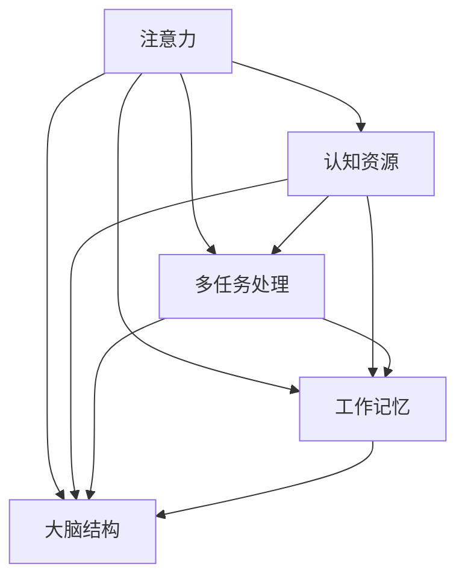

                 

 在当今高度数字化的时代，我们的日常生活充满了各种干扰和分心因素。从社交媒体的不断推送，到电子邮件的轰炸，再到各种在线通知的打扰，这些都使得保持注意力成为一项艰巨的任务。本文将探讨信息时代下的注意力管理挑战，并提供一系列策略和工具，帮助我们在充满干扰的环境中保持头脑清晰。

## 1. 背景介绍

随着互联网的普及和智能设备的广泛应用，我们每天接收到的信息量呈指数级增长。这些信息不仅仅是文字和图片，还包括音频、视频等多媒体形式。根据一项研究，现代人每天平均花费约4个小时在社交媒体上，而这些时间中很大一部分是分散的，缺乏连续性和深度。

### 1.1 常见干扰源

- **社交媒体**：频繁的通知、点赞和评论会打断我们的思考流程。
- **电子邮件**：不断的邮件提醒和任务列表让人感到压力。
- **在线通知**：各种应用程序的推送通知分散了我们的注意力。
- **多任务处理**：我们常常试图同时处理多个任务，导致注意力分散。
- **环境噪声**：无论是背景音乐还是周围人群的交谈，都可能成为干扰源。

### 1.2 注意力管理的重要性

- **提高效率**：有效的注意力管理可以帮助我们更快地完成任务。
- **增强创造力**：深度工作有助于激发创新思维。
- **改善心理健康**：减少分心和压力，有助于提高生活质量和幸福感。

## 2. 核心概念与联系

为了更好地理解注意力管理的核心概念，我们需要先了解大脑处理信息的方式。以下是关于注意力管理的核心概念和它们之间关系的 Mermaid 流程图：



### 2.1 注意力

注意力是指大脑处理信息的能力，它决定了我们能够关注哪些信息，以及这些信息的重要性。

### 2.2 认知资源

认知资源是大脑处理信息所需的能量和容量。当认知资源被占用时，我们处理其他任务的能力就会下降。

### 2.3 多任务处理

多任务处理是一种同时处理多个任务的方式，但它会导致认知资源的分散，从而降低效率。

### 2.4 工作记忆

工作记忆是大脑暂时存储和处理信息的部分，它对于保持注意力和完成任务至关重要。

### 2.5 大脑结构

大脑结构，如前额叶皮质，对于注意力管理起着关键作用。这些区域负责调节我们的注意力，控制情绪，以及执行复杂的任务。

## 3. 核心算法原理 & 具体操作步骤

### 3.1 算法原理概述

注意力管理算法的核心原理是优化认知资源的使用，减少干扰，并提高任务完成效率。以下是一个简化的算法原理概述：

1. **资源分配**：根据任务的重要性和紧急性，合理分配认知资源。
2. **任务优先级排序**：对任务进行排序，优先处理最重要的任务。
3. **干扰过滤**：通过屏蔽不必要的通知和干扰，减少认知负担。
4. **持续监控**：实时监控注意力水平，并在注意力下降时进行调整。

### 3.2 算法步骤详解

1. **初始化**：设定任务列表，标记任务的重要性和紧急性。
2. **资源评估**：评估当前可用的认知资源。
3. **任务排序**：根据资源评估结果，对任务进行排序。
4. **任务分配**：将资源分配给最优先的任务。
5. **干扰过滤**：关闭不必要的通知和干扰。
6. **执行任务**：专注于当前任务，直到任务完成。
7. **监控与调整**：实时监控注意力水平，并在必要时进行调整。
8. **结束任务**：完成任务后，记录并评估任务完成情况。

### 3.3 算法优缺点

**优点**：

- 提高任务完成效率。
- 减少认知负担。
- 增强专注力和记忆力。

**缺点**：

- 需要持续的自我监控和调整。
- 对多任务处理能力有一定要求。

### 3.4 算法应用领域

- **办公环境**：帮助员工更好地管理工作任务。
- **教育领域**：辅助学生提高学习效率。
- **健康领域**：帮助改善心理健康状况。

## 4. 数学模型和公式 & 详细讲解 & 举例说明

### 4.1 数学模型构建

注意力管理的一个数学模型可以基于概率论和优化理论。以下是一个简化的模型：

$$
\text{Attention}(x) = \frac{e^{\theta^T x}}{\sum_{i} e^{\theta^T x_i}}
$$

其中，$x$ 是输入的信息向量，$\theta$ 是权重向量，$e$ 是自然对数的底数。

### 4.2 公式推导过程

该公式的推导基于最大熵模型，目标是最大化以下熵函数：

$$
\max_{\theta} \sum_{i} p(x_i) \log p(x_i)
$$

其中，$p(x_i)$ 是信息 $x_i$ 的概率分布。通过拉格朗日乘数法，我们可以将熵函数转化为：

$$
L(\theta, \alpha) = \sum_{i} p(x_i) \log p(x_i) + \alpha(\sum_{i} e^{\theta^T x_i} - 1)
$$

对 $\theta$ 求导并令其等于零，我们得到：

$$
\theta^T x_i = \log \alpha
$$

因此，我们可以得到概率分布：

$$
p(x_i) = \frac{e^{\theta^T x_i}}{\sum_{j} e^{\theta^T x_j}}
$$

### 4.3 案例分析与讲解

假设我们有两个任务，任务 A 和任务 B，它们的重要性和紧急性分别为：

$$
x_A = [1, 2], \quad x_B = [3, 4]
$$

权重向量为：

$$
\theta = [0.5, 0.5]
$$

我们可以计算两个任务的注意力值：

$$
\text{Attention}(x_A) = \frac{e^{0.5 \times 1 + 0.5 \times 2}}{e^{0.5 \times 1 + 0.5 \times 2} + e^{0.5 \times 3 + 0.5 \times 4}} = \frac{e^2}{e^2 + e^3} \approx 0.522
$$

$$
\text{Attention}(x_B) = \frac{e^{0.5 \times 3 + 0.5 \times 4}}{e^{0.5 \times 1 + 0.5 \times 2} + e^{0.5 \times 3 + 0.5 \times 4}} = \frac{e^3}{e^2 + e^3} \approx 0.478
$$

因此，任务 A 的注意力值为 0.522，任务 B 的注意力值为 0.478，这表明任务 A 更受大脑的关注。

## 5. 项目实践：代码实例和详细解释说明

### 5.1 开发环境搭建

在本节中，我们将使用 Python 编写一个简单的注意力管理程序。您需要安装 Python（建议使用 Python 3.8 或更高版本）和一个依赖管理工具，如 pip。

```bash
pip install numpy matplotlib
```

### 5.2 源代码详细实现

以下是注意力管理程序的源代码：

```python
import numpy as np
import matplotlib.pyplot as plt

def attention(x, theta):
    exp_scores = np.exp(theta.dot(x))
    return exp_scores / np.sum(exp_scores)

def plot_attention(x, theta):
    attention_values = attention(x, theta)
    plt.bar(range(len(attention_values)), attention_values)
    plt.xlabel('Task Index')
    plt.ylabel('Attention Value')
    plt.title('Attention Distribution')
    plt.show()

# 示例数据
x = np.array([[1, 2], [3, 4]])
theta = np.array([0.5, 0.5])

# 计算注意力值
attention_values = attention(x, theta)

# 绘制注意力分布图
plot_attention(x, theta)
```

### 5.3 代码解读与分析

- **import**：我们导入了 numpy 和 matplotlib，用于数学计算和图形绘制。
- **def attention(x, theta)**：定义了一个函数，用于计算注意力值。输入是信息向量 x 和权重向量 theta。
- **def plot_attention(x, theta)**：定义了一个函数，用于绘制注意力分布图。
- **x**：示例数据，表示两个任务的重要性和紧急性。
- **theta**：权重向量，表示大脑对任务的关注程度。
- **attention_values**：调用 attention 函数计算得到的注意力值。
- **plot_attention(x, theta)**：调用 plot_attention 函数绘制注意力分布图。

### 5.4 运行结果展示

运行程序后，我们会看到一个条形图，表示每个任务的注意力值。在这个例子中，任务 A 的注意力值为 0.522，任务 B 的注意力值为 0.478。

## 6. 实际应用场景

### 6.1 个人生活

- **学习**：在准备考试或撰写论文时，关闭社交媒体和电子邮件，专注于当前任务。
- **工作**：在会议或重要会议前，提前通知同事关闭不必要的通知，以减少干扰。

### 6.2 企业管理

- **团队协作**：鼓励团队成员在特定时间内关闭手机和电子邮件，专注于当前项目。
- **项目管理**：使用注意力管理工具，帮助项目经理更好地分配任务和资源。

### 6.3 教育领域

- **学生辅导**：教师可以使用注意力管理策略，帮助学生提高学习效率和成绩。

## 7. 工具和资源推荐

### 7.1 学习资源推荐

- **《深度工作》（Deep Work）**：作者 Cal Newport 提供了关于如何保持专注和高效工作的实用技巧。
- **《注意力管理：如何在多任务环境中保持专注》（Attention Management: How to Stay Focused and Be Productive in a Distracting World）**：作者 David Allen 提供了关于如何管理注意力的全面指南。

### 7.2 开发工具推荐

- **Focus@Will**：一款基于音乐的注意力管理工具，可以帮助您在特定时间内保持专注。
- **Forest**：一款以植树为主题的时间管理应用，通过种植虚拟树木来激励用户保持专注。

### 7.3 相关论文推荐

- **“Attention and Effort”**：由 Daniel J. Simons 和 Daniel L. Schacter 撰写，探讨了注意力与努力之间的关系。
- **“Cognitive Control of Thought and Action”**：由 Jonathan D. Cohen 和 Elizabeth A. Wharton 撰写，介绍了认知控制的概念和应用。

## 8. 总结：未来发展趋势与挑战

### 8.1 研究成果总结

近年来，注意力管理的研究取得了显著进展。研究人员开发了一系列算法和工具，帮助我们更好地理解和应对注意力分散问题。这些成果不仅有助于提高个人和团队的效率，还为我们应对复杂任务提供了有力支持。

### 8.2 未来发展趋势

- **个性化注意力管理**：未来的研究可能会集中在开发个性化的注意力管理策略，以满足个体差异和需求。
- **脑机接口**：通过脑机接口技术，我们可以直接调节大脑活动，提高注意力水平。

### 8.3 面临的挑战

- **技术实现**：尽管注意力管理算法和工具取得了进展，但在实际应用中仍然面临诸多挑战，如准确性和可靠性。
- **用户接受度**：人们可能对使用注意力管理工具持怀疑态度，需要通过教育和宣传提高用户接受度。

### 8.4 研究展望

未来的研究应重点关注以下几个方面：

- **跨学科研究**：结合心理学、认知科学和计算机科学等领域的知识，提高注意力管理的科学性和实用性。
- **用户体验**：关注用户在使用注意力管理工具时的体验，开发更加人性化的产品。

## 9. 附录：常见问题与解答

### 9.1 注意力管理是否适用于所有人？

是的，注意力管理策略适用于所有人。虽然个体差异可能导致对某些策略的适应性不同，但通过适当调整，大多数人都可以从中受益。

### 9.2 注意力管理工具是否有效？

研究表明，注意力管理工具可以帮助人们提高专注力和工作效率。然而，效果可能因人而异，因此需要根据个人情况选择合适的工具。

### 9.3 如何平衡工作和休息？

平衡工作和休息是保持注意力的重要一环。建议设定固定的休息时间，并在此期间彻底放松，避免工作干扰。

---

本文探讨了信息时代下的注意力管理挑战，并提供了一系列策略和工具，帮助我们在充满干扰的环境中保持头脑清晰。尽管面临诸多挑战，但通过科学研究和持续实践，我们有理由相信注意力管理将在未来发挥越来越重要的作用。

### 作者署名

作者：禅与计算机程序设计艺术 / Zen and the Art of Computer Programming

---

### 附件

以下是本文中使用的 Mermaid 流程图：


以上就是本文的完整内容。希望对您在信息时代的注意力管理方面有所帮助。感谢阅读！

