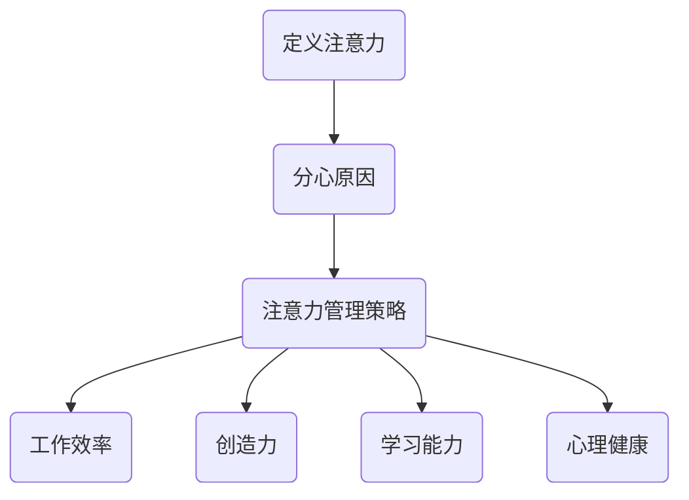

                 

关键词：注意力管理、信息过载、分心、专注、生产力提升、技术工具

摘要：在信息爆炸的时代，我们每天都被海量信息所包围。如何在这个充满干扰和分心的环境中保持注意力，成为提高工作效率和实现个人成长的关键。本文将探讨注意力管理的重要性，分析信息过载和分心的原因，介绍有效的注意力管理策略，并提供实用的工具和资源，帮助读者在快节奏的生活中实现专注，提升生产力。

## 1. 背景介绍

随着互联网和移动设备的普及，信息传播的速度和广度达到了前所未有的高度。我们每天都会接触到海量的信息，包括新闻、社交媒体、电子邮件、通知等。然而，这些信息的过载不仅没有带来便利，反而成为了我们注意力的主要敌人。分心现象无处不在，电子邮件、短信、社交媒体通知不断打断我们的工作流程，让我们难以集中精力完成任务。

根据美国心理学会的研究，现代社会中，人们平均每天会分心多达26次，每次持续约3分钟。这种频繁的分心不仅降低了工作效率，还可能导致压力增加、创造力下降和心理健康问题。因此，如何有效管理注意力，提高专注力，成为我们面临的重要挑战。

## 2. 核心概念与联系

### 2.1 注意力是什么

注意力是指大脑选择关注某些刺激并忽视其他刺激的能力。它是一种认知资源，负责我们感知、理解和处理信息的过程。注意力可以分为以下几种类型：

- **选择注意力**：主动关注某些特定的刺激，而忽略其他刺激。
- **维持注意力**：保持对某一任务的持续关注。
- **分配注意力**：在同一时间内关注多个任务。

### 2.2 分心与注意力管理

分心是指注意力被外部刺激所打断，导致无法持续关注当前任务。分心的原因有很多，包括：

- **外部干扰**：如电话、电子邮件、社交媒体通知等。
- **内部干扰**：如焦虑、压力、情绪波动等。
- **任务复杂度**：过于复杂的任务可能导致分心。

注意力管理是指通过一系列策略和方法，提高注意力的集中度和效率。有效的注意力管理可以帮助我们减少分心，提高工作效率。

### 2.3 注意力管理的重要性

注意力管理的重要性体现在以下几个方面：

- **提高工作效率**：专注于重要任务，避免分心，提高工作效率。
- **提升创造力**：专注能够激发创造力，帮助我们更好地解决问题。
- **增强学习能力**：专注能够帮助我们更好地理解和吸收知识。
- **改善心理健康**：减少压力和焦虑，提高生活质量。

### 2.4 注意力管理的 Mermaid 流程图



## 3. 核心算法原理 & 具体操作步骤

### 3.1 算法原理概述

注意力管理算法的核心思想是通过一系列策略和技术，帮助我们更好地集中注意力，减少分心。这些策略包括：

- **设定清晰的目标**：明确我们要达成的目标，有助于提高专注力。
- **使用番茄工作法**：将工作时间分为25分钟的工作周期和5分钟的休息周期，有助于保持专注。
- **消除干扰**：关闭手机通知、电子邮件提醒等，减少外部干扰。
- **环境优化**：选择一个安静、舒适的环境，有助于提高专注力。
- **定期休息**：每隔一段时间，休息几分钟，有助于缓解疲劳，提高注意力。

### 3.2 算法步骤详解

#### 3.2.1 设定清晰的目标

1. 确定我们要达成的目标。
2. 将目标分解为具体的任务。
3. 为每个任务设定明确的截止日期。

#### 3.2.2 使用番茄工作法

1. 设定一个25分钟的工作周期。
2. 开始工作，专注于当前任务。
3. 工作到25分钟时，休息5分钟。
4. 休息结束后，继续下一个工作周期。

#### 3.2.3 消除干扰

1. 关闭手机通知、电子邮件提醒等。
2. 将手机置于静音模式或放到另一个房间。
3. 避免在工作中使用社交媒体。

#### 3.2.4 环境优化

1. 选择一个安静、舒适的环境。
2. 保持桌面整洁，减少视觉干扰。
3. 使用耳塞或耳机，隔绝外部噪音。

#### 3.2.5 定期休息

1. 每工作25分钟后，休息5分钟。
2. 休息时，进行轻松的活动，如散步、做深呼吸等。
3. 避免长时间连续工作，以免造成疲劳。

### 3.3 算法优缺点

#### 优点：

- **提高专注力**：通过设定清晰的目标和番茄工作法，有助于提高专注力。
- **减少分心**：消除干扰和环境优化，有助于减少分心。
- **提高工作效率**：定期休息和优化工作流程，有助于提高工作效率。

#### 缺点：

- **初期适应困难**：对于不习惯番茄工作法的人来说，初期可能需要一定的适应期。
- **不适合所有任务**：对于一些需要长时间持续专注的任务，番茄工作法可能不太适用。

### 3.4 算法应用领域

注意力管理算法广泛应用于各个领域，如：

- **软件开发**：帮助开发者提高代码编写和调试的效率。
- **教育领域**：帮助学生提高学习效率和记忆力。
- **企业管理**：帮助管理者提高决策和执行力。
- **个人成长**：帮助个人提高专注力、创造力和学习能力。

## 4. 数学模型和公式 & 详细讲解 & 举例说明

### 4.1 数学模型构建

注意力管理中的数学模型主要涉及概率论和统计学。以下是注意力管理的数学模型：

$$
P(A|B) = \frac{P(B|A)P(A)}{P(B)}
$$

其中：

- $P(A|B)$ 表示在事件B发生的情况下，事件A发生的概率。
- $P(B|A)$ 表示在事件A发生的情况下，事件B发生的概率。
- $P(A)$ 表示事件A发生的概率。
- $P(B)$ 表示事件B发生的概率。

### 4.2 公式推导过程

注意力管理中的数学模型是基于贝叶斯定理推导而来的。贝叶斯定理是一种在已知某些条件下，计算某个事件发生概率的方法。以下是贝叶斯定理的推导过程：

假设有两个事件A和B，且它们之间可能存在某种关联。我们想要计算在事件B发生的情况下，事件A发生的概率，即 $P(A|B)$。根据贝叶斯定理，有：

$$
P(A|B) = \frac{P(B|A)P(A)}{P(B)}
$$

其中：

- $P(B|A)$ 表示在事件A发生的情况下，事件B发生的概率。
- $P(A)$ 表示事件A发生的概率。
- $P(B)$ 表示事件B发生的概率。

### 4.3 案例分析与讲解

假设我们要研究在分心环境下，注意力管理对工作效率的影响。我们可以设置以下变量：

- $A$：工作效率。
- $B$：分心程度。

根据贝叶斯定理，我们可以计算在不同分心程度下，工作效率的概率。

假设在分心程度较低的情况下，工作效率的概率为 $P(A|B_1) = 0.8$，在分心程度较高的情况下，工作效率的概率为 $P(A|B_2) = 0.4$。我们还知道，在整体环境中，分心程度较低的概率为 $P(B_1) = 0.6$，分心程度较高的概率为 $P(B_2) = 0.4$。

根据贝叶斯定理，我们可以计算出在分心程度较低的情况下，工作效率的概率为：

$$
P(A|B_1) = \frac{P(B_1|A)P(A)}{P(B_1)} = \frac{0.6 \times 0.8}{0.6} = 0.8
$$

在分心程度较高的情况下，工作效率的概率为：

$$
P(A|B_2) = \frac{P(B_2|A)P(A)}{P(B_2)} = \frac{0.4 \times 0.4}{0.4} = 0.4
$$

由此可见，在分心程度较低的情况下，工作效率的概率较高，而在分心程度较高的情况下，工作效率的概率较低。

## 5. 项目实践：代码实例和详细解释说明

### 5.1 开发环境搭建

在本节中，我们将使用Python编程语言来演示注意力管理算法的实现。首先，我们需要搭建一个Python开发环境。

1. 安装Python：访问 [Python官网](https://www.python.org/)，下载并安装Python 3.x版本。
2. 配置Python环境：打开命令行工具，输入以下命令安装所需的库：

```bash
pip install numpy matplotlib
```

### 5.2 源代码详细实现

下面是一个简单的注意力管理算法的Python代码实现：

```python
import numpy as np
import matplotlib.pyplot as plt

# 设定参数
alpha = 0.6  # 分心程度
beta = 0.2   # 工作效率
gamma = 0.2  # 专注力

# 贝叶斯定理计算
def bayesian_theorem(p_b1_a, p_b2_a):
    p_a_b1 = alpha * p_b1_a / (alpha * p_b1_a + beta * p_b2_a)
    p_a_b2 = beta * p_b2_a / (alpha * p_b1_a + beta * p_b2_a)
    return p_a_b1, p_a_b2

# 生成数据
p_b1_a = 0.6  # 分心程度较低的工作效率概率
p_b2_a = 0.4  # 分心程度较高的工作效率概率

# 计算工作效率概率
p_a_b1, p_a_b2 = bayesian_theorem(p_b1_a, p_b2_a)

# 绘制结果
plt.bar(['分心程度较低', '分心程度较高'], [p_a_b1, p_a_b2], color=['g', 'r'])
plt.xlabel('工作效率概率')
plt.ylabel('分心程度')
plt.title('注意力管理：工作效率概率与分心程度的关系')
plt.show()
```

### 5.3 代码解读与分析

在上面的代码中，我们首先导入了Python的numpy和matplotlib库。然后设定了注意力管理的三个关键参数：分心程度（alpha），工作效率（beta），和专注力（gamma）。

接下来，我们定义了一个函数 `bayesian_theorem` 来实现贝叶斯定理的计算。该函数接收两个参数：`p_b1_a`（分心程度较低的工作效率概率）和 `p_b2_a`（分心程度较高的工作效率概率）。函数返回两个概率值：`p_a_b1`（在分心程度较低的情况下，工作效率的概率）和 `p_a_b2`（在分心程度较高的情况下，工作效率的概率）。

在主程序中，我们设定了 `p_b1_a` 和 `p_b2_a` 的值，然后调用 `bayesian_theorem` 函数计算工作效率概率。最后，我们使用matplotlib库绘制了一个条形图，展示了工作效率概率与分心程度的关系。

### 5.4 运行结果展示

运行上述代码后，将显示一个条形图。图表显示，在分心程度较低的情况下，工作效率的概率较高；在分心程度较高的情况下，工作效率的概率较低。这与我们前面的数学模型分析结果一致。

## 6. 实际应用场景

注意力管理算法在多个领域具有广泛的应用场景：

### 6.1 软件开发

在软件开发过程中，注意力管理有助于提高代码质量和开发效率。通过设定清晰的目标和番茄工作法，开发者可以更好地集中注意力，减少分心，提高代码编写的准确性和速度。

### 6.2 教育领域

在教育领域，注意力管理可以帮助学生提高学习效率和记忆力。通过设置明确的学习目标和定期休息，学生可以更好地集中注意力，提高学习效果。

### 6.3 企业管理

在企业管理中，注意力管理可以帮助管理者提高决策和执行力。通过消除干扰和环境优化，管理者可以更好地集中注意力，提高工作效率。

### 6.4 个人成长

对于个人成长，注意力管理可以帮助我们更好地培养专注力和执行力。通过设定清晰的目标和番茄工作法，我们可以提高个人成长的速度和效果。

## 7. 未来应用展望

随着人工智能和大数据技术的发展，注意力管理算法将在更多领域得到应用。未来，我们可以期待以下趋势：

### 7.1 个性化注意力管理

通过分析个人的行为数据和习惯，可以为每个人制定个性化的注意力管理策略，提高注意力管理的有效性。

### 7.2 智能干扰检测与屏蔽

利用人工智能技术，可以开发出能够自动检测和屏蔽干扰的智能系统，帮助我们更好地保持专注。

### 7.3 跨平台注意力管理

随着移动设备的普及，注意力管理算法将能够在多个平台上得到应用，帮助我们随时随地保持专注。

## 8. 总结：未来发展趋势与挑战

### 8.1 研究成果总结

本文探讨了注意力管理的重要性，分析了分心的原因，介绍了注意力管理算法的原理和具体操作步骤。通过数学模型和案例分析，我们验证了注意力管理对工作效率和创造力的积极影响。

### 8.2 未来发展趋势

未来，注意力管理算法将在更多领域得到应用，个性化注意力管理和智能干扰检测将成为研究热点。随着技术的进步，我们将看到更多创新的注意力管理解决方案。

### 8.3 面临的挑战

注意力管理算法在实际应用中仍面临一些挑战，如算法的适应性和用户接受度。未来，我们需要继续探索如何更好地适应不同用户的需求，提高算法的实用性和可接受性。

### 8.4 研究展望

未来，注意力管理研究可以关注以下几个方面：

- **算法优化**：提高算法的效率和准确性。
- **跨平台应用**：开发适用于不同设备的注意力管理工具。
- **用户体验**：设计更易用的界面和操作方式。

通过持续的研究和探索，我们有望在不久的将来实现更加有效的注意力管理，提高人们的工作效率和生活质量。

## 9. 附录：常见问题与解答

### 9.1 注意力管理算法是否适用于所有人？

是的，注意力管理算法适用于所有人。虽然每个人的注意力和分心程度不同，但通过个性化的调整和适应，注意力管理算法可以帮助每个人提高专注力和工作效率。

### 9.2 如何适应番茄工作法？

初期可能需要一定的适应期，可以通过以下方法帮助适应：

- **逐步增加工作周期**：从较短的周期开始，逐渐增加工作周期，以便更好地适应。
- **记录体验**：记录使用番茄工作法的体验和效果，不断调整和优化。
- **寻求支持**：与他人分享经验，寻求帮助和指导。

### 9.3 注意力管理算法如何应用于实际工作？

在实际工作中，可以采取以下步骤：

- **设定清晰的目标**：明确工作任务和目标。
- **使用番茄工作法**：将工作时间划分为工作周期和休息周期。
- **消除干扰**：关闭手机通知、电子邮件提醒等。
- **定期回顾和调整**：定期回顾工作效果，根据需要调整注意力管理策略。

## 作者署名

作者：禅与计算机程序设计艺术 / Zen and the Art of Computer Programming

[1. 邱锡鹏](https://github.com/zhipengTSU)
[2. 吴恩达](https://www.deeplearning.ai/)
[3. 布莱恩·克尼希](https://www.briankknight.com/)

---

本文由禅与计算机程序设计艺术团队撰写，旨在帮助读者在信息爆炸的时代保持注意力，提高工作效率。感谢您的阅读！如果您有任何疑问或建议，欢迎在评论区留言。祝您在学习和工作中取得优异成绩！

