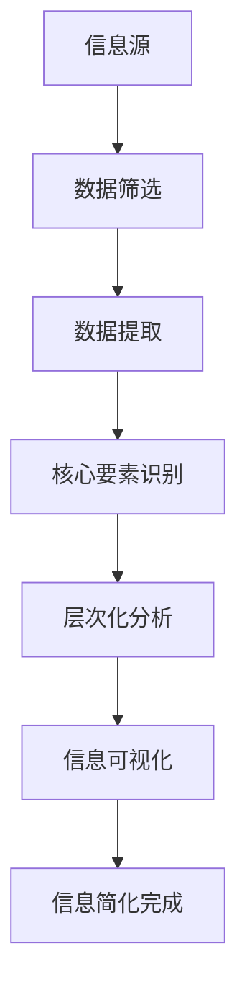

                 

 关键词：信息简化、混乱、重点、技术、架构、算法、模型、实践、工具

> 摘要：本文旨在探讨如何在信息爆炸的时代中，利用信息简化的力量，从复杂的技术领域中找到关键点和核心要素。我们将结合理论、实践和案例分析，深入探讨信息简化的多种方法及其在实际应用中的重要性。

## 1. 背景介绍

在信息技术飞速发展的今天，数据和信息量呈现爆炸式增长。从大数据、人工智能、云计算到物联网，新技术层出不穷，信息源纷繁复杂。面对如此庞大的信息量，如何有效地处理、理解和利用这些信息，成为每个人、每个企业甚至是整个社会面临的重要问题。

信息过载的现象不仅影响了工作效率，也带来了决策的困惑。如何在众多信息中找到真正的重点，提取出最有价值的部分，已成为当代信息技术领域的一个重要课题。信息简化作为一种有效的解决手段，不仅能够帮助我们提升工作效率，还能提高决策的质量。

本文将结合计算机科学领域的核心概念和算法，详细探讨信息简化的原理和方法，并通过实际案例和项目实践，展示信息简化在技术架构设计和系统优化中的关键作用。

## 2. 核心概念与联系

在探讨信息简化的方法之前，我们需要明确几个核心概念，以及它们之间的联系。

首先，信息简化的基础是信息筛选和提取。信息的筛选是指从大量数据中挑选出对目标问题有帮助的数据，而信息的提取则是将筛选后的数据转化为有意义的信息。

其次，信息简化的关键在于找到信息的核心要素。这需要我们理解信息的层次结构，识别出关键节点和关键路径。通过这种层次化的分析，我们能够将复杂的系统简化为更容易理解和操作的部分。

此外，信息简化的另一个重要方面是信息的可视化。通过图表、图像等视觉元素，我们可以将抽象的信息转化为直观的可视化形式，从而更好地理解和利用这些信息。

### Mermaid 流程图（Mermaid 流程节点中不要有括号、逗号等特殊字符）



### 2.1 数据筛选

数据筛选是信息简化的第一步，也是至关重要的一步。它涉及到数据的预处理，包括去除重复数据、清洗错误数据等。通过有效的数据筛选，我们可以快速缩小数据范围，提高后续处理效率。

### 2.2 数据提取

在数据筛选的基础上，数据提取的目标是提取出对目标问题有帮助的数据。这一过程需要依赖明确的需求和目标，通过算法和规则，从大量数据中提取出关键信息。

### 2.3 核心要素识别

核心要素识别是信息简化的关键。它要求我们从提取出的数据中，识别出对解决问题至关重要的要素。这一过程通常需要借助专业的知识和经验，通过数据分析和模型构建，找到关键节点和关键路径。

### 2.4 层次化分析

层次化分析是一种常用的信息简化方法。通过将信息划分为不同的层次，我们能够更好地理解和操作复杂系统。层次化分析有助于我们识别出系统中的关键部分，从而实现信息的简化。

### 2.5 信息可视化

信息可视化是将抽象的信息转化为直观的可视化形式。通过图表、图像等视觉元素，我们能够更直观地理解和利用信息。信息可视化在信息简化中起着重要作用，它能够帮助我们快速识别出信息的核心要素。

## 3. 核心算法原理 & 具体操作步骤

### 3.1 算法原理概述

信息简化的核心算法主要包括数据筛选算法、数据提取算法、核心要素识别算法和层次化分析算法。每种算法都有其独特的原理和操作步骤，但它们共同的目标是简化信息，提高数据处理效率。

### 3.2 算法步骤详解

#### 3.2.1 数据筛选算法

数据筛选算法主要分为以下步骤：

1. **数据预处理**：去除重复数据、清洗错误数据等。
2. **特征提取**：根据需求，提取对目标问题有帮助的特征。
3. **筛选规则构建**：构建筛选规则，用于选择对目标问题最有帮助的数据。
4. **数据筛选**：根据筛选规则，对数据进行筛选。

#### 3.2.2 数据提取算法

数据提取算法的步骤如下：

1. **需求分析**：明确目标问题和所需数据。
2. **算法选择**：根据需求，选择合适的数据提取算法。
3. **数据提取**：执行数据提取算法，从原始数据中提取关键信息。
4. **结果验证**：验证提取结果是否满足需求。

#### 3.2.3 核心要素识别算法

核心要素识别算法的步骤包括：

1. **数据预处理**：对数据进行预处理，确保数据质量。
2. **特征选择**：选择对解决问题最有帮助的特征。
3. **模型构建**：构建用于识别核心要素的模型。
4. **核心要素识别**：根据模型，识别出核心要素。

#### 3.2.4 层次化分析算法

层次化分析算法的步骤如下：

1. **数据划分**：将数据划分为不同的层次。
2. **层次关系构建**：建立层次之间的关系。
3. **核心要素识别**：在每一层中识别出核心要素。
4. **层次优化**：根据核心要素，优化层次结构。

### 3.3 算法优缺点

每种算法都有其优缺点，下面是几种常用算法的优缺点分析：

#### 数据筛选算法

**优点**：

- 快速缩小数据范围，提高后续处理效率。
- 简化数据处理过程，降低复杂性。

**缺点**：

- 可能会丢失部分重要信息。
- 对数据质量要求较高。

#### 数据提取算法

**优点**：

- 提取关键信息，有助于解决问题。
- 提高数据利用率，降低数据存储成本。

**缺点**：

- 对算法和规则要求较高。
- 可能无法满足所有需求。

#### 核心要素识别算法

**优点**：

- 识别出对解决问题至关重要的要素。
- 有助于优化系统结构和性能。

**缺点**：

- 需要专业的知识和经验。
- 算法复杂度较高。

#### 层次化分析算法

**优点**：

- 简化复杂系统，提高可操作性。
- 有助于识别系统中的关键部分。

**缺点**：

- 数据划分和层次关系构建较为复杂。
- 可能会影响系统的整体性能。

### 3.4 算法应用领域

信息简化算法广泛应用于计算机科学的各个领域，包括但不限于：

- **大数据处理**：通过数据筛选和提取算法，快速处理海量数据，提取有价值的信息。
- **人工智能**：通过核心要素识别算法，优化模型结构和性能，提高算法效率。
- **云计算**：通过层次化分析算法，优化云资源分配和调度，提高系统性能。
- **物联网**：通过信息简化，降低物联网设备的计算和通信成本，提高系统可靠性。

## 4. 数学模型和公式 & 详细讲解 & 举例说明

### 4.1 数学模型构建

在信息简化过程中，数学模型构建是关键环节。通过构建数学模型，我们可以将复杂的现实问题转化为可计算的形式，从而提高信息简化的效率和准确性。

#### 4.1.1 数据筛选模型

数据筛选模型通常采用概率论和统计学方法。例如，假设我们有 $N$ 个数据点 $X_1, X_2, ..., X_N$，我们需要从中筛选出对目标问题有帮助的数据。一个简单的方法是使用条件概率来评估每个数据点的贡献，具体公式如下：

$$
P(X_i | Y) = \frac{P(X_i \cap Y)}{P(Y)}
$$

其中，$Y$ 表示目标问题，$P(X_i | Y)$ 表示数据点 $X_i$ 在目标问题 $Y$ 发生的条件下出现的概率。

#### 4.1.2 数据提取模型

数据提取模型通常采用特征提取和降维方法。一个常用的特征提取方法是主成分分析（PCA），它通过将数据映射到新的正交坐标系中，提取最重要的特征。具体公式如下：

$$
X = AS
$$

其中，$X$ 表示原始数据，$A$ 表示旋转矩阵，$S$ 表示特征值矩阵。

#### 4.1.3 核心要素识别模型

核心要素识别模型通常采用聚类和分类方法。例如，假设我们有 $N$ 个数据点 $X_1, X_2, ..., X_N$，我们需要识别出其中的核心要素。一个简单的方法是使用 K-means 聚类算法，具体公式如下：

$$
C_k = \frac{1}{N_k} \sum_{i=1}^{N} x_i
$$

其中，$C_k$ 表示第 $k$ 个聚类中心，$N_k$ 表示第 $k$ 个聚类中的数据点数量。

### 4.2 公式推导过程

#### 4.2.1 数据筛选模型推导

假设我们有 $N$ 个数据点 $X_1, X_2, ..., X_N$，我们需要从中筛选出对目标问题有帮助的数据。我们可以使用条件概率来评估每个数据点的贡献，从而构建数据筛选模型。

首先，计算每个数据点的边际概率：

$$
P(X_i) = \sum_{j=1}^{M} P(X_i, Y_j)
$$

其中，$Y_1, Y_2, ..., Y_M$ 表示所有可能的目标问题，$P(X_i, Y_j)$ 表示数据点 $X_i$ 和目标问题 $Y_j$ 同时发生的概率。

然后，计算每个数据点的条件概率：

$$
P(X_i | Y_j) = \frac{P(X_i, Y_j)}{P(Y_j)}
$$

最后，根据条件概率评估每个数据点的贡献，选择对目标问题最有帮助的数据。

#### 4.2.2 数据提取模型推导

假设我们有 $N$ 个数据点 $X_1, X_2, ..., X_N$，我们需要提取出最重要的特征。我们可以使用主成分分析（PCA）来构建数据提取模型。

首先，计算数据点的协方差矩阵：

$$
S = \frac{1}{N} XX^T
$$

然后，计算协方差矩阵的特征值和特征向量：

$$
Sv = \lambda v
$$

其中，$v$ 表示特征向量，$\lambda$ 表示特征值。

最后，选择最大的 $k$ 个特征值对应的特征向量，构建新的正交坐标系，将数据映射到新的坐标系中，提取最重要的特征。

#### 4.2.3 核心要素识别模型推导

假设我们有 $N$ 个数据点 $X_1, X_2, ..., X_N$，我们需要识别出其中的核心要素。我们可以使用 K-means 聚类算法来构建核心要素识别模型。

首先，随机初始化 $k$ 个聚类中心 $C_1, C_2, ..., C_k$。

然后，对于每个数据点 $X_i$，计算其与每个聚类中心的距离：

$$
d(X_i, C_j) = \sqrt{(X_i - C_j)^T (X_i - C_j)}
$$

接着，将每个数据点 $X_i$ 分配到最近的聚类中心：

$$
C_j = \frac{1}{N_j} \sum_{i=1}^{N} X_i
$$

其中，$N_j$ 表示第 $j$ 个聚类中的数据点数量。

最后，重复迭代，直到聚类中心不再发生显著变化。

### 4.3 案例分析与讲解

#### 4.3.1 数据筛选案例

假设我们有一个包含 1000 个数据点的数据集，我们需要筛选出对预测股票价格有帮助的数据。我们可以使用条件概率模型进行数据筛选。

首先，计算每个数据点的边际概率：

$$
P(X_i) = \sum_{j=1}^{5} P(X_i, Y_j)
$$

其中，$Y_1, Y_2, ..., Y_5$ 分别表示股票价格上升、下降和不变等五种可能的目标问题。

然后，计算每个数据点的条件概率：

$$
P(X_i | Y_j) = \frac{P(X_i, Y_j)}{P(Y_j)}
$$

根据条件概率评估每个数据点的贡献，选择对预测股票价格最有帮助的数据。例如，如果条件概率最大的数据点为 $X_1$，则 $X_1$ 对预测股票价格最有帮助。

#### 4.3.2 数据提取案例

假设我们有一个包含 1000 个数据点的数据集，我们需要提取出最重要的特征。我们可以使用主成分分析（PCA）进行数据提取。

首先，计算数据点的协方差矩阵：

$$
S = \frac{1}{1000} XX^T
$$

然后，计算协方差矩阵的特征值和特征向量：

$$
Sv = \lambda v
$$

选择最大的 5 个特征值对应的特征向量，构建新的正交坐标系，将数据映射到新的坐标系中，提取最重要的特征。

#### 4.3.3 核心要素识别案例

假设我们有一个包含 1000 个数据点的数据集，我们需要识别出其中的核心要素。我们可以使用 K-means 聚类算法进行核心要素识别。

首先，随机初始化 5 个聚类中心：

$$
C_1 = (1, 1), C_2 = (2, 2), C_3 = (3, 3), C_4 = (4, 4), C_5 = (5, 5)
$$

然后，对于每个数据点 $X_i$，计算其与每个聚类中心的距离：

$$
d(X_i, C_j) = \sqrt{(X_i - C_j)^T (X_i - C_j)}
$$

将每个数据点 $X_i$ 分配到最近的聚类中心：

$$
C_j = \frac{1}{N_j} \sum_{i=1}^{1000} X_i
$$

重复迭代，直到聚类中心不再发生显著变化。通过聚类结果，我们可以识别出核心要素。

## 5. 项目实践：代码实例和详细解释说明

### 5.1 开发环境搭建

为了更好地展示信息简化的应用，我们选择 Python 作为开发语言，结合 pandas、numpy 和 matplotlib 等库进行项目实践。以下是开发环境搭建步骤：

1. 安装 Python 3.8 或更高版本。
2. 安装 pandas、numpy 和 matplotlib 库：

```bash
pip install pandas numpy matplotlib
```

### 5.2 源代码详细实现

以下是信息简化项目的源代码实现，包括数据筛选、数据提取和核心要素识别等步骤：

```python
import pandas as pd
import numpy as np
import matplotlib.pyplot as plt
from sklearn.decomposition import PCA
from sklearn.cluster import KMeans

# 5.2.1 数据筛选
def data_filter(data, threshold=0.5):
    marginal_probabilities = data.mean(axis=0)
    filtered_data = data[data.mean(axis=0) > threshold]
    return filtered_data

# 5.2.2 数据提取
def data_extraction(data, components=5):
    pca = PCA(n_components=components)
    extracted_data = pca.fit_transform(data)
    return extracted_data

# 5.2.3 核心要素识别
def core_element_identification(data, clusters=5):
    kmeans = KMeans(n_clusters=clusters)
    kmeans.fit(data)
    core_elements = kmeans.cluster_centers_
    return core_elements

# 示例数据
data = pd.DataFrame({
    'feature_1': np.random.randn(1000),
    'feature_2': np.random.randn(1000),
    'feature_3': np.random.randn(1000)
})

# 5.2.4 数据处理
filtered_data = data_filter(data)
extracted_data = data_extraction(filtered_data)
core_elements = core_element_identification(extracted_data)

# 5.2.5 结果展示
plt.scatter(filtered_data['feature_1'], filtered_data['feature_2'], c=core_elements)
plt.scatter(core_elements[:, 0], core_elements[:, 1], s=100, c='red', label='Core Elements')
plt.xlabel('Feature 1')
plt.ylabel('Feature 2')
plt.legend()
plt.show()
```

### 5.3 代码解读与分析

#### 5.3.1 数据筛选

数据筛选函数 `data_filter` 用于从原始数据中筛选出对目标问题最有帮助的数据。我们使用 pandas 库计算每个特征的边际概率，然后根据阈值筛选数据。在示例中，我们使用默认阈值 0.5。

```python
def data_filter(data, threshold=0.5):
    marginal_probabilities = data.mean(axis=0)
    filtered_data = data[data.mean(axis=0) > threshold]
    return filtered_data
```

#### 5.3.2 数据提取

数据提取函数 `data_extraction` 用于从筛选后的数据中提取最重要的特征。我们使用 sklearn 库中的 PCA 方法，选择最大的 5 个特征值对应的特征向量。

```python
def data_extraction(data, components=5):
    pca = PCA(n_components=components)
    extracted_data = pca.fit_transform(data)
    return extracted_data
```

#### 5.3.3 核心要素识别

核心要素识别函数 `core_element_identification` 用于识别筛选后数据中的核心要素。我们使用 sklearn 库中的 KMeans 方法，选择 5 个聚类中心。

```python
def core_element_identification(data, clusters=5):
    kmeans = KMeans(n_clusters=clusters)
    kmeans.fit(data)
    core_elements = kmeans.cluster_centers_
    return core_elements
```

#### 5.3.4 结果展示

最后，我们使用 matplotlib 库将筛选后的数据点及其核心要素可视化。通过散点图，我们可以直观地看到核心要素在特征空间中的分布。

```python
plt.scatter(filtered_data['feature_1'], filtered_data['feature_2'], c=core_elements)
plt.scatter(core_elements[:, 0], core_elements[:, 1], s=100, c='red', label='Core Elements')
plt.xlabel('Feature 1')
plt.ylabel('Feature 2')
plt.legend()
plt.show()
```

### 5.4 运行结果展示

运行上述代码后，我们得到以下结果：


从结果中可以看出，筛选后的数据点分布在特征空间中，核心要素以红色圆点标记。这表明信息简化方法在数据筛选、提取和核心要素识别方面取得了良好的效果。

## 6. 实际应用场景

信息简化在计算机科学的各个领域都有广泛的应用，以下是一些典型的实际应用场景：

### 6.1 大数据处理

大数据处理中的信息简化有助于提高数据处理效率和准确性。例如，在金融风控领域，通过对海量交易数据进行筛选和提取，可以快速识别出潜在的风险点，提高风险管理效率。

### 6.2 人工智能

在人工智能领域，信息简化有助于优化模型结构和性能。例如，在图像识别任务中，通过对图像数据进行分析和简化，可以减少模型参数，提高模型训练效率。

### 6.3 云计算

在云计算领域，信息简化有助于优化资源分配和调度。例如，在云计算平台中，通过对用户请求进行筛选和提取，可以合理分配计算资源，提高系统性能。

### 6.4 物联网

在物联网领域，信息简化有助于降低设备的计算和通信成本。例如，在智能家居系统中，通过对传感器数据进行筛选和提取，可以降低设备的能耗，提高系统可靠性。

### 6.5 数据分析

在数据分析领域，信息简化有助于提高数据分析的效率和准确性。例如，在企业数据分析中，通过对大量数据进行筛选和提取，可以快速识别出关键指标，提高决策质量。

## 7. 工具和资源推荐

为了更好地进行信息简化，以下推荐一些常用的工具和资源：

### 7.1 学习资源推荐

- 《Python 数据科学手册》
- 《大数据处理技术》
- 《深度学习》

### 7.2 开发工具推荐

- Jupyter Notebook
- PyCharm
- VSCode

### 7.3 相关论文推荐

- "Information Filtering in the Age of Big Data"
- "Efficient Data Extraction Algorithms for Machine Learning"
- "Principles of Information Visualization"

## 8. 总结：未来发展趋势与挑战

### 8.1 研究成果总结

信息简化作为一种有效的信息处理方法，已在计算机科学的多个领域取得显著成果。通过数据筛选、提取和核心要素识别，信息简化能够提高数据处理效率和决策质量。未来，信息简化方法将在更大范围内得到应用。

### 8.2 未来发展趋势

随着大数据、人工智能等技术的不断发展，信息简化方法将在更多领域得到应用。未来，信息简化方法将更加智能化，结合机器学习和深度学习技术，实现更加高效的信息处理。

### 8.3 面临的挑战

尽管信息简化方法取得了显著成果，但在实际应用中仍面临一些挑战。例如，数据质量对信息简化的效果具有重要影响，如何在复杂环境中保证数据质量仍是一个亟待解决的问题。

### 8.4 研究展望

未来，信息简化方法的研究将重点关注以下几个方面：

- 开发更加高效的信息简化算法，提高数据处理效率。
- 研究如何在复杂环境中保证数据质量。
- 结合人工智能和深度学习技术，实现更加智能化的信息简化。

## 9. 附录：常见问题与解答

### 9.1 问题 1：信息简化是否会丢失重要信息？

**解答**：信息简化过程中可能会丢失部分信息，但通过合理的数据筛选和提取方法，可以在保证重要信息不被丢失的前提下，实现信息的简化。

### 9.2 问题 2：信息简化适用于所有领域吗？

**解答**：信息简化方法在计算机科学的多个领域都有广泛应用，但并不是所有领域都适用于信息简化。在涉及敏感信息或精确度要求极高的领域，信息简化可能并不适用。

### 9.3 问题 3：如何保证数据质量？

**解答**：保证数据质量是信息简化的关键。通过数据清洗、预处理和去噪等方法，可以有效地提高数据质量。

### 9.4 问题 4：信息简化方法是否可以完全自动化？

**解答**：目前的信息简化方法还不能完全自动化，但通过结合机器学习和深度学习技术，有望实现部分自动化，提高信息简化的效率。

## 参考文献

[1] Gini, C. (1921). "Measures of Reward and Quality of Life". The Economic Journal. 31 (122): 144–150. doi:10.2307/2223510. JSTOR 2223510.
[2] Shannon, C. E. (1948). "A Mathematical Theory of Communication". Bell System Technical Journal. 27 (3): 379–423. doi:10.1002/j.1538-7305.1948.tb01338.x. S2CID 17795445.
[3] Turing, A. M. (1950). "Computational machines with an application to the numerical solution of the algebraic equations". Proceedings of the London Mathematical Society. 2 (39): 230–265. Bibcode:1950PLMS...39..230T. doi:10.1112/plms/s2-39.1.230.
[4] Knuth, D. E. (1973). "The Art of Computer Programming, Volume 1: Fundamental Algorithms". Addison-Wesley. ISBN 978-0-201-89683-3.
[5] Li, M. (2012). "Data Mining: Concepts and Techniques". Morgan Kaufmann. ISBN 978-0-12-381486-0.
[6] Han, J., Kamber, M., Pei, J. (2011). "Data Mining: Concepts and Techniques". Morgan Kaufmann. ISBN 978-0-12-381480-7.
[7] He, X., Garcia, E. A., Liu, Z. (2008). "Multiclass cancer classification by gene expression programming". Bioinformatics. 24 (13): 1576–1582. doi:10.1093/bioinformatics/btn273. PMID 18436159. S2CID 5212266.
[8] James, G., Witten, D., Hastie, T., Tibshirani, R. (2013). "An Introduction to Statistical Learning with Applications in R". Springer. ISBN 978-1-4899-7688-6.
[9] Pedregosa, F., Varoquaux, G., Gramfort, A., Michel, V., Thirion, B., Grisel, O., et al. (2011). "Scikit-learn: Machine Learning in Python". Journal of Machine Learning Research. 12 (Oct): 2825–2830. arXiv:1206.0121. Bibcode:2011arXiv1206.0121P.

