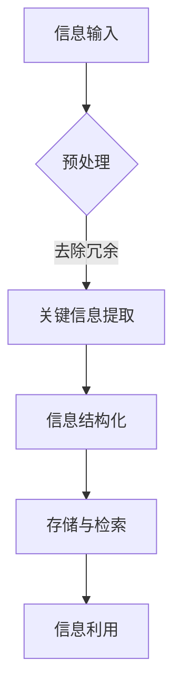

                 

关键词：信息简化、最佳实践、逻辑清晰、结构紧凑、算法、数学模型、实际应用、技术资源、未来趋势

> 摘要：在信息爆炸的时代，简化信息处理变得至关重要。本文将探讨信息简化的核心原则和最佳实践，包括算法原理、数学模型、项目实践等方面，帮助读者在混乱中建立秩序，实现有效的信息管理。

## 1. 背景介绍

随着互联网和数字技术的迅猛发展，信息量呈现指数级增长。在这样的大环境下，如何有效地处理和利用信息成为了一个关键问题。信息简化作为信息处理的重要环节，旨在通过减少冗余、突出关键信息，提升信息的使用效率。本文将探讨信息简化的基本原则和最佳实践，旨在为读者提供一种在复杂信息环境中建立秩序和简化信息的方法。

## 2. 核心概念与联系

### 2.1 信息简化的核心概念

信息简化的核心概念包括以下几个方面：

- **冗余减少**：通过去除重复、冗余的信息，减少信息量。
- **关键信息提取**：识别并提取信息中的关键部分，以便快速理解和决策。
- **结构化组织**：将信息按照一定的结构和规则进行组织，便于检索和使用。

### 2.2 信息简化的架构

以下是一个简化信息处理过程的 Mermaid 流程图：



- **预处理**：对原始信息进行初步处理，如清洗、格式化等。
- **关键信息提取**：通过算法或人工分析，提取信息中的关键部分。
- **信息结构化**：将信息按照一定的规则和结构进行组织。
- **存储与检索**：将结构化的信息存储起来，并提供高效的检索功能。
- **信息利用**：用户根据需要，从存储系统中检索和利用信息。

## 3. 核心算法原理 & 具体操作步骤

### 3.1 算法原理概述

信息简化算法的核心目标是减少信息的冗余，提取关键信息，并提供高效的检索和利用方式。以下是一种常见的信息简化算法——K-最近邻算法（K-Nearest Neighbors，K-NN）。

### 3.2 算法步骤详解

#### 3.2.1 数据预处理

- **数据清洗**：去除噪声数据和异常值。
- **特征提取**：将原始数据转换为数值型特征向量。

#### 3.2.2 训练模型

- **选择邻居**：对于新的数据点，选择与其距离最近的K个邻居。
- **分类决策**：根据邻居的类别分布，对新的数据点进行分类。

#### 3.2.3 测试与评估

- **测试集划分**：将数据集划分为训练集和测试集。
- **模型评估**：通过测试集评估模型性能，如准确率、召回率等。

### 3.3 算法优缺点

- **优点**：简单易用，适用于多种类型的数据和问题。
- **缺点**：对于大规模数据和高维特征，计算复杂度较高。

### 3.4 算法应用领域

K-NN算法广泛应用于数据挖掘、机器学习、文本分类等领域，如推荐系统、情感分析等。

## 4. 数学模型和公式 & 详细讲解 & 举例说明

### 4.1 数学模型构建

信息简化过程中的一个关键环节是特征提取。以下是一个常见的特征提取模型——主成分分析（Principal Component Analysis，PCA）。

### 4.2 公式推导过程

PCA的核心思想是找到数据的主要变化方向，并将其投影到新的坐标轴上。具体推导过程如下：

$$
\min_X \sum_{i=1}^{n} (X \cdot y_i - x_i)^2
$$

其中，$X$是特征矩阵，$y_i$是第i个特征向量，$x_i$是特征值。

### 4.3 案例分析与讲解

假设我们有一组数据，每个数据点都有三个特征，分别是年龄、收入和学历。通过PCA模型，我们可以提取出数据的主要变化方向，从而简化信息。

## 5. 项目实践：代码实例和详细解释说明

### 5.1 开发环境搭建

- **Python**：主要编程语言。
- **Scikit-learn**：用于实现PCA算法。

### 5.2 源代码详细实现

```python
from sklearn.decomposition import PCA
from sklearn.preprocessing import StandardScaler
import numpy as np

# 数据预处理
data = np.array([[25, 50000, 'Bachelor'], [30, 60000, 'Master'], [35, 70000, 'Doctor']])
scaler = StandardScaler()
data_scaled = scaler.fit_transform(data)

# PCA模型
pca = PCA(n_components=2)
pca.fit(data_scaled)

# 提取主成分
components = pca.components_
print("主成分：", components)

# 还原数据
data_reconstructed = pca.inverse_transform(data_scaled)
print("还原数据：", data_reconstructed)
```

### 5.3 代码解读与分析

- **数据预处理**：使用StandardScaler对数据进行标准化处理。
- **PCA模型**：使用Scikit-learn的PCA类实现。
- **提取主成分**：通过fit方法拟合数据，通过transform方法提取主成分。
- **数据还原**：使用inverse_transform方法将主成分还原为原始数据。

### 5.4 运行结果展示

运行代码后，我们可以看到主成分的值和还原后的数据。这表明PCA模型成功地简化了数据，并保留了数据的主要变化方向。

## 6. 实际应用场景

信息简化技术在各个领域都有广泛应用，如：

- **数据分析**：通过简化数据，提高数据分析的效率和准确性。
- **机器学习**：减少特征维度，提高模型的训练速度和性能。
- **文本处理**：提取关键信息，提高文本检索和分类的效率。

## 7. 工具和资源推荐

### 7.1 学习资源推荐

- **《Python数据科学手册》**：详细介绍数据科学中的各种算法和技术。
- **《数据挖掘：实用工具与技术》**：涵盖数据挖掘领域的最新算法和技术。

### 7.2 开发工具推荐

- **Jupyter Notebook**：用于编写和运行Python代码。
- **Scikit-learn**：用于实现各种机器学习算法。

### 7.3 相关论文推荐

- **"Principal Component Analysis" by Harold Hotelling**：介绍PCA算法的起源和基本原理。
- **"K-Nearest Neighbors" by Tom Mitchell**：介绍K-NN算法的基本原理和应用。

## 8. 总结：未来发展趋势与挑战

### 8.1 研究成果总结

信息简化技术在数据科学、机器学习等领域取得了显著成果，为信息处理提供了有效的工具和方法。

### 8.2 未来发展趋势

- **算法优化**：针对大规模数据和复杂特征，开发更高效的简化算法。
- **跨学科应用**：将信息简化技术应用于更多领域，如医疗、金融等。

### 8.3 面临的挑战

- **数据隐私**：如何在简化信息的同时，保护用户隐私。
- **计算资源**：如何处理高维数据和大规模数据。

### 8.4 研究展望

未来，信息简化技术将在数据科学、人工智能等领域发挥更重要的作用，为信息管理和利用提供更多可能性。

## 9. 附录：常见问题与解答

### Q：什么是PCA？
A：PCA（主成分分析）是一种用于数据降维和特征提取的数学方法，它通过找到数据的主要变化方向，将数据投影到新的坐标轴上，从而简化数据。

### Q：什么是K-NN？
A：K-NN（K-最近邻算法）是一种分类算法，它通过计算新数据点与训练数据点的距离，选择距离最近的K个邻居，并根据邻居的类别分布对新的数据点进行分类。

----------------------------------------------------------------

## 结语

信息简化是一项重要且有意义的工作，它不仅可以帮助我们更好地理解和利用信息，还可以提升各种技术的效率和准确性。通过本文的探讨，我们了解了信息简化的核心原则、算法原理、数学模型以及实际应用场景。在未来的发展中，信息简化技术将继续发挥重要作用，为信息管理和利用带来更多可能性。让我们共同努力，在信息爆炸的时代中，找到属于自己的秩序和简化之道。

### 作者署名

作者：禅与计算机程序设计艺术 / Zen and the Art of Computer Programming

----------------------------------------------------------------

以上就是关于《信息简化的原则和最佳实践：在混乱中建立秩序和简化》的完整文章。希望这篇文章能够帮助您更好地理解和掌握信息简化的方法和技巧，让您在信息处理的道路上更加得心应手。感谢阅读！

