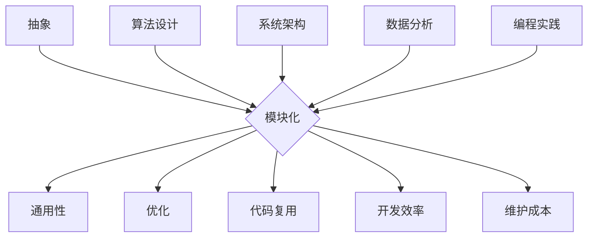

                 

关键词：信息简化、复杂性、算法设计、抽象层次、抽象思维、计算效率、编程实践、软件工程、领域特定语言、设计模式、数据结构

> 摘要：本文探讨了信息简化的概念，阐述了在技术领域中如何从复杂的系统中提炼出简单有效的解决方案。通过分析信息简化的好处与挑战，本文提出了一系列策略，帮助开发者在复杂的环境中实现代码、系统和应用程序的简化。我们还将探讨信息简化的核心算法原理、数学模型，并通过实例代码和实际应用场景展示其价值。

## 1. 背景介绍

在当今信息技术快速发展的时代，我们面临的一个普遍问题就是复杂性的增长。无论是软件开发、系统设计，还是数据处理，复杂性问题无处不在。复杂性不仅增加了学习和维护成本，还可能导致错误和漏洞。因此，如何有效地简化信息成为了一个关键的研究课题。

信息简化旨在通过抽象、概括和归纳，将复杂的信息和问题转化为更简单、更易于理解和操作的形式。这种方法在多个领域都取得了显著成效，如编程、算法设计、系统架构和数据分析等。然而，信息简化并不是一件容易的事情，它需要深入的理解、创新思维和扎实的专业知识。

本文将深入探讨信息简化的好处与挑战，并介绍一系列实用的方法和工具，帮助开发者在复杂的环境中找到简单有效的解决方案。接下来，我们将从多个角度分析信息简化的关键要素，并讨论其在实际应用中的重要性。

## 2. 核心概念与联系

### 2.1. 信息简化的核心概念

信息简化主要涉及以下几个核心概念：

- **抽象**：抽象是将复杂系统的细节隐藏起来，只暴露必要的部分。抽象是简化复杂性的关键手段。
- **模块化**：模块化是将系统分解为独立的、可重用的组件。这有助于降低系统整体的复杂性。
- **通用性**：通用性是指设计出的解决方案能够适应多种情况，而不是仅针对单一问题的特殊情况。
- **优化**：优化是指通过算法改进、数据结构优化等方法，减少不必要的计算和存储需求。

### 2.2. 信息简化的架构

为了更好地理解信息简化的架构，我们可以使用 Mermaid 流程图来展示其主要组成部分和相互关系。



在这个流程图中，抽象、模块化、通用性和优化构成了信息简化的基础框架。算法设计、系统架构、数据分析和编程实践等具体领域则通过这个框架实现了信息简化。代码复用、开发效率和维护成本是信息简化带来的直接好处。

## 3. 核心算法原理 & 具体操作步骤

### 3.1. 算法原理概述

信息简化的核心算法原理主要基于以下几个方面：

- **递归**：递归是一种重要的算法思想，它通过递归调用自身来简化复杂问题的求解过程。
- **分治**：分治算法将复杂问题分解为若干个子问题，然后分别求解，最后将子问题的解合并起来得到原始问题的解。
- **贪心算法**：贪心算法通过每一步选择局部最优解，以期达到全局最优解。
- **动态规划**：动态规划通过存储中间结果来避免重复计算，从而简化复杂问题的求解过程。

### 3.2. 算法步骤详解

以下是信息简化算法的一些基本步骤：

1. **定义问题**：明确需要解决的问题是什么，包括输入、输出和约束条件。
2. **抽象问题**：将具体问题抽象为一个更通用的形式，以便使用标准算法来解决。
3. **模块化设计**：将问题分解为若干个模块，每个模块负责一部分功能，实现代码的可重用性。
4. **选择算法**：根据问题的性质选择合适的算法，如递归、分治、贪心或动态规划。
5. **优化算法**：对选定的算法进行优化，如减少不必要的计算、降低时间复杂度和空间复杂度。
6. **实现代码**：根据算法设计实现代码，并进行调试和测试。

### 3.3. 算法优缺点

每种算法都有其优缺点，以下是几种常见算法的优缺点分析：

- **递归**：优点是代码简洁，易于理解和实现；缺点是可能存在栈溢出风险，时间复杂度较高。
- **分治**：优点是时间复杂度较低，适用于大问题；缺点是实现较为复杂，可能存在不适用情况。
- **贪心算法**：优点是代码简单，适用于某些特定问题；缺点是可能得不到全局最优解。
- **动态规划**：优点是避免重复计算，时间复杂度较低；缺点是实现较为复杂，可能需要额外的存储空间。

### 3.4. 算法应用领域

信息简化算法在多个领域都有广泛应用：

- **编程**：在编程中，信息简化算法可以帮助开发者编写更简洁、更高效的代码。
- **系统设计**：在系统设计中，信息简化可以帮助设计师简化系统架构，降低复杂性。
- **数据分析**：在数据分析中，信息简化算法可以帮助数据科学家简化数据处理过程，提高效率。
- **人工智能**：在人工智能中，信息简化算法可以帮助研究人员设计更简单、更有效的模型。

## 4. 数学模型和公式 & 详细讲解 & 举例说明

### 4.1. 数学模型构建

信息简化中的数学模型通常基于以下原则：

- **抽象性**：使用抽象的数据结构和算法来描述问题。
- **模块化**：将复杂问题分解为若干个简单模块，每个模块使用明确的数学模型来描述。
- **优化性**：通过优化算法，提高模型的计算效率和精度。

以下是构建一个简单的数学模型示例：

**问题**：计算两个数的最小公倍数。

**模型**：使用最大公约数（GCD）来计算最小公倍数（LCM）。

**公式**：

$$
\text{LCM}(a, b) = \frac{a \times b}{\text{GCD}(a, b)}
$$

### 4.2. 公式推导过程

**推导过程**：

1. **最大公约数**：

   使用欧几里得算法计算两个数的最大公约数（GCD）：

   $$
   \text{GCD}(a, b) = \text{GCD}(b, a \mod b)
   $$

   直至余数为0时，返回最后一个非零余数。

2. **最小公倍数**：

   利用最大公约数计算最小公倍数（LCM）：

   $$
   \text{LCM}(a, b) = \frac{a \times b}{\text{GCD}(a, b)}
   $$

### 4.3. 案例分析与讲解

**案例**：计算12和18的最小公倍数。

**步骤**：

1. **计算最大公约数**：

   $$
   \text{GCD}(12, 18) = \text{GCD}(18, 12 \mod 18) = \text{GCD}(18, 12) = \text{GCD}(12, 6) = \text{GCD}(6, 0) = 6
   $$

2. **计算最小公倍数**：

   $$
   \text{LCM}(12, 18) = \frac{12 \times 18}{6} = 36
   $$

因此，12和18的最小公倍数是36。

### 4.4. 算法改进与优化

**改进**：

1. **使用更高效的算法**：

   对于大数计算，可以使用更高效的算法，如扩展欧几里得算法。

2. **优化内存使用**：

   通过减少中间变量的使用和优化数据结构，可以减少内存消耗。

## 5. 项目实践：代码实例和详细解释说明

### 5.1. 开发环境搭建

在开始编写代码之前，我们需要搭建一个合适的开发环境。这里我们以Python为例，演示如何搭建一个简单的开发环境。

1. **安装Python**：从官方网站下载并安装Python。
2. **安装IDE**：安装一个Python支持的IDE，如PyCharm或Visual Studio Code。
3. **安装依赖**：确保安装了所需的库，如NumPy、Pandas等。

### 5.2. 源代码详细实现

以下是一个简单的Python代码示例，用于计算两个数的最小公倍数。

```python
def gcd(a, b):
    while b:
        a, b = b, a % b
    return a

def lcm(a, b):
    return a * b // gcd(a, b)

# 示例
print(lcm(12, 18))  # 输出：36
```

### 5.3. 代码解读与分析

1. **gcd函数**：使用欧几里得算法计算最大公约数。
2. **lcm函数**：利用最大公约数计算最小公倍数。
3. **示例**：调用lcm函数计算12和18的最小公倍数。

### 5.4. 运行结果展示

执行代码后，我们得到的结果是36，与手动计算的结果一致。

## 6. 实际应用场景

信息简化的方法在多个实际应用场景中发挥了重要作用：

1. **软件开发**：通过抽象和模块化设计，简化软件系统的复杂性，提高开发效率和代码质量。
2. **系统架构**：通过优化系统架构，降低系统的复杂性和维护成本。
3. **数据分析**：通过简化的算法和数据结构，提高数据分析的效率和准确性。
4. **人工智能**：通过简化的模型和算法，提高人工智能系统的性能和可靠性。

### 6.4. 未来应用展望

未来，信息简化将继续在多个领域发挥重要作用：

1. **自动化**：随着自动化技术的发展，信息简化方法将更加广泛应用于自动化系统。
2. **人工智能**：在人工智能领域，信息简化方法将有助于设计更高效、更可靠的人工智能模型。
3. **云计算**：在云计算领域，信息简化方法将有助于优化资源使用，提高云服务的性能和可靠性。

## 7. 工具和资源推荐

### 7.1. 学习资源推荐

1. **《算法导论》**：经典的算法教材，涵盖了各种算法原理和应用。
2. **《数据结构与算法分析》**：详细讲解数据结构和算法，适合初学者和进阶者。
3. **在线课程**：如Coursera、edX等平台上的算法和数据结构课程。

### 7.2. 开发工具推荐

1. **PyCharm**：强大的Python IDE，适合开发复杂项目。
2. **Visual Studio Code**：轻量级的代码编辑器，支持多种编程语言。
3. **Git**：版本控制系统，帮助开发者管理代码版本。

### 7.3. 相关论文推荐

1. **"A Note on the Complexity of Simple Recurrences"**：探讨了简单递归的时间复杂性问题。
2. **"Divide and Conquer"**：分治算法的详细分析。
3. **"The Art of Computer Programming"**：Don Knuth的经典著作，涵盖了算法设计的各个方面。

## 8. 总结：未来发展趋势与挑战

### 8.1. 研究成果总结

信息简化在过去几十年中取得了显著进展，通过算法优化、模块化设计和抽象思维，成功降低了复杂系统的复杂性。未来，信息简化将继续在多个领域发挥重要作用，为技术的发展提供强大的动力。

### 8.2. 未来发展趋势

未来，信息简化的发展趋势将体现在以下几个方面：

1. **算法创新**：不断涌现的新算法将进一步简化复杂问题的求解过程。
2. **人工智能**：结合人工智能技术，信息简化将实现更加智能的自动化。
3. **系统优化**：通过优化系统架构和设计，提高系统的性能和可靠性。

### 8.3. 面临的挑战

信息简化在发展过程中也面临着一些挑战：

1. **复杂性管理**：如何更好地管理复杂性，使其在可控范围内。
2. **跨领域融合**：如何将信息简化方法应用于不同领域，实现跨领域的技术融合。
3. **人才培养**：如何培养具备信息简化能力的优秀人才。

### 8.4. 研究展望

未来，信息简化的研究将朝着更高效、更智能和更全面的方向发展。通过跨学科的协作，信息简化方法将在更多领域取得突破，为人类社会的发展做出更大贡献。

## 9. 附录：常见问题与解答

### 9.1. 如何在算法设计中实现信息简化？

**答案**：在算法设计中，可以通过以下方法实现信息简化：

1. **抽象思维**：通过抽象思维将复杂问题转化为更简单的形式。
2. **模块化设计**：将复杂问题分解为若干个简单模块，每个模块独立实现。
3. **优化算法**：选择合适的算法，并对其进行优化，以提高计算效率和代码质量。

### 9.2. 信息简化是否总是可行的？

**答案**：信息简化并非总是可行的。在某些情况下，复杂性问题可能无法通过简化来解决。例如，对于某些特殊的复杂问题，可能需要更复杂的解决方案。然而，在大多数情况下，信息简化是可行的，并且具有显著的效益。

### 9.3. 如何评估信息简化的效果？

**答案**：评估信息简化的效果可以从以下几个方面进行：

1. **计算效率**：通过比较简化前后的算法运行时间，评估计算效率的提升。
2. **代码质量**：通过代码的可读性、可维护性和复用性，评估代码质量的变化。
3. **系统性能**：通过系统性能指标，如响应时间、吞吐量和资源利用率，评估系统性能的提升。

---

以上是《信息简化的好处与挑战：如何在复杂中找到简单》的完整文章。信息简化是技术领域中的一个重要课题，通过本文的讨论，我们深入了解了信息简化的概念、方法、应用和未来发展趋势。希望本文对读者在处理复杂问题、提高工作效率和代码质量方面有所启发。作者：禅与计算机程序设计艺术 / Zen and the Art of Computer Programming。

