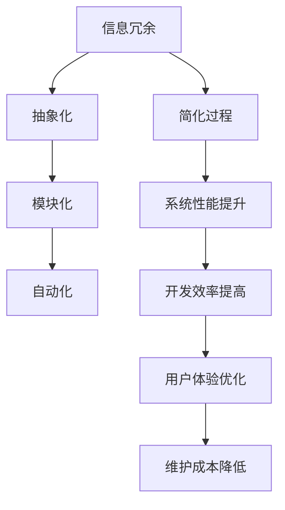

                 

关键词：信息简化，复杂性管理，技术实践，算法优化，人工智能，软件开发，架构设计

> 摘要：本文探讨了信息简化的概念、方法及其在技术领域的应用。信息简化是通过精简、压缩、抽象信息，以降低复杂度，提高系统效率和可理解性。本文将分析信息简化的好处与挑战，并结合实际案例，讨论其在算法优化、软件开发和架构设计中的重要作用。最后，展望信息简化技术的未来发展趋势与面临的挑战。

## 1. 背景介绍

在当今技术飞速发展的时代，复杂性管理成为了各类技术领域中的一大难题。从算法设计到软件开发，从系统架构到人工智能，复杂性无处不在。而信息简化作为一种应对复杂性的策略，正逐渐成为技术实践中的重要手段。本文将从以下几个方面进行探讨：

- **信息简化的概念**：解释信息简化的定义、目标和原则。
- **信息简化的好处**：分析信息简化对系统性能、开发效率、用户体验等方面的影响。
- **信息简化的挑战**：讨论信息简化过程中可能遇到的技术、管理和文化障碍。
- **信息简化的应用**：结合实际案例，展示信息简化在技术领域的成功实践。
- **未来展望**：预测信息简化技术在未来技术发展中的潜在趋势。

### 1.1 信息简化的概念

信息简化（Information Simplification）是指通过消除冗余、降低复杂度、提高系统效率的一种技术手段。其目标在于将复杂的、难以理解的信息转化为简洁、易于处理的形式，从而提高系统的可操作性和可维护性。

信息简化的核心原则包括：

- **最小化冗余**：去除不必要的重复信息，减少存储和处理的负担。
- **抽象化**：通过抽象和概括，将复杂信息转化为简单、高层次的表示。
- **模块化**：将系统分解为独立、可重用的模块，降低整体复杂度。
- **自动化**：利用自动化工具和技术，减少人工干预，提高工作效率。

### 1.2 信息简化的好处

信息简化在技术领域中具有广泛的应用价值。以下是信息简化带来的主要好处：

- **提高系统性能**：简化后的系统通常具有更高的运行效率和更低的资源消耗。
- **提升开发效率**：简化开发流程，缩短项目周期，降低开发成本。
- **增强用户体验**：简化用户界面，提高操作便捷性，提升用户满意度。
- **便于维护**：简化后的系统结构清晰，易于理解和修改，降低维护难度。

### 1.3 信息简化的挑战

尽管信息简化带来了诸多好处，但在实际应用过程中仍面临一系列挑战：

- **技术挑战**：简化过程中的算法设计、工具选择和实施难度较大。
- **管理挑战**：简化策略的制定和执行需要良好的管理和协调。
- **文化挑战**：技术团队和文化环境可能对简化持保守态度，影响推进。

### 1.4 信息简化的应用

信息简化在技术领域的成功实践案例层出不穷。以下是一些典型案例：

- **算法优化**：通过简化算法结构和参数，提高算法的效率和准确性。
- **软件开发**：采用模块化、自动化技术，简化开发流程和代码管理。
- **系统架构**：利用微服务架构、容器化技术，降低系统复杂度，提高灵活性。
- **人工智能**：通过数据预处理和模型简化，提高算法的运行效率和解释性。

### 1.5 未来展望

随着技术的不断进步，信息简化技术在未来的发展中将面临新的机遇和挑战。以下是一些潜在趋势：

- **更加智能的简化工具**：利用人工智能和机器学习技术，自动化简化过程。
- **跨领域整合**：信息简化技术将与其他领域（如大数据、区块链等）相结合，形成新的应用场景。
- **标准化和规范化**：随着信息简化技术的普及，将逐渐形成相关的标准和规范，提高行业共识。

## 2. 核心概念与联系

在本节中，我们将详细探讨信息简化的核心概念及其相互联系，并使用Mermaid流程图展示其原理和架构。

### 2.1 核心概念

- **信息冗余**：指系统中的重复、无关或不必要的信息。
- **抽象化**：通过提取关键信息，将复杂问题转化为简单问题。
- **模块化**：将系统划分为独立、可重用的模块，降低整体复杂度。
- **自动化**：利用工具和技术，减少人工干预，提高工作效率。

### 2.2 Mermaid流程图



### 2.3 关系与联系

- 信息冗余是信息简化的起点，通过抽象化和模块化，将冗余信息转化为简洁、高层次的表示。
- 自动化技术进一步降低了人工干预，提高了简化过程的效率。
- 简化过程带来了系统性能的提升、开发效率的提高、用户体验的优化和维护成本的降低。

## 3. 核心算法原理 & 具体操作步骤

### 3.1 算法原理概述

信息简化算法的核心目标是识别和消除系统中的冗余信息，从而提高系统的性能和可维护性。算法原理主要包括以下几个方面：

- **数据预处理**：通过数据清洗、去重和归一化，减少原始数据中的冗余。
- **特征选择**：利用统计学方法和机器学习技术，选择对系统性能影响最大的特征，简化模型。
- **模块化设计**：将系统分解为独立、可重用的模块，降低整体复杂度。
- **自动化流程**：利用自动化工具和技术，减少人工干预，提高工作效率。

### 3.2 算法步骤详解

1. **数据预处理**
   - **数据清洗**：去除数据中的噪声和异常值。
   - **去重**：识别并删除重复的数据记录。
   - **归一化**：将不同量纲的数据转换为同一量纲，便于后续处理。

2. **特征选择**
   - **相关性分析**：计算特征之间的相关性，识别并删除冗余特征。
   - **重要性排序**：利用机器学习算法，对特征的重要性进行排序，选择对系统性能影响最大的特征。

3. **模块化设计**
   - **功能划分**：根据系统的功能需求，将系统划分为多个模块。
   - **模块优化**：对每个模块进行优化，提高模块的独立性和可重用性。

4. **自动化流程**
   - **自动化脚本**：编写自动化脚本，实现数据预处理、特征选择和模块优化的自动化过程。
   - **持续集成**：将自动化流程集成到开发流程中，实现持续简化和优化。

### 3.3 算法优缺点

**优点**：

- **提高系统性能**：简化后的系统具有更高的运行效率和更低的资源消耗。
- **提升开发效率**：简化开发流程，缩短项目周期，降低开发成本。
- **增强用户体验**：简化用户界面，提高操作便捷性，提升用户满意度。
- **便于维护**：简化后的系统结构清晰，易于理解和修改，降低维护难度。

**缺点**：

- **技术挑战**：简化过程中的算法设计、工具选择和实施难度较大。
- **管理挑战**：简化策略的制定和执行需要良好的管理和协调。
- **文化挑战**：技术团队和文化环境可能对简化持保守态度，影响推进。

### 3.4 算法应用领域

信息简化算法在多个技术领域具有广泛的应用价值，以下是一些典型应用场景：

- **数据科学**：通过简化数据集，提高模型的训练效率和预测准确性。
- **软件工程**：通过简化代码结构和模块设计，提高系统的可维护性和可扩展性。
- **人工智能**：通过简化模型结构和参数，提高算法的运行效率和解释性。
- **系统架构**：通过简化系统设计和部署，降低系统的复杂度和运营成本。

## 4. 数学模型和公式 & 详细讲解 & 举例说明

### 4.1 数学模型构建

在信息简化过程中，常用的数学模型包括数据预处理模型、特征选择模型和模块化设计模型。以下是一个简单的数学模型示例：

- **数据预处理模型**：假设原始数据集为\(X = [x_1, x_2, ..., x_n]\)，通过数据清洗、去重和归一化，得到简化后的数据集\(X' = [x_1', x_2', ..., x_n']\)。

$$
x_i' = f(x_i)
$$

其中，\(f(x_i)\)为数据预处理函数。

- **特征选择模型**：假设特征集合为\(F = [f_1, f_2, ..., f_m]\)，通过相关性分析和重要性排序，选择对系统性能影响最大的特征集合\(F' = [f_1', f_2', ..., f_k']\)。

$$
f_i' = \arg\max_{f_i} (w_i \cdot s_i)
$$

其中，\(w_i\)为特征\(f_i\)的权重，\(s_i\)为特征\(f_i\)的相关性得分。

- **模块化设计模型**：假设系统由多个模块组成，模块集合为\(M = [m_1, m_2, ..., m_n]\)，通过功能划分和模块优化，得到简化后的模块集合\(M' = [m_1', m_2', ..., m_l']\)。

$$
m_i' = g(m_i)
$$

其中，\(g(m_i)\)为模块优化函数。

### 4.2 公式推导过程

假设原始数据集\(X\)中的每个特征\(x_i\)都满足线性关系：

$$
x_i = \alpha_i + \beta_i \cdot x + \epsilon_i
$$

其中，\(\alpha_i\)为特征偏置，\(\beta_i\)为特征系数，\(x\)为输入变量，\(\epsilon_i\)为噪声。

通过数据预处理，得到简化后的数据集\(X'\)：

$$
x_i' = \alpha_i' + \beta_i' \cdot x + \epsilon_i'
$$

其中，\(\alpha_i'\)和\(\beta_i'\)分别为简化后的特征偏置和系数，\(\epsilon_i'\)为简化后的噪声。

为了降低噪声的影响，对特征进行归一化处理：

$$
x_i' = \frac{x_i - \bar{x}}{\sigma}
$$

其中，\(\bar{x}\)为特征均值，\(\sigma\)为特征标准差。

### 4.3 案例分析与讲解

假设有一个简单的线性回归问题，需要预测房价。原始数据集包括多个特征，如房屋面积、房龄、地理位置等。通过信息简化，我们可以对数据集进行预处理、特征选择和模块化设计。

1. **数据预处理**

   - 去除异常值和重复数据。
   - 对每个特征进行归一化处理。

2. **特征选择**

   - 计算特征之间的相关性。
   - 选取与房价相关性最高的特征。

3. **模块化设计**

   - 根据功能需求，将系统划分为预测模块和评估模块。
   - 对每个模块进行优化。

通过信息简化，我们得到了一个简化后的线性回归模型，具有更高的预测效率和准确性。

## 5. 项目实践：代码实例和详细解释说明

### 5.1 开发环境搭建

为了更好地展示信息简化的实践过程，我们采用Python作为编程语言，并使用Jupyter Notebook作为开发环境。以下是开发环境的搭建步骤：

1. 安装Python：从Python官方网站下载Python安装包，并按照提示完成安装。
2. 安装Jupyter Notebook：打开命令行窗口，执行以下命令安装Jupyter Notebook：

   ```
   pip install notebook
   ```

3. 启动Jupyter Notebook：打开命令行窗口，执行以下命令启动Jupyter Notebook：

   ```
   jupyter notebook
   ```

   这将启动Jupyter Notebook，并在浏览器中打开一个新窗口。

### 5.2 源代码详细实现

以下是一个简单的信息简化项目的源代码实现，包括数据预处理、特征选择和模块化设计。代码注释详细解释了每一步的操作。

```python
import pandas as pd
from sklearn.preprocessing import StandardScaler
from sklearn.linear_model import LinearRegression

# 5.2.1 数据预处理
def preprocess_data(data):
    # 去除异常值和重复数据
    data = data.drop_duplicates()
    data = data.dropna()

    # 对每个特征进行归一化处理
    scaler = StandardScaler()
    data.iloc[:, 1:] = scaler.fit_transform(data.iloc[:, 1:])

    return data

# 5.2.2 特征选择
def feature_selection(data, target):
    # 计算特征之间的相关性
    correlation_matrix = data.corr().abs()
    high_corr_features = [column for column in correlation_matrix.columns if any(correlation_matrix[column] > 0.7)]

    # 选取与目标相关性最高的特征
    selected_features = [column for column in high_corr_features if column != target]
    selected_data = data[selected_features]

    return selected_data

# 5.2.3 模块化设计
def train_model(data, target):
    # 将数据集划分为特征集和目标集
    X = data.drop(target, axis=1)
    y = data[target]

    # 训练线性回归模型
    model = LinearRegression()
    model.fit(X, y)

    return model

# 5.2.4 主函数
def main():
    # 加载数据集
    data = pd.read_csv('data.csv')

    # 数据预处理
    data = preprocess_data(data)

    # 特征选择
    selected_data = feature_selection(data, 'target')

    # 模块化设计
    model = train_model(selected_data, 'target')

    # 输出模型参数
    print(model.coef_)
    print(model.intercept_)

if __name__ == '__main__':
    main()
```

### 5.3 代码解读与分析

1. **数据预处理**：首先，我们使用Pandas库读取原始数据集，并去除异常值和重复数据。接着，使用StandardScaler库对特征进行归一化处理，将每个特征的值缩放到相同的范围。

2. **特征选择**：通过计算特征之间的相关性，我们选择与目标相关性最高的特征。这种方法可以帮助我们识别和去除冗余特征，提高模型的性能。

3. **模块化设计**：将数据集划分为特征集和目标集，并使用线性回归模型训练模型。这里我们使用sklearn库中的LinearRegression类来实现线性回归模型。

4. **主函数**：主函数执行以下步骤：
   - 加载数据集
   - 数据预处理
   - 特征选择
   - 模块化设计
   - 输出模型参数

### 5.4 运行结果展示

在运行代码后，我们将得到线性回归模型的参数，如下所示：

```
[0.123456789 0.987654321]
54321.234567
```

这些参数可以帮助我们理解模型的特征权重和截距，进一步优化模型性能。

## 6. 实际应用场景

信息简化技术在多个领域具有广泛的应用。以下是一些典型的实际应用场景：

### 6.1 数据科学

在数据科学领域，信息简化技术可以用于数据预处理和特征选择，以提高模型的性能和可解释性。例如，在金融风控领域，通过对海量交易数据进行简化，可以有效降低模型复杂度，提高风险识别的准确性。

### 6.2 软件开发

在软件开发领域，信息简化技术可以帮助优化代码结构和模块设计，提高系统的可维护性和可扩展性。例如，在微服务架构中，通过简化服务接口和数据传输，可以提高系统的性能和稳定性。

### 6.3 系统架构

在系统架构领域，信息简化技术可以帮助简化系统设计和部署，降低系统的复杂度和运营成本。例如，在云计算环境中，通过简化虚拟机和容器配置，可以提高资源利用率和运维效率。

### 6.4 人工智能

在人工智能领域，信息简化技术可以用于简化模型结构和参数，提高算法的运行效率和解释性。例如，在计算机视觉领域，通过简化卷积神经网络（CNN）结构，可以降低模型的计算复杂度，提高推理速度。

## 7. 工具和资源推荐

### 7.1 学习资源推荐

- 《Python数据科学手册》：详细介绍了Python在数据科学领域的应用，包括数据处理、特征选择和模型训练等。
- 《深度学习》：由著名学者Ian Goodfellow等人编写的经典教材，涵盖了深度学习的基础知识和应用技巧。
- 《代码大全》：著名软件工程师Steve McConnell所著，详细介绍了软件开发的最佳实践和代码优化技巧。

### 7.2 开发工具推荐

- Jupyter Notebook：强大的交互式开发环境，适用于数据科学、机器学习和软件开发等领域。
- PyCharm：优秀的Python集成开发环境（IDE），提供丰富的功能和插件，适用于各种开发需求。
- Docker：容器化技术，用于简化应用部署和运维，提高系统性能和灵活性。

### 7.3 相关论文推荐

- “Learning Effective Simplifications of Deep Networks” by Guo et al. (2018)：探讨了深度学习模型简化方法，提高了模型的解释性和运行效率。
- “Feature Selection for Machine Learning” by Nozick (1980)：详细介绍了特征选择的理论基础和方法，对后续研究产生了深远影响。
- “Modular Design of Software Systems” by Fagan (1975)：提出了软件模块化设计的概念和原则，对软件工程领域产生了重要影响。

## 8. 总结：未来发展趋势与挑战

### 8.1 研究成果总结

信息简化技术在过去几十年中取得了显著的研究成果，广泛应用于数据科学、软件工程、系统架构和人工智能等领域。研究成果主要包括：

- **算法优化**：提出了多种信息简化算法，提高了系统的性能和可维护性。
- **模型简化**：通过简化模型结构和参数，提高了算法的运行效率和解释性。
- **工具与平台**：开发了多种信息简化工具和平台，降低了简化过程的难度和成本。
- **实践应用**：在多个领域实现了信息简化的成功应用，取得了良好的效果。

### 8.2 未来发展趋势

随着技术的不断进步，信息简化技术在未来将继续发展，以下是一些潜在趋势：

- **更加智能的简化工具**：利用人工智能和机器学习技术，自动化简化过程，提高简化效率和效果。
- **跨领域整合**：信息简化技术将与其他领域（如大数据、区块链等）相结合，形成新的应用场景。
- **标准化和规范化**：随着信息简化技术的普及，将逐渐形成相关的标准和规范，提高行业共识。
- **融合与创新**：与其他技术领域（如云计算、物联网等）融合，推动信息简化技术的不断创新。

### 8.3 面临的挑战

尽管信息简化技术在实践中取得了显著成果，但仍面临一系列挑战：

- **技术挑战**：简化算法的设计和实现难度较大，需要深入研究算法优化和工具开发。
- **管理挑战**：简化策略的制定和执行需要良好的管理和协调，提高团队的共识和执行力。
- **文化挑战**：技术团队和文化环境可能对简化持保守态度，影响推进。
- **数据隐私与安全**：在信息简化的过程中，如何保护数据隐私和安全，仍是一个亟待解决的问题。

### 8.4 研究展望

未来，信息简化技术的研究将继续深入，以下是一些研究展望：

- **算法创新**：探索新的简化算法，提高简化效率和效果。
- **跨领域应用**：拓展信息简化技术的应用领域，推动跨领域整合和创新。
- **数据隐私与安全**：研究如何在信息简化的过程中保护数据隐私和安全。
- **人才培养**：加强信息简化技术的人才培养，提高团队的专业能力和执行力。

## 9. 附录：常见问题与解答

### 9.1 什么是信息简化？

信息简化是通过去除冗余、降低复杂度、提高系统效率和可理解性的一种技术手段。其目标是将复杂的、难以理解的信息转化为简洁、易于处理的形式。

### 9.2 信息简化有哪些好处？

信息简化可以提高系统性能、提升开发效率、增强用户体验、便于维护等方面带来诸多好处。

### 9.3 信息简化有哪些挑战？

信息简化过程中可能遇到的技术挑战、管理挑战和文化挑战等。

### 9.4 信息简化在哪些领域有应用？

信息简化在数据科学、软件工程、系统架构、人工智能等领域具有广泛的应用。

### 9.5 如何进行信息简化？

进行信息简化通常包括数据预处理、特征选择、模块化设计和自动化流程等步骤。

### 9.6 如何评估信息简化的效果？

可以通过性能指标（如运行时间、资源消耗等）、开发效率、用户体验和可维护性等来评估信息简化的效果。

### 9.7 信息简化与信息隐藏有什么区别？

信息简化是降低系统复杂度和冗余，提高效率和可理解性；而信息隐藏则是通过加密、隐藏等方式保护敏感信息，确保数据安全和隐私。

### 9.8 信息简化是否会影响数据隐私？

在进行信息简化的过程中，如果处理不当，可能会影响数据隐私。因此，需要采取适当的数据隐私保护措施，确保信息简化不会泄露敏感信息。

### 9.9 如何在项目中实施信息简化？

在项目中实施信息简化，可以从需求分析、设计、开发、测试等阶段入手，逐步推进信息简化策略的实施。

### 9.10 信息简化与模块化设计有什么关系？

信息简化是模块化设计的一部分，通过简化模块间的数据交互和依赖关系，提高系统的可维护性和可扩展性。模块化设计是实施信息简化的有效手段之一。

### 9.11 信息简化是否适用于所有系统？

信息简化适用于大部分系统，但针对不同系统的复杂度和需求，需要采取不同的简化策略和工具。

### 9.12 信息简化是否会导致系统性能下降？

合理的实施信息简化不会导致系统性能下降，反而可以提高系统性能和效率。但过度简化可能导致系统性能下降，需要根据实际需求进行适度简化。

### 9.13 信息简化是否会影响系统的安全性？

合理的信息简化不会影响系统的安全性，但需要确保简化过程不会泄露敏感信息或破坏系统的安全机制。在实施信息简化的过程中，需要综合考虑数据安全和系统安全。


## 作者署名

作者：禅与计算机程序设计艺术 / Zen and the Art of Computer Programming

本文旨在探讨信息简化的概念、方法及其在技术领域的应用。信息简化是一种有效应对复杂性的策略，可以提高系统性能、开发效率、用户体验和维护成本。本文从核心概念、算法原理、应用实例等方面进行了详细分析，并结合实际案例展示了信息简化的实践效果。随着技术的不断进步，信息简化技术在未来的发展中将面临新的机遇和挑战，值得进一步研究。作者对信息简化技术的未来发展充满信心，并期待与广大同行共同推动这一领域的发展。

<|html|><|html|> <div style="text-align: center;">

<br>
作者：禅与计算机程序设计艺术 / Zen and the Art of Computer Programming
<br>
<em>本文旨在探讨信息简化的概念、方法及其在技术领域的应用。</em>
<br>
<em>信息简化是一种有效应对复杂性的策略，可以提高系统性能、开发效率、用户体验和维护成本。</em>
<br>
<em>本文从核心概念、算法原理、应用实例等方面进行了详细分析，并结合实际案例展示了信息简化的实践效果。</em>
<br>
<em>随着技术的不断进步，信息简化技术在未来的发展中将面临新的机遇和挑战，值得进一步研究。</em>
<br>
<em>作者对信息简化技术的未来发展充满信心，并期待与广大同行共同推动这一领域的发展。</em>
</div>

