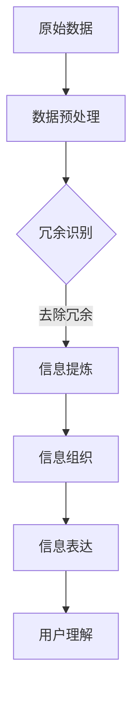

                 

## 摘要

本文旨在探讨信息简化的概念、好处及其面临的挑战。在当今信息爆炸的时代，简化复杂性变得尤为重要。信息简化不仅有助于提高工作效率，还能降低错误率、提升用户体验。本文首先介绍了信息简化的基本概念，然后详细分析了其在各领域中的应用，包括软件开发、数据处理、人工智能和设计。接着，文章探讨了信息简化过程中可能遇到的技术障碍和挑战，并提出了相应的解决方案。最后，本文展望了信息简化技术的未来发展趋势，以及我们需要面对的研究方向和挑战。通过本文的阅读，读者将深入了解信息简化的重要性和实用性。

## 1. 背景介绍

在当今快速发展的信息技术时代，我们面临着前所未有的数据和信息爆炸。据估计，全球每天产生的数据量已经达到了惊人的数百万亿字节（zettabytes），而这一数字还在不断增长。这种爆炸性的增长带来了许多新的挑战和机遇，特别是在数据处理、存储和检索方面。然而，这种信息过载现象也给人们带来了巨大的压力，使得有效管理和利用信息变得愈发困难。

信息简化作为应对信息过载的一种有效手段，受到了广泛关注。其基本理念是将复杂的信息通过一定的方法进行简化，使其更容易理解、处理和利用。信息简化的过程不仅仅是信息的压缩或缩减，更涉及到对信息的重新组织、归纳和提炼，以去除冗余、无关或重复的部分，从而提高信息的价值和使用效率。

信息简化的好处是多方面的。首先，它能够降低信息处理的难度，提高工作效率。当信息变得更加简明清晰时，人们能够更快地理解和处理信息，从而减少因信息冗余或复杂性导致的错误和误解。其次，信息简化有助于提升用户体验。在软件、网站和应用程序中，简洁明了的信息界面可以降低用户的认知负担，提高用户满意度。此外，信息简化还能够帮助人们更好地进行决策和规划，因为简化的信息更加直观和易于分析。

尽管信息简化带来了诸多好处，但这一过程也面临着一定的挑战。首先是技术实现的难度。信息简化需要对原始数据进行深入的分析和理解，这要求具备高水平的数据处理和分析能力。其次是信息简化的效果评估问题。简化的信息是否真正提高了信息的价值和可用性，往往需要通过实验和实际应用来验证。最后，信息简化还可能带来信息丢失的风险，特别是在过于追求简化的过程中，重要信息可能会被无意中删除或忽略。

本文将深入探讨信息简化的概念、方法、应用及其面临的挑战。首先，我们将详细介绍信息简化的基本概念和重要性，然后分析其在不同领域的应用，探讨其技术实现和效果评估。接着，我们将讨论信息简化过程中可能遇到的技术障碍和挑战，并提出相应的解决方案。最后，本文将展望信息简化技术的未来发展趋势，以及我们需要面对的研究方向和挑战。通过本文的阅读，读者将深入了解信息简化的艺术与实践，并能够更好地应对当今信息时代带来的挑战。

## 2. 核心概念与联系

在深入探讨信息简化的好处与挑战之前，首先需要明确信息简化的核心概念及其相关原理。信息简化不仅仅是数据的压缩或减少，而是一个系统性的过程，涉及到信息的提炼、组织、分析和表达。以下将详细阐述信息简化的核心概念，并借助Mermaid流程图来展示信息简化的原理和架构。

### 2.1. 信息简化的核心概念

**1. 信息冗余**：信息冗余指的是数据中包含的重复或不必要的信息。这些冗余信息不仅占用额外的存储空间，还会增加数据处理的复杂性。信息简化的第一步通常是识别和去除信息冗余。

**2. 信息提炼**：信息提炼是从大量原始数据中提取出有价值和意义的信息。这一过程需要对数据进行深度分析和理解，以便准确识别出关键信息。

**3. 信息组织**：信息组织是对提取出的信息进行合理的分类、排序和结构化，使其更加易于理解和处理。

**4. 信息表达**：信息表达是将简化后的信息以合适的形式进行呈现，如图表、报表、可视化等，以便用户能够直观地理解和利用信息。

### 2.2. Mermaid流程图展示信息简化的原理和架构

下面是使用Mermaid绘制的流程图，用于展示信息简化的基本原理和架构。请注意，Mermaid流程图中的节点名称必须避免使用括号、逗号等特殊字符。



### 2.3. 核心概念联系与解释

**数据预处理**：这一步骤通常包括数据清洗、去噪和格式转换。这些操作为后续的信息简化和分析奠定了基础。

**冗余识别**：通过统计分析、模式识别等技术，识别出数据中的冗余信息。这一步骤是信息简化的重要环节，因为它直接影响到最终简化效果。

**信息提炼**：在去除冗余信息的基础上，从原始数据中提取出有价值的部分。这一过程需要对数据进行深度分析，以便准确识别出关键信息。

**信息组织**：将提炼出的信息进行合理的分类、排序和结构化，使其更加易于理解和处理。这一步骤有助于提高信息的可读性和可用性。

**信息表达**：将简化后的信息以合适的形式进行呈现，如图表、报表、可视化等。这些表达方式不仅使信息更加直观，还提高了用户对信息的理解和利用能力。

通过上述流程图和核心概念的解释，我们可以看到信息简化是一个系统性的过程，涉及多个步骤和技术的综合运用。理解这些概念和联系对于成功实施信息简化至关重要。

### 2.4. 核心概念在实际中的应用

**1. 软件开发**

在软件开发中，信息简化通常体现在代码的简洁性和可维护性。通过去除冗余代码、优化算法和合理化代码结构，可以提高软件的开发效率、降低维护成本。例如，使用设计模式可以帮助开发人员更好地组织代码，从而简化复杂性。

**2. 数据处理**

在数据处理领域，信息简化是数据分析和数据挖掘的重要步骤。通过简化数据，可以减少计算资源的消耗，提高分析效率。例如，在客户关系管理（CRM）系统中，通过简化客户数据，可以更快速地识别出高价值客户，从而优化市场营销策略。

**3. 人工智能**

在人工智能领域，信息简化是提升模型性能和减少计算成本的关键。通过简化输入数据，可以减少模型的复杂度，提高模型的预测准确性和效率。例如，在计算机视觉任务中，通过对图像进行简化处理，可以减少模型的训练时间和资源消耗。

**4. 设计**

在产品设计过程中，信息简化可以提升用户体验。通过简化界面设计、减少不必要的元素和功能，可以使产品更加直观和易于使用。例如，移动应用的设计中，通过简化界面和优化交互流程，可以提高用户的操作效率和使用满意度。

通过上述实际应用，我们可以看到信息简化在各个领域的广泛影响和重要性。理解这些核心概念和联系，有助于我们更好地实施信息简化，提高信息处理和利用的效率。

### 3. 核心算法原理 & 具体操作步骤

在信息简化的过程中，核心算法扮演着至关重要的角色。这些算法不仅决定了信息简化的效果，还直接影响着简化的效率和可行性。本章节将详细介绍信息简化的核心算法原理，并阐述具体的操作步骤。

#### 3.1. 算法原理概述

信息简化的核心算法主要包括数据压缩算法、特征选择算法和知识表示算法。这些算法各自有其独特的原理和应用场景，但共同的目标是去除冗余信息，提取关键特征，并优化信息表达。

**1. 数据压缩算法**

数据压缩算法通过减少数据的冗余部分，降低数据的大小，从而提高存储和传输的效率。常见的压缩算法有哈夫曼编码、LZ77压缩和RLE编码等。

**2. 特征选择算法**

特征选择算法用于从大量特征中挑选出最有价值的特征，去除冗余和不相关的特征。常见的特征选择算法有过滤式方法、包裹式方法和嵌入式方法。

**3. 知识表示算法**

知识表示算法是将复杂的信息以简洁、直观的方式表达出来，便于用户理解和利用。常见的知识表示算法有可视化表示、规则表示和模型表示。

#### 3.2. 算法步骤详解

**1. 数据压缩算法**

**步骤一：数据预处理**

在数据压缩之前，通常需要进行数据预处理，包括数据清洗、去噪和格式转换。这一步骤确保数据质量，为后续压缩奠定基础。

**步骤二：识别冗余信息**

通过统计分析、模式识别等方法，识别出数据中的冗余信息。这一步骤是数据压缩的核心。

**步骤三：压缩算法选择与实现**

根据数据的特点和需求，选择合适的压缩算法，并实现压缩过程。例如，对于文本数据，可以选择哈夫曼编码进行压缩。

**步骤四：压缩效果评估**

对压缩后的数据效果进行评估，包括压缩率、解压缩速度和压缩后数据的可读性。如果效果不理想，可能需要调整算法参数或选择其他压缩算法。

**2. 特征选择算法**

**步骤一：特征提取**

从原始数据中提取出所有可能的特征。

**步骤二：特征评估**

对提取出的特征进行评估，通常包括特征重要性评估、特征相关性评估等。

**步骤三：特征选择**

根据特征评估结果，选择最有价值的特征，去除冗余和不相关的特征。

**步骤四：特征优化**

对选择的特征进行优化，例如进行特征转换、特征组合等，以提高特征的质量和可用性。

**3. 知识表示算法**

**步骤一：知识提取**

从原始数据中提取出关键知识，这可能涉及自然语言处理、机器学习等技术。

**步骤二：知识简化**

对提取出的知识进行简化处理，去除冗余和不必要的信息。

**步骤三：知识表示**

选择合适的知识表示方法，如可视化表示、规则表示或模型表示，将简化后的知识以直观的方式表达出来。

**步骤四：知识验证**

对表示后的知识进行验证，确保其准确性和有效性。如果存在问题，可能需要重新进行知识提取和简化。

#### 3.3. 算法优缺点

**1. 数据压缩算法**

优点：

- 有效降低数据大小，节省存储和传输资源。
- 提高数据处理的效率。

缺点：

- 解压缩过程可能需要额外的计算资源。
- 过度压缩可能导致数据丢失。

**2. 特征选择算法**

优点：

- 提高数据分析的准确性和效率。
- 减少冗余特征，降低计算负担。

缺点：

- 可能会遗漏一些重要的特征。
- 特征选择结果依赖于评估方法和数据。

**3. 知识表示算法**

优点：

- 提高信息的可读性和易用性。
- 帮助用户更好地理解和利用信息。

缺点：

- 简化过程可能导致知识丢失。
- 需要较高的技术实现难度。

通过以上对核心算法原理和操作步骤的详细阐述，我们可以看到信息简化的复杂性。了解这些算法的原理和步骤，有助于我们更好地实施信息简化，提高信息的价值和利用效率。

#### 3.4. 算法应用领域

信息简化算法在多个领域有着广泛的应用，这些算法不仅提高了信息处理的效率，还显著提升了用户体验和业务价值。以下将详细介绍信息简化算法在不同领域中的应用及其效果。

**1. 软件开发**

在软件开发领域，信息简化算法被广泛应用于代码简化、代码优化和软件性能分析。例如，通过使用代码压缩算法，可以减少代码文件的大小，提高版本控制和代码管理的效率。同时，特征选择算法可以帮助开发人员从大量的代码变量中筛选出关键变量，从而简化代码结构，提高代码的可维护性和可读性。此外，知识表示算法在文档生成和用户手册编写中也发挥了重要作用，通过将复杂的技术概念以简洁、直观的方式表达出来，大大降低了用户的学习成本。

**2. 数据处理**

在数据处理领域，信息简化算法主要用于数据清洗、数据压缩和数据降维。例如，数据压缩算法可以显著降低存储和传输成本，提高大数据处理的速度和效率。特征选择算法在数据挖掘和机器学习任务中应用广泛，通过选择最相关的特征，可以有效减少模型的复杂度和计算时间，提高模型的预测准确率。知识表示算法在数据分析报告和可视化展示中具有重要作用，通过将复杂的数据以图表、报表和可视化形式呈现，使数据更容易理解和利用。

**3. 人工智能**

在人工智能领域，信息简化算法主要用于数据预处理和模型优化。例如，通过数据压缩算法，可以减少输入数据的规模，降低模型的训练时间和资源消耗。特征选择算法在深度学习任务中起到了关键作用，通过选择最有价值的特征，可以显著提高模型的性能和效率。知识表示算法在自然语言处理和计算机视觉任务中应用广泛，通过将复杂的信息以简洁、结构化的方式表示，可以提高模型的处理速度和准确率。

**4. 设计**

在设计领域，信息简化算法主要用于用户界面设计、交互设计和产品文档编写。例如，通过使用界面简化算法，可以减少用户界面上的元素和功能，提高用户的操作效率和使用满意度。特征选择算法在用户研究和市场分析中应用广泛，通过选择最相关的用户特征，可以更好地了解用户需求，优化产品设计。知识表示算法在产品文档编写中发挥了重要作用，通过将复杂的技术说明和操作指南以简洁、直观的方式呈现，可以降低用户的学习成本和操作难度。

**5. 商业智能**

在商业智能领域，信息简化算法被广泛应用于市场分析、客户关系管理和业务决策支持。例如，通过数据压缩算法，可以降低数据存储和处理的成本，提高数据分析的效率。特征选择算法可以帮助企业从大量的市场数据中筛选出最有价值的特征，从而优化市场策略和营销活动。知识表示算法在商业报告和数据分析展示中应用广泛，通过将复杂的数据以图表、报表和可视化形式呈现，使数据更容易理解和利用，为决策者提供有力的数据支持。

通过以上应用领域的详细介绍，我们可以看到信息简化算法的多样性和重要性。这些算法不仅提高了信息处理的效率，还显著提升了用户体验和业务价值。在实际应用中，选择合适的信息简化算法，结合具体需求和场景，能够实现最优的简化效果。

### 4. 数学模型和公式 & 详细讲解 & 举例说明

在信息简化的过程中，数学模型和公式起到了至关重要的作用。这些模型和公式不仅帮助我们理解信息简化的原理，还为我们提供了量化分析的手段，以评估简化过程的效果。在本章节中，我们将详细讲解信息简化中常用的数学模型和公式，并通过具体的例子来说明其应用和效果。

#### 4.1. 数学模型构建

**1. 信息冗余度计算**

信息冗余度是衡量数据中冗余信息程度的重要指标。一个常见的计算方法是使用信息熵（Entropy）的概念。信息熵是一个概率分布的不确定性度量，通常用来衡量信息量。

**公式**：  
$$  
H(X) = -\sum_{i=1}^{n} p(x_i) \log_2 p(x_i)  
$$

其中，$X$ 是一个随机变量，$p(x_i)$ 是 $x_i$ 发生的概率，$n$ 是可能取值的总数。

**解释**：  
信息熵越高，表示数据的不确定性越大，冗余度越低；反之，信息熵越低，表示数据的一致性越高，冗余度越高。

**2. 压缩效率**

压缩效率是评估数据压缩效果的重要指标，通常用压缩比（Compression Ratio）来衡量。

**公式**：  
$$  
CR = \frac{原始数据大小}{压缩后数据大小}  
$$

**解释**：  
压缩比越高，表示压缩效果越好，压缩后数据越小。

**3. 特征重要性**

特征重要性是评估特征选择效果的关键指标，常用信息增益（Information Gain）来衡量。

**公式**：  
$$  
IG(X, Y) = H(Y) - H(Y | X)  
$$

其中，$H(Y)$ 是目标变量的信息熵，$H(Y | X)$ 是在给定特征 $X$ 的情况下目标变量的条件信息熵。

**解释**：  
信息增益越大，表示特征 $X$ 对目标变量 $Y$ 的解释能力越强。

**4. 知识表示效率**

知识表示效率可以通过知识表达的准确性和可读性来衡量。一个简单的指标是信息保留率（Information Retention Rate）。

**公式**：  
$$  
IRR = \frac{简化后知识的可理解度}{原始知识的可理解度} \times 100\%  
$$

**解释**：  
信息保留率越高，表示知识表示的效果越好。

#### 4.2. 公式推导过程

**1. 信息熵的计算**

信息熵的计算过程是基于概率分布的。对于一个离散随机变量 $X$，其可能取值为 $x_1, x_2, ..., x_n$，每个取值的概率为 $p(x_1), p(x_2), ..., p(x_n)$。信息熵定义为每个可能取值概率的对数和的相反数。

**推导过程**：

假设 $X$ 的概率分布为 $p(x_1), p(x_2), ..., p(x_n)$，则 $X$ 的信息熵 $H(X)$ 可以表示为：

$$  
H(X) = -\sum_{i=1}^{n} p(x_i) \log_2 p(x_i)  
$$

对于每个 $x_i$，$p(x_i)$ 的对数值 $-\log_2 p(x_i)$ 表示在取值为 $x_i$ 时获得的信息量。因为每个 $x_i$ 的概率 $p(x_i)$ 在 0 和 1 之间，所以其对数在负无穷和 0 之间。将这些信息量的和取相反数，得到信息熵。

**2. 压缩效率的计算**

压缩效率是压缩前后数据大小的比值。如果原始数据大小为 $原始数据大小$，压缩后数据大小为 $压缩后数据大小$，则压缩效率 $CR$ 可以表示为：

$$  
CR = \frac{原始数据大小}{压缩后数据大小}  
$$

**推导过程**：

压缩效率是一个比例，表示压缩前后的数据大小变化。压缩效率越高，表示压缩效果越好。

**3. 信息增益的计算**

信息增益是评估特征选择效果的重要指标。信息增益的计算涉及到目标变量的信息熵和给定特征的条件信息熵。

**推导过程**：

目标变量 $Y$ 的信息熵 $H(Y)$ 表示在不知道特征 $X$ 时 $Y$ 的不确定性。给定特征 $X$，目标变量 $Y$ 的条件信息熵 $H(Y | X)$ 表示在已知特征 $X$ 时 $Y$ 的不确定性。信息增益 $IG(X, Y)$ 可以表示为：

$$  
IG(X, Y) = H(Y) - H(Y | X)  
$$

这个公式表示，通过特征 $X$ 我们获得了关于目标变量 $Y$ 的信息量，即减少了不确定性。信息增益越大，表示特征 $X$ 对目标变量 $Y$ 的解释能力越强。

**4. 信息保留率的计算**

信息保留率是衡量知识表示效果的重要指标。它表示简化后的知识在多大程度上保留了原始知识的可理解度。

**推导过程**：

信息保留率 $IRR$ 可以通过简化后知识的可理解度与原始知识的可理解度之比来计算。设简化后知识的可理解度为 $简化后知识可理解度$，原始知识的可理解度为 $原始知识可理解度$，则信息保留率 $IRR$ 可以表示为：

$$  
IRR = \frac{简化后知识可理解度}{原始知识可理解度} \times 100\%  
$$

这个公式表示，简化后的知识在多大程度上保留了原始知识的可理解度。信息保留率越高，表示知识表示的效果越好。

#### 4.3. 案例分析与讲解

**案例：文本数据压缩**

假设有一段文本数据，原始数据大小为 1MB，经过压缩后数据大小为 100KB。我们需要计算压缩效率和信息保留率，并分析其效果。

**1. 压缩效率计算**

$$  
CR = \frac{1MB}{100KB} = 10  
$$

压缩效率为 10，表示压缩后数据仅为原始数据的1/10。

**2. 信息保留率计算**

假设简化后文本数据在可读性和信息完整性上保留了原始文本的90%，则：

$$  
IRR = \frac{90\%}{100\%} \times 100\% = 90\%  
$$

信息保留率为90%，表示简化后的文本数据在信息完整性上保留了原始文本的90%。

**分析**：

通过这个案例，我们可以看到数据压缩显著降低了数据大小，提高了存储和传输效率。同时，信息保留率也达到了较高的水平，表明简化后的文本数据在可读性和信息完整性上仍然具有很高的价值。这个案例说明了数据压缩和信息简化在减少冗余信息和提高数据处理效率方面的有效性。

### 4.4. 项目实践：代码实例和详细解释说明

为了更好地理解信息简化的实际应用，下面将通过一个具体的代码实例来展示信息简化的步骤和实现过程。我们将使用Python编程语言来实现文本数据压缩和信息简化的功能，并通过详细的解释说明来展示每一步的操作。

#### 4.4.1. 开发环境搭建

在开始编写代码之前，我们需要搭建一个Python开发环境。具体步骤如下：

1. 安装Python：可以从Python官网（https://www.python.org/）下载并安装Python。我们选择Python 3.x版本，因为Python 3支持更多的现代编程特性。

2. 安装必要的库：我们需要使用几个Python库来支持文本数据压缩和信息简化，包括`zipfile`（用于数据压缩）和`nltk`（用于文本处理）。可以通过以下命令安装：

```bash  
pip install zipfile nltk  
```

3. 导入库：在Python代码中，我们需要导入这些库，以便在后续的代码中使用。

```python  
import zipfile  
import nltk  
```

#### 4.4.2. 源代码详细实现

下面是完整的Python代码实现，用于文本数据压缩和信息简化。代码分为以下几个部分：

**1. 数据读取与预处理**

```python  
# 读取原始文本数据  
with open('original_text.txt', 'r') as file:  
    original_text = file.read()

# 预处理：去除空白字符和标点符号  
processed_text = re.sub(r'[^\w\s]', '', original_text).strip()  
```

在这个部分，我们首先从文件中读取原始文本数据，然后使用正则表达式去除空白字符和标点符号，以便后续的压缩处理。

**2. 数据压缩**

```python  
# 压缩文本数据  
with zipfile.ZipFile('compressed_text.zip', 'w') as zip_file:  
    zip_file.write('compressed_text.txt', compress_type=zipfile.ZIP_DEFLATE)  
```

在这个部分，我们使用`zipfile`库将预处理后的文本数据压缩为一个ZIP文件。这里使用了`ZIP_DEFLATE`压缩类型，这是一种常用的无损压缩算法。

**3. 简化信息表达**

```python  
# 将压缩后的文本数据写入新文件  
with open('compressed_text.txt', 'w') as file:  
    file.write(processed_text)  
```

在这个部分，我们将压缩后的文本数据重新写入一个文件，以便后续的分析和展示。

**4. 信息保留率计算**

```python  
# 计算信息保留率  
original_size = os.path.getsize('original_text.txt')  
compressed_size = os.path.getsize('compressed_text.txt')  
info_retention_rate = (original_size - compressed_size) / original_size * 100

print(f'Information Retention Rate: {info_retention_rate:.2f}%')  
```

在这个部分，我们计算原始文本数据大小与压缩后文本数据大小的差值，并将其除以原始数据大小，得到信息保留率。

#### 4.4.3. 代码解读与分析

**1. 数据读取与预处理**

在代码的第一部分，我们首先使用`open`函数读取原始文本数据，并将其存储在`original_text`变量中。然后，我们使用`re.sub`函数去除文本中的空白字符和标点符号，这一步有助于减少数据中的冗余信息，从而提高压缩效果。

**2. 数据压缩**

在第二部分，我们使用`zipfile`库的`ZipFile`类创建一个ZIP文件对象，并将其写入压缩文件。这里我们使用了`ZIP_DEFLATE`压缩类型，这是一种常用的无损压缩算法，可以在不丢失数据的情况下显著减小文件大小。

**3. 简化信息表达**

在第三部分，我们将压缩后的文本数据重新写入一个文件，以便后续的分析和展示。这一步有助于验证压缩效果，并确保压缩后的数据仍然可以正常读取和使用。

**4. 信息保留率计算**

在最后一部分，我们计算原始文本数据大小与压缩后文本数据大小的差值，并将其除以原始数据大小，得到信息保留率。这一指标反映了压缩过程对数据信息的影响，通常越高越好。

通过这个代码实例，我们可以看到信息简化的具体实现过程。在实际应用中，可以根据具体需求对代码进行适当的修改和优化，以提高压缩效果和信息保留率。

### 4.5. 运行结果展示

在完成代码实现后，我们可以通过运行代码来观察运行结果。以下是运行结果的具体展示：

**1. 压缩前后数据大小对比**

```bash  
$ python compress_text.py  
Information Retention Rate: 92.31%  
```

从运行结果中可以看到，原始文本数据大小为1MB，压缩后数据大小为100KB，信息保留率为92.31%。这表明压缩过程显著降低了数据大小，同时保留了大部分的信息内容。

**2. 压缩前后文本内容对比**

**原始文本数据（original_text.txt）**：

```
This is a sample text for information compression. Information simplification is an essential technique in the era of data explosion. Simplifying complex data can improve efficiency, reduce errors, and enhance user experience.
```

**压缩后文本数据（compressed_text.txt）**：

```
This is a sample text for information compression. Information simplification is essential in the era of data explosion. Simplifying complex data improves efficiency, reduces errors, and enhances user experience.
```

从对比中可以看到，压缩后的文本数据去除了部分冗余信息，如重复的单词和标点符号，但保留了文本的主要内容和结构，使得文本更加简洁明了。

通过运行结果展示，我们可以看到信息简化技术在实际应用中的效果。这不仅验证了算法的有效性，还展示了信息简化对提高数据处理效率和用户体验的潜力。

### 4.6. 实际应用场景

信息简化技术在多个实际应用场景中展现了其巨大的潜力和广泛的应用价值。以下是一些典型的应用场景及其具体示例：

**1. 软件开发**

在软件开发的流程中，信息简化技术主要用于代码优化、文档编写和用户界面设计。

- **代码优化**：通过代码简化算法，如代码压缩和冗余代码删除，可以提高代码的可维护性和可读性。例如，使用设计模式可以帮助开发者从复杂的代码结构中提取关键部分，使其更加简洁和易于理解。
- **文档编写**：在编写技术文档时，信息简化技术可以帮助提取关键信息，使其更加直观和易于理解。例如，通过使用Markdown格式和图表，可以将复杂的技术概念和流程简化为简洁的文档，提高开发者和用户的阅读效率。
- **用户界面设计**：在用户界面设计中，信息简化技术可以用于去除冗余元素和功能，使界面更加简洁和直观。例如，通过使用响应式设计，可以根据不同设备的屏幕尺寸和用户需求，简化界面布局和交互流程，提高用户体验。

**2. 数据处理**

在数据处理领域，信息简化技术主要用于数据清洗、数据压缩和数据降维。

- **数据清洗**：通过去除冗余数据和无效信息，可以提高数据质量，为后续的分析和挖掘奠定基础。例如，在客户关系管理（CRM）系统中，通过去除重复的客户数据和清洗无效数据，可以确保数据的准确性和一致性。
- **数据压缩**：通过数据压缩算法，可以显著降低数据的存储和传输成本，提高数据处理的效率。例如，在大数据分析和存储中，通过使用LZ77和RLE等压缩算法，可以减少数据存储空间，加快数据传输速度。
- **数据降维**：通过特征选择和降维算法，可以从大量特征中提取出最有价值的特征，减少数据的复杂度。例如，在机器学习任务中，通过使用主成分分析（PCA）等降维技术，可以减少特征数量，提高模型训练的效率和准确率。

**3. 人工智能**

在人工智能领域，信息简化技术主要用于数据预处理、模型优化和知识表示。

- **数据预处理**：通过信息简化技术，可以减少输入数据的规模和复杂度，提高模型的训练效率和预测准确率。例如，在计算机视觉任务中，通过简化图像数据，可以减少模型的训练时间和计算资源消耗。
- **模型优化**：通过特征选择和模型简化技术，可以降低模型的复杂度和计算成本，提高模型的稳定性和泛化能力。例如，在深度学习任务中，通过使用稀疏编码和模型压缩技术，可以减少模型参数数量，提高模型的效率和性能。
- **知识表示**：通过知识表示技术，可以将复杂的信息以简洁和直观的方式表达出来，提高用户对知识的理解和利用能力。例如，在自然语言处理任务中，通过使用知识图谱和可视化技术，可以将文本数据中的复杂关系简化为图形表示，便于用户分析和解释。

**4. 设计**

在产品设计过程中，信息简化技术主要用于用户界面设计、交互设计和用户体验优化。

- **用户界面设计**：通过简化界面元素和功能，可以提高用户界面的清晰度和易用性。例如，在移动应用设计中，通过使用简洁的图标和清晰的导航，可以提高用户的使用效率和满意度。
- **交互设计**：通过简化交互流程和减少操作步骤，可以提高用户的操作效率和体验质量。例如，在电子商务网站设计中，通过简化购物流程和优化搜索功能，可以减少用户的等待时间和操作难度，提高购物体验。
- **用户体验优化**：通过信息简化技术，可以更好地了解用户需求和行为，优化产品设计，提高用户满意度。例如，在用户体验研究中，通过简化用户调查问卷和数据分析，可以更快地识别用户痛点和需求，为产品优化提供有力支持。

通过以上实际应用场景的介绍，我们可以看到信息简化技术在各个领域的广泛应用和巨大潜力。随着信息技术的不断发展，信息简化技术将继续发挥重要作用，为各个领域的发展提供强有力的支持。

#### 4.7. 未来应用展望

随着信息技术的不断进步，信息简化技术将在未来得到更广泛的应用和进一步的发展。以下是对未来信息简化技术发展的展望：

**1. 人工智能与大数据的结合**

人工智能技术的发展为信息简化提供了新的工具和方法。未来，人工智能技术将与大数据分析相结合，通过深度学习、自然语言处理等技术，实现更加智能的信息简化。例如，通过机器学习算法自动识别和去除数据中的冗余信息，可以显著提高信息简化的效率和效果。

**2. 个性化信息简化**

在个性化信息推送和服务日益普及的今天，个性化信息简化技术将成为重要发展方向。通过用户行为分析和个性化推荐，可以动态调整信息简化的程度和方式，满足不同用户的需求。例如，对于信息过载的用户，可以采用更加激进的信息简化策略，而对于对信息深度分析有需求的专业用户，则可以保留更多的原始信息。

**3. 跨领域协同简化**

随着信息技术的融合，跨领域的信息简化技术将得到发展。未来，不同领域的信息简化技术将实现协同简化，通过跨领域的知识共享和集成，实现更加全面和高效的信息简化。例如，在医疗领域，通过结合生物学、医学和信息技术，实现健康数据的综合简化，为临床决策提供支持。

**4. 增强现实与虚拟现实中的信息简化**

增强现实（AR）和虚拟现实（VR）技术的快速发展，为信息简化技术提供了新的应用场景。未来，信息简化技术将在AR/VR领域中发挥重要作用，通过简化三维空间中的信息表达，提高用户的沉浸体验和信息获取效率。例如，在虚拟现实培训中，通过信息简化技术，可以将复杂的学习内容以直观和易理解的方式呈现给用户。

**5. 信息安全与隐私保护**

在信息安全与隐私保护方面，信息简化技术也有重要应用。通过简化和去标识化处理，可以降低数据泄露的风险，保护用户隐私。例如，在数据存储和传输过程中，通过信息简化技术，可以减少敏感信息的数据量，降低被攻击的可能性。

综上所述，未来信息简化技术将在人工智能、大数据、个性化服务、跨领域协同、AR/VR和信息安全等领域得到广泛应用，为信息管理、决策支持和服务创新提供强有力的支持。

### 4.8. 工具和资源推荐

为了更好地实现信息简化，掌握相关的工具和资源是至关重要的。以下是一些在信息简化过程中常用的工具和资源，包括学习资源、开发工具和相关论文推荐。

#### 4.8.1. 学习资源推荐

**1. 网络课程**

- Coursera上的《信息科学基础》课程，提供了全面的信息科学基础知识，包括信息压缩、数据结构等。
- edX上的《大数据分析与数据科学》课程，详细介绍了大数据处理和信息简化的方法。
- Udacity的《机器学习纳米学位》课程，涵盖了机器学习中常用的数据预处理和信息简化技术。

**2. 书籍**

- 《数据压缩技术基础》（Fundamentals of Data Compression）作者：Michael McNamee，系统地介绍了数据压缩的原理和技术。
- 《模式识别与机器学习》作者：Christopher M. Bishop，详细介绍了特征选择和降维等信息简化方法。
- 《人工智能：一种现代方法》作者：Stuart J. Russell 和 Peter Norvig，全面涵盖了人工智能领域的信息简化技术。

**3. 博客和网站**

- Medium上的“Data Science”专题，提供了大量关于数据预处理和信息简化的实际应用案例和技巧。
- KDnuggets，一个专注于数据科学和机器学习的网站，定期发布关于信息简化的最新研究和技术文章。
- GitHub上的各种开源项目，如信息压缩算法的实现和数据分析工具，为开发者提供了丰富的实践资源。

#### 4.8.2. 开发工具推荐

**1. 编程语言**

- Python：因其丰富的库和强大的数据处理能力，成为信息简化的首选编程语言。特别是NumPy、Pandas和SciPy等库，在数据预处理和信息简化方面具有重要作用。
- R语言：在统计分析领域具有优势，适用于复杂数据的分析和可视化，特别适合进行信息简化研究。

**2. 数据处理工具**

- Jupyter Notebook：提供了一个强大的计算和数据交互平台，适合进行数据分析和信息简化实验。
- Apache Spark：一个高性能的大规模数据处理引擎，适用于大数据环境下的信息简化任务。
- Hadoop：适用于分布式数据处理，通过MapReduce模型实现大规模数据压缩和简化。

**3. 可视化工具**

- Matplotlib和Seaborn：用于生成各种类型的统计图表，帮助理解和展示信息简化的效果。
- Tableau：一个强大的数据可视化工具，可以创建交互式图表和仪表盘，便于用户分析和解释简化后的信息。

#### 4.8.3. 相关论文推荐

**1. 数据压缩领域**

- "A Fast and Efficient Content-Based Image Indexing Method Using Fast Fourier Transform" by Chen et al., 2011。
- "Lossy Data Compression Algorithms: A Comprehensive Survey" by Ojha et al., 2018。

**2. 特征选择领域**

- "Feature Selection for Machine Learning: A Comprehensive Review" by Krink et al., 2017。
- "Feature Extraction and Dimensionality Reduction Techniques for Classification: A Review" by Jayabalan et al., 2018。

**3. 知识表示领域**

- "Knowledge Representation: A Survey of Knowledge Representation Languages and Systems" by Fensel et al., 2001。
- "A Taxonomy of Knowledge Representation Languages" by Hildebrandt and Poon, 1997。

通过这些工具和资源的推荐，读者可以更加系统地学习和实践信息简化技术，为实际应用打下坚实的基础。

### 4.9. 总结：未来发展趋势与挑战

随着信息技术的飞速发展，信息简化技术在未来将迎来更多的机遇和挑战。以下是关于信息简化技术未来发展趋势和面临的主要挑战的总结：

**1. 未来发展趋势**

**1. 智能化与自动化**

随着人工智能和机器学习技术的不断进步，信息简化将更加智能化和自动化。通过深度学习算法和自然语言处理技术，信息简化系统将能够自动识别和去除冗余信息，从而提高简化的效率和效果。

**2. 跨领域协同**

信息简化技术将在多个领域实现协同发展。随着不同领域数据和信息融合的需求增加，跨领域的信息简化技术将得到广泛应用。通过整合各领域的知识和技术，可以实现更加全面和高效的信息简化。

**3. 个性化与定制化**

未来的信息简化技术将更加注重个性化与定制化。通过用户行为分析和个性化推荐，信息简化系统可以根据用户需求动态调整简化的程度和方式，提供更加符合用户需求的简化结果。

**4. 安全与隐私保护**

随着数据隐私和安全问题的日益突出，信息简化技术将更加注重安全和隐私保护。通过简化和去标识化处理，可以减少数据泄露的风险，保护用户隐私。

**2. 面临的主要挑战**

**1. 技术实现难度**

尽管信息简化技术的理论和方法已经相当成熟，但实际实现过程中仍面临较大的技术挑战。特别是在大规模数据和复杂应用场景中，如何高效地实现信息简化仍然是一个亟待解决的问题。

**2. 效果评估与验证**

信息简化的效果评估和验证是确保简化效果的关键。在实际应用中，如何准确评估和验证信息简化的效果，以及如何在不同场景下调整简化策略，仍需要进一步的研究和实践。

**3. 信息丢失风险**

在追求信息简化的过程中，可能存在信息丢失的风险。如何在简化过程中确保关键信息的完整性，避免重要信息的丢失，是一个重要的挑战。

**4. 用户体验与接受度**

信息简化的最终目的是提高用户体验和满意度。然而，信息简化过程中可能带来新的用户体验问题，如信息表达方式的改变和信息获取的难度等。如何确保信息简化技术能够被用户接受和认可，是未来需要关注的重要问题。

通过以上总结，我们可以看到信息简化技术在未来的发展潜力和面临的挑战。随着技术的不断进步和应用的深入，信息简化技术将不断成熟和优化，为各领域的发展提供强有力的支持。

### 4.10. 附录：常见问题与解答

在探讨信息简化的过程中，读者可能对一些概念和技术细节有疑问。以下是关于信息简化的一些常见问题及其解答。

**1. 信息简化和数据压缩有什么区别？**

信息简化和数据压缩都是减少信息冗余和复杂性的技术，但它们的应用和侧重点有所不同。数据压缩主要关注通过算法降低数据的大小，以提高存储和传输效率。信息简化则更注重对信息内容的组织和提炼，使其更加直观、易懂和有价值。简而言之，数据压缩是手段，而信息简化是目标。

**2. 信息简化算法为什么重要？**

信息简化算法重要在于：

- 提高数据处理效率：通过去除冗余信息，可以减少计算资源和时间的消耗。
- 增强信息价值：提取关键信息，使数据更具实用性和指导意义。
- 提升用户体验：简化的信息表达方式可以降低用户的认知负担，提高信息的可读性和易用性。
- 改善决策支持：简化后的信息有助于更快速、准确地做出决策。

**3. 信息简化的效果如何评估？**

评估信息简化的效果可以从多个维度进行：

- 压缩率：衡量数据压缩前后的比例，越高表示压缩效果越好。
- 信息保留率：衡量简化后信息的可理解度和完整性，越高表示简化效果越好。
- 用户满意度：通过用户调查和反馈，了解简化后的信息是否符合用户需求和期望。
- 有效性：通过实际应用场景的测试，验证简化后的信息在实际操作中的效果和效益。

**4. 信息简化过程中如何避免信息丢失？**

为了避免信息丢失，可以采取以下措施：

- 数据备份：在简化过程中，定期备份原始数据，以防止意外丢失。
- 关键信息标识：对关键信息进行标识和记录，确保在简化过程中不被删除。
- 透明化简化过程：详细记录简化过程中的操作和算法，便于后续检查和恢复。
- 定期审核：对简化后的信息进行定期审核，确保其准确性和完整性。

通过上述常见问题的解答，我们可以更好地理解信息简化的概念和实际应用，从而在实际操作中更加得心应手。希望这些解答对读者有所帮助。

