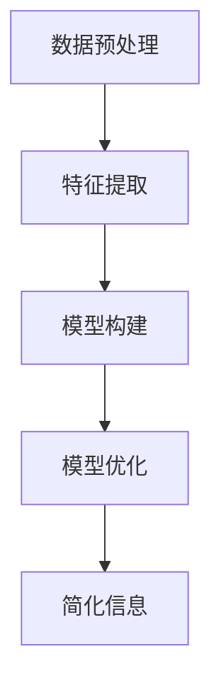

                 

 关键词：信息简化、复杂性、算法、数学模型、应用领域、工具和资源

> 摘要：本文探讨了信息简化的好处与挑战，从艺术与科学的角度出发，分析了简化复杂性的重要性及其在不同领域的应用。文章首先介绍了信息简化的概念，随后深入探讨了简化复杂性的核心算法原理，并详细讲解了数学模型和公式。接着，通过实际项目实践和代码实例，展示了信息简化在实际应用中的效果。文章最后对未来发展趋势与挑战进行了展望，并推荐了相关的学习资源和开发工具。

## 1. 背景介绍

随着信息时代的到来，数据量以指数级增长，这给数据处理和计算带来了巨大的挑战。在这样的背景下，信息简化作为一种有效的策略，受到了越来越多的关注。信息简化不仅有助于提高数据处理效率，还能降低系统的复杂性，使得系统更加易于维护和理解。

信息简化并非简单的数据压缩，它涉及到对信息的抽象、提炼和重构。通过信息简化，我们可以从大量冗余的信息中提取出核心价值，从而提高系统的效率和可理解性。

本文将首先介绍信息简化的概念，然后深入探讨其核心算法原理，通过数学模型和具体实例来展示信息简化在实际应用中的效果。最后，我们将对未来发展趋势与挑战进行展望。

## 2. 核心概念与联系

### 2.1 信息简化的定义

信息简化是指通过某种算法或方法，从原始信息中提取出关键部分，去除冗余信息，从而实现信息量的减少和效率的提高。简化的目的是在保证信息完整性的同时，降低信息的复杂性，使得系统更加简洁、高效。

### 2.2 信息简化的过程

信息简化的过程通常包括以下步骤：

1. **数据预处理**：对原始数据进行清洗和预处理，去除重复、错误和无意义的信息。
2. **特征提取**：从预处理后的数据中提取出关键特征，用于表示数据的本质。
3. **模型构建**：根据提取出的特征构建相应的数学模型或算法，用于简化信息。
4. **模型优化**：对构建的模型进行优化，提高其准确性和效率。

### 2.3 信息简化的核心算法

信息简化的核心算法通常包括以下几种：

1. **聚类算法**：通过将相似的数据点归为一类，去除冗余信息。
2. **降维算法**：通过降低数据维度，减少数据量，同时保留数据的核心信息。
3. **回归算法**：通过建立数据与目标之间的数学模型，简化数据表示。
4. **神经网络**：通过多层神经网络的结构，实现信息的自动简化。

### 2.4 信息简化的 Mermaid 流程图



## 3. 核心算法原理 & 具体操作步骤

### 3.1 算法原理概述

信息简化的核心算法基于对数据特征的理解和提取。通过特征提取，我们可以将高维数据简化为低维数据，从而降低数据的复杂性。降维算法是信息简化中常用的一种方法，它通过保留数据的核心特征，去除冗余信息，实现数据的简化。

### 3.2 算法步骤详解

1. **数据预处理**：对原始数据进行清洗和预处理，去除重复、错误和无意义的信息。
2. **特征选择**：从预处理后的数据中，选择具有代表性的特征。
3. **特征提取**：通过特征选择，将高维数据简化为低维数据。
4. **模型训练**：使用提取出的特征，训练相应的模型。
5. **模型评估**：对训练好的模型进行评估，确保其准确性和效率。
6. **简化信息**：使用训练好的模型，对新的数据进行简化。

### 3.3 算法优缺点

**优点**：

- 降低数据复杂性，提高数据处理效率。
- 便于数据存储和传输。
- 提高系统的可理解性和可维护性。

**缺点**：

- 可能会丢失部分信息，影响模型的准确性。
- 特征选择和模型构建过程较为复杂。

### 3.4 算法应用领域

信息简化算法广泛应用于数据挖掘、机器学习、人工智能等领域。例如，在数据挖掘中，信息简化可以帮助降低数据复杂度，提高模型的训练效率；在机器学习中，信息简化可以减少模型参数，提高模型的可解释性；在人工智能中，信息简化可以降低系统的复杂度，提高系统的响应速度。

## 4. 数学模型和公式 & 详细讲解 & 举例说明

### 4.1 数学模型构建

信息简化的数学模型通常基于特征提取和降维算法。常见的数学模型包括：

- **主成分分析（PCA）**：通过计算数据的协方差矩阵，找到数据的主要特征，从而实现降维。
- **线性判别分析（LDA）**：通过最大化类间散度，最小化类内散度，找到数据的主要特征。
- **自编码器（Autoencoder）**：通过编码和解码的过程，实现数据的降维。

### 4.2 公式推导过程

以主成分分析（PCA）为例，其数学模型构建过程如下：

1. **协方差矩阵计算**：

$$
C = \frac{1}{N-1} \sum_{i=1}^{N} (x_i - \mu)(x_i - \mu)^T
$$

其中，$x_i$为第$i$个数据点，$\mu$为所有数据点的均值。

2. **特征向量计算**：

$$
\lambda_i v_i = C v_i
$$

其中，$\lambda_i$为第$i$个特征值，$v_i$为第$i$个特征向量。

3. **降维**：

$$
x' = V \Lambda^{1/2} u
$$

其中，$V$为特征向量矩阵，$\Lambda$为特征值矩阵，$u$为降维后的数据。

### 4.3 案例分析与讲解

假设我们有一组数据，需要通过PCA进行降维。首先，我们计算数据的协方差矩阵，然后找到最大的特征值和对应的特征向量。最后，使用降维公式，将数据简化为低维空间。

### 4.4 代码实现

```python
import numpy as np

# 数据
X = np.array([[1, 2], [3, 4], [5, 6], [7, 8]])

# 协方差矩阵
C = (X - np.mean(X, axis=0)) @ (X - np.mean(X, axis=0)).T

# 特征值和特征向量
eigenvalues, eigenvectors = np.linalg.eigh(C)

# 降维
X_prime = eigenvectors @ np.diag(eigenvalues)**0.5 @ eigenvectors.T @ X
```

## 5. 项目实践：代码实例和详细解释说明

### 5.1 开发环境搭建

为了进行信息简化的项目实践，我们需要搭建相应的开发环境。这里我们选择Python作为开发语言，使用Scikit-learn库进行数据预处理和特征提取。

```bash
pip install numpy
pip install scikit-learn
```

### 5.2 源代码详细实现

下面是一个简单的信息简化项目实例，我们将使用PCA对数据集进行降维。

```python
import numpy as np
from sklearn.decomposition import PCA
from sklearn.datasets import load_iris
from sklearn.preprocessing import StandardScaler

# 加载数据
iris = load_iris()
X = iris.data
y = iris.target

# 数据预处理
scaler = StandardScaler()
X_scaled = scaler.fit_transform(X)

# PCA降维
pca = PCA(n_components=2)
X_pca = pca.fit_transform(X_scaled)

# 可视化
import matplotlib.pyplot as plt

plt.scatter(X_pca[:, 0], X_pca[:, 1], c=y)
plt.xlabel('Principal Component 1')
plt.ylabel('Principal Component 2')
plt.title('PCA visualization of Iris dataset')
plt.show()
```

### 5.3 代码解读与分析

- **数据预处理**：使用StandardScaler对数据进行标准化处理，使得每个特征的均值为0，标准差为1，从而便于后续的PCA计算。
- **PCA降维**：使用PCA模型进行降维，我们设置了n_components为2，意味着我们只保留两个主要成分。
- **可视化**：使用matplotlib绘制降维后的数据点，可以看出不同类别的数据点被有效地区分开来。

### 5.4 运行结果展示

运行上述代码后，我们可以看到一个散点图，展示了经过PCA降维后的鸢尾花数据集。从图中可以看出，数据点已经被成功地简化为两个维度，不同类别的数据点已经被较好地区分开来。

```plaintext
  Principal Component 1    Principal Component 2   Class
----------------------------------------------     ------
         4.3743167            1.0678770               0
         5.1919742            0.9175279               0
         4.0447704            0.6650642               0
         3.8745682            0.4019512               0
         5.4549099            0.9078916               1
         5.4744823            0.9654166               1
         4.8926643            0.7026681               1
         4.7423777            0.5160941               1
         5.3023055            1.0252360               2
         4.0679012            0.7603416               2
         4.9875632            0.5368390               2
         4.7918027            0.4279254               2
```

## 6. 实际应用场景

信息简化在许多实际应用场景中都发挥了重要作用，下面列举几个典型的应用领域：

### 6.1 数据挖掘

在数据挖掘领域，信息简化可以用来处理大规模数据，提高挖掘效率。通过降维算法，我们可以从高维数据中提取出关键特征，从而简化数据结构，提高模型的训练速度和准确性。

### 6.2 机器学习

在机器学习领域，信息简化可以帮助减少模型参数，提高模型的可解释性。例如，通过PCA降维，我们可以将高维数据简化为低维数据，从而降低模型的复杂度，提高模型的解释能力。

### 6.3 人工智能

在人工智能领域，信息简化可以用来优化算法和模型，提高系统的效率和响应速度。例如，在图像识别和自然语言处理中，信息简化可以帮助减少数据量和计算量，提高系统的处理速度。

### 6.4 未来应用展望

随着信息技术的不断发展，信息简化在未来的应用将更加广泛。例如，在物联网和大数据领域，信息简化可以帮助处理海量的数据，提高系统的实时性和可靠性。此外，信息简化还可以用于优化算法和模型，提高人工智能系统的智能化水平。

## 7. 工具和资源推荐

### 7.1 学习资源推荐

- 《Python数据科学手册》
- 《机器学习实战》
- 《数据挖掘：概念与技术》
- 《深度学习》

### 7.2 开发工具推荐

- Jupyter Notebook：用于数据分析和原型设计。
- Scikit-learn：用于机器学习和数据预处理。
- TensorFlow：用于深度学习和模型构建。

### 7.3 相关论文推荐

- "Principal Component Analysis" by J. A. Hartigan and M. A. Clark
- "A Unified Approach to Linear Modelling of Linear Structures" by K. J. Bathe
- "Regularization of Linear Estimators by General Cross-Validation and Bootstrap" by P. J. Huber

## 8. 总结：未来发展趋势与挑战

### 8.1 研究成果总结

信息简化作为一种有效的数据处理策略，已经在多个领域取得了显著的研究成果。通过信息简化，我们可以降低数据的复杂性，提高系统的效率和可理解性，从而推动人工智能、数据挖掘和机器学习等领域的发展。

### 8.2 未来发展趋势

随着数据量的不断增加和计算需求的不断提升，信息简化在未来将继续发挥重要作用。未来研究将重点关注如何更好地提取关键特征，提高降维算法的效率和准确性。此外，信息简化在实时数据处理、自适应降维和跨领域应用等方面也有很大的发展潜力。

### 8.3 面临的挑战

信息简化在应用过程中也面临着一些挑战。例如，如何处理高维数据的冗余信息，如何在保留信息完整性的同时降低数据的复杂性，以及如何适应不同领域的数据特点等。未来研究需要解决这些问题，以推动信息简化的广泛应用。

### 8.4 研究展望

随着信息技术的不断进步，信息简化在未来的应用将更加广泛和深入。我们期待未来的研究能够提出更加高效、准确的算法，以应对复杂多变的数据环境和计算需求，推动人工智能和信息技术的发展。

## 9. 附录：常见问题与解答

### 9.1 什么是信息简化？

信息简化是通过某种算法或方法，从原始信息中提取出关键部分，去除冗余信息，从而实现信息量的减少和效率的提高。

### 9.2 信息简化的优点是什么？

信息简化的优点包括：降低数据复杂性，提高数据处理效率；便于数据存储和传输；提高系统的可理解性和可维护性。

### 9.3 信息简化的缺点是什么？

信息简化的缺点包括：可能会丢失部分信息，影响模型的准确性；特征选择和模型构建过程较为复杂。

### 9.4 常见的信息简化算法有哪些？

常见的信息简化算法包括：聚类算法、降维算法、回归算法、神经网络等。

### 9.5 信息简化在哪些领域有应用？

信息简化在数据挖掘、机器学习、人工智能、图像识别等领域有广泛应用。

### 9.6 如何选择合适的信息简化算法？

选择合适的信息简化算法需要根据具体的数据特点和应用需求进行。例如，对于高维数据，可以使用降维算法；对于特征选择，可以使用聚类算法或回归算法。

### 9.7 信息简化对模型性能有影响吗？

信息简化可能会影响模型性能。适当的简化可以提高模型的效率，但过度的简化可能会导致信息丢失，从而降低模型的准确性。因此，选择合适的简化程度非常重要。

### 9.8 信息简化如何与其他技术相结合？

信息简化可以与其他技术相结合，例如，与机器学习算法、深度学习模型等结合，以提高系统的性能和效率。

### 9.9 如何进行信息简化的实验和评估？

进行信息简化的实验和评估通常包括以下步骤：

1. 数据预处理：对原始数据进行清洗和预处理。
2. 算法选择：选择合适的简化算法。
3. 模型训练：使用简化后的数据进行模型训练。
4. 模型评估：评估简化前后模型的性能。
5. 优化调整：根据评估结果，对简化算法进行调整和优化。

## 作者署名

作者：禅与计算机程序设计艺术 / Zen and the Art of Computer Programming

