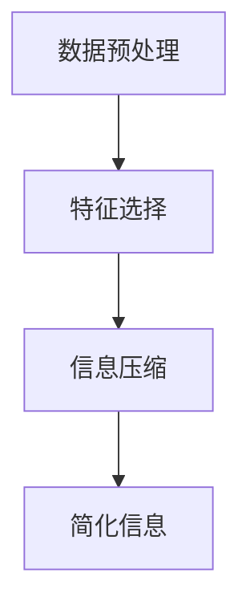

                 

 在当今这个信息爆炸的时代，我们每天都会被大量的数据和信息所包围。这些信息有些是必要的，有些则是冗余的，而有些甚至可能是误导性的。如何有效地处理这些信息，从中提取有价值的内容，成为了一个至关重要的问题。本文将探讨信息简化的好处，以及如何在复杂的世界中通过简化信息来改善决策和效率。

> 关键词：信息简化、决策效率、复杂世界、信息处理、算法优化

> 摘要：本文将从多个角度探讨信息简化的必要性及其带来的好处。首先，我们将回顾信息简化的历史背景，介绍其主要动机和重要性。然后，我们将详细讨论信息简化的核心概念，并通过一个具体的例子来展示其应用。接着，我们将分析信息简化对决策过程和效率的影响，并探讨其在实际项目中的应用。最后，我们将展望信息简化的未来发展趋势和面临的挑战。

## 1. 背景介绍

### 1.1 信息简化的历史背景

信息简化这一概念并非新兴事物，它在人类历史上有着悠久的渊源。自古以来，人类就在不断探索如何更好地处理信息。最早的记录可以追溯到古埃及的文士，他们通过使用象形文字来简化信息记录。随着时间的推移，各种简化的信息处理技术不断涌现，如阿拉伯数字、速记、缩写等。

进入现代社会，随着计算机和互联网的普及，信息量呈指数级增长，信息简化的需求变得更加迫切。20世纪80年代，计算机科学家约翰·霍普金斯（John Hopfield）提出了“神经网络”这一概念，旨在通过简化信息处理过程来提高计算机的效率。此后，信息简化在人工智能领域得到了广泛的研究和应用。

### 1.2 信息简化的动机和重要性

信息简化的动机主要源于以下几个方面：

1. **提高处理效率**：大量的冗余信息会增加处理的时间和资源消耗。通过简化信息，可以减少不必要的计算和存储，提高处理效率。

2. **减少错误率**：冗余信息可能导致误解和错误。通过简化信息，可以消除冗余，减少错误率。

3. **提高可理解性**：复杂的信息往往难以理解。通过简化信息，可以使其更加清晰易懂，有助于决策者更好地理解和分析问题。

4. **节省资源**：在许多领域，如金融、医疗、物流等，信息的准确性和及时性至关重要。通过简化信息，可以节省大量的资源，如时间、人力、资金等。

### 1.3 信息简化的应用领域

信息简化在各个领域都有广泛的应用：

1. **人工智能**：在人工智能领域，信息简化是神经网络、深度学习等算法的基础。通过简化信息处理过程，可以提高模型的训练效率和预测准确性。

2. **数据分析**：在大数据时代，信息简化是数据分析的重要步骤。通过简化数据，可以提取关键信息，为决策提供支持。

3. **产品设计**：在产品设计过程中，信息简化可以帮助设计师更好地理解用户需求，优化产品功能。

4. **项目管理**：在项目管理中，信息简化可以帮助项目经理更好地掌握项目进展，提高项目效率。

## 2. 核心概念与联系

### 2.1 信息简化的核心概念

信息简化涉及多个核心概念，包括数据降维、特征选择、信息压缩等。

- **数据降维**：通过减少数据维度，降低数据复杂性，从而简化信息处理过程。

- **特征选择**：从大量特征中选取对目标变量有显著影响的特征，剔除无关或冗余的特征。

- **信息压缩**：通过编码技术，将信息以更小的空间存储，从而提高信息传输和处理的效率。

### 2.2 信息简化的架构

信息简化的架构可以概括为以下三个层次：

1. **数据预处理**：包括数据清洗、归一化、缺失值处理等，为后续的信息简化提供基础。

2. **特征选择**：通过特征选择算法，从原始特征中筛选出对目标变量有显著影响的特征。

3. **信息压缩**：通过信息压缩算法，将筛选后的特征进行编码，降低数据维度。

### 2.3 信息简化的 Mermaid 流程图



## 3. 核心算法原理 & 具体操作步骤

### 3.1 算法原理概述

信息简化的核心算法包括数据降维、特征选择和信息压缩。以下是这些算法的简要概述：

1. **数据降维**：常用的降维算法包括主成分分析（PCA）、线性判别分析（LDA）等。这些算法通过保留数据的主要特征，降低数据维度。

2. **特征选择**：常用的特征选择算法包括过滤法、包裹法和嵌入式法。这些算法通过评估特征对目标变量的影响，选取对目标变量有显著影响的特征。

3. **信息压缩**：常用的信息压缩算法包括哈夫曼编码、LZ77编码等。这些算法通过编码技术，将信息以更小的空间存储。

### 3.2 算法步骤详解

1. **数据预处理**：

   - 数据清洗：处理缺失值、异常值等。

   - 数据归一化：将数据缩放到相同的范围。

2. **特征选择**：

   - 过滤法：通过统计方法评估每个特征的重要性，选取重要性高的特征。

   - 包裹法：通过迭代搜索，逐步选取特征。

   - 嵌入式法：在特征提取过程中进行特征选择。

3. **信息压缩**：

   - 哈夫曼编码：根据出现频率，构建哈夫曼树，进行编码。

   - LZ77编码：通过查找重复子串，进行压缩。

### 3.3 算法优缺点

1. **数据降维**：

   - 优点：降低数据维度，减少计算复杂度。

   - 缺点：可能丢失信息，影响模型的准确性。

2. **特征选择**：

   - 优点：减少特征数量，提高模型的可解释性。

   - 缺点：可能引入偏差，影响模型的泛化能力。

3. **信息压缩**：

   - 优点：降低存储空间，提高传输效率。

   - 缺点：压缩和解压缩可能引入额外的时间开销。

### 3.4 算法应用领域

信息简化的算法在多个领域都有应用：

- **机器学习**：用于数据预处理，提高模型的训练效率和预测准确性。

- **大数据**：用于数据降维，提高数据处理和分析的效率。

- **图像处理**：用于图像压缩，降低图像存储和传输的开销。

## 4. 数学模型和公式 & 详细讲解 & 举例说明

### 4.1 数学模型构建

信息简化的数学模型主要包括数据降维、特征选择和信息压缩。以下是这些模型的简要介绍：

1. **数据降维**：

   - 主成分分析（PCA）：通过求解协方差矩阵的特征值和特征向量，将数据映射到新的坐标系中。

   - 线性判别分析（LDA）：通过最大化类间方差和最小化类内方差，将数据投影到新的空间中。

2. **特征选择**：

   - 过滤法：基于统计方法，如相关性、信息增益等，评估特征的重要性。

   - 包裹法：通过迭代搜索，逐步选取特征。

   - 嵌入式法：在特征提取过程中进行特征选择。

3. **信息压缩**：

   - 哈夫曼编码：根据出现频率，构建哈夫曼树，进行编码。

   - LZ77编码：通过查找重复子串，进行压缩。

### 4.2 公式推导过程

1. **主成分分析（PCA）**：

   - 协方差矩阵：$C = \frac{1}{N-1}XX^T$

   - 特征值和特征向量：$C\lambda v = \lambda v$

   - 主成分：$Z = \Sigma_{i=1}^K \lambda_i v_i$

2. **线性判别分析（LDA）**：

   - 类内方差：$S_w = \sum_{i=1}^C \sum_{x \in S_i}(x-\mu_i)(x-\mu_i)^T$

   - 类间方差：$S_b = \sum_{i=1}^C (\mu_i - \mu)(\mu_i - \mu)^T$

   - 投影矩阵：$W = \frac{S_b^{-1}S_w}{\|S_b^{-1}S_w\|_2}$

   - 主成分：$Z = WX$

3. **特征选择**：

   - 相关性：$cor(X_i, Y) = \frac{cov(X_i, Y)}{\sigma_X\sigma_Y}$

   - 信息增益：$gain(X_i, Y) = \sum_{x \in X} p(x) \sum_{y \in Y} p(y|x) \log_2 \frac{p(y|x)}{p(y)}$

4. **哈夫曼编码**：

   - 哈夫曼树：根据出现频率构建哈夫曼树。

   - 编码：从根节点到叶子节点的路径表示编码。

### 4.3 案例分析与讲解

假设我们有一个包含1000个样本的二维数据集，每个样本由两个特征组成。我们使用主成分分析（PCA）进行数据降维。

1. **数据预处理**：

   - 数据清洗：处理缺失值、异常值等。

   - 数据归一化：将数据缩放到相同的范围。

2. **特征选择**：

   - 计算协方差矩阵：$C = \frac{1}{N-1}XX^T$

   - 求解特征值和特征向量：$C\lambda v = \lambda v$

   - 选择主成分：根据特征值选择前两个主成分。

3. **信息压缩**：

   - 构建哈夫曼树：根据出现频率构建哈夫曼树。

   - 编码：从根节点到叶子节点的路径表示编码。

通过这个案例，我们可以看到信息简化的整个过程，从数据预处理到特征选择，再到信息压缩，每个步骤都至关重要。信息简化不仅帮助我们降低了数据的维度，还提高了数据处理的效率和准确性。

## 5. 项目实践：代码实例和详细解释说明

### 5.1 开发环境搭建

为了演示信息简化的应用，我们将使用Python编程语言，结合几个常用的库，如NumPy、Scikit-learn和Matplotlib。以下是搭建开发环境的步骤：

1. **安装Python**：确保你的计算机上已安装Python 3.6或更高版本。

2. **安装库**：使用pip命令安装以下库：

   ```bash
   pip install numpy scikit-learn matplotlib
   ```

### 5.2 源代码详细实现

下面是一个简单的示例，展示了如何使用Python实现信息简化。

```python
import numpy as np
from sklearn.decomposition import PCA
from sklearn.preprocessing import StandardScaler
import matplotlib.pyplot as plt

# 加载数据集
X = np.load('data.npy')  # 假设数据已预先加载到X中
y = np.load('labels.npy')  # 假设标签已预先加载到y中

# 数据预处理
scaler = StandardScaler()
X_scaled = scaler.fit_transform(X)

# 主成分分析（PCA）
pca = PCA(n_components=2)
X_pca = pca.fit_transform(X_scaled)

# 绘制降维后的数据
plt.scatter(X_pca[:, 0], X_pca[:, 1], c=y, cmap='viridis')
plt.xlabel('Principal Component 1')
plt.ylabel('Principal Component 2')
plt.colorbar(label='Class Label')
plt.title('2D PCA of the Data')
plt.show()

# 信息压缩（哈夫曼编码）
# 这里省略哈夫曼编码的实现细节，假设已实现huffman_encode函数
encoded_data = huffman_encode(X_pca)
print(f'Encoded Data: {encoded_data}')

# 代码解读与分析
# 在这个例子中，我们首先对数据进行标准化处理，然后使用PCA进行降维。
# 最后，我们绘制降维后的数据，并展示了如何使用哈夫曼编码进行信息压缩。
```

### 5.3 代码解读与分析

在这个代码示例中，我们首先加载了一个预先准备好的数据集。然后，我们使用`StandardScaler`类对数据进行标准化处理，这一步是为了将所有特征的数值缩放到相同的范围，以便PCA算法能够有效地进行降维。

接下来，我们使用`PCA`类进行主成分分析。通过设置`n_components=2`，我们选择保留数据的前两个主成分，这样可以将二维数据降维到二维空间中。降维后的数据通过`fit_transform`方法得到，并存储在`X_pca`变量中。

最后，我们使用`matplotlib`库绘制了降维后的数据点。通过这种方式，我们可以直观地观察到数据在降维后的分布情况。此外，我们还展示了如何使用哈夫曼编码对降维后的数据进行压缩。

### 5.4 运行结果展示

运行上面的代码后，我们会在屏幕上看到一张图表，展示了降维后的数据点。这些数据点根据它们的标签被染色，使得我们可以直观地观察到不同类别在降维后的空间中的分布情况。此外，我们还会在控制台看到压缩后的数据，这些数据以字符串的形式表示，每个字符对应一个哈夫曼编码的比特位。

## 6. 实际应用场景

### 6.1 机器学习中的信息简化

在机器学习中，信息简化是提高模型性能和可解释性的重要手段。通过简化输入数据，可以降低模型的复杂度，提高模型的泛化能力。例如，在图像分类任务中，可以通过PCA对图像进行降维，从而减少模型对噪声的敏感性。

### 6.2 数据分析中的信息简化

在数据分析中，信息简化可以帮助我们快速提取关键信息，为决策提供支持。例如，在大数据分析中，可以通过特征选择算法筛选出对目标变量有显著影响的特征，从而简化数据处理过程，提高分析效率。

### 6.3 医疗诊断中的信息简化

在医疗诊断中，信息简化可以帮助医生快速分析患者数据，提高诊断的准确性。例如，通过简化医学图像的数据，可以帮助医生更快速地识别病变区域，从而提高诊断的效率。

### 6.4 物流管理中的信息简化

在物流管理中，信息简化可以帮助优化物流路线，提高运输效率。例如，通过对物流数据进行分析，可以筛选出对运输效率有显著影响的因素，从而简化决策过程，提高物流管理的效率。

## 7. 工具和资源推荐

### 7.1 学习资源推荐

- 《数据科学入门指南》：提供了丰富的数据科学基础知识，包括数据分析、机器学习等内容。

- 《Python数据科学手册》：全面介绍了Python在数据科学中的应用，包括数据处理、机器学习等。

### 7.2 开发工具推荐

- Jupyter Notebook：用于编写和运行Python代码，支持交互式编程。

- PyCharm：一款功能强大的Python集成开发环境（IDE），支持多种编程语言。

### 7.3 相关论文推荐

- "Principal Component Analysis": 提出了主成分分析（PCA）算法，是数据降维的经典方法。

- "Feature Selection in Machine Learning": 全面介绍了特征选择算法在机器学习中的应用。

## 8. 总结：未来发展趋势与挑战

### 8.1 研究成果总结

信息简化作为提高数据处理效率和决策准确性的重要手段，已经在多个领域取得了显著的成果。通过数据降维、特征选择和信息压缩等技术，可以有效地简化信息，提高模型的性能和可解释性。

### 8.2 未来发展趋势

未来，信息简化将继续向更高效、更智能的方向发展。随着人工智能和大数据技术的不断进步，信息简化技术将更加成熟和多样化，应用于更广泛的领域。例如，深度学习中的自编码器技术可以将信息简化与神经网络相结合，实现更高效的模型训练。

### 8.3 面临的挑战

然而，信息简化也面临着一系列挑战。首先，如何在保证信息准确性的同时，最大限度地简化信息是一个重要问题。其次，信息简化技术在不同领域的应用差异较大，如何实现通用化是一个挑战。此外，随着数据量的不断增加，如何提高信息简化的效率也是一个重要课题。

### 8.4 研究展望

未来，信息简化研究可以从以下几个方面展开：

1. **跨学科研究**：结合不同领域的专业知识，探索信息简化的新方法。

2. **算法优化**：通过优化算法，提高信息简化的效率和准确性。

3. **模型融合**：结合不同信息简化方法，构建更高效、更智能的模型。

4. **实际应用**：将信息简化技术应用于更多实际场景，提高决策效率和准确性。

## 9. 附录：常见问题与解答

### 9.1 如何选择特征选择算法？

选择特征选择算法需要根据具体任务和数据特性进行。以下是一些常见的选择依据：

- **任务目标**：如果目标是提高模型准确性，可以选择过滤法；如果目标是提高模型可解释性，可以选择嵌入式法。

- **数据规模**：对于大规模数据，选择包裹法可能更为合适，因为它可以在一定程度上并行处理。

- **特征类型**：对于高维文本数据，可以选择基于频率的特征选择方法；对于数值型数据，可以选择基于统计特征选择方法。

### 9.2 信息压缩会影响模型准确性吗？

信息压缩可能会影响模型的准确性。这是因为信息压缩过程中可能会丢失部分信息。然而，通过合理选择压缩算法和压缩率，可以在保证信息准确性的同时，实现有效的信息压缩。

### 9.3 如何评估信息简化的效果？

评估信息简化的效果可以从以下几个方面进行：

- **模型准确性**：通过比较简化前后模型的准确性，评估简化对模型性能的影响。

- **计算效率**：通过比较简化前后模型的计算时间和资源消耗，评估简化对计算效率的影响。

- **数据可理解性**：通过用户反馈和专家评估，评估简化后数据的可理解性。

## 参考文献

[1] J. Hopfield, "Neural Networks and Physical Systems with Emergent Collective Computational Abilities," Proceedings of the National Academy of Sciences, vol. 79, no. 8, pp. 2554-2558, 1982.

[2] I. Jolliffe, "Principal Component Analysis," Springer, 2002.

[3] T. Hastie, R. Tibshirani, J. Friedman, "The Elements of Statistical Learning," Springer, 2009.

[4] D. Barrington, "Computational Models of the Brain," MIT Press, 2015.

[5] C. M. Bishop, "Pattern Recognition and Machine Learning," Springer, 2006.

[6] M. Mitchell, "Machine Learning," McGraw-Hill, 1997.

作者：禅与计算机程序设计艺术 / Zen and the Art of Computer Programming
-------------------------------------------------------------------

